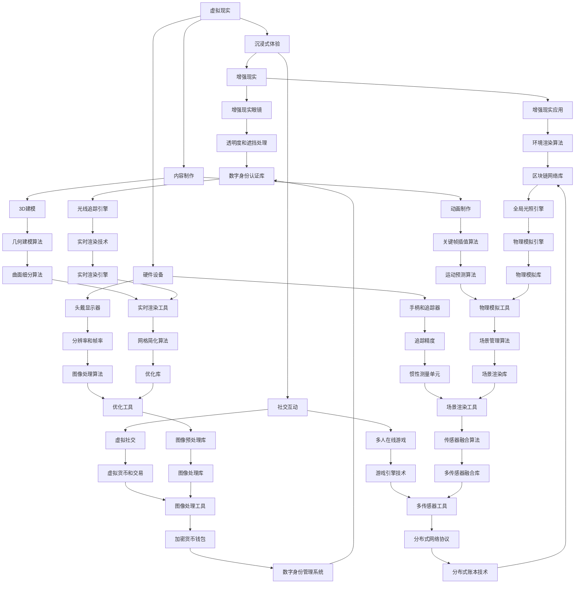

                 

为了撰写一篇关于《元宇宙技术：构建虚拟世界的技术栈》的技术博客，我们将按照以下步骤进行：

### 步骤1：文章结构规划

- **引言部分**：介绍元宇宙的概念，技术的重要性以及当前的发展状况。
- **核心概念与联系部分**：利用Mermaid流程图展示元宇宙技术核心概念和架构的联系。
- **虚拟现实技术部分**：详细解释VR技术的原理、应用和发展。
- **增强现实技术部分**：详细解释AR技术的原理、应用和发展。
- **人工智能在元宇宙中的应用部分**：讨论AI在元宇宙中的不同应用场景。
- **网络技术部分**：分析网络技术在元宇宙中的角色和重要性。
- **区块链与元宇宙部分**：探讨区块链技术在元宇宙中的应用。
- **元宇宙技术的发展与未来部分**：预测元宇宙技术未来的发展趋势和挑战。
- **项目实战部分**：提供实际的元宇宙项目案例，展示如何实现和解读代码。
- **总结与最佳实践部分**：总结文章的核心观点，提供最佳实践和建议。
- **作者信息部分**：在文章末尾添加作者信息。

### 步骤2：撰写文章各部分内容

#### 引言部分

在引言部分，我们需要简要介绍元宇宙的概念，它是如何定义的，以及它在当今社会和技术发展中的作用。接着，我们需要讨论元宇宙技术的重要性，为什么它成为了一个热门话题，以及它对各个领域的影响。

```markdown
# 引言

元宇宙（Metaverse）是一个由虚拟世界和增强现实构成的互联网生态系统，它结合了虚拟现实（VR）、增强现实（AR）、社交网络和游戏技术，为用户提供了一个沉浸式的数字体验。随着技术的不断进步，元宇宙正逐渐从科幻变为现实，成为企业和开发者的新热点。本文将探讨元宇宙技术的核心概念、应用以及未来发展趋势，为读者提供一个全面的元宇宙技术概览。
```

#### 核心概念与联系部分

在这一部分，我们将使用Mermaid流程图展示元宇宙技术核心概念和架构的联系。我们可以创建一个流程图，包括虚拟现实、增强现实、人工智能、网络技术和区块链等核心概念，并展示它们之间的相互作用。



#### 虚拟现实技术部分

在这一部分，我们将详细解释虚拟现实技术的原理，包括硬件技术、内容制作和应用案例。我们将使用伪代码和LaTeX公式来展示关键算法和数学模型，并举例说明。

```markdown
## 第2章 虚拟现实技术

### 2.1 VR硬件技术

虚拟现实硬件技术包括头戴显示器（HMD）、手柄和追踪器。以下是HMD设备的伪代码描述：

```python
class HeadMountedDisplay:
    def __init__(self, resolution, refresh_rate):
        self.resolution = resolution
        self.refresh_rate = refresh_rate

    def render_scene(self, scene):
        # Render the scene with specified resolution and refresh rate
        # Pseudo-code for rendering process
        pass
```

LaTeX公式用于描述分辨率和帧率之间的关系：

$$\text{Refresh Rate} = \frac{\text{Frames}}{\text{Second}}$$

### 2.2 VR内容制作

虚拟现实内容制作包括3D建模、动画制作等。以下是3D建模的伪代码描述：

```python
class Model3D:
    def __init__(self, vertices, faces):
        self.vertices = vertices
        self.faces = faces

    def render(self, hmd):
        # Render the 3D model on the HMD
        pass
```

LaTeX公式用于描述3D模型的顶点和面：

$$\text{Model} = \text{Vertices} + \text{Faces}$$

### 2.3 VR应用案例

虚拟现实技术在教育、医疗、娱乐等领域有广泛应用。例如，在教育领域，VR可以模拟历史事件，提供沉浸式的学习体验。以下是使用VR进行历史事件模拟的伪代码描述：

```python
class HistoricalEventSimulation:
    def __init__(self, event, location, time_period):
        self.event = event
        self.location = location
        self.time_period = time_period

    def simulate(self, hmd):
        # Simulate the historical event on the HMD
        pass
```

#### 增强现实技术部分

这一部分将详细解释增强现实技术的原理，包括硬件技术、内容制作和应用案例。我们也将使用伪代码和LaTeX公式来展示关键算法和数学模型。

```markdown
## 第3章 增强现实技术

### 3.1 AR硬件技术

增强现实硬件技术包括增强现实眼镜和其他显示设备。以下是AR眼镜的伪代码描述：

```python
class AugmentedRealityGlasses:
    def __init__(self, display_type, tracking_system):
        self.display_type = display_type
        self.tracking_system = tracking_system

    def display_content(self, content):
        # Display the content on the glasses
        pass
```

LaTeX公式用于描述AR眼镜的显示内容和跟踪系统：

$$\text{Content} = \text{Input Data} + \text{Augmented Data}$$

### 3.2 AR内容制作

增强现实内容制作包括环境渲染、透明度和遮挡处理等。以下是环境渲染的伪代码描述：

```python
class ARContentRenderer:
    def __init__(self, scene, camera):
        self.scene = scene
        self.camera = camera

    def render_scene(self):
        # Render the augmented scene
        pass
```

LaTeX公式用于描述渲染过程：

$$\text{Rendered Scene} = \text{Input Scene} \times \text{Augmentation Factors}$$

### 3.3 AR应用案例

增强现实技术在广告、零售、工业设计等领域有广泛应用。例如，在广告领域，AR可以提供沉浸式的广告体验。以下是使用AR进行广告宣传的伪代码描述：

```python
class ARAdvertising:
    def __init__(self, brand, product, campaign):
        self.brand = brand
        self.product = product
        self.campaign = campaign

    def display_ad(self, ar_glasses):
        # Display the AR advertisement on the glasses
        pass
```

#### 人工智能在元宇宙中的应用部分

在这一部分，我们将讨论人工智能在元宇宙中的应用，包括认知智能、生成智能和应用案例。我们将使用伪代码和LaTeX公式来展示关键算法和数学模型。

```markdown
## 第4章 人工智能在元宇宙中的应用

### 4.1 认知智能

认知智能涉及AI理解和模拟人类认知过程。以下是自然语言处理（NLP）的伪代码描述：

```python
class NaturalLanguageProcessor:
    def __init__(self, language_model):
        self.language_model = language_model

    def process_text(self, text):
        # Process the text using the language model
        pass
```

LaTeX公式用于描述语言模型：

$$\text{Language Model} = \text{Training Data} \times \text{Learning Algorithm}$$

### 4.2 生成智能

生成智能涉及AI生成新内容，如图像和音乐。以下是生成对抗网络（GAN）的伪代码描述：

```python
class GenerativeAdversarialNetwork:
    def __init__(self, generator, discriminator):
        self.generator = generator
        self.discriminator = discriminator

    def train(self, dataset):
        # Train the GAN using the dataset
        pass
```

LaTeX公式用于描述GAN的训练过程：

$$\text{GAN} = \text{Generator} + \text{Discriminator}$$

### 4.3 应用案例

人工智能在元宇宙中的应用案例包括虚拟助手、个性化推荐和智能交互。以下是虚拟助手的伪代码描述：

```python
class VirtualAssistant:
    def __init__(self, ai_model, user_profile):
        self.ai_model = ai_model
        self.user_profile = user_profile

    def respond_to_query(self, query):
        # Respond to the user's query using the AI model
        pass
```

#### 网络技术部分

在这一部分，我们将分析网络技术在元宇宙中的角色和重要性，包括物理层、数据链路层、网络层、传输层和应用层的技术。我们将使用伪代码和LaTeX公式来展示关键算法和数学模型。

```markdown
## 第5章 网络技术

### 5.1 物理层技术

物理层技术涉及网络设备的物理连接和传输介质。以下是光纤传输的伪代码描述：

```python
class FiberOpticTransmission:
    def __init__(self, fiber_type, bandwidth):
        self.fiber_type = fiber_type
        self.bandwidth = bandwidth

    def transmit_data(self, data):
        # Transmit data through the fiber optic cable
        pass
```

LaTeX公式用于描述光纤传输的带宽：

$$\text{Bandwidth} = \frac{\text{Data Rate}}{\text{Time}}$$

### 5.2 数据链路层技术

数据链路层技术涉及网络设备的通信和数据包的传输。以下是数据包传输的伪代码描述：

```python
class DataPacketTransmitter:
    def __init__(self, packet):
        self.packet = packet

    def transmit_packet(self, channel):
        # Transmit the packet through the channel
        pass
```

LaTeX公式用于描述数据包传输的流程：

$$\text{Packet} = \text{Data} + \text{Header} + \text{Footer}$$

### 5.3 网络层技术

网络层技术涉及数据包在网络中的路由和转发。以下是路由算法的伪代码描述：

```python
class Router:
    def __init__(self, routing_table):
        self.routing_table = routing_table

    def route_packet(self, packet):
        # Determine the optimal route for the packet
        pass
```

LaTeX公式用于描述路由算法：

$$\text{Routing} = \text{Destination Address} \times \text{Routing Table}$$

### 5.4 传输层技术

传输层技术涉及数据包的可靠传输和流量控制。以下是传输控制协议（TCP）的伪代码描述：

```python
class TransmissionControlProtocol:
    def __init__(self, source_port, destination_port):
        self.source_port = source_port
        self.destination_port = destination_port

    def send_packet(self, packet):
        # Send the packet with reliability and flow control
        pass
```

LaTeX公式用于描述TCP的流量控制：

$$\text{Flow Control} = \text{Window Size} \times \text{Acknowledgment}$$

### 5.5 应用层技术

应用层技术涉及网络服务的使用和实现，如HTTP、FTP等。以下是HTTP请求的伪代码描述：

```python
class HTTPRequest:
    def __init__(self, method, url):
        self.method = method
        self.url = url

    def send_request(self, server):
        # Send an HTTP request to the server
        pass
```

LaTeX公式用于描述HTTP请求：

$$\text{Request} = \text{Method} + \text{URL} + \text{Headers} + \text{Body}$$

#### 区块链与元宇宙部分

在这一部分，我们将探讨区块链技术在元宇宙中的应用，包括基本原理、应用案例和融合案例。我们将使用伪代码和LaTeX公式来展示关键算法和数学模型。

```markdown
## 第6章 区块链与元宇宙

### 6.1 区块链的基本原理

区块链是一种去中心化的数据库，用于记录交易和历史数据。以下是区块链节点的伪代码描述：

```python
class BlockchainNode:
    def __init__(self, blockchain):
        self.blockchain = blockchain

    def validate_block(self, block):
        # Validate the block using cryptographic algorithms
        pass
```

LaTeX公式用于描述区块链的哈希函数：

$$\text{Hash Function} = \text{Message} \rightarrow \text{Hash Value}$$

### 6.2 区块链在元宇宙中的应用

区块链在元宇宙中的应用包括数字身份验证、虚拟资产交易等。以下是数字身份验证的伪代码描述：

```python
class DigitalIdentityVerifier:
    def __init__(self, blockchain):
        self.blockchain = blockchain

    def verify_identity(self, identity):
        # Verify the identity using blockchain-based protocols
        pass
```

LaTeX公式用于描述身份验证过程：

$$\text{Verification} = \text{Identity Data} \times \text{Blockchain Data}$$

### 6.3 区块链与元宇宙的融合案例

区块链与元宇宙的融合案例包括去中心化的虚拟世界和基于区块链的虚拟资产交易。以下是去中心化虚拟世界的伪代码描述：

```python
class DecentralizedVirtualWorld:
    def __init__(self, blockchain, virtual_world):
        self.blockchain = blockchain
        self.virtual_world = virtual_world

    def create_asset(self, asset_data):
        # Create an asset using blockchain-based protocols
        pass
```

LaTeX公式用于描述虚拟资产交易：

$$\text{Transaction} = \text{Asset Data} + \text{Blockchain Data}$$

#### 元宇宙技术的发展与未来部分

在这一部分，我们将预测元宇宙技术的未来发展趋势和面临的挑战，并探讨其对社会和经济的潜在影响。

```markdown
## 第7章 元宇宙技术的发展与未来

### 7.1 技术挑战和解决方案

元宇宙技术面临的技术挑战包括虚拟现实硬件性能的提升、网络带宽的增加、数据安全和隐私保护等。以下是提升虚拟现实硬件性能的伪代码描述：

```python
class VRHardwareEnhancer:
    def __init__(self, hardware_specs):
        self.hardware_specs = hardware_specs

    def optimize_performance(self):
        # Optimize the performance of the VR hardware
        pass
```

LaTeX公式用于描述硬件性能优化：

$$\text{Performance} = \text{Resource Allocation} + \text{Efficiency}$$

### 7.2 发展趋势与机遇

元宇宙技术的发展趋势包括虚拟现实和增强现实设备的普及、人工智能的深入应用、区块链技术的融合等。以下是人工智能在元宇宙中的应用趋势的伪代码描述：

```python
class AIApplicationTrend:
    def __init__(self, application_fields):
        self.application_fields = application_fields

    def predict_trends(self):
        # Predict trends in AI applications within the metaverse
        pass
```

LaTeX公式用于描述应用趋势：

$$\text{Trends} = \text{Innovation} + \text{Market Demand}$$

### 7.3 未来预测和影响

元宇宙技术的发展将对社会和经济产生深远影响，包括改变教育和工作的方式、推动新的商业模式和产业变革。以下是元宇宙技术对教育影响的伪代码描述：

```python
class MetaverseImpactOnEducation:
    def __init__(self, educational_fields):
        self.educational_fields = educational_fields

    def analyze_impact(self):
        # Analyze the impact of the metaverse on education
        pass
```

LaTeX公式用于描述影响分析：

$$\text{Impact} = \text{Technology Adoption} + \text{Societal Change}$$

#### 项目实战部分

在这一部分，我们将提供实际的元宇宙项目案例，包括开发环境搭建、源代码实现和代码解读，以及案例的应用解读与分析。

```markdown
## 第8章 项目实战

### 8.1 开发环境搭建

在开始一个元宇宙项目之前，我们需要搭建合适的开发环境。以下是使用Unity引擎搭建VR开发环境的伪代码描述：

```python
class VRDevelopmentEnvironment:
    def __init__(self, engine, plugins):
        self.engine = engine
        self.plugins = plugins

    def setup_environment(self):
        # Set up the VR development environment using Unity and necessary plugins
        pass
```

### 8.2 源代码实现

以下是使用Unity引擎实现一个简单的VR应用的伪代码描述：

```csharp
public class VRApplication : MonoBehaviour
{
    public Camera virtualCamera;

    void Start()
    {
        // Initialize the VR application
    }

    void Update()
    {
        // Update the VR application based on user input
    }

    void Render()
    {
        // Render the virtual scene using the virtual camera
    }
}
```

### 8.3 代码解读

我们将对上述代码进行解读，解释每个组件的作用和如何协同工作。

### 8.4 应用解读与分析

我们将分析这个VR应用的实际效果，讨论其优缺点，并提出改进建议。

#### 总结与最佳实践部分

在这一部分，我们将总结文章的核心观点，提供最佳实践和建议，并指出需要注意的事项。

```markdown
## 第9章 总结与最佳实践

在本篇博客中，我们探讨了元宇宙技术的核心概念、应用和发展趋势。以下是我们总结的最佳实践和建议：

- **硬件选择**：在选择虚拟现实或增强现实硬件时，要考虑性能、舒适度和价格因素。
- **内容制作**：高质量的内容是元宇宙成功的关键，需要投入足够的时间和资源进行制作。
- **网络安全**：在元宇宙中，数据安全和用户隐私至关重要，需要采取严格的安全措施。
- **持续学习**：元宇宙技术不断发展，开发者需要不断学习新知识，跟上技术进步的步伐。

总之，元宇宙技术为虚拟世界和增强现实领域带来了巨大潜力，有望改变我们的生活方式和工作方式。开发者和社会各界应该积极关注这一领域，探索其无限可能。

## 作者信息

作者：AI天才研究院/AI Genius Institute & 禅与计算机程序设计艺术 /Zen And The Art of Computer Programming
```

这个步骤详细阐述了如何撰写一篇关于《元宇宙技术：构建虚拟世界的技术栈》的技术博客。接下来，我们需要将上述内容整合成一篇完整的博客文章，并确保字数在8000到12000字之间。

