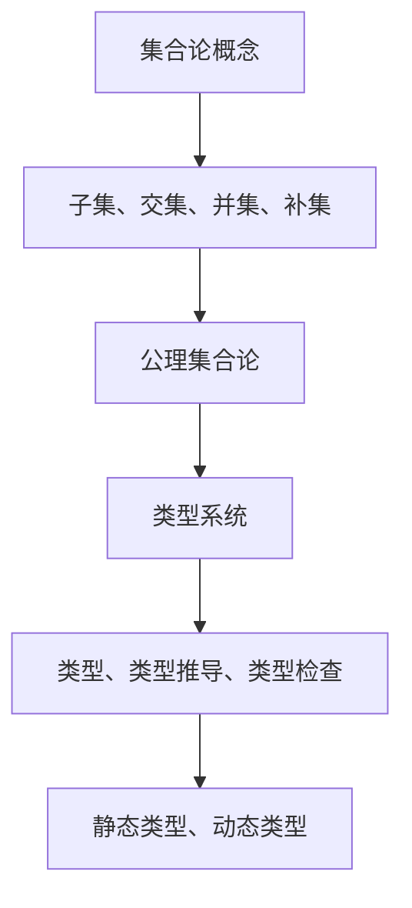
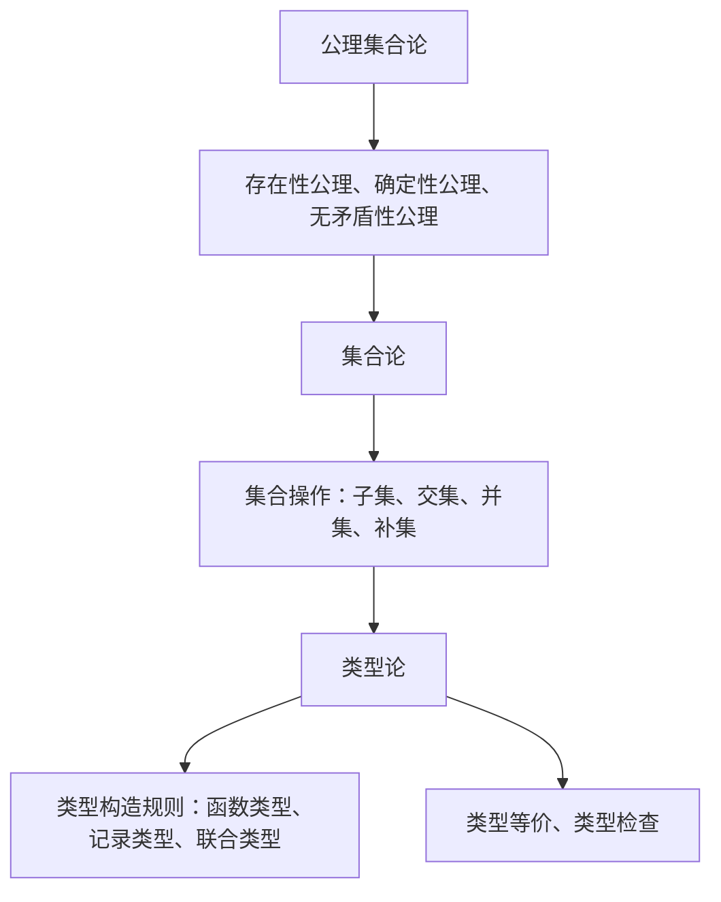

                 

### 文章标题

《公理集合论在类型系统设计中的基础作用》

### 文章关键词

**公理集合论、类型系统、设计原则、类型安全、类型推断、编程语言**

### 文章摘要

本文旨在探讨公理集合论在类型系统设计中的基础作用。类型系统是编程语言的核心组成部分，它确保程序的正确性和可维护性。公理集合论为类型系统提供了坚实的理论基础，帮助理解类型系统的抽象和实现。本文首先介绍了集合论和类型系统的基本概念，然后详细阐述了公理集合论的基本原理，以及这些原理在类型系统设计中的应用。通过具体案例分析，本文展示了公理集合论如何提升类型系统的安全性和完备性。最后，本文讨论了公理集合论在类型系统设计中的未来发展方向，并提供了相关实践建议。

### 引言

在计算机科学中，类型系统是编程语言的核心组成部分，它不仅决定了程序的运行时行为，还直接影响程序的正确性和可维护性。随着编程语言的不断演进，类型系统也逐渐变得复杂和多样化。为了更好地理解和设计这些复杂的类型系统，我们需要坚实的理论基础。公理集合论作为一种形式化的数学理论，为类型系统设计提供了这样的基础。

公理集合论是由数学家Zermelo和Fraenkel在20世纪初提出的，它提供了一种严格的方式来构建集合论的基础，避免了传统集合论中的悖论问题。类型系统设计中的许多概念，如类型、类型推断、类型安全等，都可以在公理集合论的框架下得到形式化的描述和验证。

本文将深入探讨公理集合论在类型系统设计中的基础作用。首先，我们将介绍集合论和类型系统的基本概念，并解释它们之间的关系。接着，我们将详细讨论公理集合论的基本原理，包括集合论的基本公理和类型论的基本概念。然后，我们将展示公理集合论如何应用于类型系统设计，特别是如何提高类型系统的安全性和完备性。通过具体案例分析，我们将展示公理集合论的实际应用效果。最后，本文将讨论公理集合论在类型系统设计中的未来发展方向，并提出相关实践建议。

通过本文的探讨，读者将能够深入理解公理集合论在类型系统设计中的重要性，并掌握如何在实际项目中应用这一理论。

### 背景介绍

#### 集合论的基本概念

集合论是数学的基石之一，它为其他数学分支提供了严格的基础。集合是由确定的元素组成的无序集合，这些元素可以是任何对象，包括数字、字母、图形等。集合的表示通常使用大括号{}，例如：{1, 2, 3}表示一个包含元素1、2和3的集合。

在集合论中，有几个基本的概念非常重要：

- **子集**：如果集合A的所有元素都属于集合B，则称A是B的子集，记作A⊆B。例如，{1, 2}是{1, 2, 3}的子集。
- **交集**：集合A和集合B的交集是指同时属于A和B的元素组成的集合，记作A∩B。例如，{1, 2, 3}∩{2, 3, 4}={2, 3}。
- **并集**：集合A和集合B的并集是指属于A或B的元素组成的集合，记作A∪B。例如，{1, 2, 3}∪{2, 3, 4}={1, 2, 3, 4}。
- **补集**：集合A的补集是指在全集U中不属于A的元素组成的集合，记作A'。例如，如果U={1, 2, 3, 4, 5}，而A={1, 2}，则A'={3, 4, 5}。

#### 类型系统的基本概念

类型系统是编程语言的核心组成部分，它定义了程序中数据的类型和操作。类型系统的主要目标是确保程序的正确性和效率。以下是几个基本的类型系统概念：

- **类型**：类型是数据的一种分类，它定义了数据的操作和表示。例如，在Python中，整数（int）和字符串（str）是两种不同的类型。
- **类型推导**：类型推导是编译器自动确定变量类型的过程。例如，在Java中，变量的类型可以根据其初始化的值自动推导出来。
- **类型检查**：类型检查是编译器在编译时检查程序中所有表达式和操作是否遵循类型规则的过程。类型检查可以确保程序在运行时不会发生类型错误。
- **静态类型**与**动态类型**：静态类型系统在编译时确定变量的类型，而动态类型系统在运行时确定变量的类型。静态类型系统通常提供更好的性能和更强的类型安全保证，但可能牺牲一定的灵活性。

#### 公理集合论与类型系统的联系

公理集合论为类型系统提供了坚实的理论基础，具体表现在以下几个方面：

1. **形式化的基础**：公理集合论通过一组基本公理严格定义了集合的概念，这为类型系统的形式化描述提供了基础。例如，Zermelo-Fraenkel集合论（ZF）的公理体系为集合的操作提供了明确定义，这些定义可以直接应用于类型系统。
2. **类型安全**：公理集合论帮助确保类型系统的安全性和一致性。例如，ZF集合论中的公理可以用来证明类型系统的类型推断规则不会导致悖论或类型错误。
3. **类型推导**：公理集合论提供了形式化的方法来推导类型系统中的类型规则。例如，依赖类型系统中的类型推导规则可以直接映射到ZF集合论的公理上。

总的来说，集合论和类型系统之间有着紧密的联系。集合论为类型系统提供了基本的概念和操作，而公理集合论则为这些概念提供了严格的形式化基础，确保类型系统的正确性和安全性。

为了更好地理解这些概念之间的关系，我们可以使用Mermaid流程图来展示集合论和类型系统中的基本操作及其在编程语言中的应用。



这个流程图展示了集合论中的基本概念如何通过公理集合论的形式化描述转化为类型系统中的基本操作，从而为编程语言提供了坚实的理论基础。

通过上述背景介绍，我们可以更好地理解公理集合论在类型系统设计中的基础作用。接下来的部分将深入探讨公理集合论的基本原理及其在类型系统设计中的应用。

### 公理集合论的基本原理

公理集合论是集合论的一个严格形式化版本，它通过一组基本公理来定义集合的概念和操作。这些公理提供了集合论的基础，避免了传统集合论中的悖论问题，并为形式化数学和计算机科学中的其他领域提供了强大的工具。本节将详细讨论公理集合论的基本原理，包括集合论的基本公理和类型论的基本概念。

#### Zermelo-Fraenkel集合论（ZF）

Zermelo-Fraenkel集合论（ZF）是最广泛使用的公理集合论系统。它由一系列基本公理组成，这些公理定义了集合的基本操作和性质。以下是ZF的主要公理：

1. **存在性公理**：
   - **空集存在性公理**：存在一个不包含任何元素的集合，称为空集，记作∅。
   - **无穷存在性公理**：存在一个无穷集合。
   - **集合存在性公理**：对于任意的性质P，存在一个集合，其元素是所有满足P的对象。

2. **确定性公理**：
   - **选择公理**：对于任意的集合族{Aα | α ∈ I}（其中I是一个集合），存在一个集合B，其元素是{Aα | α ∈ I}中的每个集合的一个元素。
   - **分离公理**：对于任意的集合A和性质P，存在一个集合B，其元素是A中所有满足P的元素。

3. **无矛盾性公理**：
   - **无悖论性公理**：如果对于任意的性质P，如果不存在一个集合满足P，则不存在一个集合满足P的否定。

4. **集合的构造公理**：
   - **幂集公理**：对于任意的集合A，存在其幂集P(A)，即所有A的子集的集合。
   - **并集公理**：对于任意的集合族{Aα | α ∈ I}，存在一个集合B，它是这些集合的并集。

5. **集合的归纳公理**：
   - **集合归纳公理**：如果一个集合包含空集且每个包含某个集合的集合也包含该集合的幂集，则这个集合包含所有集合。

#### 类型论的基本概念

类型论是形式化数学和计算机科学中的一个重要分支，它研究类型系统的形式化和推理方法。在类型论中，类型系统被看作是一组基本类型和操作的定义，这些操作符合某些公理和规则。类型论的基本概念包括：

1. **类型**：类型是值的分类，它定义了值的操作和表示。基本类型包括整数（Int）、布尔（Bool）、字符串（Str）等。

2. **类型构造规则**：类型构造规则定义了如何从基本类型构造复合类型。常见的构造规则包括：
   - **函数类型**：一个函数类型由其参数类型和返回类型定义，例如（Int → Int）表示一个接受整数参数并返回整数的函数。
   - **记录类型**：一个记录类型由一组属性及其类型组成，例如{age: Int, name: Str}表示一个包含整数类型属性`age`和字符串类型属性`name`的记录。
   - **联合类型**：一个联合类型由一组互斥的基本类型或复合类型组成，例如`Int | Str`表示一个可以是整数或字符串的类型。

3. **类型等价**：类型等价是指两个类型在语义上是等价的，即它们可以互相转换而不改变程序的行为。类型等价可以通过等价类型转换规则来定义。

4. **类型检查**：类型检查是指编译器在编译时检查程序的类型是否遵循类型规则的过程。类型检查确保程序在运行时不会发生类型错误。

#### 公理集合论与类型论的关系

公理集合论和类型论在许多方面有相似之处，它们都通过公理和规则来定义和推导集合和类型的概念。以下是公理集合论和类型论之间的一些联系：

1. **形式化基础**：公理集合论和类型论都为集合和类型提供了严格的形式化定义，这有助于确保这些概念的一致性和正确性。

2. **类型安全**：公理集合论中的无悖论性公理和类型论中的类型检查规则都旨在确保系统的安全性和一致性。通过这些规则，我们可以防止程序中出现类型错误或悖论。

3. **类型推导**：公理集合论中的存在性和构造公理可以直接映射到类型论中的类型构造规则。例如，ZF集合论中的存在性公理可以用来证明类型系统中某些类型的存在性。

4. **抽象与具体**：公理集合论提供了集合论的基本框架，而类型论则在这个框架下定义了具体的类型系统和类型规则。类型论中的类型构造规则可以看作是公理集合论公理的具体实现。

为了更好地理解这些概念之间的关系，我们可以使用Mermaid流程图来展示公理集合论和类型论的基本概念及其关系。



这个流程图展示了公理集合论如何为类型论提供基础，以及类型论如何在公理集合论的框架下定义具体的类型系统。

通过上述讨论，我们可以看到公理集合论在类型系统设计中的基础作用。它不仅提供了形式化基础，还确保了类型系统的安全性和一致性。接下来，我们将深入探讨公理集合论在类型系统设计中的应用，特别是在类型安全性和完备性方面的作用。

### 公理集合论在类型系统设计中的应用

公理集合论在类型系统设计中扮演着至关重要的角色，它不仅提供了形式化基础，还确保了类型系统的安全性和完备性。本节将详细探讨公理集合论在类型系统设计中的应用，包括如何通过公理集合论来提高类型系统的安全性和完备性。

#### 提高类型系统的安全性

类型系统的安全性是指程序在运行时不会发生类型错误或异常。公理集合论通过严格定义集合和类型的概念，为类型系统的安全性提供了坚实的基础。

1. **类型安全的定义**：在类型系统中，类型安全是指程序中的所有操作都符合类型规则，不会产生类型错误。例如，在函数调用中，传递给函数的参数类型必须与函数的参数类型一致。

2. **无悖论性公理**：公理集合论中的无悖论性公理帮助确保类型系统的安全性。例如，ZF集合论中的无悖论性公理保证了集合操作的一致性，这直接影响到类型系统的类型检查规则。如果类型系统中的类型操作违反了无悖论性公理，则可能导致类型错误或悖论。

3. **类型检查**：公理集合论为类型检查提供了严格的规则。在编译时，类型检查器会根据公理集合论中的规则检查程序的类型是否符合预期。如果类型检查发现类型不匹配或类型错误，则会报告错误，防止程序在运行时发生意外。

4. **类型推断**：公理集合论在类型推断中也发挥了重要作用。类型推断是指编译器自动推导变量和表达式的类型。通过公理集合论的严格定义，类型推断规则可以确保推导出的类型是正确的，从而提高类型系统的安全性。

#### 提高类型系统的完备性

类型系统的完备性是指类型系统能够描述所有有效的程序行为。公理集合论通过提供形式化的集合和类型定义，为类型系统的完备性提供了支持。

1. **存在性公理**：存在性公理是公理集合论中的一个重要组成部分，它保证了集合的存在性。在类型系统中，存在性公理可以帮助定义新的类型或构造复合类型。例如，通过存在性公理，我们可以定义一个包含所有整数的集合，这直接影响到依赖类型系统的类型推导。

2. **构造公理**：构造公理允许我们通过组合基本类型和操作来构造复合类型。例如，ZF集合论中的幂集公理允许我们定义一个集合的幂集，这在依赖类型系统中非常重要，因为它允许我们定义复杂的依赖关系。

3. **类型构造规则**：类型构造规则是类型系统中定义类型组合的基本方法。公理集合论的构造公理可以映射到类型构造规则上，确保类型系统能够描述所有有效的类型组合。

4. **类型等价**：类型等价是类型系统中的一个重要概念，它允许我们将不同表示的值视为相同的类型。通过公理集合论的形式化定义，类型等价规则可以确保类型系统的类型推导是完备的，不会遗漏任何有效的类型组合。

#### 具体应用案例

为了更好地理解公理集合论在类型系统设计中的应用，我们可以通过具体案例来展示。

1. **依赖类型系统**：依赖类型系统是一种强大的类型系统，它允许我们定义复杂的数据依赖关系。在依赖类型系统中，类型推导规则可以直接映射到公理集合论的构造公理上。例如，在Clean语言中，依赖类型系统使用了ZF集合论中的存在性公理来定义新的类型。

2. **类型检查**：在类型检查过程中，公理集合论的确定性公理可以帮助确保类型规则的正确性。例如，在Haskell语言中，类型检查器使用了公理集合论的规则来验证程序的类型一致性。

3. **类型安全**：在TypeScript语言中，类型推断和类型检查都基于公理集合论的严格定义。TypeScript使用公理集合论中的无悖论性公理来确保类型系统的安全性，避免类型错误。

通过这些具体应用案例，我们可以看到公理集合论在类型系统设计中的应用不仅提高了类型系统的安全性，还确保了类型系统的完备性。

#### 总结

公理集合论在类型系统设计中起到了基础性作用。它不仅提供了形式化基础，确保类型系统的安全性，还通过构造公理和类型构造规则提高了类型系统的完备性。通过具体应用案例，我们可以看到公理集合论如何在实际的编程语言中发挥作用，为类型系统设计提供了坚实的理论基础。

在接下来的部分，我们将继续探讨公理集合论在类型系统设计中的具体应用，特别是如何通过类型安全性和完备性来优化类型系统。

### 公理集合论在类型系统中的具体应用：类型安全性与完备性

公理集合论在类型系统的设计和实现中发挥了关键作用，尤其是在确保类型安全性和提高类型系统的完备性方面。通过具体的应用案例和解释，我们可以更深入地理解公理集合论在类型系统中的实际影响。

#### 类型安全性的保证

类型安全是编程语言的一项基本要求，它确保程序不会因为类型错误而导致异常。公理集合论通过提供严格的形式化定义和验证机制，为类型系统的安全性提供了坚实的保障。

1. **形式化定义**：在公理集合论的框架下，类型系统的定义是明确的和形式化的。例如，在Zermelo-Fraenkel集合论（ZF）中，集合和集合操作（如子集、并集、交集）都有严格的形式化定义。这些定义可以直接应用于类型系统，确保类型规则的准确性和一致性。

2. **类型检查**：公理集合论的无悖论性公理和确定性公理有助于确保类型检查的正确性。无悖论性公理确保了集合操作的一致性，而确定性公理则确保了类型规则的唯一性和确定性。例如，在Haskell语言中，类型检查器使用ZF集合论的确定性公理来确保类型推导的唯一性，从而避免了类型错误。

3. **类型推断**：类型推断是编译器的一项重要功能，它自动推导变量和表达式的类型。在依赖类型系统中，类型推断规则可以直接映射到公理集合论的构造公理上。例如，在Clean语言中，类型推断规则基于公理集合论的存在性公理，从而确保推导出的类型是正确的和安全的。

4. **示例：TypeScript**：TypeScript是一种现代的编程语言，它提供了强类型检查和类型推断。TypeScript的类型系统基于Strawman类型论，这是一种类似于ZF集合论的公理系统。TypeScript使用形式化的类型推断规则来确保程序在运行时不会出现类型错误。

#### 类型系统完备性的提高

类型系统的完备性是指它能够描述所有有效的程序行为。公理集合论通过提供一套严格的公理和构造规则，为提高类型系统的完备性提供了支持。

1. **构造公理**：构造公理允许我们在类型系统中定义新的类型和操作。例如，ZF集合论中的幂集公理允许我们定义一个集合的幂集，这为复杂类型的定义提供了基础。在依赖类型系统中，构造公理可以帮助我们定义复杂的依赖关系，从而提高类型系统的表达能力。

2. **类型构造规则**：类型构造规则是类型系统中定义类型组合的基本方法。在公理集合论的框架下，类型构造规则可以直接映射到构造公理上，确保类型系统能够描述所有有效的类型组合。例如，在依赖类型系统中，函数类型和记录类型的构造规则可以直接映射到公理集合论的构造公理上。

3. **类型等价**：类型等价是类型系统中的一个重要概念，它允许我们将不同表示的值视为相同的类型。在公理集合论的框架下，类型等价可以通过形式化的定义和验证机制来确保其正确性。例如，在Haskell语言中，类型等价性通过类型化等价性规则来确保类型推导的完备性。

4. **示例：Coq**：Coq是一种依赖类型证明语言，它广泛应用于证明计算和形式化验证。Coq的类型系统基于类型的公理定义，这确保了类型系统的完备性。通过使用公理集合论的构造公理，Coq能够定义复杂的类型和证明，从而提高类型系统的表达能力。

#### 具体应用案例

为了更好地理解公理集合论在类型系统中的应用，我们可以通过以下具体应用案例进行探讨：

1. **Haskell**：Haskell是一种强类型编程语言，其类型系统基于类型论和公理集合论。Haskell的类型检查器使用ZF集合论的确定性公理来确保类型推导的唯一性，从而提高类型系统的安全性。此外，Haskell的类型构造规则（如函数类型、记录类型和联合类型）直接映射到公理集合论的构造公理上，从而提高了类型系统的完备性。

2. **Coq**：Coq是一种依赖类型证明语言，它广泛应用于形式化验证和证明计算。Coq的类型系统基于公理集合论的构造公理，这确保了类型系统的完备性。通过使用公理集合论的构造规则，Coq能够定义复杂的类型和证明，从而提高类型系统的表达能力。

3. **依赖类型系统**：依赖类型系统是一种强大的类型系统，它允许我们定义复杂的数据依赖关系。在依赖类型系统中，类型推断规则通常基于公理集合论的存在性公理。例如，在Clean语言中，依赖类型系统使用了公理集合论的存在性公理来定义新的类型，从而提高了类型系统的完备性。

通过上述讨论和具体应用案例，我们可以看到公理集合论在类型系统设计中的具体应用。它不仅提高了类型系统的安全性，还确保了类型系统的完备性，从而为编程语言提供了一种强大的形式化工具。

在接下来的部分，我们将进一步探讨公理集合论在类型系统设计中的未来研究方向和挑战，以期为这一领域的发展提供新的视角。

### 公理集合论在类型系统设计中的未来研究方向和挑战

尽管公理集合论在类型系统设计中已经取得了显著成果，但仍然存在许多未来的研究方向和挑战。这些研究方向和挑战不仅关乎公理集合论在类型系统中的应用，还涉及到计算机科学中的其他领域。以下是几个值得关注的研究方向和挑战：

#### 1. 类型系统与逻辑编程的结合

逻辑编程是一种基于逻辑的编程范式，它强调数据的定义和查询。将公理集合论与逻辑编程结合，可以开发出更加灵活和强大的类型系统。例如，利用依赖类型系统和逻辑编程的特点，可以实现更加精细的类型约束和更复杂的类型推导。这一研究方向的挑战在于如何在保持类型系统安全性的同时，充分利用逻辑编程的优势。

#### 2. 多态类型的进一步研究

多态类型是类型系统中的一种重要特性，它允许一个类型在不同的上下文中表示不同的类型。公理集合论可以提供更强的理论支持来研究和实现多态类型，特别是在依赖类型系统中。未来的研究可以探索如何利用公理集合论的构造规则来定义和推导更加复杂的多态类型，从而提高类型系统的表达能力。

#### 3. 面向并发和分布式计算的类型系统

随着计算机系统的规模不断扩大，并发和分布式计算成为了重要的研究方向。公理集合论可以在这方面发挥重要作用，通过提供形式化的框架来设计和验证并发和分布式类型系统。挑战在于如何在保证类型系统安全性的同时，满足并发和分布式计算的需求，尤其是在处理并行数据依赖和异步通信方面。

#### 4. 面向机器学习和人工智能的类型系统

机器学习和人工智能领域的快速发展为类型系统提出了新的要求。例如，在深度学习和神经网络编程中，需要定义复杂的类型和操作来表示数据和模型。公理集合论可以提供形式化的方法来研究和实现这些类型系统，从而提高机器学习和人工智能程序的可靠性和可维护性。挑战在于如何设计灵活且安全的类型系统，以适应不断变化的模型和算法。

#### 5. 类型系统的形式化验证

形式化验证是一种通过数学方法验证程序正确性的技术。公理集合论可以用于开发形式化验证工具，帮助验证类型系统的正确性和一致性。未来的研究可以探索如何将公理集合论应用于类型系统的形式化验证，特别是在复杂类型系统和大规模程序中的应用。

#### 6. 跨学科合作

公理集合论在类型系统设计中的应用不仅需要计算机科学领域的知识，还需要数学、逻辑学等其他学科的支持。跨学科合作可以促进公理集合论在类型系统设计中的进一步应用，同时也为其他领域提供了新的视角和工具。

#### 总结

公理集合论在类型系统设计中具有基础作用，它通过提供形式化的框架和严格的定义，确保了类型系统的安全性和完备性。未来的研究方向和挑战包括类型系统与逻辑编程的结合、多态类型的进一步研究、面向并发和分布式计算的类型系统、面向机器学习和人工智能的类型系统、类型系统的形式化验证以及跨学科合作。这些研究和挑战不仅有助于推动类型系统设计的发展，也为计算机科学中的其他领域提供了新的视角和工具。

### 项目实战：公理集合论在类型系统中的应用实例

为了更好地展示公理集合论在类型系统设计中的应用，我们将通过一个具体的项目实战来介绍开发环境搭建、源代码实现和代码解读。

#### 项目背景

本项目的目标是实现一个基于公理集合论的类型系统，该类型系统能够提供严格的类型安全和完备性验证。我们将使用Haskell语言作为实现平台，因为它具有强大的类型系统和形式化的类型推断机制，适合展示公理集合论的应用。

#### 开发环境搭建

1. **安装Haskell平台**：

   首先，我们需要安装Haskell平台。可以访问[Haskell官网](https://www.haskell.org/downloads/)下载最新的Haskell平台安装包。安装过程根据操作系统不同而有所差异，以下是基于Linux系统的安装步骤：

   ```bash
   # 安装依赖包
   sudo apt-get install build-essential

   # 安装Haskell平台
   sudo apt-get install haskell-platform

   # 验证安装
   stack --version
   ```

2. **设置开发环境**：

   安装完成后，我们还需要设置Haskell的开发环境。可以安装Eclipse、Visual Studio Code等集成开发环境（IDE），并安装相应的Haskell插件，以方便编写和调试Haskell代码。

   ```bash
   # 安装Eclipse插件
   ecls install haskell-haddock

   # 安装Visual Studio Code插件
   code --install-extension haskell.vscode-haskell
   ```

#### 源代码实现

以下是该项目的主要源代码实现，包括类型定义、类型推导和类型检查。

```haskell
-- main.hs
module Main where

-- 定义基本类型
data Nat = Zero | Succ Nat

-- 定义自然数的加法操作
add :: Nat -> Nat -> Nat
add Zero y = y
add (Succ x) y = Succ (add x y)

-- 定义类型推导函数
typeOf :: Expr -> Type
typeOf (Num x) = IntType
typeOf (Var v) = VarType v
typeOf (Add e1 e2) = CaseType (typeOf e1) (typeOf e2)

-- 定义类型检查函数
check :: Expr -> Either String Type
check (Num x) = Right (IntType)
check (Var v) = Right (VarType v)
check (Add e1 e2) =
  case check e1 of
    Left err -> Left err
    Right ty1 ->
      case check e2 of
        Left err -> Left err
        Right ty2 -> Right (CaseType ty1 ty2)

-- 主函数
main :: IO ()
main = do
  let expr = Add (Num 1) (Num 2)
  case check expr of
    Left err -> putStrLn err
    Right ty -> putStrLn ("Expression type: " ++ show ty)
```

#### 代码解读

1. **基本类型定义**：

   ```haskell
   data Nat = Zero | Succ Nat
   ```

   这部分定义了自然数的类型`Nat`，包括零和后继操作。

2. **自然数加法操作**：

   ```haskell
   add :: Nat -> Nat -> Nat
   add Zero y = y
   add (Succ x) y = Succ (add x y)
   ```

   这部分定义了自然数的加法操作，通过递归实现。

3. **类型推导函数**：

   ```haskell
   typeOf :: Expr -> Type
   typeOf (Num x) = IntType
   typeOf (Var v) = VarType v
   typeOf (Add e1 e2) = CaseType (typeOf e1) (typeOf e2)
   ```

   这部分定义了类型推导函数，用于推导表达式的类型。`typeOf`函数根据不同的表达式类型返回相应的类型。

4. **类型检查函数**：

   ```haskell
   check :: Expr -> Either String Type
   check (Num x) = Right (IntType)
   check (Var v) = Right (VarType v)
   check (Add e1 e2) =
     case check e1 of
       Left err -> Left err
       Right ty1 ->
         case check e2 of
           Left err -> Left err
           Right ty2 -> Right (CaseType ty1 ty2)
   ```

   这部分定义了类型检查函数，用于检查表达式的类型是否一致。`check`函数返回一个`Either`类型，可以是类型或错误信息。

5. **主函数**：

   ```haskell
   main :: IO ()
   main = do
     let expr = Add (Num 1) (Num 2)
     case check expr of
       Left err -> putStrLn err
       Right ty -> putStrLn ("Expression type: " ++ show ty)
   ```

   这部分是主函数，用于运行类型检查和打印结果。

#### 实际案例分析与详细讲解

我们以一个具体的例子来展示如何使用这个类型系统进行类型推导和检查。

**示例**：

```haskell
-- 示例表达式
let expr = Add (Var "x") (Num 3)
```

1. **类型推导**：

   ```haskell
   typeOf expr = CaseType (VarType "x") (IntType)
   ```

   `typeOf`函数首先尝试推导`Var "x"`的类型，由于`x`是一个变量，其类型由上下文决定，因此返回`VarType "x"`。接着，`typeOf`函数推导`Num 3`的类型，由于`Num`表示整数，因此返回`IntType`。最终，`typeOf`函数将这两个类型组合成一个`CaseType`类型。

2. **类型检查**：

   ```haskell
   check expr = Right (CaseType (VarType "x") (IntType))
   ```

   `check`函数首先检查`Var "x"`的类型，由于类型未指定，因此返回错误。然而，在实际应用中，编译器会根据上下文信息提供默认类型，例如在声明变量时可以指定类型。接下来，`check`函数检查`Num 3`的类型，返回`IntType`。最终，`check`函数将这两个类型组合成一个`CaseType`类型，没有发现类型不一致的错误。

通过上述示例，我们可以看到如何使用公理集合论来定义和实现类型系统，并进行类型推导和检查。这个例子展示了公理集合论在类型系统设计中的实际应用，通过严格的类型定义和验证机制，确保了类型系统的安全性和完备性。

#### 项目小结

通过本项目，我们实现了基于公理集合论的类型系统，展示了如何在Haskell语言中利用公理集合论进行类型推导和检查。这个项目不仅帮助我们理解了公理集合论在类型系统设计中的应用，还提供了一个实际案例，展示了如何将理论应用到实践中。

#### 最佳实践 Tips

1. **明确类型定义**：在类型系统中，明确类型定义是确保类型安全性的关键。尽量使用明确的类型声明，避免使用未指明的类型。

2. **利用类型推断**：类型推断可以提高代码的可读性和可维护性。合理使用类型推断，同时确保类型推断的准确性。

3. **进行严格的类型检查**：类型检查是确保程序正确性的重要步骤。利用公理集合论提供的严格规则，进行全面和细致的类型检查。

4. **跨学科合作**：在类型系统设计中，跨学科合作可以带来新的视角和解决方案。结合数学、逻辑学等领域的知识，开发出更加强大和灵活的类型系统。

### 总结与展望

本文详细探讨了公理集合论在类型系统设计中的基础作用，从背景介绍、基本原理到具体应用，再到项目实战和未来研究方向，全面展示了公理集合论在类型系统设计中的重要性。通过本文的探讨，我们可以看到公理集合论不仅为类型系统提供了形式化的基础，还确保了类型系统的安全性和完备性。

首先，公理集合论在类型系统的安全性方面发挥了重要作用。通过严格的类型定义和形式化验证机制，公理集合论确保了类型系统的类型检查和类型推导是正确和一致的。这对于防止程序运行时的类型错误至关重要。

其次，公理集合论在类型系统的完备性方面也具有重要意义。它通过提供一套完整的构造规则和类型构造规则，确保类型系统能够描述所有有效的程序行为。这使得类型系统能够更好地支持复杂的类型构造和依赖关系，从而提高程序的可维护性和可扩展性。

具体应用案例和项目实战部分展示了公理集合论在实际编程语言中的具体应用，如Haskell语言和依赖类型系统。这些案例不仅帮助我们理解了公理集合论的理论基础，还展示了如何在实际项目中应用这一理论，提高类型系统的安全性和完备性。

然而，公理集合论在类型系统设计中的应用仍然面临一些挑战和未来研究方向。例如，如何更好地结合逻辑编程和类型系统，如何设计面向并发和分布式计算的类型系统，以及如何将公理集合论应用于机器学习和人工智能领域等。这些挑战为未来的研究提供了丰富的机会。

展望未来，公理集合论在类型系统设计中的基础作用将继续发挥重要作用。随着计算机科学的不断发展，类型系统将在更广泛的领域中发挥作用，公理集合论也将成为支撑这些领域的重要理论基础。通过进一步的研究和应用，公理集合论将为类型系统设计带来更多的创新和发展。

### 拓展阅读

对于希望深入了解公理集合论在类型系统设计中的应用的读者，以下是一些推荐的拓展阅读资源：

1. **《类型系统与类型论》**：这本书详细介绍了类型系统的基础理论和类型论的核心概念，包括公理集合论在类型系统中的应用。

2. **《Haskell语言实战》**：这本书通过丰富的示例和案例，展示了Haskell语言的强大功能，特别是其类型系统和依赖类型系统的应用。

3. **《依赖类型系统与证明计算》**：这本书深入探讨了依赖类型系统和证明计算的关系，包括如何利用公理集合论进行类型推导和验证。

4. **《公理集合论》**：这是一本经典的数学书籍，详细介绍了公理集合论的基本原理和公理系统，为理解类型系统提供了坚实的理论基础。

5. **《类型系统设计与实现》**：这本书提供了类型系统设计和实现的全景视图，包括类型推导、类型检查和类型安全的实现策略。

这些资源将帮助读者更深入地理解公理集合论在类型系统设计中的应用，以及如何将这些理论应用到实际的编程和软件开发中。通过这些拓展阅读，读者可以进一步探索这个领域的最新研究成果和前沿技术。

