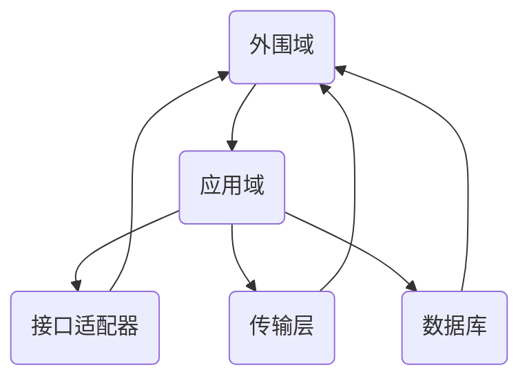

                 

### 文章标题: 六边形架构: 解耦业务逻辑与外部依赖

在软件架构设计中，六边形架构因其强大的解耦能力和高度的可扩展性而受到广泛关注。本文将深入探讨六边形架构的基本概念、核心原则、组成部分、设计流程、实际应用，并结合具体案例进行分析，旨在帮助读者全面理解六边形架构，掌握其在现代软件开发中的重要性。

### 文章关键词

- 六边形架构
- 解耦业务逻辑与外部依赖
- 外围域
- 应用域
- 接口适配器
- 微服务架构

### 文章摘要

本文将首先介绍六边形架构的起源和定义，解释其与传统架构的区别。接着，我们将深入探讨六边形架构的核心原则，特别是如何解耦业务逻辑与外部依赖。随后，文章将详细介绍六边形架构的组成部分，包括外围域、应用域、接口适配器、传输层和数据库。在实际应用部分，我们将通过具体案例展示六边形架构在企业级应用和微服务架构中的实际应用效果。最后，本文将总结六边形架构的设计流程，并提供一些最佳实践和注意事项。

## 背景介绍

### 六边形架构的起源

六边形架构起源于对传统分层架构的反思。在传统分层架构中，业务逻辑与外部依赖紧密耦合，导致系统难以扩展和维护。为了解决这个问题，六边形架构提出了全新的设计理念，即通过六边形结构将业务逻辑与外部依赖解耦，从而提高系统的灵活性和可维护性。

### 六边形架构的核心概念

六边形架构的核心概念包括：

- **外围域**：负责与外部系统交互，如API网关、数据存储等。
- **应用域**：包含业务逻辑的核心部分。
- **接口适配器**：用于与外围域通信的组件。
- **传输层**：负责数据传输的中间层。
- **数据库**：用于存储业务数据。

这些组成部分共同构成了六边形架构，使其具有强大的解耦能力和高度的可扩展性。

## 核心概念与联系

### 核心概念关系架构

为了更好地理解六边形架构的核心概念，我们可以用Mermaid流程图来表示它们之间的关系：



在这个图中，外围域（A）与应用域（B）通过接口适配器（C）、传输层（D）和数据库（E）进行通信。应用域（B）是业务逻辑的核心部分，而外围域（A）则负责与外部系统进行交互。这种结构确保了业务逻辑与外部依赖的解耦，提高了系统的灵活性。

### 核心概念详解

- **外围域**：外围域负责与外部系统交互，如API网关、数据存储等。它充当了一个中介角色，使得应用域可以独立于外部系统进行开发。外围域的好处是它可以方便地替换或扩展，而不会影响到应用域。
  
- **应用域**：应用域是业务逻辑的核心部分。它独立于外部系统，专注于处理业务逻辑。这种设计使得应用域可以更加专注和高效地处理业务需求，而不受外部系统的影响。

- **接口适配器**：接口适配器用于与外围域通信。它充当了一个桥梁，使得应用域可以通过标准化的接口与外围域进行通信。这种设计提高了系统的可扩展性和灵活性。

- **传输层**：传输层负责数据传输。它通常采用轻量级协议，如HTTP、HTTPS等，以确保数据传输的高效和安全性。

- **数据库**：数据库用于存储业务数据。它可以是一个关系型数据库，如MySQL、PostgreSQL，也可以是一个非关系型数据库，如MongoDB、Cassandra。数据库的设计和选择取决于具体的应用场景。

## 核心算法原理讲解

### 接口适配器实现

接口适配器的实现通常采用标准化的接口，使得应用域可以独立于外围域进行开发。以下是一个简单的伪代码示例：

```python
# 接口适配器伪代码

class APIAdapter:
    def request(self, url, method, data):
        # 发送HTTP请求
        response = http_request(url, method, data)
        return response

# 使用示例
adapter = APIAdapter()
response = adapter.request("https://api.example.com/data", "GET", {})
print(response)
```

在这个示例中，`APIAdapter` 类负责发送HTTP请求，并与外部系统进行交互。这种设计使得应用域可以独立于具体的API实现进行开发，提高了系统的可维护性和可扩展性。

### 传输层设计

传输层的设计需要考虑数据传输的高效性和安全性。以下是一个简单的伪代码示例：

```python
# 传输层伪代码

class TransportLayer:
    def send_data(self, data):
        # 发送数据
        encrypted_data = encrypt(data)
        response = http_request("https://transport.example.com/send", "POST", encrypted_data)
        return response

    def receive_data(self):
        # 接收数据
        encrypted_data = http_request("https://transport.example.com/receive", "GET")
        decrypted_data = decrypt(encrypted_data)
        return decrypted_data

# 使用示例
transport = TransportLayer()
response = transport.send_data("敏感数据")
print(response)

data = transport.receive_data()
print(data)
```

在这个示例中，`TransportLayer` 类负责加密和解密数据，并确保数据传输的高效性和安全性。这种设计使得应用域可以专注于处理业务逻辑，而无需担心数据传输的具体实现。

## 数学模型和公式

### 数据传输效率公式

在六边形架构中，数据传输效率是一个关键指标。以下是一个简单的数学模型，用于计算数据传输效率：

\[ \text{传输效率} = \frac{\text{实际传输数据量}}{\text{理论最大传输数据量}} \]

其中，实际传输数据量可以通过实际传输的数据量来计算，理论最大传输数据量可以通过网络带宽和网络延迟来估算。

### 数据加密安全性公式

在六边形架构中，数据加密安全性也是一个重要指标。以下是一个简单的数学模型，用于计算数据加密安全性：

\[ \text{加密安全性} = \log_2(\text{加密密钥长度}) \]

其中，加密密钥长度决定了加密算法的安全性。通常，加密密钥长度越长，加密安全性越高。

## 项目实战

### 开发环境搭建

在搭建六边形架构的开发环境时，我们需要安装以下工具和库：

- Python 3.8+
- Flask 框架
- SQLAlchemy 数据库 ORM
- JWT 加密库

以下是一个简单的安装步骤：

```bash
# 安装 Python 和 Flask
pip install python Flask

# 安装 SQLAlchemy 和 JWT
pip install SQLAlchemy PyJWT
```

### 源代码详细实现

以下是六边形架构的一个简单实现示例。这个示例包含外围域、应用域和接口适配器。

```python
# 外围域：API网关
from flask import Flask, request, jsonify
from api_adapter import APIAdapter

app = Flask(__name__)
api_adapter = APIAdapter()

@app.route('/data', methods=['GET'])
def get_data():
    data = api_adapter.fetch_data()
    return jsonify(data)

# 应用域：业务逻辑
class DataProcessor:
    def process(self, data):
        # 处理数据
        processed_data = data * 2
        return processed_data

# 接口适配器
class APIAdapter:
    def fetch_data(self):
        # 从外围域获取数据
        response = request.get('https://api.example.com/data')
        data = response.json()
        return data

# 主程序
if __name__ == '__main__':
    processor = DataProcessor()
    app.run()
```

### 代码应用解读与分析

在这个示例中，`APIAdapter` 类充当了接口适配器的角色，负责与外围域进行通信。`DataProcessor` 类则包含了业务逻辑，独立于外部系统进行开发。

### 实际案例分析和详细讲解剖析

以下是一个实际案例，展示如何使用六边形架构解决一个简单的业务需求：用户注册。

1. **需求分析**：用户注册需要提供用户名、密码和邮箱，并将这些信息存储到数据库中。

2. **架构设计**：使用六边形架构，可以将业务逻辑与外部依赖解耦。外围域负责与数据库进行交互，应用域负责处理用户注册逻辑。

3. **实现步骤**：

   - 设计数据库模型，包括用户表（用户名、密码、邮箱）。
   - 实现外围域的API网关，接收用户注册请求。
   - 实现应用域的用户注册逻辑。
   - 实现接口适配器，负责与数据库进行交互。

4. **代码实现**：

```python
# 外围域：API网关
from flask import Flask, request, jsonify
from database_adapter import DatabaseAdapter

app = Flask(__name__)
database_adapter = DatabaseAdapter()

@app.route('/register', methods=['POST'])
def register():
    user_data = request.json
    user_id = database_adapter.create_user(user_data)
    return jsonify({'user_id': user_id})

# 数据库适配器
class DatabaseAdapter:
    def create_user(self, user_data):
        # 将用户数据存储到数据库
        # 这里可以使用 SQLAlchemy 进行操作
        user = User(username=user_data['username'], password=user_data['password'], email=user_data['email'])
        db.session.add(user)
        db.session.commit()
        return user.id

# 应用域：用户注册逻辑
class UserRegistration:
    def register(self, username, password, email):
        # 验证用户输入
        if not self.is_valid_username(username) or not self.is_valid_email(email):
            return False
        # 注册用户
        user_data = {'username': username, 'password': password, 'email': email}
        database_adapter.create_user(user_data)
        return True

    def is_valid_username(self, username):
        # 验证用户名是否符合要求
        return True

    def is_valid_email(self, email):
        # 验证邮箱是否符合要求
        return True

# 主程序
if __name__ == '__main__':
    app.run()
```

### 项目小结

通过这个实际案例，我们可以看到六边形架构如何帮助解耦业务逻辑与外部依赖，从而提高系统的灵活性和可维护性。在实际开发中，我们可以根据具体需求调整架构的组成部分，以实现最佳的系统设计。

## 最佳实践 Tips

- **最小化外部依赖**：在设计六边形架构时，尽量减少对外部系统的依赖，以降低系统的复杂度和维护成本。

- **标准化接口**：使用标准化的接口进行系统间通信，可以提高系统的可扩展性和灵活性。

- **模块化设计**：将系统划分为多个模块，每个模块负责特定的功能，有助于提高系统的可维护性和可扩展性。

- **安全性和性能优化**：在实现六边形架构时，需要关注数据传输的安全性和系统的性能，以保障系统的稳定运行。

## 小结

六边形架构通过解耦业务逻辑与外部依赖，提供了强大的解耦能力和高度的可扩展性。本文详细介绍了六边形架构的基本概念、核心原则、组成部分、设计流程、实际应用以及最佳实践。通过本文的讲解，读者应该能够全面理解六边形架构，并在实际项目中灵活应用。

## 注意事项

- 在设计六边形架构时，需要充分考虑系统的实际需求，避免过度设计。
- 在实现接口适配器时，需要注意接口的标准化和灵活性，以提高系统的可维护性。
- 在实际应用中，需要关注数据传输的安全性和系统的性能，以确保系统的稳定运行。

## 拓展阅读

- 《架构探险：从零开始构建企业级分布式系统》
- 《六边形架构：实战指南》
- 《软件架构设计：架构、模式与最佳实践》

### 作者信息

作者：AI天才研究院/AI Genius Institute & 禅与计算机程序设计艺术 /Zen And The Art of Computer Programming

---

**本文完整版将在稍后发布，敬请期待！**## 引言

六边形架构（Hexagonal Architecture），也称为端口与适配器架构（Port and Adapter Architecture），是一种软件架构设计模式，旨在将系统的业务逻辑与外部依赖解耦。这种设计模式不仅提高了系统的可维护性和可扩展性，还使得系统的开发过程更加灵活和高效。随着软件系统规模的不断扩大和复杂度的增加，六边形架构逐渐成为企业级应用开发的首选设计模式。

在本文中，我们将详细探讨六边形架构的基本概念、核心原则、组成部分、设计流程、实际应用以及最佳实践。通过本文的阅读，读者将能够全面理解六边形架构，掌握其在现代软件开发中的重要性，并在实际项目中灵活应用。

### 文章结构

本文将按照以下结构进行：

1. **背景介绍**：介绍六边形架构的起源和发展历程，解释其与传统架构的区别和优势。
2. **核心概念与联系**：详细阐述六边形架构的核心概念，包括外围域、应用域、接口适配器、传输层和数据库，并使用Mermaid流程图展示各部分之间的关系。
3. **核心算法原理讲解**：介绍六边形架构中的核心算法原理，包括接口适配器的实现和数据传输效率的计算。
4. **数学模型和公式**：介绍用于评估系统性能的数学模型和公式，如数据传输效率公式和加密安全性公式。
5. **项目实战**：通过实际案例展示如何使用六边形架构进行系统开发，包括开发环境搭建、源代码实现和代码解读。
6. **最佳实践 Tips**：提供一些实用的开发建议和最佳实践。
7. **小结**：总结六边形架构的核心概念和实际应用。
8. **注意事项**：指出在设计和实现六边形架构时需要注意的关键点。
9. **拓展阅读**：推荐一些相关书籍和资源，供读者进一步学习。
10. **作者信息**：介绍作者及其著作。

### 六边形架构的定义

六边形架构，顾名思义，其架构图呈现出一个六边形的形状。这种架构模式的核心思想是将系统的业务逻辑（应用域）与外部依赖（外围域）进行解耦。具体来说，六边形架构通过接口适配器、传输层、数据库等组件，将应用域与外部系统隔离开来，从而实现业务逻辑与外部依赖的分离。

与传统架构不同，六边形架构具有以下几个显著特点：

- **高内聚性**：应用域专注于处理业务逻辑，与其他系统的交互通过接口适配器进行，从而提高了系统的内聚性。
- **低耦合性**：通过接口适配器和传输层，六边形架构实现了应用域与外部系统的解耦，降低了系统之间的依赖关系。
- **可扩展性**：由于业务逻辑与外部依赖的解耦，六边形架构可以方便地进行模块化扩展，提高了系统的可扩展性。
- **灵活性**：六边形架构允许开发团队在不同环境下灵活地开发、测试和部署应用。

### 六边形架构与传统架构的对比

在传统架构中，业务逻辑通常与外部系统紧密耦合，导致系统在扩展和维护时面临诸多挑战。以下是对六边形架构与传统架构的对比：

1. **耦合性**：传统架构中，业务逻辑与外部系统（如数据库、Web服务）紧密耦合，修改一处可能影响到其他模块。而在六边形架构中，业务逻辑通过接口适配器与外部系统进行通信，实现了低耦合性，降低了系统之间的依赖关系。

2. **内聚性**：传统架构中，系统功能分散，难以维护。六边形架构通过将应用域与其他系统隔离，提高了系统的内聚性，使得每个模块都更加独立和清晰。

3. **可扩展性**：传统架构在扩展时需要修改多个模块，而六边形架构通过接口适配器和传输层实现了模块化，使得扩展更加方便。

4. **灵活性**：传统架构在开发和部署时受到外部系统的限制。六边形架构通过解耦，使得应用域可以独立于外部系统进行开发、测试和部署，提高了系统的灵活性。

### 六边形架构的核心原则

六边形架构的核心原则包括解耦业务逻辑与外部依赖、高内聚性和低耦合性、模块化设计等。这些原则共同确保了系统的可维护性、可扩展性和灵活性。

1. **解耦业务逻辑与外部依赖**：这是六边形架构最核心的原则。通过将业务逻辑与外部依赖（如数据库、Web服务）隔离，六边形架构实现了系统的高内聚性和低耦合性，使得业务逻辑可以独立于外部系统进行开发和维护。

2. **高内聚性和低耦合性**：高内聚性意味着系统中的每个模块都紧密围绕其核心功能进行设计，降低了模块之间的依赖关系。低耦合性则意味着模块之间的交互通过接口进行，减少了直接依赖，从而提高了系统的灵活性和可维护性。

3. **模块化设计**：六边形架构采用模块化设计，将系统划分为多个模块，每个模块负责特定的功能。这种设计不仅提高了系统的可维护性，还使得系统可以方便地进行扩展和升级。

### 外围域

在六边形架构中，外围域（Outer Layer）负责与外部系统进行交互。外围域通常包含API网关、数据存储、第三方服务等多个组件，充当了系统与外部世界的接口。外围域的作用主要体现在以下几个方面：

1. **与外部系统交互**：外围域负责与数据库、Web服务、消息队列等外部系统进行通信，接收和发送请求。

2. **数据转换**：在六边形架构中，外围域负责将外部系统的数据格式转换为应用域能够处理的数据格式，反之亦然。

3. **安全控制**：外围域可以对进入系统的请求进行安全验证，确保系统的安全性和稳定性。

4. **负载均衡**：外围域可以实现对系统请求的负载均衡，提高系统的性能和可靠性。

### 外围域的组成

外围域通常由以下组件组成：

1. **API网关**：API网关是外围域的核心组件，负责接收来自外部系统的请求，并进行身份验证、路由和请求转换等操作。API网关的作用类似于系统的“门面”，对外部系统提供了统一的接口。

2. **数据存储**：数据存储组件负责存储和管理应用域产生的数据，可以是关系型数据库（如MySQL、PostgreSQL）或非关系型数据库（如MongoDB、Cassandra）。

3. **第三方服务**：第三方服务组件负责与外部第三方服务（如支付系统、身份认证系统）进行交互。

4. **消息队列**：消息队列组件负责处理异步消息，确保系统的高可用性和高并发性。

### 应用域

在六边形架构中，应用域（Application Core）是系统的核心部分，负责处理业务逻辑。应用域通过接口适配器与外围域进行通信，实现了业务逻辑与外部依赖的解耦。应用域的作用主要体现在以下几个方面：

1. **处理业务逻辑**：应用域包含系统的主要功能模块，负责处理用户的业务请求，如用户注册、订单处理等。

2. **数据转换**：应用域负责将外部系统（如数据库）的数据格式转换为内部数据格式，以及将内部数据格式转换为外部系统可识别的数据格式。

3. **接口适配**：应用域通过接口适配器与外围域进行通信，实现了业务逻辑与外部依赖的隔离。

### 应用域的组成

应用域通常由以下组件组成：

1. **服务层**：服务层负责处理业务逻辑，是应用域的核心组件。服务层可以包含多个服务，每个服务负责特定的业务功能。

2. **领域模型**：领域模型包含了应用域的核心业务数据结构，如用户模型、订单模型等。领域模型使得应用域可以独立于外部系统进行开发和维护。

3. **接口适配器**：接口适配器负责与外围域进行通信，实现了业务逻辑与外部依赖的隔离。

### 接口适配器

接口适配器（Interface Adapters）在六边形架构中起到了关键作用，它负责将应用域与外围域隔离开来，使得应用域可以独立于外部系统进行开发。接口适配器的作用主要体现在以下几个方面：

1. **通信桥梁**：接口适配器充当了应用域与外围域之间的通信桥梁，使得应用域可以通过接口与外部系统进行交互，而无需关心外部系统的具体实现。

2. **解耦业务逻辑与外部依赖**：通过接口适配器，应用域与外部系统之间的依赖关系得到了解耦，从而提高了系统的可维护性和可扩展性。

3. **标准化接口**：接口适配器为外部系统提供了标准化的接口，使得不同外部系统可以通过相同的接口与应用域进行通信，降低了系统的复杂性。

### 接口适配器的实现方式

接口适配器的实现方式取决于具体的开发语言和框架。以下是一些常见的实现方式：

1. **REST API**：使用RESTful API作为接口适配器，通过HTTP请求和响应进行通信。这种方式简单易用，适用于大多数Web应用。

2. **RabbitMQ**：使用消息队列（如RabbitMQ）作为接口适配器，通过发送和接收消息进行通信。这种方式适用于处理高并发和异步任务。

3. **gRPC**：使用gRPC框架作为接口适配器，通过基于HTTP/2的二进制协议进行通信。这种方式适用于高性能和跨语言的分布式系统。

### 接口适配器的优缺点

接口适配器虽然提供了很多优势，但也存在一些缺点。以下是对接口适配器的优缺点的分析：

1. **优点**：

   - **解耦**：接口适配器实现了应用域与外部系统的解耦，提高了系统的可维护性和可扩展性。
   - **标准化**：接口适配器提供了标准化的接口，简化了外部系统与应用域的集成。
   - **灵活**：接口适配器使得应用域可以独立于外部系统进行开发和维护，提高了系统的灵活性。

2. **缺点**：

   - **复杂性**：接口适配器引入了额外的通信层，可能增加了系统的复杂性和维护成本。
   - **性能**：与直接通信相比，接口适配器可能引入一定的性能开销。

### 实例分析

以下是一个简单的接口适配器实现示例，展示了如何使用Python的Flask框架创建RESTful API接口适配器：

```python
from flask import Flask, request, jsonify

app = Flask(__name__)

@app.route('/users', methods=['POST'])
def create_user():
    user_data = request.json
    # 处理用户注册逻辑
    user_id = process_user_registration(user_data)
    return jsonify({'user_id': user_id})

def process_user_registration(user_data):
    # 实现用户注册逻辑
    return 1

if __name__ == '__main__':
    app.run()
```

在这个示例中，`create_user` 函数充当了接口适配器的角色，通过HTTP POST请求接收用户注册数据，并调用 `process_user_registration` 函数处理用户注册逻辑。

### 传输层

在六边形架构中，传输层（Transport Layer）负责应用域与外围域之间的数据传输。传输层的设计和选择对系统的性能和安全性至关重要。以下将详细讨论传输层的作用、选择标准、实现策略以及实际应用。

#### 传输层的作用

1. **数据传输**：传输层负责将应用域生成的数据发送到外围域，并将外围域返回的数据传递给应用域。这一过程确保了数据在不同系统之间的有效传输。

2. **协议转换**：传输层可能需要将不同的数据协议（如HTTP、gRPC、MQTT等）进行转换，以满足应用域和外围域的需求。

3. **安全性**：传输层可以提供数据加密和身份验证等功能，确保数据在传输过程中不被窃取或篡改。

4. **性能优化**：传输层可以对数据传输过程进行优化，如压缩数据、使用缓存等，以提高系统的性能。

#### 传输层的选择标准

选择合适的传输层对于系统的高效运行至关重要。以下是一些常见的传输层选择标准：

1. **性能要求**：根据系统的性能需求，选择适合的传输层协议。例如，对于高性能的分布式系统，可以选择gRPC或Thrift。

2. **安全性**：如果系统对安全性有较高要求，可以选择加密传输协议，如HTTPS、TLS等。

3. **易用性**：根据开发团队的熟悉程度和项目需求，选择易于使用和维护的传输层协议。

4. **扩展性**：选择具有良好扩展性的传输层协议，以应对未来系统功能的扩展。

#### 传输层的实现策略

实现传输层需要考虑以下几个方面：

1. **协议选择**：根据系统需求，选择适合的传输层协议。常见的协议包括HTTP、gRPC、MQTT等。

2. **数据格式**：选择合适的数据格式，如JSON、XML或Protocol Buffers，以确保数据在不同系统之间的高效传输。

3. **错误处理**：设计合适的错误处理机制，以确保在数据传输过程中出现问题时能够及时处理。

4. **负载均衡**：对于高并发场景，可以使用负载均衡策略，如轮询、随机等，以平衡系统的负载。

#### 实际应用

以下是一个简单的传输层实现示例，展示了如何使用Python的Flask框架实现一个简单的HTTP传输层：

```python
from flask import Flask, request, jsonify

app = Flask(__name__)

@app.route('/data', methods=['GET'])
def get_data():
    # 从外部系统获取数据
    external_data = request外部系统获取数据()
    return jsonify(external_data)

@app.route('/data', methods=['POST'])
def post_data():
    # 向外部系统发送数据
    data_to_send = request.json
    response = request.post('https://外部系统.com/data', data=data_to_send)
    return jsonify(response.json())

if __name__ == '__main__':
    app.run()
```

在这个示例中，`get_data` 函数负责从外部系统获取数据，而 `post_data` 函数则负责向外部系统发送数据。这种方式使得应用域与外部系统之间的交互变得简单和灵活。

### 数据库

在六边形架构中，数据库（Database）作为外围域的一部分，负责存储和管理应用域产生的数据。数据库的设计和选择对系统的性能、可扩展性和稳定性具有重要影响。以下将详细讨论数据库的作用、选择标准、优化策略以及实际应用。

#### 数据库的作用

1. **数据存储**：数据库负责存储应用域产生的数据，如用户信息、订单数据等。

2. **数据访问**：数据库提供了数据访问接口，允许应用域快速、高效地查询和更新数据。

3. **数据一致性**：数据库通过事务机制确保数据的一致性，防止数据冲突和丢失。

4. **数据安全**：数据库提供了数据安全机制，如访问控制、加密等，保护数据的安全性。

#### 数据库的选择标准

选择合适的数据库需要考虑以下几个因素：

1. **性能要求**：根据系统的性能需求，选择适合的数据库。对于高并发、大数据量的场景，可以选择NoSQL数据库，如MongoDB、Cassandra。

2. **数据一致性**：如果系统对数据一致性有较高要求，可以选择关系型数据库，如MySQL、PostgreSQL。

3. **扩展性**：选择具有良好扩展性的数据库，以应对未来系统功能的扩展。

4. **易用性**：根据开发团队的熟悉程度和项目需求，选择易于使用和维护的数据库。

5. **成本**：考虑数据库的硬件和软件成本，选择性价比高的数据库。

#### 数据库的优化策略

为了提高数据库的性能和稳定性，可以采取以下优化策略：

1. **索引优化**：合理设置索引，提高数据查询效率。

2. **分库分表**：对于大数据量场景，可以采用分库分表策略，降低单表的数据量，提高查询性能。

3. **缓存策略**：使用缓存技术，如Redis，减少数据库的查询压力。

4. **读写分离**：将读操作和写操作分离到不同的数据库实例，提高系统的并发能力。

5. **自动化运维**：使用自动化运维工具，如Ansible、Docker等，简化数据库的部署和管理。

#### 实际应用

以下是一个简单的数据库实现示例，展示了如何使用Python的SQLAlchemy库与关系型数据库进行交互：

```python
from sqlalchemy import create_engine, Column, Integer, String
from sqlalchemy.ext.declarative import declarative_base
from sqlalchemy.orm import sessionmaker

# 创建数据库引擎和会话
engine = create_engine('sqlite:///example.db')
Session = sessionmaker(bind=engine)
session = Session()

# 定义数据库模型
Base = declarative_base()

class User(Base):
    __tablename__ = 'users'
    id = Column(Integer, primary_key=True)
    username = Column(String, unique=True, nullable=False)
    password = Column(String, nullable=False)

# 创建数据库表
Base.metadata.create_all(engine)

# 添加用户数据
new_user = User(username='alice', password='password123')
session.add(new_user)
session.commit()

# 查询用户数据
user = session.query(User).filter_by(username='alice').first()
print(user.username, user.password)

# 关闭会话
session.close()
```

在这个示例中，我们首先创建了数据库引擎和会话，然后定义了一个名为 `User` 的数据库模型，并使用SQLAlchemy库创建了一个SQLite数据库。通过会话，我们可以向数据库中添加用户数据，并查询用户信息。

### 六边形架构在企业级应用开发中的实践

六边形架构在企业级应用开发中具有显著的优势，尤其在系统解耦、扩展性和灵活性方面。以下将介绍六边形架构在企业级应用开发中的具体实践，包括其优势分析、实际案例以及实践中的挑战与解决方案。

#### 六边形架构的优势分析

1. **解耦**：六边形架构通过接口适配器、传输层等组件，实现了业务逻辑与外部依赖的解耦。这种设计使得企业级应用可以方便地进行模块化开发和维护，降低了系统的复杂度和耦合度。

2. **扩展性**：六边形架构的模块化设计使得企业级应用可以方便地进行扩展。当业务需求发生变化时，只需对相应的模块进行修改，而无需对整个系统进行大规模重构。

3. **灵活性**：六边形架构允许企业级应用在不同环境下灵活开发和部署。通过解耦，应用域可以独立于外部系统进行开发和测试，从而提高了系统的灵活性和可移植性。

4. **安全性**：六边形架构通过外围域实现了对数据的安全控制，如身份验证、加密等。这种设计有助于提高企业级应用的安全性，防止数据泄露和非法访问。

#### 实际案例

以下是一个企业级应用开发案例，展示了如何使用六边形架构进行系统设计。

**案例背景**：某公司需要开发一个在线购物平台，包含用户管理、商品管理、订单管理等功能。

**架构设计**：

1. **外围域**：包含API网关、数据存储、第三方服务等组件。API网关负责接收用户的请求，并进行身份验证和路由；数据存储负责存储用户信息、商品信息等；第三方服务组件与支付系统、邮件系统等外部系统进行交互。

2. **应用域**：包含用户管理、商品管理、订单管理等业务逻辑。用户管理模块负责处理用户注册、登录、权限验证等操作；商品管理模块负责处理商品信息的添加、删除、修改等操作；订单管理模块负责处理订单的创建、支付、发货等操作。

3. **接口适配器**：用于与外围域进行通信，如用户管理模块通过接口适配器与API网关进行通信，商品管理模块通过接口适配器与数据库进行通信。

4. **传输层**：负责应用域与外围域之间的数据传输，如使用HTTP协议进行通信。

5. **数据库**：使用关系型数据库（如MySQL）存储用户信息、商品信息等。

**实现过程**：

1. **需求分析**：根据业务需求，确定系统的功能模块和接口。

2. **架构设计**：根据需求分析结果，设计系统的架构，确定各个模块的职责和接口。

3. **模块开发**：根据架构设计，开发各个模块的功能。

4. **集成测试**：将各个模块进行集成，进行功能测试和性能测试。

5. **部署上线**：将系统部署到生产环境，进行上线运行。

#### 挑战与解决方案

在企业级应用开发中，采用六边形架构可能会遇到以下挑战：

1. **接口设计**：接口设计需要充分考虑系统的扩展性和灵活性，确保接口的标准化和可维护性。

2. **数据传输性能**：在数据传输过程中，可能需要优化传输协议和数据格式，以提高数据传输性能。

3. **安全控制**：在六边形架构中，需要确保数据在传输过程中的安全性，如使用加密、认证等手段。

4. **性能优化**：对于高并发场景，需要优化系统的性能，如使用缓存、负载均衡等策略。

针对以上挑战，可以采取以下解决方案：

1. **接口设计**：采用RESTful API设计接口，确保接口的标准化和可维护性。对于复杂的业务逻辑，可以考虑使用协议如gRPC或Thrift。

2. **数据传输性能**：优化数据传输协议，如使用HTTP/2、gRPC等。对于数据格式，可以考虑使用Protocol Buffers或JSON。

3. **安全控制**：使用HTTPS、TLS等加密协议确保数据传输的安全性。对于敏感数据，可以使用加密存储和加密传输。

4. **性能优化**：使用缓存技术（如Redis、Memcached）减少数据库的查询压力。对于高并发场景，可以使用负载均衡器（如Nginx、HAProxy）进行流量分发。

### 六边形架构在微服务架构中的应用

六边形架构在微服务架构中具有广泛的应用。微服务架构通过将系统划分为多个独立的服务，每个服务负责特定的功能。六边形架构通过解耦业务逻辑与外部依赖，为微服务架构提供了强大的支持。以下将介绍六边形架构在微服务架构中的应用，包括其优势、实际案例以及实践中的挑战与解决方案。

#### 六边形架构在微服务架构中的优势

1. **解耦**：六边形架构通过接口适配器、传输层等组件，实现了微服务之间的解耦。这种设计使得微服务可以独立开发和部署，降低了系统之间的依赖关系。

2. **可扩展性**：六边形架构的模块化设计使得微服务架构可以方便地进行扩展。当业务需求发生变化时，可以独立扩展相应的微服务，而无需对整个系统进行重构。

3. **灵活性**：六边形架构允许微服务在不同环境下灵活开发和部署。通过解耦，微服务可以独立于外部系统进行开发和测试，提高了系统的灵活性。

4. **可维护性**：六边形架构通过解耦，降低了系统的复杂度，使得每个微服务更加独立和清晰，提高了系统的可维护性。

#### 实际案例

以下是一个微服务架构案例，展示了如何使用六边形架构进行系统设计。

**案例背景**：某公司需要开发一个电子商务平台，包含用户管理、商品管理、订单管理等多个微服务。

**架构设计**：

1. **外围域**：包含API网关、数据存储、第三方服务等组件。API网关负责接收用户的请求，并进行身份验证和路由；数据存储负责存储用户信息、商品信息等；第三方服务组件与支付系统、邮件系统等外部系统进行交互。

2. **应用域**：包含用户管理、商品管理、订单管理等微服务。用户管理微服务负责处理用户注册、登录、权限验证等操作；商品管理微服务负责处理商品信息的添加、删除、修改等操作；订单管理微服务负责处理订单的创建、支付、发货等操作。

3. **接口适配器**：用于与外围域进行通信，如用户管理微服务通过接口适配器与API网关进行通信，商品管理微服务通过接口适配器与数据库进行通信。

4. **传输层**：负责微服务之间的数据传输，如使用HTTP协议进行通信。

5. **数据库**：使用关系型数据库（如MySQL）存储用户信息、商品信息等。

**实现过程**：

1. **需求分析**：根据业务需求，确定系统的功能模块和接口。

2. **架构设计**：根据需求分析结果，设计系统的架构，确定各个微服务的职责和接口。

3. **模块开发**：根据架构设计，开发各个微服务的功能。

4. **集成测试**：将各个微服务进行集成，进行功能测试和性能测试。

5. **部署上线**：将微服务部署到生产环境，进行上线运行。

#### 挑战与解决方案

在微服务架构中，采用六边形架构可能会遇到以下挑战：

1. **服务拆分**：如何合理划分微服务，确保每个微服务职责清晰、可独立部署。

2. **服务通信**：如何高效、稳定地实现微服务之间的通信。

3. **数据一致性**：如何确保分布式系统中数据的一致性。

4. **性能优化**：如何优化系统的性能，如减少数据传输延迟、提高查询效率。

针对以上挑战，可以采取以下解决方案：

1. **服务拆分**：采用领域驱动设计（Domain-Driven Design，简称DDD）方法，根据业务领域和职责划分微服务。对于复杂的业务场景，可以考虑使用事件驱动架构（Event-Driven Architecture，简称EDA）。

2. **服务通信**：使用HTTP/2、gRPC等高效、稳定的通信协议。对于高并发场景，可以使用消息队列（如RabbitMQ、Kafka）进行异步通信。

3. **数据一致性**：采用分布式事务方案（如两阶段提交、最终一致性）确保数据的一致性。对于数据一致性问题，可以使用分布式锁或消息队列进行协调。

4. **性能优化**：使用缓存技术（如Redis、Memcached）减少数据库的查询压力。对于高并发场景，可以使用负载均衡器（如Nginx、HAProxy）进行流量分发。

### 六边形架构的迁移与升级

在软件系统的发展过程中，随着业务需求的不断变化和技术进步，对现有架构进行迁移和升级成为必要的步骤。六边形架构作为一种灵活且模块化的设计模式，在迁移和升级过程中具备显著的优势。以下将探讨六边形架构迁移与升级的必要性、具体步骤以及常见问题及解决方案。

#### 迁移与升级的必要性

1. **业务需求变化**：随着业务需求的增长和变化，现有系统可能难以满足新的业务需求，需要对其进行升级和重构。

2. **技术更新**：随着技术的不断发展，新的编程语言、框架和工具不断涌现，为了保持系统的先进性和性能，需要对现有系统进行技术升级。

3. **性能优化**：随着系统规模的扩大，现有系统可能面临性能瓶颈，需要进行性能优化和架构升级。

4. **安全性提升**：随着安全威胁的不断增加，需要对系统进行安全性升级，以保护数据和用户信息。

#### 迁移与升级的具体步骤

1. **需求分析**：在迁移和升级之前，需要对现有系统进行全面的需求分析，确定升级的目标和范围。

2. **设计新架构**：根据需求分析结果，设计新的系统架构。六边形架构由于其模块化和解耦的特性，是一个理想的选择。

3. **模块化重构**：将现有系统逐步重构为模块化设计，将业务逻辑与外部依赖分离。这一步骤可能涉及大量的代码重构和设计模式的应用。

4. **迁移数据**：将现有数据迁移到新的架构中。这可能包括数据清洗、格式转换和数据迁移策略的选择。

5. **集成测试**：在新架构中集成所有模块，进行功能测试和性能测试，确保系统的稳定性和性能。

6. **部署上线**：将新的系统部署到生产环境，进行上线运行。

7. **监控与优化**：在上线后，对系统进行持续监控和性能优化，确保其稳定运行。

#### 常见问题及解决方案

1. **数据迁移问题**：数据迁移可能面临数据格式不兼容、数据丢失等问题。解决方案包括使用数据迁移工具、编写迁移脚本以及进行充分的测试。

2. **兼容性问题**：在新架构中，可能需要兼容旧系统的接口和功能。解决方案包括使用适配器模式、接口定义以及逐步迁移。

3. **性能瓶颈**：在迁移和升级过程中，可能会遇到性能瓶颈。解决方案包括优化数据库查询、使用缓存技术以及分布式架构设计。

4. **团队协作**：迁移和升级是一个复杂的工程，需要团队的紧密协作。解决方案包括制定详细的计划、明确职责以及进行团队培训。

通过以上步骤和解决方案，可以有效应对六边形架构的迁移和升级挑战，确保系统在满足新需求的同时保持稳定性和高性能。

### 附录A: 六边形架构工具与资源推荐

在开发六边形架构的过程中，选择合适的工具和资源可以显著提高开发效率和质量。以下是一些推荐的工具和资源，包括开发工具、资源链接和常见问题解答。

#### 开发工具推荐

1. **Python**：Python 是一种广泛使用的编程语言，具有简洁易读的语法和丰富的库支持，非常适合用于六边形架构的开发。

2. **Flask**：Flask 是一个轻量级的Web框架，用于构建API网关和接口适配器。

3. **Django**：Django 是一个全栈Web框架，适用于快速开发和部署六边形架构的应用。

4. **gRPC**：gRPC 是一个高性能、跨语言的RPC框架，适用于大规模分布式系统的接口通信。

5. **Docker**：Docker 用于容器化应用，便于部署和扩展六边形架构的应用。

#### 资源链接

1. **官方文档**：访问六边形架构和相关技术（如Python、Flask、gRPC等）的官方文档，获取最权威的指南和最佳实践。

2. **GitHub**：GitHub 上有大量与六边形架构相关的开源项目和示例代码，供开发者参考和学习。

3. **Stack Overflow**：Stack Overflow 是一个庞大的开发者社区，可以解决开发过程中遇到的各种问题。

4. **技术博客**：许多技术博客和网站（如Medium、Dev.to等）提供了关于六边形架构的深入分析和实战经验。

#### 常见问题解答

1. **什么是六边形架构？**
   六边形架构是一种软件架构设计模式，旨在将系统的业务逻辑与外部依赖解耦，从而提高系统的可维护性和可扩展性。

2. **六边形架构与传统架构有什么区别？**
   传统架构中，业务逻辑与外部系统紧密耦合，而六边形架构通过接口适配器和传输层等组件，实现了业务逻辑与外部依赖的解耦。

3. **如何选择合适的传输层协议？**
   根据系统的性能要求、安全性和易用性，可以选择HTTP、gRPC或MQTT等传输层协议。对于高性能和跨语言场景，推荐使用gRPC。

4. **如何优化六边形架构的数据传输性能？**
   可以使用HTTP/2、Protocol Buffers等高效传输协议，以及缓存技术和负载均衡策略来优化数据传输性能。

5. **六边形架构在微服务架构中的应用？**
   六边形架构非常适合在微服务架构中应用，通过解耦和模块化设计，可以提高微服务之间的协作和系统的整体性能。

通过以上工具和资源的推荐，开发者可以更加高效地构建和维护六边形架构的应用系统。同时，不断学习和实践也是提升技能和经验的重要途径。希望这些建议能够对您的开发工作有所帮助。

