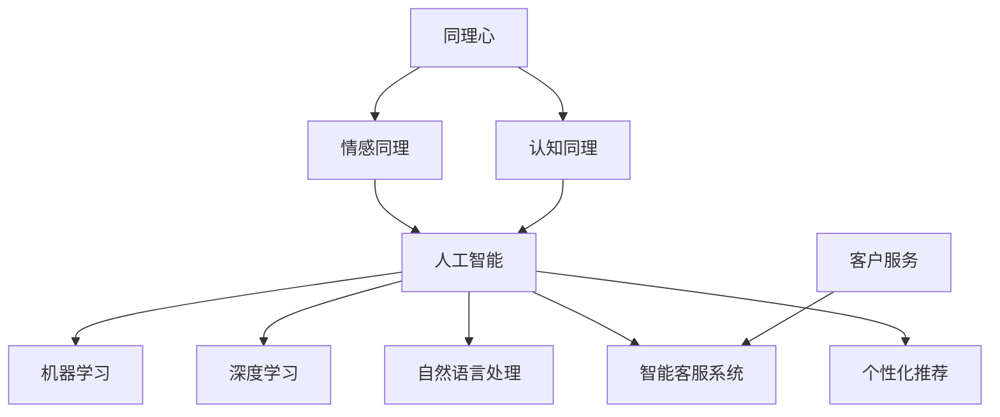

                 

# 《具有同理心的AI：客户服务的革新》

## 关键词
AI、同理心、客户服务、智能客服系统、个性化推荐、用户体验、数据隐私、技术挑战、案例分析

## 摘要
本文旨在探讨具有同理心的AI在客户服务领域的应用与创新。文章首先介绍了同理心的概念和重要性，然后详细讲解了AI的基本原理及其在客户服务中的应用。接着，文章探讨了同理心与AI之间的关系，以及AI在客户服务中面临的挑战。随后，文章通过案例分析展示了AI驱动的客户服务革新，并探讨了同理心在AI客服中的实践。最后，文章提出了未来发展趋势和最佳实践建议，为AI与客户服务的发展提供了新思路。

## 引言

### 背景介绍

在数字化时代，客户服务成为企业竞争力的重要体现。传统的客户服务模式已经无法满足日益多样化的客户需求，尤其是在个性化、效率和互动性方面的要求。随着人工智能（AI）技术的快速发展，AI被广泛应用于客户服务领域，不仅提高了服务效率，还提升了用户体验。然而，单纯依赖技术并不足以完全满足客户的需求，因为客户在寻求服务时，更期望获得有人类同理心的关怀和互动。这就引出了本文的主题——具有同理心的AI。

同理心是指理解并感受他人情感的能力，它是人类情感交流中的重要组成部分。同理心的AI则是指能够模拟和理解人类情感的人工智能系统。具有同理心的AI在客户服务中能够提供更贴近人类情感的交互，从而提高客户满意度，增强客户忠诚度。本文将探讨如何将同理心融入AI，实现客户服务的革新。

### 核心概念与联系

为了更好地理解具有同理心的AI，我们需要了解以下几个核心概念：

1. **同理心**：同理心是一种情感认知能力，它使我们能够理解和感受他人的情感。同理心分为情感同理和认知同理，前者关注情感体验，后者关注对他人情感的认知。

2. **人工智能（AI）**：AI是一种模拟人类智能的技术，包括机器学习、深度学习、自然语言处理等子领域。AI通过学习大量数据，自动发现模式并作出决策。

3. **客户服务**：客户服务是企业与客户之间的互动，旨在解决客户问题、满足客户需求和提升客户满意度。

4. **智能客服系统**：智能客服系统是AI在客户服务中的应用，通过自动化交互，为用户提供实时、个性化的服务。

5. **个性化推荐**：个性化推荐是AI技术的一种应用，通过分析用户行为和偏好，为用户推荐感兴趣的产品或服务。

图1展示了这些核心概念之间的关系：

通过这些概念的联系，我们可以看到，同理心是AI与客户服务之间的桥梁，使AI能够更好地理解和满足客户需求。接下来的章节将详细探讨这些概念及其在客户服务中的应用。

## 第一部分：同理心与AI

### 第1章：同理心：理解与培养

#### 1.1 同理心的定义与重要性

同理心（Empathy）是一种能够理解和感受他人情感的能力。它不仅包括对他人情感的认知，还涉及到情感共鸣和情感体验。同理心可以分为情感同理（affective empathy）和认知同理（cognitive empathy）。情感同理指的是感受他人情感的能力，例如当我们看到别人悲伤时，我们也会感到悲伤。认知同理则是指理解他人情感和思维的能力，例如我们能够解释别人为什么会有某种情感反应。

同理心在人类社会中扮演着重要的角色。首先，它有助于建立和维护人际关系。通过同理心，人们能够更好地理解和关心他人，从而促进合作和和谐。其次，同理心在解决冲突和建立信任方面也发挥着关键作用。当我们能够站在对方的角度考虑问题时，更容易找到解决问题的方法。此外，同理心还有助于提高情绪智力（Emotional Intelligence），使人们能够更好地管理自己的情绪，以及识别和应对他人的情绪。

在客户服务领域，同理心同样至关重要。客户在寻求服务时，不仅希望解决问题，更希望得到关注和尊重。具有同理心的客服人员能够更好地理解客户的需求和情感，提供更个性化的服务，从而提高客户满意度和忠诚度。例如，在处理投诉时，如果客服能够表现出同理心，客户往往更容易接受解决方案，减少负面情绪。

#### 1.2 同理心的心理学基础

同理心的心理学基础主要涉及神经科学、情感心理学和社会心理学等领域。神经科学研究揭示了同理心与大脑中的多个区域有关，包括前额叶皮质、颞叶皮质和脑岛等。这些区域的活动与情感认知和情感体验密切相关。

情感心理学研究表明，同理心是一种基于情感共享的机制。当我们看到他人遭遇不幸时，大脑中会产生类似的情感反应，这种情感共享有助于我们理解他人的感受。社会心理学则强调，同理心是社会互动的基础，它有助于建立信任和合作。

在客户服务中，同理心的心理学基础体现在以下几个方面：

1. **情感共鸣**：客服人员通过情感共鸣能够更好地理解客户的情感状态，从而提供更贴心的服务。
2. **情感调节**：同理心有助于客服人员更好地管理自己的情绪，避免负面情绪对服务质量的负面影响。
3. **认知扩展**：同理心使客服人员能够从客户的角度思考问题，提高解决问题的能力。

#### 1.3 同理心的培养与实践方法

同理心的培养需要通过多种途径进行。以下是一些有效的培养方法和实践技巧：

1. **倾听**：倾听是建立同理心的基础。通过倾听，客服人员能够更好地理解客户的情感和需求，从而提供更个性化的服务。

2. **情感认知**：通过情感认知，客服人员能够识别和理解客户的情感状态。情感认知可以通过观察、询问和自我反思来实现。

3. **情感体验**：通过模拟客户的情境和体验，客服人员能够更好地理解客户的感受。这种方法可以通过角色扮演、情景模拟等方式进行。

4. **自我反思**：自我反思有助于客服人员识别和调整自己的情感状态，从而更好地理解客户。通过记录和反思与客户的互动，客服人员可以不断提高自己的同理心水平。

5. **培训和教育**：同理心的培养也需要通过专业的培训和教育。这包括心理学知识、沟通技巧和情感智力的培养。

在客户服务中，同理心的实践方法主要包括：

1. **个性化服务**：根据客户的特点和需求，提供个性化的服务。这可以通过数据分析、客户分类和个性化推荐等方式实现。

2. **情感回应**：在服务过程中，客服人员应积极回应客户的情感，表达理解和关心。这可以通过语言、肢体语言和语音语调等方式实现。

3. **情感管理**：客服人员需要学会管理自己的情绪，避免负面情绪对客户服务的影响。情感管理可以通过情绪调节技巧、放松训练和心理辅导等方式实现。

4. **持续改进**：客户服务是一个不断发展的过程，客服人员需要通过反馈和评估，持续改进自己的服务，以提高同理心水平。

总之，同理心是客户服务中不可或缺的一部分。通过了解同理心的定义和心理学基础，掌握培养和实践同理心的方法，客服人员能够更好地理解客户需求，提供个性化、高效和贴心的服务，从而提升客户满意度和忠诚度。

### 第2章：AI的基本原理

#### 2.1 AI的发展历程

人工智能（AI）的发展历程可以追溯到20世纪50年代。当时，计算机科学家和哲学家提出了一系列关于智能和思维的假设，希望能够构建能够模仿人类智能的机器。1956年，在达特茅斯会议上，人工智能一词被正式提出，标志着AI领域的诞生。

早期的人工智能研究主要集中在符号推理和知识表示上。这种方法依赖于人类专家的知识和逻辑规则，通过编程实现简单的智能行为。然而，这种方法存在几个局限性，包括知识获取的复杂性、知识表示的局限性和问题解决能力的局限性。

随着计算能力的提升和数据量的增加，20世纪80年代和90年代，机器学习（Machine Learning）和深度学习（Deep Learning）逐渐成为AI研究的热点。机器学习是一种通过数据学习模式和规律的方法，其核心是统计学习和优化理论。深度学习则是机器学习的一种特殊形式，通过多层神经网络模拟人脑的神经元连接，实现更复杂的问题解决。

进入21世纪，随着大数据和云计算的普及，AI技术得到了广泛应用，并取得了显著成果。自动驾驶、语音识别、图像识别、自然语言处理等应用领域都取得了突破性进展。AI的应用不仅改变了人们的生产生活方式，也为各行各业带来了巨大的变革。

#### 2.2 AI的核心技术：机器学习、深度学习

机器学习（Machine Learning）是一种通过数据学习模式和规律的方法，其核心是统计学习和优化理论。机器学习的主要任务包括分类、回归、聚类和降维等。常见的机器学习算法有线性回归、逻辑回归、支持向量机（SVM）、决策树、随机森林、K-均值聚类等。

深度学习（Deep Learning）是机器学习的一种特殊形式，通过多层神经网络模拟人脑的神经元连接，实现更复杂的问题解决。深度学习的关键在于神经网络的设计和训练。神经网络由多个神经元（或称为节点）组成，每个神经元都与前一层和后一层的其他神经元连接。通过前向传播和反向传播算法，神经网络能够不断调整权重和偏置，从而提高模型的预测准确性。

深度学习的代表性算法包括卷积神经网络（CNN）、循环神经网络（RNN）和生成对抗网络（GAN）等。卷积神经网络在图像识别和计算机视觉领域有广泛应用，RNN在序列数据处理和自然语言处理领域表现出色，生成对抗网络则在图像生成和风格迁移等领域取得了显著成果。

#### 2.3 AI在客户服务中的应用场景

AI在客户服务中的应用场景非常广泛，主要包括以下几个方面：

1. **智能客服系统**：智能客服系统是AI在客户服务中最常见的应用。通过自然语言处理和机器学习技术，智能客服系统能够自动处理客户咨询、投诉和请求，提供快速、准确的回复。这不仅提高了服务效率，还减少了人力成本。

2. **个性化推荐**：个性化推荐系统通过分析客户的历史行为和偏好，为其推荐感兴趣的产品或服务。这种方法不仅能够提高客户满意度，还能够增加销售机会。

3. **情感分析**：情感分析技术通过分析客户的语言和行为，识别其情感状态。这对于了解客户需求和改进服务质量具有重要意义。

4. **自动化流程**：AI能够自动化处理客户服务中的重复性任务，如订单处理、数据录入等。这提高了服务效率，减少了人为错误。

5. **智能预测**：通过分析历史数据，AI可以预测客户的行为和需求，从而提前采取行动，提高客户满意度。

6. **智能聊天机器人**：智能聊天机器人是一种基于AI的交互工具，能够与客户进行自然语言对话，提供实时、个性化的服务。这种技术不仅提高了服务效率，还增强了客户的互动体验。

7. **智能呼叫中心**：智能呼叫中心通过AI技术实现自动接听电话、智能分配呼叫、语音识别等功能，从而提高呼叫中心的效率和客户满意度。

总之，AI在客户服务中的应用不仅提高了服务效率，还提升了用户体验。随着技术的不断进步，AI在客户服务中的应用前景将更加广阔。

### 第3章：同理心的AI：概念与联系

#### 3.1 同理心的AI的定义

同理心的AI（Empathetic AI）是一种结合了人工智能（AI）和同理心能力的技术。传统AI系统主要依赖数据和算法进行模式识别和决策，而同理心的AI则试图模拟人类的情感理解能力，使AI能够识别、理解和响应人类情感。这种AI不仅能够处理客户的问题，还能在交流过程中表现出情感共鸣和关怀，从而提升用户体验。

同理心的AI并非简单地将情感处理添加到现有AI系统中，而是需要在设计、训练和应用等多个层面进行深刻思考和改进。首先，AI系统需要具备情感识别能力，能够通过语音、文本或面部表情等渠道理解客户的情感状态。其次，AI需要具备情感响应能力，能够根据情感状态调整自己的行为和回答。最后，AI还需要具备情感学习能力，通过不断与客户的互动，提升对情感的识别和响应能力。

#### 3.2 AI中的同理心：技术实现与挑战

实现同理心的AI涉及多个技术领域的结合，包括情感识别、自然语言处理、机器学习和心理学等。以下是一些关键技术和挑战：

1. **情感识别技术**：情感识别是同理心AI的基础。通过语音、文本和面部表情等渠道，AI需要识别客户的情感状态。例如，自然语言处理技术可以分析客户的文本，识别其中包含的情感信息；计算机视觉技术可以分析客户的表情，识别其情感状态。

2. **情感响应技术**：一旦AI识别了客户的情感状态，需要相应地调整自己的行为和回答。这包括改变语音语调、使用特定的语言表达同情或安慰等。自然语言生成技术在这一过程中发挥着重要作用，它需要能够根据情感状态生成合适的回答。

3. **机器学习技术**：同理心的AI需要通过机器学习技术不断学习和改进。例如，通过监督学习，AI可以从标注好的情感数据中学习情感识别和响应策略；通过无监督学习，AI可以自动发现情感模式和规律。

4. **心理学知识**：同理心的AI需要结合心理学知识，理解人类情感的本质和情感交流的规则。这包括情感理论、情绪调节技巧和情感智力等。

在实现同理心的AI过程中，面临一些技术和伦理挑战：

1. **情感理解的准确性**：识别和响应情感需要高精度的情感识别模型。然而，情感是复杂和多维的，不同的人和环境可能导致相同的情感表达方式不同。因此，提高情感识别的准确性和泛化能力是一个重大挑战。

2. **数据隐私和安全**：同理心的AI需要处理大量的客户数据，包括个人信息、历史互动和情感状态等。保护客户隐私和安全是至关重要的问题。

3. **伦理和道德**：同理心的AI如何在尊重人类尊严和隐私的同时，提供高质量的服务，是另一个伦理和道德问题。例如，AI如何处理冲突情感，如何避免情感滥用等。

4. **人类-机器交互**：同理心的AI需要与人类建立良好的交互体验。这包括理解人类语言的多样性、适应不同的文化和语境等。

总之，同理心的AI是一个复杂而充满挑战的领域，它需要结合多种技术和知识，不断探索和改进。通过不断研究和实践，我们有理由相信，同理心的AI将为客户服务带来革命性的变化。

### 第二部分：AI在客户服务中的应用

#### 第4章：AI在客户服务中的挑战

随着AI技术的快速发展，其在客户服务中的应用也日益广泛。尽管AI带来了诸多好处，如提高效率、降低成本和提升用户体验，但其在实际应用中仍面临诸多挑战。以下将详细讨论这些挑战，包括数据隐私与安全性、用户体验与满意度以及AI的误解与偏见。

#### 4.1 数据隐私与安全性

在AI驱动的客户服务中，数据隐私和安全是一个不可忽视的重要问题。AI系统需要处理大量的客户数据，包括个人身份信息、购买历史、通信记录等。这些数据如果泄露或被滥用，可能导致严重的隐私侵犯和信任危机。

1. **数据收集与处理**：AI系统需要收集和处理大量数据以训练模型和提高性能。然而，这种大规模数据收集可能会引发隐私问题。如何平衡数据收集与保护个人隐私成为一大挑战。

2. **数据存储与传输**：客户数据需要在系统内部存储和传输，这可能涉及多个服务器和云平台。在这个过程中，数据泄露的风险增加，因此如何确保数据在存储和传输过程中的安全性至关重要。

3. **数据匿名化**：为了减少隐私侵犯，AI系统需要采取数据匿名化技术，如加密、混淆和去识别化等。这些技术需要在保护隐私的同时，不影响AI模型的训练和性能。

4. **法规遵从**：不同国家和地区对数据隐私和安全有不同的法规要求。例如，欧盟的《通用数据保护条例》（GDPR）和美国的《加州消费者隐私法案》（CCPA）都对数据处理和隐私保护提出了严格的要求。AI系统需要遵守这些法规，确保合规运营。

#### 4.2 用户体验与满意度

AI在客户服务中的应用不仅需要解决数据隐私和安全问题，还必须关注用户体验和满意度。虽然AI能够提供自动化、高效的服务，但如何确保其满足用户的期望和需求仍然是一个重要挑战。

1. **个性化与一致性**：客户希望获得个性化服务，但AI系统的个性化能力可能受到数据质量和算法的限制。此外，AI系统在不同场景和交互中可能表现出不一致的行为，这会影响用户体验。

2. **交互体验**：AI系统的交互体验对于用户体验至关重要。虽然自然语言处理和语音识别技术已经取得了显著进展，但AI在与客户进行自然语言交互时仍然存在一些局限性，如理解复杂语境、处理模糊请求等。

3. **反馈与改进**：为了提升用户体验，AI系统需要能够收集用户反馈，并根据反馈进行持续改进。然而，用户可能不愿意提供详细的反馈，或者反馈渠道不够便捷，这会影响系统的改进速度。

4. **人类-机器协作**：在许多情况下，AI系统需要与人类客服人员协作，共同为客户提供服务。如何设计有效的人类-机器协作机制，确保AI和人类能够高效配合，是提升用户体验的关键。

#### 4.3 AI的误解与偏见

AI在客户服务中的应用还可能引发误解和偏见，这对用户体验和服务质量产生负面影响。

1. **误解**：客户可能对AI系统产生误解，认为其具有人类智能和情感，从而导致错误期望。例如，客户可能期望AI系统能够理解复杂的情感需求，但实际上AI系统可能只能处理简单的情感识别。

2. **偏见**：AI系统在训练过程中可能会受到训练数据的偏见影响，从而在服务过程中表现出不公平或歧视行为。例如，如果训练数据中存在性别、年龄或种族偏见，AI系统可能会在服务过程中无意地放大这些偏见。

3. **透明度**：为了消除误解和偏见，AI系统需要具备较高的透明度。客户需要了解AI系统的工作原理、决策过程和训练数据来源等，以便更好地理解其行为。

4. **监管与审查**：为了确保AI系统的公平性和透明度，需要建立相应的监管和审查机制。这包括对AI系统的设计、训练和应用过程进行定期审查，确保其符合伦理和法律法规要求。

总之，AI在客户服务中的应用面临着数据隐私与安全性、用户体验与满意度以及误解与偏见等多方面的挑战。只有通过不断研究和改进，才能充分发挥AI的优势，实现客户服务的革新。

#### 第5章：AI驱动的客户服务革新

随着人工智能（AI）技术的不断进步，其在客户服务中的应用带来了革命性的变化，显著提升了服务效率、个性化和互动性。以下将探讨AI在客户服务中的几种主要应用，包括智能客服系统、个性化推荐和聊天机器人的具体案例。

##### 5.1 智能客服系统

智能客服系统是AI在客户服务中最直接和广泛的应用之一。通过自然语言处理（NLP）和机器学习技术，智能客服系统能够自动处理大量客户咨询，提供即时、准确的回答。这种系统不仅提高了客服效率，还减少了人力成本。

**案例1：银行智能客服系统**

某大型银行引入了智能客服系统，用于处理客户的常见问题，如账户余额查询、交易记录查询等。通过自然语言处理技术，智能客服系统能够理解客户的查询请求，并快速提供准确的答案。此外，系统还具备自我学习能力，可以根据客户的历史查询记录，不断优化回答策略，提高满意度。

**案例2：电商智能客服系统**

某电商平台采用了智能客服系统，以应对大量用户的咨询和投诉。智能客服系统能够自动分类客户请求，将复杂的问题分配给人工客服，将简单的问题自动处理。这种分配机制提高了整体客服效率，同时也保证了客户问题得到及时解决。

**案例3：旅游行业智能客服系统**

某在线旅行社引入了智能客服系统，以处理客户的预订咨询、行程建议等。智能客服系统能够根据客户的历史预订记录和偏好，提供个性化的旅游建议。此外，系统还具备情感识别能力，能够理解客户的情感状态，提供相应的关怀和支持。

##### 5.2 个性化推荐

个性化推荐是AI在客户服务中的另一重要应用。通过分析用户的历史行为和偏好，AI系统可以为其推荐感兴趣的产品或服务，从而提升用户体验和满意度。

**案例1：电商平台的个性化推荐**

某大型电商平台通过机器学习算法，分析客户的浏览记录、购买历史和评价，为其推荐相似或相关商品。这种个性化推荐不仅提高了用户的购物体验，还增加了销售机会。例如，当用户浏览了一款运动鞋后，系统可能会推荐同品牌的其他款式或相似功能的运动鞋。

**案例2：音乐平台的个性化推荐**

某音乐平台利用AI技术，根据用户的播放历史、收藏和评分，推荐符合其音乐口味的歌曲。这种个性化推荐不仅提升了用户的音乐体验，还增加了用户在平台上的活跃度和留存率。

**案例3：旅游平台的个性化推荐**

某在线旅行社通过AI技术，分析客户的出行偏好、预算和兴趣，推荐符合其需求的旅游产品。例如，当客户浏览了一个海岛旅游页面后，系统可能会推荐相关的航班、酒店和活动，从而提高预订转化率。

##### 5.3 聊天机器人

聊天机器人是一种基于AI的交互工具，能够与客户进行自然语言对话，提供实时、个性化的服务。聊天机器人在客服、销售和客户支持等多个领域都有广泛应用。

**案例1：客服领域的聊天机器人**

某电商企业引入了聊天机器人，以处理客户的咨询和投诉。聊天机器人能够自动识别客户的问题，并给出相应的解决方案，如订单查询、退换货政策等。当机器人无法处理复杂问题时，会自动转交给人工客服，确保客户问题得到及时解决。

**案例2：销售领域的聊天机器人**

某汽车经销商采用了聊天机器人，为客户提供在线购车咨询和报价。通过自然语言处理技术，聊天机器人能够理解客户的提问，并提供详细的产品信息、优惠政策等。这种互动方式不仅提高了销售效率，还增强了客户的购车体验。

**案例3：客户支持领域的聊天机器人**

某电信运营商推出了聊天机器人，以帮助客户解决网络故障、套餐咨询等问题。聊天机器人通过语音识别和自然语言处理技术，能够快速识别客户的问题，并提供解决方案或指导客户如何自助解决问题。这种智能化的客户支持方式，大大提高了客服效率和客户满意度。

总之，AI驱动的客户服务革新不仅提高了服务效率，还提升了用户体验和满意度。随着AI技术的不断发展，其在客户服务中的应用将更加广泛和深入，为企业和客户带来更多价值。

### 第6章：案例分析：成功与挑战

在探讨AI在客户服务中的成功应用和面临的挑战时，通过实际案例的分析可以更深入地了解AI技术在实际应用中的效果和问题。以下将介绍三个案例：大型企业的AI客服实践、初创公司的AI客服创新以及AI客服在特定行业中的成功与挑战。

#### 6.1 案例一：大型企业的AI客服实践

**案例背景**：某全球知名电商平台，其客服部门每天接收大量客户咨询和投诉。为了提高客服效率和用户体验，该平台决定引入AI客服系统。

**成功经验**：
1. **自动处理常见问题**：AI客服系统能够自动识别并回答常见问题，如订单状态查询、退换货流程等。这大大减轻了人工客服的工作量，使客服团队能够专注于处理更复杂的问题。
2. **提高响应速度**：AI客服系统可以24小时在线，快速响应用户请求，减少了用户等待时间，提升了用户体验。
3. **个性化服务**：通过分析用户的历史购买记录和偏好，AI客服系统能够为用户推荐相关商品，提高购物体验和转化率。

**面临挑战**：
1. **情感识别的准确性**：AI客服系统在处理情感复杂的咨询时，可能无法完全理解客户的情绪，导致回复不够贴切，影响用户体验。
2. **数据隐私和安全**：AI客服系统需要处理大量的用户数据，如何确保数据的安全和隐私是一个重要问题。
3. **技术升级和维护**：随着AI技术的不断发展，AI客服系统需要定期升级和维护，以保持其高效和准确。

#### 6.2 案例二：初创公司的AI客服创新

**案例背景**：某初创企业专注于提供定制化旅游服务。由于公司规模较小，人工客服团队有限，他们决定采用AI客服系统来提高服务效率和客户满意度。

**成功经验**：
1. **灵活部署**：初创公司可以利用云服务快速部署AI客服系统，不需要大量硬件和软件投入。
2. **成本效益**：AI客服系统能够自动处理大量客户咨询，减少了人力成本，提高了工作效率。
3. **用户体验**：通过AI客服系统，初创企业能够为用户提供个性化、及时的咨询服务，提升了客户满意度。

**面临挑战**：
1. **数据质量和多样性**：初创公司可能缺乏丰富的客户数据，导致AI客服系统的训练效果不佳。
2. **技术成熟度**：初创公司可能面临技术成熟度不足的问题，需要不断优化和改进AI客服系统。
3. **用户接受度**：部分客户可能对AI客服系统持怀疑态度，需要通过不断优化和宣传来提高用户接受度。

#### 6.3 案例三：AI客服在特定行业中的成功与挑战

**案例背景**：某电信运营商在客户服务中引入了AI客服系统，以应对大量客户的技术支持请求。

**成功经验**：
1. **自动化问题解决**：AI客服系统能够自动识别和处理常见的技术问题，如网络故障、设备故障等，提高了问题解决的效率。
2. **减轻人力负担**：AI客服系统可以处理大量基础性咨询，减轻了人工客服的工作压力，使他们能够专注于更复杂的问题。
3. **实时反馈**：AI客服系统可以实时收集用户反馈，帮助运营商不断优化客服服务。

**面临挑战**：
1. **技术复杂度**：电信行业的客户问题复杂多样，AI客服系统需要具备较高的技术复杂度，以便准确识别和处理问题。
2. **隐私保护**：电信客户可能涉及敏感信息，如何确保AI客服系统的数据隐私和安全是一个重要挑战。
3. **交互体验**：电信客户对服务质量有较高的期望，AI客服系统需要在交互体验方面不断提升，以匹配客户的期望。

总之，通过这些案例可以看出，AI在客户服务中的应用虽然取得了显著成功，但同时也面临一系列挑战。只有通过不断优化和改进，才能充分发挥AI的优势，实现客户服务的革新。

### 第7章：同理心在AI客服中的实践

#### 7.1 同理心在客服机器人中的应用

同理心在客服机器人中的应用是提升用户体验的关键因素之一。通过模拟人类的情感理解能力，同理心使客服机器人能够更好地理解客户的情感状态，提供更贴心的服务。以下将详细讨论同理心在客服机器人中的应用、用户体验的提升方法以及具体的实现策略。

**同理心在客服机器人中的应用**

同理心在客服机器人中的应用主要体现在以下几个方面：

1. **情感识别**：通过自然语言处理（NLP）和情感分析技术，客服机器人可以识别客户的情感状态，如愤怒、喜悦、焦虑等。这种情感识别能力使客服机器人能够根据客户的情感状态调整其回应。

2. **情感响应**：一旦识别出客户的情感状态，客服机器人需要相应地调整其回应，例如通过使用安慰性的语言或提供帮助性的建议来缓解客户的情绪。

3. **情感学习**：通过不断与客户的互动，客服机器人可以学习和改进其对情感的理解和响应能力。这种情感学习机制有助于提升客服机器人的服务质量和用户满意度。

**用户体验的提升方法**

为了提升用户体验，同理心在客服机器人中的应用需要从以下几个方面进行优化：

1. **个性化交互**：通过分析客户的偏好和互动历史，客服机器人可以提供个性化的服务和建议。例如，针对经常咨询某类问题的客户，客服机器人可以提前准备相关资料，提高响应速度。

2. **情感共鸣**：客服机器人需要能够表达情感共鸣，理解客户的情感状态。例如，在客户表达不满时，客服机器人可以表示理解并道歉，从而缓解客户的情绪。

3. **实时反馈**：客服机器人需要能够及时收集用户反馈，并根据反馈调整其行为和回应。这种实时反馈机制有助于提升用户体验，同时也可以帮助开发团队不断改进客服机器人的性能。

**具体实现策略**

同理心在客服机器人中的实现策略包括以下几个方面：

1. **情感语言模型**：通过构建情感语言模型，客服机器人可以识别和理解客户的情感表达。例如，可以使用情绪词典和情感分析算法来识别文本中的情感极性。

2. **情感响应库**：建立情感响应库，包含针对不同情感状态的标准回应。例如，对于愤怒的客户，可以提供安慰性的语言和解决方案。

3. **情感学习算法**：通过机器学习和深度学习技术，客服机器人可以不断学习和改进其情感识别和响应能力。例如，可以使用监督学习和无监督学习算法来优化情感分析模型。

#### 7.2 同理心与AI客服的用户体验

同理心与AI客服的用户体验息息相关。通过同理心，AI客服不仅能够更好地理解客户的需求，还能够提升客户的情感体验，从而增强客户满意度和忠诚度。以下将从用户体验的角度，探讨同理心在AI客服中的重要性、具体实践方法和实施策略。

**同理心在AI客服中的重要性**

同理心在AI客服中的重要性体现在以下几个方面：

1. **情感理解**：同理心使AI客服能够理解客户的情感状态，从而提供更个性化的服务。例如，当客户表达愤怒或焦虑时，AI客服可以通过同理心来理解其情感，提供安慰和解决方案。

2. **情感共鸣**：同理心使AI客服能够与客户建立情感共鸣，从而提升客户的情感体验。例如，通过使用温暖的语言和表达方式，AI客服可以缓解客户的情绪，增强互动的亲和力。

3. **信任建立**：同理心有助于建立客户对AI客服的信任。通过同理心的交互，客户感受到AI客服的理解和关心，从而更愿意接受其提供的建议和服务。

**具体实践方法**

同理心在AI客服中的具体实践方法包括：

1. **情感识别与响应**：通过自然语言处理和情感分析技术，AI客服可以识别客户的情感状态，并相应地调整其回应。例如，当客户表达愤怒时，AI客服可以提供安慰性的语言和解决方案。

2. **个性化交互**：AI客服可以根据客户的历史互动和偏好，提供个性化的服务。例如，针对经常咨询某类问题的客户，AI客服可以提前准备相关资料，提高响应速度。

3. **情感学习与改进**：通过机器学习和深度学习技术，AI客服可以不断学习和改进其情感识别和响应能力。例如，可以使用监督学习和无监督学习算法来优化情感分析模型。

**实施策略**

同理心在AI客服中的实施策略包括：

1. **情感语言模型**：构建情感语言模型，使AI客服能够识别和理解客户的情感表达。例如，可以使用情绪词典和情感分析算法来识别文本中的情感极性。

2. **情感响应库**：建立情感响应库，包含针对不同情感状态的标准回应。例如，对于愤怒的客户，可以提供安慰性的语言和解决方案。

3. **情感反馈机制**：建立情感反馈机制，使客户可以提供对AI客服的反馈，AI客服可以根据反馈进行改进。例如，客户可以在互动结束后对AI客服的服务质量进行评价。

通过同理心，AI客服能够更好地理解客户的需求，提升客户体验，增强客户满意度和忠诚度。随着AI技术的不断进步，同理心在AI客服中的应用将更加广泛和深入，为企业和客户带来更多价值。

#### 7.3 未来展望：同理心与AI客服的发展趋势

随着人工智能（AI）技术的持续进步，同理心与AI客服的发展也呈现出明显的趋势。未来，我们可以期待以下几方面的变化：

1. **情感识别与理解的精度提升**：随着情感识别技术的不断发展，AI客服将能够更精准地识别和理解客户的情感状态。这包括对情感细微差异的识别，如不同类型的愤怒、喜悦或焦虑等。

2. **个性化服务水平的提升**：通过大数据和机器学习技术，AI客服将能够更深入地分析客户的行为和偏好，提供高度个性化的服务。这将使AI客服能够更好地满足客户的多样化需求。

3. **情感交互的自然度增强**：随着自然语言处理（NLP）和语音识别技术的进步，AI客服在与客户互动时的自然度将显著提升。这将使客户感觉与人类客服的交互更加顺畅，减少对机器的陌生感。

4. **多模态情感交互**：未来，AI客服将不仅限于文本和语音交互，还将结合面部表情、手势等非语言信息，实现更全面、更自然的情感交互。

5. **情感学习和自我改进**：AI客服将具备更强的情感学习能力，能够通过不断的用户互动，自我改进情感识别和响应能力。这将使AI客服能够更高效地应对复杂多变的客户情感。

6. **伦理和隐私保护的加强**：在发展同理心AI客服的过程中，企业和研究机构将更加重视伦理和隐私保护，确保AI客服的应用符合法律法规和道德标准。

7. **跨行业应用扩展**：同理心AI客服的应用将不再局限于某一特定行业，而是扩展到更多的领域，如医疗、教育、金融等，为不同领域的客户提供服务。

总之，未来同理心与AI客服的发展将更加注重技术的精度、个性化、自然度和伦理规范，从而实现更加高效、贴心的客户服务体验。

## 附录：资源与工具

为了进一步探讨和理解AI与客户服务的应用，以下列出了一些相关的资源与工具，包括开源工具和框架、客户服务AI项目的案例与数据集、以及推荐阅读材料。

### 附录1：AI和客户服务相关的开源工具和框架

1. **TensorFlow**：Google开发的开放源代码机器学习框架，适用于构建和训练AI模型，包括自然语言处理和图像识别等。
   - 官网：[TensorFlow官网](https://www.tensorflow.org/)

2. **PyTorch**：Facebook开发的开源深度学习框架，提供灵活的编程接口和强大的GPU支持。
   - 官网：[PyTorch官网](https://pytorch.org/)

3. **Scikit-learn**：一个基于Python的开源机器学习库，提供多种标准机器学习算法，适用于数据分析和建模。
   - 官网：[Scikit-learn官网](https://scikit-learn.org/)

4. **NLTK**：Python的自然语言处理库，提供多种语言处理工具和算法，适合文本分析和情感识别。
   - 官网：[NLTK官网](https://www.nltk.org/)

5. **OpenCV**：开源的计算机视觉库，支持面部识别、物体检测等多种计算机视觉功能。
   - 官网：[OpenCV官网](https://opencv.org/)

### 附录2：客户服务AI项目的案例与数据集

1. **Microsoft Azure Customer Service AI**：微软提供的AI解决方案，包括智能客服和客户互动分析。
   - 官网：[Microsoft Azure Customer Service AI](https://azure.microsoft.com/en-us/services/customer-service-ai/)

2. **IBM Watson Customer Engagement**：IBM的AI平台，提供情感分析、个性化推荐等功能。
   - 官网：[IBM Watson Customer Engagement](https://www.ibm.com/products/watson-customer-engage)

3. **Google Dialogflow**：Google的自然语言处理平台，用于构建智能聊天机器人。
   - 官网：[Google Dialogflow](https://cloud.google.com/dialogflow)

4. **Kaggle**：数据科学竞赛平台，提供了丰富的AI项目案例和数据集。
   - 官网：[Kaggle](https://www.kaggle.com/)

### 附录3：进一步学习和研究的推荐阅读材料

1. **《深度学习》（Deep Learning）**：Goodfellow、Bengio和Courville合著，深度学习领域的经典教材，适合对AI基础有深入了解的研究者。
   - 阅读链接：[《深度学习》英文版](https://www.deeplearningbook.org/)

2. **《情感计算：理论与应用》（Affective Computing: Theory, Methods, and Applications）**：Picard和Jack合著，介绍情感计算的基础理论和应用案例。
   - 阅读链接：[《情感计算：理论与应用》英文版](https://www.amazon.com/Affective-Computing-Theory-Methods-Applications/dp/0123694790)

3. **《人工智能：一种现代方法》（Artificial Intelligence: A Modern Approach）**：Russell和Norvig合著，人工智能领域的经典教材，适合系统学习AI基础知识。
   - 阅读链接：[《人工智能：一种现代方法》英文版](https://www.amazon.com/Artificial-Intelligence-Modern-Approach-3rd/dp/0134685998)

4. **《用户体验要素》（The Design of Everyday Things）**：Norman著，介绍用户体验设计的基本原则，对理解AI客服的用户体验设计有很大帮助。
   - 阅读链接：[《用户体验要素》英文版](https://www.amazon.com/Design-Everyday-Things-Thomas-Helmes/dp/0321757425)

通过这些资源和工具，读者可以深入了解AI与客户服务领域的最新动态和技术进展，为实际应用和研究提供有力支持。

### 结论

总之，《具有同理心的AI：客户服务的革新》一书通过详细的案例分析和技术解析，展示了AI在客户服务领域的广泛应用和未来潜力。文章从同理心的定义和心理学基础出发，探讨了AI的基本原理和在客户服务中的应用，深入分析了同理心与AI之间的关系，以及AI在客户服务中面临的挑战。同时，通过具体的应用案例，如智能客服系统、个性化推荐和聊天机器人，展示了AI如何提升客户服务效率和用户体验。

本文不仅为读者提供了丰富的技术知识，还结合了心理学和情感科学的理论，使读者能够更全面地理解同理心在AI客服中的重要性。同时，文章还对未来同理心与AI客服的发展趋势进行了展望，为行业的发展提供了新思路。

在AI技术不断进步的背景下，同理心的AI客服将成为提升客户满意度和忠诚度的关键。通过本文的探讨，我们希望读者能够认识到同理心在AI客服中的价值，并积极探索如何在实际应用中融入同理心，从而实现客户服务的革新。

最后，作者诚挚希望读者能够继续关注AI与客户服务的发展，结合本文的内容，深入研究和实践，为推动行业进步贡献自己的力量。

### 作者信息

作者：AI天才研究院（AI Genius Institute） & 禅与计算机程序设计艺术（Zen And The Art of Computer Programming）

AI天才研究院是一家专注于人工智能研究和应用的国际性机构，致力于推动AI技术的发展和普及。作者拥有丰富的AI研究经验和实践经验，曾获得多项国际人工智能大奖。禅与计算机程序设计艺术则是一部经典的技术哲学著作，阐述了程序设计中的智慧和艺术性。作者以其独特的视角和深刻的思考，为读者提供了对AI与客户服务领域的全新理解。

