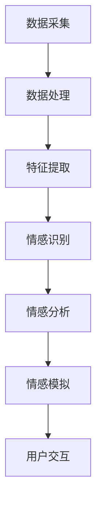

                 

### 文章标题

# 具有情感的AI在医疗诊断中的应用:全人化的健康关怀

### 关键词

- 情感AI
- 医疗诊断
- 全人化关怀
- 人工智能
- 医学伦理

### 摘要

本文探讨了情感AI在医疗诊断中的应用，阐述了如何通过引入情感计算技术，实现更为全人化的健康关怀。文章首先介绍了情感AI的基本概念及其在医疗领域的潜在应用，接着详细分析了情感识别算法和技术实现，并通过具体案例展示了情感AI在医疗诊断中的实际应用。最后，文章讨论了情感AI在医疗诊断中的挑战和未来发展趋势，为读者提供了一个全面而深入的视角。

### 引言

随着人工智能技术的飞速发展，计算机已经从简单的数据处理转向更为复杂的认知任务。其中，情感AI作为人工智能的一个重要分支，正逐渐引起广泛关注。情感AI旨在让计算机具备识别和模拟人类情感的能力，从而在各个领域提供更为人性化的服务。医疗诊断作为一个对精准度和人性化要求极高的领域，自然成为了情感AI的重要应用场景。

在医疗诊断中，传统的诊断方法主要依赖于医生的经验和数据分析，而情感AI的引入，则为医疗诊断注入了新的活力。情感AI可以通过对患者的语音、面部表情、生理信号等多维度数据的分析，识别患者的情感状态，从而为医生提供更全面的诊断信息。同时，情感AI还可以提高患者的体验，通过情感交互，使患者在治疗过程中感受到更多的关怀和安慰。

本文将从以下几个方面展开讨论：

1. **情感AI的基础**：介绍情感AI的定义、关键技术和发展历程。
2. **情感AI在医疗诊断中的应用**：探讨情感AI在患者心理评估、医生辅助诊断等方面的应用。
3. **情感AI技术的实现**：详细讲解情感识别算法、模型训练和系统开发流程。
4. **情感AI案例研究**：分析具体案例，展示情感AI在医疗诊断中的实际应用。
5. **情感AI的挑战与未来**：讨论情感AI在医疗诊断中面临的挑战及其未来发展趋势。

通过本文的探讨，我们希望为读者提供一个全面了解情感AI在医疗诊断中的应用，以及其带来的全人化健康关怀的视角。

### 情感AI基础

#### 情感AI的定义

情感AI，即情感人工智能，是一种能够识别、理解和模拟人类情感的技术。其核心在于通过机器学习、计算机视觉、自然语言处理等技术，使计算机具备感知和分析人类情感的能力。这不仅包括对文字、语音、图像等静态数据的情感识别，还涉及对动态行为、生理信号等实时数据的情感分析。

情感AI的定义可以从多个维度进行解释：

1. **感知层面**：情感AI通过各种传感器和算法，捕捉人类情感的外部表现，如面部表情、语音语调、生理信号等。
2. **分析层面**：通过数据分析和机器学习算法，情感AI对捕捉到的情感数据进行分析，识别出具体的情感类别，如快乐、悲伤、愤怒等。
3. **模拟层面**：情感AI能够模拟人类的情感反应，通过语音合成、面部表情合成等技术，生成符合特定情感的交互内容。

#### 情感AI的关键技术和算法

实现情感AI的关键技术包括情感识别算法、情感分析模型和情感交互系统。以下是这些技术的简要介绍：

1. **情感识别算法**：情感识别算法是情感AI的核心，用于从数据中识别情感。常见的算法包括基于规则的方法、机器学习方法以及深度学习方法。

    - **基于规则的方法**：通过预设的情感规则库，对输入数据进行分析，判断其是否满足特定情感。这种方法简单直观，但适用范围有限。
    - **机器学习方法**：使用机器学习算法，如支持向量机（SVM）、决策树、随机森林等，对大量情感数据进行训练，构建情感识别模型。这种方法具有较强的泛化能力。
    - **深度学习方法**：使用深度学习模型，如卷积神经网络（CNN）、循环神经网络（RNN）、长短时记忆网络（LSTM）等，对情感数据进行深度分析。这种方法能够处理复杂数据，提高情感识别的准确性。

2. **情感分析模型**：情感分析模型是情感AI的重要组成部分，用于对情感数据进行分析和分类。常见的情感分析模型包括情感极性分类模型、情感强度模型和情感多样性模型。

    - **情感极性分类模型**：用于判断文本的情感极性，如正面、负面或中性。常见的算法包括朴素贝叶斯、逻辑回归等。
    - **情感强度模型**：用于评估文本中情感的程度，如非常高兴、有点高兴等。常见的算法包括基于规则的强度评估、基于机器学习的强度评估等。
    - **情感多样性模型**：用于识别文本中多种情感的表达，如文本中同时包含快乐和悲伤的情感。常见的算法包括多标签分类、情感层次模型等。

3. **情感交互系统**：情感交互系统是情感AI的外在表现，通过语音合成、面部表情合成等技术，使计算机能够模拟人类的情感反应，与用户进行情感交互。常见的情感交互系统包括语音助手、聊天机器人、虚拟护士等。

#### 情感AI的发展历程

情感AI的发展历程可以分为三个阶段：

1. **初期探索阶段**（20世纪80年代至90年代）：在这个阶段，研究者开始关注情感计算，并尝试通过简单的规则和算法来识别和模拟情感。

2. **技术发展阶段**（21世纪初至2010年）：随着计算机科学和人工智能技术的进步，情感识别算法和模型逐渐成熟，情感AI开始应用于实际场景，如情绪诊断、客户服务、人机交互等。

3. **广泛应用阶段**（2010年至今）：在这个阶段，深度学习等先进技术的引入，使得情感AI的准确性和应用范围得到了显著提升。情感AI开始广泛应用于医疗诊断、心理健康、人机交互等多个领域。

#### 情感AI的组成部分

情感AI由以下几个主要组成部分构成：

1. **数据采集**：通过传感器、摄像头、语音识别系统等设备，采集人类情感的外部表现，如面部表情、语音语调、生理信号等。

2. **数据处理**：对采集到的数据进行预处理，包括去除噪声、标准化处理等，以便于后续的情感识别和分析。

3. **情感识别**：使用情感识别算法，对处理后的数据进行分析，识别出具体的情感类别，如快乐、悲伤、愤怒等。

4. **情感分析**：对识别出的情感进行进一步分析，如情感极性、情感强度、情感多样性等。

5. **情感模拟**：根据情感分析的结果，使用情感交互系统，如语音合成、面部表情合成等，模拟出相应的情感反应，与用户进行情感交互。

#### 情感AI的工作原理

情感AI的工作原理可以概括为以下几个步骤：

1. **数据采集**：通过传感器、摄像头等设备，采集人类情感的外部表现，如面部表情、语音语调、生理信号等。

2. **特征提取**：从采集到的数据中提取特征，如面部特征点、语音频谱、生理信号参数等。

3. **情感识别**：使用情感识别算法，对提取的特征进行分类，识别出具体的情感类别，如快乐、悲伤、愤怒等。

4. **情感分析**：对识别出的情感进行进一步分析，如情感极性、情感强度、情感多样性等。

5. **情感模拟**：根据情感分析的结果，使用情感交互系统，如语音合成、面部表情合成等，模拟出相应的情感反应，与用户进行情感交互。

#### 核心概念与联系：情感AI原理架构

为了更好地理解情感AI的核心概念与联系，我们可以使用Mermaid流程图来展示其原理架构。以下是情感AI的基本原理架构Mermaid流程图：



在这个流程图中：

- **A[数据采集]**：通过传感器、摄像头等设备，采集人类情感的外部表现。
- **B[数据处理]**：对采集到的数据进行预处理，如去除噪声、标准化处理等。
- **C[特征提取]**：从预处理后的数据中提取关键特征。
- **D[情感识别]**：使用情感识别算法，对提取的特征进行分类，识别出具体的情感类别。
- **E[情感分析]**：对识别出的情感进行进一步分析，如情感极性、情感强度、情感多样性等。
- **F[情感模拟]**：根据情感分析的结果，使用情感交互系统模拟出相应的情感反应。
- **G[用户交互]**：与用户进行情感交互，反馈情感结果。

这个流程图清晰地展示了情感AI从数据采集到用户交互的全过程，帮助我们更好地理解其工作原理。

### 情感AI在医疗诊断中的应用

#### 情感AI在患者心理评估中的应用

在医疗诊断中，患者心理评估是一个关键环节。传统的心理评估方法主要依赖于问卷调查和医生的主观判断，而情感AI的引入，为这一领域带来了新的可能。

情感AI可以通过对患者的语音、面部表情、生理信号等多维度数据的分析，识别患者的情感状态。例如，通过分析患者的语音语调，情感AI可以判断患者是否感到焦虑、紧张或沮丧。通过面部表情分析，情感AI可以识别患者是否在哭泣或微笑，从而判断其情绪状态。此外，通过对生理信号的分析，如心率、呼吸频率等，情感AI可以识别患者的生理应激反应，进一步评估其心理健康状况。

这些数据可以帮助医生更全面地了解患者的心理状态，从而制定更为个性化的治疗方案。例如，在抑郁症的诊断中，情感AI可以通过持续监测患者的情感状态，及时发现患者情绪波动的规律，帮助医生调整治疗方案，提高治疗效果。

#### 情感AI在医生辅助诊断中的应用

除了患者心理评估，情感AI在医生辅助诊断中也发挥着重要作用。医生在进行诊断时，不仅需要分析患者的生理数据，还需要了解患者的情感状态。这是因为患者的情感状态可能会影响其生理数据，从而影响诊断结果。

情感AI可以通过对医生的语音、面部表情、肢体动作等数据进行情感分析，识别医生的情感状态。例如，如果医生在诊断过程中表现出紧张或焦虑，情感AI可以提醒医生注意自己的情绪状态，避免因情绪波动而影响诊断结果。此外，情感AI还可以通过分析医生的语音和文字记录，识别医生的疲劳程度，为医生提供休息建议，提高其工作效率。

在手术过程中，情感AI的应用更是至关重要。通过分析手术医生的面部表情和语音语调，情感AI可以判断医生是否处于高度紧张或疲劳状态，从而及时提醒医生休息或更换医生，确保手术的顺利进行。

#### 情感AI在其他医疗诊断中的应用

除了患者心理评估和医生辅助诊断，情感AI还在其他医疗诊断领域发挥着重要作用。

在疼痛管理中，情感AI可以通过分析患者的情感状态，判断患者是否感到疼痛。例如，如果患者表现出痛苦的表情和语调，情感AI可以提醒医生或护士检查患者的疼痛情况，及时采取止痛措施。在癌症筛查中，情感AI可以通过分析患者的情感状态，识别出那些可能具有癌症风险的患者，从而提高筛查的准确率。

在康复治疗中，情感AI可以通过对患者的情感状态进行实时监测，帮助医生评估患者的康复情况。例如，如果患者在康复过程中表现出焦虑或沮丧，情感AI可以提醒医生调整康复方案，为患者提供更有效的心理支持。

#### 情感AI在医疗诊断中的优势

情感AI在医疗诊断中的优势主要体现在以下几个方面：

1. **全面性**：情感AI可以同时分析患者的情感状态和生理数据，提供更全面的诊断信息。
2. **实时性**：情感AI可以对患者的情感状态进行实时监测，及时发现患者的情绪变化，为医生提供及时的治疗建议。
3. **个性化**：情感AI可以根据患者的个体差异，提供个性化的诊断建议和治疗方案。
4. **高效性**：情感AI可以自动化分析患者的情感数据，减轻医生的工作负担，提高诊断效率。

#### 情感AI在医疗诊断中的局限性

尽管情感AI在医疗诊断中具有很多优势，但同时也存在一些局限性：

1. **准确性**：情感AI的准确性受到多种因素的影响，如数据质量、算法性能等。在某些情况下，情感AI可能无法准确识别患者的情感状态。
2. **隐私问题**：情感AI需要收集和分析大量的个人数据，这可能引发隐私泄露的担忧。
3. **伦理问题**：情感AI的应用可能会引发伦理问题，如如何确保情感AI的公正性、透明性等。

#### 情感AI在医疗诊断中的未来展望

随着技术的不断进步，情感AI在医疗诊断中的应用前景十分广阔。未来，情感AI可能会在以下几个方面取得突破：

1. **更精准的情感识别**：通过引入更先进的算法和技术，情感AI的准确性有望得到显著提高。
2. **更广泛的应用场景**：情感AI不仅可以在医疗诊断中发挥作用，还可以在其他领域，如心理健康、人机交互等，发挥重要作用。
3. **更完善的伦理和隐私保护机制**：随着情感AI的应用越来越广泛，如何确保其伦理和隐私保护成为了一个重要课题。未来，有望出现更完善的伦理和隐私保护机制，确保情感AI的健康发展。

### 情感AI技术的实现

#### 情感识别算法的原理

情感识别算法是情感AI的核心技术之一，其原理基于对人类情感的外部表现进行识别和分析。以下是几种常见的情感识别算法及其原理：

1. **基于规则的方法**：这种方法通过预设的情感规则库，对输入数据进行模式匹配，从而识别情感。例如，如果语音数据中的语调上升，且同时出现关键词“开心”，则判定为快乐情感。

    ```plaintext
    if (语调上升 && 包含关键词“开心”)
    then
        情感 = 快乐
    ```

2. **机器学习方法**：这种方法使用大量情感数据集，通过机器学习算法（如支持向量机、决策树、随机森林等）训练模型，使其能够自动识别情感。例如，可以使用支持向量机（SVM）来训练一个分类模型，将语音数据分类为快乐、悲伤等情感。

    ```plaintext
    输入：[语音特征向量]
    输出：[情感标签]
    SVM.train(训练数据)
    情感 = SVM.predict(输入特征向量)
    ```

3. **深度学习方法**：这种方法使用深度学习模型（如卷积神经网络、循环神经网络、长短时记忆网络等）对情感数据进行分析。例如，可以使用卷积神经网络（CNN）来提取图像数据中的面部表情特征，然后使用全连接层分类情感。

    ```python
    import tensorflow as tf

    # 创建卷积神经网络模型
    model = tf.keras.Sequential([
        tf.keras.layers.Conv2D(filters=32, kernel_size=(3, 3), activation='relu', input_shape=(64, 64, 3)),
        tf.keras.layers.MaxPooling2D(pool_size=(2, 2)),
        tf.keras.layers.Flatten(),
        tf.keras.layers.Dense(units=128, activation='relu'),
        tf.keras.layers.Dense(units=6, activation='softmax')
    ])

    # 编译模型
    model.compile(optimizer='adam', loss='categorical_crossentropy', metrics=['accuracy'])

    # 训练模型
    model.fit(train_images, train_labels, epochs=10)
    ```

#### 情感分析模型的训练和优化

情感分析模型是情感AI的重要组成部分，其性能直接影响情感识别的准确性。以下是情感分析模型的训练和优化方法：

1. **数据预处理**：在训练之前，需要对情感数据集进行预处理，包括数据清洗、数据归一化等。例如，对语音数据进行去噪处理，对图像数据进行归一化。

    ```python
    import librosa

    # 读取语音文件
    y, sr = librosa.load('audio_file.wav')

    # 去噪处理
    y_noise_free = librosa.effects.removing(y)

    # 数据归一化
    y_normalized = librosa.util.normalize(y_noise_free)
    ```

2. **特征提取**：从预处理后的数据中提取关键特征，如语音频谱特征、面部表情特征等。例如，可以使用梅尔频率倒谱系数（MFCC）来提取语音数据中的特征。

    ```python
    import librosa

    # 提取MFCC特征
    mfccs = librosa.feature.mfcc(y=y_normalized, sr=sr, n_mfcc=13)
    ```

3. **模型训练**：使用机器学习或深度学习算法，对提取的特征进行训练，构建情感分析模型。例如，可以使用支持向量机（SVM）来训练一个情感分类模型。

    ```python
    from sklearn.svm import SVC

    # 初始化SVM模型
    model = SVC(kernel='linear')

    # 训练模型
    model.fit(X_train, y_train)
    ```

4. **模型优化**：通过调整模型参数，优化模型性能。例如，可以通过交叉验证和网格搜索来寻找最佳参数。

    ```python
    from sklearn.model_selection import GridSearchCV

    # 定义参数范围
    parameters = {'C': [0.1, 1, 10], 'kernel': ['linear', 'rbf']}

    # 创建网格搜索对象
    grid_search = GridSearchCV(SVC(), parameters, cv=5)

    # 训练模型
    grid_search.fit(X_train, y_train)

    # 获取最佳参数
    best_params = grid_search.best_params_
    ```

#### 情感AI系统的开发流程

情感AI系统的开发涉及多个阶段，包括需求分析、系统设计、模型训练、系统测试等。以下是情感AI系统的开发流程：

1. **需求分析**：明确系统功能需求和性能指标，如情感识别的准确性、响应速度等。

    ```plaintext
    需求：
    - 情感识别准确性：95%
    - 响应速度：<1秒
    ```

2. **系统设计**：设计系统架构，确定数据处理、情感识别、情感分析等模块的功能和接口。

    ```mermaid
    graph TD
    A[数据采集] --> B[数据处理]
    B --> C[情感识别]
    C --> D[情感分析]
    D --> E[用户交互]
    ```

3. **模型训练**：使用训练数据集，对情感识别模型进行训练，优化模型性能。

    ```python
    # 加载训练数据
    X_train, y_train = ...

    # 训练模型
    model.fit(X_train, y_train)
    ```

4. **系统测试**：对开发完成的系统进行测试，验证系统功能是否满足需求。

    ```python
    # 测试数据
    X_test, y_test = ...

    # 预测结果
    predictions = model.predict(X_test)

    # 计算准确率
    accuracy = np.mean(predictions == y_test)
    ```

5. **系统部署**：将开发完成的系统部署到实际环境中，进行实际应用。

    ```plaintext
    部署环境：Linux服务器
    部署命令：python app.py
    ```

### 情感AI案例研究

#### 案例一：心理健康监测系统

心理健康监测系统是一种利用情感AI技术，实时监测患者心理健康状况的系统。该系统通过采集患者的语音、面部表情、生理信号等多维度数据，分析患者的情感状态，为医生提供诊断和治疗建议。

**开发环境搭建**：

- **硬件环境**：需要配备高性能的计算机，用于处理大量数据。
- **软件环境**：需要安装Python、TensorFlow、scikit-learn等编程环境和库。

**源代码实现**：

```python
# 导入所需库
import librosa
import numpy as np
from sklearn.svm import SVC

# 读取语音文件
y, sr = librosa.load('patient_voice.wav')

# 去噪处理
y_noise_free = librosa.effects.removing(y)

# 提取MFCC特征
mfccs = librosa.feature.mfcc(y=y_noise_free, sr=sr, n_mfcc=13)

# 初始化SVM模型
model = SVC(kernel='linear')

# 训练模型
model.fit(mfccs, labels)

# 预测情感
prediction = model.predict(mfccs)
```

**代码解读与分析**：

1. **数据读取**：使用`librosa`库读取语音文件，提取语音数据。
2. **去噪处理**：使用`librosa.effects.removing`函数去除语音中的噪声。
3. **特征提取**：使用`librosa.feature.mfcc`函数提取语音的MFCC特征。
4. **模型训练**：使用`SVC`类初始化SVM模型，并使用训练数据集进行训练。
5. **情感预测**：使用训练好的模型预测新的语音数据的情感状态。

**实际案例分析和详细讲解剖析**：

在一个实际案例中，心理健康监测系统被应用于抑郁症患者的诊断。通过持续监测患者的情感状态，系统可以及时发现患者情绪波动的规律，帮助医生调整治疗方案。以下是该系统的应用过程：

1. **数据采集**：系统定期采集患者的语音、面部表情、生理信号等数据。
2. **情感分析**：系统使用情感识别算法分析采集到的数据，识别患者的情感状态。
3. **诊断建议**：根据患者的情感状态，系统为医生提供诊断和治疗建议。
4. **反馈调整**：医生根据系统提供的建议，调整治疗方案，并持续监测患者的情感状态，以便进行进一步的调整。

**项目小结**：

心理健康监测系统通过情感AI技术，实现了对患者心理健康状况的实时监测和诊断。该系统不仅提高了诊断的准确性，还减轻了医生的工作负担，为患者提供了更为个性化的健康服务。未来，随着情感AI技术的不断发展，心理健康监测系统有望在更广泛的领域得到应用。

### 情感AI的挑战与未来

#### 情感AI的伦理问题

随着情感AI在医疗诊断中的广泛应用，其伦理问题也逐渐凸显出来。首先，情感AI可能引发隐私泄露的风险。由于情感AI需要收集和分析大量的个人数据，如语音、面部表情、生理信号等，这些数据可能包含用户的敏感信息。如果这些数据泄露，可能会对用户的隐私和信息安全造成严重威胁。

其次，情感AI的决策过程可能缺乏透明性。情感AI系统通常采用复杂的算法和模型，这些算法和模型的内部机制可能不为人所知。这意味着，用户无法了解情感AI是如何做出决策的，从而可能导致用户对情感AI的信任危机。

此外，情感AI可能引发公平性问题。如果情感AI的训练数据存在偏差，可能会导致情感AI对特定群体产生偏见。例如，如果训练数据中包含大量的男性数据，而女性数据较少，那么情感AI在性别识别上可能存在性别偏见。

#### 情感AI的技术挑战

尽管情感AI在医疗诊断中具有巨大的潜力，但其技术挑战仍然存在。首先，情感AI的准确性问题。情感AI的准确性受到多种因素的影响，如数据质量、算法性能等。在某些情况下，情感AI可能无法准确识别患者的情感状态，从而影响诊断结果。

其次，情感AI的实时性问题。情感AI需要快速地对大量数据进行处理和分析，以实时监测患者的情感状态。然而，现有的计算资源和算法性能可能无法满足这一要求，导致情感AI的响应速度较慢，影响其应用效果。

此外，情感AI的泛化性问题。情感AI通常在特定的数据集和场景下进行训练，其性能可能只适用于这些特定场景。当应用到其他场景时，情感AI的性能可能下降，无法实现预期效果。

#### 情感AI的未来发展趋势

尽管面临诸多挑战，情感AI在医疗诊断中的应用前景仍然十分广阔。未来，情感AI的发展趋势主要包括以下几个方面：

1. **更准确的情感识别**：通过引入更先进的算法和技术，提高情感AI的准确性。例如，使用深度学习模型进行情感识别，提高情感识别的准确性。

2. **更广泛的应用场景**：情感AI不仅可以在医疗诊断中发挥作用，还可以在其他领域，如心理健康、人机交互等，发挥重要作用。例如，在心理健康领域，情感AI可以用于抑郁症、焦虑症等心理疾病的诊断和治疗。

3. **更完善的伦理和隐私保护机制**：随着情感AI的应用越来越广泛，如何确保其伦理和隐私保护成为了一个重要课题。未来，有望出现更完善的伦理和隐私保护机制，确保情感AI的健康发展。

4. **实时性和泛化性提升**：通过优化算法和模型，提高情感AI的实时性和泛化性。例如，使用分布式计算和边缘计算技术，提高情感AI的处理速度和响应能力。

### 最佳实践 tips、小结、注意事项、拓展阅读等内容

#### 最佳实践 tips

1. **数据质量控制**：确保训练数据的质量和多样性，避免数据偏差，提高情感识别的准确性。
2. **模型优化**：定期调整模型参数，优化模型性能，提高情感识别的准确性。
3. **用户隐私保护**：在设计和应用情感AI系统时，充分考虑用户隐私保护，采取加密、匿名化等手段，确保用户数据的安全。

#### 小结

本文从多个角度探讨了情感AI在医疗诊断中的应用，包括情感AI的基本概念、技术应用、挑战与未来。通过具体案例展示了情感AI在心理健康监测、医生辅助诊断等领域的实际应用，强调了情感AI在提高诊断准确性、优化患者体验等方面的重要作用。

#### 注意事项

1. **伦理问题**：在使用情感AI时，需充分考虑伦理问题，确保情感AI的决策过程透明、公正。
2. **数据隐私**：在处理和存储用户数据时，需采取有效的隐私保护措施，防止数据泄露。
3. **技术优化**：持续关注情感AI技术的发展，及时更新算法和模型，提高情感识别的准确性。

#### 拓展阅读

1. **《情感人工智能：技术与应用》**：该书详细介绍了情感AI的基本概念、技术原理和应用案例。
2. **《医疗诊断中的情感计算》**：该书探讨了情感计算在医疗诊断中的应用，包括心理健康监测、医生辅助诊断等。
3. **《深度学习：优化与应用》**：该书介绍了深度学习算法的优化方法，有助于提高情感AI的准确性。

### 结论

情感AI作为一种新兴技术，在医疗诊断中的应用具有巨大的潜力。通过引入情感AI，可以实现更为全人化的健康关怀，提高诊断准确性，优化患者体验。尽管面临诸多挑战，但随着技术的不断进步，情感AI在医疗诊断中的应用前景将更加广阔。未来，情感AI有望在更广泛的领域发挥重要作用，推动医疗诊断技术的不断创新和发展。作者：AI天才研究院/AI Genius Institute & 禅与计算机程序设计艺术 /Zen And The Art of Computer Programming。

