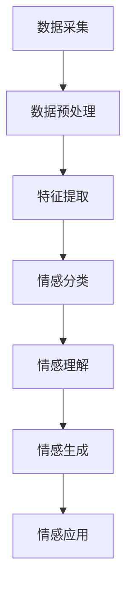

                 

### 1.1 书籍背景与目的

在现代新闻传播领域，人工智能（AI）已经成为不可忽视的重要力量。随着技术的不断发展，AI在新闻传播中的应用范围不断扩大，从内容生成、信息筛选到数据分析和趋势预测等方面，AI都发挥了巨大的作用。然而，传统AI在处理新闻内容时，往往局限于客观信息的呈现，缺乏对情感因素的理解和把握。这就带来了一个挑战：如何在保证新闻传播的客观性的同时，充分利用AI的情感计算能力，提升新闻内容的影响力？

《具有情感的AI在新闻传播中的角色：客观性与情感的平衡》这本书旨在探讨如何在新闻传播中实现情感AI的应用，并解决客观性与情感平衡的问题。本书的核心概念与联系如下：

首先，本书将介绍情感AI的基本概念和发展历程。情感AI是人工智能的一个分支，它致力于使机器能够理解和表达情感。情感计算是情感AI的核心技术，通过分析和理解人类情感的内涵，实现对情感信号的识别和建模。情感AI的发展不仅涉及到自然语言处理、计算机视觉等传统AI技术，还涉及到心理学、社会学等多个领域的知识。因此，了解情感AI的基本概念和发展历程，有助于我们更好地理解其在新闻传播中的应用潜力。

其次，本书将深入探讨情感AI在新闻传播中的应用现状。随着AI技术的不断发展，越来越多的新闻传播机构开始尝试使用情感AI技术。例如，利用情感分析算法对新闻内容进行情感分类，可以帮助编辑和记者更好地了解读者对新闻的反应；利用情感生成技术，可以创作出更具吸引力的新闻内容；利用情感传播分析，可以实时监测新闻的传播效果，调整传播策略。然而，这些应用也带来了新的挑战，例如如何确保新闻的客观性，如何在情感AI与客观性之间实现平衡。

最后，本书将提出一些实现情感AI与客观性平衡的方法和策略。这些方法和策略包括：在情感AI算法的设计和实现过程中，充分考虑新闻传播的客观性要求；通过用户反馈和专家评估，不断优化和调整情感AI算法；制定相关的伦理规范和法律法规，确保情感AI在新闻传播中的合法合规使用。通过这些方法和策略，我们可以更好地实现情感AI在新闻传播中的应用，提升新闻传播的效果和影响力。

总之，《具有情感的AI在新闻传播中的角色：客观性与情感的平衡》这本书旨在为读者提供一个全面、深入的了解情感AI在新闻传播中的应用现状和未来发展趋势的视角。通过本书的阅读，读者可以掌握情感AI的基本概念、核心技术，以及其在新闻传播中的应用方法和策略。同时，本书也提出了实现情感AI与客观性平衡的挑战和解决方案，为新闻传播领域的技术创新和实践提供了有益的参考。

### 1.2 情感AI的基本概念

情感AI，即具有情感的人工智能，是人工智能领域中的一个重要分支。它旨在使机器能够理解和表达情感，从而更好地与人类互动。情感计算是情感AI的核心技术，通过分析和理解人类情感的内涵，实现对情感信号的识别和建模。

#### 情感计算的定义与发展

情感计算可以追溯到20世纪90年代，当时一些科学家开始尝试通过计算机模拟人类情感。情感计算的定义包括以下几个关键点：

1. **情感识别**：通过分析人类的行为、语音、面部表情等，识别出人类情感状态。
2. **情感理解**：对情感信号进行深入分析，理解其背后的含义和情感强度。
3. **情感生成**：使机器能够根据特定情境生成相应的情感表达。

随着计算机科学和认知心理学的发展，情感计算逐渐成为人工智能研究中的一个重要方向。近年来，随着深度学习、自然语言处理和计算机视觉等技术的进步，情感计算的研究取得了显著进展。

#### 情感AI的技术框架

情感AI的技术框架主要包括以下几个关键组成部分：

1. **数据采集**：通过传感器、摄像头、麦克风等设备收集人类情感信号，如面部表情、语音、生理信号等。
2. **情感识别**：利用机器学习算法，如支持向量机（SVM）、深度神经网络（DNN）等，对情感信号进行分类和识别。
3. **情感理解**：通过自然语言处理（NLP）技术，对文本、语音等情感信息进行语义分析，理解情感的含义和情感强度。
4. **情感生成**：根据情感理解的结果，生成相应的情感表达，如语音合成、文本生成等。
5. **反馈机制**：通过用户反馈，不断优化情感识别和生成的准确性和有效性。

#### 情感AI在新闻传播中的应用

情感AI在新闻传播中的应用具有广泛的前景。以下是一些典型的应用场景：

1. **情感分析**：利用情感分析算法，对新闻报道进行情感分类，帮助编辑和记者了解读者对新闻内容的情感反应，从而调整新闻内容策略。
2. **情感编辑**：在新闻编辑过程中，利用情感生成技术，创作出更具吸引力的新闻标题和内容，提高新闻的传播效果。
3. **情感传播分析**：通过情感传播分析，实时监测新闻的传播效果，识别情感热点和传播趋势，为新闻传播提供数据支持。

#### 情感AI的技术架构与数据处理流程

情感AI的技术架构可以分为以下几个层次：

1. **数据采集层**：包括传感器、摄像头、麦克风等设备，用于收集情感信号。
2. **数据处理层**：利用机器学习和深度学习算法，对情感信号进行预处理、特征提取和分类。
3. **情感理解层**：结合自然语言处理技术，对文本、语音等情感信息进行语义分析，实现情感理解和情感生成。
4. **情感应用层**：将情感分析、情感编辑和情感传播分析的结果应用于新闻传播实践。

以下是一个简化的情感AI数据处理流程：

```
数据采集 → 数据预处理 → 特征提取 → 情感分类 → 情感理解 → 情感生成 → 情感应用
```

#### Mermaid流程图

为了更好地展示情感AI的技术架构与数据处理流程，我们使用Mermaid语言绘制了一个简化的流程图：



通过这个流程图，我们可以清晰地看到情感AI从数据采集到应用的全过程，从而更好地理解其在新闻传播中的作用。

### 1.3 AI在新闻传播中的应用现状

随着人工智能技术的飞速发展，AI在新闻传播中的应用越来越广泛，成为现代新闻业的重要工具。以下是AI在新闻传播中的应用现状，以及AI对新闻传播的影响和挑战。

#### AI在新闻传播中的应用现状

1. **内容生成**：AI可以自动生成新闻内容，包括体育新闻、财经新闻等。例如，财经新闻网站可以使用AI来生成市场分析报告、股票行情更新等。
2. **信息筛选**：AI通过机器学习算法对大量新闻信息进行筛选和分类，帮助用户快速找到感兴趣的内容。例如，新闻聚合平台利用AI技术推荐用户可能感兴趣的新闻。
3. **情感分析**：AI可以对新闻报道进行情感分析，识别新闻中的情感倾向，为编辑提供参考。例如，一些媒体机构使用情感分析来了解读者对新闻的反应，从而调整报道策略。
4. **数据可视化**：AI可以帮助新闻编辑将复杂的数据转化为易于理解的可视化图表，提高新闻的可读性和吸引力。
5. **智能客服**：AI驱动的智能客服系统能够回答用户关于新闻的提问，提供新闻资讯服务。

#### AI对新闻传播的影响

1. **提高效率**：AI可以自动化许多新闻生产和传播的环节，提高新闻机构的工作效率。
2. **拓展内容范围**：AI可以处理大量数据，挖掘出传统新闻无法覆盖的故事和话题，拓展新闻的内容范围。
3. **个性化服务**：AI可以根据用户兴趣和行为，提供个性化的新闻推荐，提升用户体验。
4. **增强互动性**：AI驱动的新闻平台可以实时与用户互动，收集反馈，优化新闻内容和服务。

#### AI在新闻传播中的挑战

1. **客观性挑战**：AI在处理新闻时，可能会因为算法偏差、数据质量问题而影响新闻的客观性。例如，情感AI在分析新闻时，可能会放大某些情感倾向，导致新闻内容偏向特定观点。
2. **伦理问题**：AI在新闻传播中的应用涉及到伦理问题，如隐私保护、信息透明度等。例如，使用用户数据来个性化推荐新闻可能会侵犯用户隐私。
3. **技术依赖**：过度依赖AI技术可能会导致新闻机构失去独立思考和创新能力，对AI技术的依赖性增加。
4. **算法透明度**：AI算法的复杂性和黑箱性使得用户和编辑难以理解其决策过程，增加了算法的透明度问题。

#### AI在新闻传播中的平衡策略

为了解决AI在新闻传播中的挑战，实现客观性与情感平衡，可以采取以下策略：

1. **算法透明度**：提高AI算法的透明度，使新闻编辑和用户能够理解AI的决策过程，从而提高新闻的客观性。
2. **多样化数据源**：使用多样化的数据源，避免数据偏差，提高AI算法的可靠性。
3. **人工审核**：在AI生成的新闻内容中加入人工审核环节，确保新闻的客观性和准确性。
4. **伦理培训**：对新闻从业人员进行AI伦理培训，提高他们对AI在新闻传播中伦理问题的认识和处理能力。
5. **用户反馈**：收集用户反馈，不断优化AI算法，提高新闻内容的满足度和用户满意度。

通过以上策略，可以实现AI在新闻传播中的应用与新闻客观性的平衡，提高新闻传播的质量和影响力。

### 1.4 客观性与情感的平衡

在新闻传播中，客观性一直被视为核心原则。传统新闻学强调报道事实的真实、全面和公正，而情感AI的引入为新闻传播带来了新的挑战。情感AI通过情感计算，能够分析和生成情感内容，提高新闻的吸引力和影响力，但同时也可能影响新闻的客观性。

#### 情感AI对客观性的挑战

情感AI在新闻传播中的应用可能带来以下几方面的挑战：

1. **情感偏差**：情感AI在分析新闻内容时，可能会因为情感偏见而导致新闻内容偏向某些情感倾向，从而影响客观性。例如，情感分析算法可能会过度强调正面或负面情感，导致新闻报道出现情感倾斜。
2. **数据偏见**：情感AI的训练数据往往存在偏见，这些偏见可能反映在算法的决策中，进而影响新闻内容的客观性。例如，如果训练数据中存在性别、种族偏见，那么AI生成的新闻内容也可能体现这些偏见。
3. **情感生成**：情感AI能够根据情感分析结果生成情感内容，这种生成内容可能不遵循客观性原则，而是根据情感需求进行调整。例如，为了提高新闻的吸引力，AI可能会夸大某些情感元素，从而偏离事实。
4. **用户反馈影响**：用户对新闻内容的情感反馈可能影响AI的后续生成和推荐，这种反馈循环可能会导致新闻内容越来越偏向情感需求，而忽视客观性。

#### 实现情感AI与客观性平衡的方法和策略

为了在情感AI与客观性之间找到平衡，可以采取以下策略：

1. **算法透明度**：提高情感AI算法的透明度，使新闻编辑和用户能够理解AI的决策过程。例如，通过可视化工具展示情感分析的关键步骤和结果，帮助用户了解新闻内容的生成过程。
2. **多样化数据源**：使用多样化的数据源，避免数据偏见。例如，可以结合多种语言、多种来源的数据进行训练，提高算法的公平性和客观性。
3. **人工审核**：在AI生成的新闻内容中加入人工审核环节，确保新闻内容的客观性和准确性。例如，编辑可以定期审查AI生成的新闻，根据实际情况进行调整。
4. **伦理培训**：对新闻从业人员进行AI伦理培训，提高他们对AI在新闻传播中伦理问题的认识和处理能力。例如，培训内容可以包括算法偏见、数据隐私、用户反馈等方面。
5. **用户反馈**：收集用户反馈，不断优化AI算法，提高新闻内容的满足度和用户满意度。例如，可以通过问卷调查、用户评论等方式收集用户反馈，根据反馈结果调整新闻内容和推荐策略。
6. **情感调节**：在情感AI算法中引入情感调节机制，使情感内容生成更加平衡。例如，可以设置情感强度的阈值，确保新闻内容在情感表达和客观性之间保持平衡。

#### 实践案例

以下是一个实践案例，展示如何在新闻传播中实现情感AI与客观性的平衡：

1. **新闻网站的情感分析**：一个新闻网站使用情感分析算法对用户评论进行分类，了解读者对新闻内容的情感反应。在分析过程中，网站不仅关注情感倾向，还关注评论内容的真实性。通过人工审核，确保评论内容的客观性，并在必要时进行修正。
2. **智能推荐系统的情感平衡**：一个智能推荐系统结合情感分析结果和用户历史行为，为用户推荐新闻。在推荐过程中，系统会根据情感平衡策略，调整新闻的推荐顺序，确保用户看到多样化、客观的新闻内容。
3. **新闻编辑室的协作**：在新闻编辑室中，编辑和AI系统共同工作。编辑负责审核和调整AI生成的新闻内容，确保其符合客观性原则。同时，编辑也会根据用户反馈和AI分析结果，调整新闻内容和推荐策略。

通过这些实践案例，我们可以看到，在情感AI与客观性之间找到平衡是可能的，也是必要的。只有在确保新闻内容客观性的基础上，情感AI才能真正发挥其在新闻传播中的潜力，提高新闻的吸引力和影响力。

### 2.1 情感识别与分类

情感识别与分类是情感AI的核心组成部分，通过分析和理解文本、语音等数据中的情感信息，实现对情感类型的准确判断。在这一部分，我们将详细介绍情感识别与分类的核心算法原理、文本情感分类的步骤以及相应的伪代码。

#### 情感识别算法原理

情感识别算法通常基于机器学习技术，特别是深度学习。以下是一个简化的情感识别算法原理：

1. **数据预处理**：将原始文本数据转换为适合训练的格式。包括分词、去除停用词、词干提取等。
2. **特征提取**：将预处理后的文本转换为特征向量。常用的特征提取方法包括词袋模型、词嵌入、TF-IDF等。
3. **模型训练**：使用训练集数据，通过反向传播算法训练深度神经网络，实现对情感类型的分类。
4. **模型评估**：使用测试集数据评估模型的分类效果，调整模型参数，提高分类准确率。

以下是一个简化的情感识别算法的伪代码：

```
输入：训练数据集 X，标签集 Y
输出：训练好的情感识别模型

1. 预处理数据：
   - 分词：将文本数据分词为单词或词组
   - 去除停用词：去除常见的无意义的单词
   - 词干提取：将单词还原为基本形式

2. 提取特征：
   - 使用词袋模型或词嵌入技术，将文本转换为特征向量

3. 训练模型：
   - 初始化神经网络参数
   - 使用反向传播算法训练模型，直至达到预设的准确率或迭代次数
   - 计算损失函数，如交叉熵损失

4. 评估模型：
   - 使用测试集数据评估模型
   - 计算模型的准确率、召回率、F1值等指标
   - 调整模型参数，提高分类效果

5. 输出模型：训练好的情感识别模型
```

#### 文本情感分类的步骤

文本情感分类通常包括以下几个步骤：

1. **数据收集**：收集大量的文本数据，包括正面、负面和中和情感样本。
2. **数据预处理**：对文本数据进行分词、去除停用词、词干提取等处理。
3. **特征提取**：将预处理后的文本转换为特征向量，如词袋模型、词嵌入等。
4. **模型训练**：使用训练集数据训练情感分类模型，常用的模型有支持向量机（SVM）、朴素贝叶斯（NB）、随机森林（RF）、深度神经网络（DNN）等。
5. **模型评估**：使用测试集数据评估模型的分类效果，调整模型参数，提高分类准确率。
6. **模型应用**：将训练好的模型应用于新文本数据的情感分类。

以下是一个简化的文本情感分类步骤的伪代码：

```
输入：训练数据集 X，标签集 Y，测试数据集 X_test
输出：情感分类模型及分类结果

1. 数据收集：
   - 收集正面、负面和中和情感样本

2. 数据预处理：
   - 分词：将文本数据分词为单词或词组
   - 去除停用词：去除常见的无意义的单词
   - 词干提取：将单词还原为基本形式

3. 特征提取：
   - 使用词袋模型或词嵌入技术，将文本转换为特征向量

4. 模型训练：
   - 选择情感分类模型，如SVM、NB、RF、DNN等
   - 使用训练集数据训练模型，直至达到预设的准确率或迭代次数
   - 计算损失函数，如交叉熵损失

5. 模型评估：
   - 使用测试集数据评估模型
   - 计算模型的准确率、召回率、F1值等指标
   - 调整模型参数，提高分类效果

6. 模型应用：
   - 对测试数据集进行情感分类
   - 输出分类结果

7. 输出：情感分类模型及分类结果
```

#### 情感分类的数学模型

在情感分类过程中，常用的数学模型包括：

1. **逻辑回归（Logistic Regression）**：用于二分类问题，输出一个概率值，表示属于某一情感类别的概率。
2. **支持向量机（SVM）**：通过寻找最佳分割超平面，实现多分类问题。
3. **朴素贝叶斯（Naive Bayes）**：基于贝叶斯定理，通过特征条件概率计算情感类别概率。
4. **深度神经网络（DNN）**：通过多层神经网络，实现对文本的复杂特征提取和分类。

以下是一个简化的逻辑回归的数学模型：

```
给定特征向量 X 和权重向量 W，计算情感类别概率：

P(y=1|X; W) = sigmoid(W^T * X)

其中，sigmoid 函数为：
sigmoid(z) = 1 / (1 + exp(-z))

y=1 表示文本属于正面情感类别，y=0 表示属于负面情感类别。
W^T * X 为特征向量与权重的内积，sigmoid 函数将结果转换为概率值。
```

#### 情感分类的关键参数设定与调整

在情感分类过程中，关键参数的设定和调整对模型性能有重要影响。以下是一些常见的关键参数及其调整方法：

1. **学习率**：控制梯度下降过程中的步长，常用的调整方法包括固定学习率、学习率衰减等。
2. **正则化参数**：用于防止过拟合，常用的正则化方法有L1正则化、L2正则化等。
3. **隐藏层神经元数量**：在深度神经网络中，隐藏层的神经元数量对模型性能有显著影响，通常通过交叉验证等方法进行选择。
4. **批处理大小**：在训练过程中，批处理大小影响梯度下降的计算效率，通常通过实验调整。

通过合理设定和调整这些参数，可以显著提高情感分类模型的性能。

### 2.2 情感生成与编辑

在新闻传播中，情感生成与编辑是利用情感AI技术提升新闻内容吸引力和用户参与度的重要手段。情感生成与编辑的核心在于根据文本的情感倾向生成相应的情感内容，并对现有新闻内容进行情感调整，使其更符合目标受众的情感需求。以下将详细讲解情感生成与编辑的核心算法原理、基于情感的文本生成步骤和伪代码，以及情感调节的数学模型和情感强度计算与调整方法。

#### 情感生成算法原理

情感生成算法通过分析文本的情感倾向，生成具有特定情感色彩的新文本内容。其核心思想包括：

1. **情感分析**：首先，对输入文本进行情感分析，确定其情感倾向。常用的情感分析模型有基于机器学习的情感分类器和深度学习模型，如卷积神经网络（CNN）和循环神经网络（RNN）。

2. **情感映射**：将情感分析结果映射到预定义的情感词库中，找到与情感倾向相关的情感词汇和短语。

3. **文本生成**：根据情感映射结果，生成新的文本内容。文本生成方法包括基于模板的生成、基于序列到序列（Seq2Seq）的生成和生成对抗网络（GAN）等。

4. **情感调节**：在文本生成过程中，根据具体应用需求对情感强度进行调整，确保生成的文本情感色彩适中，符合新闻传播的客观性原则。

以下是一个简化的情感生成算法原理的伪代码：

```
输入：文本 T，目标情感类型 E
输出：生成的新文本内容 G

1. 情感分析：
   - 使用情感分类模型分析文本 T 的情感倾向，得到情感类型 E。

2. 情感映射：
   - 查找情感词库，找到与目标情感类型 E 相关的情感词汇和短语。

3. 文本生成：
   - 根据情感映射结果，生成新的文本内容 G。
   - 如果使用基于模板的生成方法：
     - 从模板库中选择与情感类型 E 相关的模板。
     - 替换模板中的占位符，生成新文本。
   - 如果使用基于 Seq2Seq 的生成方法：
     - 输入情感倾向 E，通过编码器生成编码表示。
     - 输出编码表示，通过解码器生成新文本。

4. 情感调节：
   - 根据应用需求，对生成文本的情感强度进行调整。
   - 如果情感强度过强，进行情感减弱处理；如果情感强度过弱，进行情感增强处理。

5. 输出：生成的新文本内容 G
```

#### 基于情感的文本生成步骤

基于情感的文本生成过程可以分为以下几个步骤：

1. **文本预处理**：对输入文本进行分词、去停用词、词性标注等预处理操作，以便后续的情感分析和文本生成。

2. **情感分析**：使用情感分类模型对预处理后的文本进行情感分析，确定文本的情感倾向。常用的情感分类模型包括基于机器学习的SVM、朴素贝叶斯等，以及深度学习的CNN、RNN等。

3. **情感映射**：根据情感分类结果，查找情感词库，找到与目标情感类型相关的情感词汇和短语。情感词库通常包含正面、负面和中性情感词汇，以及情感强度标记。

4. **文本生成**：根据情感映射结果，生成新的文本内容。文本生成方法包括基于模板的生成、基于序列到序列（Seq2Seq）的生成和生成对抗网络（GAN）等。基于模板的生成方法简单高效，适用于快速生成文本；基于Seq2Seq的生成方法能够生成更复杂、连贯的文本内容；生成对抗网络（GAN）能够生成多样化、高质量的文本内容。

5. **情感调节**：在生成文本的过程中，根据具体应用需求对情感强度进行调整。情感调节可以确保生成的文本情感色彩适中，符合新闻传播的客观性原则。

以下是一个简化的基于情感的文本生成步骤的伪代码：

```
输入：原始文本 T
输出：生成的新文本内容 G

1. 文本预处理：
   - 分词：将文本 T 分词为单词或词组
   - 去停用词：去除常见的无意义的单词
   - 词性标注：对每个词进行词性标注

2. 情感分析：
   - 使用情感分类模型对文本 T 进行情感分析
   - 输出文本的情感类型和情感强度

3. 情感映射：
   - 根据情感类型，查找情感词库
   - 选择与情感类型相关的情感词汇和短语

4. 文本生成：
   - 如果使用基于模板的生成方法：
     - 从模板库中选择与情感类型相关的模板
     - 替换模板中的占位符，生成新文本
   - 如果使用基于Seq2Seq的生成方法：
     - 编码：将情感类型编码为向量
     - 解码：根据编码向量生成新文本

5. 情感调节：
   - 根据情感强度，对生成的文本进行调整
   - 如果情感强度过强，进行情感减弱处理
   - 如果情感强度过弱，进行情感增强处理

6. 输出：生成的新文本内容 G
```

#### 情感调节的数学模型

情感调节的数学模型主要关注如何调整文本的情感强度，以实现特定的情感目标。以下是一个简化的情感调节数学模型：

1. **情感强度计算**：使用情感词库中的情感强度标记计算文本的情感强度。情感强度标记通常是一个实数值，表示情感词汇对整体情感的贡献。

   公式如下：
   $$ \text{情感强度} = \sum_{i=1}^{n} \text{情感词}_i \times \text{情感强度标记}_i $$

   其中，$\text{情感词}_i$ 表示文本中的第 i 个情感词，$\text{情感强度标记}_i$ 表示第 i 个情感词的情感强度。

2. **情感调节**：根据情感强度计算结果，对文本进行情感调节。情感调节可以通过以下方法实现：

   - **情感增强**：增加情感词的强度标记，增强文本的情感色彩。
   - **情感减弱**：减少情感词的强度标记，减弱文本的情感色彩。

   公式如下：
   $$ \text{调节后的情感强度} = \text{情感强度} \times \text{调节因子} $$

   其中，$\text{调节因子}$ 是一个介于 0 和 1 之间的实数，用于调整情感强度。

以下是一个简化的情感调节的伪代码：

```
输入：原始文本 T，目标情感强度 S
输出：调节后的文本内容 G

1. 情感强度计算：
   - 遍历文本 T，计算每个情感词的情感强度
   - 求和得到文本的总情感强度

2. 情感调节：
   - 根据目标情感强度 S，计算调节因子
   - 调整每个情感词的强度标记，实现情感调节

3. 文本生成：
   - 根据调节后的情感强度，生成新的文本内容 G

4. 输出：调节后的文本内容 G
```

#### 情感强度计算与调整方法

在实际应用中，情感强度的计算与调整是一个复杂的过程，需要考虑多种因素，包括情感词的选择、情感强度的量化、调节因子的设定等。以下是一些常用的情感强度计算与调整方法：

1. **情感词选择**：根据情感词库，选择与目标情感类型相关的情感词汇。情感词库通常包含正面、负面和中性情感词汇，以及情感强度标记。

2. **情感强度量化**：为每个情感词分配一个情感强度值。常用的量化方法包括基于词频的量化、基于情感词典的量化等。例如，使用情感词典将每个情感词的情感强度标记为 1 到 5 的数值。

3. **情感调节因子设定**：根据实际应用需求，设定适当的情感调节因子。情感调节因子可以是一个固定的值，也可以是一个动态调整的值，例如基于用户反馈或上下文信息。

4. **情感调节策略**：根据情感强度计算结果，选择适当的情感调节策略，如情感增强或情感减弱。常用的策略包括线性调节、非线性调节等。

通过上述方法，可以实现对文本情感强度的有效计算与调整，提高文本的情感色彩，满足不同的应用需求。

### 2.3 情感传播分析

情感传播分析是研究信息传播过程中情感动态变化的重要方法，通过分析情感在社交网络中的传播路径和影响，可以深入了解公众情感的变化趋势，为新闻传播策略提供数据支持。在这一部分，我们将详细讲解情感传播模型、情感传播的分析方法以及相应的伪代码。

#### 情感传播模型

情感传播模型是用于模拟和预测情感在社交网络中传播过程的数学模型。常见的情感传播模型包括以下几种：

1. **SIR模型**：这是一种用于疾病传播的模型，也可以应用于情感传播。模型将社交网络中的个体分为三个状态： susceptible（易感状态）、infected（感染状态）和 recovered（恢复状态）。

   公式如下：
   $$ S(t) + I(t) + R(t) = N $$
   $$ \frac{dS}{dt} = -\beta \cdot S \cdot I $$
   $$ \frac{dI}{dt} = \beta \cdot S \cdot I - \gamma \cdot I $$
   $$ \frac{dR}{dt} = \gamma \cdot I $$

   其中，$S(t)$、$I(t)$ 和 $R(t)$ 分别表示时间 t 时处于易感状态、感染状态和恢复状态的个体数量，$N$ 是总个体数，$\beta$ 是感染率，$\gamma$ 是恢复率。

2. **SI模型**：这是一种简化版的SIR模型，假设所有感染者在恢复后不再具有传染性。

   公式如下：
   $$ \frac{dS}{dt} = -\beta \cdot S \cdot I $$
   $$ \frac{dI}{dt} = \beta \cdot S \cdot I $$

   其中，$S(t)$ 和 $I(t)$ 分别表示时间 t 时处于易感状态和感染状态的个体数量。

3. **基于情感的传播模型**：这类模型考虑情感的影响，将社交网络中的个体情感状态纳入传播过程。一个简单的模型可以是：

   $$ \frac{dI}{dt} = \beta \cdot S \cdot I - \gamma \cdot I - \alpha \cdot I^2 $$

   其中，$I(t)$ 表示时间 t 时处于感染状态的个体数量，$\alpha$ 是情感强度参数，反映了感染情感对个体的影响。

#### 情感传播的分析方法

情感传播分析主要包括以下几个步骤：

1. **情感识别**：首先，对社交网络中的文本、语音等数据进行情感识别，确定个体的情感状态。这可以通过情感分析算法实现，如基于机器学习和深度学习的情感分类器。

2. **网络构建**：构建社交网络模型，描述个体之间的互动关系。这可以通过图论方法实现，将个体视为节点，互动关系视为边。

3. **传播模拟**：使用情感传播模型模拟情感在社交网络中的传播过程，预测不同时间点上的情感状态分布。这可以通过数值计算方法实现，如欧拉法、龙格-库塔法等。

4. **效果评估**：评估情感传播的效果，如感染率、感染范围等。这可以通过计算模型参数的统计量实现。

以下是一个简化的情感传播分析方法的伪代码：

```
输入：社交网络图 G，情感分析模型 M，情感传播模型 P
输出：情感传播结果 R

1. 情感识别：
   - 对社交网络中的每个节点进行情感分析
   - 使用情感分类器 M 标记每个节点的情感状态

2. 网络构建：
   - 使用图论方法构建社交网络图 G
   - 将节点和边的数据结构化存储

3. 传播模拟：
   - 初始化节点情感状态
   - 使用情感传播模型 P 模拟情感传播过程
   - 更新节点情感状态，计算传播效果

4. 效果评估：
   - 计算感染率、感染范围等统计量
   - 分析传播结果，调整模型参数

5. 输出：情感传播结果 R
```

#### 情感传播的动力学模型

情感传播的动力学模型描述了情感在社交网络中的传播过程，其核心是建立情感状态变化的动态方程。以下是一个简化的情感传播动力学模型的伪代码：

```
输入：社交网络图 G，初始情感状态 S0
输出：时间序列的情感状态分布 St

1. 初始化：
   - 根据社交网络图 G，初始化节点的情感状态 S0

2. 迭代：
   - 对于每个时间步 t：
     - 更新节点的情感状态 St：
       - 对每个节点 i：
         - 计算感染概率：
           - $$ \text{感染概率} = \beta \cdot \frac{S_t(i)}{N} $$
         - 更新情感状态：
           - $$ S_{t+1}(i) = S_t(i) + \text{感染概率} \cdot (1 - S_t(i)) $$

3. 计算传播效果：
   - 计算感染率、感染范围等统计量

4. 输出：时间序列的情感状态分布 St
```

通过上述模型和方法，我们可以模拟和分析情感在社交网络中的传播过程，深入了解公众情感的变化趋势，为新闻传播策略提供科学依据。

#### 情感节点的识别与影响分析

在情感传播分析中，识别并分析情感节点对于理解情感传播的关键性具有重要意义。情感节点是指那些在情感传播过程中起到重要影响作用的节点，这些节点可能是信息的传播者，也可能是情感反应的聚集点。以下是情感节点的识别与影响分析的方法：

1. **中心性度量**：通过计算节点的中心性度量，如度中心性、介数中心性和接近中心性，识别出在社交网络中具有较高连接度的节点。这些节点往往在情感传播中起到关键作用，因为它们可以影响到较多的其他节点。具体计算方法如下：

   - **度中心性**：节点 i 的度中心性定义为与其直接相连的节点数量，公式为：
     $$ C_{deg}(i) = \frac{k_i}{N-1} $$
     其中，$k_i$ 是节点 i 的度（即连接的边数），$N$ 是网络中节点的总数。

   - **介数中心性**：节点 i 的介数中心性定义为它所在的所有最短路径的比例，公式为：
     $$ C_{between}(i) = \frac{\sum_{s \neq i} \sum_{t \neq i} \frac{P_{st}(i)}{d_{st}}}{N \cdot (N-2)} $$
     其中，$P_{st}(i)$ 是从节点 s 到节点 t 的路径中经过节点 i 的最短路径数量，$d_{st}$ 是从节点 s 到节点 t 的最短路径数量。

   - **接近中心性**：节点 i 的接近中心性定义为它与网络中其他节点的平均距离，公式为：
     $$ C_{clos}(i) = \frac{\sum_{j \neq i} d_{ij}}{N - 1} $$
     其中，$d_{ij}$ 是从节点 i 到节点 j 的距离。

2. **影响力评估**：通过计算节点的传播影响力，评估其在情感传播中的关键作用。影响力评估可以基于情感传播的动力学模型进行，计算节点对其他节点情感状态变化的贡献。具体计算方法如下：

   - **传播影响力**：节点 i 的传播影响力定义为其在一定时间窗口内成功感染其他节点的次数，公式为：
     $$ \text{影响力}_{i} = \sum_{j \neq i} \text{感染次数}_{ij} $$
     其中，$\text{感染次数}_{ij}$ 表示节点 i 在时间窗口内成功感染节点 j 的次数。

   - **传播效率**：节点 i 的传播效率定义为其感染次数与度中心性的比值，公式为：
     $$ \text{效率}_{i} = \frac{\text{影响力}_{i}}{C_{deg}(i)} $$
     高效率的节点可能在情感传播中起到更大的作用。

3. **实证分析**：通过实证分析，验证所识别的情感节点在真实社交网络中的传播效果。例如，通过比较实验组与对照组的感染率、感染范围等指标，评估情感节点识别与影响分析方法的实际效果。

4. **网络分割**：利用社区检测算法，对社交网络进行分割，识别出情感传播的子社区。在子社区中，情感节点的识别与影响分析可以更加精细，有助于理解情感传播的局部特性。

通过上述方法，我们可以有效地识别情感节点，并分析其在情感传播中的关键作用，为新闻传播策略提供有力的数据支持。

### 2.4 情感AI在新闻编辑中的应用

在新闻编辑过程中，情感AI的应用可以极大地提升新闻内容的质量和受众的参与度。通过情感分析、情感生成和情感调节等技术，新闻编辑可以更精准地了解读者的情感需求，创作出更符合受众期待的新闻内容。以下将介绍情感AI在新闻编辑中的实际应用案例、应用流程以及效果分析。

#### 应用案例

1. **新闻网站的情感分析**：某新闻网站使用情感AI技术对用户评论进行情感分析，了解读者对新闻内容的情感反应。通过情感分类算法，将评论分为正面、负面和中性三种情感，编辑团队可以根据这些反馈调整新闻内容的情感色彩，提高用户满意度。

2. **情感新闻标题生成**：另一个应用案例是某新闻机构利用情感生成技术，为新闻生成具有吸引力的标题。该系统首先分析新闻内容的情感倾向，然后生成相应的情感标题。例如，对于一则正面新闻，系统可能会生成“振奋人心的好消息！”这样的标题，而对于一则负面新闻，则可能会生成“令人失望的意外事件！”这样的标题。

3. **实时情感调节**：在新闻事件报道中，情感AI可以实时监测新闻报道的情感倾向，根据用户反馈进行情感调节。例如，当用户对某篇新闻内容的情感反应过于强烈时，编辑团队可以及时调整报道的情感色彩，避免引发不必要的负面情绪。

#### 应用流程

情感AI在新闻编辑中的应用流程通常包括以下几个步骤：

1. **数据采集**：首先，从新闻网站的用户评论、社交媒体反馈等渠道收集用户数据。这些数据用于情感分析，以了解用户的情感反应。

2. **情感分析**：利用情感分析算法，对采集到的用户数据进行情感分类。情感分析可以识别出文本中的情感倾向，如喜悦、愤怒、悲伤等。

3. **情感生成**：根据新闻内容的情感倾向，使用情感生成技术生成相应的情感标题或情感编辑内容。情感生成算法可以根据不同的情感类别，选择合适的情感词汇和表达方式。

4. **情感调节**：在新闻事件报道过程中，情感AI可以实时监测新闻报道的情感色彩，并根据用户反馈进行情感调节。例如，如果用户对某篇新闻的情感反应过于负面，编辑团队可以减少负面情感词汇的使用，调整报道的情感色彩。

5. **效果评估**：最后，对生成的新闻内容进行效果评估。通过用户反馈、点击率、评论数量等指标，评估情感AI在新闻编辑中的应用效果。

#### 效果分析

1. **用户满意度提升**：通过情感分析，编辑团队可以更精准地了解用户的情感需求，创作出更符合读者期待的新闻内容。例如，某新闻网站在引入情感分析后，用户满意度显著提升，用户评论数量和互动率也有明显增加。

2. **新闻传播效果改善**：情感生成和情感调节技术可以提升新闻标题和内容的吸引力，从而提高新闻的传播效果。例如，使用情感生成技术生成的新闻标题，比传统标题更能吸引用户点击，提高新闻的点击率。

3. **情感色彩平衡**：通过实时情感调节，新闻编辑可以避免新闻报道过于情感化或单一化。例如，在报道重大新闻事件时，编辑团队可以根据用户反馈，适时调整报道的情感色彩，保持新闻的客观性和公正性。

4. **编辑效率提高**：情感AI技术可以自动化许多新闻编辑任务，如情感分析、情感标题生成和情感调节等。这大大减轻了编辑团队的工作负担，提高了编辑效率。

总之，情感AI在新闻编辑中的应用，不仅提升了新闻内容的质量和吸引力，还提高了编辑团队的工作效率，为新闻传播带来了显著的效果。通过不断优化和调整情感AI算法，新闻编辑可以更好地满足用户需求，提升新闻传播的效果和影响力。

### 2.5 情感AI在新闻传播中的伦理与法规问题

随着情感AI在新闻传播中的应用越来越广泛，其伦理和法规问题也日益凸显。情感AI的引入不仅改变了新闻生产和传播的方式，也对新闻的客观性、隐私保护、信息透明度和算法偏见等方面提出了新的挑战。

#### 伦理问题

1. **客观性挑战**：情感AI在新闻传播中的应用可能导致新闻内容偏向情感化，从而影响新闻的客观性。新闻业一直以来强调报道事实的真实、全面和公正，而情感AI可能会放大某些情感倾向，导致新闻内容偏离事实。例如，情感AI可能会在新闻报道中夸大正面情感，而忽略负面情感，从而影响新闻的公正性。

2. **算法偏见**：情感AI的训练数据可能存在偏见，这些偏见可能反映在算法的决策中，进而影响新闻内容的公正性。例如，如果训练数据中存在性别、种族或政治偏见，那么情感AI在分析新闻时也可能会表现出类似的偏见。这种偏见可能导致新闻传播中的不公平现象。

3. **用户隐私**：情感AI在新闻传播中的应用往往需要收集大量的用户数据，包括用户评论、浏览历史、社交网络信息等。这些数据的收集和使用可能涉及用户隐私问题。例如，用户的情感状态和兴趣偏好可能会被商业机构或政府机构利用，从而侵犯用户的隐私权。

4. **信息透明度**：情感AI在新闻传播中的应用可能降低新闻信息的透明度。用户和新闻编辑往往难以理解情感AI的决策过程，导致新闻内容缺乏透明性。例如，用户可能不清楚情感AI如何分析他们的评论，以及这些分析如何影响新闻推荐。

#### 法规问题

1. **数据隐私保护**：随着情感AI在新闻传播中的应用，用户数据的隐私保护问题越来越重要。许多国家和地区已经制定了相关的数据隐私保护法规，如欧盟的《通用数据保护条例》（GDPR）。这些法规要求新闻机构在收集和使用用户数据时，必须获得用户的明确同意，并保护用户数据的安全。

2. **算法透明度**：为了防止算法偏见和滥用，许多国家和地区的法规要求提高算法的透明度。例如，美国的《算法问责法案》（Algorithmic Accountability Act）提议建立一套算法透明度的标准，要求新闻机构公开其算法的设计和决策过程。

3. **新闻公正性**：一些国家和地区的法规也关注新闻传播的公正性问题。例如，欧盟的《媒体自由指令》要求成员国采取措施，防止新闻媒体受到商业利益和政治压力的影响，确保新闻内容的独立性和公正性。

#### 解决策略

1. **算法透明度**：提高情感AI算法的透明度，使新闻编辑和用户能够理解AI的决策过程。例如，可以通过可视化工具展示情感分析的关键步骤和结果，帮助用户了解新闻内容的生成过程。

2. **多样化数据源**：使用多样化的数据源，避免算法偏见。例如，可以结合多种语言、多种来源的数据进行训练，提高算法的公平性和客观性。

3. **伦理培训**：对新闻从业人员进行AI伦理培训，提高他们对AI在新闻传播中伦理问题的认识和处理能力。例如，培训内容可以包括算法偏见、数据隐私、用户反馈等方面。

4. **用户反馈**：收集用户反馈，不断优化情感AI算法，提高新闻内容的满足度和用户满意度。例如，可以通过问卷调查、用户评论等方式收集用户反馈，根据反馈结果调整新闻内容和推荐策略。

5. **法规遵循**：确保情感AI在新闻传播中的合法合规使用，遵守相关法规，如数据隐私保护法、算法透明度法规等。

通过上述策略，可以在一定程度上解决情感AI在新闻传播中面临的伦理和法规问题，确保新闻传播的客观性、公正性和透明度。

### 3.1 情感AI在社交媒体新闻中的应用

社交媒体新闻作为现代新闻传播的重要渠道，其互动性和即时性使得情感AI的应用尤为突出。以下将详细描述情感AI在社交媒体新闻中的应用场景、具体实现和效果评估。

#### 应用场景

1. **情感分析**：社交媒体新闻平台可以通过情感AI技术对用户评论和转发进行情感分析，识别出情感倾向。例如，通过分析用户对新闻报道的评论，平台可以了解用户对新闻内容的态度，从而调整内容策略。

2. **情感生成**：情感AI可以自动生成情感标题和摘要，提高新闻报道的吸引力。例如，对于一则正面新闻，系统可以生成“振奋人心的好消息！”这样的情感标题，而对于一则负面新闻，则可以生成“令人失望的意外事件！”这样的标题。

3. **情感推荐**：基于用户情感倾向，情感AI可以为用户提供个性化的新闻推荐。通过分析用户的历史行为和情感反应，平台可以推荐用户可能感兴趣的情感类新闻。

4. **情感监测**：情感AI可以实时监测社交媒体上的情感动态，帮助新闻编辑及时调整报道策略。例如，在重大新闻事件发生时，系统可以实时分析用户的情感反应，为编辑提供数据支持，以便及时调整报道的方向和情感色彩。

#### 具体实现

1. **情感分析**：首先，从社交媒体平台收集用户评论和转发数据。使用情感分析算法，对文本数据进行情感分类，识别出正面、负面和中性情感。常用的情感分析模型包括基于机器学习的情感分类器和深度学习模型，如卷积神经网络（CNN）和循环神经网络（RNN）。

2. **情感生成**：基于情感分析结果，生成具有特定情感色彩的新标题和摘要。情感生成算法可以使用基于模板的生成方法，根据情感类别选择合适的情感模板，并替换模板中的关键词。例如，对于正面情感，可以选择庆祝、兴奋等情感模板；对于负面情感，可以选择失望、沮丧等情感模板。

3. **情感推荐**：通过分析用户的情感倾向和历史行为，构建用户情感模型。基于用户情感模型，使用协同过滤或基于内容的推荐算法，为用户推荐可能感兴趣的情感类新闻。

4. **情感监测**：实时收集社交媒体上的情感数据，使用情感传播模型模拟情感动态变化。通过分析情感传播趋势，为新闻编辑提供数据支持，以便及时调整报道策略。

#### 效果评估

1. **情感分析准确率**：通过测试集数据评估情感分析模型的准确率、召回率和F1值等指标。高准确率意味着系统能够准确识别用户的情感倾向，从而提高内容策略的精准度。

2. **情感生成吸引力**：通过用户反馈和点击率等指标评估情感生成标题和摘要的吸引力。高点击率意味着用户对情感生成内容更感兴趣，从而提高新闻传播效果。

3. **情感推荐满意度**：通过用户满意度调查和用户留存率等指标评估情感推荐系统的效果。高满意度意味着用户对个性化推荐的接受度较高，从而提高用户粘性和平台活跃度。

4. **情感监测及时性**：通过分析情感监测结果，评估新闻编辑在情感动态变化中调整报道策略的及时性。高及时性意味着系统能够快速响应情感变化，从而提高新闻报道的及时性和准确性。

通过上述应用场景、具体实现和效果评估，我们可以看到情感AI在社交媒体新闻中的重要作用。通过情感分析和生成，可以提升新闻内容的吸引力和用户参与度；通过情感推荐和监测，可以更好地满足用户需求，提高新闻传播的效果和影响力。

### 3.2 情感AI在电视新闻中的应用

情感AI在电视新闻中的应用正逐渐成为提升节目吸引力和观众参与度的重要工具。以下将详细介绍情感AI在电视新闻中的实际应用案例，包括应用流程、具体实现和效果分析。

#### 应用案例

1. **情感标题生成**：电视新闻节目使用情感AI技术生成具有吸引力的标题。例如，在报道一场重大赛事时，系统可以自动生成如“激动人心的决赛时刻！”这样的情感标题，以激发观众的观看兴趣。

2. **情感字幕生成**：情感AI技术可以自动生成与新闻内容情感色彩相匹配的字幕。例如，在报道一则感人故事时，系统可以生成温馨、感人的字幕，增强观众的情感共鸣。

3. **情感编辑**：在节目制作过程中，情感AI可以对新闻内容进行情感调整，确保节目的整体情感色彩符合观众期望。例如，在编辑一部纪录片时，编辑团队可以利用情感AI技术，调整片段的情感强度，使其更符合节目主题。

4. **情感监测**：通过实时情感监测，情感AI可以评估观众的实时情感反应，为节目制作和播出策略提供数据支持。例如，在节目播出过程中，系统可以监测观众的情感波动，为调整节目节奏和内容提供参考。

#### 应用流程

情感AI在电视新闻中的应用流程通常包括以下步骤：

1. **情感分析**：首先，对新闻内容进行情感分析，识别其情感色彩。情感分析可以使用文本情感分类算法，如基于机器学习的情感分类器和深度学习模型。

2. **情感生成**：根据情感分析结果，生成相应的情感标题、字幕和编辑内容。情感生成算法可以使用基于模板的生成方法，根据情感类别选择合适的情感模板，并替换模板中的关键词。

3. **情感调整**：在节目制作过程中，对新闻内容进行情感调整。编辑团队可以根据情感AI的建议，调整新闻片段的情感强度，确保节目整体情感色彩符合观众期望。

4. **情感监测**：实时监测观众的实时情感反应，通过情感波动分析为节目调整提供数据支持。情感监测可以使用实时情感分析技术和用户反馈数据。

#### 具体实现

1. **情感标题生成**：使用情感分析算法对新闻内容进行情感分类，确定其情感色彩。例如，对于一则正面新闻，系统可以生成“令人振奋的好消息！”这样的情感标题。

2. **情感字幕生成**：在字幕生成过程中，情感AI可以根据新闻内容情感色彩，选择合适的情感词汇和表达方式。例如，对于一则感人故事，系统可以生成温馨、感人的字幕。

3. **情感编辑**：编辑团队可以根据情感AI的建议，调整新闻片段的情感强度。例如，在编辑一部纪录片时，可以通过调整片段的时长、镜头切换速度等，增强观众的情感共鸣。

4. **情感监测**：在节目播出过程中，情感AI可以实时监测观众的实时情感反应。通过情感波动分析，系统可以识别观众的情感高峰和低谷，为节目制作和播出策略提供数据支持。

#### 效果分析

1. **情感标题吸引力**：通过用户反馈和点击率等指标评估情感标题的吸引力。高点击率意味着情感标题更能吸引观众的注意力，提高新闻传播效果。

2. **情感字幕效果**：通过用户观看行为和情感反应评估情感字幕的效果。高观看时长和积极情感反应表明观众对情感字幕更感兴趣，有助于提升节目吸引力。

3. **情感编辑效果**：通过节目收视率和观众满意度评估情感编辑的效果。高收视率和满意度表明观众对情感调整后的新闻内容更满意，节目质量得到提升。

4. **情感监测效果**：通过情感波动分析和观众反馈评估情感监测的效果。高及时性和高准确性表明系统能够有效监测观众情感变化，为节目调整提供有力支持。

通过上述实际应用案例、应用流程、具体实现和效果分析，我们可以看到情感AI在电视新闻中的重要应用价值。通过情感生成、情感调整和情感监测，情感AI能够提升新闻内容的吸引力和观众参与度，为电视新闻节目的成功提供有力支持。

### 3.3 情感AI在在线新闻平台中的应用

在线新闻平台作为现代新闻传播的重要渠道，其互动性和个性化推荐的需求使得情感AI的应用尤为关键。以下将详细介绍情感AI在在线新闻平台中的应用，包括功能、效果评估、用户反馈与改进建议。

#### 功能

1. **情感分析**：在线新闻平台使用情感AI对用户评论和浏览行为进行分析，识别用户的情感倾向。这一功能有助于平台了解用户对新闻内容的情感反应，从而优化推荐策略。

2. **情感推荐**：基于用户的情感倾向，情感AI为用户推荐符合其情感需求的新闻内容。例如，当用户表现出对某类新闻内容的积极情感时，系统可以推荐更多类似的内容。

3. **情感编辑**：情感AI可以对新闻内容进行情感调整，确保新闻标题和摘要更具吸引力。例如，对于负面新闻，系统可以生成缓解情绪的标题和摘要。

4. **情感监测**：在线新闻平台使用情感AI实时监测新闻内容的情感动态，及时发现用户情感波动，为内容调整和策略制定提供数据支持。

#### 效果评估

1. **用户点击率**：通过用户点击率评估情感推荐的效果。高点击率表明用户对情感推荐的新闻内容更感兴趣，推荐系统的有效性得到提升。

2. **用户停留时长**：通过用户在新闻平台上的停留时长评估情感编辑的效果。高停留时长表明用户对情感调整后的新闻内容更满意，提升了用户的阅读体验。

3. **用户满意度**：通过用户满意度调查评估情感AI的整体应用效果。高满意度表明用户对情感AI功能表示满意，平台的用户粘性得到提升。

4. **情感波动监测**：通过情感波动监测指标评估情感监测系统的效果。高准确性和高及时性表明系统能够有效监测用户情感变化，为内容调整提供有力支持。

#### 用户反馈与改进建议

1. **用户反馈收集**：在线新闻平台应积极收集用户对情感AI功能的反馈。通过问卷调查、用户评论等方式了解用户的需求和意见，为功能优化提供依据。

2. **个性化调整**：根据用户反馈，平台可以对情感AI的推荐和编辑策略进行个性化调整。例如，对于不同用户群体，可以提供差异化的情感推荐和编辑内容。

3. **算法优化**：持续优化情感AI算法，提高情感分析的准确性和推荐系统的效果。通过增加训练数据、改进情感模型等方法，不断提升系统的性能。

4. **用户教育**：通过平台宣传和教育，提高用户对情感AI技术的了解和接受度。例如，可以通过用户指南、互动教程等方式，让用户更好地理解和使用情感AI功能。

5. **透明度提升**：增强情感AI系统的透明度，使用户了解系统的运作原理和决策过程。例如，通过可视化工具展示情感分析结果和推荐逻辑，提升用户信任度。

通过用户反馈与改进建议，在线新闻平台可以不断提升情感AI功能的应用效果，为用户提供更优质的新闻体验。

### 3.4 情感AI在新闻事件报道中的应用

在新闻事件报道中，情感AI技术具有显著的应用价值，能够通过实时情感分析和调整，提升新闻报道的及时性、准确性和影响力。以下将详细介绍情感AI在新闻事件报道中的实际应用、实时分析与调整、以及新闻传播效果的评估。

#### 实际应用

1. **实时情感监测**：情感AI可以实时监测新闻事件中的公众情感变化。通过分析社交媒体、新闻评论和用户反馈等数据，系统可以识别出公众对新闻事件的情感反应，如兴奋、愤怒、悲伤等。

2. **情感分析**：情感AI对新闻报道的文本进行情感分析，确定新闻内容中的情感色彩。这有助于新闻编辑了解读者对新闻内容的情感反应，从而调整报道的叙述方式。

3. **情感调整**：在新闻报道过程中，情感AI可以根据公众情感变化，对新闻内容进行实时调整。例如，如果公众对某则新闻表现出强烈的负面情感，编辑可以减少负面情感词汇的使用，以缓解公众情绪。

4. **情感传播分析**：情感AI可以模拟情感在社交网络中的传播过程，预测情感动态变化。这有助于新闻编辑了解情感传播的趋势，制定更有效的传播策略。

#### 实时分析与调整

1. **情感波动检测**：情感AI通过实时监测社交媒体上的情感波动，及时发现公众情感变化。例如，当某则新闻引起公众愤怒时，系统可以迅速识别并报警。

2. **情感强度调节**：在新闻事件报道过程中，情感AI根据实时情感分析结果，调整新闻内容的情感强度。例如，如果公众对某则新闻表现出高度关注和紧张，编辑可以增加安抚性词汇，以缓解公众情绪。

3. **情感互动**：情感AI可以与新闻编辑和记者实时互动，提供情感分析报告和调整建议。例如，编辑可以根据情感AI的建议，修改新闻标题、导语和正文，使其更符合公众情感需求。

#### 新闻传播效果的评估

1. **情感传播效果评估**：通过分析情感AI监测到的公众情感变化，评估新闻事件的传播效果。例如，通过计算公众情感波动的峰值、持续时间等指标，评估情感传播的广度和深度。

2. **用户互动分析**：评估用户对新闻事件的情感反应，如评论数量、点赞率、分享率等。高互动率表明新闻内容引发了公众的强烈情感反应，传播效果较好。

3. **新闻传播影响评估**：通过评估新闻事件对社会舆论的影响，如媒体引用次数、公众讨论热度等，评估新闻事件的传播效果。高影响力表明新闻事件引起了广泛的关注和讨论。

4. **情感调节效果评估**：通过对比情感调节前后的新闻传播效果，评估情感调节的效果。如果情感调节后用户互动率和传播效果显著提升，说明情感调节策略是有效的。

#### 实际案例分析

1. **突发事件报道**：在突发事件的报道中，情感AI可以实时监测公众的情感波动，为新闻编辑提供数据支持。例如，在重大灾难事件中，情感AI可以帮助编辑了解公众的恐慌情绪，调整报道的叙述方式，以提供安抚性信息。

2. **政治事件报道**：在政治事件的报道中，情感AI可以分析公众对政治人物的看法和态度。通过情感分析，新闻编辑可以更好地了解公众的情感倾向，调整报道的角度和措辞。

3. **社会热点报道**：在社会热点事件的报道中，情感AI可以帮助新闻编辑识别公众关注的热点话题，调整报道的优先级和内容。例如，在疫情防控期间，情感AI可以监测公众对疫情发展的情感反应，帮助编辑了解公众对防控措施的态度，调整报道的内容和语气。

通过实际应用、实时分析与调整，以及新闻传播效果的评估，情感AI在新闻事件报道中能够显著提升新闻报道的及时性、准确性和影响力。同时，通过情感分析和情感调节，新闻编辑可以更好地满足公众的情感需求，提高新闻传播的吸引力和公信力。

### 4.1 情感AI在新闻传播中的未来发展趋势

随着人工智能技术的不断进步，情感AI在新闻传播中的应用前景愈发广阔。以下将探讨情感AI在新闻传播中的未来发展趋势，并展望相关领域的技术创新与突破。

#### 技术发展趋势

1. **更精准的情感分析**：未来的情感AI技术将进一步提升情感分析的精度，能够更准确地识别和理解复杂的情感。例如，通过结合多模态数据（如文本、语音、图像等），情感AI可以更全面地捕捉用户的情感状态。

2. **个性化推荐**：基于情感分析，情感AI将在新闻推荐中发挥更大作用，实现更加个性化的内容推荐。通过深度学习算法和用户情感模型，系统能够更好地预测用户的兴趣和需求，提供更加符合个人情感偏好的新闻内容。

3. **情感增强编辑**：情感AI将更加深入地参与到新闻内容的编辑过程中，通过情感增强技术，提升新闻内容的吸引力和感染力。例如，通过自动生成情感化的标题和摘要，增强新闻内容的吸引力和传播效果。

4. **情感监测与反馈**：情感AI将实现更实时的情感监测与反馈机制，能够动态监测新闻事件的情感动态，提供即时调整建议。这有助于新闻编辑在重大事件报道中，快速响应公众情感变化，提升新闻传播的及时性和准确性。

#### 技术创新与突破

1. **情感计算硬件**：随着硬件技术的发展，情感计算设备（如情感识别传感器、高分辨率摄像头等）将更加普及，为情感AI提供更多的数据输入。这些硬件设备将显著提升情感识别的精度和实时性。

2. **情感AI算法优化**：未来将出现更多高效的情感AI算法，通过优化深度学习模型和机器学习算法，提高情感分析的速度和准确率。例如，通过引入注意力机制和图神经网络，情感AI将能够更好地处理复杂的情感数据。

3. **多模态情感融合**：未来的情感AI将能够更好地融合多模态数据，通过结合文本、语音、图像和生理信号等，实现对用户情感的全面理解。这将有助于情感AI在新闻传播中实现更精准的个性化推荐和情感调节。

4. **跨领域情感分析**：情感AI将在不同领域实现交叉应用，如医疗、教育、金融等。通过跨领域的情感分析，情感AI可以提供更广泛的情感理解和服务，为新闻传播带来更多创新可能性。

#### 发展挑战

1. **数据隐私与安全**：随着情感AI在新闻传播中的应用，数据隐私和安全问题日益突出。如何保护用户的隐私数据，确保数据的安全性和合法性，是未来情感AI发展面临的重要挑战。

2. **伦理与法规**：情感AI在新闻传播中的应用涉及伦理和法规问题，如算法偏见、信息透明度等。未来需要建立更完善的伦理规范和法律法规，确保情感AI的合法合规使用。

3. **技术依赖与自主性**：随着情感AI技术的普及，新闻机构可能过度依赖AI技术，导致编辑和记者的自主性下降。如何平衡技术与人的角色，保持新闻传播的独立性和公正性，是未来需要解决的问题。

4. **情感多样性**：情感AI需要能够理解和处理多样化的情感表达，特别是在不同文化和社会背景下。如何提升情感AI对多样性情感的理解和处理能力，是未来情感AI发展的重要方向。

通过上述未来发展趋势和可能的技术创新与突破，我们可以期待情感AI在新闻传播中发挥更大的作用，为用户提供更加个性化和优质的新闻内容。同时，也需关注情感AI在新闻传播中面临的挑战，制定相应的策略和措施，确保其健康、可持续的发展。

### 4.2 情感AI在新闻传播中的挑战与应对策略

随着情感AI在新闻传播中的应用不断深入，其带来的挑战也逐渐显现。如何有效应对这些挑战，确保情感AI在新闻传播中的合法合规使用，是当前和未来需要重点解决的问题。以下将详细探讨情感AI在新闻传播中面临的挑战以及相应的应对策略。

#### 数据隐私与安全

数据隐私和安全是情感AI在新闻传播中面临的首要挑战。情感AI依赖于大量的用户数据，包括评论、浏览记录、社交媒体互动等，这些数据可能涉及用户的隐私。因此，确保用户数据的安全和隐私保护至关重要。

**应对策略**：

1. **数据匿名化**：在数据收集和处理过程中，对用户数据进行匿名化处理，避免直接关联到具体个人。这可以通过去除个人身份信息、加密数据等方式实现。

2. **数据加密**：对用户数据进行加密存储和传输，确保数据在传输和存储过程中不被未经授权的第三方访问。

3. **数据使用权限管理**：建立严格的数据使用权限管理制度，确保只有授权人员可以访问和处理用户数据。同时，定期对权限进行审计，防止数据滥用。

4. **用户知情同意**：在收集用户数据前，确保用户对数据收集和使用有充分的知情权，并获得用户的明确同意。这可以通过隐私政策、用户协议等方式实现。

#### 算法偏见

情感AI算法的偏见问题可能对新闻传播的客观性和公正性产生负面影响。如果算法训练数据存在偏见，那么算法的决策也可能反映出这些偏见，从而导致不公平的新闻内容。

**应对策略**：

1. **数据多样性**：确保算法训练数据具有多样性，避免数据集中反映特定群体的偏见。可以通过结合多种来源、多种语言和多种文化背景的数据进行训练。

2. **算法透明度**：提高算法的透明度，使新闻编辑和用户能够理解算法的决策过程。可以通过可视化工具展示算法的关键步骤和决策逻辑。

3. **伦理审核**：在算法设计和应用过程中，引入伦理审核机制，确保算法设计符合伦理标准和法规要求。可以聘请独立第三方机构进行伦理审查。

4. **持续监控与调整**：定期对算法进行监控和评估，发现和纠正潜在的偏见。可以通过用户反馈、专家评估等方式，不断优化和调整算法。

#### 信息透明度

情感AI在新闻传播中的应用可能导致信息透明度的降低，用户和新闻编辑可能难以理解情感AI如何影响新闻内容。这可能导致用户对新闻内容的不信任和误解。

**应对策略**：

1. **透明报告**：新闻平台应定期发布情感AI的应用报告，详细说明情感分析、情感生成和情感调节的过程和结果，增加透明度。

2. **用户教育**：通过用户指南、互动教程等方式，提高用户对情感AI技术的理解和接受度。这可以帮助用户更好地理解新闻内容的生成过程，减少误解和怀疑。

3. **算法解释**：开发算法解释工具，帮助用户和新闻编辑理解情感AI的决策过程。例如，通过可视化工具展示情感分析的关键步骤和结果。

#### 技术依赖与自主性

随着情感AI在新闻传播中的应用，新闻机构可能过度依赖AI技术，导致编辑和记者的自主性下降。这可能会影响新闻传播的独立性和公正性。

**应对策略**：

1. **技术辅助而非替代**：将情感AI视为辅助工具，而非替代人类编辑的决策。新闻编辑应保持对新闻内容的主导权，确保新闻的独立性和公正性。

2. **技能培训**：对新闻从业人员进行AI伦理和技术的培训，提高他们对AI技术的理解和应用能力。这有助于新闻编辑更好地利用AI技术，同时保持自主性。

3. **平衡技术与人**：在新闻编辑过程中，保持技术与人的平衡。利用AI技术优化流程，提高效率，但关键决策仍由人类编辑负责。

#### 法规与伦理

情感AI在新闻传播中的应用涉及复杂的伦理和法规问题。如何确保情感AI的合法合规使用，是当前需要解决的紧迫问题。

**应对策略**：

1. **法规制定**：制定相关法规，规范情感AI在新闻传播中的应用。例如，明确情感AI的数据收集、处理和使用规则，防止数据滥用。

2. **伦理准则**：建立情感AI在新闻传播中的伦理准则，确保其在应用过程中符合伦理要求。例如，明确禁止算法偏见和滥用用户数据。

3. **行业自律**：新闻行业应建立行业自律机制，共同制定和遵守情感AI的伦理和法规标准。这可以通过行业会议、研讨会等方式实现。

4. **公众参与**：鼓励公众参与情感AI的监管和评估，提高透明度和公正性。可以通过公众咨询、用户反馈等方式，收集公众意见，改进情感AI的应用。

通过上述策略，可以在一定程度上解决情感AI在新闻传播中面临的挑战，确保其合法合规、公正透明地应用，为新闻传播带来更大的价值。

### 4.3 情感AI在新闻传播中的伦理与法规问题

情感AI在新闻传播中的应用引发了诸多伦理和法规问题，涉及隐私保护、信息透明度和算法偏见等方面。以下是针对这些问题的详细介绍，以及未来相关法规与标准的发展趋势。

#### 隐私保护

情感AI在新闻传播中广泛收集和分析用户数据，包括评论、浏览历史、社交媒体互动等。这些数据可能包含用户的敏感信息，如情感状态、兴趣爱好等。隐私保护问题主要集中在以下几个方面：

1. **数据收集与使用**：情感AI在收集用户数据时，应确保用户知情同意，并明确数据收集的目的和使用范围。未经用户同意，不得收集、使用或披露用户数据。

2. **数据匿名化**：为了保护用户隐私，情感AI在数据处理过程中应对用户数据进行匿名化处理，去除能够直接识别用户身份的信息。

3. **数据安全**：情感AI应采取严格的数据安全措施，防止数据泄露、篡改和滥用。这包括数据加密、访问控制和安全审计等。

4. **数据最小化**：在数据收集和处理过程中，应遵循数据最小化原则，只收集和处理与业务直接相关的数据，避免过度收集。

#### 信息透明度

信息透明度是确保用户和新闻编辑能够理解情感AI决策过程的关键。以下是一些关键点：

1. **算法透明**：情感AI的算法设计和决策过程应透明，使新闻编辑和用户能够了解算法的工作原理和决策依据。可以通过可视化工具展示关键步骤和结果。

2. **结果可解释性**：情感AI的分析和推荐结果应具有可解释性，帮助用户和编辑理解结果背后的原因。例如，对于情感分类结果，可以提供详细的情感词和短语列表。

3. **用户反馈机制**：情感AI系统应建立有效的用户反馈机制，允许用户对分析结果提出质疑或反馈。新闻编辑应根据用户反馈，及时调整和优化算法。

#### 算法偏见

算法偏见问题可能导致情感AI在新闻传播中产生不公平的结果，影响新闻内容的客观性和公正性。以下是一些应对措施：

1. **数据多样性**：确保情感AI的训练数据具有多样性，避免数据集中反映特定群体的偏见。可以通过结合多种来源、多种语言和多种文化背景的数据进行训练。

2. **算法公平性**：在设计算法时，应考虑公平性原则，避免算法偏见。例如，可以设置算法参数，确保情感分析结果不会过度偏向某些情感类别。

3. **算法审核**：定期对情感AI算法进行审核，发现和纠正潜在的偏见。这可以通过专家评估、用户反馈和交叉验证等方法实现。

#### 未来法规与标准的发展趋势

随着情感AI在新闻传播中的广泛应用，各国政府和国际组织正在积极探索相关的法规和标准，以规范其合法合规使用。以下是未来相关法规与标准的发展趋势：

1. **数据隐私保护法规**：未来可能会有更多数据隐私保护法规出台，以加强对用户数据的保护。例如，欧盟的《通用数据保护条例》（GDPR）可能会对情感AI的应用提出更严格的要求。

2. **算法透明度和可解释性标准**：各国可能会制定算法透明度和可解释性的标准，要求情感AI系统提供详细的决策过程和结果解释。

3. **算法公平性和无偏见法规**：未来可能会有更多法规关注算法偏见问题，要求情感AI在设计和应用过程中确保公平性和无偏见。

4. **跨学科合作**：未来情感AI的伦理和法规问题可能需要跨学科合作，结合计算机科学、伦理学、法学等多个领域的知识，制定综合性的法规和标准。

通过上述法规和标准的制定，可以更好地规范情感AI在新闻传播中的应用，确保其在合法合规、公正透明的前提下，为新闻传播带来更大的价值。

### 5.1 书籍总结

《具有情感的AI在新闻传播中的角色：客观性与情感的平衡》旨在探讨情感AI在新闻传播中的应用，解决新闻传播中客观性与情感平衡的问题。本书通过对情感AI的基本概念、技术实现、应用现状及伦理法规问题的深入探讨，为读者提供了一个全面、系统的认识。以下是本书的核心内容和主题思想的总结：

首先，本书介绍了情感AI的基本概念和发展历程，包括情感计算、情感识别与分类、情感生成与编辑等核心技术。通过这些概念，读者可以理解情感AI的核心技术框架，以及其在新闻传播中的应用潜力。

其次，本书详细分析了情感AI在新闻传播中的应用现状。通过具体案例，如社交媒体新闻、电视新闻和在线新闻平台的应用，读者可以看到情感AI在提升新闻内容吸引力、个性化推荐和实时情感监测等方面的作用。

接着，本书探讨了情感AI在新闻传播中的挑战，包括数据隐私、算法偏见和透明度问题。针对这些挑战，本书提出了多种应对策略，如数据匿名化、算法透明度和伦理审核等，以实现情感AI的合法合规使用。

此外，本书还深入探讨了情感AI的伦理与法规问题，包括隐私保护、信息透明度和算法偏见。通过分析相关法规和标准的发展趋势，本书为未来情感AI在新闻传播中的应用提供了方向。

最后，本书展望了情感AI在新闻传播中的未来发展趋势，包括技术进步、个性化推荐和情感监测等方面的创新。通过这些展望，读者可以了解情感AI在新闻传播中的广阔前景。

总之，本书通过对情感AI在新闻传播中的应用、挑战和未来发展进行深入探讨，为读者提供了一个全面、系统的认识。读者可以从中了解情感AI的核心技术、应用现状及未来发展方向，为实际工作提供有益的参考。

### 5.2 展望未来

随着人工智能技术的持续进步，情感AI在新闻传播中的应用将迎来更加广阔的发展前景。未来几年，我们可以期待以下几方面的创新与突破：

1. **更精准的情感分析**：情感AI将进一步提升情感分析的精度，能够更准确地识别和理解复杂的情感。这将为新闻传播提供更细致的情感洞察，帮助新闻编辑创作出更符合读者情感需求的新闻内容。

2. **情感AI与VR/AR技术的融合**：虚拟现实（VR）和增强现实（AR）技术将为情感AI提供新的应用场景。通过情感AI技术，VR/AR新闻体验可以更加个性化，为用户提供沉浸式的情感体验。

3. **跨媒体情感传播**：情感AI将实现跨媒体的情感传播分析，不仅限于文本和语音，还可以扩展到图像、视频等多媒体形式。这将有助于全面了解公众对新闻事件的情感反应，为新闻编辑提供更加全面的数据支持。

4. **情感AI在多媒体内容创作中的应用**：未来，情感AI将深入参与到多媒体内容创作中，例如生成情感化的新闻视频、音频和图像。通过情感AI技术，新闻内容将更加生动、具有感染力，提高用户的阅读体验。

5. **情感AI与社交媒体的深度融合**：情感AI将与社交媒体平台实现更深层次的融合，提供个性化推荐、情感监测和情感调节等功能。这将为用户带来更加个性化的新闻体验，同时提升新闻内容的传播效果。

6. **情感AI在非语言情感分析中的应用**：随着情感AI技术的进步，将能够更准确地识别和理解非语言情感，如肢体语言、面部表情等。这将为新闻传播提供更加全面和深入的情感分析，提高新闻的准确性和公正性。

尽管情感AI在新闻传播中具有巨大的潜力，但也面临着诸多挑战，包括数据隐私保护、算法偏见和透明度问题等。未来，需要通过技术创新和法规完善，确保情感AI在新闻传播中的合法合规使用，保护用户的隐私和数据安全。

总之，情感AI在新闻传播中的未来发展充满希望，通过不断的技术创新和优化，将有望实现新闻内容与用户情感需求的精准匹配，提升新闻传播的吸引力和影响力。随着技术的进步和应用场景的拓展，情感AI将在新闻传播领域发挥更加重要的作用，为新闻事业带来新的活力和机遇。

