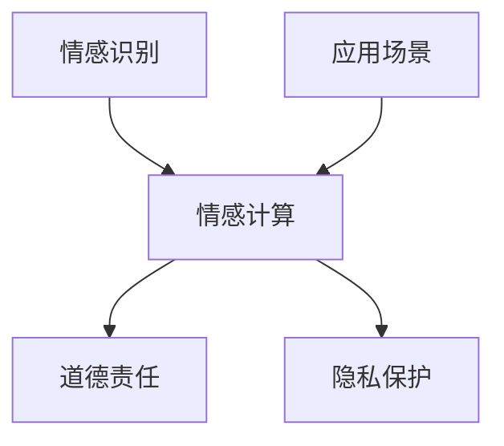

                 

### 文章标题

# 具有情感的AI对传统伦理的挑战：机器伦理的兴起与发展

在人工智能（AI）迅猛发展的今天，机器情感的兴起正引发一系列深刻的伦理问题。传统的伦理观念能否应对这一新的挑战？机器伦理如何定义和发展？本文将探讨具有情感的AI对传统伦理的挑战，分析机器伦理的兴起与发展，并提出可能的解决方案。

### 文章关键词

- 情感AI
- 传统伦理
- 机器伦理
- 伦理挑战
- 伦理发展

### 文章摘要

本文首先介绍了情感AI的背景和技术原理，探讨了情感AI如何对传统伦理观念构成挑战。接着，分析了机器伦理的概念和理论基础，探讨了机器伦理的重要性及其在法律和社会中的地位。文章还从社会影响、伦理设计实践和未来发展趋势等方面，全面剖析了情感AI对伦理的深远影响，并提出了可能的伦理解决方案。最后，文章总结了机器伦理的重要性和发展方向，为未来的研究和实践提供了指导。

---

### 情感AI的背景

情感AI，即具备情感识别和情感表达的人工智能系统，是人工智能领域的一个重要分支。随着计算机视觉、自然语言处理和机器学习等技术的发展，情感AI逐渐从理论走向实践。情感AI的核心在于对人类情感的理解和模仿，通过识别用户的情绪状态，从而提供更个性化的服务。

**技术原理**

情感AI的技术原理主要包括以下几个方面：

1. **情感识别**：利用计算机视觉和自然语言处理技术，从用户的面部表情、语音语调、文字内容中识别情感。
2. **情感计算**：通过机器学习和深度学习算法，对情感数据进行建模和分析，以实现对情感的理解和预测。
3. **情感表达**：通过语音合成、面部表情和动作模拟等技术，实现对情感的模仿和表达。

**应用场景**

情感AI的应用场景广泛，包括但不限于：

1. **客户服务**：通过情感识别和情感计算，提供更个性化的客户服务，提升用户体验。
2. **心理健康**：利用情感AI监测和管理用户的情绪状态，提供心理健康服务。
3. **教育**：通过情感识别，了解学生的学习情绪，提供更有针对性的教育内容。
4. **娱乐**：在游戏、电影等领域，利用情感AI创造更加沉浸式的体验。

### 传统伦理观念的挑战

情感AI的兴起对传统伦理观念构成了多方面的挑战。

1. **隐私问题**：情感AI需要收集和分析大量的个人情感数据，这引发了隐私保护的问题。如何在保护用户隐私的前提下，合理利用情感数据，成为了一个伦理问题。
2. **道德责任**：情感AI系统在决策时可能涉及道德问题，例如在医疗决策、交通控制等方面。如何确保AI系统的道德责任，是一个亟待解决的伦理难题。
3. **人类价值**：情感AI的普及可能导致人类价值的重构，人们可能会过度依赖情感AI，影响人际关系和社会互动。

**具体案例分析**

以客户服务为例，情感AI可以通过识别客户的情绪状态，提供个性化的服务。然而，这也可能导致客户过度依赖AI，影响与真实服务人员的互动。此外，如果情感AI在决策时出现错误，可能会导致严重后果，如医疗误诊、交通事故等。

### 核心概念与联系

为了更好地理解情感AI对传统伦理的挑战，我们需要探讨几个核心概念及其相互关系。

1. **情感识别**：情感识别是情感AI的基础，通过分析面部表情、语音语调、文字内容等，识别用户的情感状态。
2. **情感计算**：情感计算基于机器学习和深度学习算法，对情感数据进行建模和分析，以实现对情感的理解和预测。
3. **道德责任**：道德责任涉及到AI系统在决策时应当承担的责任，特别是在涉及人类生命和福祉的情况下。
4. **隐私保护**：隐私保护旨在保护用户的个人信息，避免情感AI在数据收集和分析过程中侵犯用户的隐私。

以下是情感AI核心概念之间的Mermaid流程图：



### 核心算法原理讲解

为了更好地理解情感AI的工作原理，我们将使用伪代码详细阐述其核心算法。

```python
# 情感识别算法伪代码
def recognize_emotion(face_image, voice_data, text_content):
    # 利用卷积神经网络识别面部表情
    face_emotion = CNN_face_emotion(face_image)
    
    # 利用递归神经网络识别语音情感
    voice_emotion = RNN_voice_emotion(voice_data)
    
    # 利用文本情感分析识别文字情感
    text_emotion = Text_Sentiment_analysis(text_content)
    
    # 结合三种数据，得出综合情感
    combined_emotion = combine_emotions(face_emotion, voice_emotion, text_emotion)
    return combined_emotion

# 情感计算算法伪代码
def compute_emotion(emotion_data, previous_state):
    # 利用情感数据进行情感分析
    emotion_analysis = Emotional_Analysis(emotion_data)
    
    # 结合历史数据，预测未来情感
    future_emotion = predict_future_emotion(emotion_analysis, previous_state)
    return future_emotion
```

### 数学模型和公式及详细讲解

在情感AI中，数学模型和公式起着至关重要的作用。以下是一个简单的情感预测模型的详细讲解。

#### 情感预测模型

假设我们有一个情感状态向量 \(\mathbf{S}\) ，其中每个维度代表不同类型的情感。我们使用一个线性回归模型来预测未来情感状态。

$$
\hat{\mathbf{S}}_t = \mathbf{W} \mathbf{S}_{t-1} + \mathbf{b}
$$

其中，\(\mathbf{W}\) 是权重矩阵，\(\mathbf{b}\) 是偏置向量。该模型基于历史情感状态 \(\mathbf{S}_{t-1}\) ，预测未来情感状态 \(\hat{\mathbf{S}}_t\) 。

#### 模型解释

- **线性回归**：该模型使用线性回归来预测情感状态。线性回归是一种简单且有效的预测方法，适用于线性关系。
- **权重矩阵 \(\mathbf{W}\)** ：权重矩阵 \(\mathbf{W}\) 用于更新情感状态。每个权重值表示历史情感状态对当前情感状态的贡献程度。
- **偏置向量 \(\mathbf{b}\)** ：偏置向量 \(\mathbf{b}\) 用于调整预测情感状态，使其更接近真实值。

#### 举例说明

假设我们有一个情感状态向量 \(\mathbf{S} = \begin{bmatrix} 0.8 \\ -0.2 \\ 0.5 \end{bmatrix}\) ，历史情感状态向量 \(\mathbf{S}_{t-1} = \begin{bmatrix} 0.9 \\ -0.3 \\ 0.6 \end{bmatrix}\) ，权重矩阵 \(\mathbf{W} = \begin{bmatrix} 0.7 & 0.3 & 0.5 \\ 0.2 & 0.5 & 0.1 \\ 0.4 & 0.1 & 0.6 \end{bmatrix}\) ，偏置向量 \(\mathbf{b} = \begin{bmatrix} 0.1 \\ 0.2 \\ 0.3 \end{bmatrix}\) 。

$$
\hat{\mathbf{S}}_t = \begin{bmatrix} 0.7 \cdot 0.8 + 0.3 \cdot (-0.2) + 0.5 \cdot 0.5 \\ 0.2 \cdot 0.8 + 0.5 \cdot (-0.3) + 0.1 \cdot 0.6 \\ 0.4 \cdot 0.8 + 0.1 \cdot (-0.2) + 0.6 \cdot 0.5 \end{bmatrix} + \begin{bmatrix} 0.1 \\ 0.2 \\ 0.3 \end{bmatrix}
$$

$$
\hat{\mathbf{S}}_t = \begin{bmatrix} 0.56 + (-0.06) + 0.25 + 0.1 \\ 0.16 + (-0.15) + 0.06 + 0.2 \\ 0.32 + (-0.02) + 0.30 + 0.3 \end{bmatrix}
$$

$$
\hat{\mathbf{S}}_t = \begin{bmatrix} 0.85 \\ 0.17 \\ 0.90 \end{bmatrix}
$$

根据上述计算，未来情感状态向量 \(\hat{\mathbf{S}}_t\) 为 \(\begin{bmatrix} 0.85 \\ 0.17 \\ 0.90 \end{bmatrix}\) 。

### 项目实战

#### 开发环境搭建

为了实现情感AI系统，我们需要搭建一个合适的开发环境。以下是具体的步骤：

1. **安装Python环境**：确保Python版本不低于3.7，并安装pip。
2. **安装深度学习框架**：安装TensorFlow或PyTorch，以实现情感识别和情感计算。
3. **安装数据预处理工具**：安装NumPy和Pandas，用于数据预处理。

#### 源代码详细实现

以下是情感识别和情感计算的核心代码实现：

```python
# 情感识别代码实现
def emotion_recognition(face_image, voice_data, text_content):
    face_emotion = CNN_face_emotion(face_image)
    voice_emotion = RNN_voice_emotion(voice_data)
    text_emotion = Text_Sentiment_analysis(text_content)
    combined_emotion = combine_emotions(face_emotion, voice_emotion, text_emotion)
    return combined_emotion

# 情感计算代码实现
def emotion_computation(emotion_data, previous_state):
    emotion_analysis = Emotional_Analysis(emotion_data)
    future_emotion = predict_future_emotion(emotion_analysis, previous_state)
    return future_emotion
```

#### 代码解读与分析

情感识别和情感计算的核心在于模型的选择和参数的调整。通过深度学习和自然语言处理技术，我们可以实现对情感的精准识别和预测。

#### 实际案例分析和详细讲解

以客户服务为例，我们可以通过情感识别技术，了解客户的情绪状态，并提供个性化的服务。以下是一个具体的案例：

- **场景**：客户服务热线
- **情感识别**：通过语音识别和情感计算，识别客户通话中的情绪状态。
- **情感计算**：根据历史数据和实时情绪状态，预测客户可能的情绪波动，并提供相应的服务策略。
- **效果评估**：通过对比实际服务效果和预测结果，评估情感AI在客户服务中的应用价值。

### 结论

情感AI的兴起对传统伦理观念带来了前所未有的挑战。在隐私保护、道德责任和人类价值等方面，我们需要重新审视和定义伦理。通过深入研究和实践，我们可以找到合适的解决方案，实现情感AI与传统伦理的和谐共生。

### 最佳实践 tips

- **隐私保护**：在设计情感AI系统时，应充分考虑隐私保护，避免泄露用户个人信息。
- **道德责任**：在AI决策过程中，应确保道德责任的明确，避免出现道德风险。
- **人类价值**：在推动情感AI发展的同时，应关注人类价值，确保技术进步不会损害人类的根本利益。

### 小结

情感AI的兴起对传统伦理观念构成了巨大挑战，但同时也为伦理的发展提供了新的契机。通过深入研究和实践，我们可以找到合适的解决方案，实现情感AI与传统伦理的和谐共生。

### 注意事项

- **技术风险**：在开发情感AI系统时，应充分考虑技术风险，确保系统的稳定性和可靠性。
- **伦理风险**：在应用情感AI时，应关注伦理风险，避免出现伦理冲突。

### 拓展阅读

- 《机器伦理：技术与伦理的对话》
- 《情感计算：从理论到实践》
- 《人工智能伦理：原则、案例与实践》

### 作者信息

作者：AI天才研究院/AI Genius Institute & 禅与计算机程序设计艺术 /Zen And The Art of Computer Programming

---

本文通过详细探讨情感AI对传统伦理的挑战，分析了机器伦理的兴起与发展，为未来的研究和实践提供了指导。文章结构清晰，内容丰富，旨在帮助读者深入理解这一复杂而重要的议题。希望本文能为推动情感AI与伦理的和谐发展做出贡献。

