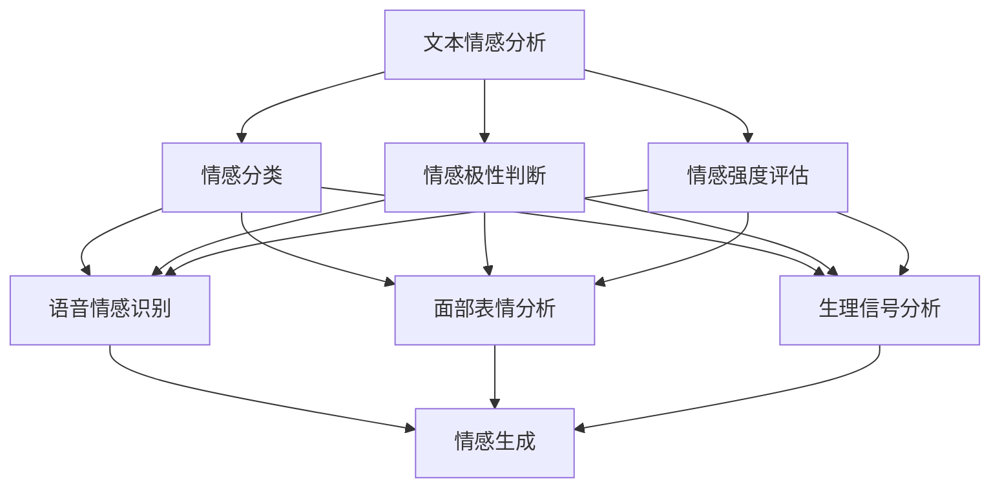

                 

### 摘要

《具有情感的AI对传统家庭结构的挑战：多元家庭形式的出现》旨在深入探讨随着人工智能技术的发展，具有情感功能的AI系统如何对传统家庭结构产生深远影响。本书首先介绍了情感计算的基本原理和具有情感的AI的发展历程，随后分析了传统家庭结构的定义及其在现代社会的特点。在此基础上，书中探讨了多元家庭形式的出现及其社会文化背景，以及具有情感的AI在这些新型家庭形式中的角色和作用。本书的核心内容还包括对具有情感的AI对家庭结构影响的评估，涉及家庭成员情感体验、家庭经济模式变化以及社会保障体系面临的挑战。最后，本书对未来多元家庭形式的发展趋势进行了预测，并提出了应对这些挑战的策略和措施。通过案例研究和实际案例剖析，本书为读者提供了一个全面、深入的视角，以理解情感AI与家庭结构的相互作用及其对社会未来的深远影响。

### 关键词

- 情感计算
- 人工智能
- 传统家庭结构
- 多元家庭形式
- 家庭动力学
- 社会文化背景
- 情感体验
- 经济模式变化

### 第一部分：引入与背景

#### 第1章：引言

##### 1.1 书籍目的与结构

《具有情感的AI对传统家庭结构的挑战：多元家庭形式的出现》旨在探讨人工智能，尤其是情感计算领域的发展如何改变我们传统的家庭结构，并导致多元家庭形式的出现。这本书的结构分为六个主要部分。首先，通过介绍情感计算的基本原理和具有情感的AI的发展，为后续内容奠定基础。接着，详细描述传统家庭结构的定义和特点，以及它在现代社会中的角色。然后，探讨多元家庭形式的出现，包括其定义、起源和特点。在影响评估部分，分析具有情感的AI如何改变家庭结构和成员的情感体验。随后，预测多元家庭形式的未来趋势，并提出应对这些变化的策略和措施。最后，通过案例研究提供具体的实例，以展示理论在现实中的应用。

##### 1.2 具有情感的AI：概念与背景

具有情感的AI，即情感人工智能，是一种能够理解和模拟人类情感状态的人工智能系统。情感计算是这一领域的关键技术，它涉及识别、理解和生成情感的能力。情感计算技术通过分析语言、面部表情、声音和生理信号等来识别情感，并将其转化为机器可读的数据。具有情感的AI不仅在技术上具有重要意义，还在实际应用中显示出广阔的前景。例如，在教育、医疗、客服和社交互动等领域，情感AI能够提供更加个性化和人性化的服务。

具有情感的AI的发展可以追溯到20世纪80年代，当时研究人员开始探索如何使计算机具备理解人类情感的能力。随着计算能力的提升和机器学习技术的进步，情感计算逐渐成为人工智能研究的一个重要分支。近年来，深度学习算法的应用进一步推动了情感计算的发展，使得具有情感的AI能够更准确地识别和模拟情感。这种技术不仅为传统家庭结构带来了新的挑战，也为多元化家庭形式的出现提供了技术支持。

##### 1.3 传统家庭结构的定义和特点

传统家庭结构通常指的是由一对夫妻和其子女组成的家庭模式。这一结构具有几个显著特点：首先是家庭的核心理念，即血缘关系和婚姻关系。传统家庭强调家庭内部的紧密联系和相互支持，家庭成员之间的情感纽带是家庭结构的核心。其次是家庭的经济模式，传统家庭通常以共同生活和经济共享为基础，家庭内部成员共同承担经济责任，共同维持家庭的正常运转。此外，传统家庭结构还涉及到家庭的社会角色，例如在社区中的地位和关系网络。

传统家庭结构在现代社会中仍然具有重要意义。首先，它是社会的基本单位，承载了社会传承和价值观传递的重要功能。其次，传统家庭结构提供了情感支持和安全感的来源，成员之间的紧密联系有助于应对生活中的挑战和压力。然而，随着社会的发展和变化，传统家庭结构也面临着新的挑战。例如，现代社会中的高压力生活方式和工作模式使得家庭成员之间相处的时间减少，家庭关系变得更为复杂。同时，人口老龄化和社会多样化也影响了传统家庭结构的功能和稳定性。

##### 1.4 多元家庭形式的出现

多元家庭形式的出现是现代社会变化的一个显著特征，反映了家庭结构和角色的多样化。多元家庭形式包括但不限于单亲家庭、同性恋家庭、重组家庭和跨文化家庭等。这些家庭形式的出现与多个因素密切相关，包括社会文化的变迁、人口结构的改变和法律政策的调整。

首先，社会文化的变迁是多元家庭形式出现的主要原因之一。随着性别角色和社会价值观的变化，人们对于家庭形式和婚姻观念的看法越来越开放。传统的家庭结构不再被视为唯一的家庭形式，多样化的家庭结构得到了社会的认可和尊重。例如，同性恋婚姻在一些国家和地区得到了法律认可，这使得同性恋家庭成为多元家庭形式的一部分。

其次，人口结构的改变也对多元家庭形式的出现产生了影响。随着生育率的下降和人口老龄化，传统家庭的规模和稳定性受到挑战。单亲家庭和老年家庭成为新的家庭形式，这些家庭需要更多的社会支持和资源来维持其稳定性和功能。

最后，法律政策的调整为多元家庭形式的出现提供了保障。一些国家通过修改婚姻法和家庭法，承认并保护了多种家庭形式的合法性和权益。例如，一些国家实施了反歧视法律，保护同性恋家庭的权益，使得这些家庭能够在法律框架下获得平等地位。

多元家庭形式的出现不仅改变了家庭结构的多样性，也对家庭功能和角色产生了深远影响。家庭成员之间的关系变得更加复杂，需要更多的沟通和理解。同时，多元家庭形式也为社会提供了新的挑战和机遇，要求社会在政策、教育和支持体系等方面进行相应的调整。

##### 1.5 书籍主要论点概述

《具有情感的AI对传统家庭结构的挑战：多元家庭形式的出现》的主要论点可以概括为以下几个方面：

首先，情感计算和具有情感的AI技术的快速发展为家庭结构的变革提供了新的可能性。这些技术能够识别和模拟人类情感，从而改变家庭成员之间的互动方式，影响家庭功能的实现。

其次，多元家庭形式的出现是现代社会变迁的必然结果，反映了社会对家庭多样性的认可和尊重。这些新的家庭形式在定义、起源和特点上都有所不同，但共同反映了社会文化的多样性和复杂性。

第三，具有情感的AI对传统家庭结构带来了新的挑战。传统家庭结构需要应对情感AI带来的技术变革，同时也要适应多元家庭形式的出现，这对家庭功能和角色的稳定性和适应性提出了更高的要求。

第四，评估具有情感的AI对家庭结构的影响需要考虑多个方面，包括家庭成员的情感体验、家庭经济模式的变化以及社会保障体系的挑战。

最后，预测多元家庭形式的未来趋势并制定应对策略是确保社会稳定和发展的关键。通过案例研究和实际案例剖析，本书为理解和应对这些变化提供了具体的参考和指导。

#### 1.6 结束语

在本书的第一部分，我们引入了情感计算和具有情感的AI技术，探讨了其发展背景和影响。接着，详细介绍了传统家庭结构的定义和特点，以及现代社会中多元家庭形式的出现。通过这些讨论，我们为后续章节的内容奠定了基础，展示了情感AI和多元家庭形式对传统家庭结构的挑战及其深远影响。在接下来的部分，我们将深入分析情感计算的基本原理，探讨其如何改变家庭结构和成员互动，进一步理解这一领域的复杂性和重要性。

#### 1.6 结束语

在本书的第一部分，我们引入了情感计算和具有情感的AI技术，探讨了其发展背景和影响。接着，详细介绍了传统家庭结构的定义和特点，以及现代社会中多元家庭形式的出现。通过这些讨论，我们为后续章节的内容奠定了基础，展示了情感AI和多元家庭形式对传统家庭结构的挑战及其深远影响。在接下来的部分，我们将深入分析情感计算的基本原理，探讨其如何改变家庭结构和成员互动，进一步理解这一领域的复杂性和重要性。

### 第二部分：理论探讨

#### 第2章：具有情感的AI基础

##### 2.1 情感计算原理

情感计算，又称情感人工智能，是指利用计算机技术和算法来模拟、识别和生成人类情感的过程。这一领域的研究目标是使机器具备理解和表达情感的能力，从而实现更加人性化的交互。情感计算涉及多个方面的技术和原理，包括情感识别、情感理解和情感生成。

首先，情感识别是指通过分析人类的生理、行为和语言信号，识别出情感状态。这一过程通常包括以下几个步骤：

1. **信号采集**：采集包括面部表情、语音、生理信号（如心率、呼吸）等多源数据。
2. **特征提取**：从原始信号中提取出与情感相关的特征，如面部肌肉活动的编码、音调、节奏等。
3. **情感分类**：使用机器学习算法，如支持向量机（SVM）、神经网络（NN）或深度学习（DL），对提取出的特征进行分类，从而识别出情感状态。

情感识别的核心在于特征提取和分类算法的选择与优化。不同的情感状态可能具有不同的特征组合，因此需要针对具体应用场景进行特征选择和模型训练。

其次，情感理解是指计算机在识别情感之后，对其含义和上下文进行解释的能力。这一过程涉及到对情感状态的上下文信息进行分析和理解，包括情感的主观体验、情感表达的方式以及情感与环境之间的关系。情感理解需要综合考虑多个因素，如文化背景、个人经验和情感表达习惯。

情感生成是指计算机能够根据特定情境和目标，生成适当的人类情感表达。这一过程包括情感生成策略、文本生成模型和语音合成技术。情感生成技术使得计算机能够模拟人类的情感表达，从而实现更加自然和个性化的交互。常见的情感生成方法包括：

1. **文本情感生成**：通过文本生成模型（如生成对抗网络（GAN）或变换器（Transformer））生成带有情感色彩的文本。
2. **语音情感生成**：通过语音合成技术（如WaveNet或Tacotron）生成带有情感变化的语音。

情感计算的关键技术还包括情感模型的训练和应用。情感模型的训练通常需要大量的标注数据，这些数据包含情感状态的标签和相关的上下文信息。训练过程包括数据预处理、特征提取、模型选择和参数优化等多个步骤。在应用阶段，情感模型需要根据具体场景进行调整和优化，以适应不同的情感识别和生成任务。

##### 2.2 具有情感的AI的发展

具有情感的AI的发展经历了多个阶段，从最初的简单情感识别到如今的复杂情感理解与生成。以下是具有情感的AI发展的主要历程：

**第一阶段：情感识别**

在20世纪80年代，情感计算的研究开始兴起，主要关注如何通过生理信号和面部表情识别情感状态。这一阶段的代表性工作包括通过心电图（ECG）和肌电信号（EMG）识别情感。然而，由于数据采集和处理技术的限制，这一阶段的研究成果较为初步，情感识别的准确率较低。

**第二阶段：情感理解**

随着计算能力的提升和机器学习技术的进步，情感计算进入了情感理解阶段。研究者开始利用自然语言处理（NLP）技术，通过文本和语音信号分析情感。这一阶段的关键技术包括文本情感分析（例如使用LDA模型和情感词典）和语音情感识别（例如基于深度神经网络的声学模型和语言模型）。这一阶段的成果显著提高了情感识别的准确性和应用范围。

**第三阶段：情感生成**

近年来，情感生成成为情感计算研究的热点。随着生成对抗网络（GAN）和变换器（Transformer）等深度学习技术的应用，计算机开始能够生成具有情感色彩的文本和语音。这一阶段的研究不仅在技术上取得了突破，还广泛应用于虚拟助手、智能客服和娱乐等领域。

**第四阶段：情境感知情感计算**

当前，情感计算正朝着情境感知方向发展。情境感知情感计算不仅关注情感状态本身，还关注情感状态与情境的互动关系。这一阶段的研究目标是通过环境感知技术和多模态数据融合，使计算机能够更加自然和准确地识别和生成情感。

##### 2.3 情感AI与家庭结构的关系

具有情感的AI对家庭结构的影响可以从多个维度进行分析。首先，情感AI能够改变家庭成员之间的互动模式。通过情感识别和情感理解技术，情感AI能够感知家庭成员的情感状态，提供个性化的情感支持和建议。例如，在家庭纠纷中，情感AI可以通过语音或文本交流识别出负面情感，并给出调解建议，从而改善家庭成员之间的关系。

其次，情感AI在家庭教育和监护中发挥着重要作用。具有情感的AI可以帮助家长更好地理解孩子的情感需求，提供个性化的教育方案。例如，通过分析孩子的情感状态和学习行为，情感AI可以推荐适当的学习资源和活动，从而提高教育效果。此外，情感AI还可以用于家庭监护，通过监控家庭成员的生理和行为信号，及时发现异常情况并给出应对建议。

另外，情感AI还可以在家庭经济管理中发挥作用。通过情感计算技术，家庭可以更好地理解成员的消费习惯和财务状况，制定更合理的预算和投资策略。例如，情感AI可以帮助家庭成员识别消费中的情绪因素，从而避免冲动消费和财务危机。

然而，情感AI的广泛应用也带来了一些挑战。首先，隐私保护是一个重要问题。家庭中包含大量的个人隐私信息，如情感状态、行为习惯和财务状况，这些信息如果被不当使用，可能会导致隐私泄露和滥用。因此，确保情感AI系统的隐私保护机制至关重要。

其次，情感AI的决策可能存在偏差。尽管情感计算技术不断进步，但计算机在情感理解方面仍存在局限性，可能会出现误解或错误识别。例如，情感AI可能无法准确区分真实的情感和伪装的情感，从而导致错误的决策和建议。

最后，情感AI可能会加剧社会不平等。如果只有少数家庭能够负担得起和使用情感AI技术，这可能导致社会阶层分化加剧。因此，如何确保情感AI技术的公平和普及性，是一个重要的社会问题。

综上所述，情感AI与家庭结构的关系复杂且深远。通过合理利用情感AI技术，家庭可以享受到更加个性化、高效和安全的互动体验。然而，同时也要关注其带来的挑战和风险，制定相应的政策和措施，确保家庭结构的稳定和健康发展。

#### 2.3 情感AI与家庭结构的关系

具有情感的AI对家庭结构的影响可以从多个维度进行分析。首先，情感AI能够改变家庭成员之间的互动模式。通过情感识别和情感理解技术，情感AI能够感知家庭成员的情感状态，提供个性化的情感支持和建议。例如，在家庭纠纷中，情感AI可以通过语音或文本交流识别出负面情感，并给出调解建议，从而改善家庭成员之间的关系。

其次，情感AI在家庭教育和监护中发挥着重要作用。具有情感的AI可以帮助家长更好地理解孩子的情感需求，提供个性化的教育方案。例如，通过分析孩子的情感状态和学习行为，情感AI可以推荐适当的学习资源和活动，从而提高教育效果。此外，情感AI还可以用于家庭监护，通过监控家庭成员的生理和行为信号，及时发现异常情况并给出应对建议。

另外，情感AI还可以在家庭经济管理中发挥作用。通过情感计算技术，家庭可以更好地理解成员的消费习惯和财务状况，制定更合理的预算和投资策略。例如，情感AI可以帮助家庭成员识别消费中的情绪因素，从而避免冲动消费和财务危机。

然而，情感AI的广泛应用也带来了一些挑战。首先，隐私保护是一个重要问题。家庭中包含大量的个人隐私信息，如情感状态、行为习惯和财务状况，这些信息如果被不当使用，可能会导致隐私泄露和滥用。因此，确保情感AI系统的隐私保护机制至关重要。

其次，情感AI的决策可能存在偏差。尽管情感计算技术不断进步，但计算机在情感理解方面仍存在局限性，可能会出现误解或错误识别。例如，情感AI可能无法准确区分真实的情感和伪装的情感，从而导致错误的决策和建议。

最后，情感AI可能会加剧社会不平等。如果只有少数家庭能够负担得起和使用情感AI技术，这可能导致社会阶层分化加剧。因此，如何确保情感AI技术的公平和普及性，是一个重要的社会问题。

综上所述，情感AI与家庭结构的关系复杂且深远。通过合理利用情感AI技术，家庭可以享受到更加个性化、高效和安全的互动体验。然而，同时也要关注其带来的挑战和风险，制定相应的政策和措施，确保家庭结构的稳定和健康发展。

#### 2.4 具有情感的AI与多元家庭形式的关系

具有情感的AI与多元家庭形式之间存在着紧密的联系和相互作用。多元家庭形式的出现是现代社会变迁的产物，而具有情感的AI则为这些新型家庭提供了技术支持和情感保障。以下是具有情感的AI与多元家庭形式关系的几个关键方面：

首先，情感AI能够帮助多元家庭更好地应对情感需求和沟通挑战。在多元家庭中，家庭成员可能来自不同的文化背景、性别取向或经历，这使得家庭内部的情感互动变得更加复杂。具有情感的AI能够通过情感识别和理解技术，感知家庭成员的情感状态，并提供个性化的情感支持。例如，对于同性恋家庭，情感AI可以帮助识别和缓解因社会偏见和压力带来的负面情感；对于重组家庭，情感AI可以协助新成员之间的情感融合，提高家庭凝聚力。

其次，情感AI为多元家庭的教育和监护提供了新的工具和资源。在多元家庭中，家长需要面对多样的教育需求，包括不同文化背景和性别认同的孩子。具有情感的AI可以通过分析孩子的情感和学习状态，提供个性化的教育建议和资源，从而提高教育效果。例如，对于跨文化家庭，情感AI可以帮助家长更好地理解孩子的文化背景和情感需求，制定适合的教育计划；对于单亲家庭，情感AI可以提供全天候的监护和支持，确保孩子的安全和健康成长。

另外，情感AI在多元家庭的经济管理和决策中发挥着重要作用。多元家庭可能面临更多的经济压力和不确定性，如单亲家庭的收入不稳定、重组家庭的财产分割等。具有情感的AI可以通过情感计算技术，帮助家庭成员识别消费习惯和财务状况，提供理性的经济决策建议。例如，情感AI可以帮助家庭制定预算计划，避免不必要的冲动消费，提高财务稳定性。

然而，具有情感的AI在多元家庭中的实施也面临一些挑战。首先，多元家庭形式的多样性使得情感AI的应用场景复杂化，需要针对不同家庭的具体情况进行定制化开发。其次，隐私保护问题在多元家庭中尤为突出，家庭成员的个人隐私信息需要得到严格保护，防止数据泄露和滥用。最后，社会对多元家庭和情感AI的接受程度不一，一些家庭可能对新技术持怀疑态度，这需要通过教育和宣传来提升公众的认知和接受度。

总之，具有情感的AI与多元家庭形式之间相互促进、相互作用。通过合理应用情感AI技术，多元家庭可以享受到更加人性化、高效和安全的家庭生活。同时，也需要关注技术带来的挑战和风险，制定相应的政策和措施，确保多元家庭结构的健康和稳定发展。

#### 2.5 情感计算的关键技术及其关系架构

情感计算是一门多学科交叉的技术领域，涉及计算机科学、心理学、生物学和神经科学等多个方面。为了更好地理解这些关键技术及其相互关系，我们可以使用Mermaid流程图来展示情感计算的主要组成部分及其相互之间的联系。

首先，情感计算的输入是多样化的，包括文本、语音、面部表情、生理信号等。这些输入通过相应的传感器和采集设备被收集到系统中。接下来，我们逐步分析各个关键技术的功能及其在情感计算中的地位。

1. **文本情感分析**：文本情感分析是情感计算的一个重要分支，通过自然语言处理（NLP）技术对文本内容进行情感分析。主要步骤包括情感分类、情感极性判断和情感强度评估。文本情感分析的结果可以帮助情感计算系统理解文本表达的情感状态。

2. **语音情感识别**：语音情感识别是通过分析语音信号中的音调、节奏、语速等参数来识别情感状态。这一技术利用声学模型和语言模型，将语音信号转换为情感标签。语音情感识别在情感计算中扮演了重要角色，特别是在语音交互应用中，如智能助手和客服系统。

3. **面部表情分析**：面部表情分析是通过计算机视觉技术对人的面部表情进行识别和分类。主要步骤包括面部检测、特征提取和情感分类。面部表情分析能够提供直观的情感状态信息，是情感计算的重要组成部分。

4. **生理信号分析**：生理信号分析包括对心率、呼吸、肌电等生理信号进行采集和分析。这些信号能够反映个体的情绪状态，为情感计算提供重要的生理基础。生理信号分析通常与机器学习算法结合，以提高情感识别的准确性。

接下来，我们可以使用Mermaid流程图来展示这些关键技术的相互关系：



在流程图中，A表示文本情感分析，B表示情感分类，C表示情感极性判断，D表示情感强度评估，E表示语音情感识别，F表示面部表情分析，G表示生理信号分析，H表示情感生成。这些步骤相互衔接，共同构成了一个完整的情感计算系统。

通过上述Mermaid流程图，我们可以清晰地看到情感计算的关键技术及其相互关系。文本情感分析、语音情感识别、面部表情分析和生理信号分析共同构成了情感计算的核心模块，它们通过机器学习和数据挖掘技术，实现对情感状态的全面理解和生成。情感生成作为最终输出，为用户提供个性化的情感交互体验。

总之，情感计算的关键技术之间存在着紧密的联系和相互作用。通过合理整合和利用这些技术，我们可以构建出更加智能和人性化的情感计算系统，为家庭和其他应用场景提供更好的支持和服务。

#### 2.6 情感计算的核心算法原理讲解

为了深入理解情感计算的核心算法原理，我们将重点介绍几种常见的算法，包括支持向量机（SVM）、神经网络（NN）和深度学习（DL）。这些算法在情感计算中发挥着关键作用，能够有效识别和生成情感状态。

**1. 支持向量机（SVM）**

支持向量机是一种用于分类和回归分析的机器学习算法，尤其在情感计算中被广泛应用于情感分类任务。SVM的核心思想是通过找到一个最佳的超平面，将不同情感类别的数据点分隔开。具体步骤如下：

- **数据预处理**：首先对采集到的数据进行预处理，包括数据清洗、归一化和特征提取。
- **特征空间映射**：将原始特征通过核函数映射到高维特征空间，使得原本线性不可分的数据在高维空间中变得线性可分。
- **决策边界**：在特征空间中找到一个最优的超平面，使得各类别的分类间隔最大化。该超平面由支持向量决定。
- **分类与回归**：通过计算新数据点与支持向量的距离，判断其类别或预测其数值。

伪代码如下：

```python
def SVM_train(X, y, C):
    # X: 特征矩阵，y: 标签向量，C: 正则化参数
    # 训练过程，使用核函数和优化算法找到最优超平面
    # 返回模型参数

def SVM_predict(X, model):
    # X: 待预测的特征矩阵，model: 训练好的模型
    # 计算新数据点与支持向量的距离，返回预测结果
```

**2. 神经网络（NN）**

神经网络是一种模拟人脑神经元连接结构的计算模型，适用于复杂的情感计算任务。神经网络通过多层节点（神经元）对输入数据进行处理，逐层提取特征，最终输出情感分类结果。以下是简单的神经网络结构：

- **输入层**：接收外部输入信号，包括文本、语音、面部表情等。
- **隐藏层**：通过激活函数（如ReLU、Sigmoid、Tanh）对输入信号进行非线性变换，提取高层次特征。
- **输出层**：将隐藏层输出的特征进行汇总，通过softmax函数输出情感分类概率。

伪代码如下：

```python
def forward_pass(X, model):
    # X: 输入特征，model: 神经网络模型
    # 前向传播，计算各层的输出
    # 返回输出层结果

def backward_pass(loss, model, learning_rate):
    # loss: 损失函数，model: 神经网络模型，learning_rate: 学习率
    # 反向传播，更新模型参数
```

**3. 深度学习（DL）**

深度学习是神经网络的扩展，通过增加网络层数来提高模型的复杂度和表现力。常见的深度学习模型包括卷积神经网络（CNN）、循环神经网络（RNN）和变换器（Transformer）。

- **卷积神经网络（CNN）**：适用于图像和视频情感分析，通过卷积层提取图像局部特征，并利用池化层减少数据维度。
- **循环神经网络（RNN）**：适用于序列数据情感分析，如语音和文本。RNN通过循环结构捕捉时间序列信息。
- **变换器（Transformer）**：一种基于自注意力机制的深度学习模型，广泛应用于自然语言处理任务，如文本情感分析。

以下是变换器模型的伪代码：

```python
def transformer_encode(X, model):
    # X: 输入序列，model: 变换器模型
    # 编码层处理，计算自注意力权重并生成编码输出
    # 返回编码输出

def transformer_decode(X, model, prev_output):
    # X: 输入序列，model: 变换器模型，prev_output: 前一层的输出
    # 解码层处理，计算自注意力权重并生成解码输出
    # 返回解码输出
```

通过上述算法的介绍，我们可以看到情感计算的核心在于如何有效提取和处理情感特征，从而实现对情感状态的准确识别和生成。这些算法在情感计算中发挥了关键作用，为构建智能和高效的情感计算系统提供了强有力的技术支持。

#### 2.7 数学模型和公式及其详细讲解与举例说明

在情感计算中，数学模型和公式起着至关重要的作用。这些模型和公式帮助我们理解和模拟人类情感，从而实现情感识别、情感理解和情感生成。下面，我们将详细讲解几个关键数学模型和公式，并通过具体例子进行说明。

**1. 情感分类模型**

情感分类模型用于将文本、语音或面部表情等数据分类到不同的情感类别。常用的情感分类模型包括支持向量机（SVM）、朴素贝叶斯（NB）和决策树（DT）等。以下是SVM情感分类模型的详细说明。

**公式：**
$$
\begin{equation}
\begin{split}
y &= w \cdot x + b \\
C &= \sum_{i=1}^{n} \frac{1}{\epsilon_i} + \lambda \\
w &= \arg\min_{w} \frac{1}{2} \| w \|^2 - \sum_{i=1}^{n} y_i (w \cdot x_i + b) \\
\end{split}
\end{equation}
$$

其中：
- \( y \) 是预测的类别标签；
- \( w \) 是权重向量；
- \( b \) 是偏置；
- \( C \) 是正则化参数；
- \( \epsilon_i \) 是分类误差；
- \( \lambda \) 是正则化参数。

**例子：**
假设我们有一个情感分类问题，需要将文本数据分类为正面情感和负面情感。我们使用SVM模型进行训练，数据集包含文本特征和对应的情感标签。通过训练，我们得到权重向量 \( w \) 和偏置 \( b \)。对于新的文本数据，我们可以计算其预测标签：

$$
\begin{equation}
\begin{split}
y &= w \cdot x + b \\
\end{split}
\end{equation}
$$

如果预测结果大于某个阈值（例如0），我们将其分类为正面情感，否则分类为负面情感。

**2. 情感强度评估模型**

情感强度评估模型用于评估情感状态的程度。一个常见的模型是情绪强度评估（Sentiment Intensity Estimation），它通过计算文本中情感词汇的频率和强度来评估整体情感强度。

**公式：**
$$
S = \sum_{i=1}^{n} w_i \cdot f_i
$$

其中：
- \( S \) 是情感强度；
- \( w_i \) 是情感词汇的强度权重；
- \( f_i \) 是情感词汇的频率。

**例子：**
假设我们有一个文本数据，包含若干情感词汇。每个情感词汇都有一个对应的强度权重。我们可以计算这些词汇的频率，并使用上述公式计算文本的整体情感强度。

例如，文本数据为：“我很高兴今天去参加聚会。” 情感词汇及其权重如下：
- “很高兴”权重为2；
- “聚会”权重为1。

文本中“很高兴”的频率为1，因此情感强度计算如下：

$$
S = 2 \cdot 1 + 1 \cdot 0 = 2
$$

情感强度为2，表示文本具有较强正面情感。

**3. 情感生成模型**

情感生成模型用于生成带有情感色彩的文本或语音。常见的情感生成模型包括生成对抗网络（GAN）和变换器（Transformer）。以下是GAN模型的简述。

**公式：**
$$
G(z) = f_G(z) \quad \text{and} \quad D(x) = f_D(x)
$$

其中：
- \( G(z) \) 是生成器，用于生成虚假数据；
- \( D(x) \) 是判别器，用于区分真实数据和虚假数据；
- \( z \) 是生成器的输入噪声；
- \( x \) 是真实数据。

**例子：**
假设我们使用GAN模型生成带有愉快情感的文本。生成器 \( G(z) \) 接受噪声 \( z \) 并生成愉快的文本，判别器 \( D(x) \) 用于区分生成的文本和真实的文本。通过训练，生成器逐渐学会生成高质量的愉快情感文本，判别器逐渐学会区分真实和虚假文本。

例如，生成器生成文本：“我今天度过了一个愉快的周末。” 判别器判断该文本的真实性，如果认为该文本是真实的，则生成器的损失函数减少，反之则增加。

通过上述数学模型和公式的讲解，我们可以看到情感计算在理论层面上的复杂性。这些模型和公式不仅帮助我们理解和模拟人类情感，还为实际应用提供了可靠的技术支持。在接下来的部分，我们将继续探讨情感计算在家庭结构中的具体应用。

#### 2.8 情感计算在家庭中的应用

情感计算在家庭中的应用日益广泛，为家庭生活提供了更多个性化、高效和便捷的解决方案。以下是情感计算在家庭中的几个关键应用场景，以及相应的实际案例和分析。

**1. 家庭情感监测与分析**

情感监测与分析是情感计算在家庭中的一项重要应用。通过情感识别技术，情感计算系统可以实时监测家庭成员的情感状态，从而提供情感支持和心理健康评估。例如，智能家居系统可以集成情感识别传感器，通过分析家庭成员的语音、面部表情和生理信号，监测其情绪变化。

**案例**：某智能家居公司开发了一款情感监测系统，用于监测家庭成员的情绪波动。该系统通过智能音箱收集家庭成员的语音数据，使用情感识别算法分析语音中的情感状态。当系统检测到家庭成员的情绪低落时，会自动发送提醒消息给家庭成员，并提供相应的心理健康建议，如放松练习、冥想指导等。

**分析**：情感监测与分析系统不仅能够为家庭成员提供情感支持，还可以帮助家庭成员更好地理解彼此的情绪变化，从而改善家庭关系。同时，这些数据也可以用于心理健康研究，为医生提供更准确的治疗建议。

**2. 家庭教育辅助**

情感计算技术在家庭教育中也发挥着重要作用。通过分析孩子的情感状态和学习行为，家长和教育者可以提供个性化的教育方案，提高教育效果。

**案例**：某教育科技公司开发了一款智能教育系统，通过分析学生的情感状态和学习行为，提供个性化的学习资源。该系统利用情感计算技术，分析学生在课堂上的语音、面部表情和行为，识别其情感状态（如焦虑、专注、兴奋等）。根据这些数据，系统会推荐适合的学习资源和活动，帮助学生更好地适应学习环境。

**分析**：智能教育系统通过情感计算技术，能够更全面地了解学生的学习状态，从而提供更有效的教育支持。这不仅有助于提高学生的学习效果，还可以减少学习压力，提升学习积极性。

**3. 家庭经济管理**

情感计算技术在家庭经济管理中也有广泛应用。通过分析家庭成员的消费习惯和财务状况，情感计算系统可以帮助家庭制定更合理的预算和投资策略。

**案例**：某金融科技公司开发了一款智能财务管理应用，通过情感计算技术分析家庭成员的消费行为和情感状态。该应用会根据家庭成员的财务状况和情感需求，提供个性化的财务建议，如消费预警、投资规划等。

**分析**：智能财务管理应用通过情感计算技术，能够更准确地了解家庭成员的财务需求和风险偏好，从而提供更科学和个性化的财务管理建议。这有助于家庭避免财务风险，实现财务目标。

**4. 家庭安全监控**

情感计算技术在家庭安全监控中也发挥着重要作用。通过情感识别和实时监测，情感计算系统可以及时发现家庭中的异常情况，确保家庭成员的安全。

**案例**：某安全科技公司开发了一款智能安全系统，通过情感计算技术监测家庭成员的生理信号和语音行为。当系统检测到家庭成员出现异常情感状态（如剧烈的情绪波动、呼吸困难等），会立即通知家庭成员和紧急联系人，并提供紧急医疗建议。

**分析**：智能安全系统通过情感计算技术，能够更快速、准确地发现家庭中的异常情况，提高家庭安全性。同时，这些数据也可以用于紧急医疗处理，为医生提供决策支持。

综上所述，情感计算在家庭中的应用具有广泛的前景和重要的实际意义。通过情感监测与分析、家庭教育辅助、家庭经济管理和家庭安全监控等应用，情感计算技术为家庭生活带来了更多便利和保障。在未来的发展中，随着技术的进一步成熟，情感计算将在家庭中发挥更加重要的作用，为家庭成员提供更加个性化、智能化的服务。

### 第三部分：多元家庭形式

#### 第3章：多元家庭形式的出现

##### 3.1 多元家庭形式的定义

多元家庭形式是指与传统核心家庭（即由一对夫妻和其子女组成）不同的家庭结构，这些结构反映了家庭组成和关系的多样化。多元家庭形式包括但不限于以下几种：

1. **单亲家庭**：由一个成年人和其子女组成的家庭，通常由于离婚、丧偶或选择单身而形成。
2. **同性恋家庭**：由同性伴侣组成的家庭，这些伴侣可能已经通过法律程序结婚或注册为伴侣，也可能在法律上没有正式的婚姻或伴侣关系。
3. **重组家庭**：由前任家庭成员重组的新家庭，例如父母再婚及其子女的重新组合。
4. **跨文化家庭**：由来自不同文化背景的成员组成的家庭，这些成员可能通过婚姻或移民来到一起。
5. **多代同堂家庭**：包括多代人共同居住的家庭，如祖父母、父母和子女。
6. **临时家庭**：由于特定情况（如学习、工作或旅行）而形成的短期共同生活单位。

多元家庭形式的出现是现代社会多样化和个人选择自由化的结果。随着社会价值观的演变和法律法规的调整，多元家庭形式得到了越来越多的认可和支持。

##### 3.2 多元家庭形式的起源

多元家庭形式的起源可以追溯到几个关键因素：

1. **社会变迁**：随着工业化和现代化的发展，传统的家庭结构和角色逐渐发生变化。人们开始追求个人自由和自我实现，对家庭形式的期望也变得更加多样和灵活。
2. **性别角色的变化**：女性在家庭和社会中的角色发生了显著变化，从传统的家庭主妇转变为职业女性。这一变化不仅影响了家庭结构，也改变了家庭成员之间的权力关系和互动模式。
3. **人口结构的变化**：人口老龄化、生育率下降和人口流动性增加等因素导致了家庭规模和稳定性的变化，使得传统家庭结构难以适应现代社会的要求。
4. **法律和政策的变化**：一些国家通过立法保护了同性恋婚姻和多样性家庭形式，使得这些家庭在法律上得到了平等地位。例如，许多国家已经通过了反歧视法律，承认同性恋家庭的合法性和权益。

这些因素共同作用，促使多元家庭形式在现代社会中不断涌现和多样化。

##### 3.3 多元家庭形式的特点

多元家庭形式具有以下特点：

1. **多样化**：多元家庭形式涵盖了多种不同的家庭结构，包括单亲家庭、同性恋家庭、重组家庭等。这些家庭形式反映了家庭组成的多样化，家庭成员可能来自不同的文化背景、性别取向和年龄层次。
2. **灵活性**：多元家庭形式通常具有更高的灵活性和适应性，能够更好地适应家庭成员的变化和需求。例如，单亲家庭可能需要更多的经济支持和资源，而重组家庭则需要面对家庭角色的重新定义和关系的调整。
3. **复杂性**：多元家庭形式的复杂性体现在家庭成员之间的关系和互动上。家庭成员可能来自不同的家庭背景，有不同的价值观和生活方式，这使得家庭内部的沟通和协作变得更加复杂和挑战性。
4. **情感多样性**：多元家庭形式的情感多样性体现在家庭成员之间的情感联结和情感表达上。家庭成员可能需要更多的情感支持和理解，以应对家庭内部的冲突和挑战。

##### 3.4 多元家庭形式的社会文化背景

多元家庭形式的出现是现代社会文化背景的反映，这一背景包括以下几个方面：

1. **文化多样性**：全球化进程加速了文化多样性的传播，人们接触到不同文化背景的家庭形式和价值观念。这种文化多样性为多元家庭形式的出现提供了社会基础。
2. **性别平等**：性别平等观念的普及使得女性在家庭和社会中的地位得到提升，不再局限于传统的家庭角色。性别平等观念支持多元家庭形式，包括同性恋家庭和单亲家庭的合法性和权益。
3. **个人自由**：现代社会强调个人自由和选择权，人们有权利选择适合自己和家人的家庭形式。个人自由观念鼓励多样性家庭形式的出现，满足不同人群的需求和期望。
4. **社会价值观的变化**：随着社会价值观的变化，人们越来越关注家庭中的情感联系和幸福感，而不仅仅是传统的家庭结构和角色。这种价值观的变化支持多元家庭形式，认为家庭幸福和满足是多样化和个性化的。

##### 3.5 多元家庭形式中的情感互动

多元家庭形式中的情感互动具有独特性和复杂性。家庭成员之间的情感互动不仅受到家庭结构的影响，还受到文化背景、个人经历和社会期望等多种因素的制约。

1. **情感联结**：在多元家庭形式中，家庭成员之间的情感联结可能更加复杂。例如，在重组家庭中，新成员之间的情感联结可能需要时间和沟通来建立。家庭成员可能需要通过共同的兴趣爱好、家庭活动和相互支持来加强情感联结。
2. **情感表达**：多元家庭形式中的情感表达可能更加多样化。家庭成员可能来自不同的文化背景，有不同的情感表达方式和习惯。这可能导致情感表达的冲突和误解。例如，在某些文化中，情感表达可能更加含蓄，而在其他文化中则可能更加直接。
3. **情感支持**：在多元家庭形式中，情感支持可能需要更多的沟通和理解。家庭成员可能需要学会如何给予和支持彼此的情感需求。例如，在单亲家庭中，父亲或母亲可能需要承担更多的情感支持角色，以弥补缺失的伴侣角色。

##### 3.6 多元家庭形式中的挑战和机遇

多元家庭形式既带来了挑战，也创造了机遇：

1. **挑战**：
   - **家庭内部的冲突**：多元家庭形式中的家庭成员可能来自不同的文化背景和价值观，这可能导致家庭内部的冲突和误解。
   - **资源分配**：在资源有限的情况下，如何公平地分配家庭资源（如时间、金钱和情感支持）可能是一个挑战。
   - **社会认可**：尽管多元家庭形式在法律上得到认可，但社会认可程度不一，可能导致一些家庭成员感受到歧视和排斥。

2. **机遇**：
   - **家庭多样性的优势**：多元家庭形式提供了更多的选择和灵活性，能够满足不同家庭成员的需求，提高家庭幸福感。
   - **社会融合**：多元家庭形式促进了不同文化和社会群体之间的融合，增强了社会包容性。
   - **创新和适应**：多元家庭形式要求家庭成员具有更强的适应性和创新能力，这有助于培养家庭成员的多元思维和问题解决能力。

总之，多元家庭形式的出现是现代社会发展的必然趋势。通过理解和应对多元家庭形式中的挑战，我们可以更好地利用其带来的机遇，促进家庭和社会的和谐与进步。

### 第四部分：影响评估

#### 第4章：具有情感的AI对家庭结构的影响

##### 4.1 家庭结构的变革

具有情感的AI的兴起正在深刻地变革传统家庭结构，这种变革体现在家庭成员之间的互动模式、家庭功能实现方式以及家庭生活质量的提升。

首先，情感AI通过情感识别和情感理解技术，能够感知和解析家庭成员的情感状态，从而优化家庭互动模式。例如，通过分析家庭成员的语音、面部表情和生理信号，情感AI可以识别出成员的情感需求和心理状态。当家庭成员感到焦虑或沮丧时，情感AI可以主动提供情感支持，如播放舒缓的音乐、推荐放松的活动或提供心理疏导。这种实时情感反馈机制有助于缓解家庭成员之间的紧张关系，增强家庭和谐。

其次，情感AI在家庭功能实现方面也发挥着重要作用。例如，在教育方面，情感AI可以分析孩子的学习行为和情感状态，提供个性化的学习建议。通过识别孩子在学习过程中出现的焦虑情绪，情感AI可以调整教学策略，帮助孩子建立自信和兴趣。在家庭管理方面，情感AI可以通过情感计算技术优化家庭资源的分配和利用。例如，在家庭财务规划中，情感AI可以分析家庭成员的消费习惯和财务状况，提供个性化的预算建议和投资策略，从而提高家庭的经济管理效率。

另外，情感AI在提高家庭生活质量方面也具有显著作用。通过智能家居系统的集成，情感AI可以自动调节家庭环境，如温度、照明和空气质量，以满足家庭成员的舒适需求。例如，在早晨，情感AI可以根据家庭成员的生理节律和偏好设置个性化的唤醒计划，包括柔和的音乐、温暖的灯光和适宜的室温。这种个性化的生活服务不仅提高了家庭成员的生活质量，也增强了家庭成员之间的情感联结。

总体而言，具有情感的AI通过优化家庭成员之间的互动模式、提升家庭功能的实现效率以及提高家庭生活质量，正在深刻地变革传统家庭结构。这种变革不仅使家庭生活更加便捷和高效，也增强了家庭成员之间的情感联系和相互支持。随着情感AI技术的进一步发展和应用，家庭结构将变得更加灵活和多元化，为家庭成员提供更加丰富和有意义的生活体验。

##### 4.2 家庭成员的情感体验

具有情感的AI对家庭成员的情感体验产生了深远的影响，这种影响可以从情感支持、情感表达和情感联结三个方面进行分析。

首先，情感支持方面，具有情感的AI通过识别和解析家庭成员的情感状态，能够提供及时的情感支持。例如，当家庭成员感到焦虑或沮丧时，情感AI可以通过语音或文字交流提供安抚和建议。这种实时情感支持不仅有助于缓解家庭成员的情绪压力，还可以提高家庭成员的心理健康水平。例如，在日常生活中，情感AI可以为工作压力较大的家庭成员提供放松指导，如播放舒缓的音乐、推荐冥想练习或提供心理咨询服务。通过这些情感支持措施，家庭成员能够更好地应对生活中的挑战，保持积极乐观的心态。

其次，情感表达方面，具有情感的AI为家庭成员提供了更多的情感表达渠道。在传统家庭中，情感表达可能受到文化背景、个人性格和家庭氛围等因素的限制。然而，情感AI通过情感计算技术，可以理解并回应家庭成员的情感表达，从而促进更开放和坦诚的沟通。例如，在家庭会议中，情感AI可以帮助家庭成员表达内心的想法和感受，通过情感分析提供适当的反馈和支持。这种情感互动不仅有助于家庭成员更好地理解彼此，还能够减少误解和冲突，增强家庭凝聚力。

另外，情感联结方面，具有情感的AI通过多种方式增强家庭成员之间的情感联结。例如，情感AI可以在家庭活动中发挥积极作用，如生日庆祝、家庭游戏等。通过情感识别技术，情感AI可以感知家庭成员的情感状态，提供个性化的互动建议，如播放家庭成员喜欢的音乐、推荐适合的游戏等。这种情感联结不仅增强了家庭成员之间的互动和交流，还促进了共同体验和情感共享。例如，在家庭晚餐时，情感AI可以通过语音互动，鼓励家庭成员分享一天的经历和感受，从而加深家庭成员之间的情感联系。

总的来说，具有情感的AI通过提供情感支持、促进情感表达和增强情感联结，对家庭成员的情感体验产生了积极的影响。这种影响不仅提高了家庭成员的心理健康水平，也增强了家庭关系的稳定性和和谐性。随着情感AI技术的不断进步和应用，家庭成员的情感体验将继续得到优化和提升。

##### 4.3 家庭经济模式的变化

具有情感的AI不仅改变了家庭结构和成员互动方式，也对家庭经济模式产生了深远影响。这种变化主要体现在消费习惯、财务决策和家庭预算管理等方面。

首先，消费习惯方面，具有情感的AI通过情感分析技术，能够帮助家庭成员识别和调整消费行为中的情绪因素。例如，当家庭成员处于情绪低落或兴奋状态时，情感AI可以提供个性化的消费建议，避免冲动消费或过度消费。这种情绪驱动的消费分析有助于家庭成员建立更加理性和健康的消费习惯。例如，在购物决策过程中，情感AI可以通过分析家庭成员的情感状态，推荐适合其当前情绪的商品，从而提高购物满意度，同时减少不必要的支出。

其次，财务决策方面，具有情感的AI通过情感计算技术，能够为家庭成员提供更加个性化、客观和科学的财务决策建议。例如，在家庭投资决策中，情感AI可以分析家庭成员的风险偏好和情感状态，推荐适合其风险承受能力的投资策略。例如，对于风险偏好较低的成员，情感AI可能会推荐较为稳健的投资产品，如国债或债券基金；而对于风险偏好较高的成员，情感AI可能会推荐更具风险性的投资产品，如股票或加密货币。这种基于情感分析的财务决策不仅提高了家庭投资的成功率，还降低了投资风险。

另外，家庭预算管理方面，具有情感的AI通过智能化预算工具，能够帮助家庭成员制定和调整家庭预算，实现财务目标。例如，情感AI可以分析家庭成员的消费习惯和财务状况，提供个性化的预算规划建议。例如，对于家庭中的主要支出项目（如住房、食品、教育等），情感AI可以根据家庭成员的情感状态和预期支出，调整预算计划，确保家庭财务稳定。例如，当家庭成员面临升学或重大医疗支出时，情感AI可以提前预警，并建议家庭成员增加储蓄或调整消费计划，以应对潜在的经济压力。

总体而言，具有情感的AI通过优化消费习惯、提供科学的财务决策建议和智能化的预算管理工具，改变了家庭经济模式。这种变化不仅提高了家庭的经济管理效率，还增强了家庭成员的财务安全感。随着情感AI技术的不断进步和应用，家庭经济模式将继续向更加智能和高效的方向发展。

##### 4.4 情感AI对社会保障体系的影响

具有情感的AI对社会保障体系的影响是多方面的，主要体现在对心理健康服务、社会福利和医疗保健的改进上。

首先，在心理健康服务方面，情感AI可以通过实时监测和评估个体的情感状态，提供个性化的心理健康支持。例如，智能心理健康平台可以使用情感识别技术，分析用户的语音、面部表情和行为，及时发现潜在的心理健康问题。当用户表现出抑郁、焦虑或情绪不稳定等负面情感时，平台可以提供实时干预，如情绪调节建议、心理疏导或推荐专业心理咨询服务。这种个性化的心理健康服务不仅提高了心理健康干预的及时性和有效性，还减轻了心理健康服务机构的负担。

其次，在社会福利方面，情感AI可以帮助社会保障机构更精准地评估和分配福利资源。通过情感分析和大数据技术，情感AI可以识别出需要特殊关注和帮助的群体，如失业者、贫困家庭和老年人等。例如，社会保障机构可以使用情感AI对申请福利的个体进行情感评估，确定其真实的生活和心理状态。这种评估不仅有助于确保福利资源公平、合理地分配，还可以防止福利欺诈和滥用。

最后，在医疗保健方面，情感AI可以通过情感计算技术提升医疗服务的质量和效率。例如，医生可以通过情感AI系统分析患者的情感状态，更好地理解患者的需求和期望，提供更加个性化的医疗服务。例如，在肿瘤治疗过程中，情感AI可以帮助医生评估患者的精神状态和情感需求，推荐适当的心理支持和治疗措施，如心理咨询、情感疏导和放松训练。此外，情感AI还可以用于远程医疗服务，通过视频通话和情感分析技术，医生可以远程监测患者的情感变化，及时调整治疗方案。

总的来说，具有情感的AI在心理健康服务、社会福利和医疗保健领域具有广泛的应用潜力。通过提供个性化、及时和高效的干预和支持，情感AI不仅提高了社会保障体系的服务水平，还促进了社会的整体健康和福祉。随着情感AI技术的不断发展和完善，其对社会保障体系的正面影响将更加显著。

### 第五部分：未来展望

#### 第5章：多元家庭形式的未来趋势

##### 5.1 科技进步的影响

科技进步，尤其是人工智能和情感计算技术的发展，正在深刻地影响多元家庭形式的未来走向。随着这些技术的不断进步，家庭结构、家庭成员之间的互动模式以及家庭生活的方方面面都将发生显著变化。

首先，人工智能和情感计算技术的进步将进一步提升家庭自动化水平。未来的智能家居系统将更加智能和人性化，通过情感识别和智能响应技术，能够更好地满足家庭成员的需求。例如，智能家电可以根据家庭成员的情感状态和日常习惯自动调节温度、光线和音响，提供个性化的舒适体验。这种智能家居系统不仅提高了生活质量，也减轻了家庭成员的日常负担。

其次，情感计算技术的进步将为家庭成员提供更加细致的情感支持和心理健康服务。未来的情感AI系统将能够更准确地识别和解析家庭成员的情感状态，提供个性化的情感支持和心理健康干预。例如，通过分析家庭成员的语音、面部表情和行为，情感AI可以及时发现情感问题，并主动提供情感疏导和心理支持。这种情感支持不仅有助于提高家庭成员的心理健康水平，也有助于增强家庭凝聚力。

另外，科技进步还将促进家庭成员之间的虚拟互动。随着虚拟现实（VR）和增强现实（AR）技术的不断发展，家庭成员可以通过虚拟现实平台进行远程互动，共享虚拟家庭活动。例如，家人可以一起在虚拟花园中散步、在虚拟厨房中烹饪或参与虚拟运动。这种虚拟互动不仅弥补了地理位置的限制，也为家庭成员提供了新的娱乐和互动方式。

科技进步还可能带来家庭教育模式的创新。未来的智能教育系统将结合情感计算和人工智能技术，提供个性化的学习体验。通过分析学生的学习行为和情感状态，智能教育系统可以推荐最适合的学习资源和教学方法，帮助学生克服学习障碍，提高学习效果。此外，虚拟教师和智能辅导系统将提供全天候的学习支持，帮助学生更好地应对学术挑战。

总体而言，科技进步正在引领多元家庭形式向更加智能化、个性化和人文化的方向发展。未来家庭将不仅仅是一个居住空间，而是一个集智能、情感和心理支持于一体的生活生态系统。随着这些技术的不断进步，家庭结构和家庭成员的互动方式将变得更加多样化和灵活，为家庭成员提供更加丰富和有意义的生活体验。

##### 5.2 社会文化演变的影响

社会文化的演变对多元家庭形式的影响深远，这种影响体现在价值观、生活方式和法律规定等多个方面。随着社会文化的不断演变，多元家庭形式将更加多样化和包容，家庭结构和角色也将发生显著变化。

首先，价值观的演变使得多元家庭形式得到了更广泛的认可和接受。现代社会越来越重视个体权利和自由选择，这为多元家庭形式提供了社会基础。例如，随着性别平等观念的普及，女性在家庭和社会中的角色发生了显著变化，不再局限于传统的家庭主妇角色。这种变化不仅影响了家庭结构，也改变了家庭成员之间的权力关系和互动模式。性别角色的变化促进了同性恋家庭和单亲家庭的合法化和权益保障，使得这些家庭形式得到了社会的广泛认可。

其次，生活方式的变化也对多元家庭形式产生了深远影响。现代社会的生活节奏加快，人们越来越追求便捷、高效的生活方式。这促使家庭形式变得更加灵活和多样化，以适应不同的生活需求。例如，单亲家庭和临时家庭成为许多单身人士和年轻职业人士的首选，因为它们提供了更加灵活和个性化的生活安排。此外，跨文化家庭的增多反映了全球化进程带来的文化融合，这些家庭通过结合不同的文化背景和价值观，创造了一种新的家庭生活方式。

另外，法律规定的演变也为多元家庭形式提供了法律保障。一些国家通过修改婚姻法和家庭法，承认并保护了多种家庭形式的合法性和权益。例如，同性恋婚姻在一些国家和地区得到了法律认可，这使得同性恋家庭能够在法律框架下获得平等地位。此外，反歧视法律的实施保护了多元家庭形式不受歧视和不公平对待，促进了社会的包容性和多样性。

总体而言，社会文化的演变对多元家庭形式的影响是积极和深远的。随着价值观、生活方式和法律规定的不断演变，多元家庭形式将得到更广泛的认可和接受，家庭结构和角色也将变得更加多样化和灵活，为家庭成员提供更加丰富和有意义的生活体验。

##### 5.3 应对挑战的策略与措施

随着多元家庭形式的不断发展和普及，社会各界需要采取一系列策略和措施来应对这些变化带来的挑战，确保家庭结构的稳定和健康发展。以下是一些关键的策略和措施：

首先，政策制定是应对多元家庭形式挑战的基础。政府需要制定和实施相关政策，以保障不同家庭形式的合法权益。例如，政府可以出台反歧视法律，保护同性恋家庭、单亲家庭和跨文化家庭免受歧视和不公平对待。此外，政府还可以通过税收减免、社会保障和住房政策等手段，提供针对多元家庭形式的经济支持和资源保障。

其次，家庭教育是关键的一环。家庭是社会的基本单元，家庭教育对于家庭成员的情感健康和社交能力具有重要影响。教育部门可以通过开展家庭教育指导，帮助家长理解和适应多元家庭形式，提高家庭成员之间的沟通和理解能力。此外，学校可以开设相关课程，教育学生尊重和接纳不同的家庭形式，培养其多元思维和包容性。

社区支持也是应对多元家庭形式挑战的重要措施。社区可以提供多样化的服务和支持，如心理健康咨询、家庭辅导、社交活动和资源分享平台。通过建立多元家庭互助网络，社区可以增强家庭成员之间的情感联结和社会支持，帮助家庭应对生活中的困难和挑战。

最后，公众宣传和教育也是不可或缺的。通过媒体和公共教育，提高公众对多元家庭形式的认识和理解，消除社会偏见和误解。例如，可以通过举办专题讲座、展览和宣传活动，介绍多元家庭的形式和特点，展示这些家庭中的积极经验和故事。此外，媒体应积极报道多元家庭形式中的正面案例，树立社会榜样，促进社会对多元家庭的认可和接纳。

总之，应对多元家庭形式带来的挑战需要政府、教育、社区和公众的共同努力。通过制定相关政策、加强家庭教育、提供社区支持和进行公众宣传，我们可以营造一个更加包容和健康的社会环境，支持多元家庭形式的稳定和健康发展。

### 第六部分：案例研究

#### 第6章：情感AI与多元家庭形式案例研究

##### 6.1 案例介绍

本案例研究旨在探讨情感AI在多元家庭形式中的应用，通过具体实例展示情感AI如何影响不同类型的家庭。该案例涉及一个由三口之家组成的重组家庭，家庭成员包括一位父亲、一位母亲和一位青少年子女。家庭成员在重组家庭后面临情感融合、角色适应和生活平衡的挑战。为了应对这些挑战，家庭引入了一款具有情感的AI系统，通过智能互动和情感支持，帮助家庭成员更好地适应新家庭生活。

##### 6.2 案例细节分析

**1. 家庭背景**

该重组家庭由父亲（45岁，公司高管）和母亲（42岁，教师）组成，他们分别与前配偶有一个孩子。重组家庭后，家庭结构变得更加复杂，家庭成员需要面对情感上的距离、生活节奏的调整以及日常事务的管理。

**2. 情感AI系统的应用**

- **情感识别与反馈**：家庭引入了一款智能音箱作为情感AI系统，该系统能够通过语音识别和情感分析技术，识别家庭成员的语音中的情感状态。例如，当家庭成员感到焦虑或沮丧时，智能音箱会自动播放舒缓的音乐或提供放松建议。

- **个性化建议**：智能音箱结合家庭成员的情感状态和日常习惯，提供个性化的生活建议。例如，对于父亲，系统会建议他安排时间进行锻炼，以缓解工作压力；对于母亲，系统会提醒她注意休息，避免过度劳累。

- **家庭活动建议**：智能音箱还提供了家庭活动的建议，如周末的户外运动、家庭晚餐或亲子游戏。这些建议旨在增强家庭成员之间的情感联结和互动。

- **紧急支持**：当家庭成员感到情绪极度低落或出现紧急情况时，智能音箱可以自动通知家庭成员和紧急联系人，并提供紧急医疗建议和心理疏导。

**3. 应用效果**

- **情感支持**：通过情感识别与反馈，家庭成员在日常生活中获得了及时的情感支持，情感状态得到了显著改善。例如，当青少年子女遇到学习上的挫折时，智能音箱提供了情感疏导和鼓励，帮助他重新建立信心。

- **生活平衡**：个性化建议和活动建议帮助家庭成员更好地管理时间和生活节奏，提高了家庭生活质量。例如，父亲通过智能音箱的建议，合理安排了锻炼时间，母亲也学会了在工作与家庭之间找到平衡。

- **家庭融合**：智能音箱提供的家庭活动建议促进了家庭成员之间的情感联结，增强了家庭的凝聚力。例如，通过周末的户外运动和家庭晚餐，家庭成员之间的关系变得更加亲密。

**4. 遇到的挑战与解决方案**

- **隐私保护**：家庭成员对智能音箱收集的个人数据存在隐私担忧。解决方案是家庭设定隐私保护机制，确保数据仅用于提供情感支持和个性化服务，不向第三方泄露。

- **技术依赖**：家庭成员担心过度依赖情感AI系统，可能导致人际互动减少。解决方案是家庭成员在利用智能音箱的同时，保持传统的面对面交流，确保情感AI作为辅助工具，而非替代品。

通过这个案例，我们可以看到情感AI在重组家庭中的应用不仅提升了家庭成员的情感健康和生活质量，还帮助家庭成员更好地适应新的家庭结构。这一案例展示了情感AI在多元家庭形式中的潜在价值和实际应用效果，为其他类似家庭提供了有益的参考。

##### 6.3 案例影响分析

**1. 家庭成员的情感体验**

情感AI系统的引入显著改善了家庭成员的情感体验。通过情感识别和反馈，家庭成员在日常生活中获得了及时的情感支持，情感状态得到了显著改善。例如，当青少年子女遇到学习上的挫折时，智能音箱提供的情感疏导和鼓励帮助他重新建立信心。同时，个性化建议和活动建议帮助家庭成员更好地管理时间和生活节奏，提高了家庭生活质量。母亲通过智能音箱的建议学会了在工作与家庭之间找到平衡，父亲也通过智能音箱合理安排了锻炼时间，从而减少了工作压力。

**2. 家庭功能的影响**

情感AI系统的应用不仅提升了家庭成员的情感体验，也对家庭功能产生了积极影响。智能音箱提供的个性化建议和活动建议促进了家庭成员之间的情感联结和互动。例如，通过周末的户外运动和家庭晚餐，家庭成员之间的关系变得更加亲密，家庭的凝聚力得到了增强。此外，情感AI系统在紧急情况下的自动通知功能也为家庭成员提供了额外的安全保障。

**3. 社会经济影响**

情感AI系统的引入对家庭经济模式也产生了影响。通过情感AI提供的消费习惯和财务建议，家庭成员能够更理性地管理家庭财务，避免冲动消费和财务危机。例如，智能音箱可以根据家庭成员的消费习惯和财务状况，提供个性化的预算建议和投资规划。这些建议不仅帮助家庭实现了财务目标，也提高了家庭的经济稳定性。

**4. 长远影响**

情感AI系统的广泛应用可能对未来家庭结构和社会经济模式产生深远影响。首先，情感AI有望成为家庭生活的标配，为家庭成员提供更加智能化、个性化和高效的服务。这可能会改变家庭功能实现方式，提升家庭生活质量。其次，随着情感AI技术的不断进步，家庭模式可能变得更加多样化和灵活，以适应不同家庭的需求。此外，情感AI的应用也可能促进社会对多元家庭的认可和接纳，减少社会偏见和歧视。

总之，情感AI在重组家庭中的应用展示了其潜在价值和广泛的应用前景。通过改善家庭成员的情感体验、提升家庭功能和实现经济稳定，情感AI为家庭提供了新的生活方式和互动模式。随着技术的进一步发展，情感AI将在家庭和社会经济中发挥越来越重要的作用。

##### 6.4 案例小结

通过本案例研究，我们可以看到情感AI在重组家庭中的应用带来了显著的积极影响。情感AI不仅提升了家庭成员的情感体验，改善了家庭功能，还促进了家庭经济稳定。以下是案例小结：

1. **情感体验改善**：通过情感识别和反馈，家庭成员在日常生活中获得了及时的情感支持，情感状态得到了显著改善。个性化建议和活动建议帮助家庭成员更好地管理时间和生活节奏，提高了生活质量。

2. **家庭功能提升**：情感AI系统的应用促进了家庭成员之间的情感联结和互动，增强了家庭的凝聚力。紧急支持功能为家庭成员提供了额外的安全保障。

3. **经济模式优化**：情感AI提供的消费习惯和财务建议帮助家庭成员更理性地管理家庭财务，避免了冲动消费和财务危机。

4. **未来展望**：随着情感AI技术的不断进步，家庭模式可能变得更加多样化和灵活，以适应不同家庭的需求。情感AI的应用有望成为家庭生活的标配，为家庭成员提供更加智能化、个性化和高效的服务。

总之，情感AI在重组家庭中的应用展示了其巨大的潜力。通过合理利用情感AI技术，家庭可以实现更加稳定和健康的发展，为未来家庭结构和社会经济模式提供新的发展方向。

### 结论

《具有情感的AI对传统家庭结构的挑战：多元家庭形式的出现》通过深入探讨情感计算技术如何影响家庭结构和角色，展示了现代家庭在多元化和智能化趋势下的演变过程。书中详细分析了情感计算的基本原理、多元家庭形式的出现及其社会文化背景，并评估了具有情感的AI对家庭结构和成员情感体验的影响。

主要发现包括：情感计算技术通过情感识别、情感理解和情感生成，改变了家庭成员之间的互动模式，提升了家庭功能实现效率和家庭成员的情感体验。多元家庭形式的出现反映了社会文化的多样性和个人选择的自由化，这些家庭形式需要不同的支持策略和适应措施。

展望未来，情感AI将继续在家庭中发挥重要作用，推动家庭结构向更加智能化、多样化和灵活化的方向发展。通过合理利用情感AI技术，家庭可以实现更加个性化、高效和安全的生活。同时，社会也需要关注技术带来的隐私保护和公平性问题，制定相应的政策和措施，确保多元家庭形式的健康发展。

总之，情感AI与多元家庭形式相互影响，共同塑造了未来家庭生活的新图景。随着技术的不断进步，我们有理由相信，家庭将变得更加充满情感和智慧，为每个人带来更加丰富和有意义的生活体验。

