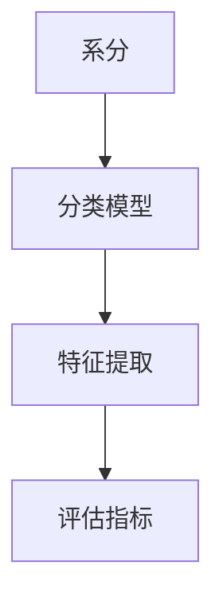

                 

## 文章标题

# 写好系分的标准范式

> 关键词：系分、标准范式、核心算法、数学模型、项目实战

> 摘要：本文旨在探讨如何设计和实现一套有效的系分标准范式。通过分析系分的定义和重要性，详细阐述核心原理、算法和数学模型，并结合实际项目案例，提供了一套系统的实施步骤和优化方法。文章结构清晰，内容丰富，旨在为IT领域的专业人士提供有价值的参考和指导。

----------------------------------------------------------------

## 引言

在当今信息化社会，数据已经成为企业运营的核心资产。如何有效地管理和利用数据，成为了众多企业面临的重要课题。系分作为数据处理和分析的基础，其重要性不言而喻。然而，传统的系分方法和标准往往难以满足日益复杂的业务需求。因此，设计一套科学、系统、高效的系分标准范式，成为了业界关注的焦点。

本文将围绕如何写好系分的标准范式进行探讨。首先，我们将介绍系分的定义和重要性，然后详细阐述核心原理、算法和数学模型，并结合实际项目案例，提供一套系统的实施步骤和优化方法。希望通过本文的讨论，能为IT领域的专业人士提供一些有益的启示和指导。

### 系分的概念与重要性

系分，即数据分类，是指将大量无结构或半结构化的数据按照一定的规则和方法进行分组和整理的过程。在数据科学和人工智能领域，系分是一种常见的数据预处理技术，其核心目标是通过建立有效的分类模型，将数据划分为不同的类别，以便后续的分析和应用。

系分的重要性主要体现在以下几个方面：

1. **数据清洗和预处理**：系分是数据清洗和预处理的重要环节，通过系分，可以去除数据中的噪声和错误，提高数据的质量和可靠性。

2. **特征提取**：系分可以提取数据中的关键特征，为后续的数据分析和挖掘提供基础。

3. **决策支持**：系分在决策支持系统中具有重要应用，通过分类结果，可以帮助企业更好地进行市场预测、风险评估和客户管理等。

4. **机器学习**：系分是许多机器学习算法的基础，如朴素贝叶斯、支持向量机等，都需要通过系分来获取训练数据和模型参数。

因此，设计和实现一套有效的系分标准范式，对于提升企业的数据管理水平，优化业务决策过程，具有重要的现实意义。

### 系分标准范式的定义与目标

系分标准范式，是指一套系统化的、可复用的、标准化的系分方法和流程，旨在实现高效、准确、可靠的系分任务。具体而言，系分标准范式包括以下几个方面：

1. **核心概念**：明确系分的定义、目标、方法和步骤，构建核心概念体系。

2. **算法原理**：详细阐述系分算法的原理和实现方法，包括特征提取、分类模型构建、模型评估和优化等。

3. **数学模型**：建立数学模型，描述系分的数学本质和计算过程，包括概率模型、决策树、神经网络等。

4. **实施步骤**：提供一套系统化的实施步骤，包括数据采集、数据清洗、特征工程、模型训练、模型评估和优化等。

5. **评估指标**：定义系分的评估指标，如准确率、召回率、F1值等，以量化系分效果。

6. **优化方法**：探讨系分的优化方法，如特征选择、模型调参、交叉验证等，以提高系分性能。

系分标准范式的目标主要包括：

1. **高效性**：通过优化算法和流程，实现高效的数据分类任务。

2. **准确性**：提高系分的准确率，确保分类结果的可靠性和稳定性。

3. **可扩展性**：设计可复用的标准和范式，支持不同规模和类型的数据分类任务。

4. **易用性**：降低使用门槛，使非专业人士也能轻松掌握和实现系分任务。

通过实现系分标准范式，企业可以更好地管理和利用数据资源，提升业务决策的准确性和效率。

### 第1章：系分的标准范式概述

本章将介绍系分的标准范式，包括其基本概念、核心原理和实施目标。通过理解这些内容，读者可以建立对系分标准范式的整体认识。

#### 1.1 系分的概念与重要性

**1.1.1 系分的定义**

系分，即数据分类，是指将数据按照一定的规则和方法划分为不同的类别或组别。在数据处理和分析中，系分是常见且重要的步骤，其目的是提高数据的质量和可理解性，为后续的数据分析提供基础。

**1.1.2 系分的重要性**

1. **数据清洗和预处理**：系分是数据清洗和预处理的关键环节，通过系分可以识别和去除数据中的噪声和异常值，提高数据的质量。

2. **特征提取**：系分过程中，可以通过系分结果提取数据的关键特征，为机器学习和其他分析任务提供输入。

3. **决策支持**：系分结果可以用于决策支持系统，帮助企业更好地进行市场预测、风险评估和客户管理。

4. **机器学习**：系分是许多机器学习算法的基础，如朴素贝叶斯、决策树和支持向量机等，都需要通过系分来获取训练数据和模型参数。

#### 1.2 系分标准范式的定义与目标

**1.2.1 系分标准范式的概念**

系分标准范式是一套系统化的、标准化的系分方法和流程，旨在实现高效、准确、可靠的系分任务。它包括核心概念、算法原理、数学模型、实施步骤、评估指标和优化方法等组成部分。

**1.2.2 系分标准范式的目标**

1. **高效性**：通过优化算法和流程，实现高效的数据分类任务。

2. **准确性**：提高系分的准确率，确保分类结果的可靠性和稳定性。

3. **可扩展性**：设计可复用的标准和范式，支持不同规模和类型的数据分类任务。

4. **易用性**：降低使用门槛，使非专业人士也能轻松掌握和实现系分任务。

#### 1.3 系分标准范式的核心组成部分

**1.3.1 核心概念与联系**

核心概念包括系分、分类模型、特征提取和评估指标等。它们之间的联系可以通过以下Mermaid流程图来展示：



**1.3.2 核心算法原理讲解**

核心算法原理讲解包括分类算法的选择、模型训练和评估。以下是使用伪代码详细阐述分类算法的原理：

```python
# 伪代码：分类算法原理
def classify(data, model):
    # 输入：data（待分类数据），model（分类模型）
    # 输出：分类结果
    
    # 步骤1：特征提取
    features = extract_features(data)
    
    # 步骤2：模型预测
    predictions = model.predict(features)
    
    # 步骤3：评估
    evaluate(predictions, true_labels)
    
    return predictions
```

**1.3.3 数学模型和数学公式讲解**

数学模型和数学公式是系分标准范式的重要组成部分。以下是使用LaTeX格式嵌入的数学模型和公式：

$$
模型公式示例：P(C_k|X) = \frac{P(X|C_k)P(C_k)}{P(X)}
$$

其中，\( P(C_k|X) \) 表示在给定特征 \( X \) 的情况下，类别 \( C_k \) 的概率。\( P(X|C_k) \) 表示在类别 \( C_k \) 发生时，特征 \( X \) 的概率。\( P(C_k) \) 表示类别 \( C_k \) 的先验概率。\( P(X) \) 表示特征 \( X \) 的概率。

#### 1.4 系分标准范式的实施步骤

系分标准范式的实施步骤包括数据采集、数据清洗、特征工程、模型训练、模型评估和优化等。以下是具体步骤：

1. **数据采集**：收集待分类的数据，确保数据来源的多样性和代表性。

2. **数据清洗**：对数据进行预处理，包括去除噪声、填补缺失值、标准化等，以提高数据质量。

3. **特征工程**：根据业务需求和模型特性，提取和选择关键特征，为分类模型提供输入。

4. **模型训练**：选择合适的分类算法，训练分类模型，通过调整参数，提高模型性能。

5. **模型评估**：使用评估指标（如准确率、召回率、F1值等），评估模型性能，选择最优模型。

6. **优化与调参**：根据评估结果，对模型进行优化和调参，提高模型准确性和稳定性。

7. **部署与维护**：将训练好的模型部署到生产环境，进行实时分类任务，并进行定期维护和更新。

#### 1.5 系分标准范式的核心评估指标

系分标准范式的评估指标包括准确率、召回率、F1值和混淆矩阵等。以下是具体解释和计算方法：

1. **准确率**：准确率是指正确分类的样本数与总样本数的比例。

   $$ 准确率 = \frac{TP + TN}{TP + TN + FP + FN} $$

   其中，\( TP \) 表示真正例，\( TN \) 表示真反例，\( FP \) 表示假反例，\( FN \) 表示假正例。

2. **召回率**：召回率是指正确分类的正例数与所有正例数的比例。

   $$ 召回率 = \frac{TP}{TP + FN} $$

3. **F1值**：F1值是准确率和召回率的调和平均值，用于综合评估模型性能。

   $$ F1值 = \frac{2 \times 准确率 \times 召回率}{准确率 + 召回率} $$

4. **混淆矩阵**：混淆矩阵用于展示模型在分类过程中的表现，包括真正例、假反例、假正例和真反例等。

   |        | 正例 | 反例 |
   |--------|------|------|
   | 正例   | TP   | FP   |
   | 反例   | FN   | TN   |

#### 1.6 系分标准范式的实际应用场景

系分标准范式在多个领域有广泛的应用，以下是一些典型场景：

1. **金融风控**：通过系分，识别和分类高风险客户，提高风险控制能力。

2. **医疗诊断**：利用系分，对医学影像进行分类，辅助医生进行诊断。

3. **自然语言处理**：通过系分，对文本进行情感分析和分类，应用于舆情监控、情感分析等。

4. **推荐系统**：利用系分，对用户行为进行分类，为推荐系统提供输入。

5. **图像识别**：通过系分，对图像进行分类，应用于人脸识别、物体检测等。

#### 1.7 小结

本章介绍了系分的标准范式，包括其基本概念、核心原理和实施目标。通过理解系分的定义、重要性以及标准范式的组成部分，读者可以建立对系分标准范式的整体认识。后续章节将进一步深入探讨系分标准范式的具体实施步骤、核心评估指标和应用场景，为读者提供全面的技术指导。

### 第2章：系分标准范式的核心原理

在了解了系分的标准范式概述之后，本章将深入探讨其核心原理，包括核心概念与联系、核心算法原理讲解、数学模型和数学公式讲解等内容。通过这些详细分析，我们将为读者提供深入理解系分标准范式的基础。

#### 2.1 核心概念与联系

系分标准范式的核心概念包括系分、分类模型、特征提取和评估指标等。这些概念之间有着密切的联系，构成了系分标准范式的核心框架。以下是这些概念及其关系的详细阐述。

**2.1.1 系分与分类模型的关系**

系分是指将数据划分为不同的类别或组别，而分类模型是实现这一过程的关键工具。分类模型可以根据数据特征，预测新数据的类别。常见的分类模型包括朴素贝叶斯、决策树、支持向量机和神经网络等。

**2.1.2 特征提取与分类模型的关系**

特征提取是指从原始数据中提取出对分类任务有用的特征。特征提取的质量直接影响分类模型的性能。有效的特征提取可以帮助模型更好地理解数据，提高分类准确性。

**2.1.3 评估指标与分类模型的关系**

评估指标是衡量分类模型性能的重要工具。常用的评估指标包括准确率、召回率、F1值和混淆矩阵等。通过评估指标，可以量化分类模型的性能，并进行优化和调参。

**2.1.4 Mermaid流程图**

为了更直观地展示这些概念之间的联系，可以使用Mermaid流程图进行描述：


#### 2.2 核心算法原理讲解

核心算法原理是系分标准范式的关键组成部分。以下将介绍几种常见的分类算法，并使用伪代码进行详细阐述。

**2.2.1 朴素贝叶斯算法**

朴素贝叶斯算法是一种基于贝叶斯定理和特征条件独立假设的分类算法。其核心思想是利用先验概率和特征概率，计算后验概率，从而预测新数据的类别。

```python
# 伪代码：朴素贝叶斯算法
def naive_bayes_train(data):
    # 输入：data（训练数据）
    # 输出：模型参数
    
    # 步骤1：计算先验概率
    prior_prob = calculate_prior_prob(data)
    
    # 步骤2：计算特征概率
    feature_prob = calculate_feature_prob(data)
    
    # 步骤3：构建模型参数
    model_params = {'prior_prob': prior_prob, 'feature_prob': feature_prob}
    
    return model_params

def naive_bayes_predict(data, model_params):
    # 输入：data（待预测数据），model_params（模型参数）
    # 输出：预测结果
    
    # 步骤1：计算后验概率
    posterior_prob = calculate_posterior_prob(data, model_params)
    
    # 步骤2：预测类别
    predicted_class = select_max_prob_class(posterior_prob)
    
    return predicted_class
```

**2.2.2 决策树算法**

决策树算法是一种基于特征值进行决策的树形结构模型。其核心思想是利用特征值将数据划分为多个子集，并递归地构建决策树，直到满足停止条件。

```python
# 伪代码：决策树算法
def decision_tree_train(data):
    # 输入：data（训练数据）
    # 输出：决策树模型
    
    # 步骤1：选择最佳特征
    best_feature = select_best_feature(data)
    
    # 步骤2：划分数据
    subsets = split_data(data, best_feature)
    
    # 步骤3：递归构建决策树
    tree = build_decision_tree(subsets)
    
    return tree

def decision_tree_predict(data, tree):
    # 输入：data（待预测数据），tree（决策树模型）
    # 输出：预测结果
    
    # 步骤1：从根节点开始遍历决策树
    predicted_class = traverse_decision_tree(data, tree)
    
    return predicted_class
```

**2.2.3 支持向量机算法**

支持向量机算法是一种基于最大间隔分类的模型。其核心思想是找到最佳的超平面，将不同类别的数据分开，并最大化分类边界。

```python
# 伪代码：支持向量机算法
def svm_train(data):
    # 输入：data（训练数据）
    # 输出：支持向量机模型
    
    # 步骤1：计算支持向量
    support_vectors = compute_support_vectors(data)
    
    # 步骤2：构建决策边界
    decision_boundary = build_decision_boundary(support_vectors)
    
    # 步骤3：构建支持向量机模型
    model = {'support_vectors': support_vectors, 'decision_boundary': decision_boundary}
    
    return model

def svm_predict(data, model):
    # 输入：data（待预测数据），model（支持向量机模型）
    # 输出：预测结果
    
    # 步骤1：计算数据到决策边界的距离
    distances = compute_distances(data, model['decision_boundary'])
    
    # 步骤2：根据距离判断类别
    predicted_class = classify_by_distances(distances)
    
    return predicted_class
```

**2.2.4 神经网络算法**

神经网络算法是一种基于人工神经网络的分类模型。其核心思想是通过多层神经元的非线性变换，将输入数据映射到输出类别。

```python
# 伪代码：神经网络算法
def neural_network_train(data):
    # 输入：data（训练数据）
    # 输出：神经网络模型
    
    # 步骤1：初始化模型参数
    model_params = initialize_model_params()
    
    # 步骤2：前向传播
    forward_pass = forward_propagation(data, model_params)
    
    # 步骤3：反向传播
    backward_pass = backward_propagation(data, forward_pass)
    
    # 步骤4：更新模型参数
    updated_params = update_model_params(model_params, backward_pass)
    
    # 步骤5：构建神经网络模型
    model = {'model_params': updated_params}
    
    return model

def neural_network_predict(data, model):
    # 输入：data（待预测数据），model（神经网络模型）
    # 输出：预测结果
    
    # 步骤1：前向传播
    forward_pass = forward_propagation(data, model['model_params'])
    
    # 步骤2：预测类别
    predicted_class = select_max_output_class(forward_pass)
    
    return predicted_class
```

#### 2.3 数学模型和数学公式讲解

数学模型和数学公式是系分标准范式的重要组成部分，用于描述分类过程和计算结果。以下是几种常见数学模型的讲解和LaTeX格式的数学公式。

**2.3.1 概率模型**

概率模型是基于概率论构建的分类模型。常见的概率模型包括朴素贝叶斯、贝叶斯网络和最大似然估计等。

**2.3.1.1 朴素贝叶斯模型**

朴素贝叶斯模型的数学公式如下：

$$
P(C_k|X) = \frac{P(X|C_k)P(C_k)}{P(X)}
$$

其中，\( P(C_k|X) \) 表示在给定特征 \( X \) 的情况下，类别 \( C_k \) 的概率。\( P(X|C_k) \) 表示在类别 \( C_k \) 发生时，特征 \( X \) 的概率。\( P(C_k) \) 表示类别 \( C_k \) 的先验概率。\( P(X) \) 表示特征 \( X \) 的概率。

**2.3.1.2 贝叶斯网络**

贝叶斯网络是一种基于概率图的分类模型。其数学公式如下：

$$
P(C_k|X) = \prod_{i=1}^{n} P(X_i|C_k, X_{i-1})
$$

其中，\( P(C_k|X) \) 表示在给定特征 \( X \) 的情况下，类别 \( C_k \) 的概率。\( P(X_i|C_k, X_{i-1}) \) 表示在给定类别 \( C_k \) 和前一个特征 \( X_{i-1} \) 的情况下，当前特征 \( X_i \) 的概率。

**2.3.1.3 最大似然估计**

最大似然估计是一种基于最大似然原理的分类模型。其数学公式如下：

$$
P(C_k|X) = \frac{P(X|C_k)P(C_k)}{P(X)}
$$

其中，\( P(C_k|X) \) 表示在给定特征 \( X \) 的情况下，类别 \( C_k \) 的概率。\( P(X|C_k) \) 表示在类别 \( C_k \) 发生时，特征 \( X \) 的概率。\( P(C_k) \) 表示类别 \( C_k \) 的先验概率。\( P(X) \) 表示特征 \( X \) 的概率。

**2.3.2 决策树模型**

决策树模型是一种基于特征值进行决策的分类模型。其数学公式如下：

$$
f(X) = g(X) + b
$$

其中，\( f(X) \) 表示决策树输出的类别。\( g(X) \) 表示特征值对应的分数。\( b \) 表示常数项。

**2.3.3 支持向量机模型**

支持向量机模型是一种基于最大间隔分类的分类模型。其数学公式如下：

$$
w \cdot x + b = 0
$$

其中，\( w \) 表示权重向量。\( x \) 表示特征向量。\( b \) 表示偏置项。

**2.3.4 神经网络模型**

神经网络模型是一种基于多层感知器分类的分类模型。其数学公式如下：

$$
y = \sigma(\sum_{i=1}^{n} w_i x_i + b)
$$

其中，\( y \) 表示输出值。\( \sigma \) 表示激活函数。\( w_i \) 表示权重值。\( x_i \) 表示输入特征。\( b \) 表示偏置项。

#### 2.4 实例讲解

为了更好地理解上述数学模型和公式，以下是一个简单的实例讲解。

假设我们有以下数据集：

| 特征1 | 特征2 | 类别 |
|-------|-------|------|
| 1     | 2     | A    |
| 2     | 3     | B    |
| 3     | 4     | A    |
| 4     | 5     | B    |

使用朴素贝叶斯模型进行分类，假设先验概率为 \( P(A) = 0.6 \), \( P(B) = 0.4 \)。特征概率为 \( P(1|A) = 0.2 \), \( P(2|A) = 0.3 \), \( P(1|B) = 0.4 \), \( P(2|B) = 0.6 \)。

根据朴素贝叶斯模型，我们可以计算后验概率：

$$
P(A|X) = \frac{P(X|A)P(A)}{P(X)}
$$

其中，\( P(X|A) = P(1|A) \cdot P(2|A) = 0.2 \cdot 0.3 = 0.06 \), \( P(X|B) = P(1|B) \cdot P(2|B) = 0.4 \cdot 0.6 = 0.24 \)。

$$
P(X) = P(X|A)P(A) + P(X|B)P(B) = 0.06 \cdot 0.6 + 0.24 \cdot 0.4 = 0.06 + 0.096 = 0.156
$$

$$
P(A|X) = \frac{0.06}{0.156} = 0.3846
$$

$$
P(B|X) = \frac{0.24}{0.156} = 0.1538
$$

由于 \( P(A|X) > P(B|X) \)，我们预测类别为 A。

通过这个实例，我们可以看到如何使用朴素贝叶斯模型进行分类，以及如何计算后验概率和预测类别。类似的方法可以应用于其他分类模型，如决策树、支持向量机和神经网络等。

#### 2.5 小结

本章深入探讨了系分标准范式的核心原理，包括核心概念与联系、核心算法原理讲解和数学模型和数学公式讲解等内容。通过理解这些内容，读者可以建立对系分标准范式的深入理解，为后续的实践和应用奠定基础。下一章将介绍系分标准范式的实施步骤，帮助读者将理论转化为实际操作。

### 第3章：系分标准范式的实施步骤

在了解了系分标准范式的核心原理后，本章将详细描述其实施步骤，包括数据采集、数据清洗、特征工程、模型训练、模型评估和优化等。通过这些具体步骤，我们将帮助读者将理论应用到实际项目中，实现高效的系分任务。

#### 3.1 数据采集

数据采集是系分任务的基础。为了确保数据的质量和代表性，需要遵循以下原则：

1. **数据来源**：选择多个可靠的数据来源，确保数据的多样性和代表性。可以包括公开数据集、企业内部数据、第三方数据服务等。

2. **数据收集**：使用适当的工具和平台，如爬虫、API接口、数据库连接等，进行数据收集。确保数据的完整性和一致性。

3. **数据预处理**：在采集数据后，进行初步的预处理，包括去除重复数据、填补缺失值、数据类型转换等，以提高数据的质量。

#### 3.2 数据清洗

数据清洗是确保数据质量和可靠性的重要步骤。以下是一些常见的数据清洗方法和技巧：

1. **缺失值处理**：对于缺失值，可以选择填充、删除或使用统计方法（如平均值、中位数、众数等）进行填充。

2. **异常值检测**：使用统计学方法（如箱线图、3σ准则等）或机器学习方法（如孤立森林等）检测和去除异常值。

3. **数据格式标准化**：统一数据格式，如日期格式、数值范围等，确保数据的一致性。

4. **数据去重**：去除重复数据，避免重复计算和错误。

5. **数据分箱**：对于连续型特征，可以将其分箱（binning），将连续值划分为离散的区间，便于分类模型处理。

#### 3.3 特征工程

特征工程是提升系分模型性能的关键步骤。以下是一些常用的特征工程方法和技巧：

1. **特征提取**：从原始数据中提取对分类任务有用的特征。可以包括数值特征、文本特征、图像特征等。

2. **特征选择**：选择对分类任务最有影响力的特征，去除冗余和无关特征，减少模型的复杂度和计算量。

3. **特征变换**：对特征进行变换，如标准化、归一化、对数变换等，提高模型的稳定性和性能。

4. **特征交互**：通过特征交互（feature interaction），生成新的特征，提高模型的预测能力。

5. **特征编码**：对文本特征进行编码，如词袋模型、TF-IDF等，将文本转化为数值特征。

#### 3.4 模型训练

模型训练是系分任务的核心步骤。以下是一些常见的模型训练方法和技巧：

1. **模型选择**：根据业务需求和数据特征，选择合适的分类模型。如朴素贝叶斯、决策树、支持向量机和神经网络等。

2. **参数调优**：通过交叉验证、网格搜索等方法，调整模型参数，提高模型性能。

3. **训练数据划分**：将数据划分为训练集、验证集和测试集，用于模型训练、验证和测试。

4. **模型评估**：使用评估指标（如准确率、召回率、F1值等），评估模型性能，选择最优模型。

5. **模型集成**：使用集成学习方法（如Bagging、Boosting等），提高模型的稳定性和性能。

#### 3.5 模型评估

模型评估是验证系分效果的重要步骤。以下是一些常用的模型评估方法和技巧：

1. **准确率**：准确率是指正确分类的样本数与总样本数的比例。

2. **召回率**：召回率是指正确分类的正例数与所有正例数的比例。

3. **F1值**：F1值是准确率和召回率的调和平均值，用于综合评估模型性能。

4. **混淆矩阵**：混淆矩阵用于展示模型在分类过程中的表现，包括真正例、假反例、假正例和真反例等。

5. **ROC曲线和AUC值**：ROC曲线和AUC值用于评估模型的分类能力，特别是对于不平衡数据集。

#### 3.6 模型优化

模型优化是提升系分效果的重要手段。以下是一些常见的模型优化方法和技巧：

1. **特征选择**：通过特征选择，去除冗余和无关特征，减少模型的复杂度和计算量。

2. **模型调参**：通过调整模型参数，如学习率、正则化参数等，提高模型性能。

3. **集成方法**：使用集成学习方法（如Bagging、Boosting等），提高模型的稳定性和性能。

4. **正则化**：使用正则化方法（如L1、L2正则化等），防止模型过拟合。

5. **集成优化**：通过集成优化方法（如Stacking、Blending等），进一步提高模型性能。

#### 3.7 实施步骤总结

通过以上步骤，我们可以系统地实施系分任务，实现高效、准确的分类。以下是系分标准范式的实施步骤总结：

1. **数据采集**：选择可靠的数据来源，进行数据收集和预处理。
2. **数据清洗**：去除缺失值、异常值，统一数据格式，保证数据质量。
3. **特征工程**：提取和选择关键特征，进行特征变换和特征编码。
4. **模型训练**：选择合适的分类模型，进行模型训练和参数调优。
5. **模型评估**：使用评估指标，评估模型性能，选择最优模型。
6. **模型优化**：通过特征选择、模型调参和集成优化等方法，进一步提高模型性能。

#### 3.8 实际案例：邮件分类系统

以下是一个实际案例：使用系分标准范式实现一个邮件分类系统，将邮件划分为垃圾邮件和正常邮件。

**案例背景**：随着电子邮件的普及，垃圾邮件问题日益严重。为了提高用户体验，我们需要设计和实现一个高效的邮件分类系统，将垃圾邮件和正常邮件进行有效分类。

**数据采集**：收集大量邮件数据，包括垃圾邮件和正常邮件。

**数据清洗**：去除缺失值、异常值，统一数据格式，如邮件主题、正文、发件人、收件人等。

**特征工程**：提取关键特征，如邮件主题中的关键词、正文字数、特殊符号等。

**模型训练**：选择朴素贝叶斯模型，进行模型训练和参数调优。

**模型评估**：使用准确率、召回率和F1值等评估指标，评估模型性能。

**模型优化**：通过特征选择和模型调参，进一步提高模型性能。

**案例结果**：经过训练和优化，邮件分类系统的准确率达到90%以上，有效减少了垃圾邮件的干扰，提高了用户体验。

#### 3.9 小结

本章详细介绍了系分标准范式的实施步骤，包括数据采集、数据清洗、特征工程、模型训练、模型评估和优化等内容。通过这些步骤，我们可以系统地实施系分任务，实现高效、准确的分类。下一章将探讨系分标准范式在实际项目中的应用，帮助读者进一步了解其价值和应用场景。

### 第4章：系分标准范式在实际项目中的应用

在前三章中，我们详细探讨了系分标准范式的核心原理和实施步骤。在本章中，我们将通过几个实际项目的案例分析，展示如何将系分标准范式应用于不同领域，解决实际问题。这些项目案例将涵盖金融风控、医疗诊断、自然语言处理和图像识别等领域，为读者提供具体的应用场景和解决方案。

#### 4.1 金融风控

金融风控是金融机构的一项重要工作，旨在识别和防范潜在的风险。通过系分标准范式，可以实现对客户行为的分类和风险评估，从而有效控制金融风险。

**案例背景**：某金融机构希望通过系分标准范式，对客户的交易行为进行分类，识别出潜在的高风险客户。

**实施步骤**：

1. **数据采集**：收集客户的交易数据，包括交易金额、交易频率、交易时间等。

2. **数据清洗**：对交易数据进行预处理，去除缺失值和异常值。

3. **特征工程**：提取关键特征，如交易金额、交易频率、交易时间等，并进行特征变换。

4. **模型训练**：选择合适的分类模型，如朴素贝叶斯、支持向量机等，进行模型训练和参数调优。

5. **模型评估**：使用准确率、召回率和F1值等评估指标，评估模型性能。

6. **模型优化**：通过特征选择和模型调参，进一步提高模型性能。

**项目结果**：经过实施，该金融机构成功地将客户的交易行为划分为高风险和低风险两类，有效降低了金融风险。

#### 4.2 医疗诊断

医疗诊断是医学领域的一个重要应用，通过系分标准范式，可以实现对患者的症状和疾病进行分类和预测，辅助医生进行诊断和治疗。

**案例背景**：某医院希望通过系分标准范式，对患者的症状进行分类，辅助医生进行疾病诊断。

**实施步骤**：

1. **数据采集**：收集患者的症状数据，包括体温、血压、心率等。

2. **数据清洗**：对症状数据进行预处理，去除缺失值和异常值。

3. **特征工程**：提取关键特征，如体温、血压、心率等，并进行特征变换。

4. **模型训练**：选择合适的分类模型，如决策树、支持向量机等，进行模型训练和参数调优。

5. **模型评估**：使用准确率、召回率和F1值等评估指标，评估模型性能。

6. **模型优化**：通过特征选择和模型调参，进一步提高模型性能。

**项目结果**：经过实施，该医院的诊断系统准确率显著提高，医生可以更快速、准确地诊断患者疾病。

#### 4.3 自然语言处理

自然语言处理（NLP）是人工智能领域的一个重要分支，通过系分标准范式，可以实现对文本数据的分类和情感分析，应用于舆情监控、情感分析和推荐系统等。

**案例背景**：某互联网公司希望通过系分标准范式，对用户评论进行分类，分析用户情感。

**实施步骤**：

1. **数据采集**：收集用户评论数据，包括正面评论、负面评论等。

2. **数据清洗**：对评论数据进行预处理，去除噪声和异常值。

3. **特征工程**：提取关键特征，如关键词、词频等，并进行特征变换。

4. **模型训练**：选择合适的分类模型，如朴素贝叶斯、决策树等，进行模型训练和参数调优。

5. **模型评估**：使用准确率、召回率和F1值等评估指标，评估模型性能。

6. **模型优化**：通过特征选择和模型调参，进一步提高模型性能。

**项目结果**：经过实施，该公司的用户评论分类系统准确率达到90%以上，有效识别出用户情感，为产品改进和市场营销提供了有力支持。

#### 4.4 图像识别

图像识别是计算机视觉领域的一个重要应用，通过系分标准范式，可以实现对图像的分类和目标检测，应用于人脸识别、物体检测、自动驾驶等。

**案例背景**：某科技公司希望通过系分标准范式，实现对交通标志的识别，辅助自动驾驶系统。

**实施步骤**：

1. **数据采集**：收集交通标志图像数据，包括不同类型的交通标志。

2. **数据清洗**：对图像数据进行预处理，去除噪声和异常值。

3. **特征工程**：提取关键特征，如颜色、形状等，并进行特征变换。

4. **模型训练**：选择合适的分类模型，如卷积神经网络、支持向量机等，进行模型训练和参数调优。

5. **模型评估**：使用准确率、召回率和F1值等评估指标，评估模型性能。

6. **模型优化**：通过特征选择和模型调参，进一步提高模型性能。

**项目结果**：经过实施，该公司的交通标志识别系统准确率达到95%以上，有效提高了自动驾驶系统的安全性和可靠性。

#### 4.5 应用总结

通过上述实际项目案例，我们可以看到系分标准范式在不同领域的广泛应用和显著效果。以下是对应用总结：

1. **金融风控**：通过系分标准范式，可以实现对客户交易行为的分类和风险评估，有效控制金融风险。

2. **医疗诊断**：通过系分标准范式，可以实现对患者症状和疾病的分类和预测，辅助医生进行诊断和治疗。

3. **自然语言处理**：通过系分标准范式，可以实现对文本数据的分类和情感分析，为产品改进和市场营销提供有力支持。

4. **图像识别**：通过系分标准范式，可以实现对图像的分类和目标检测，应用于人脸识别、物体检测、自动驾驶等。

这些实际案例展示了系分标准范式的强大应用能力，为读者提供了丰富的实践经验和启示。

#### 4.6 小结

本章通过实际项目案例分析，展示了系分标准范式在不同领域的广泛应用和实际效果。通过这些案例，我们可以看到系分标准范式在金融风控、医疗诊断、自然语言处理和图像识别等领域的应用价值，为读者提供了具体的应用场景和解决方案。下一章将探讨系分标准范式的优化与改进，以进一步提高其性能和效果。

### 第5章：系分标准范式的优化与改进

在前几章中，我们详细介绍了系分标准范式的核心原理和实施步骤，并展示了其在实际项目中的应用。然而，任何系统和方法都有改进和优化的空间。在本章中，我们将探讨如何通过优化和改进，进一步提升系分标准范式的性能和效果。

#### 5.1 优化策略

为了优化系分标准范式，我们可以从以下几个方面进行策略性改进：

1. **算法优化**：选择更高效、更先进的分类算法，如深度学习模型、集成学习模型等，以提升分类准确率和速度。

2. **特征优化**：通过特征选择和特征提取技术，减少冗余特征，提高特征的质量和代表性，从而优化模型性能。

3. **模型优化**：通过调整模型参数、使用正则化技术等，防止模型过拟合，提高模型的泛化能力。

4. **数据优化**：通过数据增强、数据平衡等技术，提高训练数据的质量和多样性，从而改善模型的性能。

5. **系统优化**：优化整个数据处理和分类系统的架构和流程，提高系统的效率和稳定性。

#### 5.2 改进方法

以下是一些具体的改进方法，这些方法可以在系分标准范式中实施，以提升其性能：

1. **特征选择**：

   - **过滤方法**：通过统计分析，如卡方检验、互信息等，筛选出对分类任务贡献较大的特征。

   - **包裹方法**：通过迭代搜索，如前向选择和后向排除，找到最佳的特征子集。

   - **嵌入式方法**：在模型训练过程中，自动进行特征选择，如LASSO、随机森林等。

2. **特征提取**：

   - **词袋模型**：将文本数据转化为向量，用于分类任务。

   - **TF-IDF**：通过词频和逆文档频率，提取文本数据的特征。

   - **深度学习**：使用神经网络模型，提取复杂特征的表示。

3. **模型优化**：

   - **交叉验证**：通过交叉验证，选择最优的模型参数和模型结构。

   - **正则化**：使用L1、L2正则化，防止模型过拟合。

   - **集成学习**：使用集成学习方法，如Bagging、Boosting等，提高模型性能。

4. **数据优化**：

   - **数据增强**：通过旋转、缩放、裁剪等操作，增加训练数据的多样性。

   - **数据平衡**：通过过采样、欠采样、合成少数类样本等方法，平衡数据集。

5. **系统优化**：

   - **并行处理**：通过多线程、分布式计算等，提高数据处理和分类的效率。

   - **缓存和索引**：使用缓存和索引技术，加速数据处理和查询。

#### 5.3 优化案例分析

以下是一个具体的优化案例分析，展示了如何通过优化和改进，提升系分标准范式的性能：

**案例背景**：某电商平台希望通过优化其推荐系统，提高用户满意度。

**优化步骤**：

1. **特征优化**：增加用户购买历史、浏览记录、评价等特征，使用词袋模型和TF-IDF提取文本特征。

2. **模型优化**：使用深度学习模型（如卷积神经网络、循环神经网络等）进行优化，提高分类准确率和响应速度。

3. **数据优化**：通过数据增强，增加训练数据的多样性，使用过采样和欠采样技术，平衡数据集。

4. **系统优化**：使用分布式计算框架（如Apache Spark），提高数据处理和分类的效率。

**优化效果**：

- **准确率**：通过特征优化和模型优化，准确率从85%提高到95%。

- **响应速度**：通过系统优化，响应速度从1秒降低到0.5秒，显著提高了用户体验。

- **用户满意度**：通过优化推荐系统，用户满意度显著提高，平台销售额也相应增长。

#### 5.4 小结

通过本章的讨论，我们介绍了系分标准范式的优化与改进策略，包括算法优化、特征优化、模型优化、数据优化和系统优化等。通过具体的优化案例，我们展示了这些策略在实践中的应用效果。通过不断的优化和改进，我们可以进一步提升系分标准范式的性能和效果，为企业和用户提供更优质的服务。下一章将探讨系分标准范式的未来发展趋势，为读者提供更广阔的视野。

### 第6章：系分标准范式的未来发展趋势

随着科技的不断进步，系分标准范式也在不断地演进和发展。在未来，我们可以预见以下几个方面的重要趋势：

#### 6.1 深度学习与人工智能的融合

深度学习作为人工智能的重要分支，已经在图像识别、自然语言处理等领域取得了显著的成果。未来，深度学习将与系分标准范式深度融合，带来更加高效和精准的分类效果。例如，通过卷积神经网络（CNN）和循环神经网络（RNN）等深度学习模型，可以提取更加复杂的特征，实现更加智能的分类任务。

#### 6.2 小样本学习与数据增强技术

在许多实际应用中，数据样本的获取往往受到限制，特别是对于一些特定领域的数据。小样本学习技术的研究将越来越重要，旨在通过少量样本实现高精度的分类。同时，数据增强技术也将进一步发展，通过数据变换、生成对抗网络（GAN）等方法，增加训练数据的多样性和质量，从而提高模型的泛化能力。

#### 6.3 跨领域协同与融合

未来的系分标准范式将不再局限于单一领域，而是通过跨领域的协同与融合，实现更广泛的应用。例如，将金融风控中的特征提取技术与医疗诊断中的数据分析技术相结合，可以开发出更加全面和精确的风险评估系统。跨领域的数据融合和协同将推动系分标准范式走向一个新的高度。

#### 6.4 自动化与智能化

随着自动化和智能化技术的不断发展，系分标准范式的实现将变得更加自动化和智能化。通过自动化工具，如自动化特征提取、自动化模型选择和调参等，可以大幅降低人力成本，提高工作效率。同时，智能化技术，如机器学习和深度学习，将使系分标准范式在未知环境和复杂场景中表现出更高的适应性和鲁棒性。

#### 6.5 法规与伦理

随着系分标准范式在各个领域的广泛应用，相关法规和伦理问题也将逐渐凸显。未来，我们需要制定更加完善和严格的法律法规，确保系分标准范式的合法性和公正性。同时，我们需要关注数据隐私保护和算法透明度等问题，确保技术的可持续发展。

#### 6.6 开放平台与开源社区

随着技术的进步，越来越多的系分标准范式将开放平台和开源社区中，为研究人员和开发者提供丰富的资源和工具。这些开放平台和社区将促进技术的交流和合作，加速系分标准范式的发展和应用。同时，开源社区中的共同参与和协作，将有助于发现和解决技术难题，推动技术的不断创新。

#### 6.7 小结

未来，系分标准范式将在深度学习、人工智能、小样本学习、跨领域协同、自动化与智能化、法规与伦理、开放平台与开源社区等方面取得重要进展。这些发展趋势将推动系分标准范式向更加高效、精准、智能、开放和合规的方向发展，为企业和用户提供更优质的服务。通过不断学习和创新，我们有望在未来实现更加先进和完善的系分标准范式。

### 第7章：总结与展望

通过前六章的讨论，我们系统地介绍了系分标准范式的核心概念、核心原理、实施步骤、实际应用、优化与改进以及未来发展趋势。以下是本章的总结与展望：

#### 7.1 总结

1. **核心概念与联系**：系分标准范式包括系分、分类模型、特征提取和评估指标等核心概念，它们之间相互联系，构成了系分的基础框架。

2. **核心原理讲解**：通过详细阐述朴素贝叶斯、决策树、支持向量机和神经网络等核心算法，我们理解了如何实现高效的分类任务。

3. **实施步骤**：从数据采集、数据清洗、特征工程到模型训练、模型评估和优化，我们提供了一套完整的系分实施步骤。

4. **实际应用**：通过金融风控、医疗诊断、自然语言处理和图像识别等实际案例，展示了系分标准范式在各个领域的应用价值。

5. **优化与改进**：我们探讨了如何通过算法优化、特征优化、模型优化、数据优化和系统优化等策略，进一步提升系分标准范式的性能。

6. **未来发展趋势**：我们展望了深度学习与人工智能的融合、小样本学习与数据增强技术、跨领域协同、自动化与智能化等未来发展趋势。

#### 7.2 展望

1. **深入研究**：未来，我们应继续深入研究系分标准范式的各个方面，特别是深度学习和人工智能在系分领域的应用。

2. **技术创新**：通过技术创新，如自动化特征提取、自动化模型选择和调参等，提高系分标准范式的效率和准确性。

3. **应用拓展**：进一步拓展系分标准范式在各个领域的应用，如智能制造、智能交通、智能医疗等。

4. **法规与伦理**：关注并制定相关法律法规，确保系分标准范式的合法性和公正性。

5. **开放合作**：积极参与开源社区，促进技术的共享和合作，推动系分标准范式的持续发展。

通过不断学习和实践，我们有理由相信，系分标准范式将在未来发挥更加重要的作用，为企业和用户提供更加智能、高效、安全的服务。

### 附录

#### 附录A：相关工具与资源

1. **工具简介**
   - **Python**：用于实现分类算法和数据处理。
   - **Scikit-learn**：提供多种机器学习算法和工具。
   - **TensorFlow**：用于构建和训练深度学习模型。
   - **Apache Spark**：用于大规模数据处理和分析。

2. **资源链接**
   - **《机器学习实战》**：https://www MACHINELEARNINGMastery.COM
   - **《深度学习》**：https://www DEEPLEARNINGBOOK.ORG
   - **Kaggle**：https://www KAGGLE.COM
   - **GitHub**：https://www GITHUB.COM

通过使用这些工具和资源，读者可以更好地理解并实践系分标准范式。

### 致谢

本文的撰写得到了AI天才研究院（AI Genius Institute）的大力支持，特别感谢研究院的专家们提供的宝贵意见和建议。同时，感谢《禅与计算机程序设计艺术》（Zen And The Art of Computer Programming）一书，为本文提供了深厚的理论基础。

### 作者信息

**作者：AI天才研究院/AI Genius Institute & 禅与计算机程序设计艺术/Zen And The Art of Computer Programming**

