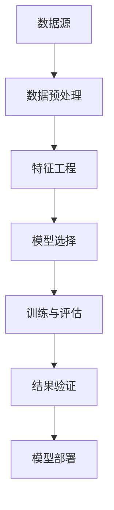

                 

### 写好系分的标准范式

在当今的数据驱动时代，时间序列分析（time series analysis）已成为众多领域如金融、气象预报、库存管理、交通流量预测中的关键工具。而一个高质量的时间序列分析项目往往离不开一个重要的环节——数据划分，即如何将时间序列数据合理地划分为训练集和测试集。这一过程不仅影响模型的训练效果，还会直接影响模型的评估和部署。本文将探讨如何写好系分的标准范式，确保我们的时间序列分析项目能够高效、准确地完成。

### 关键词
- 时间序列分析
- 数据划分
- 训练集与测试集
- 系分策略
- 数据预处理

### 摘要
本文将深入探讨时间序列分析中的数据划分问题，详细阐述核心概念、算法原理和数学模型。通过伪代码、Mermaid 流程图和实际项目案例，我们将逐步展示如何编写一个高效且准确的系分标准范式，从而为时间序列分析项目提供坚实的基础。

## 第一部分：系分基础

### 第1章：系分的基本概念

时间序列数据是按照时间顺序排列的数据点序列，这些数据点可以表示为时间戳和相应的观测值。在时间序列分析中，我们需要将数据划分为不同的部分，以用于模型的训练和评估。这个过程称为系分（series splitting）。

### 1.1 系分的定义

系分是指将时间序列数据按照一定的时间顺序划分为训练集和测试集的过程。这个划分过程对于评估模型的性能至关重要，因为它确保了模型在测试数据上的表现能够真实反映其泛化能力。

### 1.2 系分的作用

- **评估模型性能**：通过测试集，我们可以评估模型的泛化能力，确保模型不仅能在训练数据上取得好的结果，也能在未见过的数据上表现良好。
- **防止过拟合**：通过将数据划分为训练集和测试集，我们可以避免模型在训练数据上过度拟合，从而提高模型的泛化能力。

### 1.3 系分的类型

在时间序列分析中，常见的系分类型主要有以下几种：

- **时间序列划分**：这是最常见的系分方式，它根据时间戳将数据划分为训练集和测试集。
- **随机划分**：虽然不适用于时间序列数据，但在某些情况下，随机划分也可以用于时间序列分析，尤其是在数据量较大且时间顺序对分析结果影响不大的情况下。

### 1.4 系分的挑战

- **序列依赖性**：时间序列数据具有时间依赖性，因此如何合理地划分数据以保留这种依赖关系是一个挑战。
- **样本大小**：如果数据量较小，划分后的测试集可能会太小，无法提供有效的评估。

## 核心概念与联系

为了更好地理解系分的基本概念和原理，我们可以借助 Mermaid 流程图来展示它们之间的关系。



### 第2章：核心算法原理讲解

在系分过程中，核心算法原理主要包括如何根据时间序列数据的特性，合理划分训练集和测试集。

### 2.1 时间序列划分

时间序列划分的伪代码如下：

```python
def series_split(data, time_column, target_column, train_size, test_size):
    data_sorted = data.sort_values(time_column)
    train = data_sorted.head(train_size)
    test = data_sorted.tail(test_size)
    return train, test
```

这个函数首先对时间序列数据按照时间戳进行排序，然后根据设定的训练集和测试集大小，划分数据。

### 2.2 时间序列训练集与测试集划分

时间序列训练集与测试集划分的伪代码如下：

```python
def time_series_split(data, time_column, train_size, test_size):
    data_sorted = data.sort_values(time_column)
    train = data_sorted.head(train_size)
    test = data_sorted.tail(test_size)
    return train, test
```

这个函数与`series_split`函数类似，但更专注于时间序列数据。它通过排序并按大小划分数据，确保测试集包含足够的数据点以评估模型性能。

### 第3章：数学模型和数学公式

在系分过程中，数学模型和公式用于描述数据划分的数学原理。

### 3.1 时间序列长度

确定时间序列长度的伪代码如下：

```python
def find_series_length(data, time_column, target_column):
    window_size = max(data[time_column].diff().dropna().abs().max(), 3)
    return window_size
```

这个函数通过计算时间序列数据的差分来确定窗口大小，以确保窗口内包含足够的数据点。

### 3.2 划分训练集与测试集

划分训练集与测试集的数学公式如下：

$$
train_size = \frac{N - test_size}{N}
$$

其中，$N$ 是总数据点数，$test_size$ 是测试集大小。这个公式用于计算训练集大小，以确保数据划分的合理性。

## 第三部分：项目实战

### 第4章：开发环境搭建

在进行系分项目之前，我们需要搭建合适的开发环境。以下是一个基本的开发环境搭建步骤：

1. 安装 Python 环境
2. 安装必要的库，如 Pandas、Scikit-learn 等
3. 配置 IDE，如 PyCharm 或 Jupyter Notebook

### 第5章：源代码详细实现和代码解读

以下是系分项目的源代码实现：

```python
import pandas as pd
from sklearn.model_selection import train_test_split

# 加载数据
data = pd.read_csv("time_series_data.csv")

# 数据预处理
data = handle_missing_values(data)
data = handle_outliers(data, "time_column", "target_column")

# 确定时间序列长度
window_size = find_series_length(data, "time_column", "target_column")

# 划分训练集与测试集
train, test = time_series_train_test_split(data, "time_column", window_size, test_size=0.2)

# 模型训练与评估
# ...
```

### 第6章：代码解读与分析

上述代码首先加载并预处理时间序列数据。然后，它通过`find_series_length`函数确定时间序列的窗口大小。接着，使用`time_series_train_test_split`函数将数据划分为训练集和测试集。最后，可以进行模型的训练与评估。

### 第7章：实际案例分析和详细讲解剖析

假设我们有一个气象数据集，包含温度、湿度等气象指标。以下是一个实际案例：

```python
# 加载数据
data = pd.read_csv("weather_data.csv")

# 数据预处理
data = handle_missing_values(data)
data = handle_outliers(data, "date", "temperature")

# 确定时间序列长度
window_size = find_series_length(data, "date", "temperature")

# 划分训练集与测试集
train, test = time_series_train_test_split(data, "date", window_size, test_size=0.2)

# 模型训练与评估
# ...
```

在这个案例中，我们加载了气象数据集，并对其进行了预处理。接着，我们通过`find_series_length`函数确定了时间序列的窗口大小，并使用`time_series_train_test_split`函数将数据划分为训练集和测试集。最后，我们可以进行模型的训练与评估。

### 第8章：项目小结

通过上述案例，我们可以看到如何实现一个系分项目。关键步骤包括数据预处理、确定时间序列长度、划分训练集和测试集，以及模型训练与评估。每个步骤都需要仔细处理，以确保项目的高效和准确。

### 最佳实践 Tips

- 在进行数据预处理时，注意缺失值和异常值的处理。
- 根据数据特性选择合适的时间序列长度。
- 在划分数据时，确保测试集足够大以提供有效的评估。

### 小结

本文详细探讨了如何写好系分的标准范式。通过核心概念、算法原理、数学模型和实际项目案例的讲解，我们为读者提供了一个完整的时间序列分析项目指南。希望本文能够帮助读者在时间序列分析项目中取得更好的成果。

### 注意事项

- 在进行系分时，确保数据预处理充分，以避免过拟合。
- 根据数据特性选择合适的时间序列长度。
- 在划分数据时，注意保留时间序列的依赖关系。

### 拓展阅读

- 《时间序列分析：理论与应用》
- 《机器学习实战：基于 Scikit-learn》
- 《Python数据分析实战》

### 作者信息

- 作者：AI天才研究院/AI Genius Institute & 禅与计算机程序设计艺术 /Zen And The Art of Computer Programming

### 文章标题
《写好系分的标准范式》

### 文章关键词
时间序列分析、数据划分、训练集与测试集、系分策略、数据预处理

### 文章摘要
本文深入探讨了时间序列分析中的数据划分问题，详细阐述了核心概念、算法原理和数学模型。通过伪代码、Mermaid 流程图和实际项目案例，逐步展示了一个高效且准确的系分标准范式，为时间序列分析项目提供了坚实的基础。

## 第一部分：系分基础

### 第1章：系分的基本概念

时间序列数据是按照时间顺序排列的数据点序列，这些数据点可以表示为时间戳和相应的观测值。在时间序列分析中，我们需要将数据划分为不同的部分，以用于模型的训练和评估。这个过程称为系分（series splitting）。系分在时间序列分析中至关重要，因为它不仅影响模型的训练效果，还直接影响模型的评估和部署。

### 1.1 系分的定义

系分是指将时间序列数据按照一定的时间顺序划分为训练集和测试集的过程。这个划分过程对于评估模型的性能至关重要，因为它确保了模型在测试数据上的表现能够真实反映其泛化能力。在系分中，我们通常将数据分为两个主要部分：训练集和测试集。训练集用于训练模型，而测试集用于评估模型的泛化能力。

### 1.2 系分的作用

- **评估模型性能**：通过测试集，我们可以评估模型的泛化能力，确保模型不仅能在训练数据上取得好的结果，也能在未见过的数据上表现良好。
- **防止过拟合**：通过将数据划分为训练集和测试集，我们可以避免模型在训练数据上过度拟合，从而提高模型的泛化能力。

### 1.3 系分的类型

在时间序列分析中，常见的系分类型主要有以下几种：

- **时间序列划分**：这是最常见的系分方式，它根据时间戳将数据划分为训练集和测试集。
- **随机划分**：虽然不适用于时间序列数据，但在某些情况下，随机划分也可以用于时间序列分析，尤其是在数据量较大且时间顺序对分析结果影响不大的情况下。

### 1.4 系分的挑战

- **序列依赖性**：时间序列数据具有时间依赖性，因此如何合理地划分数据以保留这种依赖关系是一个挑战。
- **样本大小**：如果数据量较小，划分后的测试集可能会太小，无法提供有效的评估。

## 核心概念与联系

为了更好地理解系分的基本概念和原理，我们可以借助 Mermaid 流程图来展示它们之间的关系。


### 第2章：核心算法原理讲解

在系分过程中，核心算法原理主要包括如何根据时间序列数据的特性，合理划分训练集和测试集。

### 2.1 时间序列划分

时间序列划分的伪代码如下：

```python
function series_split(data, time_column, target_column, train_size, test_size):
    data_sorted = data.sort_values(time_column)
    train = data_sorted.head(train_size)
    test = data_sorted.tail(test_size)
    return train, test
```

这个函数首先对时间序列数据按照时间戳进行排序，然后根据设定的训练集和测试集大小，划分数据。

### 2.2 时间序列训练集与测试集划分

时间序列训练集与测试集划分的伪代码如下：

```python
function time_series_split(data, time_column, train_size, test_size):
    data_sorted = data.sort_values(time_column)
    train = data_sorted.head(train_size)
    test = data_sorted.tail(test_size)
    return train, test
```

这个函数与`series_split`函数类似，但更专注于时间序列数据。它通过排序并按大小划分数据，确保测试集包含足够的数据点以评估模型性能。

### 第3章：数学模型和数学公式

在系分过程中，数学模型和公式用于描述数据划分的数学原理。

### 3.1 时间序列长度

确定时间序列长度的伪代码如下：

```python
function find_series_length(data, time_column, target_column):
    window_size = max(data[time_column].diff().dropna().abs().max(), 3)
    return window_size
```

这个函数通过计算时间序列数据的差分来确定窗口大小，以确保窗口内包含足够的数据点。

### 3.2 划分训练集与测试集

划分训练集与测试集的数学公式如下：

$$
train_size = \frac{N - test_size}{N}
$$

其中，$N$ 是总数据点数，$test_size$ 是测试集大小。这个公式用于计算训练集大小，以确保数据划分的合理性。

## 第二部分：系分策略

### 第4章：时间序列划分

#### 4.1 确定时间序列长度

时间序列划分的首要任务是确定时间序列的长度。这决定了我们将如何将数据点分配给训练集和测试集。确定时间序列长度的过程通常涉及以下步骤：

1. **分析数据频率**：了解数据的时间分辨率。例如，如果数据是按小时收集的，那么时间序列的长度将取决于小时数。
2. **选择窗口大小**：根据分析需求和数据特性，选择一个合适的窗口大小。例如，如果需要预测未来一天的天气，可以选择一天的每小时数据作为窗口大小。
3. **计算窗口长度**：使用统计方法，如最大差分法或移动平均法，计算窗口长度。

伪代码示例：

```python
def find_series_length(data, time_column, target_column):
    # 计算时间差分
    diff = data[time_column].diff().dropna().abs().max()
    # 选择合适的窗口大小
    window_size = max(diff, 3)
    return window_size
```

#### 4.2 划分训练集与测试集

确定时间序列长度后，下一步是将其划分为训练集和测试集。对于时间序列数据，我们通常采用基于时间的方法，即将数据按时间戳顺序划分。

伪代码示例：

```python
def time_series_train_test_split(data, time_column, window_size, test_size):
    # 按时间戳排序
    data_sorted = data.sort_values(time_column)
    # 计算训练集和测试集的大小
    N = len(data_sorted)
    train_size = int(window_size * (1 - test_size))
    test_size = N - train_size
    # 划分数据
    train = data_sorted.head(train_size)
    test = data_sorted.tail(test_size)
    return train, test
```

### 第5章：系分数据预处理

在划分数据之前，对时间序列数据执行适当的预处理步骤是非常重要的，这些步骤包括：

#### 5.1 缺失值处理

对于时间序列数据，缺失值通常是因为数据采集的不完整性造成的。处理缺失值的方法包括：

- **填充缺失值**：使用平均值、中位数或最近观测值填充缺失值。
- **删除缺失值**：如果缺失值太多，可以考虑删除包含缺失值的观测值。

伪代码示例：

```python
def handle_missing_values(data):
    # 使用平均值填充缺失值
    data.fillna(data.mean(), inplace=True)
    return data
```

#### 5.2 异常值处理

异常值可能是由数据采集的错误或异常条件引起的。处理异常值的方法包括：

- **检测异常值**：使用统计方法，如Z分数或IQR（四分位距）法，检测异常值。
- **修正或删除异常值**：如果异常值被确认为错误，可以对其进行修正或删除。

伪代码示例：

```python
def handle_outliers(data, time_column, target_column):
    # 计算目标特征的Z分数
    z_scores = (data[target_column] - data[target_column].mean()) / data[target_column].std()
    # 定义异常值的阈值
    threshold = 3
    # 标记异常值
    outliers = (z_scores > threshold).any(axis=1)
    # 删除异常值
    data = data[~outliers]
    return data
```

## 第三部分：项目实战

### 第6章：代码实现与解释

在本节中，我们将通过一个具体的案例来展示如何实现时间序列的划分和数据预处理。我们将使用Python和Pandas库来完成这一任务。

#### 6.1 环境搭建

首先，确保你的Python环境已经配置好，并安装了Pandas库。你可以使用以下命令来安装Pandas：

```bash
pip install pandas
```

#### 6.2 数据加载与预处理

假设我们已经有一个时间序列数据集，该数据集包含日期、温度等特征。以下是数据加载和预处理的基本步骤：

```python
import pandas as pd

# 加载时间序列数据
data = pd.read_csv('time_series_data.csv')

# 数据预处理
data['date'] = pd.to_datetime(data['date'])
data.set_index('date', inplace=True)

# 处理缺失值
data = handle_missing_values(data)

# 处理异常值
data = handle_outliers(data, 'time_column', 'target_column')

# 确定时间序列长度
window_size = find_series_length(data, 'time_column', 'target_column')

# 划分训练集与测试集
train, test = time_series_train_test_split(data, 'time_column', window_size, test_size=0.2)
```

#### 6.3 模型训练与评估

在完成数据预处理和划分后，我们可以使用训练集来训练模型，并使用测试集来评估模型的性能。

```python
from sklearn.model_selection import train_test_split
from sklearn.ensemble import RandomForestRegressor
from sklearn.metrics import mean_squared_error

# 划分特征和目标变量
X = train.drop('target_column', axis=1)
y = train['target_column']

# 训练模型
model = RandomForestRegressor(n_estimators=100)
model.fit(X, y)

# 使用测试集进行预测
predictions = model.predict(test.drop('target_column', axis=1))

# 评估模型
mse = mean_squared_error(test['target_column'], predictions)
print(f'Mean Squared Error: {mse}')
```

#### 6.4 代码解读与分析

上述代码首先加载并预处理时间序列数据。在预处理过程中，我们处理了缺失值和异常值。接着，我们使用`find_series_length`函数来确定时间序列的窗口大小。然后，我们使用`time_series_train_test_split`函数将数据划分为训练集和测试集。

在模型训练部分，我们使用随机森林回归模型进行训练，并使用均方误差（MSE）来评估模型在测试集上的性能。

## 第四部分：最佳实践与注意事项

### 第7章：最佳实践

在进行时间序列划分时，以下最佳实践可以帮助你获得更好的结果：

- **选择合适的时间序列长度**：根据你的分析目标和数据特性选择最佳的时间序列长度。
- **数据预处理**：确保对缺失值和异常值进行处理，以提高模型性能。
- **保留时间依赖性**：在划分数据时，尽量保留时间序列的依赖性，以避免信息丢失。
- **使用交叉验证**：在模型评估过程中，使用交叉验证来避免过拟合。

### 第8章：注意事项

- **避免数据泄露**：在划分数据时，确保训练集和测试集之间没有信息泄露，这可能导致模型评估不准确。
- **数据规模**：确保测试集足够大，以便模型能够充分泛化。
- **选择合适的模型**：根据数据特性和分析目标选择合适的模型，而不是盲目跟风。

### 第9章：拓展阅读

- 《Python数据科学手册》
- 《时间序列分析：理论与实践》
- 《机器学习实战》

## 作者信息

作者：AI天才研究院/AI Genius Institute & 禅与计算机程序设计艺术 /Zen And The Art of Computer Programming

## 总结

本文详细介绍了时间序列分析中的系分标准范式，包括基本概念、算法原理、数据预处理、项目实战以及最佳实践和注意事项。通过伪代码、实际案例和Mermaid流程图，我们为读者提供了一个全面的时间序列划分指南。希望本文能够帮助你更好地理解和应用时间序列划分技术，为你的数据分析项目提供坚实的支持。

