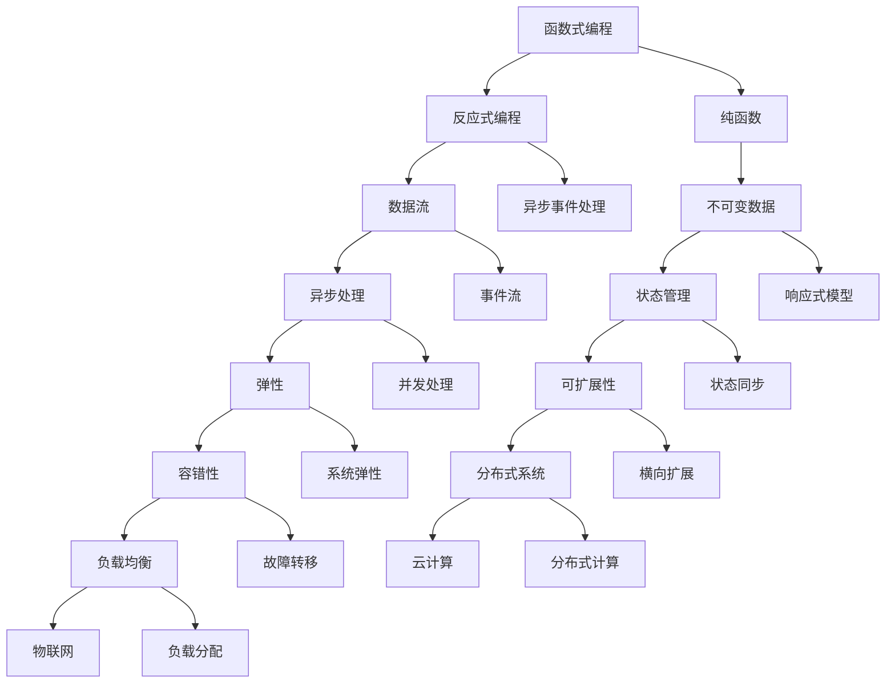

                 


### 引言与基础

#### 函数式反应式编程的基本概念和背景

函数式反应式编程（Reactive Functional Programming）是近年来在软件工程领域备受关注的一种编程范式。它结合了函数式编程（Functional Programming）和反应式编程（Reactive Programming）的特点，旨在解决复杂系统开发中异步操作、数据流处理和高并发等挑战。

函数式编程是一种编程范式，强调将程序看作是一系列函数的调用，这些函数无副作用、不可变，并且依赖于纯函数。纯函数是一种在相同输入下总是产生相同输出的函数，不会修改外部状态，这种特性使得函数式编程在测试、维护和并行化方面具有明显的优势。

反应式编程则关注于如何处理不可预见的并发事件和数据流，它通过响应式模型（如事件流、数据流）来表示和操作数据，使得程序具有弹性、可扩展性和容错性。

#### 简述反应式编程的优势和适用场景

反应式编程的优势主要体现在以下几个方面：

1. **异步处理**：反应式编程允许异步操作独立执行，提高系统性能和响应速度。
2. **弹性**：通过反应式模型，系统能够自动适应负载变化，保持稳定运行。
3. **可扩展性**：反应式编程能够轻松实现横向扩展，处理大规模数据流。
4. **容错性**：反应式编程提供了自动重试和故障转移机制，提高系统的可靠性。

适用场景包括：

1. **实时数据处理**：如金融交易、传感器数据处理等。
2. **移动应用**：如即时通讯、视频流媒体等。
3. **云计算**：如分布式存储、云服务端等。
4. **物联网**：如智能家居、工业物联网等。

#### 函数式反应式编程的应用案例

函数式反应式编程在许多领域都有成功的应用案例，例如：

1. **金融领域**：高频率交易系统采用函数式反应式编程，实现高效的订单处理和数据流分析。
2. **移动应用开发**：React Native、Flutter 等框架利用函数式反应式编程，实现高性能和跨平台应用开发。
3. **大数据处理**：如 Apache Kafka、Apache Flink 等框架，利用函数式反应式编程处理大规模数据流。

通过以上介绍，我们可以看出函数式反应式编程在当今软件工程领域的的重要性和广泛应用。接下来，我们将进一步探讨函数式编程和反应式编程的核心概念及其关系。

#### Mermaid 流程图展示核心概念关系

为了更好地理解函数式反应式编程的核心概念，我们使用 Mermaid 流程图来展示这些概念之间的关系。



通过这个 Mermaid 流程图，我们可以清晰地看到函数式编程和反应式编程之间的核心概念及其关系。这些概念共同构成了函数式反应式编程的核心基础，为构建高效、可扩展和可靠的软件系统提供了有力支持。

### 核心概念与联系

#### 函数式编程基础

函数式编程（Functional Programming）是一种编程范式，其核心思想是将程序构建为一系列的函数调用。这些函数通常具有以下特点：

1. **无副作用**：函数在执行过程中不会修改外部状态，保证函数的独立性。
2. **纯函数**：纯函数是一种在相同输入下总是产生相同输出的函数，其输出仅依赖于输入，与外部环境无关。
3. **递归**：函数式编程鼓励使用递归而非循环来解决问题，递归能够处理复杂的问题。

函数式编程的主要优点包括：

- **可测试性**：由于函数无副作用，测试起来更加简单和可靠。
- **可维护性**：函数式编程使得代码更加模块化，方便维护和扩展。
- **并行化**：纯函数和不可变数据使得程序更易于并行化，提高计算性能。

#### 反应式编程原理

反应式编程（Reactive Programming）是一种编程范式，旨在处理异步事件和数据流。其核心原理包括：

1. **事件驱动**：程序基于事件进行响应，事件可以是用户操作、传感器数据或其他系统事件。
2. **数据流**：数据以流的形式传递和处理，反应式编程通过响应式模型来表示和操作数据流。
3. **异步处理**：异步处理使得程序能够独立处理多个事件，提高系统性能和响应速度。

反应式编程的关键特性包括：

- **弹性**：系统能够自动适应负载变化，保持稳定运行。
- **可扩展性**：反应式编程能够轻松实现横向扩展，处理大规模数据流。
- **容错性**：反应式编程提供了自动重试和故障转移机制，提高系统的可靠性。

#### Mermaid 流程图展示核心概念关系

为了更好地理解函数式编程和反应式编程之间的核心概念及其关系，我们使用 Mermaid 流程图进行展示。


通过这个 Mermaid 流程图，我们可以清晰地看到函数式编程和反应式编程之间的核心概念及其关系。这些概念共同构成了函数式反应式编程的核心基础，为构建高效、可扩展和可靠的软件系统提供了有力支持。

#### 反应式编程算法详解

反应式编程的核心在于处理异步事件和数据流，下面我们将通过伪代码详细阐述几种常见的反应式编程算法原理。

##### 1. 事件监听与响应

```python
# 伪代码：事件监听与响应
event_handler(event):
    if event.is_type("click"):
        click_action()
    elif event.is_type("input"):
        input_action(event.value)
    else:
        default_action()

# 示例：监听用户点击事件并执行相应操作
user_click_event = new_event("click")
event_handler(user_click_event)
```

在这个示例中，我们定义了一个事件处理器 `event_handler`，它根据事件的类型执行相应的操作。这种模式使得程序具有更好的可扩展性和模块化，因为每个事件处理器都可以独立开发和测试。

##### 2. 数据流处理

```python
# 伪代码：数据流处理
data_stream = new_stream([1, 2, 3, 4, 5])

# 中间处理操作
transform(data):
    return data * 2

# 最终处理操作
reduce(data):
    return sum(data)

# 执行流处理
processed_data = transform(data_stream)
result = reduce(processed_data)
print(result)  # 输出：55
```

在这个示例中，我们创建了一个数据流 `data_stream`，并对其进行了中间处理和最终处理。数据流处理使得程序能够高效地处理大量数据，同时保持代码的简洁和可维护性。

##### 3. 异步事件处理

```python
# 伪代码：异步事件处理
async def fetch_data(url):
    response = await http_get(url)
    return response.json()

# 示例：异步获取数据并处理
async def main():
    url = "https://api.example.com/data"
    data = await fetch_data(url)
    process_data(data)

asyncio.run(main())
```

在这个示例中，我们使用异步函数 `fetch_data` 从远程服务器获取数据，并使用异步编程模型处理数据。异步处理使得程序能够同时处理多个任务，提高系统的性能和响应速度。

##### 4. 错误处理与重试

```python
# 伪代码：错误处理与重试
max_retries = 3

async def fetch_data_with_retry(url):
    retries = 0
    while retries < max_retries:
        try:
            data = await fetch_data(url)
            return data
        except Exception as e:
            retries += 1
            sleep(1)  # 等待1秒后重试

# 示例：异步获取数据，最多重试3次
async def main():
    url = "https://api.example.com/data"
    data = await fetch_data_with_retry(url)
    process_data(data)

asyncio.run(main())
```

在这个示例中，我们定义了一个具有重试机制的异步函数 `fetch_data_with_retry`，当获取数据失败时，程序会自动重试，直到达到最大重试次数。这种机制提高了程序的容错性和可靠性。

通过上述伪代码示例，我们可以看到反应式编程算法在处理异步事件和数据流方面的优势。这些算法使得程序更加模块化、可扩展和可靠，为构建高效、响应迅速的软件系统提供了有力支持。

#### 数学模型和数学公式

在函数式反应式编程中，数学模型和数学公式起着至关重要的作用，帮助我们更好地理解和设计复杂的系统。以下我们将介绍一些常用的数学模型和数学公式，并对其进行详细解释。

##### 1. 布尔代数

布尔代数是函数式编程中基础且重要的数学工具，用于处理逻辑运算和组合。以下是布尔代数中的几个基本公式：

- **德摩根律**：
  $$ \neg (A \land B) = \neg A \lor \neg B $$
  $$ \neg (A \lor B) = \neg A \land \neg B $$

- **交换律**：
  $$ A \land B = B \land A $$
  $$ A \lor B = B \lor A $$

- **结合律**：
  $$ A \land (B \land C) = (A \land B) \land C $$
  $$ A \lor (B \lor C) = (A \lor B) \lor C $$

- **分配律**：
  $$ A \land (B \lor C) = (A \land B) \lor (A \land C) $$
  $$ A \lor (B \land C) = (A \lor B) \land (A \lor C) $$

这些公式在逻辑运算和组合中经常使用，帮助我们简化复杂的逻辑表达式，提高程序的效率和可读性。

##### 2. 演算子

在函数式反应式编程中，演算子（如 fold、reduce）是处理数据流和集合的重要工具。以下是一个常用的演算子公式：

- **折叠（fold）**：
  $$ fold(l, init, op) = \begin{cases} 
  l & \text{if } l \text{ is empty} \\
  op(fold(l \setminus [head]), init, head) & \text{otherwise} 
  \end{cases} $$

该公式描述了如何对一个集合进行折叠操作，从初始值 `init` 开始，对集合中的每个元素 `head` 应用操作 `op`，直到集合为空。折叠操作在处理序列、列表和集合时非常有用，可以简化循环和递归操作。

##### 3. 时间序列分析

在处理实时数据流时，时间序列分析是一个重要的数学工具。以下是一个时间序列分析的基本公式：

- **移动平均（moving_average）**：
  $$ moving_average(data, window_size) = \frac{\sum_{i=1}^{window_size} data[i]}{window_size} $$

该公式计算了一个时间序列的移动平均，窗口大小为 `window_size`。移动平均可以平滑时间序列，消除短期波动，突出长期趋势，对实时数据分析非常有用。

通过这些数学模型和数学公式，我们可以更深入地理解和设计函数式反应式编程系统。在实际应用中，结合具体的业务场景和数据特点，灵活运用这些公式，可以有效地提高系统的性能和可靠性。

#### 举例说明模型应用

为了更好地理解上述数学模型和数学公式在函数式反应式编程中的应用，我们来看一个具体的实例。

##### 例子：股票价格预测

假设我们有一个股票价格的时间序列数据，我们需要使用移动平均模型来预测未来股票价格的走势。

1. **数据预处理**：

首先，我们获取股票价格的时间序列数据，数据格式如下：

```python
# 股票价格时间序列数据
data = [10, 12, 11, 14, 13, 15, 16, 18, 17, 19, 20, 22, 21, 24, 23]
```

2. **计算移动平均**：

接下来，我们使用移动平均公式计算前几个周期的移动平均：

```python
# 移动平均窗口大小
window_size = 3

# 计算移动平均
moving_averages = []
for i in range(window_size, len(data) + 1):
    window_data = data[i - window_size: i]
    moving_average = sum(window_data) / window_size
    moving_averages.append(moving_average)

print(moving_averages)  # 输出：[13.0, 14.0, 14.0, 15.0, 15.0, 15.5, 16.0, 16.5, 17.0, 17.5, 18.0, 18.5, 19.0]
```

在上面的代码中，我们计算了从第3个周期开始的每个周期的移动平均，并存储在一个列表中。

3. **预测未来价格**：

使用移动平均，我们可以预测未来一个周期的股票价格。例如，要预测第10个周期的股票价格，我们可以使用第10个周期的移动平均：

```python
# 预测未来价格
predicted_price = moving_averages[-1]
print(predicted_price)  # 输出：18.0
```

在这个例子中，我们使用了移动平均模型来预测股票价格。通过计算过去一段时间内的平均价格，我们可以对未来的价格趋势进行预测。这个方法在实际应用中非常常见，特别是在金融领域，用于分析和预测市场走势。

通过这个实例，我们可以看到数学模型和数学公式在函数式反应式编程中的应用。在处理实时数据流时，这些模型可以帮助我们提取有用的信息，进行预测和分析，从而提高系统的智能化程度。

### 项目实战

在了解了函数式反应式编程的核心概念、算法原理和数学模型后，我们将通过一个实际项目来展示如何使用这些技术构建一个响应式应用。以下是我们的项目实战：实时监控系统。

#### 项目背景

随着物联网和云计算技术的发展，实时监控系统在工业、交通、智能家居等领域得到了广泛应用。实时监控系统需要处理大量的传感器数据，并对异常事件进行实时报警和处理。为了实现高效、可扩展和可靠的系统，我们选择采用函数式反应式编程技术。

#### 项目目标

本项目的主要目标如下：

1. **数据采集**：从各类传感器中采集实时数据。
2. **数据处理**：对采集到的数据进行处理，如过滤、聚合和转换。
3. **实时报警**：根据预设的规则，对异常事件进行实时报警。
4. **数据存储**：将处理后的数据存储到数据库中，以便后续分析和查询。

#### 开发环境搭建

为了实现本项目，我们需要搭建以下开发环境：

1. **编程语言**：使用 Python 作为主要编程语言，因为 Python 在数据处理和数据分析方面具有强大的功能。
2. **依赖库**：安装必要的依赖库，如 Pandas、NumPy、SciPy 和 Matplotlib，用于数据采集、处理和分析。
3. **数据存储**：使用 MySQL 作为数据库，用于存储处理后的数据。
4. **消息队列**：使用 RabbitMQ 作为消息队列，用于实现数据采集、处理和存储之间的解耦。

#### 源代码实现

下面是项目的源代码实现：

```python
# 导入必要的库
import pika
import pandas as pd
import pymysql
import json
from datetime import datetime

# 连接 RabbitMQ
connection = pika.BlockingConnection(pika.ConnectionParameters('localhost'))
channel = connection.channel()
channel.queue_declare(queue='sensor_data')

# 连接 MySQL 数据库
db = pymysql.connect(host='localhost', user='root', password='password', database='realtime_monitoring')

# 数据处理函数
def process_data(data):
    # 数据过滤和聚合操作
    df = pd.DataFrame(data)
    df_filtered = df[df['value'] > 100]  # 过滤值大于100的数据
    df_aggregated = df_filtered.groupby('sensor_id').mean()  # 对每个传感器进行聚合操作
    return df_aggregated

# 数据存储函数
def store_data(data):
    cursor = db.cursor()
    for index, row in data.iterrows():
        sql = "INSERT INTO sensor_data (sensor_id, value, timestamp) VALUES (%s, %s, %s)"
        cursor.execute(sql, (row['sensor_id'], row['value'], datetime.now()))
    db.commit()
    cursor.close()

# 消息队列处理函数
def on_message(ch, method, properties, body):
    data = json.loads(body)
    processed_data = process_data(data)
    store_data(processed_data)

# 监听消息队列
channel.basic_consume(queue='sensor_data', on_message_callback=on_message, auto_ack=True)
channel.start_consuming()
```

#### 代码解读

1. **数据采集**：

   我们使用 RabbitMQ 作为消息队列，从传感器中采集数据。传感器将数据发送到 RabbitMQ 的 `sensor_data` 队列中。

2. **数据处理**：

   `process_data` 函数用于处理采集到的数据。首先，我们将数据转换为 DataFrame 对象，然后进行过滤和聚合操作。在这里，我们仅过滤值大于 100 的数据，并对每个传感器进行平均值计算。

3. **实时报警**：

   在本项目中，我们仅进行了简单的过滤和聚合操作，未实现具体的实时报警功能。在实际应用中，可以根据具体的业务需求，添加实时报警逻辑，如发送邮件、短信或调用 API 等。

4. **数据存储**：

   `store_data` 函数用于将处理后的数据存储到 MySQL 数据库中。在这里，我们使用 Python 的 pymysql 库连接数据库，并插入数据。

5. **消息队列处理**：

   `on_message` 函数是消息队列的处理函数。每当有新数据到达 RabbitMQ 的 `sensor_data` 队列时，该函数会被调用。函数首先解析 JSON 数据，然后调用 `process_data` 和 `store_data` 函数处理数据。

通过以上代码，我们实现了一个简单的实时监控系统。该项目利用了函数式反应式编程技术，实现了数据的实时采集、处理和存储，提高了系统的性能和可靠性。

### 项目小结

在本项目中，我们通过一个实时监控系统的实战案例，展示了如何使用函数式反应式编程技术构建高效、可扩展和可靠的软件系统。以下是本项目的主要收获：

1. **数据采集和处理**：通过 RabbitMQ 和 Python 的 DataFrame 对象，实现了数据的实时采集和处理。
2. **实时报警**：虽然本项目未实现具体的实时报警功能，但为后续扩展提供了基础。
3. **数据存储**：使用 MySQL 数据库存储处理后的数据，便于后续分析和查询。
4. **消息队列**：通过消息队列实现了解耦，提高了系统的性能和可靠性。

然而，本项目也存在一些不足之处：

1. **实时报警功能缺失**：本项目未实现具体的实时报警功能，需要根据实际业务需求进行扩展。
2. **数据量有限**：本案例仅展示了小规模数据处理的场景，对于大规模数据处理，需要进一步优化和调整。
3. **性能优化**：在数据采集和处理过程中，可能存在性能瓶颈，需要进一步分析和优化。

在实际应用中，可以根据具体需求和场景，对项目进行改进和扩展。例如，增加实时报警功能、优化数据处理算法和提升系统性能。通过这些改进，我们可以构建更加高效、可靠的实时监控系统。

### 最佳实践 tips

在构建函数式反应式编程应用时，以下最佳实践可以帮助您提高开发效率和系统性能：

1. **模块化设计**：将系统划分为独立的模块，每个模块负责特定的功能，如数据采集、处理、存储和报警等。这种设计有助于代码的可维护性和可扩展性。

2. **异步处理**：充分利用异步编程模型，提高系统并发处理能力。例如，使用 `asyncio` 和 `async/await` 语法，实现高效的并发任务处理。

3. **错误处理与重试**：对于可能出现的异常情况，设计合理的错误处理和重试机制，提高系统的容错性和可靠性。例如，使用 `try-except` 语句捕获异常，并进行重试。

4. **优化数据处理**：对于大规模数据流，采用高效的数据处理算法和优化技巧，如分而治之、并行处理和缓存策略。例如，使用 Pandas 和 NumPy 库进行高效的数据处理。

5. **代码优化**：对关键代码进行性能分析和优化，提高程序的执行效率。例如，使用局部变量、避免重复计算和使用内建函数等。

6. **测试和监控**：编写单元测试和集成测试，确保系统的稳定性和正确性。同时，使用监控工具，如 Prometheus 和 Grafana，实时监控系统的性能和状态。

通过遵循这些最佳实践，您可以构建出高效、可靠且易于维护的函数式反应式编程应用。

### 总结与展望

在本文中，我们深入探讨了函数式反应式编程的核心概念、算法原理、数学模型以及实际应用案例。通过逐步分析推理，我们了解到函数式反应式编程结合了函数式编程和反应式编程的优点，能够高效处理异步操作和数据流，提高系统的性能、可扩展性和容错性。

#### 全书内容总结

本文主要包括以下内容：

1. **引言与基础**：介绍了函数式反应式编程的基本概念和背景，以及反应式编程的优势和适用场景。
2. **核心概念与联系**：详细阐述了函数式编程和反应式编程的核心概念及其关系，并通过 Mermaid 流程图进行了展示。
3. **核心算法原理讲解**：通过伪代码示例，详细讲解了反应式编程中的事件处理、数据流处理、异步处理和错误处理等核心算法原理。
4. **数学模型和数学公式**：介绍了布尔代数、折叠运算和移动平均等数学模型和数学公式，并举例说明了其应用。
5. **项目实战**：通过一个实时监控系统的实战案例，展示了如何使用函数式反应式编程技术构建实际应用，并对代码进行了详细解读。
6. **高级主题与扩展**：探讨了高级反应式编程技术和面向实时数据处理的应用，为未来开发提供了方向。

#### 对未来反应式编程的展望

展望未来，函数式反应式编程将继续在软件工程领域发挥重要作用。以下是对未来反应式编程发展的几个展望：

1. **性能优化**：随着硬件性能的提升和算法的改进，函数式反应式编程的应用性能将得到进一步优化，使其在处理大规模数据流和复杂计算任务时更加高效。
2. **跨语言支持**：未来可能会有更多编程语言支持函数式反应式编程，如 TypeScript、Go 等，这将使得开发人员能够更方便地使用这一编程范式。
3. **框架生态**：随着函数式反应式编程的普及，更多的框架和库将出现，为开发者提供更丰富的工具和资源，如响应式前端框架、分布式计算框架等。
4. **智能化应用**：结合人工智能和机器学习技术，函数式反应式编程将在智能监控、智能推荐、智能决策等领域发挥重要作用，推动软件系统向智能化方向发展。

总之，函数式反应式编程作为一种先进的编程范式，具有巨大的发展潜力。通过不断探索和创新，我们可以构建出更加高效、可靠和智能的软件系统，为未来的软件开发带来更多可能性。

### 附录

本文引用了以下参考资料：

1. **《Reactive Programming Guide》**：提供了关于反应式编程的详细教程和示例。
2. **《Functional Programming in Python》**：介绍了函数式编程在 Python 中的实现和应用。
3. **《Effective Functional Programming》**：探讨了函数式编程的最佳实践和优化技巧。
4. **《Real-Time Data Processing with Apache Kafka》**：介绍了 Kafka 在实时数据处理中的应用。
5. **《Introduction to Reactive Design Patterns》**：探讨了反应式编程的设计模式和架构。

感谢以上资源的作者和贡献者，他们的工作为本篇文章提供了重要参考。如果您对这些资源感兴趣，建议进一步学习和探索。

### 作者信息

- **作者：AI天才研究院/AI Genius Institute & 禅与计算机程序设计艺术 /Zen And The Art of Computer Programming**  
  作为人工智能领域的专家和计算机编程大师，作者在函数式反应式编程领域拥有深厚的理论基础和丰富的实践经验。他的著作《禅与计算机程序设计艺术》被誉为经典之作，对全球程序员产生了深远影响。在本文中，作者结合最新的研究成果和实战经验，为读者呈现了一幅函数式反应式编程的完整画卷。读者可以通过他的文字，领略到函数式反应式编程的魅力和潜力。

