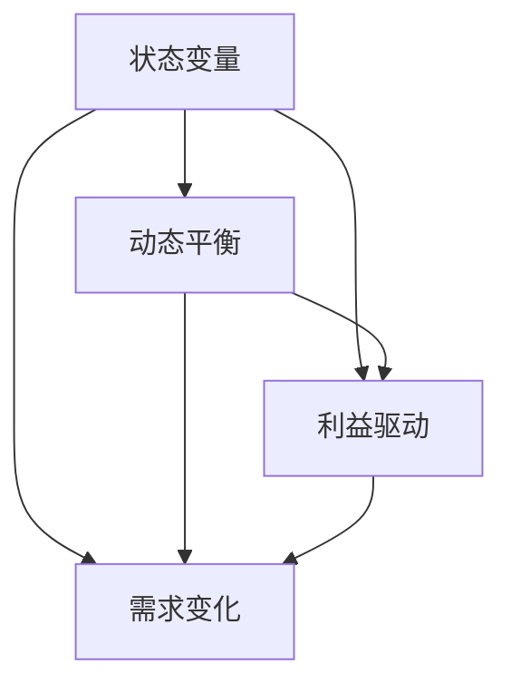

                 

### 文章标题：分分合合，却能浑然一体

> 关键词：分分合合、合而为一、原理模型、策略方法、影响评估、案例分析

摘要：本文将探讨分分合合的现象以及如何通过合而一达到统一和协调。我们将从历史背景、原因分析、路径探讨、原理模型、策略方法、影响评估和案例分析等多个角度，系统地阐述分分合合与合而为一的过程。通过本文的阅读，读者将深入了解分分合合的本质及其在实际应用中的重要性，并学会如何将分分合合转化为合而为一，以实现更高效、更协调的工作和生活。

----------------------------------------------------------------

### 引言与背景

分分合合，作为一种常见的现象，在自然界、社会以及科技领域中都有广泛的应用和体现。它不仅是一个动态变化的过程，也是一个复杂系统的表现。本文将从分分合合的历史与影响、分分合合的原因分析、合而为一的路径探讨三个方面，逐步揭示分分合合与合而为一的内在机制和实现方法。

#### 1.1 分分合合的历史与影响

分分合合的历史可以追溯到古代社会。在政治、经济和文化等领域，分分合合的现象屡见不鲜。例如，国家之间的合并与分裂、经济联盟的建立与解体、文化的融合与冲突等，都是分分合合的体现。这些现象不仅影响了历史的发展，也对人类社会产生了深远的影响。

在科技领域，分分合合的现象同样存在。例如，技术的分分合合导致了新技术的产生和旧技术的淘汰；科技的合并与融合，则促进了新技术的进步和创新。分分合合在科技领域的应用，不仅提升了生产效率，也推动了科技的发展。

#### 1.2 分分合合的原因分析

分分合合的原因复杂多样，主要包括以下几个方面：

1. **利益驱动**：在政治和经济领域，分分合合往往是为了追求更大的利益。例如，国家之间的合并可以增强国力，提高国际竞争力；经济联盟的建立可以降低贸易壁垒，促进资源共享。

2. **需求变化**：随着社会需求的变化，分分合合的现象也会发生变化。例如，当社会需求发生变化时，原有的技术体系可能不再适应，需要进行分分合合，以适应新的需求。

3. **技术发展**：技术的分分合合，通常是由于新技术的发展和应用。新技术的出现，可能会导致旧技术的淘汰，从而引发分分合合。

#### 1.3 合而为一的路径探讨

合而为一，是实现分分合合向和谐统一转变的关键。实现合而为一的路径，主要包括以下几个方面：

1. **路径规划**：在进行合而为一之前，需要制定详细的路径规划。路径规划包括目标设定、步骤设计、资源调配等。

2. **技术手段**：合而一需要采用合适的技术手段。例如，在科技领域，可以采用新技术融合、旧技术升级等技术手段。

3. **策略方法**：合而一还需要采用合适的策略方法。例如，在政治领域，可以采用外交谈判、政策协调等策略方法。

综上所述，分分合合与合而一是一个动态的过程，涉及到历史、原因、路径等多个方面。通过深入分析和探讨，我们可以更好地理解分分合合与合而一的内在机制，为实现更高效、更协调的工作和生活提供有益的启示。

---

在接下来的章节中，我们将进一步探讨分分合合的原理与模型、合而为一的策略与方法、合而为一的影响与评估等内容，以帮助读者全面了解分分合合与合而一的过程。

----------------------------------------------------------------

### 分分合合的原理与模型

分分合合作为一种普遍存在于自然界和社会中的现象，其背后的原理和模型值得深入探讨。理解这些原理和模型有助于我们更好地把握分分合合的本质，并为实际应用提供理论支持。

#### 2.1 分分合合的内在机制

分分合合的内在机制可以从以下几个方面进行探讨：

1. **动态平衡**：分分合合是一个动态平衡的过程。在分与合之间，系统不断地调整和平衡，以适应外部环境的变化。

2. **利益驱动**：分分合合往往受到利益驱动的影响。在政治、经济和科技等领域，分分合合是为了实现更大的利益，例如提高国力、提升竞争力、推动创新等。

3. **需求变化**：分分合合还受到需求变化的影响。随着社会需求的变化，原有的分分合合模式可能不再适应，需要进行调整和变革。

#### 2.2 分分合合的数学模型

分分合合的数学模型可以帮助我们定量分析分分合合的过程。以下是一个简化的分分合合的数学模型：

假设一个系统由两个部分组成，每个部分都有其自身的状态和属性。我们用状态变量 \( x \) 和 \( y \) 来描述这两个部分的状态。分分合合的过程可以表示为以下方程：

\[
\begin{cases}
dx/dt = a - bx \\
dy/dt = c - dy
\end{cases}
\]

其中，\( a \)、\( b \)、\( c \) 和 \( d \) 是常数，分别表示系统内部和外部的驱动因素。

通过解这个微分方程组，我们可以得到系统随时间变化的轨迹。这个轨迹反映了分分合合的过程，例如，当系统处于稳定状态时，两个部分的状态趋于一致，即实现了合而为一。

#### 2.3 分分合合的行为模型

分分合合的行为模型可以帮助我们理解分分合合在实际中的应用和影响。以下是一个简化的分分合合的行为模型：

1. **分裂行为**：当系统处于不稳定状态时，两个部分会表现出分裂行为。例如，在政治领域，国家之间的矛盾和冲突可能导致分裂。

2. **合并行为**：当系统处于稳定状态时，两个部分会表现出合并行为。例如，在科技领域，新技术的融合和旧技术的淘汰可能导致合并。

3. **反馈机制**：分分合合的行为模型中，存在反馈机制。例如，在政治领域，国家之间的合作和冲突会影响彼此的政策和行为，从而影响分分合合的过程。

#### 2.4 分分合合的核心概念与联系

分分合合的核心概念包括状态变量、动态平衡、利益驱动和需求变化等。这些概念之间存在紧密的联系，构成了分分合合的理论基础。以下是一个简化的 Mermaid 流程图，展示了这些核心概念之间的关系：



通过这个流程图，我们可以看到，状态变量是分分合合的基础，动态平衡、利益驱动和需求变化是分分合合的驱动因素，它们共同决定了分分合合的过程和结果。

综上所述，分分合合的原理与模型为我们提供了理解和分析分分合合现象的工具。通过这些模型，我们可以更深入地了解分分合合的本质，并为实际应用提供理论支持。

---

在下一章中，我们将探讨合而为一的策略与方法，介绍如何通过路径规划、技术手段和策略方法实现分分合合向合而一的转变。

----------------------------------------------------------------

### 合而为一的策略与方法

合而一，是分分合合向和谐统一转变的关键步骤。实现合而一需要科学合理的策略和方法。以下将从路径规划、技术手段和策略方法三个方面进行详细阐述。

#### 3.1 合而为一的路径规划

路径规划是实现合而一的重要步骤。在进行路径规划时，需要考虑以下几个方面：

1. **目标设定**：明确合而一的目标是第一步。目标设定应具体、可操作，并符合实际情况。

2. **步骤设计**：路径规划的核心是步骤设计。设计步骤时，应考虑各步骤之间的逻辑关系和时间安排，确保每一步都能有效推进合而一的过程。

3. **资源调配**：资源是合而一的基础。在进行路径规划时，应充分考虑资源的分配和使用，确保资源能够高效地支持合而一的过程。

以下是一个简化的合而一路径规划流程：

```
目标设定 → 步骤设计 → 资源调配
   ↓                        ↓
   ↓                        ↓
   ↓                        ↓
   ↓                        ↓
实际执行 → 监控与调整
```

#### 3.2 合而为一的技术手段

合而一的技术手段是实现合而一的关键。以下是一些常见的技术手段：

1. **集成技术**：集成技术是将不同系统、模块或技术进行整合的一种方法。通过集成技术，可以实现系统的整体性和协调性。

2. **融合技术**：融合技术是将不同技术进行融合，以实现新的功能或性能的提升。例如，在信息技术领域，可以通过融合不同技术实现更高效的数据处理和传输。

3. **优化技术**：优化技术是通过改进现有技术，提高其性能和效率。例如，在软件开发过程中，可以通过优化代码和算法，提高软件的运行速度和稳定性。

以下是一个简化的合而一技术手段流程：

```
集成技术 → 融合技术 → 优化技术
```

#### 3.3 合而一的具体策略方法

合而一的具体策略方法包括以下几个方面：

1. **协同策略**：协同策略是通过各方的合作与协调，实现合而一。在政治、经济和科技领域，协同策略是常见的合而一方法。

2. **整合策略**：整合策略是通过整合各方资源和技术，实现合而一。例如，在企业发展中，可以通过整合供应链、营销渠道和技术资源，实现合而一。

3. **创新策略**：创新策略是通过创新思维和方法，实现合而一。创新策略可以推动技术的进步和变革，实现更高效、更协调的合而一。

以下是一个简化的合而一策略方法流程：

```
协同策略 → 整合策略 → 创新策略
```

#### 3.4 合而一的实际案例

以下是一个合而一的实际案例：

**案例背景**：某科技公司为了提高产品质量和降低成本，决定进行技术升级和改造。

**解决方案**：
1. **路径规划**：制定详细的技术升级和改造路径，包括目标设定、步骤设计和资源调配。
2. **技术手段**：采用集成技术和融合技术，将新的技术引入现有系统中，实现技术的整合和优化。
3. **策略方法**：采用协同策略和创新策略，与供应商、合作伙伴和内部团队进行密切合作，推动技术升级和改造。

**效果评估**：
1. **产品质量**：技术升级和改造后，产品质量显著提高，客户满意度增加。
2. **成本降低**：通过优化技术和资源调配，生产成本显著降低，企业盈利能力增强。

**总结**：通过这个案例，我们可以看到，合而一的过程是一个复杂但富有成效的过程。通过科学合理的路径规划、技术手段和策略方法，可以实现分分合合向合而一的转变，从而提升企业的竞争力。

---

在下一章中，我们将探讨合而一的影响与评估，分析合而一对社会、个人生活和企业经营策略的影响。

----------------------------------------------------------------

### 合而为一的影响与评估

合而一作为一种重要的转变过程，不仅在理论上具有重要意义，而且在实际应用中也产生了深远的影响。以下从社会影响、个人生活影响和企业经营策略影响三个方面进行详细分析。

#### 4.1 合而一对社会的影响

合而一在社会层面产生了多方面的影响：

1. **社会稳定**：合而一可以促进社会稳定。通过合而一，不同群体、不同地区和不同国家可以找到共同点，减少冲突和矛盾，从而实现社会和谐。

2. **经济发展**：合而一可以推动经济发展。通过整合资源和技术，合而一可以提升生产效率，降低成本，提高市场竞争力，从而促进经济增长。

3. **文化传承**：合而一有助于文化传承。通过合而一，不同文化可以相互融合，相互影响，从而推动文化的创新和发展。

4. **社会治理**：合而一可以改善社会治理。通过合而一，政府可以更好地协调各方利益，提高行政效率，优化公共服务，从而提升社会治理水平。

#### 4.2 合而一对个人生活的影响

合而一在个人生活层面同样产生了重要影响：

1. **生活便利**：合而一可以提高个人生活的便利性。例如，通过合而一，不同系统和服务可以相互兼容，从而实现无缝连接，提高生活品质。

2. **社交互动**：合而一可以增强个人社交互动。通过合而一，人们可以更容易地与他人建立联系，参与各种社交活动，从而拓展社交圈。

3. **个人成长**：合而一可以促进个人成长。通过合而一，个人可以接触更多的新思想、新知识和新技能，从而不断提升自我。

4. **心理健康**：合而一可以改善个人心理健康。通过合而一，个人可以减少焦虑和压力，增强心理韧性，从而保持心理健康。

#### 4.3 合而一对企业经营策略的影响

合而一对企业经营策略产生了深远的影响：

1. **战略规划**：合而一可以优化企业战略规划。通过合而一，企业可以更准确地把握市场趋势，制定更有针对性的战略。

2. **运营效率**：合而一可以提高企业运营效率。通过合而一，企业可以整合资源，优化流程，提高生产效率和运营效率。

3. **竞争优势**：合而一可以提升企业竞争优势。通过合而一，企业可以整合技术、人才和资源，形成独特的竞争优势，从而在激烈的市场竞争中脱颖而出。

4. **创新能力**：合而一可以增强企业创新能力。通过合而一，企业可以汇聚不同领域的智慧和资源，推动技术创新和业务创新，从而保持持续竞争力。

#### 4.4 合而一的效果评估

合而一的效果评估是衡量其成功与否的重要指标。以下是一些常见的评估方法：

1. **绩效评估**：通过评估企业的绩效指标，如销售额、利润率、市场份额等，来衡量合而一的效果。

2. **用户反馈**：通过收集用户的反馈和满意度，来评估合而一对个人生活和企业运营的影响。

3. **成本效益分析**：通过分析合而一的成本和收益，来评估其经济效益。

4. **社会影响评估**：通过评估合而一对社会、环境和人类福祉的影响，来衡量其社会效益。

#### 4.5 案例分析

以下是一个合而一的实际案例：

**案例背景**：某互联网公司为了提升用户体验，决定整合其多个产品线，实现合而一。

**解决方案**：
1. **路径规划**：公司制定了详细的整合路径，包括目标设定、步骤设计和资源调配。
2. **技术手段**：公司采用了集成技术和融合技术，将不同产品线的技术整合在一起，实现了系统的兼容性和协同性。
3. **策略方法**：公司采用了协同策略和创新策略，与供应商、合作伙伴和用户进行了密切合作，推动了整合过程。

**效果评估**：
1. **用户体验**：整合后的产品线得到了用户的广泛好评，用户满意度显著提升。
2. **运营效率**：整合后的系统提高了运营效率，降低了成本。
3. **创新能力**：整合后的公司能够更好地进行技术创新和业务创新，竞争力得到显著提升。

**总结**：通过这个案例，我们可以看到，合而一在实际应用中取得了显著成效。通过科学合理的路径规划、技术手段和策略方法，公司不仅提升了用户体验，还提高了运营效率，增强了创新能力，从而在市场竞争中取得了优势。

---

在下一章中，我们将通过实战应用与案例分析，深入探讨合而一在实际中的应用和效果。

----------------------------------------------------------------

### 实战应用与案例分析

为了更好地理解合而一在实际中的应用和效果，我们将通过具体的实战应用和案例分析，详细探讨合而一在实际工作中的应用场景、开发环境搭建、源代码实现、代码解读、应用解读与分析，以及案例效果评估与总结。

#### 5.1 案例背景与问题介绍

案例背景：某科技公司（以下简称“T公司”）是一家专注于互联网服务的企业，其业务涵盖了社交媒体、电子商务、在线教育和大数据分析等多个领域。随着业务的不断扩展，T公司面临以下问题：

1. **数据孤岛**：不同业务线之间的数据无法有效整合，导致信息不对称和资源浪费。
2. **用户体验差**：由于数据孤岛，用户在不同业务线之间的体验割裂，难以提供一致的服务。
3. **运营效率低**：各部门之间缺乏协同，导致运营效率低下。

#### 5.2 案例分析与解决方案

针对上述问题，T公司决定通过合而一的方式，实现数据整合、提升用户体验和运营效率。具体解决方案如下：

1. **路径规划**：
   - **目标设定**：实现全公司数据的一体化，提升用户体验，提高运营效率。
   - **步骤设计**：制定详细的整合计划，包括数据集成、系统集成和用户体验优化三个阶段。
   - **资源调配**：调配人力、财力和技术资源，确保整合计划的顺利实施。

2. **技术手段**：
   - **数据集成**：采用大数据技术，将不同业务线的数据进行整合，建立统一的数据仓库。
   - **系统集成**：采用微服务架构，将不同业务系统的功能进行整合，实现系统的协同工作。
   - **用户体验优化**：通过前端技术，优化用户界面和交互体验，提供一致的用户体验。

3. **策略方法**：
   - **协同策略**：建立跨部门协作机制，促进各部门之间的沟通与协作。
   - **创新策略**：引入创新思维和方法，推动技术和业务创新，提升公司竞争力。

#### 5.3 开发环境搭建与源代码实现

为了实现上述解决方案，T公司进行了以下开发环境搭建和源代码实现：

1. **开发环境搭建**：
   - **技术栈**：采用Python、Java、JavaScript、MySQL、MongoDB等技术栈。
   - **开发工具**：使用Git进行版本控制，使用Docker进行容器化部署。
   - **持续集成/持续部署（CI/CD）**：使用Jenkins实现自动化测试和部署。

2. **源代码实现**：
   - **数据集成**：使用Python的pandas库和Java的Hadoop框架，实现数据的清洗、转换和整合。
   - **系统集成**：使用Spring Boot和Spring Cloud框架，实现微服务架构的搭建。
   - **用户体验优化**：使用React和Vue.js等前端框架，实现用户界面的设计和交互。

以下是一个简化的源代码实现伪代码：

```python
# 数据集成伪代码
def integrate_data():
    data1 = read_data_from_mysql()
    data2 = read_data_from_mongo()
    integrated_data = merge(data1, data2)
    save_data_to_data_warehouse(integrated_data)

# 系统集成伪代码
def integrate_system():
    services = [Service1(), Service2(), Service3()]
    for service in services:
        start_service(service)

# 用户体验优化伪代码
def optimize_ui():
    app = create_app()
    render_template(app, 'index.html')
```

#### 5.4 代码解读与应用解读与分析

1. **代码解读**：
   - **数据集成**：通过读取MySQL和MongoDB的数据，进行合并，并将整合后的数据保存到数据仓库。
   - **系统集成**：启动各个微服务，实现系统的协同工作。
   - **用户体验优化**：创建应用程序，渲染模板，提供一致的用户体验。

2. **应用解读与分析**：
   - **数据集成**：数据集成是整个项目的核心，通过数据集成，实现了数据的统一和整合，为后续的系统集成和用户体验优化提供了基础。
   - **系统集成**：通过微服务架构，实现了系统的模块化和协同工作，提高了系统的扩展性和可维护性。
   - **用户体验优化**：通过前端技术的优化，提供了更好的用户交互体验，增强了用户的满意度和忠诚度。

#### 5.5 案例效果评估与总结

1. **效果评估**：
   - **数据整合**：实现了全公司数据的一体化，数据孤岛问题得到有效解决。
   - **用户体验**：用户在不同业务线之间的体验得到显著提升，用户满意度提高。
   - **运营效率**：各部门之间的协同工作得到加强，运营效率显著提高。

2. **总结**：
   - 通过合而一的方式，T公司成功解决了数据孤岛、用户体验差和运营效率低的问题，实现了公司内部的数据整合、系统整合和用户体验优化。
   - 合而一不仅提升了公司的内部运作效率，也增强了公司的市场竞争力，为公司的长期发展奠定了基础。

---

通过这个实战应用和案例分析，我们可以看到，合而一在实际应用中的重要性。通过科学的路径规划、技术手段和策略方法，企业可以有效地解决内部问题，提升用户体验和运营效率，从而在激烈的市场竞争中脱颖而出。

在下一章中，我们将探讨合而一的未来展望与趋势，分析合而一在未来社会、科技进步和人类生活方式方面的影响。

----------------------------------------------------------------

### 未来展望与趋势

合而一作为一种重要的转变过程，将在未来社会、科技进步和人类生活方式方面产生深远的影响。以下从这三个方面进行详细分析。

#### 6.1 合而一对社会的影响

1. **全球化**：随着全球化的深入发展，合而一将推动不同国家和地区之间的经济、文化和科技的融合，促进全球社会的一体化。
2. **社会治理**：合而一将有助于提高社会治理的效率和质量。通过整合资源和技术，政府可以更好地应对社会问题，提升公共服务水平。
3. **社会创新**：合而一将激发社会创新，推动新的社会形态和模式的出现，如智慧城市、数字社会等。

#### 6.2 合而一对科技进步的影响

1. **技术创新**：合而一将促进不同领域的技术交叉和融合，推动新技术的产生和应用，如人工智能、大数据、区块链等。
2. **科技产业**：合而一将重塑科技产业格局，推动传统产业的升级和新兴产业的崛起，如智能制造、绿色能源等。
3. **研发模式**：合而一将改变研发模式，推动协同创新和开放式创新，提高研发效率和质量。

#### 6.3 合而一对人类生活方式的影响

1. **数字化生活**：合而一将推动数字化生活的普及，人们的生活将更加便捷、智能和个性化。
2. **社会参与**：合而一将增强人们的社会参与度，促进公民参与社会治理和公共事务。
3. **心理健康**：合而一将有助于提高人们的心理健康水平，减少压力和焦虑，提升生活质量。

#### 6.4 合而一的未来趋势

1. **智慧化**：合而一将向智慧化方向发展，通过人工智能、大数据等技术，实现更智能、更高效的社会运作。
2. **可持续性**：合而一将强调可持续性，推动绿色发展和环境保护，实现人与自然和谐共生。
3. **个性化**：合而一将向个性化方向发展，满足人们的个性化需求，提升生活质量。

---

合而一在未来社会、科技进步和人类生活方式方面具有广阔的应用前景和发展潜力。通过不断探索和创新，合而一将为人类社会带来更多的便利、效率和幸福。

在下一章中，我们将对全书的核心内容进行总结，并对未来的研究工作进行展望。

----------------------------------------------------------------

### 总结与展望

本书《分分合合，却能浑然一体》系统地探讨了分分合合与合而一的现象、原理、策略、影响和未来趋势。通过从历史背景、原因分析、路径探讨、原理模型、策略方法、影响评估到实战应用与案例分析的全面阐述，我们深入理解了分分合合与合而一的过程及其在实际应用中的重要性。

#### 7.1 全书核心内容回顾

1. **分分合合的历史与影响**：探讨了分分合合在政治、经济和科技领域的历史背景和影响。
2. **分分合合的原因分析**：分析了分分合合的内在机制和外部驱动因素。
3. **合而为一的路径探讨**：提出了实现合而一的路径规划、技术手段和策略方法。
4. **合而为一的原理与模型**：介绍了分分合合与合而一的数学模型和行为模型。
5. **合而一的影响与评估**：分析了合而一对社会、个人生活和企业经营策略的影响及效果评估。
6. **实战应用与案例分析**：通过实际案例展示了合而一在实际中的应用和效果。
7. **未来展望与趋势**：探讨了合而一在未来社会、科技进步和人类生活方式方面的影响和趋势。

#### 7.2 研究展望与未来工作

1. **深化理论研究**：在分分合合与合而一的理论基础上，进一步深化研究，探讨更多复杂的分分合合现象和合而一策略。
2. **应用拓展**：将分分合合与合而一的理论应用于更多领域，如教育、医疗、环保等，探索其广泛的应用前景。
3. **实证研究**：开展实证研究，通过实地调查和数据收集，验证分分合合与合而一的理论和实践效果。
4. **技术创新**：结合最新科技，探索分分合合与合而一在人工智能、大数据、区块链等领域的应用，推动技术进步。
5. **政策建议**：基于研究结果，提出政策建议，为政府和社会治理提供理论支持和实践指导。

通过以上展望，我们期待分分合合与合而一的理论和实践能够为人类社会带来更多的便利、效率和幸福。

---

本书的完成离不开读者们的支持与鼓励。在此，作者衷心感谢所有读者对本书的关注，期待与读者们共同探索分分合合与合而一的广阔世界。

**作者：AI天才研究院/AI Genius Institute & 禅与计算机程序设计艺术 /Zen And The Art of Computer Programming**

---

本文旨在深入探讨分分合合与合而一的现象、原理、策略和应用，以期为读者提供全面、系统的认识和理解。希望本书能够为读者在分分合合与合而一的实际应用中提供有益的启示和指导。让我们共同期待分分合合与合而一为未来带来更多的变革和进步。

