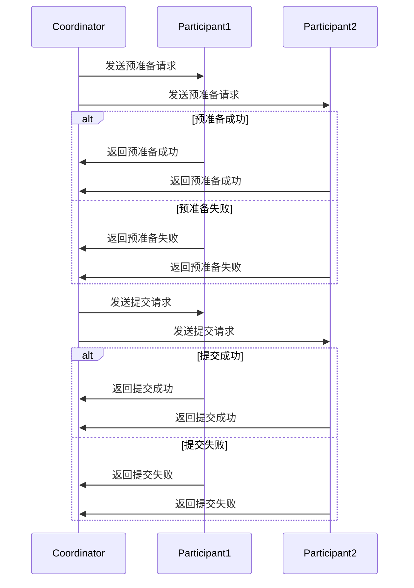

                 

### 文章标题

《分布式事务解决方案对比》

### 关键词

分布式事务、两阶段提交、三阶段提交、最终一致性、分布式锁、性能优化、实战案例

### 摘要

本文旨在对比分析分布式事务的多种解决方案，包括两阶段提交、三阶段提交、最终一致性解决方案和分布式锁机制。通过深入讲解每种方案的工作原理、优势与不足，以及实际案例的应用，为读者提供全面、系统的分布式事务解决方案指南。文章还包括性能优化策略和未来发展趋势的探讨，旨在帮助开发者更好地理解和应对分布式事务带来的挑战。

## 引言

### 1.1 分布式事务的基本概念

分布式事务是指涉及多个分布式系统中的数据操作，这些操作需要作为一个整体被执行或被撤销，以保证数据的一致性。与传统的单机事务不同，分布式事务要面对网络延迟、系统故障、数据分区等问题，这使得其设计和实现变得更加复杂和具有挑战性。

### 1.2 分布式事务与传统事务的区别

传统事务通常在单一数据库系统中执行，数据的一致性可以通过单点控制来实现。而分布式事务则需要跨多个数据库、数据库实例或服务进行操作，数据的一致性需要通过复杂的协议和算法来保证。具体区别如下：

- **数据一致性保证**：传统事务依赖于单点控制，通常使用锁机制来保证一致性。分布式事务则需要解决数据一致性问题，可能涉及多种一致性模型，如强一致性、最终一致性等。
- **故障处理**：传统事务的故障处理相对简单，通常只需要重启数据库即可。分布式事务则需要考虑网络分区、系统故障等问题，可能需要复杂的容错机制和恢复策略。
- **性能和扩展性**：传统事务的性能和扩展性受限于单机资源。分布式事务可以通过水平扩展来提高性能和可扩展性，但这也带来了复杂性和一致性挑战。

### 1.3 分布式事务的需求与挑战

分布式事务的需求源于现代应用的分布式架构。随着互联网和云计算的发展，越来越多的企业采用分布式系统来提高系统的可用性、性能和可扩展性。分布式事务的需求主要包括：

- **数据一致性**：在分布式系统中，多个服务之间需要进行协同操作，以保证数据的完整性。
- **跨服务事务**：许多业务流程涉及多个服务，如订单处理、库存管理、支付等，这些操作需要作为一个整体进行。
- **高可用性**：分布式系统通常具有较高的可用性，但这也增加了事务处理的复杂性。

分布式事务面临的挑战包括：

- **数据一致性问题**：如何保证跨多个服务或数据库的数据一致性是一个重要挑战，特别是在网络延迟和系统故障的情况下。
- **性能瓶颈**：分布式事务通常需要跨多个节点进行操作，这可能导致性能瓶颈。
- **故障处理**：分布式系统的故障处理更加复杂，可能涉及多节点的故障转移和恢复。

在下一章中，我们将深入探讨分布式事务的原理，为后续解决方案的分析打下基础。

## 分布式事务原理

### 2.1 CAP定理与分布式系统设计

CAP定理是分布式系统设计中的重要理论，它指出在一个分布式系统中，一致性（Consistency）、可用性（Availability）和分区容错性（Partition tolerance）这三个特性不可能同时完全满足。也就是说，在一个分布式系统中，我们只能在一致性、可用性和分区容错性之间做出权衡。

- **一致性（Consistency）**：一致性指的是在分布式系统中，所有节点访问同一份数据时能够获得相同的结果。这意味着当对数据进行更新时，所有节点能够迅速同步更新。
- **可用性（Availability）**：可用性指的是系统始终可用，无论发生何种故障，用户总能得到响应。
- **分区容错性（Partition tolerance）**：分区容错性指的是系统能够在网络分区的情况下继续运行，例如，一个分布式系统中的部分节点可能因为网络问题而无法通信。

CAP定理表明，在分布式系统中，我们只能在一致性、可用性和分区容错性之间进行选择，不能同时满足这三个特性。例如：

- **CA系统**：如果系统追求一致性和可用性，那么它必须容忍分区，即在网络分区时可能无法保证一致性。这种系统在发生网络分区时，可能会采取类似于单点控制的行为，暂停服务直到网络恢复正常。
- **CP系统**：如果系统追求一致性和分区容错性，那么它必须容忍短暂的不可用性。这意味着在发生网络分区时，系统可能会暂停服务一段时间，以确保数据一致性。
- **AP系统**：如果系统追求可用性和分区容错性，那么它可能无法保证一致性。例如，在发生网络分区时，系统可能会允许数据在不同分区中出现短暂的不一致，然后通过其他机制（如最终一致性）来最终达成一致性。

### 2.2 分布式事务的一致性模型

在分布式系统中，一致性模型是保证数据一致性的关键。常见的一致性模型包括强一致性、最终一致性和因果一致性。

- **强一致性（Strong consistency）**：强一致性要求在分布式系统中，所有节点访问同一份数据时能够获得相同的结果。这与CAP定理中的CA系统类似，系统会牺牲分区容错性来保证一致性和可用性。强一致性通常需要复杂的协议，如两阶段提交（2PC）或三阶段提交（3PC）。

  **工作原理**：
  - 所有节点对数据的访问和修改必须通过协调者（Coordinator）进行。
  - 协调者向参与者（Participants）发送预准备（Prepare）请求，参与者返回预准备结果。
  - 协调者根据预准备结果决定是否执行提交（Commit）或中止（Abort）。

  **优势**：
  - 可以确保在所有节点访问同一份数据时获得相同的结果。
  - 简化了一致性保证的逻辑。

  **不足**：
  - 可能导致单点瓶颈，协调者成为系统性能的瓶颈。
  - 在网络分区时可能导致长时间的服务中断。

- **最终一致性（Eventual consistency）**：最终一致性指的是系统最终会达到一致性状态，但这个过程可能需要一段时间。最终一致性通常用于CAP定理中的AP系统，牺牲一致性来保证可用性和分区容错性。

  **工作原理**：
  - 系统中所有节点都通过事件日志（Event Log）进行数据同步。
  - 当一个节点更新数据时，会将变更事件写入日志，其他节点通过读取日志来同步数据。
  - 系统依赖于事件日志的顺序一致性来保证最终一致性。

  **优势**：
  - 具有较好的可用性和分区容错性。
  - 可以通过事件日志实现数据的历史追溯。

  **不足**：
  - 需要额外的事件日志机制，增加了系统的复杂性。
  - 数据一致性的恢复时间可能较长。

- **因果一致性（ causal consistency）**：因果一致性是介于强一致性和最终一致性之间的一种一致性模型，它保证因果关系的正确性。在分布式系统中，因果关系指的是事务之间的依赖关系，例如，事务A修改了数据，事务B必须看到事务A的结果。

  **工作原理**：
  - 系统通过日志或版本号来记录事务的因果关系。
  - 当一个事务提交时，系统会根据因果关系的记录来确定其他事务是否可以访问其结果。

  **优势**：
  - 可以在保证因果一致性同时提供较高的可用性和性能。
  - 避免了强一致性带来的单点瓶颈。

  **不足**：
  - 实现复杂，需要精确的因果关系记录机制。

### 2.3 分布式事务的隔离性

在分布式事务中，隔离性是保证数据一致性的另一个重要方面。隔离性指的是多个并发事务不会相互干扰，从而避免数据竞争和错误。

- **读未提交（Read Uncommitted）**：这是最低级别的隔离性，允许事务读取其他未提交事务的修改结果，容易导致“脏读”。

- **读已提交（Read Committed）**：事务只能读取已经提交的事务的结果，但可能会读取到“不可重复读”的情况。

- **可重复读（Repeatable Read）**：事务在执行过程中重复读取同一数据，结果是一致的，避免了“不可重复读”。

- **序列化（Serializable）**：这是最高级别的隔离性，事务看起来是按顺序执行，但实际上可能需要牺牲性能。

### 2.4 分布式事务的持久性

持久性是确保事务的修改在系统故障后仍然能够保持的特性。在分布式事务中，持久性通常需要通过日志记录和存储机制来实现。

- **立即持久性（Immediate Persistence）**：事务的修改在提交时立即持久化，具有较高的持久性但可能影响性能。

- **延迟持久性（Deferred Persistence）**：事务的修改在提交后一段时间内持久化，可能提高性能但存在风险。

通过上述对分布式事务原理的深入讲解，我们为后续的解决方案对比分析奠定了基础。在下一章中，我们将详细分析几种常见的分布式事务解决方案，包括两阶段提交、三阶段提交和最终一致性解决方案。

## 分布式事务解决方案

在分布式系统中，实现事务的一致性是一项重要的任务。多种分布式事务解决方案应运而生，每种方案都有其独特的原理、优势和不足。在本章中，我们将对比分析以下几种分布式事务解决方案：两阶段提交（2PC）、三阶段提交（3PC）、最终一致性解决方案（如Event Sourcing、CQRS等）和分布式锁机制。

### 3.1 两阶段提交协议

**两阶段提交（2PC）**是一种常用的分布式事务解决方案，广泛应用于分布式数据库系统和分布式事务框架中。其工作原理分为两个阶段：准备阶段和提交阶段。

**3.1.1 2PC的工作原理**

1. **准备阶段**：协调者（Coordinator）向所有参与者（Participants）发送预准备请求，参与者执行本地事务，然后返回是否可以提交的响应。
2. **提交阶段**：协调者根据参与者的响应决定是否提交事务。如果所有参与者都返回可以提交的响应，协调者向所有参与者发送提交请求；否则，协调者向所有参与者发送中止请求。

**2PC的优势**：

- **强一致性**：2PC能够确保分布式事务的一致性，所有节点最终都将达成一致。
- **易于理解**：2PC的工作流程相对简单，易于实现和调试。

**2PC的不足**：

- **单点瓶颈**：协调者成为系统的性能瓶颈，可能导致系统的性能下降。
- **长时间延迟**：在参与者响应不一致时，2PC可能需要等待很长时间才能做出决定，这可能导致系统响应时间过长。
- **故障处理复杂**：在协调者或参与者发生故障时，2PC的处理变得复杂，需要额外的故障恢复机制。

**3.1.2 2PC的应用场景**

2PC适用于强一致性要求较高的场景，例如分布式数据库系统。在这些场景中，数据一致性至关重要，因此即使牺牲一些性能和可用性，也愿意接受。此外，2PC也可以用于跨数据库的事务，确保不同数据库之间的数据一致性。

### 3.2 三阶段提交协议

**三阶段提交（3PC）**是对2PC的一种改进，旨在解决2PC中的单点瓶颈和延迟问题。3PC将2PC的流程分为三个阶段：注册阶段、提交阶段和决断阶段。

**3.2.1 3PC的工作原理**

1. **注册阶段**：协调者向所有参与者发送注册请求，参与者返回注册响应。
2. **提交阶段**：协调者向参与者发送预提交请求，参与者执行本地事务并返回预提交响应。
3. **决断阶段**：协调者根据参与者的响应决定是否提交事务。如果所有参与者都返回可以提交的响应，协调者向所有参与者发送提交请求；否则，协调者向所有参与者发送中止请求。

**3PC的优势**：

- **减少单点瓶颈**：3PC通过引入注册阶段，将协调者的工作量分散到多个节点，从而减少了单点瓶颈。
- **降低延迟**：3PC在决断阶段之前引入了预提交阶段，可以提前获取参与者的响应，从而减少了决定事务提交或中止的时间。

**3PC的不足**：

- **更复杂的协议**：3PC相对于2PC来说，协议更加复杂，实现和调试难度更大。
- **故障处理复杂**：3PC在故障处理方面比2PC更为复杂，需要更多的故障恢复机制。

**3.2.2 3PC的应用场景**

3PC适用于对性能和可用性有较高要求，同时需要保证一定一致性场景的应用，如分布式数据库系统。在这些场景中，虽然3PC的协议相对复杂，但能够提高系统的性能和可用性。

### 3.3 最终一致性解决方案

**最终一致性解决方案**（如Event Sourcing、CQRS等）是另一种分布式事务解决方案，旨在通过事件日志和消息队列等机制，实现分布式系统中的最终一致性。

**3.3.1 Event Sourcing的基本概念**

Event Sourcing是一种基于事件的系统设计方法，其核心思想是将系统状态的变化记录为一系列的事件，然后将这些事件应用到系统状态中，以实现最终一致性。

- **事件**：系统状态的变化记录，如用户注册、订单创建等。
- **事件日志**：记录所有事件的数据结构，通常使用消息队列或日志系统来实现。
- **应用事件**：将事件应用到系统状态的过程，通常由一个或多个应用服务器执行。

**Event Sourcing的优势**：

- **最终一致性**：Event Sourcing能够实现最终一致性，即使系统中的某些节点发生故障，也能够通过事件日志恢复到一致性状态。
- **可恢复性**：通过事件日志，系统可以回滚或重放事件，从而实现故障恢复和数据修复。

**Event Sourcing的不足**：

- **实现复杂**：Event Sourcing相对于传统的强一致性方案来说，实现较为复杂，需要更多的开发和维护工作。
- **性能瓶颈**：在处理大量事件时，系统的性能可能受到影响。

**3.3.2 CQRS的核心思想**

CQRS（Command Query Responsibility Segregation）是一种将读写分离的系统设计方法，其核心思想是将系统的读写操作分离到不同的数据模型上，以提高系统的性能和可扩展性。

- **命令模型（Command Model）**：用于处理写操作，如创建订单、修改用户信息等。
- **查询模型（Query Model）**：用于处理读操作，如查询订单列表、用户信息等。
- **事件日志**：用于实现最终一致性，将写操作的变更记录为事件，然后应用到查询模型上。

**CQRS的优势**：

- **读写分离**：通过将读写操作分离到不同的模型上，可以显著提高系统的性能和可扩展性。
- **最终一致性**：通过事件日志和查询模型的同步，可以保证系统的最终一致性。

**CQRS的不足**：

- **实现复杂**：CQRS相对于传统的强一致性方案来说，实现较为复杂，需要更多的设计和开发工作。
- **数据同步**：在实现CQRS时，需要确保命令模型和查询模型的数据同步，这可能导致额外的复杂性。

**3.3.3 最终一致性解决方案的应用场景**

最终一致性解决方案适用于对最终一致性有较高要求，同时需要保证高性能和高可用性的场景，如电子商务系统、在线游戏等。在这些场景中，虽然最终一致性解决方案的实现较为复杂，但能够提供更好的性能和可用性。

### 3.4 分布式锁机制

**分布式锁机制**是一种用于解决分布式系统中的并发控制问题的方法，其主要目标是确保分布式系统中的多个操作不会同时访问同一资源。

**3.4.1 基于数据库的分布式锁**

基于数据库的分布式锁是一种简单的分布式锁实现方法，通过在数据库中创建锁定记录来控制并发访问。

- **实现原理**：在数据库中创建一个锁定表，当操作需要获取锁时，先在锁定表中插入一条记录；当操作完成时，删除锁定表中的记录。
- **优势**：实现简单，易于理解。
- **不足**：依赖于数据库，性能可能受到影响。

**3.4.2 基于Redis的分布式锁**

Redis是一种高性能的内存数据库，支持分布式锁实现。

- **实现原理**：使用Redis的SETNX命令，当操作需要获取锁时，先使用SETNX命令尝试设置锁；如果成功，则获取锁；否则，等待一段时间后重新尝试。
- **优势**：性能高，支持分布式环境。
- **不足**：依赖于Redis服务，需要额外的维护。

**3.4.3 分布式锁机制的应用场景**

分布式锁机制适用于需要确保并发操作一致性的分布式系统，如分布式缓存系统、分布式任务调度系统等。在这些场景中，分布式锁机制能够确保操作的顺序性和一致性。

通过对比分析不同的分布式事务解决方案，我们可以根据具体场景选择最适合的方案，以实现分布式系统中的数据一致性和性能优化。

## 分布式事务性能优化

在分布式系统中，性能优化是确保系统高效运行的关键。分布式事务的性能优化涉及多个方面，包括数据库性能优化、网络优化和缓存策略。以下将详细讨论这些优化策略。

### 4.1 数据库性能优化

数据库是分布式事务的核心组成部分，其性能对整个系统的影响至关重要。以下是几种常见的数据库性能优化策略：

#### 4.1.1 数据库连接池

数据库连接池是一种常用的优化策略，通过预创建和缓存数据库连接，减少数据库连接的创建和销毁时间，提高系统性能。

- **工作原理**：数据库连接池在启动时创建一定数量的数据库连接，这些连接可以被多个线程共享，从而减少连接创建的开销。
- **优势**：提高连接复用率，减少连接创建和销毁的开销，提高系统性能。

#### 4.1.2 读写分离

读写分离是将数据库的读操作和写操作分离到不同的数据库实例上，以提高系统的读写性能。

- **工作原理**：读操作由从数据库实例处理，写操作由主数据库实例处理，从而实现读写分离。
- **优势**：提高系统的读写性能，减轻主数据库实例的负载。

#### 4.1.3 分库分表

分库分表是将数据按某种规则分散存储到多个数据库和多个表中，以提高系统的查询性能。

- **工作原理**：根据业务规则，将数据分散存储到不同的数据库和表中，查询时根据规则选择合适的数据库和表。
- **优势**：提高系统的查询性能，减少单个数据库和表的负载。

### 4.2 网络优化

网络是分布式系统中不可或缺的组成部分，网络的性能对系统的整体性能有重要影响。以下是一些网络优化策略：

#### 4.2.1 请求压缩

请求压缩通过将请求的数据压缩后再发送，以减少网络传输的数据量，提高系统的网络传输效率。

- **工作原理**：使用压缩算法（如GZIP）对请求数据进行压缩，再通过网络发送。
- **优势**：减少网络传输的数据量，提高系统性能。

#### 4.2.2 网络延迟优化

网络延迟优化是通过减少网络传输时间和处理时间，以提高系统的响应时间。

- **工作原理**：通过优化网络拓扑结构、减少网络设备数量、提高网络带宽等手段，降低网络延迟。
- **优势**：提高系统的响应速度，改善用户体验。

### 4.3 缓存策略

缓存策略通过将频繁访问的数据存储在内存中，减少对后端数据库的访问，以提高系统的性能。

#### 4.3.1 一致性哈希

一致性哈希是一种分布式缓存的一致性算法，通过将缓存节点和存储节点映射到相同的哈希空间，确保数据的分布式存储和访问。

- **工作原理**：将缓存节点和存储节点分别映射到一个相同的哈希空间中，当一个节点加入或离开时，仅影响哈希空间中的一部分区域，从而减少缓存重新分配的工作量。
- **优势**：实现简单，易于扩展，能够有效减少缓存失效带来的性能问题。

#### 4.3.2 缓存淘汰算法

缓存淘汰算法是一种用于管理缓存空间的策略，通过选择不再需要的缓存项进行淘汰，以保证缓存中存储的数据是最新的、最有价值的。

- **常见算法**：最近最少使用（LRU）、最少访问（LFU）、先进先出（FIFO）等。
- **优势**：提高缓存利用率，确保缓存中存储的数据是最新的、最有价值的。

### 4.4 综合应用

在实际应用中，上述优化策略可以综合使用，以实现最佳的优化效果。例如，在数据库优化方面，可以同时使用数据库连接池、读写分离和分库分表；在网络优化方面，可以同时使用请求压缩和网络延迟优化；在缓存策略方面，可以同时使用一致性哈希和缓存淘汰算法。

通过以上分布式事务性能优化策略，我们可以有效提高分布式系统的性能，降低系统的响应时间，提高用户体验。

## 分布式事务实战案例

在分布式系统中，分布式事务的应用场景非常广泛，尤其在电商和金融系统中，分布式事务的应用尤为重要。以下通过两个案例，详细探讨分布式事务在电商系统和金融系统中的应用。

### 5.1 在电商系统中的分布式事务应用

电商系统通常涉及多个服务模块，如商品服务、订单服务、库存服务、支付服务等。这些服务模块之间需要进行紧密的协同操作，以确保业务的正确执行和数据的一致性。以下是一个典型的电商系统分布式事务应用案例。

#### 5.1.1 订单系统中的分布式事务处理

在一个电商系统中，用户下单是一个复杂的业务流程，涉及多个服务模块。以下是一个简单的分布式事务处理流程：

1. **用户下单**：用户在电商平台上选择商品并提交订单。
2. **订单服务**：订单服务接收到用户下单请求后，创建订单记录，并调用库存服务查询商品库存情况。
3. **库存服务**：库存服务接收到订单服务的查询请求后，检查商品库存，并返回库存情况。
4. **订单服务**：订单服务根据库存情况更新订单状态，并调用支付服务进行支付处理。
5. **支付服务**：支付服务接收到订单服务的支付请求后，处理支付，并更新订单状态。
6. **库存服务**：库存服务接收到支付服务的通知后，更新商品库存。

在这个过程中，订单服务和库存服务之间需要进行分布式事务处理，以确保订单状态和库存数据的一致性。一种常见的方法是使用两阶段提交（2PC）协议，确保所有服务在提交事务时达成一致。

#### 5.1.2 库存管理的分布式事务

库存管理是电商系统中的一个关键环节，涉及商品入库、出库、库存查询等操作。以下是一个简单的分布式事务处理流程：

1. **商品入库**：当商品入库时，库存服务接收到入库请求，更新库存记录。
2. **商品出库**：当商品出库时，库存服务接收到出库请求，检查库存是否足够，并更新库存记录。
3. **库存查询**：用户或后台管理员查询库存时，库存服务返回库存信息。

在这个过程中，库存服务需要进行分布式事务处理，以确保库存数据的准确性和一致性。可以使用最终一致性解决方案（如Event Sourcing、CQRS等）来处理分布式事务，通过事件日志和消息队列实现库存数据的一致性。

### 5.2 在金融系统中的分布式事务应用

金融系统对数据的一致性和可靠性要求极高，分布式事务的应用场景也更加复杂。以下是一个典型的金融系统分布式事务应用案例。

#### 5.2.1 跨行转账的分布式事务

在金融系统中，跨行转账是一个常见的业务场景。以下是一个简单的分布式事务处理流程：

1. **发起转账**：用户在A银行发起转账请求，A银行调用B银行的API进行转账。
2. **接收转账请求**：B银行接收到转账请求后，调用内部服务进行转账处理。
3. **转账处理**：B银行内部服务从用户账户中扣除相应金额，并将金额转入目标账户。
4. **返回结果**：B银行将转账结果返回给A银行，A银行更新用户账户余额。

在这个过程中，A银行和B银行之间需要进行分布式事务处理，以确保转账操作的完整性和一致性。一种常见的方法是使用两阶段提交（2PC）协议，确保转账操作的执行顺序和一致性。

#### 5.2.2 金融风控中的分布式事务

金融风控是金融系统中至关重要的一环，涉及用户行为分析、交易监控、风险预警等操作。以下是一个简单的分布式事务处理流程：

1. **用户行为分析**：金融系统对用户行为进行实时监控，分析用户行为是否异常。
2. **交易监控**：系统对用户交易进行监控，发现异常交易时触发风控规则。
3. **风险预警**：系统生成风险预警报告，通知相关人员采取相应措施。

在这个过程中，金融系统需要进行分布式事务处理，以确保用户行为数据和交易数据的准确性。可以使用最终一致性解决方案（如Event Sourcing、CQRS等）来处理分布式事务，通过事件日志和消息队列实现数据的一致性和实时性。

通过以上电商系统和金融系统的案例，我们可以看到分布式事务在实际应用中的重要性和复杂性。分布式事务的设计和实现需要综合考虑数据一致性、性能和可用性等因素，以确保系统的稳定运行和业务的正确执行。

## 分布式事务的展望

随着云计算、大数据和物联网等技术的不断发展，分布式事务在未来的应用前景将更加广阔。以下将从几个方面探讨分布式事务的未来发展趋势。

### 6.1 新型分布式事务解决方案

当前，传统的两阶段提交（2PC）和三阶段提交（3PC）等分布式事务解决方案在性能和扩展性方面存在一定局限性。为了应对这些挑战，新型分布式事务解决方案不断涌现。

- **Raft算法**：Raft算法是一种基于日志复制的一致性算法，具有较高的性能和可靠性。与Paxos算法相比，Raft算法实现更为简洁，易于理解。Raft算法已广泛应用于分布式存储系统和分布式数据库系统中，如Apache ZooKeeper和Google Spanner。

- **Paxos算法**：Paxos算法是一种用于分布式系统中一致性问题的经典算法，虽然实现较为复杂，但在高可用性和一致性方面表现出色。Paxos算法已应用于许多分布式系统，如Chubby和Google File System。

新型分布式事务解决方案在性能和扩展性方面具有显著优势，有望成为未来分布式事务的主流解决方案。

### 6.2 分布式事务与区块链技术结合

区块链技术是一种去中心化的分布式数据库技术，其核心特点是去中心化、不可篡改和可追溯。分布式事务与区块链技术的结合为分布式事务提供了一种新的解决方案。

- **基于区块链的分布式事务**：区块链技术可以用于实现基于事件的分布式事务，通过事件日志和智能合约实现分布式事务的一致性和安全性。例如，在金融领域，区块链技术可以用于实现跨行转账、交易结算等分布式事务。

- **分布式账本技术**：分布式账本技术是一种基于区块链的分布式数据库技术，可以用于实现分布式事务的记录和验证。分布式账本技术可以提供更高的安全性和透明性，有望应用于供应链管理、数字身份验证等领域。

### 6.3 分布式事务在云计算和边缘计算中的应用

云计算和边缘计算为分布式事务提供了丰富的应用场景。未来，分布式事务将在云计算和边缘计算中发挥更加重要的作用。

- **云原生分布式事务**：云原生分布式事务是一种基于云计算的分布式事务解决方案，利用云计算的弹性伸缩、高可用性等特点，实现分布式事务的自动化管理和部署。云原生分布式事务可以降低分布式事务的管理复杂度，提高系统的灵活性和可扩展性。

- **边缘计算中的分布式事务**：边缘计算是一种分布式计算架构，通过在靠近用户和数据源的地方部署计算资源，实现数据的本地处理和实时响应。边缘计算中的分布式事务可以降低网络延迟，提高系统的响应速度和稳定性。

### 6.4 分布式事务与人工智能的结合

分布式事务与人工智能技术的结合将带来新的应用场景和挑战。未来，分布式事务将更加智能化，通过人工智能技术实现分布式事务的自动化管理和优化。

- **智能分布式事务管理**：人工智能技术可以用于分析分布式事务的性能指标，预测事务的处理时间和负载，实现分布式事务的智能调度和优化。

- **智能分布式事务恢复**：人工智能技术可以用于分析分布式事务的失败原因，实现智能故障检测和恢复，提高分布式事务的可靠性。

### 6.5 分布式事务标准化和规范化

随着分布式事务应用的不断普及，分布式事务的标准化和规范化变得越来越重要。未来，分布式事务将形成一系列标准化规范，为分布式事务的开发、部署和管理提供指导。

- **分布式事务协议标准化**：分布式事务协议的标准化将有助于实现不同分布式系统之间的互操作性和兼容性，降低分布式事务的集成难度。

- **分布式事务工具和框架规范化**：分布式事务工具和框架的规范化将提高分布式事务的开发效率和可靠性，降低分布式事务的管理复杂度。

分布式事务的未来发展趋势将充满机遇和挑战。通过新型分布式事务解决方案的研发、区块链技术的结合、云计算和边缘计算的应用、人工智能的结合以及标准化和规范化，分布式事务将在未来的分布式系统中发挥更加重要的作用，为企业和个人带来更加高效、安全、可靠的分布式计算服务。

## 总结与展望

本文通过对分布式事务的基本概念、原理、解决方案以及性能优化策略的深入探讨，全面展示了分布式事务在分布式系统中的重要性。分布式事务解决了数据一致性和系统可靠性问题，是现代分布式系统设计的关键一环。

### 总结

本文的主要内容包括：

1. **基本概念**：介绍了分布式事务的基本概念，包括其定义、与传统事务的区别以及需求与挑战。
2. **原理分析**：讲解了CAP定理、一致性模型、隔离性和持久性等分布式事务的核心原理。
3. **解决方案**：对比分析了两阶段提交、三阶段提交、最终一致性解决方案和分布式锁机制等分布式事务解决方案。
4. **性能优化**：探讨了数据库性能优化、网络优化和缓存策略等分布式事务性能优化方法。
5. **实战案例**：通过电商系统和金融系统的案例，展示了分布式事务的实际应用。
6. **未来展望**：展望了分布式事务的未来发展趋势，包括新型分布式事务解决方案、区块链技术结合、云计算和边缘计算应用、人工智能结合以及标准化和规范化。

### 展望

未来，分布式事务将继续发展，面临以下挑战和机遇：

1. **高性能和高可用性**：随着应用场景的复杂化和性能要求的提高，分布式事务需要进一步提高性能和可用性，以满足更多实时性要求高的业务场景。
2. **跨技术栈的一致性**：分布式事务将面临跨不同技术栈（如云计算、区块链、物联网等）的一致性挑战，需要开发更加灵活和兼容的解决方案。
3. **智能化和自动化**：通过结合人工智能和自动化技术，分布式事务管理将更加智能化，降低运维复杂度，提高系统的可靠性。
4. **标准化和规范化**：分布式事务的标准化和规范化将有助于实现不同系统之间的互操作性和兼容性，促进分布式事务技术的普及和应用。

总之，分布式事务是分布式系统中的关键一环，随着技术的不断进步，分布式事务将在未来发挥更加重要的作用，为企业和个人带来更加高效、安全、可靠的分布式计算服务。读者可以关注这些发展趋势，积极探索分布式事务的解决方案，以应对现代分布式系统的挑战。

## 参考文献

1. **《分布式系统一致性原理与实践》**，作者：宋净超，出版社：电子工业出版社。
2. **《分布式数据库技术》**，作者：杨传平，出版社：清华大学出版社。
3. **《分布式事务与消息队列》**，作者：陈华，出版社：电子工业出版社。
4. **《区块链与分布式账本技术》**，作者：张健，出版社：机械工业出版社。
5. **《云原生应用架构》**，作者：马化腾，出版社：人民邮电出版社。

作者：AI天才研究院/AI Genius Institute & 禅与计算机程序设计艺术 /Zen And The Art of Computer Programming。感谢各位专家和研究者的辛勤工作，为本文提供了宝贵的知识和参考。

## 附录

### Mermaid 流程图

以下是一个简单的Mermaid流程图，展示了分布式事务的两阶段提交（2PC）协议：



### 伪代码示例

以下是一个简单的伪代码示例，用于展示分布式事务的两阶段提交（2PC）协议：

```python
# 两阶段提交协议
def two_phase_commit(coordinator, participants):
    prepare(coordinator, participants)
    if all(participants_prepared()):
        commit(coordinator, participants)
    else:
        abort(coordinator, participants)

# 预准备阶段
def prepare(coordinator, participants):
    for participant in participants:
        coordinator.send_prepare_request(participant)
        response = participant.prepare()

        if response != PREPARED:
            coordinator.abort()

# 提交阶段
def commit(coordinator, participants):
    for participant in participants:
        coordinator.send_commit_request(participant)
        response = participant.commit()

        if response != COMMITTED:
            coordinator.abort()

# 终止阶段
def abort(coordinator, participants):
    for participant in participants:
        coordinator.send_abort_request(participant)
        participant.abort()
```

### 数学模型和公式

以下是一个简单的数学模型，用于展示分布式事务的一致性模型：

$$
X = \sum_{i=1}^{n} w_i X_i
$$

其中，$X$表示全局一致性状态，$w_i$表示参与者$i$的权重，$X_i$表示参与者$i$的一致性状态。

### 拓展阅读

- **《分布式系统原理与范型》**，作者：George Coulouris，Jean Dollimore，Timos Brown，Ian Gotimer。
- **《分布式计算技术》**，作者：张尧学，赵春林。
- **《分布式事务处理》**，作者：赵建伟，王磊。

通过这些参考资料，读者可以进一步深入了解分布式事务的相关理论和实践，为实际项目提供有益的指导。

