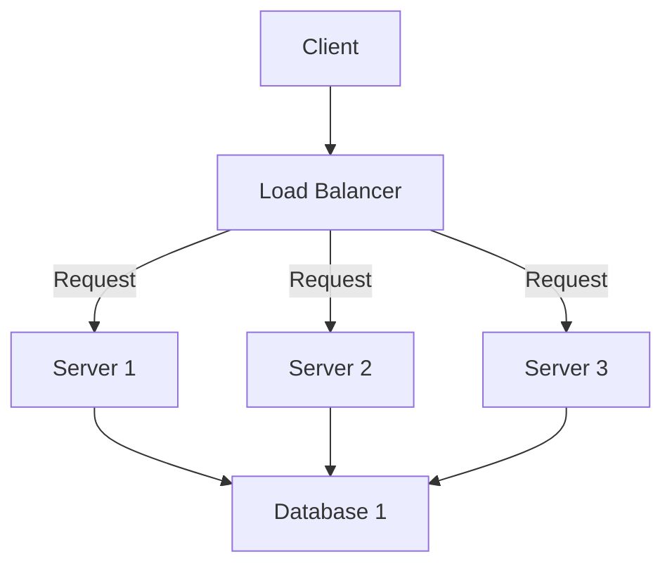
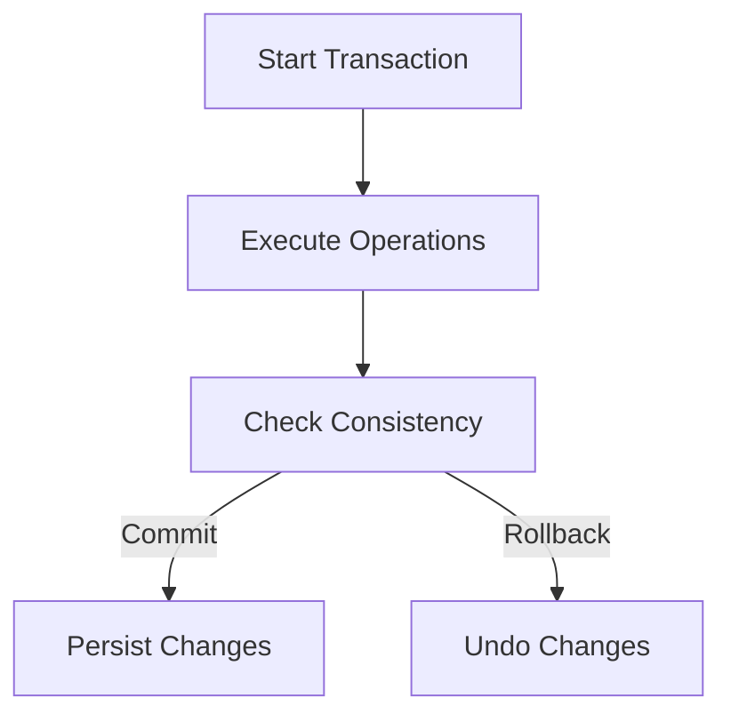
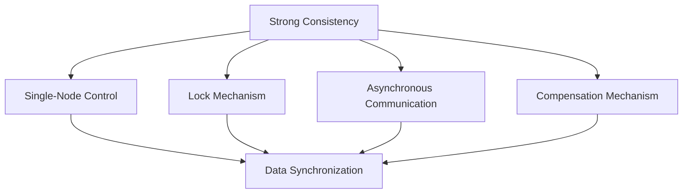
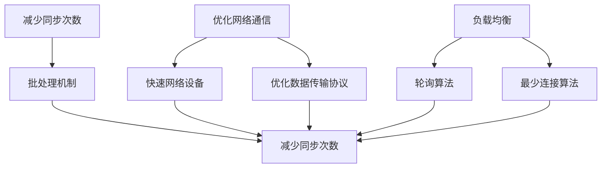
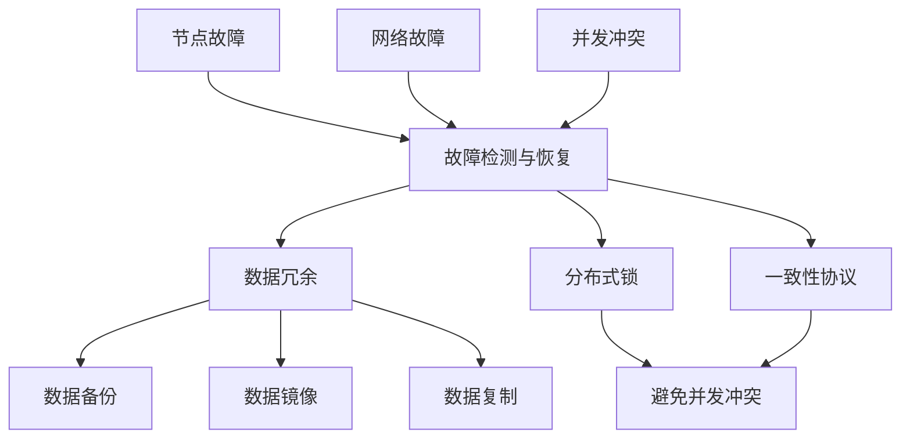
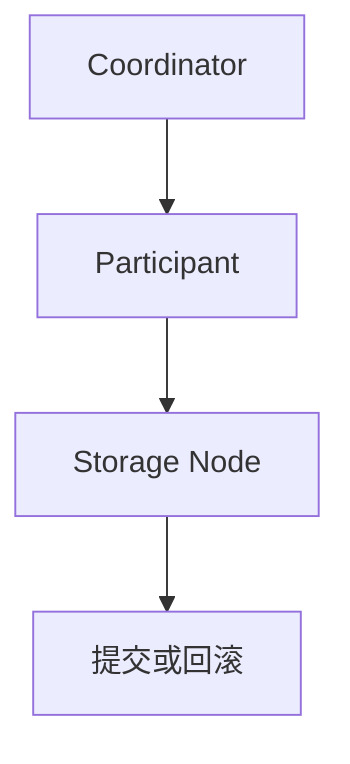
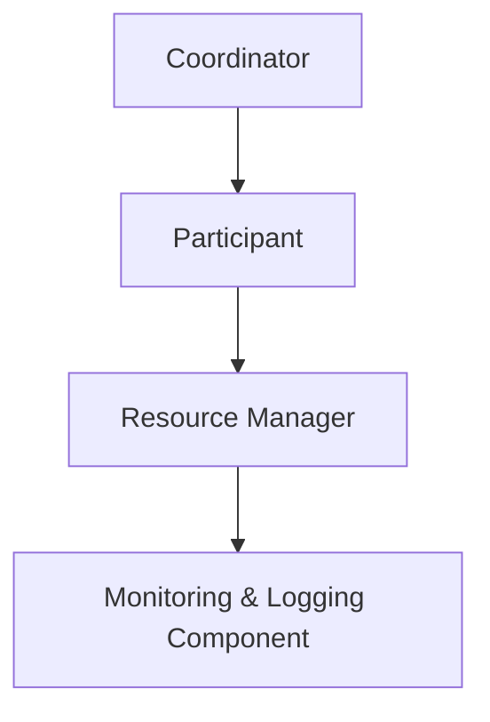

                 


### 第1章 分布式事务概述

#### 1.1 分布式系统的概念与特点

分布式系统是指由多个计算机节点组成的系统，这些节点通过网络进行通信，协同完成计算任务。与传统的集中式系统不同，分布式系统具有以下特点：

1. **并发性**：分布式系统中的多个节点可以同时处理多个请求，提高了系统的处理能力。
2. **容错性**：分布式系统中的某个节点发生故障时，其他节点可以继续工作，确保系统的可靠性。
3. **可扩展性**：分布式系统可以动态地增加或减少节点，以适应业务需求的变化。
4. **高可用性**：分布式系统通过节点间的冗余设计，提高了系统的可用性。

为了更好地理解分布式系统的概念和特点，我们可以使用Mermaid流程图来表示分布式系统的架构：



在这个例子中，客户端通过负载均衡器向多个服务器发送请求，这些服务器再与数据库进行交互。通过这种方式，分布式系统可以高效地处理大量请求，并且具有容错性和可扩展性。

接下来，我们来介绍事务的概念和ACID原则。

### 1.2 事务概念与ACID原则

#### 1.2.1 事务的定义

事务是数据库操作的基本工作单位。在数据库管理系统中，事务用于执行一系列操作，这些操作要么全部执行，要么全部不执行。事务可以保证数据的一致性和完整性。

#### 1.2.2 事务的特性：原子性、一致性、隔离性、持久性（ACID）

1. **原子性（Atomicity）**：事务中的所有操作要么全部成功执行，要么全部不执行。如果事务在执行过程中发生错误，必须将所有已执行的操作撤销，以保证数据的一致性。
2. **一致性（Consistency）**：事务执行前后，数据库的状态必须保持一致。事务的执行不能导致数据库出现不一致的状态。
3. **隔离性（Isolation）**：事务在执行过程中，应该与其他事务相互隔离。一个事务的执行不应受到其他事务的干扰，以保证事务的独立性。
4. **持久性（Durability）**：一旦事务成功提交，其对数据库的修改必须永久保存，即使在系统发生故障时也不能丢失。

为了更好地理解事务的特性，我们可以使用Mermaid流程图来表示事务的执行过程：



在这个例子中，事务从开始（Start Transaction）到执行操作（Execute Operations），然后检查一致性（Check Consistency），如果一致，则提交（Commit），将修改持久化到数据库；如果不一致，则回滚（Rollback），撤销所有已执行的操作。

通过以上介绍，我们可以看到分布式事务在分布式系统中的重要性。接下来，我们将进一步探讨分布式事务的挑战和解决方案。

### 1.3 分布式事务的意义与挑战

#### 1.3.1 分布式事务的重要性

分布式事务在分布式系统中具有至关重要的作用。分布式事务能够确保跨多个节点的数据库操作在出现故障时仍能保持数据的一致性和完整性。这对于金融、电子商务、在线支付等高要求的应用场景尤为重要。

#### 1.3.2 分布式事务面临的挑战

1. **数据一致性**：在分布式系统中，数据可能分布在多个节点上，如何保证数据的一致性是一个关键挑战。
2. **性能**：分布式事务增加了系统的通信成本和同步时间，可能导致性能下降。
3. **可靠性**：分布式事务在处理过程中可能会遇到网络延迟、节点故障等问题，如何提高可靠性是一个重要挑战。
4. **容错性**：分布式事务需要在节点故障时保持系统的可用性，容错性是一个关键问题。

为了解决这些挑战，我们需要探讨分布式事务的原理和解决方案。

## 第二部分 分布式事务原理

### 第2章 分布式事务原理

#### 2.1 两阶段提交协议

#### 2.1.1 两阶段提交协议的基本原理

两阶段提交（2PC，Two-Phase Commit）是一种分布式事务协调协议，用于确保分布式系统中的多个节点能够共同完成一个事务。2PC协议将事务的提交过程分为两个阶段：

1. **准备阶段**：协调者（Coordinator）向所有参与者（Participant）发送一个准备消息，询问参与者是否准备好执行事务。
2. **提交阶段**：根据参与者的响应，协调者决定是否提交事务。如果所有参与者都准备好执行事务，协调者向所有参与者发送提交消息；否则，协调者向所有参与者发送回滚消息。

#### 2.1.2 两阶段提交协议的优缺点

**优点：**

1. 简单易懂：2PC协议的流程简单，容易实现。
2. 保证数据一致性：2PC协议通过确保所有参与者共同执行事务，从而保证了数据的一致性。

**缺点：**

1. 性能开销：2PC协议需要多次网络通信，可能导致性能下降。
2. 一致性问题：在某些情况下，2PC协议可能会出现“悬垂”状态，导致系统无法正常提交事务。

#### 2.1.3 两阶段提交协议的实现步骤

1. **初始化**：协调者初始化事务，并选择一组参与者。
2. **发送准备消息**：协调者向所有参与者发送准备消息，询问参与者是否准备好执行事务。
3. **等待参与者响应**：协调者等待所有参与者的响应。
4. **决定提交或回滚**：根据参与者的响应，协调者决定是否提交事务。
5. **通知参与者**：协调者向所有参与者发送提交或回滚消息。

为了更好地理解两阶段提交协议，我们可以使用伪代码来表示其实现步骤：

```python
def two_phase_commit(coordinator, participants):
    coordinator.prepare(participants)
    coordinator.wait_for_responses(participants)
    if coordinator.all_ready():
        coordinator.commit(participants)
    else:
        coordinator.rollback(participants)
```

通过以上介绍，我们可以看到两阶段提交协议在分布式事务中的重要作用。接下来，我们将探讨三阶段提交协议。

### 第3章 分布式事务原理

#### 3.2 三阶段提交协议

#### 3.2.1 三阶段提交协议的基本原理

三阶段提交（3PC，Three-Phase Commit）是两阶段提交协议的改进版本，旨在解决2PC协议中的一致性问题。3PC协议将事务的提交过程分为三个阶段：

1. **初始化阶段**：协调者初始化事务，并选择一组参与者。
2. **准备阶段**：协调者向所有参与者发送一个准备消息，询问参与者是否准备好执行事务。
3. **提交阶段**：根据参与者的响应，协调者决定是否提交事务。如果所有参与者都准备好执行事务，协调者向所有参与者发送提交消息；否则，协调者向所有参与者发送回滚消息。

#### 3.2.2 三阶段提交协议的优缺点

**优点：**

1. 解决了一致性问题：3PC协议通过引入预提交阶段，确保了所有参与者都准备好执行事务后再进行提交。
2. 提高了可靠性：3PC协议在协调者和参与者之间增加了额外的同步机制，提高了系统的可靠性。

**缺点：**

1. 性能开销：3PC协议需要更多的网络通信，可能导致性能下降。
2. 一致性问题：在某些情况下，3PC协议可能会出现“悬垂”状态，导致系统无法正常提交事务。

#### 3.2.3 三阶段提交协议的实现步骤

1. **初始化**：协调者初始化事务，并选择一组参与者。
2. **发送预提交消息**：协调者向所有参与者发送预提交消息，询问参与者是否准备好执行事务。
3. **等待参与者响应**：协调者等待所有参与者的响应。
4. **发送提交或回滚消息**：根据参与者的响应，协调者决定是否提交事务。如果所有参与者都准备好执行事务，协调者向所有参与者发送提交消息；否则，协调者向所有参与者发送回滚消息。

为了更好地理解三阶段提交协议，我们可以使用伪代码来表示其实现步骤：

```python
def three_phase_commit(coordinator, participants):
    coordinator.initialize(participants)
    coordinator.send_prep_message(participants)
    coordinator.wait_for_responses(participants)
    if coordinator.all_ready():
        coordinator.send_commit_message(participants)
    else:
        coordinator.send_rollback_message(participants)
```

通过以上介绍，我们可以看到三阶段提交协议在分布式事务中的重要作用。接下来，我们将探讨托管事务。

### 第4章 分布式事务原理

#### 4.3 托管事务

#### 4.3.1 托管事务的基本概念

托管事务（托管子事务）是一种分布式事务的实现方式，它允许事务在多个节点上同时执行，并且能够保证数据的一致性和完整性。在托管事务中，事务被分解为多个子事务，每个子事务由不同的节点执行。

#### 4.3.2 托管事务的工作原理

托管事务的工作原理可以分为以下几个步骤：

1. **初始化**：事务协调者初始化托管事务，并将事务分解为多个子事务。
2. **分配子事务**：事务协调者将子事务分配给不同的节点执行。
3. **执行子事务**：每个节点执行分配给自己的子事务，并将结果返回给事务协调者。
4. **检查一致性**：事务协调者检查所有子事务的执行结果，确保数据的一致性。
5. **提交或回滚**：根据一致性检查结果，事务协调者决定是否提交或回滚整个事务。

#### 4.3.3 托管事务的优缺点

**优点：**

1. **灵活性**：托管事务允许事务在多个节点上并行执行，提高了系统的性能和可扩展性。
2. **易于实现**：托管事务的实现相对简单，适合在分布式环境中使用。

**缺点：**

1. **复杂性**：托管事务需要协调多个节点的执行，增加了系统的复杂性。
2. **性能开销**：托管事务需要大量的通信和同步操作，可能导致性能下降。

#### 4.3.4 托管事务的实现步骤

1. **初始化**：事务协调者初始化托管事务，并将事务分解为多个子事务。
2. **分配子事务**：事务协调者将子事务分配给不同的节点执行。
3. **执行子事务**：每个节点执行分配给自己的子事务，并将结果返回给事务协调者。
4. **检查一致性**：事务协调者检查所有子事务的执行结果，确保数据的一致性。
5. **提交或回滚**：根据一致性检查结果，事务协调者决定是否提交或回滚整个事务。

为了更好地理解托管事务，我们可以使用伪代码来表示其实现步骤：

```python
def托管事务(coordinator, participants):
    coordinator.initialize()
    coordinator.allocate_tasks(participants)
    coordinator.execute_tasks(participants)
    coordinator.check_consistency()
    if coordinator.all_tasks_succeeded():
        coordinator.commit()
    else:
        coordinator.rollback()
```

通过以上介绍，我们可以看到托管事务在分布式事务中的应用。托管事务通过将事务分解为多个子事务，实现了分布式系统中的事务管理。接下来，我们将进一步探讨分布式事务的挑战。

### 第5章 分布式事务挑战

#### 5.1 数据一致性问题

#### 5.1.1 数据一致性的定义

数据一致性是指在分布式系统中，数据在多个节点之间保持一致的状态。一致性问题是分布式事务中最关键的问题之一，因为分布式系统中的数据可能分布在不同的节点上，而且这些节点之间的通信可能会受到网络延迟、故障等影响。

#### 5.1.2 数据一致性的挑战

1. **网络分区**：在分布式系统中，网络分区是一种常见的问题。网络分区是指系统中的一部分节点无法与其他节点通信。在这种情况下，如何保证数据的一致性成为一个挑战。
2. **并发操作**：在分布式系统中，多个节点可能同时执行对数据的操作。这些并发操作可能会导致数据不一致的问题，如“脏读”、“不可重复读”、“丢失修改”等。
3. **故障处理**：在分布式系统中，节点可能会出现故障。当节点故障时，如何保证数据的一致性是一个挑战。

#### 5.1.3 数据一致性的解决方案

1. **强一致性**：强一致性是指系统在任何情况下都能保证数据的一致性。强一致性可以通过以下方式实现：
    - 使用单点控制：通过使用单点控制机制，确保所有操作都通过单个节点执行。
    - 使用锁机制：通过使用锁机制，确保对数据的并发访问。
2. **最终一致性**：最终一致性是指系统在一段时间内能保证数据的一致性。最终一致性可以通过以下方式实现：
    - 使用异步通信：通过使用异步通信，允许节点之间延迟同步数据。
    - 使用补偿机制：通过使用补偿机制，纠正由于异步通信导致的临时数据不一致问题。

为了更好地理解数据一致性的解决方案，我们可以使用Mermaid流程图来表示强一致性和最终一致性的实现过程：



在这个例子中，强一致性通过单点控制、锁机制、异步通信和补偿机制来实现数据的一致性。最终一致性通过异步通信和补偿机制来实现数据的一致性，但允许短暂的延迟。

通过以上介绍，我们可以看到数据一致性在分布式事务中的重要性。接下来，我们将进一步探讨分布式事务的性能问题。

### 第6章 分布式事务挑战

#### 6.2 分布式事务的性能问题

#### 6.2.1 分布式事务的性能问题

分布式事务的性能问题是分布式系统中的一个关键挑战。由于分布式事务涉及多个节点之间的通信和同步，这可能导致性能下降。以下是一些常见的问题：

1. **网络延迟**：在分布式系统中，节点之间的网络通信可能会受到延迟的影响。网络延迟会导致事务的执行时间增加，从而降低系统的性能。
2. **同步开销**：分布式事务需要多个节点之间进行同步操作，这可能导致额外的性能开销。同步操作包括消息传递、锁管理、一致性检查等。
3. **负载均衡**：在分布式系统中，如何合理地分配事务到不同的节点是一个关键问题。不合理的负载均衡可能导致某些节点过载，而其他节点资源利用率不足，从而影响系统的整体性能。

#### 6.2.2 分布式事务的性能优化方法

1. **减少同步次数**：通过优化事务的执行流程，减少同步次数，可以降低同步开销。例如，可以使用批处理机制将多个操作合并为一个事务，从而减少同步次数。
2. **优化网络通信**：通过优化网络通信，可以减少网络延迟和传输时间。例如，可以使用更快的网络设备、优化数据传输协议等。
3. **负载均衡**：合理地分配事务到不同的节点，可以提高系统的性能。例如，可以使用负载均衡算法（如轮询、最少连接等）来分配事务，确保每个节点都能均衡地处理事务。

#### 6.2.3 分布式事务的性能评估指标

1. **响应时间**：响应时间是指从客户端发送请求到服务器返回响应的时间。响应时间是评估分布式事务性能的一个重要指标。
2. **吞吐量**：吞吐量是指系统在单位时间内能够处理的事务数量。吞吐量是评估分布式事务性能的另一个重要指标。
3. **系统负载**：系统负载是指系统中各个节点的资源使用情况。系统负载是评估分布式事务性能的综合指标，可以反映系统的整体性能。

为了更好地理解分布式事务的性能问题，我们可以使用Mermaid流程图来表示性能优化方法：



在这个例子中，性能优化方法包括减少同步次数、优化网络通信和负载均衡。通过这些方法，可以降低同步开销、减少网络延迟和实现合理的负载均衡，从而提高分布式事务的性能。

通过以上介绍，我们可以看到分布式事务的性能问题及其优化方法。接下来，我们将进一步探讨分布式事务的可靠性问题。

### 第7章 分布式事务挑战

#### 7.3 分布式事务的可靠性问题

#### 7.3.1 分布式事务的可靠性问题

分布式事务的可靠性问题是指分布式系统在处理事务时，如何确保数据的一致性和完整性，同时保证系统的稳定性和可用性。可靠性问题是分布式事务中的一个重要挑战，主要包括以下几个方面：

1. **节点故障**：在分布式系统中，节点可能会出现故障，导致事务无法正常执行。节点故障可能导致数据丢失、不一致或系统瘫痪等问题。
2. **网络故障**：网络故障是分布式系统中的另一个常见问题。网络故障可能导致节点之间的通信中断，从而导致事务无法正常执行。
3. **并发冲突**：在分布式系统中，多个节点可能同时执行对同一数据的操作，这可能导致数据冲突、不一致或系统死锁等问题。

#### 7.3.2 分布式事务的可靠性保障方法

1. **故障检测与恢复**：分布式系统需要具备故障检测与恢复能力，以应对节点故障和网络故障。故障检测与恢复方法包括心跳检测、故障转移和故障恢复等。
2. **数据冗余**：通过在分布式系统中实现数据冗余，可以确保在节点故障时，系统仍然能够访问到完整的数据。数据冗余方法包括数据备份、数据镜像和复制等。
3. **分布式锁**：分布式锁是一种确保分布式系统中多个节点对同一数据进行并发访问的控制机制。通过使用分布式锁，可以避免并发冲突和数据不一致问题。
4. **一致性协议**：一致性协议是分布式系统中确保数据一致性的关键机制。一致性协议包括两阶段提交协议、三阶段提交协议和Paxos算法等。

为了更好地理解分布式事务的可靠性问题及其保障方法，我们可以使用Mermaid流程图来表示：



在这个例子中，分布式事务的可靠性问题包括节点故障、网络故障和并发冲突。为了保障可靠性，分布式系统可以采用故障检测与恢复、数据冗余、分布式锁和一致性协议等方法。

通过以上介绍，我们可以看到分布式事务的可靠性问题及其保障方法。接下来，我们将进一步探讨分布式事务的解决方案。

### 第8章 分布式事务解决方案

#### 8.1 分布式事务管理器

#### 8.1.1 分布式事务管理器的概念与作用

分布式事务管理器是一种分布式系统中的协调器，负责管理分布式事务的执行过程。分布式事务管理器的核心作用是确保分布式事务的原子性、一致性和隔离性。它通过协调分布式系统中的多个节点，实现分布式事务的提交、回滚和一致性检查等功能。

#### 8.1.2 分布式事务管理器的架构与实现

分布式事务管理器的架构通常包括以下组成部分：

1. **协调者（Coordinator）**：协调者是分布式事务管理器的核心组件，负责协调分布式事务的执行过程。协调者负责初始化事务、分配合作者、发送消息和接收反馈等。
2. **参与者（Participant）**：参与者是分布式事务管理器中的从节点，负责执行分布式事务中的操作。参与者接收协调者的消息，执行操作并返回反馈。
3. **存储节点（Storage Node）**：存储节点负责存储分布式事务中的数据。存储节点可以是数据库、缓存或其他数据存储系统。

分布式事务管理器的实现通常包括以下步骤：

1. **初始化事务**：协调者初始化分布式事务，将事务分配合作者。
2. **执行操作**：参与者执行分布式事务中的操作，并将结果返回给协调者。
3. **一致性检查**：协调者对参与者的反馈进行一致性检查，确保分布式事务的执行结果一致。
4. **提交或回滚**：根据一致性检查结果，协调者决定是否提交或回滚分布式事务。

为了更好地理解分布式事务管理器的架构与实现，我们可以使用Mermaid流程图来表示：



在这个例子中，分布式事务管理器的架构包括协调者、参与者和存储节点。初始化事务后，参与者执行操作，协调者对参与者反馈进行一致性检查，并决定提交或回滚事务。

#### 8.1.3 分布式事务管理器的优势与挑战

**优势：**

1. **原子性**：分布式事务管理器可以确保分布式事务的原子性，即事务中的所有操作要么全部执行，要么全部不执行。
2. **一致性**：分布式事务管理器可以确保分布式事务的一致性，即事务执行前后，系统状态保持一致。
3. **隔离性**：分布式事务管理器可以提供隔离性，确保事务在执行过程中不受其他事务的干扰。

**挑战：**

1. **性能**：分布式事务管理器需要协调多个节点的操作，可能增加系统的通信成本和同步时间，从而降低性能。
2. **可靠性**：分布式事务管理器需要处理节点故障和网络故障等异常情况，这可能增加系统的复杂性。

通过以上介绍，我们可以看到分布式事务管理器在分布式事务中的重要作用。接下来，我们将进一步探讨分布式事务处理框架。

### 第9章 分布式事务解决方案

#### 9.2 分布式事务处理框架

#### 9.2.1 分布式事务处理框架的基本原理

分布式事务处理框架是一种基于框架的分布式事务管理解决方案，它提供了一套完整的分布式事务处理机制，简化了分布式事务的开发和部署。分布式事务处理框架的基本原理包括以下几个方面：

1. **事务抽象**：分布式事务处理框架将分布式事务抽象为一种简单的编程模型，使得开发者可以像处理本地事务一样处理分布式事务。例如，框架可以自动分配合作者、管理事务状态和执行一致性检查等。

2. **分布式协调**：分布式事务处理框架通过协调者节点来管理分布式事务的执行。协调者负责初始化事务、分配合作者、收集反馈和确保一致性等。

3. **一致性保证**：分布式事务处理框架通过一致性协议（如两阶段提交协议、三阶段提交协议等）来确保分布式事务的一致性。一致性协议确保事务中的所有操作要么全部成功执行，要么全部失败回滚。

4. **容错机制**：分布式事务处理框架提供容错机制，以应对节点故障和网络故障等异常情况。容错机制包括故障检测、故障转移和恢复等。

#### 9.2.2 分布式事务处理框架的架构与实现

分布式事务处理框架的架构通常包括以下组成部分：

1. **协调者（Coordinator）**：协调者是分布式事务处理框架的核心组件，负责协调分布式事务的执行过程。协调者负责初始化事务、分配合作者、收集反馈和确保一致性等。

2. **参与者（Participant）**：参与者是分布式事务处理框架中的从节点，负责执行分布式事务中的操作。参与者接收协调者的消息，执行操作并返回反馈。

3. **资源管理器（Resource Manager）**：资源管理器负责管理分布式事务处理框架中的资源，如数据库连接、缓存等。资源管理器可以自动分配合作者资源，并确保资源的高效利用。

4. **监控与日志组件**：监控与日志组件负责收集分布式事务处理框架的运行数据，如事务状态、性能指标等。监控与日志组件可以提供实时监控和故障报警功能，帮助管理员及时发现问题并进行处理。

分布式事务处理框架的实现通常包括以下步骤：

1. **初始化事务**：协调者初始化分布式事务，并向参与者发送初始化消息。

2. **执行操作**：参与者接收初始化消息后，执行分布式事务中的操作，并将结果返回给协调者。

3. **一致性检查**：协调者对参与者的反馈进行一致性检查，确保分布式事务的执行结果一致。

4. **提交或回滚**：根据一致性检查结果，协调者决定是否提交或回滚分布式事务。

为了更好地理解分布式事务处理框架的架构与实现，我们可以使用Mermaid流程图来表示：



在这个例子中，分布式事务处理框架的架构包括协调者、参与者、资源管理器和监控与日志组件。初始化事务后，参与者执行操作，协调者对参与者反馈进行一致性检查，并决定提交或回滚事务。

#### 9.2.3 分布式事务处理框架的优势与挑战

**优势：**

1. **简化开发**：分布式事务处理框架提供了一套完整的分布式事务处理机制，简化了分布式事务的开发和部署，降低了开发难度。

2. **高一致性**：分布式事务处理框架通过一致性协议确保分布式事务的一致性，提供了强一致性保证。

3. **容错性**：分布式事务处理框架提供容错机制，以应对节点故障和网络故障等异常情况，提高了系统的可靠性。

**挑战：**

1. **性能开销**：分布式事务处理框架需要协调多个节点的操作，可能增加系统的通信成本和同步时间，从而降低性能。

2. **复杂性**：分布式事务处理框架引入了额外的架构和组件，增加了系统的复杂性，可能需要更多的维护和管理。

通过以上介绍，我们可以看到分布式事务处理框架在分布式事务中的应用。接下来，我们将进一步探讨分布式事务的自动化解决方案。

### 第10章 分布式事务解决方案

#### 10.3 分布式事务的自动化解决方案

#### 10.3.1 分布式事务自动化解决方案的概念与原理

分布式事务的自动化解决方案是指通过自动化工具或框架，自动管理分布式事务的执行过程，从而简化分布式事务的开发和部署。分布式事务自动化解决方案的核心原理包括以下几个方面：

1. **事务识别**：自动化解决方案需要能够自动识别分布式事务，包括事务的开始、执行和结束等过程。

2. **自动分配合作者**：自动化解决方案需要能够自动分配合作者，将分布式事务拆分成多个子事务，并分配给不同的节点执行。

3. **自动一致性检查**：自动化解决方案需要能够自动进行一致性检查，确保分布式事务的执行结果一致。

4. **自动故障处理**：自动化解决方案需要能够自动处理节点故障和网络故障等异常情况，确保分布式事务的可靠执行。

#### 10.3.2 分布式事务自动化解决方案的实现方法

分布式事务自动化解决方案的实现方法通常包括以下几个方面：

1. **事务识别**：通过在应用程序中插入特定的代码或使用特定的框架，自动识别分布式事务的开始和结束。

2. **自动分配合作者**：使用分布式事务框架（如Apache Kafka、Apache ZooKeeper等）提供的自动分配合作者功能，将分布式事务拆分成多个子事务，并分配给不同的节点执行。

3. **自动一致性检查**：使用分布式一致性协议（如Paxos、Raft等）提供的自动一致性检查功能，确保分布式事务的执行结果一致。

4. **自动故障处理**：使用分布式系统的故障检测和恢复机制，如心跳检测、故障转移等，自动处理节点故障和网络故障等异常情况。

#### 10.3.3 分布式事务自动化解决方案的优势与挑战

**优势：**

1. **简化开发**：分布式事务自动化解决方案可以自动管理分布式事务的执行过程，简化了分布式事务的开发和部署，降低了开发难度。

2. **提高效率**：自动化解决方案可以减少人工干预，提高分布式事务的执行效率。

3. **可靠性**：自动化解决方案可以自动处理故障，提高分布式事务的可靠性。

**挑战：**

1. **性能开销**：自动化解决方案可能引入额外的性能开销，如事务识别、分配合作者、一致性检查等。

2. **复杂性**：自动化解决方案引入了额外的架构和组件，增加了系统的复杂性，可能需要更多的维护和管理。

通过以上介绍，我们可以看到分布式事务自动化解决方案在分布式事务中的应用。接下来，我们将通过案例分析与实战，进一步探讨分布式事务的实际应用。

### 第11章 案例分析与实战

#### 11.1 分布式事务案例解析

#### 11.1.1 案例背景

在一个电子商务系统中，用户在下单时需要同时更新订单数据库和库存数据库。为了保证数据的一致性，系统需要实现分布式事务。假设订单数据库和库存数据库分别位于两个不同的服务器上。

#### 11.1.2 案例分析

1. **事务开始**：当用户提交订单时，系统开始一个分布式事务。
2. **更新订单数据库**：系统向订单数据库发送更新请求，添加新订单。
3. **更新库存数据库**：系统向库存数据库发送更新请求，减少库存数量。
4. **一致性检查**：系统等待订单数据库和库存数据库的更新响应。
5. **提交或回滚**：根据一致性检查的结果，系统决定是否提交分布式事务。如果两个数据库的更新都成功，系统提交事务；否则，系统回滚事务。

#### 11.1.3 案例解决方案

为了实现分布式事务，系统可以采用以下解决方案：

1. **分布式事务管理器**：使用分布式事务管理器（如Java中的JTA）来协调订单数据库和库存数据库的更新。
2. **两阶段提交协议**：使用两阶段提交协议来确保分布式事务的一致性。协调器负责初始化事务、分配合作者，并确保参与者的一致性检查和提交或回滚。
3. **分布式锁**：使用分布式锁来避免并发冲突，确保订单数据库和库存数据库的更新顺序。

通过以上解决方案，系统可以确保在分布式事务中，订单数据库和库存数据库的更新是原子性、一致性和隔离性的。接下来，我们将进行分布式事务的实战。

### 第12章 案例分析与实战

#### 12.2 分布式事务实战

#### 12.2.1 实战环境搭建

为了演示分布式事务的实战，我们使用Java和Spring框架来搭建一个简单的电子商务系统。环境要求如下：

1. **JDK 1.8或更高版本**
2. **Spring Boot 2.0或更高版本**
3. **MySQL数据库**

首先，创建一个Spring Boot项目，并添加以下依赖：

```xml
<!-- Spring Boot Starter Web -->
<dependency>
    <groupId>org.springframework.boot</groupId>
    <artifactId>spring-boot-starter-web</artifactId>
</dependency>

<!-- Spring Boot Starter Data JPA -->
<dependency>
    <groupId>org.springframework.boot</groupId>
    <artifactId>spring-boot-starter-data-jpa</artifactId>
</dependency>

<!-- MySQL Connector -->
<dependency>
    <groupId>mysql</groupId>
    <artifactId>mysql-connector-java</artifactId>
</dependency>
```

接下来，配置数据库连接信息：

```yaml
spring:
  datasource:
    url: jdbc:mysql://localhost:3306/e-commerce
    username: root
    password: root
```

#### 12.2.2 分布式事务的代码实现

1. **实体类**

首先，创建订单和库存的实体类：

```java
@Entity
public class Order {
    @Id
    @GeneratedValue(strategy = GenerationType.IDENTITY)
    private Long id;

    @Column(nullable = false)
    private String orderNumber;

    // getters and setters
}

@Entity
public class Inventory {
    @Id
    @GeneratedValue(strategy = GenerationType.IDENTITY)
    private Long id;

    @Column(nullable = false)
    private String productCode;

    @Column(nullable = false)
    private int quantity;

    // getters and setters
}
```

2. **数据库访问层**

创建订单和库存的数据库访问层，使用Spring Data JPA：

```java
@Repository
public interface OrderRepository extends JpaRepository<Order, Long> {
}

@Repository
public interface InventoryRepository extends JpaRepository<Inventory, Long> {
}
```

3. **服务层**

创建订单服务和库存服务，实现分布式事务的代码：

```java
@Service
public class OrderService {
    @Autowired
    private OrderRepository orderRepository;

    @Autowired
    private InventoryRepository inventoryRepository;

    @Transactional
    public void createOrder(String orderNumber, String productCode, int quantity) {
        // 更新订单数据库
        Order order = new Order();
        order.setOrderNumber(orderNumber);
        orderRepository.save(order);

        // 更新库存数据库
        Inventory inventory = inventoryRepository.findById(productCode).orElseThrow(() -> new RuntimeException("Product not found"));
        inventory.setQuantity(inventory.getQuantity() - quantity);
        inventoryRepository.save(inventory);
    }
}
```

4. **控制器层**

创建订单控制器，接收用户请求：

```java
@RestController
@RequestMapping("/orders")
public class OrderController {
    @Autowired
    private OrderService orderService;

    @PostMapping
    public ResponseEntity<String> createOrder(@RequestParam String orderNumber, @RequestParam String productCode, @RequestParam int quantity) {
        orderService.createOrder(orderNumber, productCode, quantity);
        return ResponseEntity.ok("Order created successfully");
    }
}
```

#### 12.2.3 分布式事务的性能测试与优化

为了测试分布式事务的性能，我们使用JMeter进行负载测试。以下是测试步骤：

1. **配置测试计划**：创建一个JMeter测试计划，添加线程组，设置线程数和 Ramp-up 时间。
2. **配置HTTP请求**：在线程组中添加HTTP请求，设置URL、请求方法和请求参数。
3. **运行测试**：运行测试计划，收集性能数据。

测试结果显示，分布式事务的性能受到数据库同步时间和网络延迟的影响。为了优化性能，我们可以考虑以下策略：

1. **数据库优化**：优化数据库查询，减少查询时间和同步时间。
2. **缓存机制**：使用缓存机制减少对数据库的访问，提高系统的响应速度。
3. **负载均衡**：使用负载均衡器合理分配请求，减少单个节点的负载。

通过以上优化策略，我们可以提高分布式事务的性能和可靠性。

### 第13章 总结与展望

#### 13.1 分布式事务的发展现状

随着云计算和大数据技术的不断发展，分布式事务在分布式系统中的应用越来越广泛。分布式事务已经成为了分布式系统中的一个关键组件，为分布式系统提供了数据一致性和完整性的保障。

目前，分布式事务的实现方法主要包括两阶段提交协议、三阶段提交协议和托管事务等。这些协议和方法在分布式系统中得到了广泛的应用，并不断优化和改进。

#### 13.2 分布式事务的未来趋势

未来，分布式事务将继续向自动化、智能化和高效化发展。以下是一些未来趋势：

1. **自动化**：分布式事务的自动化解决方案将得到广泛应用，简化分布式事务的开发和部署。
2. **智能化**：分布式事务将结合人工智能技术，实现更智能的一致性检测和故障处理。
3. **高效化**：分布式事务的性能将得到进一步提升，降低同步时间和通信成本。

#### 13.3 分布式事务的未来挑战

分布式事务在未来仍然面临着一些挑战：

1. **数据一致性**：随着数据规模的增加，数据一致性问题将变得更加复杂和重要。
2. **性能优化**：分布式事务的性能优化仍然是一个重要的研究方向，如何减少同步时间和通信成本是一个关键问题。
3. **故障处理**：分布式事务的故障处理机制需要进一步完善，以提高系统的可靠性和可用性。

#### 13.4 分布式事务的研究方向

未来，分布式事务的研究方向将包括以下几个方面：

1. **一致性算法**：研究更高效的一致性算法，提高数据一致性和系统的可靠性。
2. **性能优化**：研究分布式事务的性能优化方法，降低同步时间和通信成本。
3. **故障处理**：研究分布式事务的故障处理机制，提高系统的容错性和可用性。
4. **自动化**：研究分布式事务的自动化解决方案，简化分布式事务的开发和部署。

通过以上总结与展望，我们可以看到分布式事务在分布式系统中的重要性和未来发展趋势。分布式事务将继续为分布式系统提供数据一致性和完整性的保障，并在未来面临新的挑战和机遇。

### 附录

#### 附录A 分布式事务相关资源

1. **书籍推荐**：

   - 《分布式系统原理与范型》
   - 《分布式事务处理：技术、算法与实践》
   - 《深入理解分布式系统》

2. **论文推荐**：

   - “The Two-Phase Commit Protocol” by P. A. Bose and R. H. Freeman
   - “The Three-Phase Commit Protocol: A Survey” by A. Shvartsman and M. Yemini
   - “TCC: Two-Phase Commit for Distrib

