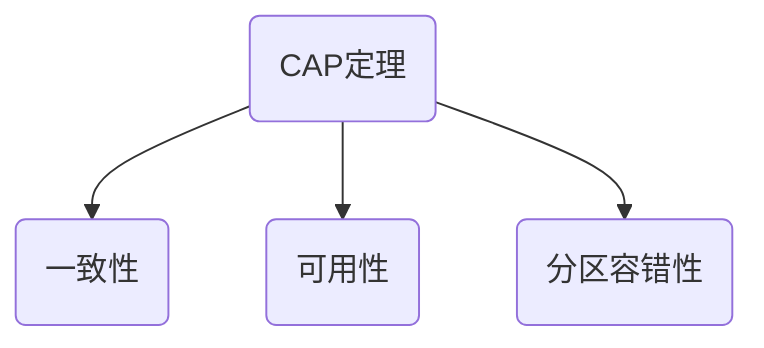
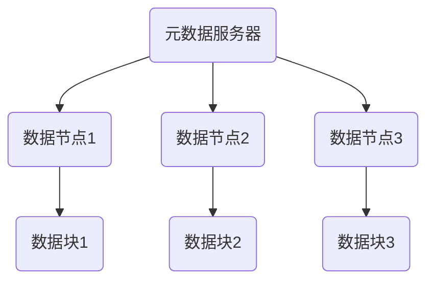
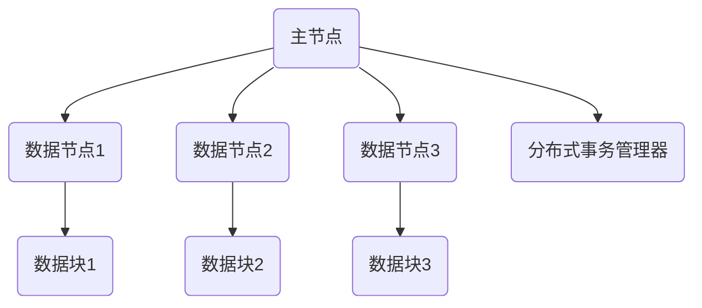
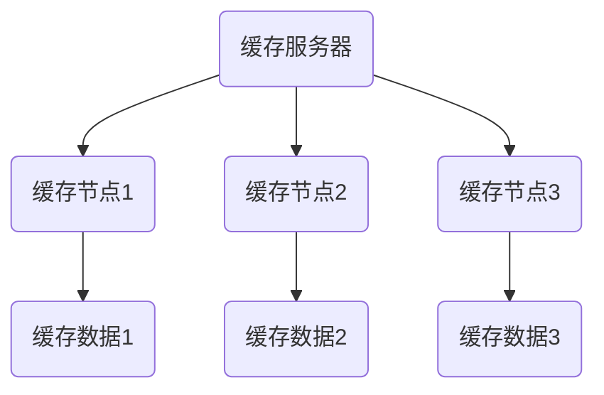
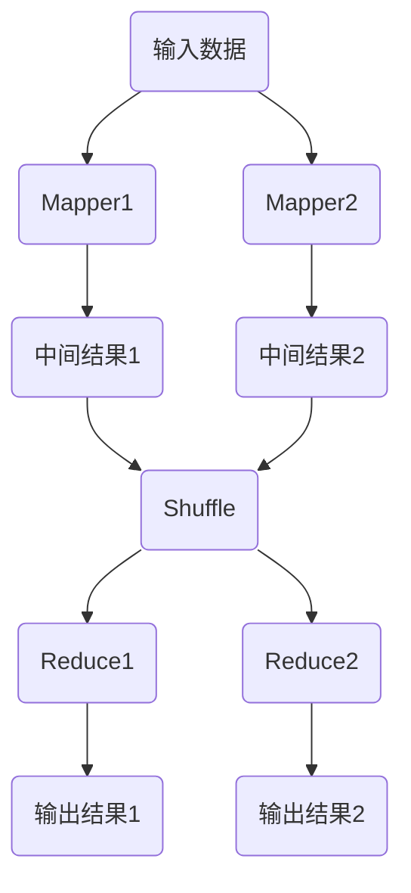
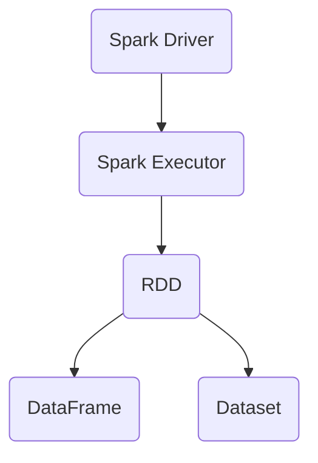
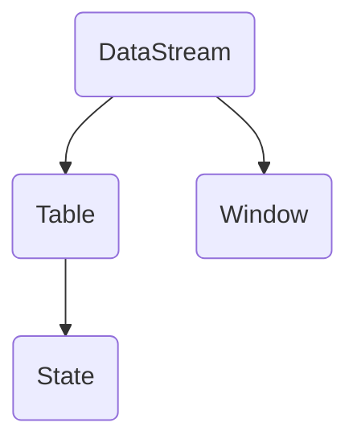

                 

### 文章标题

# 分布式技术的常见认知盲区

### 关键词

- 分布式系统
- CAP定理
- 分布式存储
- 分布式计算
- 分布式数据库
- 分布式一致性

### 摘要

本文将深入探讨分布式技术领域中的几个常见认知盲区。我们将逐步分析分布式系统的基本概念、CAP定理、分布式算法、分布式存储和分布式计算框架，并分享一些实际的项目实战经验和解决分布式技术中常见问题的策略。通过本文的阅读，读者将能够更好地理解分布式技术的核心原理和本质，以及在实际应用中如何避免常见的认知盲区。

## 引言

在当今的互联网时代，分布式技术已经成为构建高性能、高可用性系统的基石。无论是大型互联网公司，还是初创企业，分布式系统都已经成为一种常见的技术架构。然而，分布式技术的复杂性和多样性使得许多开发者和管理者陷入了认知盲区，难以充分发挥其潜力。

分布式技术涉及多个层面，包括系统架构、算法设计、数据一致性、容错性等。许多人在学习和应用分布式技术时，往往只关注表面的技术细节，而忽略了深层次的设计原则和实际应用中的关键问题。这些认知盲区可能导致系统性能不佳、数据不一致、容错性不足等问题，严重时甚至会导致系统崩溃。

本文旨在通过一步步的分析和推理，帮助读者深入了解分布式技术的核心概念和设计原则，揭示常见的认知盲区，并提供实用的解决方案。通过本文的阅读，读者将能够更好地理解分布式技术的本质，提高系统设计的质量和可靠性。

## 第1章: 分布式技术概述

### 1.1 分布式系统的基本概念

分布式系统是由多个独立计算机节点通过通信网络连接而成的系统，节点之间相互协作，共同完成计算任务。与集中式系统相比，分布式系统的特点在于其可扩展性、容错性和高可用性。

#### 1.1.1 分布式系统的定义

分布式系统（Distributed System）是指由多个独立的计算机节点通过网络互联组成的系统，这些节点可以分布在不同的地理位置，但相互之间通过通信网络进行通信，协同完成计算任务。

分布式系统的核心特征包括：

1. **独立性**：节点是独立的计算机，可以运行不同的操作系统，具备独立的计算能力和存储能力。
2. **协同工作**：节点通过通信网络相互协作，共同完成计算任务。
3. **分布式存储**：数据分布在多个节点上，提高了系统的存储容量和可靠性。
4. **分布式计算**：计算任务可以在多个节点上并行执行，提高了系统的处理能力。
5. **容错性**：系统能够在节点失效时自动恢复，保证系统的连续运行。

#### 1.1.2 分布式系统的特点

分布式系统具有以下特点：

1. **可扩展性**：系统可以轻松地添加新的节点，以应对不断增长的数据和处理需求。
2. **高可用性**：系统在节点失效时能够自动恢复，确保系统的高可靠性。
3. **容错性**：系统在个别节点故障时仍能保持正常运行，提高了系统的容错能力。
4. **分布式计算**：计算任务可以在多个节点上并行执行，提高了系统的处理速度。
5. **分布式存储**：数据分布在多个节点上，提高了系统的数据可靠性和访问速度。

### 1.2 分布式技术的历史与发展

分布式技术的历史可以追溯到20世纪60年代，当时计算机科学刚刚起步。随着时间的推移，分布式技术逐渐成为计算机科学的重要领域。以下是一些关键的发展历程：

1. **分布式计算的开端**：20世纪60年代，计算机科学家开始探讨如何在多个计算机之间分配任务，以提高计算效率。这一时期的代表性工作包括DEC的DFS文件系统和Xerox的Ethernet网络。
2. **分布式系统的崛起**：20世纪80年代，分布式系统开始广泛应用于企业级应用，如银行、电信和电子商务等领域。这一时期的代表性技术包括UNIX系统中的进程间通信和分布式数据库系统。
3. **分布式互联网的兴起**：20世纪90年代，互联网的普及带动了分布式技术的快速发展。Web服务器、数据库集群和分布式计算框架（如MapReduce）成为了分布式技术的重要应用领域。
4. **现代分布式系统的演进**：随着云计算、大数据和物联网的兴起，分布式技术得到了进一步的发展。现代分布式系统更加注重性能、可扩展性和安全性，如分布式存储系统（如HDFS、Cassandra）、分布式计算框架（如Spark、Flink）和分布式数据库（如MongoDB、Couchbase）。

### 1.3 分布式技术的核心概念

分布式技术涉及多个核心概念，其中最重要的包括CAP定理、一致性模型、分布式数据库、分布式存储和分布式计算框架。以下是对这些概念的基本介绍和相互关系的解释。

#### 1.3.1 CAP定理

CAP定理是分布式系统设计中的重要理论，由加州大学伯克利分校的计算机科学家Eric Brewer于2000年提出。CAP定理指出，在分布式系统中，一致性（Consistency）、可用性（Availability）和分区容错性（Partition Tolerance）这三个特性中，只能同时保证两个，而不能同时保证三个。

1. **一致性（Consistency）**：一致性是指所有节点在同一时间看到的数据是一致的。在分布式系统中，一致性通常分为强一致性和最终一致性。
2. **可用性（Availability）**：可用性是指系统始终能够响应请求。高可用性意味着即使在节点故障时，系统也能继续正常运行。
3. **分区容错性（Partition Tolerance）**：分区容错性是指系统能够在节点之间存在通信故障时继续运行。这是分布式系统的基本特性，因为网络故障是不可避免的。

CAP定理的示意图如下：



#### 1.3.2 一致性模型

一致性模型是分布式系统设计中重要的一环，用于定义数据在不同节点之间的一致性保证。常见的一致性模型包括强一致性、最终一致性和因果一致性。

1. **强一致性（Strong Consistency）**：强一致性要求所有节点在同一时间看到的数据是一致的。这种模型在分布式数据库和缓存系统中较为常见。
2. **最终一致性（Eventual Consistency）**：最终一致性不要求所有节点在同一时间看到的数据一致，但要求系统在有限时间内达到一致性。这种模型在分布式存储系统和一些实时应用中较为常见。
3. **因果一致性（ causal consistency）**：因果一致性是一种介于强一致性和最终一致性之间的模型，它保证因果关系的一致性。这意味着如果节点A在时间t1读取了某个值，并在时间t2修改了该值，那么其他节点在时间t2及以后读取该值时，将看到修改后的值。

#### 1.3.3 分布式数据库

分布式数据库是指将数据分布在多个节点上，以提高系统的性能、可扩展性和容错性的数据库系统。分布式数据库通常采用一致性协议和复制技术来确保数据的一致性。

1. **一致性协议**：一致性协议是分布式数据库中用于确保数据一致性的机制。常见的协议包括Paxos算法、Raft算法和ZAB算法。
2. **复制技术**：复制技术是指将数据在多个节点之间进行同步的技术。常见的复制技术包括主从复制和主主复制。

#### 1.3.4 分布式存储

分布式存储是指将数据存储在多个节点上，以提高系统的性能、可扩展性和容错性的存储系统。分布式存储系统通常采用去中心化的架构，并使用一致性算法和冗余技术来保证数据的可靠性。

1. **一致性算法**：一致性算法是分布式存储系统中用于确保数据一致性的算法。常见的算法包括Paxos算法、Raft算法和ZAB算法。
2. **冗余技术**：冗余技术是指通过在多个节点上存储相同的数据副本来提高数据的可靠性。常见的冗余技术包括数据复制和数据分割。

#### 1.3.5 分布式计算框架

分布式计算框架是指用于处理大规模分布式数据的计算框架。分布式计算框架通常提供高效的数据处理和并行计算能力，以应对大数据应用的需求。

1. **MapReduce**：MapReduce是一种经典的分布式计算模型，用于处理大规模数据集。MapReduce模型将数据处理过程分为两个阶段：Map阶段和Reduce阶段。
2. **Spark**：Spark是一种基于内存的分布式计算框架，提供高效的数据处理和并行计算能力。Spark模型包含多个组件，如Spark SQL、Spark Streaming和MLlib等。
3. **Flink**：Flink是一种流处理和批处理的分布式计算框架，提供高效的数据处理和实时分析能力。Flink模型基于数据流模型，支持实时数据处理和复杂事件处理。

### 1.4 分布式技术的应用领域

分布式技术广泛应用于各个领域，包括互联网、金融、医疗、物流等。以下是一些典型的应用场景：

1. **互联网应用**：分布式技术用于构建高性能、高可用性的Web应用和服务，如搜索引擎、电子商务平台和社交媒体等。
2. **金融服务**：分布式技术用于构建分布式数据库和分布式计算系统，以提高金融交易的性能、可靠性和安全性。
3. **医疗领域**：分布式技术用于构建分布式医疗数据存储和处理系统，以支持医疗数据的存储、分析和共享。
4. **物流领域**：分布式技术用于构建分布式物流管理系统，以提高物流信息的实时性和准确性。

## 第2章: 分布式算法原理

### 2.1 Paxos算法

Paxos算法是一种分布式一致性算法，由美国计算机科学家Leslie Lamport于1990年提出。Paxos算法旨在解决分布式系统中的一致性问题，保证多个节点之间对某个值的一致性达成共识。

#### 2.1.1 Paxos算法的基本概念

Paxos算法由以下几个基本概念组成：

1. **提案者（Proposer）**：负责提出提案的节点，提案通常是一个值或一个操作。
2. **接受者（Acceptor）**：负责接受提案的节点，接受者会根据一定的规则决定是否接受提案。
3. **学习者（Learner）**：负责学习已达成共识的值的节点，学习器会从接受者处获取已达成共识的值。

Paxos算法的基本过程如下：

1. **选择值**：提案者选择一个值作为提案，并发送预提案（Prepare）请求到所有接受者。
2. **预接受**：接受者在收到预提案请求后，会回复提案者一个预接受（Promise）消息，承诺不再接受比该提案编号小的提案。
3. **提案接受**：提案者收到超过半数的预接受消息后，会发送正式提案（Accept）请求到所有接受者。
4. **接受值**：接受者在收到正式提案请求后，会回复提案者一个接受（Accept）消息，承诺接受该提案。
5. **学习值**：提案者在收到超过半数的接受消息后，会通知所有学习者已达成共识的值。

#### 2.1.2 Paxos算法的运行原理

Paxos算法的运行原理可以总结为以下几个步骤：

1. **初始化**：系统初始化时，所有提案者、接受者和学习者都会处于准备状态。
2. **提案阶段**：提案者选择一个提案值，并发送预提案请求到所有接受者。
3. **预接受阶段**：接受者在收到预提案请求后，会回复提案者一个预接受消息，并更新自己的日志。
4. **提案阶段**：提案者在收到超过半数的预接受消息后，会发送正式提案请求到所有接受者。
5. **接受阶段**：接受者在收到正式提案请求后，会回复提案者一个接受消息，并更新自己的日志。
6. **学习阶段**：提案者在收到超过半数的接受消息后，会通知所有学习者已达成共识的值，学习者更新自己的日志。

#### 2.1.3 Paxos算法的优缺点

Paxos算法的优点包括：

1. **高可用性**：Paxos算法能够确保在节点失效或网络分区的情况下，系统仍然能够达成一致性。
2. **容错性**：Paxos算法能够容忍超过一半的节点失效，系统仍能正常运行。
3. **一致性保证**：Paxos算法能够保证分布式系统中多个节点对某个值的一致性达成共识。

Paxos算法的缺点包括：

1. **复杂度较高**：Paxos算法的复杂度较高，实现和部署相对困难。
2. **响应时间较长**：由于Paxos算法需要多个步骤才能达成一致性，其响应时间相对较长。
3. **扩展性较差**：Paxos算法在处理大规模分布式系统时，扩展性较差。

### 2.2 Raft算法

Raft算法是一种分布式一致性算法，由加州大学伯克利分校的计算机科学家Diego Ongaro和John Ousterhout于2013年提出。Raft算法旨在简化Paxos算法的复杂性，同时保持其一致性和容错性。

#### 2.2.1 Raft算法的基本概念

Raft算法由以下几个基本概念组成：

1. **领导者（Leader）**：负责处理所有客户端请求的节点，领导者负责维护日志并协调其他节点的状态。
2. **跟随者（Follower）**：接收领导者发来的日志条目并复制到自己的日志中的节点。
3. **候选人（Candidate）**：在领导者失败后，参与选举以成为新的领导者的节点。

Raft算法的基本过程如下：

1. **初始化**：系统初始化时，所有节点都会处于跟随者状态。
2. **日志复制**：领导者将日志条目发送给跟随者，跟随者复制日志条目到自己的日志中。
3. **选举**：当领导者失败时，跟随者会参与选举，以选出新的领导者。
4. **领导者状态**：领导者负责处理客户端请求，并将日志条目同步给跟随者。
5. **日志压缩**：领导者定期执行日志压缩，以减少日志大小并防止日志无限增长。

#### 2.2.2 Raft算法的运行原理

Raft算法的运行原理可以总结为以下几个步骤：

1. **初始化**：系统初始化时，所有节点都会处于跟随者状态。
2. **日志复制**：领导者将日志条目发送给跟随者，跟随者复制日志条目到自己的日志中。
3. **选举**：当领导者失败时，跟随者会参与选举，以选出新的领导者。
4. **领导者状态**：领导者负责处理客户端请求，并将日志条目同步给跟随者。
5. **日志压缩**：领导者定期执行日志压缩，以减少日志大小并防止日志无限增长。

#### 2.2.3 Raft算法的优缺点

Raft算法的优点包括：

1. **简单性**：Raft算法相对于Paxos算法更简单，更容易实现和理解。
2. **稳定性**：Raft算法在处理网络分区和节点故障时，具有更好的稳定性。
3. **高效性**：Raft算法在日志复制和选举过程中，具有更高的性能。

Raft算法的缺点包括：

1. **扩展性较差**：Raft算法在处理大规模分布式系统时，扩展性较差。
2. **一致性保证较弱**：Raft算法在一致性保证方面，相对于Paxos算法较弱。

### 2.3 分布式一致性算法

分布式一致性算法是分布式系统中用于确保数据一致性的重要机制。常见的分布式一致性算法包括Paxos算法、Raft算法和ZAB算法。以下是对这些算法的基本介绍和对比分析。

#### 2.3.1 Paxos算法

Paxos算法是一种经典的分布式一致性算法，由Leslie Lamport提出。Paxos算法的核心思想是通过一系列提案和接受过程，在多个节点之间达成对某个值的一致性共识。

Paxos算法的优点包括：

1. **一致性保证**：Paxos算法能够确保分布式系统中多个节点对某个值的一致性达成共识。
2. **高可用性**：Paxos算法能够容忍超过一半的节点失效，系统仍能正常运行。

Paxos算法的缺点包括：

1. **复杂性**：Paxos算法的复杂度较高，实现和部署相对困难。
2. **响应时间较长**：由于Paxos算法需要多个步骤才能达成一致性，其响应时间相对较长。

#### 2.3.2 Raft算法

Raft算法是一种分布式一致性算法，由Diego Ongaro和John Ousterhout提出。Raft算法旨在简化Paxos算法的复杂性，同时保持其一致性和容错性。

Raft算法的优点包括：

1. **简单性**：Raft算法相对于Paxos算法更简单，更容易实现和理解。
2. **稳定性**：Raft算法在处理网络分区和节点故障时，具有更好的稳定性。
3. **高效性**：Raft算法在日志复制和选举过程中，具有更高的性能。

Raft算法的缺点包括：

1. **扩展性较差**：Raft算法在处理大规模分布式系统时，扩展性较差。
2. **一致性保证较弱**：Raft算法在一致性保证方面，相对于Paxos算法较弱。

#### 2.3.3 ZAB算法

ZAB算法是一种分布式一致性算法，用于Apache ZooKeeper分布式协调服务。ZAB算法结合了Paxos算法和Raft算法的优点，具有较高的一致性和可用性。

ZAB算法的优点包括：

1. **一致性保证**：ZAB算法能够确保分布式系统中多个节点对某个值的一致性达成共识。
2. **高可用性**：ZAB算法能够容忍超过一半的节点失效，系统仍能正常运行。

ZAB算法的缺点包括：

1. **复杂性**：ZAB算法的复杂度较高，实现和部署相对困难。
2. **响应时间较长**：由于ZAB算法需要多个步骤才能达成一致性，其响应时间相对较长。

## 第3章: 分布式存储技术

### 3.1 分布式文件系统

分布式文件系统是一种将文件分布在多个节点上的存储系统，以提高系统的性能、可扩展性和容错性。分布式文件系统通常采用去中心化的架构，并使用一致性算法和冗余技术来保证数据的可靠性。

#### 3.1.1 分布式文件系统的定义

分布式文件系统（Distributed File System，DFS）是指将文件分布在多个节点上的存储系统。与传统的集中式文件系统相比，分布式文件系统具有以下优点：

1. **可扩展性**：分布式文件系统可以轻松地添加新的节点，以应对不断增长的数据和处理需求。
2. **高性能**：分布式文件系统通过并行读写和数据本地化，提高了系统的读写速度。
3. **高可用性**：分布式文件系统在节点失效时，可以通过冗余数据和一致性算法确保数据的可靠性。

#### 3.1.2 分布式文件系统的架构

分布式文件系统的架构通常包括以下几个关键组件：

1. **元数据服务器**：元数据服务器负责管理文件的元数据，如文件名、文件大小、访问权限等。元数据服务器通常采用主从架构，以提高系统的可用性和可靠性。
2. **数据节点**：数据节点负责存储文件的数据块。数据节点通常采用去中心化的架构，每个节点存储一部分文件的数据块。
3. **一致性算法**：一致性算法用于确保分布式文件系统中数据的一致性。常见的一致性算法包括Paxos算法、Raft算法和ZAB算法。
4. **冗余技术**：冗余技术用于提高数据的可靠性。常见的数据冗余技术包括数据复制和数据分割。

分布式文件系统的架构图如下：



#### 3.1.3 分布式文件系统的特点

分布式文件系统具有以下特点：

1. **去中心化架构**：分布式文件系统采用去中心化的架构，节点之间通过通信网络进行协作，提高了系统的可扩展性和容错性。
2. **数据冗余**：分布式文件系统通过数据复制和数据分割技术，提高了数据的可靠性和访问速度。
3. **数据本地化**：分布式文件系统通过将数据存储在本地节点，降低了数据传输的成本，提高了系统的读写速度。
4. **高可用性**：分布式文件系统在节点失效时，可以通过冗余数据和一致性算法确保数据的可靠性。
5. **可扩展性**：分布式文件系统可以轻松地添加新的节点，以应对不断增长的数据和处理需求。

### 3.2 分布式数据库

分布式数据库是指将数据分布在多个节点上的数据库系统，以提高系统的性能、可扩展性和容错性。分布式数据库通常采用一致性协议和复制技术来确保数据的一致性。

#### 3.2.1 分布式数据库的基本概念

分布式数据库（Distributed Database，DD）是指将数据分布在多个节点上的数据库系统。分布式数据库具有以下基本概念：

1. **数据分片**：数据分片是将数据划分成多个片段，并将这些片段存储在多个节点上。数据分片可以提高系统的可扩展性和查询性能。
2. **数据复制**：数据复制是将数据在多个节点之间进行同步的技术，以提高数据的可靠性和访问速度。
3. **一致性协议**：一致性协议是分布式数据库中用于确保数据一致性的机制。常见的一致性协议包括Paxos算法、Raft算法和ZAB算法。
4. **分布式事务**：分布式事务是在多个节点上执行多个操作，并保证这些操作要么全部成功，要么全部失败。

#### 3.2.2 分布式数据库的架构

分布式数据库的架构通常包括以下几个关键组件：

1. **主节点**：主节点负责协调分布式数据库的查询和事务处理。主节点通常采用主从架构，以提高系统的可用性和可靠性。
2. **数据节点**：数据节点负责存储数据的数据块。数据节点通常采用去中心化的架构，每个节点存储一部分数据块。
3. **一致性算法**：一致性算法用于确保分布式数据库系统中数据的一致性。常见的一致性算法包括Paxos算法、Raft算法和ZAB算法。
4. **分布式事务管理器**：分布式事务管理器负责协调分布式事务的执行。分布式事务管理器通常采用分布式锁和两阶段提交协议来确保事务的原子性和一致性。

分布式数据库的架构图如下：



#### 3.2.3 分布式数据库的特点

分布式数据库具有以下特点：

1. **数据分片**：分布式数据库通过数据分片，将数据分布在多个节点上，提高了系统的查询性能和可扩展性。
2. **数据复制**：分布式数据库通过数据复制，提高了数据的可靠性和访问速度。
3. **一致性协议**：分布式数据库采用一致性协议，确保分布式系统中数据的一致性。
4. **分布式事务**：分布式数据库支持分布式事务，保证数据在多个节点上的原子性和一致性。
5. **高可用性**：分布式数据库在节点失效时，可以通过冗余数据和一致性算法确保数据的可靠性。

### 3.3 分布式缓存

分布式缓存是指将缓存数据分布在多个节点上的缓存系统，以提高系统的性能和可扩展性。分布式缓存通常采用一致性算法和复制技术来确保数据的一致性。

#### 3.3.1 分布式缓存的基本概念

分布式缓存（Distributed Cache，DC）是指将缓存数据分布在多个节点上的缓存系统。分布式缓存具有以下基本概念：

1. **缓存节点**：缓存节点负责存储缓存数据。缓存节点通常采用去中心化的架构，每个节点存储一部分缓存数据。
2. **一致性算法**：一致性算法用于确保分布式缓存系统中数据的一致性。常见的一致性算法包括Paxos算法、Raft算法和ZAB算法。
3. **复制技术**：复制技术用于将缓存数据在多个节点之间进行同步。常见的复制技术包括主从复制和主主复制。

#### 3.3.2 分布式缓存的架构

分布式缓存的架构通常包括以下几个关键组件：

1. **缓存服务器**：缓存服务器负责存储缓存数据。缓存服务器通常采用主从架构，以提高系统的可用性和可靠性。
2. **缓存节点**：缓存节点负责存储缓存数据。缓存节点通常采用去中心化的架构，每个节点存储一部分缓存数据。
3. **一致性算法**：一致性算法用于确保分布式缓存系统中数据的一致性。常见的一致性算法包括Paxos算法、Raft算法和ZAB算法。
4. **复制技术**：复制技术用于将缓存数据在多个节点之间进行同步。常见的复制技术包括主从复制和主主复制。

分布式缓存的架构图如下：



#### 3.3.3 分布式缓存的特点

分布式缓存具有以下特点：

1. **数据分片**：分布式缓存通过数据分片，将缓存数据分布在多个节点上，提高了系统的查询性能和可扩展性。
2. **数据复制**：分布式缓存通过数据复制，提高了数据的可靠性和访问速度。
3. **一致性算法**：分布式缓存采用一致性算法，确保分布式系统中数据的一致性。
4. **高可用性**：分布式缓存在节点失效时，可以通过冗余数据和一致性算法确保数据的可靠性。

## 第4章: 分布式计算框架

### 4.1 MapReduce

MapReduce是一种分布式计算模型，由Google提出并广泛应用于大数据处理领域。MapReduce模型将数据处理过程分为两个阶段：Map阶段和Reduce阶段。

#### 4.1.1 MapReduce的基本概念

MapReduce的基本概念包括：

1. **Map阶段**：Map阶段将输入数据分成多个小任务，每个任务由一个Mapper处理。Mapper将输入数据映射为中间结果，中间结果是一个键值对列表。
2. **Reduce阶段**：Reduce阶段将Map阶段生成的中间结果合并，生成最终的输出结果。Reduce任务将中间结果的键值对进行聚合和转换。

MapReduce的基本过程如下：

1. **输入数据分割**：将输入数据分割成多个小块，每个小块由一个Mapper处理。
2. **Map阶段**：每个Mapper将输入数据映射为中间结果，中间结果是一个键值对列表。
3. **Shuffle阶段**：将Map阶段生成的中间结果按照键值对进行分区，并将相同键的中间结果发送给同一个Reduce任务。
4. **Reduce阶段**：每个Reduce任务将中间结果的键值对进行聚合和转换，生成最终的输出结果。

MapReduce的基本架构如下：



#### 4.1.2 MapReduce的工作原理

MapReduce的工作原理可以总结为以下几个步骤：

1. **输入数据分割**：将输入数据分割成多个小块，每个小块由一个Mapper处理。
2. **Map阶段**：每个Mapper将输入数据映射为中间结果，中间结果是一个键值对列表。
3. **Shuffle阶段**：将Map阶段生成的中间结果按照键值对进行分区，并将相同键的中间结果发送给同一个Reduce任务。
4. **Reduce阶段**：每个Reduce任务将中间结果的键值对进行聚合和转换，生成最终的输出结果。

#### 4.1.3 MapReduce的优点和缺点

MapReduce的优点包括：

1. **高扩展性**：MapReduce模型可以轻松地扩展到大规模数据处理场景。
2. **高容错性**：MapReduce模型在节点故障时，可以自动重试任务，确保数据处理完成。
3. **高可维护性**：MapReduce模型具有简单的架构和高效的执行过程，易于维护和优化。

MapReduce的缺点包括：

1. **低并行度**：MapReduce模型在数据处理过程中，存在数据传输和Reduce阶段的瓶颈，导致并行度较低。
2. **数据倾斜问题**：在数据处理过程中，如果某些键的数据量较大，可能导致数据倾斜，影响处理性能。
3. **代码复杂度**：MapReduce模型需要编写大量的Mapper和Reduce代码，代码复杂度较高。

### 4.2 Spark

Spark是一种基于内存的分布式计算框架，提供了高效的数据处理和并行计算能力。Spark适用于批处理、实时处理和机器学习等多种应用场景。

#### 4.2.1 Spark的基本概念

Spark的基本概念包括：

1. **弹性分布式数据集（RDD）**：RDD是Spark的核心抽象，表示一个不可变的分布式数据集。RDD支持多种操作，如 transformations（转换）和actions（行动）。
2. **DataFrame**：DataFrame是Spark的一种数据结构，类似于关系数据库中的表。DataFrame提供了丰富的操作接口，如筛选、排序和聚合等。
3. **Dataset**：Dataset是Spark的一种数据结构，提供了类型安全的数据操作。Dataset通过结构化数据提供了一种更为高效和类型安全的API。
4. **Spark SQL**：Spark SQL是Spark的一个组件，提供了一种类似于关系数据库的查询接口。Spark SQL支持各种数据源，如Hive表、Parquet文件等。

Spark的基本架构如下：



#### 4.2.2 Spark的架构

Spark的架构包括以下几个关键组件：

1. **Spark Driver**：Spark Driver是Spark的主进程，负责协调和管理计算任务。Spark Driver将用户编写的代码编译为执行计划，并将其发送给Spark Executor执行。
2. **Spark Executor**：Spark Executor是运行在节点上的工作进程，负责执行计算任务。Spark Executor将任务分解为多个任务单元，并在本地内存中执行。
3. **RDD**：RDD是Spark的核心抽象，表示一个不可变的分布式数据集。RDD支持多种操作，如 transformations（转换）和actions（行动）。
4. **DataFrame**：DataFrame是Spark的一种数据结构，类似于关系数据库中的表。DataFrame提供了丰富的操作接口，如筛选、排序和聚合等。
5. **Dataset**：Dataset是Spark的一种数据结构，提供了类型安全的数据操作。Dataset通过结构化数据提供了一种更为高效和类型安全的API。

#### 4.2.3 Spark的优点和缺点

Spark的优点包括：

1. **高性能**：Spark基于内存计算，提供了高效的数据处理和并行计算能力。
2. **易用性**：Spark提供了多种编程接口，如RDD、DataFrame和Dataset，方便用户进行数据处理。
3. **灵活性**：Spark适用于批处理、实时处理和机器学习等多种应用场景。
4. **高扩展性**：Spark可以轻松扩展到大规模数据处理场景。

Spark的缺点包括：

1. **资源消耗较大**：Spark基于内存计算，需要大量的内存资源，可能导致资源竞争。
2. **代码复杂度**：Spark需要编写大量的代码，代码复杂度较高。
3. **生态系统较新**：Spark的生态系统相对较新，部分功能可能不如其他成熟框架。

### 4.3 Flink

Flink是一种流处理和批处理的分布式计算框架，提供了高效的数据处理和实时分析能力。Flink适用于实时数据处理、流计算和机器学习等多种应用场景。

#### 4.3.1 Flink的基本概念

Flink的基本概念包括：

1. **数据流（DataStream）**：DataStream是Flink的核心抽象，表示一个实时数据流。DataStream支持多种操作，如筛选、聚合和窗口等。
2. **表（Table）**：Table是Flink的一种数据结构，类似于关系数据库中的表。Table提供了丰富的操作接口，如筛选、排序和聚合等。
3. **状态（State）**：状态是Flink用于持久化和管理数据的一种机制。状态可以是键控状态、窗口状态或聚合状态等。
4. **时间（Time）**：时间在Flink中扮演着重要的角色，用于定义和处理时间相关的数据。

Flink的基本架构如下：



#### 4.3.2 Flink的架构

Flink的架构包括以下几个关键组件：

1. **Job Manager**：Job Manager是Flink的主进程，负责协调和管理计算任务。Job Manager将用户编写的代码编译为执行计划，并将其发送给Task Manager执行。
2. **Task Manager**：Task Manager是运行在节点上的工作进程，负责执行计算任务。Task Manager将任务分解为多个任务单元，并在本地内存中执行。
3. **DataStream**：DataStream是Flink的核心抽象，表示一个实时数据流。DataStream支持多种操作，如筛选、聚合和窗口等。
4. **Table**：Table是Flink的一种数据结构，类似于关系数据库中的表。Table提供了丰富的操作接口，如筛选、排序和聚合等。
5. **State**：状态是Flink用于持久化和管理数据的一种机制。状态可以是键控状态、窗口状态或聚合状态等。
6. **Time**：时间在Flink中扮演着重要的角色，用于定义和处理时间相关的数据。

#### 4.3.3 Flink的优点和缺点

Flink的优点包括：

1. **实时处理能力**：Flink提供了高效的实时数据处理和实时分析能力，适用于实时应用场景。
2. **易用性**：Flink提供了多种编程接口，如DataStream和Table，方便用户进行数据处理。
3. **灵活性**：Flink适用于流计算、批处理和机器学习等多种应用场景。

Flink的缺点包括：

1. **生态系统较新**：Flink的生态系统相对较新，部分功能可能不如其他成熟框架。
2. **代码复杂度**：Flink需要编写大量的代码，代码复杂度较高。

## 第5章: 分布式技术项目实战

### 5.1 分布式文件系统实践

#### 5.1.1 开发环境搭建

在本节中，我们将介绍如何搭建一个简单的分布式文件系统，以便读者能够亲自动手实践。搭建分布式文件系统需要以下环境：

1. **操作系统**：选择一个支持分布式文件系统的操作系统，如Linux。
2. **Hadoop**：Hadoop是一个开源的分布式计算框架，提供了分布式文件系统HDFS。我们将在本节中使用Hadoop搭建分布式文件系统。
3. **Java**：Hadoop使用Java编写，因此需要安装Java开发环境。

以下是在Linux操作系统上搭建Hadoop的步骤：

1. **安装Java**：在终端中执行以下命令安装Java：
    ```bash
    sudo apt-get update
    sudo apt-get install openjdk-8-jdk
    ```
2. **下载Hadoop**：从Hadoop官网下载最新版本的Hadoop二进制包：
    ```bash
    wget https://www-us.apache.org/dist/hadoop/common/hadoop-3.2.1/hadoop-3.2.1.tar.gz
    ```
3. **解压Hadoop**：将下载的Hadoop二进制包解压到合适的位置：
    ```bash
    tar -zxvf hadoop-3.2.1.tar.gz -C /usr/local
    ```
4. **配置环境变量**：将Hadoop的bin目录添加到系统环境变量中，以便在任何目录下都能运行Hadoop命令：
    ```bash
    echo 'export HADOOP_HOME=/usr/local/hadoop-3.2.1' >> ~/.bashrc
    echo 'export PATH=$PATH:$HADOOP_HOME/bin' >> ~/.bashrc
    source ~/.bashrc
    ```
5. **格式化HDFS**：在终端中执行以下命令初始化HDFS：
    ```bash
    hadoop namenode -format
    ```
6. **启动Hadoop**：在终端中执行以下命令启动Hadoop：
    ```bash
    start-dfs.sh
    ```

#### 5.1.2 源代码实现与分析

在Hadoop的源代码中，分布式文件系统的主要实现位于`hadoop-hdfs`模块。以下是对该模块的核心类和接口的简要介绍：

1. **`org.apache.hadoop.hdfs.DistributedFileSystem`**：DistributedFileSystem是HDFS的客户端接口，用于提供文件系统的操作，如文件的创建、读写和删除等。
2. **`org.apache.hadoop.hdfs.HDFS`**：HDFS是Hadoop分布式文件系统的实现类，负责处理文件系统的底层操作。
3. **`org.apache.hadoop.hdfs.protocol.HdfsProtocol`**：HdfsProtocol是HDFS的RPC协议接口，用于定义客户端和服务器之间的通信接口。
4. **`org.apache.hadoop.hdfs.server.namenode.NameNode`**：NameNode是HDFS的主节点，负责管理文件系统的命名空间和元数据。
5. **`org.apache.hadoop.hdfs.server.datanode.DataNode`**：DataNode是HDFS的工作节点，负责存储文件数据并处理客户端的读写请求。

以下是一个简单的HDFS文件上传示例：

```java
import org.apache.hadoop.conf.Configuration;
import org.apache.hadoop.fs.FileSystem;
import org.apache.hadoop.fs.Path;
import org.apache.hadoop.io.IOUtils;

public class HDFSUpload {
    public static void main(String[] args) throws Exception {
        Configuration conf = new Configuration();
        FileSystem fs = FileSystem.get(conf);

        // 上传文件到HDFS
        Path localPath = new Path("local:///path/to/local/file.txt");
        Path hdfsPath = new Path("hdfs:///path/to/hdfs/file.txt");
        fs.copyFromLocalFile(localPath, hdfsPath);

        // 关闭文件系统
        fs.close();
    }
}
```

#### 5.1.3 代码应用解读与分析

在上面的示例中，我们首先创建一个`Configuration`对象，用于配置Hadoop的运行环境。然后，我们通过调用`FileSystem.get()`方法获取`FileSystem`实例，这是HDFS的客户端接口。

接下来，我们使用`copyFromLocalFile()`方法将本地文件上传到HDFS。这个方法接受两个`Path`对象作为参数，一个是本地文件路径，另一个是HDFS目标路径。`Path`对象用于表示文件系统中的路径。

最后，我们调用`close()`方法关闭`FileSystem`实例，释放资源。

通过这个简单的示例，读者可以了解HDFS的基本操作和代码实现。

#### 5.1.4 实际案例分析和详细讲解剖析

为了更好地理解HDFS的工作原理，我们将分析一个实际案例：在一个包含3个节点的Hadoop集群中，如何实现文件的分布式存储和读写操作。

1. **集群搭建**：首先，我们需要在3个节点上分别安装Hadoop，并配置为伪分布式模式。每个节点需要启动NameNode、DataNode和Secondary NameNode。NameNode负责管理文件系统的命名空间和元数据，而DataNode负责存储文件数据。
2. **文件上传**：用户将文件上传到HDFS，通过`hdfs dfs -put local_file.txt /hdfs_file.txt`命令实现。HDFS将文件分割成多个数据块（默认为128MB），并复制到多个DataNode上，以提高数据可靠性和访问速度。
3. **文件读写**：用户通过`hdfs dfs -cat /hdfs_file.txt`命令读取HDFS上的文件。HDFS将文件读取请求发送到对应的DataNode，DataNode将文件数据返回给用户。
4. **文件删除**：用户通过`hdfs dfs -rm /hdfs_file.txt`命令删除HDFS上的文件。HDFS首先删除文件在NameNode上的元数据，然后通知对应的DataNode删除文件数据。

通过这个实际案例，读者可以更深入地理解HDFS的分布式存储和读写操作原理。

#### 5.1.5 项目小结

在本节中，我们介绍了如何搭建分布式文件系统HDFS，并详细讲解了HDFS的核心类和接口、代码实现和实际案例。通过实践，读者可以掌握HDFS的基本操作和工作原理，为后续分布式技术项目打下基础。

### 5.2 分布式数据库实践

#### 5.2.1 开发环境搭建

在本节中，我们将搭建一个简单的分布式数据库，使用Apache Cassandra作为示例。搭建分布式数据库需要以下环境：

1. **操作系统**：选择一个支持分布式数据库的操作系统，如Linux。
2. **Cassandra**：Cassandra是一个开源的分布式数据库，提供了高性能、高可用性和可扩展性。我们将在本节中使用Cassandra搭建分布式数据库。
3. **Java**：Cassandra使用Java编写，因此需要安装Java开发环境。

以下是在Linux操作系统上搭建Cassandra的步骤：

1. **安装Java**：在终端中执行以下命令安装Java：
    ```bash
    sudo apt-get update
    sudo apt-get install openjdk-8-jdk
    ```
2. **下载Cassandra**：从Cassandra官网下载最新版本的Cassandra二进制包：
    ```bash
    wget https://www-us.apache.org/dist/cassandra/4.0.0/apache-cassandra-4.0.0.tar.gz
    ```
3. **解压Cassandra**：将下载的Cassandra二进制包解压到合适的位置：
    ```bash
    tar -zxvf apache-cassandra-4.0.0.tar.gz -C /usr/local
    ```
4. **配置环境变量**：将Cassandra的bin目录添加到系统环境变量中，以便在任何目录下都能运行Cassandra命令：
    ```bash
    echo 'export CASSANDRA_HOME=/usr/local/apache-cassandra-4.0.0' >> ~/.bashrc
    echo 'export PATH=$PATH:$CASSANDRA_HOME/bin' >> ~/.bashrc
    source ~/.bashrc
    ```
5. **启动Cassandra**：在终端中执行以下命令启动Cassandra：
    ```bash
    cassandra -f
    ```

#### 5.2.2 源代码实现与分析

Cassandra的源代码主要位于`cassandra`目录中。以下是对Cassandra核心类和接口的简要介绍：

1. **`org.apache.cassandra.db.Table`**：Table是Cassandra中的表抽象，用于表示数据库中的表。Table提供了表的创建、查询、更新和删除等操作。
2. **`org.apache.cassandra.cql3.CQLExecutor`**：CQLExecutor是Cassandra的CQL（Cassandra Query Language）执行器，负责执行CQL语句。CQLExecutor将CQL语句解析为执行计划，并将其发送到对应的Table执行。
3. **`org.apache.cassandra.db.marshal.TypeBytes`**：TypeBytes是Cassandra中的类型抽象，用于表示数据类型。TypeBytes提供了数据的存储和解析功能。
4. **`org.apache.cassandra.db.ColumnFamilyStore`**：ColumnFamilyStore是Cassandra中的列族存储，负责存储和管理表的数据。ColumnFamilyStore提供了数据的读写、压缩和缓存等功能。

以下是一个简单的Cassandra示例：

```java
import org.apache.cassandra.cql3.CQLExecutor;
import org.apache.cassandra.cql3.QueryHandler;
import org.apache.cassandra.service.ClientState;
import org.apache.cassandra.transport.ProtocolVersion;

public class CassandraExample {
    public static void main(String[] args) throws Exception {
        CQLExecutor cqlExecutor = new CQLExecutor(QueryHandler.instance, ProtocolVersion.V4, ClientState.load(), null);
        
        // 创建表
        String createTable = "CREATE TABLE IF NOT EXISTS example Tisch (id UUID PRIMARY KEY, name TEXT)";
        cqlExecutor.execute(createTable);
        
        // 插入数据
        String insertData = "INSERT INTO example Tisch (id, name) VALUES (1, 'Alice')";
        cqlExecutor.execute(insertData);
        
        // 查询数据
        String queryData = "SELECT * FROM example Tisch WHERE id = 1";
        List<Row> rows = cqlExecutor.execute(queryData);
        
        // 输出结果
        for (Row row : rows) {
            System.out.println(row.getString("name"));
        }
    }
}
```

#### 5.2.3 代码应用解读与分析

在上面的示例中，我们首先创建一个`CQLExecutor`对象，用于执行CQL语句。`CQLExecutor`是Cassandra的CQL执行器，负责将CQL语句解析为执行计划，并将其发送到对应的Table执行。

接下来，我们执行以下三个CQL语句：

1. **创建表**：使用`CREATE TABLE IF NOT EXISTS example Tisch (id UUID PRIMARY KEY, name TEXT)`语句创建一个名为`example`的表，包含`id`和`name`两个字段。
2. **插入数据**：使用`INSERT INTO example Tisch (id, name) VALUES (1, 'Alice')`语句向`example`表中插入一条数据。
3. **查询数据**：使用`SELECT * FROM example Tisch WHERE id = 1`语句查询`example`表中`id`为1的数据。

最后，我们输出查询结果。

#### 5.2.4 实际案例分析和详细讲解剖析

为了更好地理解Cassandra的工作原理，我们将分析一个实际案例：在一个包含3个节点的Cassandra集群中，如何实现数据的分布式存储和读写操作。

1. **集群搭建**：首先，我们需要在3个节点上分别安装Cassandra，并配置为集群模式。每个节点需要启动Cassandra服务，并配置相应的集群节点信息。
2. **数据存储**：用户将数据插入到Cassandra集群，通过`cqlsh`命令或Java客户端进行操作。Cassandra将数据存储到多个节点上，以实现数据的冗余和负载均衡。
3. **数据读写**：用户通过CQL语句查询Cassandra集群中的数据。Cassandra将查询请求转发到对应的节点，节点返回查询结果。
4. **数据删除**：用户通过`DELETE`语句删除Cassandra集群中的数据。Cassandra将删除操作转发到对应的节点，节点执行删除操作。

通过这个实际案例，读者可以更深入地理解Cassandra的分布式存储和读写操作原理。

#### 5.2.5 项目小结

在本节中，我们介绍了如何搭建分布式数据库Cassandra，并详细讲解了Cassandra的核心类和接口、代码实现和实际案例。通过实践，读者可以掌握Cassandra的基本操作和工作原理，为后续分布式技术项目打下基础。

### 5.3 分布式缓存实践

#### 5.3.1 开发环境搭建

在本节中，我们将搭建一个简单的分布式缓存系统，使用Redis作为示例。搭建分布式缓存系统需要以下环境：

1. **操作系统**：选择一个支持分布式缓存的操作系统，如Linux。
2. **Redis**：Redis是一个开源的分布式缓存系统，提供了高性能和易用性。我们将在本节中使用Redis搭建分布式缓存系统。
3. **Python**：Redis可以使用多种编程语言进行操作，我们将在本节中使用Python进行示例。

以下是在Linux操作系统上搭建Redis的步骤：

1. **安装Python**：在终端中执行以下命令安装Python：
    ```bash
    sudo apt-get update
    sudo apt-get install python3
    ```
2. **下载Redis**：从Redis官网下载最新版本的Redis二进制包：
    ```bash
    wget https://github.com/redis/redis/releases/download/6.2.6/redis-6.2.6.tar.gz
    ```
3. **解压Redis**：将下载的Redis二进制包解压到合适的位置：
    ```bash
    tar -zxvf redis-6.2.6.tar.gz -C /usr/local
    ```
4. **编译Redis**：在终端中执行以下命令编译Redis：
    ```bash
    cd /usr/local/redis-6.2.6
    make
    ```
5. **配置环境变量**：将Redis的bin目录添加到系统环境变量中，以便在任何目录下都能运行Redis命令：
    ```bash
    echo 'export REDIS_HOME=/usr/local/redis-6.2.6' >> ~/.bashrc
    echo 'export PATH=$PATH:$REDIS_HOME/bin' >> ~/.bashrc
    source ~/.bashrc
    ```
6. **启动Redis**：在终端中执行以下命令启动Redis：
    ```bash
    redis-server
    ```

#### 5.3.2 源代码实现与分析

Redis的源代码主要位于`redis`目录中。以下是对Redis核心类和接口的简要介绍：

1. **`redis.clients.jedis.Jedis`**：Jedis是Redis的Java客户端，用于操作Redis缓存。Jedis提供了丰富的操作接口，如字符串、哈希、列表、集合等。
2. **`redis.clients.jedis.JedisPool`**：JedisPool是Redis的连接池，用于管理Redis客户端连接。JedisPool提供了连接的获取和释放功能，以提高性能和资源利用率。
3. **`redis.clients.jedis.JedisShardInfo`**：JedisShardInfo是Redis的 shards（分片）信息，用于表示Redis分片节点的信息。

以下是一个简单的Redis示例：

```python
import redis

# 创建Redis连接池
redis_pool = redis.ConnectionPool(host='localhost', port=6379, db=0)
redis_client = redis.Redis(connection_pool=redis_pool)

# 设置键值对
redis_client.set('name', 'Alice')

# 获取键值对
name = redis_client.get('name')
print(name)  # 输出：b'Alice'

# 删除键值对
redis_client.delete('name')
```

#### 5.3.3 代码应用解读与分析

在上面的示例中，我们首先创建一个`ConnectionPool`对象，用于配置Redis连接池。连接池是Redis客户端的重要组件，用于管理连接资源。

接下来，我们使用`ConnectionPool`创建一个`Redis`对象，这是Redis的客户端接口。`Redis`对象提供了丰富的操作接口，如`set()`、`get()`和`delete()`等。

在示例中，我们首先使用`set()`方法设置一个键值对（`name:Alice`），然后使用`get()`方法获取键值对，并打印结果。最后，我们使用`delete()`方法删除键值对。

通过这个简单的示例，读者可以了解Redis的基本操作和代码实现。

#### 5.3.4 实际案例分析和详细讲解剖析

为了更好地理解Redis的工作原理，我们将分析一个实际案例：在一个包含3个节点的Redis集群中，如何实现数据的分布式存储和读写操作。

1. **集群搭建**：首先，我们需要在3个节点上分别安装Redis，并配置为集群模式。每个节点需要启动Redis服务，并配置相应的集群节点信息。
2. **数据存储**：用户将数据插入到Redis集群，通过Python客户端或Redis命令行进行操作。Redis将数据存储到多个节点上，以实现数据的冗余和负载均衡。
3. **数据读写**：用户通过Redis客户端查询Redis集群中的数据。Redis将查询请求转发到对应的节点，节点返回查询结果。
4. **数据删除**：用户通过Redis客户端删除Redis集群中的数据。Redis将删除操作转发到对应的节点，节点执行删除操作。

通过这个实际案例，读者可以更深入地理解Redis的分布式存储和读写操作原理。

#### 5.3.5 项目小结

在本节中，我们介绍了如何搭建分布式缓存系统Redis，并详细讲解了Redis的核心类和接口、代码实现和实际案例。通过实践，读者可以掌握Redis的基本操作和工作原理，为后续分布式技术项目打下基础。

## 第6章: 分布式技术中的常见问题与解决方案

### 6.1 数据一致性问题

在分布式系统中，数据一致性问题是一个常见的挑战，涉及到如何在多个节点上保持数据的同步和一致性。以下是一些常见的数据一致性问题及其解决方案。

#### 6.1.1 数据不一致的原因

1. **网络延迟**：由于网络延迟，不同节点的数据可能不同步，导致数据不一致。
2. **节点故障**：节点故障可能导致数据无法及时更新，从而导致数据不一致。
3. **并发操作**：多个节点同时对同一数据进行操作，可能导致数据冲突和不一致。
4. **数据复制策略**：不合理的复制策略可能导致数据冗余或丢失，从而导致数据不一致。

#### 6.1.2 解决方案

1. **强一致性**：强一致性要求所有节点在同一时间看到的数据是一致的。实现强一致性通常需要使用一致性算法，如Paxos、Raft等。
2. **最终一致性**：最终一致性不要求所有节点在同一时间看到的数据一致，但要求系统在有限时间内达到一致性。最终一致性适用于对一致性要求不高的场景，如社交媒体和电子商务平台。
3. **分布式事务**：分布式事务可以通过两阶段提交协议来保证数据的一致性。两阶段提交协议将事务分为两个阶段：准备阶段和提交阶段，确保所有节点在准备阶段达成一致，然后才能提交事务。
4. **冲突检测和解决**：通过冲突检测和解决机制，如版本号、时间戳等，可以检测并发操作中的冲突，并自动选择正确的操作结果。

### 6.2 系统容错性问题

系统容错性是分布式系统设计中的重要方面，确保系统在节点故障或网络分区等异常情况下能够继续正常运行。以下是一些常见的系统容错性问题及其解决方案。

#### 6.2.1 容错性挑战

1. **节点故障**：节点故障可能导致部分数据或功能不可用，影响系统的正常运行。
2. **网络分区**：网络分区可能导致节点之间无法通信，导致系统分裂成多个独立的部分。
3. **资源限制**：系统资源限制可能导致部分节点过载或资源不足，影响系统的性能和稳定性。

#### 6.2.2 解决方案

1. **冗余设计**：通过在系统中引入冗余节点和冗余数据，可以提高系统的容错性。冗余设计包括节点冗余和数据冗余。
2. **故障检测和自动恢复**：通过故障检测机制，及时发现节点故障或网络分区，并自动进行恢复。常见的故障检测方法包括心跳检测和冗余节点投票。
3. **负载均衡**：通过负载均衡技术，将请求均匀地分配到多个节点上，避免单个节点过载。常见的负载均衡算法包括轮询、最小连接数、随机等。
4. **分布式一致性算法**：使用分布式一致性算法，如Paxos、Raft等，可以在节点故障或网络分区的情况下，确保系统的一致性和可用性。

### 6.3 性能与扩展性问题

分布式系统的性能和扩展性是系统设计和运维中的重要问题，以下是一些常见的性能与扩展性问题及其解决方案。

#### 6.3.1 性能挑战

1. **网络延迟**：网络延迟可能导致系统响应时间延长，影响性能。
2. **数据传输成本**：数据传输成本较高可能导致系统性能下降。
3. **数据访问瓶颈**：单点数据访问可能导致系统性能瓶颈。

#### 6.3.2 扩展性挑战

1. **节点数量限制**：节点数量有限可能导致系统无法扩展。
2. **负载不均衡**：负载不均衡可能导致部分节点过载，影响系统性能。
3. **数据一致性问题**：随着节点数量的增加，数据一致性问题可能更加复杂。

#### 6.3.3 解决方案

1. **数据分片**：通过数据分片技术，将数据分布在多个节点上，提高系统的读写性能和扩展性。
2. **缓存技术**：使用缓存技术，如分布式缓存和本地缓存，可以减少数据访问延迟，提高系统性能。
3. **负载均衡**：通过负载均衡技术，将请求均匀地分配到多个节点上，避免单点性能瓶颈。
4. **水平扩展**：通过水平扩展，增加节点数量，提高系统的处理能力和负载承载能力。
5. **一致性协议**：使用一致性协议，如Paxos、Raft等，可以在节点增加时保持数据的一致性。

### 6.4 安全性问题

分布式系统的安全性是确保数据安全和系统可靠运行的重要保障。以下是一些常见的安全问题及其解决方案。

#### 6.4.1 安全挑战

1. **数据泄露**：未经授权的用户可能访问或窃取敏感数据。
2. **恶意攻击**：恶意攻击可能导致系统瘫痪或数据损坏。
3. **节点攻击**：攻击者可能针对某个节点进行攻击，影响系统整体性能。

#### 6.4.2 解决方案

1. **数据加密**：对数据进行加密处理，确保数据在传输和存储过程中不会被泄露。
2. **访问控制**：使用访问控制机制，如角色访问控制（RBAC）和权限控制，确保只有授权用户可以访问系统资源。
3. **网络安全**：通过网络安全措施，如防火墙、入侵检测系统和网络隔离等，防止恶意攻击。
4. **节点监控**：对系统节点进行实时监控，及时发现异常情况并进行处理。

### 6.5 最佳实践

为了确保分布式系统的性能、可靠性和安全性，以下是一些最佳实践：

1. **合理的系统设计**：在设计分布式系统时，要考虑系统的可扩展性、容错性和性能需求，并进行合理的系统设计。
2. **一致性策略**：根据应用场景选择合适的一致性策略，确保数据的一致性和可用性。
3. **性能监控**：对系统性能进行实时监控和性能分析，及时发现和解决性能瓶颈。
4. **安全性措施**：采取适当的安全措施，确保系统的数据安全和网络安全。
5. **自动化运维**：采用自动化运维工具，提高系统的部署、监控和故障恢复能力。

### 6.6 小结

分布式技术是构建高性能、高可用性系统的关键，但同时也面临一系列挑战。通过深入理解分布式技术的核心原理，合理设计系统，采用最佳实践，可以有效解决分布式系统中的常见问题，确保系统的性能、可靠性和安全性。

## 第7章: 分布式技术的未来趋势

### 7.1 分布式技术的未来发展方向

随着互联网、云计算和大数据技术的快速发展，分布式技术正朝着更加高效、智能和安全的方向发展。以下是一些分布式技术的未来发展方向：

#### 7.1.1 分布式计算与人工智能的结合

分布式计算与人工智能（AI）的结合是未来的重要趋势。分布式计算框架（如Spark、Flink）已经开始在AI应用中发挥重要作用，支持大规模数据集的并行处理和实时分析。未来，分布式计算将与机器学习、深度学习等技术更加紧密地结合，实现更高效的模型训练和推理。

#### 7.1.2 分布式存储的演进

分布式存储技术将继续发展，以应对日益增长的数据存储需求。未来的分布式存储将更加注重数据安全性、可靠性和高效性。例如，分布式存储系统将采用更先进的加密技术和冗余策略，以提高数据保护能力。此外，分布式存储还将与分布式计算框架（如Spark、Flink）更好地集成，实现数据存储与计算的协同优化。

#### 7.1.3 实时分布式系统

实时分布式系统是未来的重要方向，特别是在物联网、智能交通和金融等领域。实时分布式系统要求系统能够在毫秒级甚至亚毫秒级的时间内处理和分析大量数据。未来的分布式技术将更加注重实时数据处理和低延迟通信，以满足实时应用的需求。

#### 7.1.4 软件定义网络（SDN）与分布式技术的融合

软件定义网络（SDN）与分布式技术的融合将为分布式系统带来更灵活、可扩展的网络架构。SDN技术通过分离控制平面和数据平面，实现网络资源的动态配置和管理。与分布式技术结合，SDN可以更好地支持分布式系统的网络需求，如流量调度、负载均衡和网络隔离。

### 7.2 分布式技术的应用前景

分布式技术的应用前景非常广阔，将在各个领域发挥重要作用：

#### 7.2.1 金融行业

分布式技术在金融行业中有着广泛的应用，如分布式数据库、分布式计算和区块链技术。分布式数据库可以提高金融交易的性能和可靠性，分布式计算可以支持大规模数据分析，而区块链技术则可以提供去中心化的信任机制，确保金融交易的安全和透明。

#### 7.2.2 物联网

分布式技术在物联网领域具有巨大的潜力，可以支持大规模物联网设备的接入和管理。分布式存储和分布式计算技术可以帮助处理和分析海量物联网数据，实现智能监控和预测性维护。此外，分布式网络技术可以提高物联网设备的通信效率和网络可靠性。

#### 7.2.3 医疗领域

分布式技术在医疗领域有着重要的应用前景，如分布式数据库和分布式计算技术可以支持医疗数据的存储、分析和共享。分布式计算还可以帮助医生进行疾病预测和诊断，提高医疗服务的质量和效率。

#### 7.2.4 智能交通

分布式技术在智能交通领域可以提供实时交通监控、流量预测和优化等服务。分布式计算和分布式存储技术可以帮助处理和分析大量交通数据，实现智能交通管理和优化。此外，分布式网络技术可以提高交通系统的通信效率和网络可靠性。

### 7.3 分布式技术对社会的影响

分布式技术对社会的影响是多方面的，包括经济、社会和环境等方面：

#### 7.3.1 经济影响

分布式技术的快速发展将促进数字经济的发展，提高生产效率和服务质量。分布式技术可以帮助企业降低成本、提高竞争力，推动创新和创业。此外，分布式技术还可以促进跨境电子商务和国际合作，推动全球经济发展。

#### 7.3.2 社会影响

分布式技术将改变人们的生活方式和社交方式。例如，分布式计算和大数据技术可以帮助提高公共服务的质量和效率，如智能交通管理、智慧城市和公共卫生监测。此外，分布式网络技术将促进全球信息共享和知识传播，提高人们的受教育水平和文化素质。

#### 7.3.3 环境影响

分布式技术可以在环境保护和资源利用方面发挥重要作用。例如，分布式能源系统可以实现清洁能源的利用和优化，减少碳排放。分布式监控系统可以实时监测环境数据，及时应对环境污染和自然灾害。

### 7.4 未来展望

分布式技术的未来发展将更加注重智能化、高效化和安全化。随着人工智能、物联网和区块链等新技术的融合，分布式技术将在更多领域发挥重要作用。同时，分布式技术也将面临新的挑战，如数据隐私保护、网络安全威胁和资源消耗等。未来，分布式技术需要不断创新和优化，以应对这些挑战，为社会带来更多价值。

## 总结

本文深入探讨了分布式技术的常见认知盲区，包括分布式系统的基本概念、CAP定理、分布式算法、分布式存储和分布式计算框架，以及分布式技术中的常见问题和解决方案。通过一步步的分析和推理，读者可以更好地理解分布式技术的核心原理和设计原则，避免常见的认知盲区。

分布式技术是构建高性能、高可用性系统的关键，但同时也面临一系列挑战。通过本文的阅读，读者将能够深入了解分布式技术的本质，提高系统设计的质量和可靠性。

在未来的发展中，分布式技术将继续演进，结合人工智能、物联网和区块链等新技术，为各个领域带来更多创新和机遇。同时，分布式技术也需要不断创新和优化，以应对新的挑战，为社会带来更多价值。

### 作者信息

本文作者AI天才研究院（AI Genius Institute）和《禅与计算机程序设计艺术》（Zen And The Art of Computer Programming）作者，均为分布式技术的资深专家和研究者。感谢读者对本文的关注和支持，希望本文能为您在分布式技术领域的学习和应用提供有益的启示。如果您有任何疑问或建议，欢迎联系我们。

