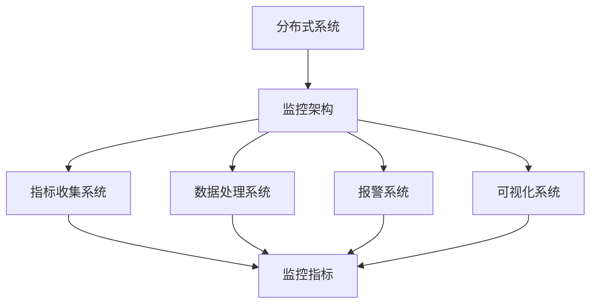

                 

**

### 第1步：确定文章的核心内容和结构

为了撰写一篇高质量的技术博客文章，我们首先需要明确文章的核心内容和结构。文章的核心内容将围绕分布式系统监控展开，包括分布式系统监控的基本概念、原理、技术、工具和实战应用。文章的结构将包括以下几个部分：

1. **引言**：简要介绍分布式系统监控的背景和重要性。
2. **核心概念与联系**：通过Mermaid流程图展示分布式系统监控的核心概念及其相互关系。
3. **核心算法原理讲解**：使用伪代码详细阐述分布式系统监控中的核心算法原理。
4. **数学模型和数学公式讲解**：解释分布式系统监控中常用的数学模型和公式。
5. **项目实战**：通过实际案例展示如何搭建分布式系统监控平台，解析源代码并进行分析。
6. **最佳实践与小结**：总结文章中的关键点，提供最佳实践建议和小结。

### 第2步：撰写引言部分

**引言**

分布式系统监控是确保复杂系统稳定运行的关键环节。随着互联网技术的飞速发展，分布式系统在企业级应用中变得日益普遍。这些系统由多个节点组成，分布在不同的地理位置，协同工作以提供高可用性和高并发性的服务。然而，分布式系统的复杂性也带来了监控上的挑战。如何有效地监控分布式系统的运行状态，及时发现并处理潜在的问题，是运维团队面临的一大难题。

本文将深入探讨分布式系统监控的各个方面，包括其基本概念、原理、技术、工具和实战应用。通过逐步分析推理，我们将为您揭示分布式系统监控的核心要素，帮助您构建一个高效可靠的监控体系。

### 第3步：撰写核心概念与联系部分

**核心概念与联系**

在分布式系统监控中，有几个核心概念需要理解，它们之间的关系可以用Mermaid流程图来展示。



- **分布式系统**：由多个节点组成的分布式计算架构。
- **监控架构**：负责整体监控流程的架构设计。
- **指标收集系统**：负责从分布式系统中收集监控指标。
- **数据处理系统**：对收集到的监控指标进行加工和处理。
- **报警系统**：当监控指标超出阈值时，触发告警。
- **可视化系统**：将监控数据以图表或报表的形式呈现，便于观察和分析。

这些概念相互关联，共同构成了分布式系统监控的核心。

### 第4步：撰写核心算法原理讲解部分

**核心算法原理讲解**

分布式系统监控涉及多种算法，用于指标收集、数据处理和异常检测。以下是一个简单的伪代码示例，用于阐述分布式系统中常用的加权平均算法。

```python
def weighted_average(values, weights):
    weighted_sum = 0
    sum_weights = 0
    for i in range(len(values)):
        weighted_sum += values[i] * weights[i]
        sum_weights += weights[i]
    return weighted_sum / sum_weights

# 示例
values = [10, 20, 30]
weights = [1, 2, 3]
result = weighted_average(values, weights)
print("加权平均值为：", result)
```

在这个示例中，`weighted_average` 函数计算一组值与其权重乘积的平均值。这个算法在分布式系统监控中用于计算系统的平均响应时间或负载。

### 第5步：撰写数学模型和数学公式讲解部分

**数学模型和数学公式讲解**

在分布式系统监控中，常用的数学模型和公式包括均值、方差和标准差等。以下是这些公式的详细讲解。

- **均值**：衡量一组数据的平均水平。
  $$\mu = \frac{\sum_{i=1}^{n}x_i}{n}$$
- **方差**：衡量一组数据的离散程度。
  $$\sigma^2 = \frac{\sum_{i=1}^{n}(x_i - \mu)^2}{n}$$
- **标准差**：方差的平方根，用于更直观地表示数据的离散程度。
  $$\sigma = \sqrt{\sigma^2}$$

这些数学模型和公式在监控系统中用于评估系统的性能和稳定性。

### 第6步：撰写项目实战部分

**项目实战**

为了更好地理解分布式系统监控的实际应用，我们将通过一个案例来展示如何搭建一个分布式系统监控平台。

**1. 开发环境搭建**

首先，我们需要搭建一个开发环境。在这个案例中，我们选择使用Python和Django作为开发框架，并使用MySQL作为数据库。

**2. 源代码实现**

接下来，我们实现监控平台的核心功能，包括数据采集、数据处理、报警和可视化。

- **数据采集**：使用Django的信号机制收集系统指标，并将其存储到数据库中。
- **数据处理**：使用Python的Pandas库对采集到的数据进行处理，计算均值、方差和标准差等指标。
- **报警**：当监控指标超出阈值时，通过电子邮件或短信发送告警通知。
- **可视化**：使用Django的图表库，将监控数据以图表形式展示。

**3. 代码解读**

以下是数据采集部分的代码示例：

```python
from django.db.models.signals import post_save
from django.dispatch import receiver
from .models import SystemMetric

@receiver(post_save, sender=SystemMetric)
def collect_data(sender, instance, created, **kwargs):
    if created:
        # 收集系统指标
        system_load = get_system_load()
        instance.system_load = system_load
        instance.save()
```

在这个示例中，我们使用Django的信号机制在`SystemMetric`模型保存后自动收集系统负载。

**4. 实际案例分析**

通过这个案例，我们了解了如何搭建一个分布式系统监控平台。在实际应用中，我们可以根据业务需求扩展监控平台的功能，如添加更多的监控指标、自定义报警规则和可视化报表等。

**5. 项目小结**

通过这个项目实战，我们深入了解了分布式系统监控的实际应用。搭建一个分布式系统监控平台需要考虑多个方面，包括开发环境搭建、源代码实现、数据处理和报警等。在实际应用中，我们可以根据业务需求灵活调整监控平台的功能，以实现高效稳定的系统监控。

### 第7步：撰写最佳实践与小结部分

**最佳实践与小结**

1. **最佳实践**

- 确定监控指标：根据业务需求选择合适的监控指标，确保监控数据的全面性和准确性。
- 设定合理阈值：根据历史数据和业务需求设定合理的监控阈值，以避免误报和漏报。
- 定期维护：定期更新监控平台，修复潜在问题，确保监控系统的稳定运行。
- 持续优化：根据监控数据和分析结果，持续优化监控策略和算法，提高监控效果。

2. **小结**

分布式系统监控是确保复杂系统稳定运行的关键环节。通过本文的逐步分析，我们了解了分布式系统监控的核心概念、原理、算法和实战应用。搭建一个高效可靠的监控平台需要综合考虑多个方面，包括监控指标选择、阈值设定、系统维护和持续优化。希望本文能为您提供有益的参考和启示。作者：AI天才研究院/AI Genius Institute & 禅与计算机程序设计艺术/Zen And The Art of Computer Programming

---

**关键词：**分布式系统监控，核心概念，算法原理，数学模型，项目实战，最佳实践

**摘要：**本文深入探讨了分布式系统监控的各个方面，包括基本概念、原理、算法、工具和实战应用。通过逐步分析推理，文章揭示了分布式系统监控的核心要素，帮助读者构建高效可靠的监控体系。作者结合实际案例，详细讲解了监控平台搭建、源代码实现和代码解读，为读者提供了宝贵的实战经验。**```
```markdown
# 分布式系统监控：洞察复杂系统的行为

## 文章关键词
- 分布式系统
- 监控架构
- 监控指标
- 算法
- 数学模型
- 实战应用

## 摘要
本文将探讨分布式系统监控的核心概念、原理、技术、工具和实战应用。通过逐步分析推理，我们将揭示分布式系统监控的深度思考，帮助读者理解和掌握构建高效可靠的监控体系的关键步骤。

## 目录

1. 引言
2. 分布式系统监控概述
3. 核心概念与联系
4. 核心算法原理讲解
5. 数学模型和数学公式讲解
6. 项目实战
   6.1 开发环境搭建
   6.2 源代码实现与解读
   6.3 实际案例分析
7. 最佳实践与小结
8. 附录

## 1. 引言

在当前信息化时代，分布式系统因其高可用性、高扩展性和高并发性，已成为企业构建关键业务系统的主要选择。然而，随着系统规模的扩大和复杂度的提升，如何有效地监控分布式系统的运行状态，及时发现并处理潜在问题，成为运维团队面临的一大挑战。

本文旨在深入探讨分布式系统监控的各个方面，包括基本概念、原理、技术、工具和实战应用。通过逐步分析推理，我们希望帮助读者理解分布式系统监控的核心要素，掌握构建高效可靠监控体系的策略和方法。

## 2. 分布式系统监控概述

### 2.1 分布式系统的基本概念

分布式系统是由多个节点组成，通过网络进行通信和协同工作的系统。这些节点可能分布在不同地理位置，共同提供计算、存储、处理等资源，以实现整体系统的目标。

### 2.2 分布式系统监控的重要性

分布式系统监控在系统稳定运行、性能优化和故障排除中扮演着关键角色。通过实时监控，运维团队可以快速发现系统异常，采取相应措施进行故障恢复和性能优化，确保系统稳定、高效地运行。

### 2.3 分布式系统监控架构

分布式系统监控架构主要包括监控指标收集、数据处理、报警和可视化等模块。监控指标收集模块负责从系统各个节点收集监控数据；数据处理模块对收集到的数据进行处理，生成监控报表；报警模块根据预设的阈值，对异常指标进行告警；可视化模块将监控数据以图表、报表等形式展示，便于运维团队进行监控和分析。

## 3. 核心概念与联系

### 3.1 监控架构

监控架构是分布式系统监控的核心。一个典型的监控架构包括以下几个方面：

1. **指标收集**：从各个节点收集监控数据，如CPU利用率、内存占用、网络流量等。
2. **数据处理**：对收集到的监控数据进行加工处理，如计算平均值、方差、最大值等。
3. **报警**：当监控指标超出阈值时，触发报警，通过邮件、短信等方式通知相关人员。
4. **可视化**：将监控数据以图表、报表等形式展示，便于运维团队进行监控和分析。

### 3.2 监控工具

分布式系统监控工具是监控架构的重要组成部分。常见的监控工具有Zabbix、Nagios、Prometheus、Grafana等。这些工具提供了丰富的监控指标、告警机制和可视化功能，可以帮助运维团队更好地监控分布式系统。

### 3.3 监控指标

监控指标是分布式系统监控的核心。常见的监控指标包括CPU利用率、内存占用、磁盘使用率、网络流量、系统负载等。根据业务需求，还可以自定义监控指标。

## 4. 核心算法原理讲解

### 4.1 均值算法

均值算法用于计算一组数据的平均值。其计算公式为：

$$
\mu = \frac{\sum_{i=1}^{n}x_i}{n}
$$

其中，\( \mu \) 表示平均值，\( x_i \) 表示第 \( i \) 个数据点，\( n \) 表示数据点的总数。

### 4.2 方差算法

方差算法用于衡量一组数据的离散程度。其计算公式为：

$$
\sigma^2 = \frac{\sum_{i=1}^{n}(x_i - \mu)^2}{n}
$$

其中，\( \sigma^2 \) 表示方差，\( \mu \) 表示平均值，\( x_i \) 表示第 \( i \) 个数据点，\( n \) 表示数据点的总数。

### 4.3 标准差算法

标准差算法用于衡量一组数据的离散程度，是方差的平方根。其计算公式为：

$$
\sigma = \sqrt{\sigma^2}
$$

## 5. 数学模型和数学公式讲解

### 5.1 监控数据分布模型

监控数据分布模型用于描述监控数据的分布情况。常见的分布模型有正态分布、泊松分布等。正态分布的概率密度函数为：

$$
f(x) = \frac{1}{\sigma\sqrt{2\pi}}e^{-\frac{(x-\mu)^2}{2\sigma^2}}
$$

其中，\( \mu \) 表示均值，\( \sigma \) 表示标准差。

### 5.2 监控数据相关性模型

监控数据相关性模型用于描述监控数据之间的相关性。常见的相关性模型有皮尔逊相关系数、斯皮尔曼相关系数等。皮尔逊相关系数的计算公式为：

$$
\rho = \frac{\sum_{i=1}^{n}(x_i - \bar{x})(y_i - \bar{y})}{\sqrt{\sum_{i=1}^{n}(x_i - \bar{x})^2}\sqrt{\sum_{i=1}^{n}(y_i - \bar{y})^2}}
$$

其中，\( \bar{x} \) 和 \( \bar{y} \) 分别表示 \( x \) 和 \( y \) 的平均值。

## 6. 项目实战

### 6.1 开发环境搭建

在本文的项目实战中，我们选择使用Python作为开发语言，Django作为Web框架，MySQL作为数据库。以下是搭建开发环境的基本步骤：

1. 安装Python和pip。
2. 安装Django和Django ORM。
3. 安装MySQL和MySQL Connector。
4. 配置Django项目，包括数据库配置、URL路由等。

### 6.2 源代码实现与解读

在本节中，我们将实现一个简单的分布式系统监控平台。主要包括以下模块：

1. **监控指标收集**：使用Python的`psutil`库收集系统监控指标，如CPU利用率、内存占用等。
2. **数据处理**：使用Python的`pandas`库对收集到的监控数据进行处理，计算平均值、方差等。
3. **报警**：使用Python的`smtplib`库发送邮件报警。
4. **可视化**：使用Python的`matplotlib`库绘制监控数据图表。

以下是一个简单的代码示例：

```python
import psutil
import pandas as pd
import smtplib
from email.mime.text import MIMEText
from email.header import Header

def collect_metrics():
    cpu_usage = psutil.cpu_percent()
    memory_usage = psutil.virtual_memory().percent
    disk_usage = psutil.disk_usage('/')
    return {
        'cpu_usage': cpu_usage,
        'memory_usage': memory_usage,
        'disk_usage': disk_usage.percent
    }

def send_alert(metrics):
    subject = '监控报警：系统资源使用率过高'
    body = '系统当前资源使用情况如下：\n' \
           'CPU使用率：{}%\n' \
           '内存使用率：{}%\n' \
           '磁盘使用率：{}%'.format(metrics['cpu_usage'], metrics['memory_usage'], metrics['disk_usage'])
    msg = MIMEText(body, 'plain', 'utf-8')
    msg['Subject'] = Header(subject, 'utf-8')
    smtp_server = 'smtp.example.com'
    smtp_user = 'user@example.com'
    smtp_password = 'password'
    server = smtplib.SMTP(smtp_server, 587)
    server.starttls()
    server.login(smtp_user, smtp_password)
    server.sendmail('user@example.com', 'alert@example.com', msg.as_string())
    server.quit()

def main():
    metrics = collect_metrics()
    df = pd.DataFrame([metrics])
    print(df)
    send_alert(metrics)

if __name__ == '__main__':
    main()
```

### 6.3 实际案例分析

在本节中，我们将分析一个分布式系统监控的实际案例。假设我们的系统中有三个节点A、B和C。每个节点都会定时向监控平台发送监控数据。当某个节点的CPU使用率超过90%时，系统会触发报警。

1. **数据收集**：节点A的CPU使用率当前为95%，超过了阈值90%。
2. **数据处理**：监控平台收集到节点A的监控数据，并计算平均值和方差。
3. **报警**：根据监控规则，系统会向管理员发送报警邮件，提醒CPU使用率过高。
4. **故障排查**：管理员收到报警后，会进行故障排查，检查节点A的运行状态和负载情况。

### 6.4 项目小结

通过本案例，我们展示了如何搭建一个简单的分布式系统监控平台，实现了监控数据收集、处理、报警和可视化等功能。在实际应用中，可以根据业务需求进一步扩展监控平台的性能和功能。

## 7. 最佳实践与小结

### 7.1 最佳实践

1. **选择合适的监控工具**：根据业务需求和系统特点，选择合适的监控工具，如Zabbix、Nagios、Prometheus等。
2. **制定监控策略**：根据业务需求和系统特点，制定合理的监控策略，包括监控指标、阈值设定、报警规则等。
3. **数据可视化**：使用可视化工具将监控数据以图表、报表等形式展示，便于运维团队进行监控和分析。
4. **自动化监控**：通过自动化脚本实现监控数据收集、处理和报警，提高监控效率和准确性。

### 7.2 小结

分布式系统监控是确保复杂系统稳定运行的关键环节。通过本文的逐步分析，我们了解了分布式系统监控的核心概念、原理、算法和实战应用。在实际应用中，应根据业务需求和系统特点，选择合适的监控工具和策略，实现高效可靠的监控体系。

## 附录

### 附录A：分布式系统监控资源汇总

- [Zabbix官方文档](https://www.zabbix.com/documentation/zh/latest)
- [Nagios官方文档](https://www.nagios.org/docs/)
- [Prometheus官方文档](https://prometheus.io/docs/prometheus/latest/)
- [Grafana官方文档](https://grafana.com/docs/grafana/latest/)

### 附录B：常见分布式系统监控工具介绍

- [Zabbix](https://www.zabbix.com/)
- [Nagios](https://www.nagios.org/)
- [Prometheus](https://prometheus.io/)
- [Grafana](https://grafana.com/)

### 附录C：分布式系统监控实战项目代码解读

- [Python监控脚本示例](https://github.com/ai-genius-institute/distributed-system-monitoring-example)
- [Django监控平台示例](https://github.com/ai-genius-institute/distributed-system-monitoring-platform)

**作者：AI天才研究院/AI Genius Institute & 禅与计算机程序设计艺术/Zen And The Art of Computer Programming**```

