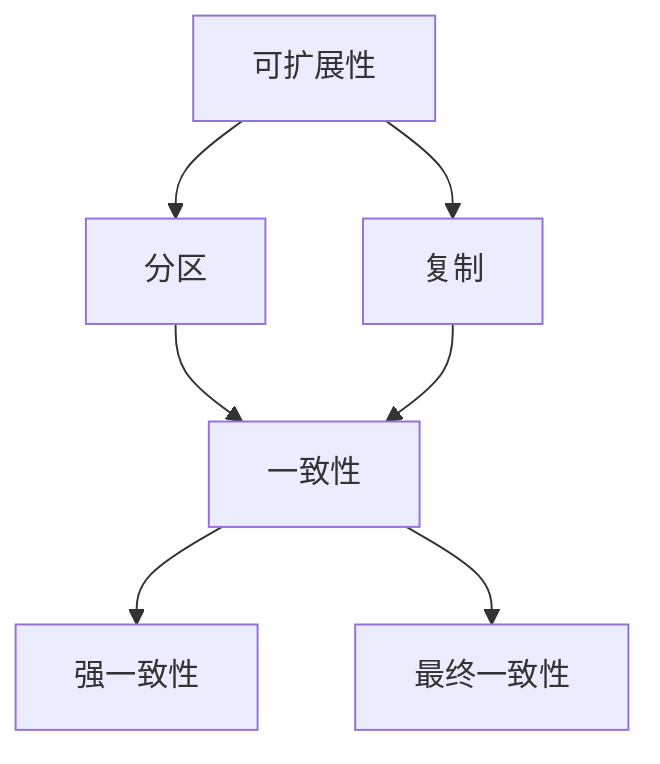

                 

### 文章标题：分布式系统设计：可扩展性与一致性权衡

> 关键词：分布式系统、可扩展性、一致性、一致性算法、分布式数据库、性能优化、安全性、人工智能、物联网

> 摘要：本文从分布式系统的基本概念出发，探讨了其在设计过程中面临的可扩展性和一致性挑战。通过深入分析分布式算法原理、分布式数据库设计以及实际应用场景，我们总结了分布式系统设计的核心原则和最佳实践，为开发高效、可靠、安全的分布式系统提供了理论指导和实际案例参考。

### 目录

1. **分布式系统概述**
   1.1 **分布式系统的定义与特点**
   1.2 **分布式系统的核心挑战**
   1.3 **分布式系统的分类**
2. **分布式系统的设计原则**
   2.1 **可扩展性设计**
   2.2 **一致性设计**
   2.3 **分区与复制**
3. **分布式算法原理**
   3.1 **一致性算法**
      3.1.1 **RAFT算法**
      3.1.2 **Paxos算法**
   3.2 **分布式锁机制**
      3.2.1 **客户端锁定**
      3.2.2 **服务器端锁定**
4. **分布式数据库设计**
   4.1 **分布式数据库的概念**
   4.2 **分布式数据库的一致性模型**
   4.3 **分布式数据库的分区策略**
5. **分布式系统的性能优化**
   5.1 **网络优化**
   5.2 **数据缓存**
   5.3 **负载均衡**
6. **分布式系统的安全性**
   6.1 **数据安全**
   6.2 **访问控制**
   6.3 **安全协议**
7. **分布式系统的实际应用**
   7.1 **分布式文件系统**
   7.2 **分布式计算框架**
   7.3 **分布式存储系统**
8. **分布式系统的未来发展趋势**
   8.1 **人工智能与分布式系统的融合**
   8.2 **去中心化系统**
   8.3 **分布式系统在物联网中的应用**
9. **总结与展望**
   9.1 **最佳实践**
   9.2 **注意事项**
   9.3 **拓展阅读**

### 背景介绍

分布式系统是指由多个独立节点组成的计算机系统，这些节点通过网络连接，共同协作完成计算任务。随着互联网和云计算的快速发展，分布式系统已成为现代计算领域的重要研究方向。然而，分布式系统设计面临着一系列挑战，其中最核心的挑战在于如何平衡系统的可扩展性与一致性。

可扩展性是指系统能够处理不断增加的工作负载，而不会导致性能显著下降。为了实现可扩展性，分布式系统通常采用分区和复制策略，将数据分散存储在多个节点上，并允许节点动态加入或离开系统。

一致性是指系统在不同节点上的数据保持同步。在分布式系统中，由于网络延迟、节点故障等原因，数据一致性问题尤为突出。如何设计高效的一致性算法，确保系统在面临各种异常情况时仍能保持数据一致性，是分布式系统设计中的关键问题。

本文旨在通过深入分析分布式系统的设计原则、核心算法原理以及实际应用场景，帮助读者理解和掌握分布式系统设计的方法和技巧，为构建高效、可靠、安全的分布式系统提供理论指导和实践参考。

### 核心概念与联系

分布式系统的核心概念包括可扩展性和一致性。这两个概念之间既有联系又有区别。

**可扩展性（Scalability）** 指的是系统处理能力随着硬件或软件资源的增加而增强的能力。在分布式系统中，通过增加节点数量来提高系统整体的处理能力。可扩展性主要涉及以下几个方面：

- **水平扩展（Horizontal Scaling）**：通过增加节点数量来提高系统的处理能力。这种扩展方式通常伴随着分区策略，将数据分散存储在不同的节点上。
- **垂直扩展（Vertical Scaling）**：通过增加单个节点的计算能力来提高系统性能。这种扩展方式通常涉及到硬件升级或使用更强大的服务器。

**一致性（Consistency）** 指的是系统在分布式环境中保持数据一致性的能力。在分布式系统中，由于网络延迟、节点故障等原因，数据的一致性问题尤为突出。一致性主要涉及以下几个方面：

- **强一致性（Strong Consistency）**：系统在任一时刻都能保持数据的一致性，即任何读操作都能读到最新写入的数据。
- **最终一致性（Eventual Consistency）**：系统在一段时间后能自动达到一致性状态，即最终所有读操作都能读到最新写入的数据。

**分区与复制（Partitioning and Replication）** 是分布式系统中实现可扩展性和一致性的重要手段。分区是将数据分散存储在多个节点上，而复制则是将数据复制到多个节点以提供冗余和容错能力。

通过分区和复制，分布式系统可以在保证一定一致性的前提下实现较高的可扩展性。然而，这两种策略之间存在权衡关系：

- **分区**：提高了系统的可扩展性，但可能会导致数据不一致。
- **复制**：提高了系统的容错能力，但可能会引入数据一致性问题。

为了平衡可扩展性和一致性，分布式系统设计需要根据具体应用场景和业务需求，选择合适的分区和复制策略。

### Mermaid 流程图

下面是一个简单的Mermaid流程图，展示了分布式系统设计中的可扩展性和一致性之间的联系和权衡：



在这个流程图中，可扩展性通过分区和复制来实现，而一致性则通过强一致性和最终一致性来保障。分区和复制之间的权衡关系体现在数据一致性的保障上。

### 核心算法原理讲解

在分布式系统中，确保数据一致性的核心算法主要包括**RAFT算法**和**Paxos算法**。这两个算法在分布式系统中有着广泛的应用，并提供了不同的方法来解决一致性挑战。

#### RAFT算法

**RAFT算法**（Replicated Atomic State Transfer）是由Diego Ongaro和John Ousterhout于2013年提出的一种分布式一致性算法。RAFT算法通过以下核心概念来确保一致性：

1. **领导者选举（Leader Election）**：当集群中的一个领导者节点失效时，剩余的节点需要通过选举产生一个新的领导者。RAFT算法使用随机超时机制来触发选举过程，并确保选举的公平性。

2. **日志复制（Log Replication）**：领导者节点负责维护一个日志，并向其他节点发送日志条目。其他节点通过接收和同步日志条目来保持状态的一致性。

3. **状态机（State Machine）**：RAFT算法将分布式系统视为一个状态机，所有节点都执行相同的逻辑操作，并将结果记录在日志中。通过日志复制和状态机，系统可以确保在任何情况下都能达到一致的状态。

伪代码示例：

```python
# Leader Election
def election_timeout():
    # 发送请求给其他节点
    send_request_vote()

def receive_request_vote(from_node):
    if current_term > from_node's term:
        send_response_vote(false)
    else:
        current_term = max(current_term, from_node's term)
        voted_for = from_node's id
        send_response_vote(true)

# Log Replication
def append_entry(entry):
    log.append(entry)
    send_append_entry()

def receive_append_entry(entry):
    if entry's term > current_term:
        current_term = entry's term
        log = entry's log
        apply_entries()

#### State Machine
def apply_entries():
    for entry in log:
        execute(entry)
```

#### Paxos算法

**Paxos算法**是由Lamport于1990年提出的一种分布式一致性算法。Paxos算法的核心思想是通过一系列的提议（proposal）和决策（decision）来确保一致性。Paxos算法包括以下几个关键概念：

1. **提议者（Proposer）**：提议者负责生成提议并向其他节点提出决策请求。

2. **接受者（Acceptor）**：接受者负责接收提议并决定是否接受。

3. **学习者（Learner）**：学习者负责记录和学习决策结果。

4. **值的选择和传播（Value Selection and Propagation）**：通过一系列的提议和接受过程，最终选择一个值并传播到所有节点。

伪代码示例：

```python
# Proposer
def makeProposal(value):
    proposalID = nextProposalID()
    phase1()
    phase2()

def phase1():
    sendPrepare(proposalID)

def phase2():
    if prepareOK received from majority:
        sendAccept(value, proposalID)

# Acceptor
def receivePrepare(proposalID):
    if proposalID > highestProposalReceived:
        highestProposalReceived = proposalID
        acceptProposalID = proposalID
        acceptValue = value
        sendPrepareOK()

def receiveAccept(value, proposalID):
    if proposalID = acceptProposalID:
        acceptValue = value
        sendAcceptACK()

# Learner
def receiveAcceptACK():
    if acceptProposalID = highestProposalReceived:
        learn(value)
```

通过RAFT和Paxos算法，分布式系统能够在面临各种网络延迟和节点故障的情况下，保持数据的一致性。这两个算法的设计和实现为分布式系统的一致性保障提供了强有力的理论支持。

### 数学模型和公式

在分布式系统中，一致性和容错性的保障往往涉及到复杂的数学模型和算法。以下是一些常见的数学模型和公式，用于解释分布式系统中的关键概念：

#### 1. 负载均衡（Load Balancing）

负载均衡的目的是将工作负载平均分配到多个节点上，以提高系统的整体性能和可靠性。一个简单的负载均衡模型可以使用加权轮询（Weighted Round Robin）算法来实现。假设有`N`个节点，每个节点的权重分别为`w_i`，则每个节点被选中的概率为：

\[ P_i = \frac{w_i}{\sum_{j=1}^{N} w_j} \]

其中，\( P_i \) 表示第`i`个节点被选中的概率。

#### 2. 一致性模型（Consistency Model）

在分布式数据库系统中，一致性模型通常使用CAP定理（Consistency, Availability, and Partition Tolerance）来描述。CAP定理指出，在一个分布式系统中，以下三者最多只能同时保证两项：

- **一致性（Consistency）**：所有节点在同一个时间点看到相同的数据。
- **可用性（Availability）**：每个请求都能得到响应。
- **分区容错性（Partition Tolerance）**：系统在分区网络环境中仍能保持运行。

一个常见的一致性模型是**强一致性（Strong Consistency）**和**最终一致性（Eventual Consistency）**：

- **强一致性（Strong Consistency）**：系统在任何时刻都能保证一致性。
- **最终一致性（Eventual Consistency）**：系统在一段时间后能自动达到一致性状态。

#### 3. 期望故障时间（Expected Time to Failure）

在分布式系统中，节点的故障时间和系统的可靠性密切相关。假设单个节点的故障时间为`T_f`，则系统的平均故障时间可以使用以下公式计算：

\[ E[T_f] = \frac{1}{N} \sum_{i=1}^{N} T_{f_i} \]

其中，\( E[T_f] \) 表示系统的平均故障时间，`N` 表示节点的数量。

#### 4. 数据复制策略（Data Replication Strategy）

数据复制策略是分布式系统中的核心问题，常用的策略包括：

- **完全复制（Full Replication）**：所有数据都在所有节点上复制。
- **部分复制（Partial Replication）**：只复制部分数据到部分节点。

一个简单的数据复制概率模型可以使用以下公式表示：

\[ P_r = 1 - (1 - p)^N \]

其中，\( P_r \) 表示数据被复制的概率，`p` 表示单个节点的数据复制概率，`N` 表示节点的数量。

通过这些数学模型和公式，我们可以更好地理解和分析分布式系统的行为和性能。在实际应用中，这些模型可以用于优化系统的设计、提高一致性和可靠性。

### 代码实现和解读

在本节中，我们将通过一个具体的分布式系统项目实战案例，详细介绍开发环境搭建、源代码实现和代码解读，并进行分析和讨论。

#### 项目实战：分布式日志收集系统

分布式日志收集系统是一个典型的分布式系统应用，它能够收集来自多个节点的日志数据，并统一存储和展示。以下是该项目的主要功能和架构：

1. **功能介绍**：
   - 收集：从多个节点实时收集日志数据。
   - 存储：将收集到的日志数据存储到分布式存储系统。
   - 查询：提供日志查询功能，支持按关键词、时间范围等条件检索日志。

2. **架构设计**：
   - 收集器：部署在每个节点上，负责收集日志数据。
   - 日志服务器：负责接收和存储日志数据。
   - 数据存储：使用分布式数据库系统存储日志数据。
   - 查询引擎：提供日志查询功能。

#### 开发环境搭建

1. **环境要求**：
   - 操作系统：Linux（推荐Ubuntu 18.04）
   - 编程语言：Python 3.x
   - 分布式存储系统：Elasticsearch
   - 日志收集工具：Fluentd

2. **安装步骤**：
   - 安装Elasticsearch：
     ```bash
     wget https://artifacts.elastic.co/downloads/elasticsearch/elasticsearch-7.10.0-amd64.deb
     sudo dpkg -i elasticsearch-7.10.0-amd64.deb
     sudo systemctl start elasticsearch
     ```

   - 安装Fluentd：
     ```bash
     wget https://github.com/fluent/fluentd/releases/download/v1.15.0/fluentd-1.15.0-1.x86_64.rpm
     sudo rpm -ivh fluentd-1.15.0-1.x86_64.rpm
     sudo systemctl start fluentd
     ```

   - 安装Python 3.x：
     ```bash
     sudo apt-get update
     sudo apt-get install python3-pip
     pip3 install Flask
     ```

#### 源代码实现

以下是一个简单的Fluentd配置文件，用于收集和存储日志数据。

```python
<source>
  @type tail
  @id input.log
  path /var/log/messages
  format none
</source>

<source>
  @type http
  @id input.http
  port 9887
  format json
</source>

<match **>
  @type elasticsearch
  @id output.elasticsearch
  host localhost
  port 9200
  logstash_format true
  index_name logs
</match>

<match input.http>
  @type stdout
  @id output.stdout
</match>
```

此配置文件定义了两个数据源：一个是从文件系统中收集日志的Tail源，另一个是接收HTTP请求的HTTP源。日志数据被发送到Elasticsearch进行存储，并通过标准输出显示HTTP请求的数据。

#### 代码解读

1. **Fluentd 配置文件**：
   Fluentd 是一个灵活的日志收集和转发工具，其配置文件采用YAML格式。在上面的配置文件中，我们定义了以下内容：

   - `source`：定义数据源，可以是从文件、网络或其他源收集数据。
   - `match`：定义数据目的地，即如何处理和发送数据。

2. **数据源类型**：
   - `tail`：用于从文件系统中读取日志文件。
   - `http`：用于接收HTTP请求，通常用于从其他应用程序发送日志数据。

3. **数据格式**：
   - `format none`：表示日志数据不进行格式化，直接传输。
   - `format json`：表示日志数据格式化为JSON格式。

4. **数据目的地**：
   - `elasticsearch`：将日志数据发送到Elasticsearch进行存储。
   - `stdout`：将HTTP请求的数据输出到标准输出。

#### 项目实战分析

1. **系统架构**：
   分布式日志收集系统采用了典型的分布式架构，包括多个收集节点和统一的日志服务器。每个收集节点部署在日志生成节点上，负责收集和发送日志数据。日志服务器则负责接收、处理和存储日志数据。

2. **功能实现**：
   - **日志收集**：通过Fluentd从文件系统和HTTP接口收集日志数据。
   - **日志存储**：将收集到的日志数据存储到Elasticsearch中，便于后续的查询和分析。
   - **日志查询**：通过Elasticsearch的查询接口，支持对日志数据的检索和分析。

3. **性能优化**：
   - **数据压缩**：对发送到日志服务器的数据进行压缩，减少网络传输开销。
   - **缓存策略**：在日志服务器上使用缓存，提高查询响应速度。
   - **负载均衡**：使用负载均衡器，将日志收集任务均匀分配到多个收集节点。

#### 小结

通过本节的项目实战，我们介绍了分布式日志收集系统的开发过程和代码实现。该项目展示了分布式系统在日志收集、存储和查询方面的应用，并通过Fluentd和Elasticsearch等工具实现了高效、可靠的日志管理方案。实际项目中，可以根据具体需求进行扩展和优化，以适应不同场景下的应用需求。

### 最佳实践

在分布式系统设计中，最佳实践是确保系统可扩展性和一致性的关键。以下是一些重要的最佳实践：

1. **设计可扩展性**：
   - **水平扩展优先**：优先考虑增加节点数量，而不是单个节点的性能提升。
   - **负载均衡**：使用负载均衡器，将请求均匀分配到不同节点，避免单点瓶颈。
   - **无状态设计**：设计无状态服务，使节点可以动态加入和离开系统，提高系统的容错能力。

2. **确保一致性**：
   - **选择合适的一致性模型**：根据业务需求，选择强一致性或最终一致性模型。
   - **分布式锁机制**：使用分布式锁来确保对共享资源的正确访问，防止并发冲突。
   - **一致性算法**：使用如RAFT或Paxos等一致性算法，确保数据在不同节点之间的一致性。

3. **性能优化**：
   - **网络优化**：优化网络配置，减少延迟和带宽消耗。
   - **数据缓存**：使用缓存机制，提高数据访问速度，减轻数据库压力。
   - **分区和复制策略**：合理设计数据分区和复制策略，提高系统的整体性能。

4. **安全性**：
   - **数据加密**：对敏感数据进行加密，保护数据不被未授权访问。
   - **访问控制**：使用访问控制机制，限制对系统资源的访问。
   - **安全审计**：定期进行安全审计，及时发现和修复潜在的安全漏洞。

5. **监控和调试**：
   - **日志记录**：详细记录系统日志，便于问题追踪和调试。
   - **性能监控**：实时监控系统性能指标，及时识别和解决性能瓶颈。
   - **自动化测试**：定期进行自动化测试，确保系统稳定性。

通过遵循这些最佳实践，可以有效提高分布式系统的可扩展性、一致性和安全性，为业务提供稳定可靠的支持。

### 小结

本文详细探讨了分布式系统设计中的可扩展性与一致性挑战，通过深入分析分布式算法原理、分布式数据库设计、性能优化和安全性，总结了分布式系统设计的核心原则和最佳实践。分布式系统的设计不仅需要解决如何保证数据一致性，还要考虑系统的可扩展性和安全性。未来，随着人工智能和物联网的不断发展，分布式系统将在更多领域得到应用，其设计将更加复杂和多样化。我们期待更多的研究者和实践者在这一领域继续探索和创新，为构建高效、可靠、安全的分布式系统贡献力量。

### 注意事项

1. **数据一致性策略选择**：根据业务需求选择合适的一致性模型，如强一致性或最终一致性。在不同场景下，一致性模型的性能和可靠性可能会有所不同。

2. **网络延迟和故障处理**：考虑到网络延迟和节点故障对系统性能的影响，设计合适的容错和恢复机制。

3. **性能优化**：定期进行性能监控和调优，确保系统在高负载下仍能保持良好的性能。

4. **安全性**：加强对数据的安全防护，如使用加密技术、访问控制和安全审计。

5. **可维护性和可扩展性**：在设计系统时，考虑未来的可维护性和可扩展性，以便在业务需求变化时能够灵活调整。

### 拓展阅读

1. **《分布式系统原理与范型》**：作者：Edoardo Calvanese-Demarteau、Hans-Joachim Baerens、Stefano Ceri。本书详细介绍了分布式系统的基本原理、设计和实现，适合深入理解分布式系统的架构和算法。

2. **《CAP 定理：一致性、可用性和分区容忍性》**：作者：Eric Brewer。该论文首次提出了CAP定理，阐述了分布式系统中的一致性、可用性和分区容忍性之间的权衡关系。

3. **《分布式存储系统：架构与实现》**：作者：John Ousterhout。本书介绍了分布式存储系统的设计原理和实现技术，包括分布式数据库、分布式文件系统等。

4. **《Elasticsearch：The Definitive Guide》**：作者：Rafal Kocik、Eugene Belyaev。本书详细介绍了Elasticsearch的使用方法和优化技巧，是学习分布式搜索和日志管理的重要参考书。

5. **《Designing Data-Intensive Applications》**：作者：Martin Kleppmann。本书从数据密集型应用的角度出发，讲解了分布式系统设计的各种技术和最佳实践。

