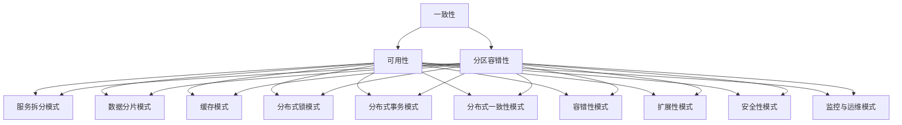

                 


## 分布式系统设计模式：解决常见架构挑战

### 关键词：
- 分布式系统
- 设计模式
- 架构挑战
- 一致性
- 可用性
- 分区容错性
- 服务拆分
- 数据分片
- 缓存
- 分布式锁
- 分布式事务

### 摘要：
分布式系统作为现代软件架构的核心，承载了海量数据和高并发处理的任务。本文将探讨分布式系统的设计模式，重点分析解决常见架构挑战的策略，包括服务拆分、数据分片、缓存、分布式锁、分布式事务和一致性等，并通过具体的案例和实践指导，帮助开发者深入了解分布式系统设计的原理和实战技巧。

### 第一部分：分布式系统基础知识

## 第1章：分布式系统概述
### 1.1 分布式系统的定义与特点
分布式系统是一组互相独立、通过网络连接的计算节点组成的系统，这些节点协同工作以实现共同的目标。其主要特点包括并行计算、可扩展性和容错性。

### 1.2 分布式系统面临的主要挑战
分布式系统面临的主要挑战有数据一致性、系统可用性、分布式事务处理、网络延迟和分区容错性。

### 1.3 分布式系统的重要性
分布式系统对于提高数据处理能力、扩展性和可靠性至关重要，尤其是在大数据和云计算领域。

### 第2章：分布式系统原理
### 2.1 CAP 定理
CAP 定理指出，在分布式系统中一致性（Consistency）、可用性（Availability）和分区容错性（Partition tolerance）三者中，只能同时满足两个。

### 2.2 BASE 理论
BASE 理论是针对 CAP 定理的一种折中方案，强调基本可用性（Basic Availability）、软状态（Soft State）和最终一致性（Eventual Consistency）。

### 2.3 分布式一致性算法
分布式一致性算法是保证分布式系统数据一致性的关键，常见的算法有 Paxos、Raft 和 Zab 等。

## 第二部分：分布式系统设计模式

### 第3章：服务拆分模式
### 3.1 服务拆分的必要性
服务拆分是将大型单体应用拆分成多个小型服务的过程，可以提高系统的扩展性和维护性。

### 3.2 服务拆分的方法
服务拆分可以通过接口定义、服务注册与发现、服务通信协议等技术实现。

### 3.3 服务拆分的实践
在实际开发中，服务拆分可以通过 Spring Cloud、Dubbo 等框架来实现。

### 第4章：数据分片模式
### 4.1 数据分片的必要性
数据分片是将大量数据分布在多个节点上存储和处理，以应对大数据量和高并发场景。

### 4.2 数据分片策略
数据分片可以通过哈希分片、范围分片、列表分片等策略实现。

### 4.3 数据分片的实践
数据分片在实践中可以通过 Redis、MongoDB 等分布式数据库实现。

### 第5章：缓存模式
### 5.1 缓存的作用
缓存是提高系统性能的重要手段，通过减少数据库访问次数来加快数据读取速度。

### 5.2 缓存策略
缓存策略包括缓存一致性、缓存更新、缓存淘汰等。

### 5.3 缓存的实践
缓存实践可以通过 Redis、Memcached 等缓存系统来实现。

### 第6章：分布式锁模式
### 6.1 分布式锁的概念
分布式锁是控制分布式环境下多个进程或线程对共享资源进行访问的一种机制。

### 6.2 分布式锁的实现
分布式锁可以通过 ZooKeeper、Redis 等实现。

### 6.3 分布式锁的实践
分布式锁在实践中可以通过 Redisson、ZooKeeper 实现锁机制。

### 第7章：分布式事务模式
### 7.1 分布式事务的定义
分布式事务是在分布式系统中，对多个数据库操作进行统一管理的机制。

### 7.2 分布式事务的实现
分布式事务可以通过两阶段提交（2PC）、三阶段提交（3PC）等实现。

### 7.3 分布式事务的实践
分布式事务在实践中可以通过 TCC（Try-Confirm-Cancel）等方式实现。

### 第8章：分布式一致性模式
### 8.1 一致性的重要性
一致性是分布式系统设计中的核心问题，保证数据的一致性至关重要。

### 8.2 分布式一致性算法
分布式一致性算法包括 Paxos、Raft 等。

### 8.3 分布式一致性的实践
分布式一致性在实践中可以通过 ZooKeeper、Consul 等实现。

## 第三部分：分布式系统常见架构挑战与解决方案

### 第9章：分布式系统容错性
### 9.1 容错性的必要性
容错性是分布式系统应对节点故障的重要手段。

### 9.2 分布式系统的容错机制
分布式系统的容错机制包括数据备份、故障转移、集群管理等。

### 9.3 分布式系统容错性的实践
分布式系统容错性在实践中可以通过 Kubernetes、Zookeeper 等实现。

### 第10章：分布式系统扩展性
### 10.1 扩展性的重要性
扩展性是分布式系统应对高并发、大数据量的关键。

### 10.2 分布式系统的扩展策略
分布式系统的扩展策略包括水平扩展、垂直扩展等。

### 10.3 分布式系统扩展性的实践
分布式系统扩展性在实践中可以通过 Docker、Kubernetes 等实现。

### 第11章：分布式系统安全性
### 11.1 安全性的必要性
安全性是分布式系统设计中的重要一环，保障系统的安全性至关重要。

### 11.2 分布式系统的安全策略
分布式系统的安全策略包括身份认证、权限控制、数据加密等。

### 11.3 分布式系统安全性的实践
分布式系统安全性在实践中可以通过 SSL/TLS、OAuth 等实现。

### 第12章：分布式系统监控与运维
### 12.1 监控与运维的重要性
监控与运维是保障分布式系统稳定运行的关键。

### 12.2 分布式系统的监控工具
分布式系统的监控工具包括 Prometheus、Grafana 等。

### 12.3 分布式系统的运维实践
分布式系统的运维实践包括自动化部署、弹性伸缩等。

## 附录

### 附录A：分布式系统设计模式总结
对分布式系统设计模式进行总结，帮助开发者快速掌握设计原则。

### 附录B：分布式系统常用框架介绍
介绍分布式系统中常用的框架，如 Dubbo、ZooKeeper、Kafka 等。

### 附录C：分布式系统常见问题及解决方案
针对分布式系统中常见的问题，提供解决方案和实践经验。

**核心概念与联系：**

```mermaid
graph TB
A[CAP定理] --> B[一致性(C)]
A --> C[可用性(A)]
A --> D[分区容错性(P)]
B --> E[一致性弱化]
C --> F[可用性弱化]
D --> G[分区容忍性增强]
E --> H[BASE理论]
F --> I[最终一致性]
G --> J[分布式一致性算法]
```

**核心算法原理讲解：**

```python
# 分布式一致性算法伪代码
function consensusAlgorithm(data, peers):
    for peer in peers:
        send(data, peer)
    for peer in peers:
        if received(peer) == data:
            return "Consensus achieved"
    return "Consensus failed"
```

**数学模型和数学公式 & 详细讲解 & 举例说明：**

$$
CAP \ 定理：
CAP \ 理论 \ 描述了在分布式系统中，一致性（Consistency）、可用性（Availability）和分区容错性（Partition tolerance）三者之间只能同时满足两个，无法同时满足三者。
$$

**项目实战：**

**代码实际案例和详细解释说明：**（代码示例）

```java
// 分布式锁示例代码
public class DistributedLock {
    private ZooKeeper zk;

    public DistributedLock(ZooKeeper zk) {
        this.zk = zk;
    }

    public void lock(String lockPath) throws InterruptedException {
        String myLockPath = zk.create(lockPath + "/lock-", null, ZooKeeper.CreateMode.EPHEMERAL_SEQUENTIAL);
        List<String> children = zk.getChildren(lockPath, false);
        List<String> sortedChildren = sortChildren(children);
        if (myLockPath.equals(sortedChildren.get(0))) {
            zk.delete(myLockPath, -1);
        } else {
            synchronized (this) {
                this.wait();
            }
        }
    }

    public void unlock(String lockPath) {
        zk.delete(lockPath, -1);
    }

    private List<String> sortChildren(List<String> children) {
        List<String> sortedChildren = new ArrayList<>(children);
        Collections.sort(sortedChildren);
        return sortedChildren;
    }
}
```

**最佳实践 tips、小结、注意事项、拓展阅读等内容：**

**最佳实践 tips：**
1. 选择合适的服务拆分策略，以适应业务需求。
2. 设计合理的缓存策略，减少数据库访问压力。
3. 使用分布式锁确保数据一致性，防止并发问题。
4. 考虑分布式事务的实现方式，根据业务场景选择合适方案。
5. 确保分布式系统的安全性，防止数据泄露和攻击。

**小结：**
分布式系统设计模式是解决分布式系统架构挑战的重要手段。通过服务拆分、数据分片、缓存、分布式锁、分布式事务和一致性等设计模式，开发者可以构建高可用、高性能、易扩展的分布式系统。

**注意事项：**
1. 在分布式系统中，一致性、可用性和分区容错性之间需要权衡。
2. 分布式锁的实现需要考虑性能和可靠性。
3. 分布式事务的实现需要考虑数据一致性和性能。
4. 在进行分布式系统设计时，要充分考虑系统的扩展性和可维护性。

**拓展阅读：**
1. 《大规模分布式存储系统设计》
2. 《分布式系统原理与范型》
3. 《分布式系统架构设计与实践》

**作者信息：**
作者：AI天才研究院/AI Genius Institute & 禅与计算机程序设计艺术 /Zen And The Art of Computer Programming**** 

## 第1章：分布式系统概述

### 1.1 分布式系统的定义与特点

分布式系统是由多个独立计算机节点组成的系统，这些节点通过计算机网络相互连接，协同工作以实现共同的目标。与集中式系统不同，分布式系统将计算任务分布在多个节点上，提高了系统的可扩展性、可用性和容错性。

分布式系统的特点包括：

1. **并行计算**：分布式系统可以通过并行计算提高任务处理速度。
2. **可扩展性**：分布式系统可以轻松地扩展节点数量，以应对日益增长的负载。
3. **容错性**：分布式系统可以通过冗余设计提高系统的可靠性，即使部分节点发生故障，系统仍能正常运行。
4. **高可用性**：分布式系统可以通过负载均衡和冗余设计提供高可用性，确保系统在面对故障时能够快速恢复。

### 1.2 分布式系统面临的主要挑战

分布式系统在设计和实现过程中面临许多挑战，主要包括：

1. **数据一致性**：在分布式系统中，数据的一致性是一个关键问题。由于网络延迟、节点故障等原因，数据在不同节点之间可能会出现不一致的情况。
2. **系统可用性**：分布式系统需要确保在面对节点故障、网络故障等情况下，系统能够保持可用。
3. **分布式事务处理**：在分布式系统中，事务处理需要协调多个节点的操作，保证数据的一致性。
4. **网络延迟**：网络延迟是分布式系统面临的一个挑战，它会影响系统的响应时间和性能。
5. **分区容错性**：分布式系统需要在面对网络分区（即节点之间通信失败）的情况下，保证系统的容错性和可用性。

### 1.3 分布式系统的重要性

分布式系统在现代软件开发中具有重要的地位，其原因如下：

1. **处理海量数据**：分布式系统可以处理海量数据，通过并行计算和分布式存储技术，提高数据处理能力。
2. **高并发处理**：分布式系统可以通过水平扩展，提高系统的并发处理能力，应对高并发场景。
3. **高可用性**：分布式系统可以通过冗余设计和负载均衡，提高系统的可用性，确保系统在面对故障时能够快速恢复。
4. **灵活扩展**：分布式系统可以根据业务需求，灵活地扩展节点数量和资源，以适应不断变化的需求。

通过了解分布式系统的定义、特点、面临的主要挑战和重要性，开发者可以为分布式系统的设计和实现奠定坚实的基础。在接下来的章节中，我们将进一步探讨分布式系统的原理和设计模式，以帮助开发者解决分布式系统中的常见问题。

## 第2章：分布式系统原理

### 2.1 CAP 定理

CAP 定理是分布式系统设计中的一个基本理论，由加州大学伯克利分校的 Eric Brewer 提出。该定理指出，在分布式系统中，一致性（Consistency）、可用性（Availability）和分区容错性（Partition tolerance）三者之间只能同时满足两个，无法同时满足三者。具体来说，CAP 定理包括以下三个部分：

1. **一致性（Consistency）**：一致性指的是多个节点在读取和写入数据时能够保持一致的状态。在分布式系统中，一致性通常指的是数据的最终一致性，即所有节点在一段时间后能够达到相同的数据状态。

2. **可用性（Availability）**：可用性指的是系统在任何时刻都能响应用户的请求。在分布式系统中，可用性通常指的是系统的容错能力，即使部分节点发生故障，系统仍然能够正常响应。

3. **分区容错性（Partition tolerance）**：分区容错性指的是系统在面对网络分区（即节点之间无法通信）的情况下，仍然能够保持一致性和可用性。网络分区是分布式系统中常见的问题，由于网络延迟或节点故障等原因，节点之间可能会暂时失去联系。

CAP 定理的核心观点是，分布式系统在面临网络分区时，必须在一致性和可用性之间做出选择。具体来说，有三种可能的组合：

1. **CA 系统**：这类系统在面临网络分区时，可以保证数据的一致性和可用性，但无法容忍分区。典型的例子是单点系统，如传统的单体应用。
2. **CP 系统**：这类系统在面临网络分区时，可以保证数据的一致性和分区容错性，但无法保证可用性。典型的例子是分布式数据库系统，如 Apache Cassandra。
3. **AP 系统**：这类系统在面临网络分区时，可以保证数据的可用性和分区容错性，但无法保证一致性。典型的例子是大多数分布式缓存系统，如 Redis。

CAP 定理对分布式系统设计具有重要的指导意义。在实际开发过程中，开发者需要根据业务需求，权衡一致性和可用性，选择合适的系统架构。例如，如果业务对数据一致性要求较高，可以选择 CP 系统；如果业务对系统的高可用性要求较高，可以选择 AP 系统。

### 2.2 BASE 理论

BASE 理论是对 CAP 定理的一种扩展，由淘宝工程师丁俊宇提出。BASE 是基本可用性（Basic Availability）、软状态（Soft State）和最终一致性（Eventual Consistency）的缩写。BASE 理论强调在分布式系统中，无法同时达到一致性、可用性和分区容错性，而是需要在三者之间做出权衡。

1. **基本可用性（Basic Availability）**：基本可用性指的是系统在任何时刻都能响应，但可能存在一定的延迟或错误。与 CAP 定理中的可用性不同，BASE 理论的基本可用性允许系统在某些情况下出现短暂的不可用状态。

2. **软状态（Soft State）**：软状态指的是系统状态可能会随着时间而变化，而不是固定不变。在分布式系统中，由于网络延迟、节点故障等原因，系统状态可能会发生变化。为了应对这种情况，系统需要具备一定的动态调整能力。

3. **最终一致性（Eventual Consistency）**：最终一致性指的是系统在一定时间后会达到一致状态，但可能不会立即一致。在分布式系统中，由于网络分区等原因，数据可能在一段时间内出现不一致的情况。最终一致性确保系统在经过一定时间后，能够达到一致状态。

与 CAP 定理相比，BASE 理论提供了更多的灵活性。在实际开发过程中，开发者可以根据业务需求，选择合适的 BASE 系统架构。例如，对于读多写少的场景，可以选择最终一致性，以提高系统的可用性和性能；对于读少写多的场景，可以选择基本可用性，确保系统的高并发处理能力。

### 2.3 分布式一致性算法

分布式一致性算法是保证分布式系统中数据一致性的关键。以下介绍几种常见的分布式一致性算法：

1. **Paxos 算法**：Paxos 算法是由莱斯利·兰伯特（Leslie Lamport）提出的分布式一致性算法。Paxos 算法通过一组提案者（Proposer）、接受者（Acceptor）和学习者（Learner）的角色分工，保证多个节点在面临网络分区和故障时，能够达成一致。

2. **Raft 算法**：Raft 算法是由 Diego Ongaro 和 John Ousterhout 提出的一种分布式一致性算法。Raft 算法通过领导者（Leader）、跟随者（Follower）和候选者（Candidate）的角色分工，简化了一致性算法的实现，提高了系统的可理解性和可靠性。

3. **Zab 算法**：Zab 算法是 Apache ZooKeeper 使用的分布式一致性算法。Zab 算法结合了 Paxos 算法和 Raft 算法的优点，通过提出者（Proposer）、批准者（Approver）和学习者（Learner）的角色分工，实现了高效、可靠的分布式一致性。

以上算法在分布式一致性方面具有不同的优势和特点。在实际应用中，开发者可以根据业务需求和系统规模，选择合适的分布式一致性算法，以确保数据的一致性和系统的可靠性。

通过理解 CAP 定理、BASE 理论和分布式一致性算法，开发者可以更好地设计和实现分布式系统，解决分布式系统中的数据一致性、可用性和分区容错性问题。在接下来的章节中，我们将进一步探讨分布式系统的设计模式，以帮助开发者应对分布式系统中的各种挑战。

## 第3章：服务拆分模式

### 3.1 服务拆分的必要性

在分布式系统中，服务拆分是将大型单体应用拆分成多个独立服务的过程。这种设计模式具有以下几个必要性：

1. **提高可维护性**：服务拆分使得每个服务变得相对独立，开发、测试和部署都可以更加灵活和高效。这样可以减少对整个系统的依赖，降低系统整体故障的概率。

2. **提升扩展性**：服务拆分使得系统可以根据不同服务的需求进行水平扩展，每个服务都可以独立扩展资源，以应对日益增长的负载。

3. **增强容错性**：服务拆分可以将故障隔离在单个服务中，避免故障蔓延到整个系统。这种隔离机制提高了系统的容错性，确保系统的稳定运行。

4. **促进模块化开发**：服务拆分促进了模块化开发，使得开发人员可以专注于自己的模块，减少了模块之间的耦合，提高了代码的可重用性和可维护性。

5. **适应业务变化**：服务拆分使得系统能够更加灵活地应对业务变化。每个服务都可以独立迭代和升级，不会影响到其他服务，从而提高了系统的敏捷性。

### 3.2 服务拆分的方法

服务拆分可以通过以下几种方法实现：

1. **按照业务功能拆分**：根据业务功能模块，将不同的功能拆分成独立的服务。例如，可以将订单处理、用户管理和库存管理等功能分别拆分成独立的服务。

2. **按照数据分片拆分**：根据数据分片的策略，将数据分布在不同的服务中。每个服务负责处理特定范围的数据，以实现数据的水平扩展。

3. **按照用户角色拆分**：根据用户的角色和需求，将服务拆分成面向不同用户群体的服务。例如，可以将面向普通用户的服务与面向管理员的服务拆分成独立的服务。

4. **按照技术组件拆分**：根据技术组件的依赖关系，将不同的组件拆分成独立的服务。例如，可以将前端、后端和数据库等组件拆分成独立的服务。

5. **按照部署环境拆分**：根据不同的部署环境，将服务拆分成开发、测试和生产环境中的服务。这样可以实现环境的分离，提高系统的可靠性和安全性。

### 3.3 服务拆分的实践

在实际开发中，服务拆分的实践可以通过以下步骤进行：

1. **需求分析**：分析业务需求和系统功能，确定哪些功能模块适合作为独立服务。

2. **设计服务接口**：设计服务之间的接口，确保服务之间可以独立开发、测试和部署。

3. **服务注册与发现**：使用服务注册与发现机制，如 ZooKeeper、Consul 等，管理服务的注册和发现。

4. **服务通信协议**：选择合适的服务通信协议，如 REST、gRPC 等，确保服务之间的高效通信。

5. **分布式配置管理**：使用分布式配置管理工具，如 Spring Cloud Config、Nacos 等，管理服务的配置信息。

6. **服务监控与日志**：使用服务监控和日志工具，如 Prometheus、ELK（Elasticsearch、Logstash、Kibana）等，对服务进行监控和日志分析。

7. **容器化与编排**：使用容器化技术，如 Docker，将服务打包成容器，并使用编排工具，如 Kubernetes，进行部署和管理。

通过以上步骤，开发者可以实现服务拆分，构建高可用、高性能和易扩展的分布式系统。在实际应用中，服务拆分的实践需要根据具体业务需求和系统规模进行调整和优化。

总之，服务拆分是分布式系统设计中的重要模式，通过合理的拆分和设计，可以提升系统的可维护性、扩展性和容错性。在接下来的章节中，我们将继续探讨分布式系统的其他设计模式，以帮助开发者解决分布式系统中的各种挑战。

### 第4章：数据分片模式

#### 4.1 数据分片的必要性

数据分片是将大量数据分布在多个节点上存储和处理的一种技术，其必要性主要体现在以下几个方面：

1. **提升性能**：数据分片可以将查询负载分散到多个节点上，从而提升查询速度和处理能力。通过并行处理，系统能够更快地响应用户请求，提高整体性能。

2. **扩展性**：数据分片使得系统可以水平扩展，即通过增加节点数量来应对不断增长的数据量和并发请求。这种扩展方式比垂直扩展（增加硬件资源）更加灵活和高效。

3. **容错性**：数据分片可以提高系统的容错性。当一个分片节点发生故障时，其他分片节点仍然可以继续工作，从而确保系统的高可用性。

4. **优化存储**：数据分片可以减少单个节点的存储压力，避免因数据量过大而导致性能瓶颈。通过将数据分散存储，可以更好地利用硬件资源，降低存储成本。

#### 4.2 数据分片策略

数据分片可以通过以下几种策略实现：

1. **哈希分片**：哈希分片是根据数据的哈希值来决定数据存储在哪个分片节点上。这种方法简单且高效，但可能会造成数据热点问题，即某些分片节点会承担更多的数据存储和处理任务。

2. **范围分片**：范围分片是将数据按照一定范围（如时间范围、ID范围等）划分到不同的分片节点上。这种方法适合处理具有明显范围特征的数据，如时间序列数据。

3. **列表分片**：列表分片是将数据按照预定的列表顺序存储到不同的分片节点上。这种方法适用于需要对数据进行顺序访问的场景。

4. **复合分片**：复合分片是将数据按照多个维度进行分片，如将数据同时按照哈希值和范围分片。这种方法可以更好地平衡数据负载，但实现相对复杂。

5. **一致性哈希分片**：一致性哈希分片是对哈希分片的改进，通过引入虚拟节点来动态调整分片，从而提高系统的扩展性和容错性。

每种分片策略都有其优缺点，开发者需要根据具体业务需求和系统特点选择合适的分片策略。

#### 4.3 数据分片的实践

在实际开发中，数据分片的实践通常包括以下步骤：

1. **需求分析**：分析业务需求和数据特征，确定数据分片的需求和策略。

2. **设计分片键**：设计合适的分片键，用于确定数据存储在哪个分片节点上。分片键的选择直接影响分片的性能和均衡性。

3. **分片节点规划**：规划分片节点的数量和配置，确保系统具有足够的扩展能力和容错性。

4. **数据迁移**：将现有数据迁移到分片存储系统中。迁移过程中需要保证数据的一致性和完整性。

5. **分片管理**：使用分片管理工具对分片进行监控、管理和扩展。常见的分片管理工具包括 Apache ShardingSphere、Apache Flink 等。

6. **分片算法优化**：根据系统性能和负载情况，对分片算法进行优化，以实现更好的数据均衡和性能。

通过以上步骤，开发者可以实现数据分片，构建高性能、可扩展和容错的分布式存储系统。在实际应用中，数据分片需要根据具体业务需求和系统规模进行调整和优化。

总之，数据分片是分布式系统设计中的重要模式，通过合理的数据分片策略和实践，可以提升系统的性能、扩展性和容错性。在接下来的章节中，我们将继续探讨分布式系统的其他设计模式，以帮助开发者解决分布式系统中的各种挑战。

### 第5章：缓存模式

#### 5.1 缓存的作用

缓存是分布式系统中提高性能的重要手段，其主要作用包括：

1. **减少数据库访问次数**：通过缓存常见的数据查询结果，可以减少对数据库的访问次数，从而降低数据库的负载，提高系统的响应速度。

2. **提高数据读取速度**：缓存通常存储在内存中，相比于磁盘存储，内存的读取速度要快得多。因此，使用缓存可以显著提高数据的读取速度，提高系统的整体性能。

3. **降低网络延迟**：缓存可以存储在分布式系统的本地节点上，从而减少跨节点访问的网络延迟。这尤其适用于远程数据库或外部服务的调用。

4. **缓存热数据**：缓存可以存储访问频率较高的数据，即热数据，从而提高热数据的读取速度，进一步优化系统性能。

5. **减少带宽消耗**：通过缓存减少对数据库的访问，可以降低网络带宽的消耗，降低系统间的通信成本。

#### 5.2 缓存策略

缓存策略是确保缓存数据有效性和一致性的关键。以下是一些常见的缓存策略：

1. **缓存命中与缓存未命中**：缓存命中是指缓存中已经存在所需数据，可以直接从缓存中获取；缓存未命中则需要从数据库或其他数据源中获取数据。提高缓存命中率是优化缓存策略的重要目标。

2. **缓存一致性**：缓存一致性是指确保缓存中的数据与数据库中的数据保持一致。常见的缓存一致性策略包括读缓存和写缓存策略、缓存更新策略等。

3. **缓存更新策略**：缓存更新策略是指如何保证缓存中的数据是最新的。常见的更新策略包括定时刷新、数据变更时立即刷新、事件驱动刷新等。

4. **缓存淘汰策略**：缓存淘汰策略是指如何处理缓存空间不足的情况。常见的淘汰策略包括最近最少使用（LRU）、最少访问（LFU）等。

5. **缓存分区**：对于大规模缓存系统，可以通过缓存分区将缓存数据分布到多个节点上，以提高缓存性能和容错性。

#### 5.3 缓存的实践

在实际开发中，缓存的实践通常包括以下步骤：

1. **选择合适的缓存技术**：根据业务需求和系统特点，选择合适的缓存技术。常见的缓存技术包括 Redis、Memcached、MongoDB 等。

2. **设计缓存模型**：设计合理的缓存模型，确定缓存的数据结构和存储方式。例如，可以使用对象缓存、列表缓存、哈希缓存等。

3. **配置缓存参数**：配置缓存参数，如缓存过期时间、缓存大小等，以优化缓存性能。

4. **实现缓存一致性**：确保缓存与数据库之间的数据一致性。可以使用缓存更新策略、分布式锁等技术实现缓存一致性。

5. **监控和优化**：监控缓存性能和命中率，根据监控数据对缓存策略进行优化。

通过以上步骤，开发者可以实现有效的缓存机制，提高分布式系统的性能和用户体验。在实际应用中，缓存策略需要根据具体业务需求和系统规模进行调整和优化。

总之，缓存模式是分布式系统设计中提高性能的重要手段。通过合理的设计和实践，可以显著提高系统的响应速度和处理能力。在接下来的章节中，我们将继续探讨分布式系统的其他设计模式，以帮助开发者解决分布式系统中的各种挑战。

### 第6章：分布式锁模式

#### 6.1 分布式锁的概念

分布式锁是一种在分布式系统中控制对共享资源访问的机制，确保同一时刻只有一个进程或线程能够访问资源。分布式锁主要解决以下问题：

1. **并发访问冲突**：在分布式系统中，多个节点可能会同时访问共享资源，导致数据一致性和竞争条件问题。分布式锁可以确保在某一时刻只有一个节点能够访问资源，从而避免冲突。

2. **跨节点同步**：分布式锁可以提供跨节点的同步机制，确保多个节点在执行相关操作时能够协调一致，避免数据不一致和状态冲突。

3. **分布式事务管理**：在分布式系统中，分布式锁可以用于控制分布式事务的执行，确保事务的一致性和隔离性。

分布式锁主要有以下几种类型：

1. **可重入锁**：同一线程可以多次获取锁，直到释放锁的次数达到获取锁的次数。这种锁确保线程在执行过程中不会因为锁被占用而阻塞。

2. **不可重入锁**：线程只能获取一次锁，如果线程再次请求锁，则会被阻塞。这种锁确保共享资源不会被多个线程同时访问。

3. **读写锁**：读写锁是一种更加细粒度的锁，允许读操作同时进行，但写操作需要独占锁。这种锁可以提高并发性能，适用于读多写少的场景。

#### 6.2 分布式锁的实现

分布式锁的实现通常依赖于以下技术：

1. **基于数据库的实现**：使用数据库中的唯一性约束或乐观锁机制来实现分布式锁。例如，通过创建一个唯一的锁表，线程在获取锁时检查锁表是否已被占用。

2. **基于缓存系统的实现**：使用缓存系统（如 Redis）的原子操作来创建分布式锁。例如，使用 Redis 的 `SETNX`（Set If Not Exists）命令来创建锁，确保锁的获取是原子操作。

3. **基于分布式队列的实现**：使用分布式队列（如 RabbitMQ）来实现分布式锁。线程在获取锁时将消息放入队列中，等待其他线程释放锁后才能继续执行。

4. **基于版本控制的实现**：使用版本控制机制（如 MVCC，多版本并发控制）来实现分布式锁。例如，使用数据库的版本号或时间戳来控制锁的获取和释放。

#### 6.3 分布式锁的实践

在实际开发中，分布式锁的实践包括以下步骤：

1. **选择合适的分布式锁实现**：根据业务需求和系统特点，选择合适的分布式锁实现。例如，对于读多写少的场景，可以选择基于缓存的实现；对于强一致性要求较高的场景，可以选择基于数据库的实现。

2. **实现锁接口**：设计分布式锁接口，定义锁的获取和释放方法。例如，可以使用 `lock()` 和 `unlock()` 方法来控制锁的获取和释放。

3. **配置锁参数**：配置锁的参数，如锁过期时间、重试策略等，以优化锁的性能和可靠性。

4. **实现锁一致性**：确保分布式锁的一致性，避免锁竞争和数据不一致问题。例如，使用乐观锁机制确保锁的获取和释放是原子操作。

5. **监控和日志**：监控分布式锁的性能和状态，记录锁的使用情况和日志，以便进行故障排查和性能优化。

通过以上步骤，开发者可以实现有效的分布式锁机制，确保分布式系统中的并发访问和数据一致性。在实际应用中，分布式锁需要根据具体业务需求和系统规模进行调整和优化。

总之，分布式锁模式是分布式系统中控制并发访问的重要机制。通过合理的设计和实践，可以确保分布式系统的稳定运行和数据一致性。在接下来的章节中，我们将继续探讨分布式系统的其他设计模式，以帮助开发者解决分布式系统中的各种挑战。

### 第7章：分布式事务模式

#### 7.1 分布式事务的定义

分布式事务是在分布式系统中对多个数据库操作进行统一管理的一种机制。与单机事务不同，分布式事务需要协调多个节点的操作，以保证数据的一致性和完整性。分布式事务通常涉及以下概念：

1. **全局事务**：全局事务是由多个本地事务组成的，这些本地事务分布在不同的数据库或节点上。全局事务通过两阶段提交（2PC）或三阶段提交（3PC）等协议来确保数据的一致性。

2. **全局一致性**：全局一致性是指分布式事务在执行过程中，所有参与节点的数据最终达到一致状态。全局一致性是分布式事务的核心目标，但实现全局一致性通常需要一定的性能和可用性妥协。

3. **事务隔离性**：事务隔离性是指分布式事务在执行过程中，各个本地事务之间相互隔离，确保一个事务的执行不会受到其他事务的影响。常见的隔离级别包括读未提交（Read Uncommitted）、读已提交（Read Committed）、可重复读（Repeatable Read）和串行化（Serializable）。

#### 7.2 分布式事务的实现

分布式事务的实现主要包括以下几种方法：

1. **两阶段提交（2PC）**：两阶段提交是一种分布式事务协议，通过两阶段协议确保全局一致性。第一阶段是预备阶段，协调者（Coordinator）向参与者（Participant）发送预提交请求，参与者执行本地事务并返回响应。第二阶段是提交阶段，协调者根据参与者的响应决定是否提交全局事务。

2. **三阶段提交（3PC）**：三阶段提交是对两阶段提交的改进，进一步提高了分布式事务的可用性和性能。三阶段提交包括初始化阶段、预备阶段和提交阶段。在预备阶段，协调者向参与者发送预提交请求，参与者执行本地事务并返回响应。在提交阶段，协调者根据参与者的响应决定是否提交全局事务。

3. **最终一致性**：最终一致性是一种分布式事务的妥协方案，不追求强一致性，而是在一定时间内确保系统达到一致性状态。常见的最终一致性实现包括最终一致性协议（如 Gossip 协议）、事件溯源和补偿事务等。

4. **本地事务与全局事务结合**：将本地事务与全局事务结合，通过本地事务管理部分操作，全局事务管理剩余操作。这种方法适用于一些可以分解为多个本地事务的分布式事务场景。

5. **分布式事务框架**：使用分布式事务框架（如 Atomikos、Bitronix、Seata 等）来简化分布式事务的管理。这些框架提供了分布式事务的管理接口和实现，降低了分布式事务的开发难度。

#### 7.3 分布式事务的实践

在实际开发中，分布式事务的实践通常包括以下步骤：

1. **需求分析**：分析业务需求，确定哪些操作需要作为分布式事务的一部分。对于一些可以分解为本地事务的操作，可以考虑不使用分布式事务。

2. **设计分布式事务协议**：根据业务需求和系统特点，选择合适的分布式事务协议。对于强一致性要求较高的场景，可以选择两阶段提交或三阶段提交；对于可用性和性能要求较高的场景，可以选择最终一致性方案。

3. **配置分布式事务框架**：配置分布式事务框架，如 Seata，确保分布式事务的正确执行。配置包括事务管理器、资源管理器和协调器等组件的配置。

4. **实现分布式事务接口**：设计分布式事务接口，定义本地事务和全局事务的接口方法。例如，可以使用 `beginTransaction()`、`commit()` 和 `rollback()` 方法来控制分布式事务的执行。

5. **监控和日志**：监控分布式事务的性能和状态，记录分布式事务的日志，以便进行故障排查和性能优化。

通过以上步骤，开发者可以实现有效的分布式事务管理，确保分布式系统中的数据一致性和完整性。在实际应用中，分布式事务需要根据具体业务需求和系统规模进行调整和优化。

总之，分布式事务模式是分布式系统中确保数据一致性的关键机制。通过合理的设计和实践，可以确保分布式系统的稳定运行和数据一致性。在接下来的章节中，我们将继续探讨分布式系统的其他设计模式，以帮助开发者解决分布式系统中的各种挑战。

### 第8章：分布式一致性模式

#### 8.1 一致性的重要性

在分布式系统中，一致性是确保数据在多个节点间保持一致的关键特性。分布式一致性对于系统的高可用性、数据完整性和用户满意度至关重要。以下是一致性在分布式系统中的几个重要性方面：

1. **数据可靠性**：一致性确保系统中的数据在多个节点之间保持一致，避免数据不一致和冲突问题，从而提高数据的可靠性。

2. **业务逻辑正确性**：在分布式系统中，业务逻辑通常依赖于数据的一致性。如果数据不一致，业务逻辑可能会失效，导致错误决策和用户体验下降。

3. **系统稳定性**：一致性有助于确保系统的稳定运行。在一致性机制的支持下，系统能够在面临网络分区、节点故障等情况下保持稳定，避免因数据不一致而引发的系统崩溃。

4. **性能优化**：一致性机制能够提高系统的性能。通过确保数据一致性，系统可以减少冗余查询和处理，从而降低负载和提高响应速度。

5. **数据完整性**：一致性确保系统的数据完整性，避免数据丢失和重复，保障业务数据的准确性和完整性。

#### 8.2 分布式一致性算法

分布式一致性算法是确保分布式系统中多个节点间数据一致性的关键技术。以下介绍几种常见的分布式一致性算法：

1. **Paxos 算法**：Paxos 算法是一种经典的分布式一致性算法，用于解决分布式系统中多个进程在数据一致性上的协同问题。Paxos 算法通过提案者（Proposer）、接受者（Acceptor）和学习者（Learner）的角色分工，确保多个节点在面临网络延迟和节点故障时能够达成一致。

2. **Raft 算法**：Raft 算法是一种简化版的分布式一致性算法，基于 Paxos 算法的设计理念。Raft 算法通过领导者（Leader）、跟随者（Follower）和候选者（Candidate）的角色分工，简化了一致性算法的实现，提高了系统的可理解性和可靠性。

3. **Zab 算法**：Zab 算法是 Apache ZooKeeper 使用的分布式一致性算法。Zab 算法结合了 Paxos 算法和 Raft 算法的优点，通过提出者（Proposer）、批准者（Approver）和学习者（Learner）的角色分工，实现了高效、可靠的分布式一致性。

4. **Gossip 协议**：Gossip 协议是一种基于消息传递的分布式一致性算法，用于在分布式系统中实现数据一致性和状态同步。Gossip 协议通过随机选择邻居节点进行消息传递，实现数据的广播和更新。

5. **最终一致性算法**：最终一致性算法是一种基于时间戳或事件顺序的分布式一致性算法，不追求强一致性，而是在一定时间内确保系统达到一致性状态。常见的最终一致性算法包括事件溯源和补偿事务等。

这些分布式一致性算法各有优缺点，适用于不同的应用场景和系统需求。开发者需要根据具体业务需求和系统特点选择合适的一致性算法，以实现高效、可靠的分布式一致性。

#### 8.3 分布式一致性的实践

在实际开发中，分布式一致性的实践包括以下步骤：

1. **需求分析**：分析业务需求，确定数据一致性的需求和一致性级别。根据业务特点选择合适的一致性算法和实现策略。

2. **设计一致性机制**：设计分布式一致性机制，包括一致性算法的选择、角色分工和协议实现等。确保一致性机制能够应对网络延迟、节点故障等挑战。

3. **实现一致性接口**：根据一致性机制的设计，实现一致性接口，包括提案者、接受者、学习者等角色的接口方法。确保接口方法能够实现数据的一致性操作。

4. **配置一致性参数**：配置一致性算法的参数，如选举超时时间、心跳间隔等，以优化一致性性能和可靠性。

5. **测试和优化**：对一致性机制进行测试，验证其一致性效果和性能。根据测试结果调整参数和算法，优化一致性性能。

6. **监控和日志**：监控一致性机制的性能和状态，记录一致性操作的日志，以便进行故障排查和性能优化。

通过以上步骤，开发者可以实现有效的分布式一致性机制，确保分布式系统中的数据一致性。在实际应用中，分布式一致性需要根据具体业务需求和系统规模进行调整和优化。

总之，分布式一致性模式是分布式系统中确保数据一致性的关键机制。通过合理的设计和实践，可以确保分布式系统的稳定运行和数据一致性。在接下来的章节中，我们将继续探讨分布式系统的其他设计模式，以帮助开发者解决分布式系统中的各种挑战。

### 第9章：分布式系统容错性

#### 9.1 容错性的必要性

分布式系统容错性是指系统在面对节点故障、网络异常等异常情况时，能够自动恢复并继续正常运行的能力。容错性在分布式系统中至关重要，主要体现在以下几个方面：

1. **确保高可用性**：分布式系统通常由多个节点组成，单个节点故障不会导致整个系统崩溃。通过容错机制，系统可以在故障发生时自动切换到其他健康节点，确保系统的高可用性。

2. **提高系统可靠性**：分布式系统的容错性能够有效提高系统的可靠性，即使部分节点发生故障，系统仍能继续运行，从而保障业务的连续性。

3. **优化资源利用率**：通过冗余设计和故障转移机制，分布式系统可以在故障发生时自动将任务调度到健康节点，从而优化资源利用率，提高系统整体性能。

4. **降低维护成本**：分布式系统的容错性减少了人工干预的需求，降低了维护成本。自动化的故障检测和恢复机制可以减少系统故障带来的影响，提高系统的稳定性。

#### 9.2 分布式系统的容错机制

分布式系统容错机制主要包括以下几种：

1. **数据备份与恢复**：通过在多个节点上备份数据，确保在节点故障时可以快速恢复数据。常见的备份策略有全备份、增量备份和差异备份。

2. **节点冗余**：在分布式系统中部署多个节点，以实现冗余设计。当某个节点发生故障时，其他健康节点可以接替其工作，确保系统继续运行。

3. **故障检测与自恢复**：通过故障检测机制，实时监控节点的运行状态。当检测到节点故障时，系统会自动启动恢复机制，将任务调度到其他健康节点。

4. **故障转移**：故障转移是指在分布式系统中，当某个节点发生故障时，系统会自动将其任务和状态转移到其他健康节点。常见的故障转移机制包括主从模式和主动故障转移。

5. **负载均衡**：通过负载均衡机制，将请求均匀分布到多个节点上，避免某个节点过载，提高系统的整体性能和可用性。

6. **自动扩展与收缩**：自动扩展与收缩是指系统可以根据负载情况自动增加或减少节点数量，以适应业务需求。这可以提高系统的弹性，确保系统在面对突发流量时能够快速响应。

#### 9.3 分布式系统容错性的实践

在实际开发中，分布式系统容错性的实践包括以下步骤：

1. **需求分析**：分析业务需求和系统特点，确定系统需要实现哪些容错机制。

2. **设计容错架构**：根据需求分析，设计分布式系统的容错架构，包括节点冗余、故障检测、故障转移、负载均衡等机制的实现。

3. **实现容错机制**：实现容错机制的代码和配置，包括数据备份与恢复、故障检测与自恢复、故障转移、负载均衡等。

4. **测试与优化**：对容错机制进行测试，验证其容错效果和性能。根据测试结果调整容错机制的参数和策略，优化系统性能。

5. **监控与日志**：监控容错机制的性能和状态，记录容错操作的日志，以便进行故障排查和性能优化。

6. **培训与文档**：对开发人员和运维人员提供培训，确保他们了解容错机制的工作原理和操作方法。编写详细的文档，以便进行系统的维护和优化。

通过以上步骤，开发者可以实现有效的分布式系统容错性，确保系统在面对节点故障和网络异常时能够稳定运行。在实际应用中，容错性需要根据具体业务需求和系统规模进行调整和优化。

总之，分布式系统容错性是确保系统高可用性和可靠性的关键机制。通过合理的设计和实践，可以构建一个具有强大容错能力的分布式系统。在接下来的章节中，我们将继续探讨分布式系统的其他设计模式，以帮助开发者解决分布式系统中的各种挑战。

### 第10章：分布式系统扩展性

#### 10.1 扩展性的重要性

分布式系统扩展性是指系统能够根据业务需求和负载变化，动态增加或减少资源（如计算节点、存储节点）的能力。扩展性对于分布式系统至关重要，原因如下：

1. **应对高并发**：在互联网时代，高并发访问是分布式系统常见的需求。扩展性能够确保系统在面临大量请求时，能够通过增加节点数量来提高处理能力，从而避免因负载过高而导致的性能下降。

2. **应对数据增长**：随着数据的不断增长，分布式系统需要能够动态扩展存储资源，以应对数据量的增加。扩展性确保系统能够适应不断增长的数据规模，保持高效的数据处理能力。

3. **提高系统可用性**：通过水平扩展，系统可以在面临节点故障时，自动切换到其他健康节点，确保系统的可用性和可靠性。

4. **降低维护成本**：扩展性使得系统能够动态调整资源，根据实际需求进行优化。这种灵活性降低了系统的维护成本，避免了因固定配置导致的资源浪费。

5. **提升用户体验**：良好的扩展性能确保系统在应对大量请求时，能够快速响应，提升用户体验，增强用户满意度。

#### 10.2 分布式系统的扩展策略

分布式系统的扩展性可以通过以下几种策略实现：

1. **水平扩展**：水平扩展是指在分布式系统中增加节点数量，以提升系统的处理能力和存储容量。水平扩展可以通过以下方法实现：

   - **副本复制**：在多个节点上存储数据的副本，确保数据的高可用性和一致性。当系统负载增加时，可以增加副本数量，提高数据处理能力。
   - **负载均衡**：通过负载均衡器，将请求均匀分配到多个节点上，避免单点瓶颈。负载均衡器可以根据节点负载动态调整请求分配策略，确保系统性能。
   - **动态集群管理**：使用动态集群管理工具（如 Kubernetes、Mesos），根据系统负载和资源使用情况，自动调整节点数量和资源分配。

2. **垂直扩展**：垂直扩展是指通过增加单个节点的资源（如增加 CPU、内存、存储等）来提升系统性能。垂直扩展适用于以下场景：

   - **计算密集型任务**：对于计算密集型任务，通过增加节点的计算资源，可以提高任务的执行速度。
   - **内存密集型任务**：对于需要大量内存的任务，可以通过增加节点的内存资源来提升性能。

3. **弹性伸缩**：弹性伸缩是指系统能够根据负载变化，自动增加或减少资源。弹性伸缩可以通过以下方式实现：

   - **自动扩缩容**：使用自动化扩缩容策略（如 Kubernetes 的水平自动扩缩容），根据系统负载自动增加或减少节点数量。
   - **负载监测与预测**：通过实时监测系统负载，结合负载预测模型，提前调整资源配置，避免负载高峰时的性能瓶颈。

4. **分布式缓存**：分布式缓存可以将热数据存储在内存中，提高数据访问速度。通过水平扩展缓存节点，可以提升系统的缓存性能。

5. **分布式存储**：分布式存储系统可以将数据分布在多个节点上，提高数据存储和处理能力。通过水平扩展存储节点，可以提升系统的存储性能。

#### 10.3 分布式系统扩展性的实践

在实际开发中，分布式系统扩展性的实践包括以下步骤：

1. **需求分析**：分析业务需求和系统特点，确定系统需要实现哪些扩展策略。

2. **设计扩展架构**：根据需求分析，设计分布式系统的扩展架构，包括水平扩展、垂直扩展、弹性伸缩等机制的实现。

3. **实现扩展机制**：实现扩展机制的代码和配置，包括节点复制、负载均衡、动态集群管理、自动扩缩容等。

4. **测试与优化**：对扩展机制进行测试，验证其扩展效果和性能。根据测试结果调整扩展策略和参数，优化系统性能。

5. **监控与日志**：监控扩展机制的性能和状态，记录扩展操作的日志，以便进行故障排查和性能优化。

6. **培训与文档**：对开发人员和运维人员提供培训，确保他们了解扩展机制的工作原理和操作方法。编写详细的文档，以便进行系统的维护和优化。

通过以上步骤，开发者可以实现有效的分布式系统扩展性，确保系统在面对高并发、数据增长等场景时，能够保持高效运行。在实际应用中，扩展性需要根据具体业务需求和系统规模进行调整和优化。

总之，分布式系统扩展性是确保系统性能和可靠性至关重要的因素。通过合理的设计和实践，可以构建一个具有强大扩展能力的分布式系统。在接下来的章节中，我们将继续探讨分布式系统的其他设计模式，以帮助开发者解决分布式系统中的各种挑战。

### 第11章：分布式系统安全性

#### 11.1 安全性的必要性

分布式系统安全性是指系统在面临各种安全威胁和攻击时，能够保持数据完整性、系统完整性和用户隐私的保护。安全性在分布式系统中至关重要，原因如下：

1. **数据保护**：分布式系统通常涉及大量的敏感数据，如用户信息、金融数据等。数据保护确保数据在存储和传输过程中不会被未授权访问或篡改。

2. **系统完整**：分布式系统由多个节点组成，系统完整性确保系统不会被恶意攻击者入侵、控制或破坏，从而保障业务的连续性和稳定性。

3. **用户隐私**：随着数据隐私法规的日益严格，分布式系统需要确保用户隐私不被泄露。数据加密和访问控制等措施能够有效保护用户隐私。

4. **法规遵从**：许多行业和地区都有严格的数据保护法规，如 GDPR（欧盟通用数据保护条例）和 CCPA（加州消费者隐私法案）。分布式系统需要遵守这些法规，以避免法律风险和处罚。

5. **防范攻击**：分布式系统面临各种网络攻击，如 DDoS 攻击、SQL 注入、跨站脚本攻击等。安全性措施能够有效防范这些攻击，确保系统安全运行。

#### 11.2 分布式系统的安全策略

分布式系统的安全策略包括以下几个方面：

1. **身份认证**：身份认证是确保用户和服务访问系统时的合法身份。常见的身份认证方法包括密码认证、双因素认证（2FA）、证书认证等。

2. **访问控制**：访问控制确保只有授权用户才能访问系统资源。常用的访问控制方法包括基于角色的访问控制（RBAC）、基于属性的访问控制（ABAC）等。

3. **数据加密**：数据加密是将数据转换为密文，确保数据在传输和存储过程中不会被未授权访问或篡改。常见的加密算法包括 AES、RSA 等。

4. **网络安全**：网络安全包括防火墙、入侵检测系统（IDS）、入侵防御系统（IPS）等，用于保护系统免受网络攻击和恶意流量影响。

5. **日志审计**：日志审计记录系统操作日志，用于监控、分析和追踪潜在的安全事件。通过日志审计，可以及时发现和应对安全威胁。

6. **安全更新和补丁管理**：定期更新系统软件和应用程序，确保安全漏洞和缺陷得到及时修复，避免被攻击者利用。

7. **安全培训和意识提升**：对开发人员和运维人员进行安全培训和意识提升，确保他们了解安全最佳实践，减少人为错误导致的安全风险。

#### 11.3 分布式系统安全性的实践

在实际开发中，分布式系统安全性的实践包括以下步骤：

1. **需求分析**：分析业务需求和系统特点，确定系统需要实现哪些安全策略。

2. **设计安全架构**：根据需求分析，设计分布式系统的安全架构，包括身份认证、访问控制、数据加密、网络安全等机制的实现。

3. **实现安全机制**：实现安全机制的代码和配置，包括身份认证模块、访问控制模块、数据加密模块等。

4. **测试与优化**：对安全机制进行测试，验证其安全性效果和性能。根据测试结果调整安全策略和参数，优化系统安全性能。

5. **监控与日志**：监控安全机制的性能和状态，记录安全操作的日志，以便进行故障排查和性能优化。

6. **培训与文档**：对开发人员和运维人员提供培训，确保他们了解安全机制的工作原理和操作方法。编写详细的文档，以便进行系统的维护和优化。

7. **定期审计与更新**：定期进行安全审计，检查系统是否存在安全漏洞。根据审计结果更新安全策略和补丁，确保系统保持最新的安全状态。

通过以上步骤，开发者可以实现有效的分布式系统安全性，确保系统在面对各种安全威胁和攻击时能够保持稳定运行。在实际应用中，安全性需要根据具体业务需求和系统规模进行调整和优化。

总之，分布式系统安全性是确保系统稳定运行和数据保护的关键因素。通过合理的设计和实践，可以构建一个具有强大安全性的分布式系统。在接下来的章节中，我们将继续探讨分布式系统的其他设计模式，以帮助开发者解决分布式系统中的各种挑战。

### 第12章：分布式系统监控与运维

#### 12.1 监控与运维的重要性

分布式系统的监控与运维是保障系统稳定运行和高效管理的关键环节。以下为监控与运维的重要性：

1. **系统稳定性**：监控能够实时检测系统的运行状态，及时发现并处理潜在问题，确保系统稳定运行，避免因故障导致的业务中断。

2. **性能优化**：通过监控，可以获取系统的性能数据，分析系统瓶颈，优化系统配置和资源分配，提高系统整体性能。

3. **故障排查**：运维人员可以通过监控系统日志和性能数据，快速定位故障原因，进行故障排查和修复，减少故障处理时间。

4. **安全防护**：监控可以检测异常行为和潜在的安全威胁，如恶意攻击、数据泄露等，及时采取措施进行防护和应对。

5. **容量规划**：根据监控数据，可以预测系统的未来负载和资源需求，合理规划系统容量，避免因资源不足导致系统性能下降。

6. **成本控制**：监控可以帮助运维人员优化资源使用，降低系统运行成本。

#### 12.2 分布式系统的监控工具

以下是一些常用的分布式系统监控工具：

1. **Prometheus**：Prometheus 是一个开源的监控和告警工具，适用于大规模分布式系统。它支持各种数据采集方式和告警机制，具有强大的数据可视化和报警功能。

2. **Grafana**：Grafana 是一个开源的数据可视化工具，可与 Prometheus 等监控工具集成，提供丰富的图表和仪表板，帮助用户实时监控系统状态。

3. **Zabbix**：Zabbix 是一个开源的监控工具，支持各种操作系统和数据库，提供实时监控、告警和可视化功能。

4. **Nagios**：Nagios 是一个老牌的开源监控工具，适用于各种规模的企业级系统。它具有强大的监控功能、告警机制和插件支持。

5. **ELK（Elasticsearch、Logstash、Kibana）**：ELK 是一个开源的日志分析平台，可用于收集、存储和分析系统日志。它可以帮助运维人员快速定位问题，优化系统性能。

#### 12.3 分布式系统的运维实践

以下为分布式系统运维的实践步骤：

1. **需求分析**：分析业务需求和系统特点，确定系统需要实现的监控和运维功能。

2. **设计监控架构**：根据需求分析，设计分布式系统的监控架构，选择合适的监控工具和组件，配置监控策略和告警规则。

3. **部署监控工具**：在分布式系统中部署监控工具，配置数据采集方式和指标收集，确保监控数据的准确性和实时性。

4. **监控数据存储**：选择合适的存储方案（如 Prometheus 的时序数据库、Elasticsearch）存储监控数据，确保数据的安全和可靠性。

5. **日志收集与分析**：使用 Logstash 收集系统日志，将其存储到 Elasticsearch 或其他日志存储系统中，使用 Kibana 进行日志分析，帮助运维人员快速定位问题。

6. **告警与通知**：配置监控工具的告警机制，通过邮件、短信、微信等渠道通知运维人员，确保在系统发生异常时能够及时处理。

7. **性能优化与容量规划**：根据监控数据和日志分析结果，进行系统性能优化和容量规划，确保系统资源得到充分利用。

8. **自动化运维**：使用自动化工具（如 Ansible、Puppet）进行系统部署、配置管理和维护，提高运维效率，降低人工干预。

9. **培训与文档**：对运维团队进行培训，确保他们熟悉监控工具和运维流程。编写详细的文档，为运维人员提供参考。

通过以上步骤，运维人员可以实现有效的分布式系统监控和运维，确保系统稳定、高效地运行。在实际应用中，监控与运维需要根据具体业务需求和系统规模进行调整和优化。

总之，分布式系统监控与运维是保障系统稳定运行和高效管理的重要环节。通过合理的设计和实践，运维人员可以确保系统在面对各种挑战时，能够保持稳定运行。在接下来的章节中，我们将继续探讨分布式系统的其他设计模式，以帮助开发者解决分布式系统中的各种挑战。

### 附录A：分布式系统设计模式总结

分布式系统设计模式是解决分布式系统架构挑战的重要手段。以下是分布式系统设计模式的主要总结：

1. **服务拆分模式**：将大型单体应用拆分成多个独立服务，提高系统的可维护性、扩展性和容错性。

2. **数据分片模式**：将大量数据分布在多个节点上存储和处理，提高系统的性能和扩展性。

3. **缓存模式**：通过缓存减少数据库访问次数，提高系统性能和响应速度。

4. **分布式锁模式**：控制分布式系统中的并发访问，确保数据一致性和资源管理。

5. **分布式事务模式**：在分布式系统中对多个数据库操作进行统一管理，确保数据的一致性和完整性。

6. **分布式一致性模式**：通过一致性算法和协议，保证分布式系统中数据的一致性。

7. **分布式系统容错性模式**：通过冗余设计、故障检测和自动恢复机制，提高系统的可靠性和可用性。

8. **分布式系统扩展性模式**：通过水平扩展和垂直扩展，提高系统的性能和容量。

9. **分布式系统安全性模式**：通过身份认证、访问控制、数据加密等策略，确保系统的安全性和数据保护。

10. **分布式系统监控与运维模式**：通过监控工具和运维实践，确保系统稳定、高效地运行。

以上设计模式在分布式系统架构中发挥着关键作用，开发者应根据具体业务需求和系统特点，选择合适的设计模式，构建高性能、高可用、易扩展的分布式系统。

### 附录B：分布式系统常用框架介绍

分布式系统常用框架在分布式系统开发中扮演着重要角色，以下是一些常用的分布式系统框架：

1. **Dubbo**：Apache Dubbo 是一款高性能、轻量级的开源分布式服务框架，用于简化分布式服务开发。Dubbo 提供服务注册与发现、负载均衡、服务路由等功能，支持多种通信协议，如 HTTP、gRPC 和 RMI。

2. **ZooKeeper**：ZooKeeper 是 Apache 软件基金会的一款开源分布式应用程序协调服务，提供分布式应用的一致性服务。ZooKeeper 适用于分布式锁、队列管理、配置管理等功能，是分布式系统中常用的协调工具。

3. **Kafka**：Apache Kafka 是一款分布式流处理平台，用于构建实时数据流系统。Kafka 支持高吞吐量、高可靠性和水平扩展，适用于消息队列、日志收集、实时数据处理等场景。

4. **Redis**：Redis 是一款开源的内存数据存储系统，提供快速的数据存储和访问。Redis 适用于缓存、消息队列、分布式锁等场景，具有高性能和低延迟的特点。

5. **Consul**：HashiCorp Consul 是一款开源的分布式服务网格工具，提供服务注册与发现、配置管理、健康检查等功能。Consul 适用于微服务架构中的服务发现、故障转移和监控。

6. **Eureka**：Spring Cloud Eureka 是一款用于服务注册与发现的开源框架，用于构建分布式服务架构。Eureka 支持服务实例的自动注册、发现和健康检查，是 Spring Cloud 微服务体系结构的核心组件之一。

7. **RabbitMQ**：RabbitMQ 是一款开源的消息中间件，提供可靠、高效的消息传递服务。RabbitMQ 适用于消息队列、异步处理、分布式事务等场景。

这些框架在分布式系统开发中具有广泛的应用，开发者可以根据具体业务需求和场景选择合适的框架，以提高系统的性能、可靠性和可维护性。

### 附录C：分布式系统常见问题及解决方案

分布式系统在设计和实现过程中可能会遇到各种问题，以下是一些常见问题及其解决方案：

1. **数据一致性**：在分布式系统中，数据一致性是一个关键问题。解决方法包括使用分布式一致性算法（如 Paxos、Raft）、最终一致性策略和分布式事务机制。

2. **网络延迟**：网络延迟会影响分布式系统的性能和响应速度。解决方法包括优化网络拓扑结构、使用缓存减少数据库访问次数、提高系统的处理能力。

3. **分布式锁竞争**：分布式锁竞争可能导致系统性能下降和资源浪费。解决方法包括合理设置锁的超时时间和重试次数、优化锁的实现策略、使用分布式锁框架。

4. **单点故障**：单点故障可能导致系统不可用。解决方法包括节点冗余、故障转移、自动扩容和备份策略。

5. **数据安全**：分布式系统中的数据安全面临各种威胁，如数据泄露、数据篡改等。解决方法包括数据加密、访问控制、安全审计和安全更新。

6. **系统扩展性**：随着业务增长，系统需要具备良好的扩展性。解决方法包括水平扩展、垂直扩展、动态扩容和弹性伸缩。

7. **分布式事务管理**：分布式事务管理复杂且具有挑战性。解决方法包括分布式事务框架（如 Seata）、本地事务与全局事务结合、最终一致性策略。

通过了解这些问题和解决方案，开发者可以更好地设计和实现分布式系统，提高系统的性能、可靠性和安全性。在实际开发过程中，应根据具体业务需求和系统特点，选择合适的解决方案，以实现高效、稳定的分布式系统。

### 结语

分布式系统设计模式是现代软件开发中的重要组成部分，它为解决分布式系统中的各种挑战提供了有效的策略和方法。本文通过详细探讨服务拆分、数据分片、缓存、分布式锁、分布式事务、分布式一致性、容错性、扩展性、安全性和监控与运维等设计模式，帮助开发者深入理解分布式系统的原理和实战技巧。

分布式系统设计模式的合理应用，可以显著提升系统的性能、可靠性和可扩展性。在实际开发过程中，开发者应根据具体业务需求和系统特点，灵活选择和调整设计模式，构建高效、稳定和安全的分布式系统。

希望本文能对您在分布式系统设计和实现中起到启示作用，帮助您更好地应对分布式系统中的各种挑战。在后续的学习和实践中，不断积累经验，提升分布式系统开发能力。

**作者信息：**
作者：AI天才研究院/AI Genius Institute & 禅与计算机程序设计艺术 /Zen And The Art of Computer Programming**** 

### 核心概念与联系

在分布式系统中，核心概念之间的联系是理解系统架构和设计模式的基础。以下是对关键概念的简要描述及其相互关系：

1. **一致性（Consistency）**：一致性是指多个节点在读取和写入数据时保持一致的状态。在分布式系统中，一致性通常涉及数据的一致性和事务的一致性。

2. **可用性（Availability）**：可用性是指系统在任何时刻都能响应用户请求的能力。在分布式系统中，可用性通常与系统的容错机制和负载均衡策略相关。

3. **分区容错性（Partition Tolerance）**：分区容错性是指系统能够在节点之间无法通信的情况下保持运行的能力。这是分布式系统的关键特性之一。

4. **服务拆分模式**：服务拆分是将大型单体应用拆分成多个独立的服务，以提高系统的可维护性和扩展性。

5. **数据分片模式**：数据分片是将大量数据分布在多个节点上，以提高系统的性能和可扩展性。

6. **缓存模式**：缓存模式通过在内存中存储常用数据，减少对数据库的访问，从而提高系统的响应速度。

7. **分布式锁模式**：分布式锁模式用于控制分布式系统中共享资源的访问，确保数据的一致性和操作的正确性。

8. **分布式事务模式**：分布式事务模式用于在分布式系统中管理多个数据库操作，确保事务的原子性和一致性。

9. **分布式一致性模式**：分布式一致性模式通过一致性算法和协议，确保分布式系统中多个节点之间的数据一致性。

10. **容错性模式**：容错性模式通过冗余设计、故障检测和自动恢复机制，确保系统在面对节点故障时能够继续运行。

11. **扩展性模式**：扩展性模式通过水平扩展和垂直扩展，确保系统能够根据需求动态调整资源。

12. **安全性模式**：安全性模式通过身份认证、访问控制和数据加密，确保系统的安全性和数据保护。

13. **监控与运维模式**：监控与运维模式通过监控工具和运维实践，确保系统稳定、高效地运行。

**核心概念与联系流程图：**



**核心算法原理讲解：**

分布式一致性算法是实现分布式系统数据一致性的关键。以下是一个简化的分布式一致性算法的伪代码示例：

```python
# 分布式一致性算法伪代码
function consensusAlgorithm(data, peers):
    for peer in peers:
        send(data, peer)
    for peer in peers:
        if received(peer) == data:
            return "Consensus achieved"
    return "Consensus failed"
```

**数学模型和数学公式 & 详细讲解 & 举例说明：**

CAP 定理是分布式系统设计中的核心概念之一，其数学模型如下：

$$
CAP \ 定理：
CAP \ 理论 \ 描述了在分布式系统中，一致性（Consistency）、可用性（Availability）和分区容错性（Partition tolerance）三者之间只能同时满足两个，无法同时满足三者。
$$

例如，一个分布式数据库系统可以选择 CP（一致性优先）或 AP（可用性优先）模式，但不能同时达到一致性和可用性。

**项目实战：**

**代码实际案例和详细解释说明：**（以下是一个使用 Redis 实现分布式锁的 Java 代码示例）

```java
import redis.clients.jedis.Jedis;

public class RedisDistributedLock {
    private Jedis jedis;
    
    public RedisDistributedLock(Jedis jedis) {
        this.jedis = jedis;
    }

    public boolean lock(String lockKey, String requestId, int expireTime) {
        String lockValue = requestId + ":" + System.currentTimeMillis();
        return jedis.set(lockKey, lockValue, "NX", "PX", expireTime) != null;
    }

    public void unlock(String lockKey, String requestId) {
        String lockValue = jedis.get(lockKey);
        if (lockValue != null && lockValue.startsWith(requestId + ":")) {
            jedis.del(lockKey);
        }
    }
}
```

在这个示例中，我们使用 Redis 的 `SET` 命令实现分布式锁。`lock` 方法尝试获取锁，如果成功，则返回 `true`；否则返回 `false`。`unlock` 方法释放锁。

**最佳实践 tips、小结、注意事项、拓展阅读等内容：**

**最佳实践 tips：**
- 选择合适的一致性算法以适应业务需求。
- 在分布式系统中，优先考虑可用性而不是一致性。
- 使用分布式锁确保数据一致性和操作的正确性。
- 设计合理的缓存策略以提高系统性能。
- 定期进行系统监控和日志分析，及时发现问题。

**小结：**
本文通过深入探讨分布式系统的设计模式，包括一致性、可用性、服务拆分、数据分片、缓存、分布式锁、分布式事务、分布式一致性、容错性、扩展性、安全性和监控与运维等模式，帮助开发者理解分布式系统设计的核心原则和实战技巧。

**注意事项：**
- 分布式系统设计需要根据具体业务场景和系统需求进行调整。
- 分布式一致性算法和锁的实现需要考虑性能和可靠性。
- 分布式事务的实现需要权衡数据一致性和性能。

**拓展阅读：**
- 《大规模分布式存储系统设计》
- 《分布式系统原理与范型》
- 《分布式系统架构设计与实践》

**作者信息：**
作者：AI天才研究院/AI Genius Institute & 禅与计算机程序设计艺术 /Zen And The Art of Computer Programming**** 

