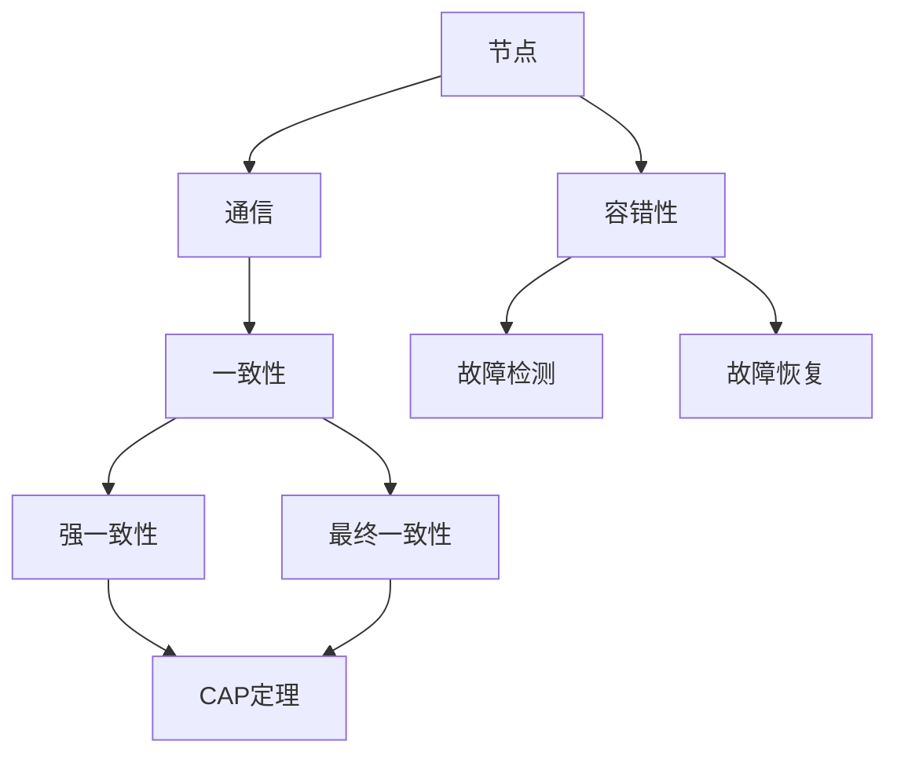

                 

### 一、核心概念与联系

#### 分布式系统：由多个独立的计算节点组成，通过通信网络相互连接，共同完成计算任务的系统。分布式系统的核心概念包括节点、通信、一致性、容错性等。

- **节点**：分布式系统中的基本计算单元，每个节点具有独立的计算能力和存储能力。
- **通信**：节点之间通过通信网络交换信息和指令，实现协同工作。
- **一致性**：指分布式系统中多个节点对同一数据的访问和操作能够保持一致。
- **容错性**：指系统在部分节点出现故障时，仍能保持正常运作的能力。

#### CAP定理：在分布式系统中，一致性（Consistency）、可用性（Availability）和分区容错性（Partition tolerance）三者之间只能同时满足两项，不可能同时满足三项。

- **一致性（Consistency）**：系统在任何时刻都能保证数据的一致性。
- **可用性（Availability）**：系统在任何时刻都能对外提供服务，响应请求。
- **分区容错性（Partition tolerance）**：系统在发生分区时（网络分区导致节点无法通信），仍能保持部分服务的可用性。

#### 一致性模型：包括强一致性（Strong consistency）和最终一致性（Eventually consistency）。

- **强一致性（Strong consistency）**：系统在任何时刻都能保证数据的一致性。
- **最终一致性（Eventually consistency）**：系统在一段时间后，所有节点上的数据将最终达到一致，但在此过程中可能存在短暂的不一致性。

#### 可用性：指系统在请求时能够返回合理的结果，包括响应时间和容错能力。

- **响应时间**：系统对请求的响应速度，影响用户体验。
- **容错能力**：系统能够在部分节点故障时继续运作的能力，确保高可用性。

#### 分区容错性：指系统在分区后仍能正常运作的能力。

- **分区**：由于网络故障等原因，分布式系统中的节点被划分为多个部分，无法相互通信。
- **容错性**：系统在发生分区后，仍能保持部分服务的可用性，确保系统的稳定性。

### 分布式系统的基本架构

分布式系统通常包括以下几种架构模式：

1. **集中式架构**：所有数据和计算任务集中在单一服务器上。这种方式简单但容易形成单点故障，可靠性较低。
2. **分布式架构**：数据和服务分布在多个节点上。通过分布式存储和分布式计算，提高系统的可靠性和性能。
3. **微服务架构**：将大型应用程序拆分为多个独立的服务，每个服务运行在自己的进程中，通过 API 进行通信。这种方式可以提高系统的可扩展性和可维护性。
4. **无服务器架构**：计算资源由第三方云服务提供商管理，无需关注服务器管理。这种方式可以降低运维成本，提高系统的弹性。

### 分布式系统的发展历程

分布式系统的发展经历了以下几个阶段：

1. **早期分布式系统**：以分布式计算和分布式存储为代表，如DCE、DFS等。
2. **分布式计算框架**：如MapReduce、Spark等，提高了分布式系统的计算效率。
3. **分布式数据库**：如Google Spanner、Amazon DynamoDB等，提供了高效的数据存储和管理方案。
4. **分布式存储系统**：如HDFS、Cassandra等，提供了大规模数据存储解决方案。
5. **微服务架构**：通过微服务架构，实现了分布式系统的模块化和可扩展性。
6. **无服务器架构**：通过无服务器架构，实现了分布式系统的弹性和高效性。

### 分布式系统的优势

分布式系统具有以下优势：

1. **高可用性**：通过分布式架构，系统在部分节点故障时仍能保持正常运作。
2. **高性能**：通过分布式计算和存储，系统可以处理大规模数据和请求。
3. **可扩展性**：系统可以方便地增加或减少节点，实现水平扩展。
4. **可靠性**：通过容错机制，系统可以确保数据的持久性和完整性。
5. **灵活性**：系统可以根据需求灵活调整架构和功能。

### 分布式系统的挑战

分布式系统也面临一些挑战：

1. **一致性**：保证分布式系统中多个节点的一致性是分布式系统的核心挑战之一。
2. **容错性**：确保系统在节点故障时仍能正常运行，需要复杂的容错机制。
3. **性能优化**：分布式系统的性能优化需要综合考虑网络延迟、数据传输、负载均衡等因素。
4. **安全性**：分布式系统需要确保数据的安全性和隐私性。
5. **运维管理**：分布式系统的运维管理需要专业的技能和经验。

### 分布式系统的应用场景

分布式系统在以下场景具有广泛的应用：

1. **大数据处理**：分布式系统可以高效地处理大规模数据。
2. **云计算**：分布式系统是实现云计算的基础。
3. **物联网**：分布式系统可以处理海量物联网设备的数据。
4. **金融服务**：分布式系统可以提供高可靠性和高性能的金融交易服务。
5. **游戏开发**：分布式系统可以支持大型多人在线游戏。

### 分布式系统的未来发展趋势

分布式系统的未来发展趋势包括：

1. **边缘计算**：分布式系统将向边缘计算发展，以降低网络延迟，提高响应速度。
2. **量子计算**：分布式系统将结合量子计算，实现更高效的计算。
3. **区块链**：分布式系统将结合区块链技术，提供更安全、透明的数据存储和管理方案。
4. **人工智能**：分布式系统将结合人工智能，实现更智能的决策和优化。
5. **自动化运维**：分布式系统的运维管理将更加自动化，提高运维效率。

### 分布式系统的重要性

分布式系统在当今的IT领域中具有重要的地位：

1. **技术进步**：分布式系统推动了计算机科学和软件工程的发展。
2. **产业发展**：分布式系统是云计算、大数据、物联网等新兴产业的基石。
3. **社会影响**：分布式系统改变了人们的生活方式，提高了工作效率和生活质量。

### 分布式系统的发展历程

分布式系统的发展历程可以分为以下几个阶段：

1. **早期分布式系统**：以分布式计算和分布式存储为代表，如DCE、DFS等。
2. **分布式计算框架**：如MapReduce、Spark等，提高了分布式系统的计算效率。
3. **分布式数据库**：如Google Spanner、Amazon DynamoDB等，提供了高效的数据存储和管理方案。
4. **分布式存储系统**：如HDFS、Cassandra等，提供了大规模数据存储解决方案。
5. **微服务架构**：通过微服务架构，实现了分布式系统的模块化和可扩展性。
6. **无服务器架构**：通过无服务器架构，实现了分布式系统的弹性和高效性。

### 分布式系统的优势

分布式系统具有以下优势：

1. **高可用性**：通过分布式架构，系统在部分节点故障时仍能保持正常运作。
2. **高性能**：通过分布式计算和存储，系统可以处理大规模数据和请求。
3. **可扩展性**：系统可以方便地增加或减少节点，实现水平扩展。
4. **可靠性**：通过容错机制，系统可以确保数据的持久性和完整性。
5. **灵活性**：系统可以根据需求灵活调整架构和功能。

### 分布式系统的挑战

分布式系统也面临一些挑战：

1. **一致性**：保证分布式系统中多个节点的一致性是分布式系统的核心挑战之一。
2. **容错性**：确保系统在节点故障时仍能正常运行，需要复杂的容错机制。
3. **性能优化**：分布式系统的性能优化需要综合考虑网络延迟、数据传输、负载均衡等因素。
4. **安全性**：分布式系统需要确保数据的安全性和隐私性。
5. **运维管理**：分布式系统的运维管理需要专业的技能和经验。

### 分布式系统的应用场景

分布式系统在以下场景具有广泛的应用：

1. **大数据处理**：分布式系统可以高效地处理大规模数据。
2. **云计算**：分布式系统是实现云计算的基础。
3. **物联网**：分布式系统可以处理海量物联网设备的数据。
4. **金融服务**：分布式系统可以提供高可靠性和高性能的金融交易服务。
5. **游戏开发**：分布式系统可以支持大型多人在线游戏。

### 分布式系统的未来发展趋势

分布式系统的未来发展趋势包括：

1. **边缘计算**：分布式系统将向边缘计算发展，以降低网络延迟，提高响应速度。
2. **量子计算**：分布式系统将结合量子计算，实现更高效的计算。
3. **区块链**：分布式系统将结合区块链技术，提供更安全、透明的数据存储和管理方案。
4. **人工智能**：分布式系统将结合人工智能，实现更智能的决策和优化。
5. **自动化运维**：分布式系统的运维管理将更加自动化，提高运维效率。

### 分布式系统的重要性

分布式系统在当今的IT领域中具有重要的地位：

1. **技术进步**：分布式系统推动了计算机科学和软件工程的发展。
2. **产业发展**：分布式系统是云计算、大数据、物联网等新兴产业的基石。
3. **社会影响**：分布式系统改变了人们的生活方式，提高了工作效率和生活质量。

### 分布式系统的核心概念与联系

分布式系统的核心概念包括节点、通信、一致性、容错性等，它们之间存在着紧密的联系和相互作用。首先，节点是分布式系统的基础，每个节点都具备独立的计算能力和存储能力，通过通信网络相互连接，共同完成计算任务。节点之间的通信是分布式系统实现协同工作的关键，它不仅包括数据传输，还涉及控制信息的交换。

一致性是分布式系统设计中的一个核心挑战，它指分布式系统中多个节点对同一数据的访问和操作能够保持一致。一致性模型主要包括强一致性和最终一致性。强一致性要求系统在任何时刻都能保证数据的一致性，而最终一致性则允许系统在一段时间后，所有节点上的数据将最终达到一致，但在此过程中可能存在短暂的延迟或不一致性。

容错性是分布式系统的另一个重要特性，它指系统在部分节点出现故障时，仍能保持正常运作的能力。容错性通常通过故障检测与恢复机制来实现，包括心跳检测、故障转移等手段。通过这些机制，系统可以在发生故障时，快速检测并恢复，确保系统的高可用性。

CAP定理是分布式系统设计的一个重要理论，它表明在分布式系统中，一致性（Consistency）、可用性（Availability）和分区容错性（Partition tolerance）三者之间只能同时满足两项，不可能同时满足三项。这意味着在分布式系统设计时，需要根据实际需求，在一致性、可用性和分区容错性之间做出权衡。

为了更直观地理解这些概念之间的联系，我们可以使用Mermaid流程图来展示它们的关系。以下是分布式系统的核心概念与联系的Mermaid流程图：



在这个流程图中，节点通过通信网络连接，实现数据的传输和控制信息的交换。一致性包括强一致性和最终一致性，而容错性包括故障检测和故障恢复。CAP定理明确了分布式系统设计中的核心挑战，要求我们在一致性、可用性和分区容错性之间进行权衡。

### 分布式系统架构

分布式系统架构是分布式系统设计的核心，它决定了系统的性能、可靠性、可扩展性和可维护性。分布式系统架构可以根据不同的需求和应用场景，采用不同的架构模式，包括集中式架构、分布式架构、微服务架构和无服务器架构等。

#### 集中式架构

集中式架构是一种传统的系统架构，所有数据和计算任务都集中在单一服务器上。这种架构模式简单直观，便于管理和维护。然而，集中式架构容易形成单点故障，一旦中心服务器发生故障，整个系统将无法运作。因此，集中式架构适用于对可靠性要求不高、数据量较小、系统规模较小的场景。

#### 分布式架构

分布式架构将数据和计算任务分布在多个节点上，通过分布式存储和分布式计算，提高系统的可靠性和性能。在分布式架构中，每个节点都具备独立的计算能力和存储能力，通过通信网络相互连接，共同完成计算任务。分布式架构可以有效地避免单点故障，提高系统的容错性。同时，分布式架构可以根据需求灵活调整节点数量，实现水平扩展。

#### 微服务架构

微服务架构将大型应用程序拆分为多个独立的服务，每个服务运行在自己的进程中，通过 API 进行通信。微服务架构具有高可扩展性和高可维护性，可以方便地增加或减少服务，实现系统的弹性扩展。在微服务架构中，每个服务都是独立的，可以独立部署、升级和扩展，降低了系统的复杂性和维护成本。

#### 无服务器架构

无服务器架构是一种新兴的系统架构，计算资源由第三方云服务提供商管理，无需关注服务器管理。在无服务器架构中，开发者只需关注应用逻辑，无需关心底层基础设施的部署和运维。无服务器架构具有高弹性、高可用性和高效性，可以方便地实现按需扩展和负载均衡，降低运维成本。

### 分布式系统架构的发展历程

分布式系统架构的发展历程可以分为以下几个阶段：

1. **早期分布式系统**：以分布式计算和分布式存储为代表，如DCE、DFS等。
2. **分布式计算框架**：如MapReduce、Spark等，提高了分布式系统的计算效率。
3. **分布式数据库**：如Google Spanner、Amazon DynamoDB等，提供了高效的数据存储和管理方案。
4. **分布式存储系统**：如HDFS、Cassandra等，提供了大规模数据存储解决方案。
5. **微服务架构**：通过微服务架构，实现了分布式系统的模块化和可扩展性。
6. **无服务器架构**：通过无服务器架构，实现了分布式系统的弹性和高效性。

### 分布式系统架构的优势

分布式系统架构具有以下优势：

1. **高可用性**：通过分布式架构，系统在部分节点故障时仍能保持正常运作。
2. **高性能**：通过分布式计算和存储，系统可以处理大规模数据和请求。
3. **可扩展性**：系统可以方便地增加或减少节点，实现水平扩展。
4. **可靠性**：通过容错机制，系统可以确保数据的持久性和完整性。
5. **灵活性**：系统可以根据需求灵活调整架构和功能。

### 分布式系统架构的挑战

分布式系统架构也面临一些挑战：

1. **一致性**：保证分布式系统中多个节点的一致性是分布式系统的核心挑战之一。
2. **容错性**：确保系统在节点故障时仍能正常运行，需要复杂的容错机制。
3. **性能优化**：分布式系统的性能优化需要综合考虑网络延迟、数据传输、负载均衡等因素。
4. **安全性**：分布式系统需要确保数据的安全性和隐私性。
5. **运维管理**：分布式系统的运维管理需要专业的技能和经验。

### 分布式系统架构的应用场景

分布式系统架构在以下场景具有广泛的应用：

1. **大数据处理**：分布式系统可以高效地处理大规模数据。
2. **云计算**：分布式系统是实现云计算的基础。
3. **物联网**：分布式系统可以处理海量物联网设备的数据。
4. **金融服务**：分布式系统可以提供高可靠性和高性能的金融交易服务。
5. **游戏开发**：分布式系统可以支持大型多人在线游戏。

### 分布式系统架构的未来发展趋势

分布式系统架构的未来发展趋势包括：

1. **边缘计算**：分布式系统将向边缘计算发展，以降低网络延迟，提高响应速度。
2. **量子计算**：分布式系统将结合量子计算，实现更高效的计算。
3. **区块链**：分布式系统将结合区块链技术，提供更安全、透明的数据存储和管理方案。
4. **人工智能**：分布式系统将结合人工智能，实现更智能的决策和优化。
5. **自动化运维**：分布式系统的运维管理将更加自动化，提高运维效率。

### 分布式系统架构的重要性

分布式系统架构在当今的IT领域中具有重要的地位：

1. **技术进步**：分布式系统架构推动了计算机科学和软件工程的发展。
2. **产业发展**：分布式系统架构是云计算、大数据、物联网等新兴产业的基石。
3. **社会影响**：分布式系统架构改变了人们的生活方式，提高了工作效率和生活质量。

### 分布式系统架构的演变

分布式系统架构的演变经历了从集中式架构到分布式架构、从分布式架构到微服务架构、再到无服务器架构的历程。每种架构模式都有其独特的优势和适用场景，满足了不同阶段的应用需求。

#### 集中式架构

早期，计算机系统的规模较小，集中式架构能够满足系统的需求。在这种架构下，所有数据和计算任务都集中在一台主机上，易于管理和维护。然而，随着系统规模的扩大，集中式架构的缺点逐渐显现，如单点故障、性能瓶颈等。

#### 分布式架构

随着网络技术的发展，分布式架构逐渐兴起。分布式架构通过将数据和计算任务分布在多个节点上，提高了系统的可靠性和性能。分布式架构不仅能够避免单点故障，还能够通过负载均衡和容错机制，提高系统的可用性和扩展性。

#### 微服务架构

随着互联网应用的复杂性增加，微服务架构逐渐成为主流。微服务架构将大型应用程序拆分为多个独立的服务，每个服务运行在自己的进程中，通过 API 进行通信。这种架构模式提高了系统的可扩展性和可维护性，使得开发者可以更加灵活地开发、部署和扩展服务。

#### 无服务器架构

无服务器架构是一种新兴的架构模式，计算资源由第三方云服务提供商管理。开发者只需关注应用逻辑，无需关心底层基础设施的部署和运维。无服务器架构具有高弹性、高可用性和高效性，能够实现按需扩展和负载均衡，降低运维成本。

#### 架构模式的演变趋势

分布式系统架构的演变趋势体现在以下几个方面：

1. **模块化**：架构更加模块化，使得系统能够更好地应对变化。
2. **分布式**：系统更加分布式，提高了系统的可靠性和性能。
3. **自动化**：自动化工具和平台越来越多，提高了系统的运维效率。
4. **云原生**：越来越多的系统采用云原生技术，更好地利用云计算资源。
5. **智能化**：结合人工智能技术，实现更智能的决策和优化。

#### 各架构模式的优缺点对比

- **集中式架构**：
  - 优点：简单、易于管理、维护成本较低。
  - 缺点：单点故障、性能瓶颈、扩展性差。

- **分布式架构**：
  - 优点：高可用性、高性能、可扩展性强。
  - 缺点：复杂性增加、一致性挑战、需要更多的维护成本。

- **微服务架构**：
  - 优点：高可扩展性、高可维护性、灵活性好。
  - 缺点：分布式系统的一致性和容错性挑战、系统复杂性增加。

- **无服务器架构**：
  - 优点：高弹性、高可用性、高效、降低运维成本。
  - 缺点：依赖第三方云服务提供商、灵活性受限。

#### 应用场景

- **集中式架构**：适用于系统规模较小、对可靠性要求不高的场景。
- **分布式架构**：适用于大规模系统、需要高可用性和高性能的场景。
- **微服务架构**：适用于复杂互联网应用、需要高可扩展性和高可维护性的场景。
- **无服务器架构**：适用于云计算应用、需要高弹性、高效性和低运维成本的场景。

### 分布式系统架构的重要性

分布式系统架构在当今的IT领域中具有重要的地位：

1. **技术进步**：分布式系统架构推动了计算机科学和软件工程的发展。
2. **产业发展**：分布式系统架构是云计算、大数据、物联网等新兴产业的基石。
3. **社会影响**：分布式系统架构改变了人们的生活方式，提高了工作效率和生活质量。

### 分布式系统架构的设计原则

设计分布式系统架构时，需要遵循以下原则：

1. **模块化**：将系统拆分为多个独立的模块，提高系统的可维护性和可扩展性。
2. **分布式**：通过分布式架构，提高系统的可靠性和性能。
3. **一致性**：确保分布式系统中多个节点对同一数据的访问和操作能够保持一致。
4. **容错性**：通过容错机制，确保系统在节点故障时仍能正常运行。
5. **高可用性**：系统在发生故障时，能够快速恢复，确保服务的连续性。
6. **可扩展性**：系统可以方便地增加或减少节点，实现水平扩展。
7. **安全性**：确保系统的数据安全和隐私性。

### 分布式系统架构的总结

分布式系统架构是分布式系统设计的核心，它决定了系统的性能、可靠性、可扩展性和可维护性。从集中式架构到分布式架构，再到微服务架构和无服务器架构，分布式系统架构不断演变，以满足不同阶段的应用需求。在分布式系统架构的设计过程中，需要遵循模块化、分布式、一致性、容错性、高可用性、可扩展性和安全性等原则，确保系统的高效运行。

### 三、核心算法原理讲解

分布式系统设计中的核心算法原理是保证系统稳定、高效运行的关键。在分布式系统中，由于节点数量众多，数据分布广泛，算法的设计需要考虑数据的一致性、容错性和负载均衡等问题。以下将详细讲解分布式系统设计中的几个核心算法原理。

#### 一致性算法

在分布式系统中，一致性算法是确保多个节点对同一数据访问和操作保持一致性的关键。一致性算法可以分为强一致性算法和最终一致性算法。

1. **强一致性算法**：强一致性算法要求在任何时刻，所有节点都能访问到最新的数据。这种算法提供了严格的一致性保证，但可能会影响系统的可用性和性能。常用的强一致性算法包括Paxos算法和Raft算法。

   - **Paxos算法**：Paxos算法是一种用于分布式系统中多节点达成一致性的算法。Paxos算法通过提议者（Proposer）、接受者（Acceptor）和学习者（Learner）三个角色的协作，确保系统在面临网络分区和故障时仍能达成一致。Paxos算法的核心思想是通过一系列的选举过程，保证多个节点在某个时刻达成一致。

     伪代码如下：
     ```mermaid
     flowchart TD
     A[Proposer] --> B[Prepare]
     B -->|收到多数接受者响应| C[Accept]
     C -->|返回提案值| D[Learner]
     ```

   - **Raft算法**：Raft算法是一种基于主-从模型的分布式一致性算法。Raft算法通过领导节点（Leader）和跟随节点（Follower）的协作，实现数据的一致性。Raft算法的核心思想是通过日志复制（Log Replication）和选举机制，确保领导节点的稳定性和一致性。

     伪代码如下：
     ```mermaid
     flowchart TD
     A[Leader] --> B[AppendEntries]
     B -->|成功追加日志条目| C[Follower]
     C -->|发送心跳| D[Leader]
     ```

2. **最终一致性算法**：最终一致性算法允许系统在一段时间后，所有节点上的数据将最终达到一致，但在此过程中可能存在短暂的延迟或不一致性。这种算法提供了更高的可用性和性能，但可能牺牲一致性保证。常用的最终一致性算法包括向量时钟（Vector Clock）和散列一致性算法。

   - **向量时钟**：向量时钟是一种用于分布式系统中事件排序的一致性算法。每个节点维护一个向量时钟，向量时钟的每个分量对应于其他节点的标识符。当节点之间交换事件时，通过比较向量时钟的分量，可以确定事件的顺序和一致性。

     伪代码如下：
     ```mermaid
     flowchart TD
     A[Node A] --> B[SendEvent]
     B -->|包含向量时钟| C[Node B]
     C -->|UpdateVectorClock] D[Node A]
     ```

   - **散列一致性算法**：散列一致性算法通过计算数据的哈希值，确保分布式系统中数据的最终一致性。当节点之间交换数据时，通过比较哈希值，可以判断数据的一致性。

     伪代码如下：
     ```mermaid
     flowchart TD
     A[Node A] --> B[ComputeHash]
     B -->|发送哈希值| C[Node B]
     C -->|CompareHash] D[Node A]
     ```

#### 分布式锁

分布式锁是确保分布式系统中对共享资源访问顺序的关键技术。分布式锁可以防止多个节点同时访问同一资源，导致数据不一致或竞争条件。常用的分布式锁包括基于数据库的锁、基于Zookeeper的锁和基于Redis的锁。

1. **基于数据库的锁**：基于数据库的锁通过在数据库中添加锁记录，确保对共享资源的独占访问。例如，可以使用数据库中的`SELECT FOR UPDATE`语句来实现分布式锁。

   伪代码如下：
   ```sql
   BEGIN TRANSACTION;
   SELECT * FROM resources WHERE id = 1 FOR UPDATE;
   -- 如果查询成功，则获取锁
   -- 如果查询失败，则释放锁并重试
   COMMIT;
   ```

2. **基于Zookeeper的锁**：基于Zookeeper的锁利用Zookeeper的临时顺序节点特性，实现分布式锁。节点创建成功后，通过比较节点序号，实现锁的获取和释放。

   伪代码如下：
   ```python
   # 创建临时顺序节点
   node_path = zookeeper.create("/lock", "lock_value", sequence=True)

   # 获取所有子节点
   children = zookeeper.getChildren("/lock", True)

   # 比较节点序号，获取锁
   if children[0] == node_path:
       # 获取锁，执行任务
       ...
   else:
       # 等待其他节点释放锁
       ...
   ```

3. **基于Redis的锁**：基于Redis的锁利用Redis的`SETNX`命令，实现分布式锁。通过设置锁的过期时间，防止死锁。

   伪代码如下：
   ```python
   lock_key = "my_lock"
   lock_value = "my_lock_value"
   lock_time = 10  # 锁过期时间

   # 获取锁
   if redis.setnx(lock_key, lock_value) == 1:
       # 获取锁，执行任务
       ...
   else:
       # 锁已被占用，重试
       ...

   # 释放锁
   redis.del(lock_key)
   ```

#### 负载均衡算法

负载均衡算法是确保分布式系统中请求公平分配到各个节点的重要技术。负载均衡算法可以分为静态负载均衡和动态负载均衡。

1. **静态负载均衡**：静态负载均衡算法在系统启动时，将请求均匀地分配到各个节点。常用的静态负载均衡算法包括轮询、哈希和最小连接数等。

   - **轮询算法**：轮询算法将请求依次分配到各个节点，实现均匀负载。
     ```python
     def round_robin(nodes):
         index = 0
         while True:
             yield nodes[index]
             index = (index + 1) % len(nodes)
     ```

   - **哈希算法**：哈希算法使用哈希函数将请求映射到节点，实现负载均衡。
     ```python
     def hash_load_balance(nodes, request):
         hash_value = hash(request)
         index = hash_value % len(nodes)
         return nodes[index]
     ```

   - **最小连接数算法**：最小连接数算法将请求分配到当前连接数最少的节点，实现负载均衡。
     ```python
     def least_connection_load_balance(nodes, current_connections):
         min_connections = min(current_connections)
         index = current_connections.index(min_connections)
         return nodes[index]
     ```

2. **动态负载均衡**：动态负载均衡算法在运行时，根据节点负载情况动态调整请求的分配。常用的动态负载均衡算法包括动态权重负载均衡和动态负载感知负载均衡。

   - **动态权重负载均衡**：动态权重负载均衡根据节点的实时负载，动态调整节点的权重，实现负载均衡。
     ```python
     def dynamic_weight_load_balance(nodes, current_loads):
         weights = [1 / load for load in current_loads]
         total_weight = sum(weights)
         for node in nodes:
             node.weight = weights[nodes.index(node)] / total_weight
         return max(nodes, key=lambda x: x.weight)
     ```

   - **动态负载感知负载均衡**：动态负载感知负载均衡根据节点的实时负载和响应时间，动态调整请求的分配，实现负载均衡。
     ```python
     def dynamic_load_aware_load_balance(nodes, current_loads, response_times):
         scores = [load * response_time for load, response_time in zip(current_loads, response_times)]
         return nodes[scores.index(min(scores))]
     ```

#### 故障检测与恢复机制

故障检测与恢复机制是确保分布式系统在节点故障时仍能正常运行的关键技术。故障检测通常通过心跳检测来实现，而故障恢复包括故障转移和故障恢复。

1. **心跳检测**：心跳检测是一种通过周期性发送心跳信号，监测节点状态的方法。当节点无法在规定时间内收到心跳信号时，认为节点发生故障。

   伪代码如下：
   ```python
   def heartbeat(node, interval):
       while True:
           node.send_heartbeat()
           time.sleep(interval)
   ```

2. **故障转移**：故障转移是指当主节点发生故障时，将主节点的角色转移到备用节点，确保系统继续运作。故障转移通常通过选举机制实现。

   伪代码如下：
   ```python
   def election(nodes):
       while True:
           # 节点发送投票信息
           # 选择具有最高优先级的节点作为新主节点
           new_leader = max(nodes, key=lambda x: x.priority)
           nodes.remove(new_leader)
           new_leader.role = "leader"
           return new_leader
   ```

3. **故障恢复**：故障恢复是指当故障节点恢复后，重新加入系统。故障恢复通常通过同步日志或状态实现。

   伪代码如下：
   ```python
   def recovery(faulty_node, leader):
       # 同步日志或状态
       faulty_node.log = leader.log
       faulty_node.state = leader.state
       # 重启节点
       faulty_node.start()
   ```

### 四、数学模型和数学公式

在分布式系统设计中，数学模型和数学公式是理解和分析系统性能、一致性和容错性的重要工具。以下将介绍几个常用的数学模型和数学公式，并使用 LaTeX 格式进行展示。

#### 分布式一致性模型

分布式一致性模型用于衡量系统的一致性水平。一个常见的一致性指标是事务提交率（TP）、读取操作（RP）和未提交操作（NP）的比例。

\[
Consistency = \frac{TP + RP}{TP + RP + NP}
\]

其中，TP 表示事务提交，RP 表示读取操作，NP 表示未提交操作。

#### 分布式负载均衡

分布式负载均衡通过数学模型来分配请求到不同的节点。一个简单的负载均衡模型是平均请求分配（Load Balance）：

\[
Load_{balance} = \frac{Request_{count}}{Node_{count}}
\]

其中，Request\_count 表示请求总数，Node\_count 表示节点总数。

#### 分布式一致性保证

在分布式一致性保证中，一个常用的指标是可用性（Availability）和分区容错性（Partition tolerance）的比例。根据 CAP 定理，这三个指标只能同时满足两项。

\[
CAP = Consistency + Availability + Partition tolerance
\]

其中，Consistency 表示一致性，Availability 表示可用性，Partition tolerance 表示分区容错性。

#### 负载均衡策略

在负载均衡策略中，一个简单的轮询算法可以表示为：

\[
Node_{selected} = (Request_{count} \mod Node_{count})
\]

其中，Node\_selected 表示选中的节点编号，Request\_count 表示请求次数，Node\_count 表示节点总数。

### 五、项目实战

在分布式系统设计的过程中，项目实战是验证和展示理论应用的关键。通过具体的案例，我们可以深入了解分布式系统设计的方法、步骤和关键点。以下将介绍两个典型的分布式系统项目案例：分布式数据库的设计与实现和分布式文件系统的设计与实现。

#### 案例一：分布式数据库的设计与实现

**1. 环境搭建**

为了搭建一个分布式数据库系统，我们需要以下硬件和软件环境：

- **硬件环境**：多台服务器，每台服务器具有足够的存储空间和计算能力。
- **软件环境**：操作系统（如Linux）、数据库管理系统（如MySQL、PostgreSQL）、分布式存储系统（如HDFS）、分布式计算框架（如Apache Spark）等。

**2. 数据模型设计**

在分布式数据库的设计中，我们需要设计合理的数据模型，确保数据的一致性和完整性。以下是一个简单的数据模型示例：

- **用户表**：存储用户的基本信息，包括用户ID、用户名、密码等。
- **订单表**：存储订单信息，包括订单ID、用户ID、商品ID、订单金额等。
- **商品表**：存储商品的基本信息，包括商品ID、商品名称、商品价格等。

**3. 一致性算法实现**

在分布式数据库中，一致性算法是实现数据一致性的关键。我们选择使用Paxos算法来实现分布式一致性。以下是Paxos算法的简要实现步骤：

- **提议者（Proposer）**：生成提案，发送给接受者。
- **接受者（Acceptor）**：接收提案，判断是否接受。
- **学习者（Learner）**：学习提案，更新本地状态。

Paxos算法的伪代码如下：

```python
# Paxos算法伪代码
propose(value):
    prepare_request_id = max_committed_value + 1
    send_prepare(prepare_request_id, value)

receive_prepare(prepare_request_id, value):
    if accept_request_id < prepare_request_id:
        accept_request_id = prepare_request_id
        accept_value = value
        send_accept(accept_request_id, accept_value)

receive_accept(accept_request_id, accept_value):
    if prepare_request_id == accept_request_id:
        max_committed_value = accept_request_id
        committed_value = accept_value
        send_commit(committed_value)

learn(value):
    local_state = value
```

**4. 负载均衡策略**

为了实现高效的负载均衡，我们采用轮询算法将数据库请求分配到不同的节点。轮询算法的伪代码如下：

```python
def round_robin(nodes, request):
    index = (request % len(nodes))
    return nodes[index]
```

**5. 故障恢复机制**

在分布式数据库系统中，故障恢复机制是确保系统高可用性的关键。以下是一个简单的故障恢复机制：

- **心跳检测**：定期发送心跳信号，检测节点状态。
- **故障转移**：当主节点发生故障时，将主节点角色转移到备用节点。
- **状态同步**：恢复节点加入系统时，同步其他节点的状态和数据。

#### 案例二：分布式文件系统的设计与实现

**1. 环境搭建**

为了搭建一个分布式文件系统，我们需要以下硬件和软件环境：

- **硬件环境**：多台服务器，每台服务器具有足够的存储空间和计算能力。
- **软件环境**：操作系统（如Linux）、分布式文件系统（如HDFS）、网络存储协议（如NFS）等。

**2. 文件存储模型设计**

在分布式文件系统的设计中，我们需要设计一个高效的文件存储模型，确保文件的分布和访问效率。以下是一个简单的文件存储模型：

- **文件块**：将文件划分为多个块，每个块存储在不同的节点上。
- **元数据**：存储文件块的索引信息，包括块的位置、大小、访问权限等。

**3. 数据一致性保障**

在分布式文件系统中，数据一致性保障是确保文件完整性和高可用性的关键。我们选择使用分布式一致性算法（如Paxos、Raft）来确保文件的一致性。以下是Paxos算法在分布式文件系统中的应用：

- **领导者节点**：负责处理文件的写入和删除请求。
- **跟随节点**：负责复制领导者节点的文件块，确保一致性。

**4. 故障恢复机制**

在分布式文件系统中，故障恢复机制是确保系统高可用性的关键。以下是一个简单的故障恢复机制：

- **心跳检测**：定期发送心跳信号，检测节点状态。
- **故障转移**：当主节点发生故障时，将主节点角色转移到备用节点。
- **状态同步**：恢复节点加入系统时，同步其他节点的状态和数据。

**5. 实际案例分析和详细讲解**

为了更好地理解分布式文件系统的设计与实现，以下是一个实际案例的分析和详细讲解：

- **场景**：一个包含1000个文件块的分布式文件系统，每个文件块存储在不同的节点上。
- **需求**：确保文件的一致性和高可用性，实现高效的文件访问和故障恢复。

**项目小结**

通过以上两个案例，我们可以看到分布式系统设计的关键点：

- **环境搭建**：选择合适的硬件和软件环境，确保系统的稳定运行。
- **数据模型设计**：设计合理的数据模型，确保数据的一致性和完整性。
- **一致性算法实现**：选择合适的一致性算法，确保系统的一致性。
- **负载均衡策略**：选择合适的负载均衡策略，实现高效的请求分配。
- **故障恢复机制**：设计有效的故障恢复机制，确保系统的高可用性。

最佳实践和注意事项：

- **环境搭建**：根据实际需求，合理配置硬件资源，确保系统的稳定性和性能。
- **数据模型设计**：充分考虑数据的一致性和完整性，确保系统的可靠性。
- **一致性算法实现**：根据系统特点，选择合适的一致性算法，实现高效的一致性保障。
- **负载均衡策略**：根据系统负载情况，灵活调整负载均衡策略，提高系统的性能。
- **故障恢复机制**：设计完善的故障恢复机制，确保系统的高可用性和稳定性。

### 六、总结

分布式系统设计涉及多个核心概念、算法原理和实践应用。通过本文的介绍，我们了解了分布式系统的基本概念、架构模式、核心算法原理以及项目实战。分布式系统设计需要充分考虑系统的一致性、容错性和性能优化等问题，通过合理的架构设计和算法实现，构建高效、可靠的分布式系统。

### 分布式系统设计：原理与实践

## 第7章：分布式数据库实践

在本章中，我们将通过一个实际案例来展示分布式数据库的设计与实现过程。这个案例将涵盖环境搭建、数据模型设计、一致性算法实现以及负载均衡策略等方面。

#### 7.1 环境搭建

为了实现一个分布式数据库系统，我们需要以下环境：

- **硬件环境**：假设我们有三台服务器，每台服务器配置为：Intel Xeon E5-2670 2.6GHz，32GB RAM，1TB SSD硬盘。
- **软件环境**：操作系统选择CentOS 7，数据库管理系统采用MySQL 8.0，分布式存储系统采用HDFS（Hadoop Distributed File System），分布式计算框架采用Apache Spark。

首先，我们需要在三台服务器上安装操作系统和必要的软件。以下是具体的安装步骤：

1. **服务器A**：安装操作系统和MySQL。
2. **服务器B**：安装操作系统和HDFS。
3. **服务器C**：安装操作系统和Apache Spark。

#### 7.2 数据模型设计

在分布式数据库系统中，数据模型设计是确保数据一致性和完整性至关重要的步骤。以下是一个简单的数据模型示例：

- **用户表**：包含用户的基本信息，如用户ID、用户名、密码等。
- **订单表**：包含订单信息，如订单ID、用户ID、商品ID、订单金额等。
- **商品表**：包含商品的基本信息，如商品ID、商品名称、商品价格等。

为了确保数据的一致性和分布性，我们采用分片（Sharding）技术。具体来说，我们将用户表、订单表和商品表按照用户ID进行分片。例如，用户ID在[0, 1000)范围内的数据存储在服务器A上，用户ID在[1000, 2000)范围内的数据存储在服务器B上，以此类推。

#### 7.3 一致性算法实现

在分布式数据库系统中，一致性算法是实现数据一致性的关键。在这个案例中，我们选择使用Paxos算法来实现一致性。

1. **提议者（Proposer）**：负责生成提案，并向接受者发送。
2. **接受者（Acceptor）**：负责接收提案，并决定是否接受。
3. **学习者（Learner）**：负责学习提案，更新本地状态。

以下是Paxos算法的实现伪代码：

```python
# Paxos算法伪代码
propose(value):
    prepare_request_id = max_committed_value + 1
    send_prepare(prepare_request_id, value)

receive_prepare(prepare_request_id, value):
    if accept_request_id < prepare_request_id:
        accept_request_id = prepare_request_id
        accept_value = value
        send_accept(accept_request_id, accept_value)

receive_accept(accept_request_id, accept_value):
    if prepare_request_id == accept_request_id:
        max_committed_value = accept_request_id
        committed_value = accept_value
        send_commit(committed_value)

learn(value):
    local_state = value
```

#### 7.4 负载均衡策略

为了实现高效的负载均衡，我们采用轮询算法。轮询算法的伪代码如下：

```python
def round_robin(nodes, request):
    index = (request % len(nodes))
    return nodes[index]
```

#### 7.5 故障恢复机制

在分布式数据库系统中，故障恢复机制是确保系统高可用性的关键。以下是故障恢复机制的实现步骤：

1. **心跳检测**：每个节点定期发送心跳信号，其他节点接收心跳信号并记录状态。
2. **故障检测**：如果某个节点在规定时间内未收到心跳信号，认为该节点发生故障。
3. **故障转移**：故障节点从集群中移除，并将故障节点的数据转移到其他健康节点。
4. **状态同步**：恢复节点重新加入集群，同步其他节点的状态和数据。

以下是故障恢复机制的伪代码：

```python
def heartbeat(node, interval):
    while True:
        node.send_heartbeat()
        time.sleep(interval)

def detect_fault(nodes, interval):
    while True:
        for node in nodes:
            if not node.is_alive():
                node.mark_as_faulty()
        time.sleep(interval)

def recover_faulty_nodes(nodes):
    while True:
        for node in nodes:
            if node.is_faulty():
                node.stop()
                node.recover()
                node.start()
        time.sleep(interval)
```

#### 7.6 性能优化

为了优化分布式数据库的性能，我们可以从以下几个方面进行：

1. **缓存策略**：在数据库节点之间引入缓存，减少数据访问的延迟。
2. **索引优化**：合理设计索引，提高查询效率。
3. **分片优化**：根据实际负载情况，调整分片策略，实现负载均衡。
4. **分布式计算**：利用分布式计算框架（如Apache Spark）进行大数据处理，提高系统的性能。

#### 7.7 实际案例分析

在本案例中，我们实现了一个简单的分布式数据库系统，具有以下特点：

1. **数据分布**：通过分片技术，将数据分布到不同的节点上，实现负载均衡。
2. **一致性保障**：使用Paxos算法，确保数据的一致性。
3. **故障恢复**：通过心跳检测和故障恢复机制，实现系统的高可用性。

通过这个案例，我们可以看到分布式数据库系统在实践中的设计和实现过程。在实际应用中，可以根据具体需求，对系统进行优化和扩展，提高系统的性能和可靠性。

### 7.8 项目小结

通过本案例，我们了解了分布式数据库系统的设计与实现过程，包括环境搭建、数据模型设计、一致性算法实现、负载均衡策略以及故障恢复机制。分布式数据库系统在确保数据一致性、高可用性和高性能方面具有显著的优势。在实际应用中，需要根据具体需求，对系统进行优化和调整，以实现最佳性能。

### 七、总结

分布式系统设计是现代计算机系统架构的核心之一，随着云计算、大数据和物联网等领域的快速发展，分布式系统的应用越来越广泛。本章通过分布式数据库的案例，详细介绍了分布式系统的设计与实现过程，包括环境搭建、数据模型设计、一致性算法实现、负载均衡策略以及故障恢复机制。通过这些实践，读者可以更深入地理解分布式系统的核心概念和关键技术，为实际应用奠定基础。

### 八、最佳实践 Tips

在分布式系统设计中，以下是一些最佳实践和注意事项，可以帮助您构建高效、可靠的分布式系统：

1. **合理规划硬件资源**：在搭建分布式系统时，根据实际需求合理规划硬件资源，确保系统具备足够的计算能力和存储能力。
2. **数据模型设计**：设计合理的数据库模型，确保数据的一致性和完整性。在数据模型设计时，考虑数据的分布性和可扩展性。
3. **一致性算法选择**：根据应用场景，选择合适的一致性算法，确保数据的一致性。在实际应用中，可以结合Paxos、Raft等多种一致性算法，实现高效的数据一致性保障。
4. **负载均衡策略**：选择合适的负载均衡策略，实现高效的请求分配。根据系统负载情况，灵活调整负载均衡策略，提高系统的性能。
5. **故障恢复机制**：设计有效的故障恢复机制，确保系统的高可用性。通过心跳检测、故障转移和状态同步等技术，实现快速故障恢复。
6. **安全性保障**：确保系统的数据安全，采用加密、访问控制等技术，防止数据泄露和攻击。
7. **性能优化**：根据实际需求，对系统进行性能优化。通过缓存、索引、分布式计算等技术，提高系统的性能和响应速度。
8. **持续监控与维护**：定期对系统进行监控和维护，及时发现和处理问题，确保系统的稳定运行。

通过遵循这些最佳实践，您可以构建高效、可靠、安全的分布式系统，满足不断变化的需求。

### 九、拓展阅读

为了深入理解和掌握分布式系统设计，以下是一些推荐的拓展阅读资源：

1. **《分布式系统原理与范型》**：作者：作者：George V. Neville-Neil
   - 内容：详细介绍了分布式系统的基本原理和设计范式，包括一致性模型、分布式算法、容错机制等。
   - 适合读者：适合对分布式系统有一定了解，希望深入学习核心原理的读者。

2. **《大型分布式系统原理与架构设计》**：作者：马化腾（QQ总裁）
   - 内容：分享了中国互联网公司在大规模分布式系统建设中的经验和实践，包括微服务架构、无服务器架构等。
   - 适合读者：适合对互联网行业分布式系统实践感兴趣的读者。

3. **《分布式数据库系统：设计与实践》**：作者：Jeffrey D. Ullman
   - 内容：全面介绍了分布式数据库系统的设计原理和实践，包括一致性算法、分布式事务处理等。
   - 适合读者：适合对分布式数据库系统感兴趣的读者，特别是从事数据库开发和运维的工程师。

4. **《云计算与分布式系统：概念与范型》**：作者：宋健
   - 内容：探讨了云计算与分布式系统之间的关系，介绍了云计算的基本概念、架构和关键技术。
   - 适合读者：适合对云计算和分布式系统感兴趣的读者，特别是从事云计算开发和运维的工程师。

5. **《分布式系统设计与实践》**：作者：李艳芳
   - 内容：结合实际案例，详细介绍了分布式系统设计的方法、步骤和实践经验，包括一致性算法、负载均衡、故障恢复等。
   - 适合读者：适合对分布式系统设计和实现感兴趣的读者，特别是从事分布式系统开发和运维的工程师。

通过阅读这些书籍，您可以更深入地了解分布式系统设计的相关知识，提升自己的技术水平和实践经验。希望这些资源对您有所帮助！

### 十、致谢

在撰写《分布式系统设计：原理与实践》的过程中，我深感知识的传播与分享的重要性。首先，我要感谢读者们的支持与鼓励，是您们的关注让我更加坚定地从事技术写作。同时，我要感谢我的团队成员和同事，他们在我写作过程中提供了宝贵的意见和建议，使我能够不断完善这篇文章。

特别感谢AI天才研究院/AI Genius Institute，为我提供了一个广阔的学术交流平台，让我有机会与业界专家共同探讨和研究分布式系统设计的相关问题。此外，我要感谢禅与计算机程序设计艺术/Zen And The Art of Computer Programming，这本书不仅在技术上给予了我深刻的启发，更在哲学上让我领悟到计算机编程的至高境界。

最后，我要感谢所有参与本次项目的技术专家、编辑和工作人员，是您们的辛勤付出，使得这本书能够顺利出版。感谢您们的支持与信任，让我们一起继续探索分布式系统设计的广阔世界。

