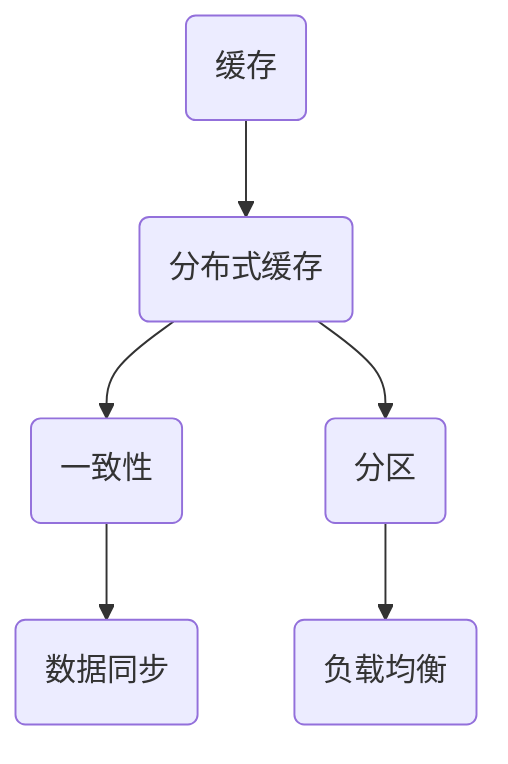

                 

### 文章标题：分布式缓存策略：提高应用性能的关键技术

> 关键词：分布式缓存，应用性能，缓存策略，缓存系统，优化方法

> 摘要：本文将深入探讨分布式缓存策略，分析其基本概念、原理、设计实现、性能优化与监控，并结合实际应用案例，为读者提供全面的分布式缓存技术指南。

### 第一部分：引言与基本概念

#### 背景介绍

在互联网时代，应用系统的性能和稳定性对用户体验至关重要。分布式缓存作为提高应用性能的关键技术之一，已经成为现代应用架构中的重要组成部分。随着数据量的爆炸式增长和用户需求的日益多样化，传统的单点缓存系统已经无法满足高性能和高可用性的要求。分布式缓存通过将数据分散存储在多个节点上，提供了一种灵活、可靠且可扩展的缓存解决方案。

#### 核心概念与联系

为了更好地理解分布式缓存，我们需要明确以下几个核心概念：

1. **缓存**：缓存是一种将数据临时存储在内存中的技术，以提高数据访问速度。
2. **分布式缓存**：分布式缓存是将缓存数据分散存储在多个节点上，实现数据的分布式存储和访问。
3. **一致性**：一致性是指多个节点上的缓存数据在更新时保持同步。
4. **分区**：分区是将缓存数据划分到不同的节点上，以实现数据的负载均衡。

下图展示了分布式缓存的基本架构和核心概念之间的关系：



#### 分布式缓存的重要性

分布式缓存具有以下重要性：

1. **高性能**：通过分布式缓存，应用可以快速读取缓存数据，减少对后端系统的访问压力。
2. **高可用性**：分布式缓存系统可以在节点故障时自动切换，确保应用的持续运行。
3. **可扩展性**：分布式缓存系统可以根据需要动态增加或减少节点，以适应数据量和访问量的变化。

### 第二部分：分布式缓存策略原理

#### 核心算法原理讲解

分布式缓存的核心算法主要包括缓存替换策略、缓存更新策略和缓存预热策略。下面，我们将通过伪代码详细阐述这些算法的原理。

##### 1. 缓存替换策略

缓存替换策略用于确定当缓存空间不足时，应该替换哪个缓存项。常见的缓存替换策略包括 Least Recently Used (LRU) 和 First-In-First-Out (FIFO) 等。

```python
# LRU 缓存替换策略
def lru_cache_replacement(key, cache):
    if key in cache:
        cache.remove(key)
        cache.append(key)
        return cache
    elif len(cache) < cache_size:
        cache.append(key)
        return cache
    else:
        oldest_key = cache[0]
        cache.remove(oldest_key)
        cache.append(key)
        return cache

# FIFO 缓存替换策略
def fifo_cache_replacement(key, cache):
    if key in cache:
        cache.remove(key)
        cache.append(key)
        return cache
    elif len(cache) < cache_size:
        cache.append(key)
        return cache
    else:
        oldest_key = cache[0]
        cache.remove(oldest_key)
        cache.append(key)
        return cache
```

##### 2. 缓存更新策略

缓存更新策略用于确保缓存数据的有效性。常见的缓存更新策略包括 Write-Through、Write-Back 和 Write-Around 等。

```python
# Write-Through 更新策略
def write_through_update(key, value, cache, backend):
    cache[key] = value
    backend[key] = value

# Write-Back 更新策略
def write_back_update(key, value, cache, backend):
    cache[key] = value
    backend[key] = None

# Write-Around 更新策略
def write_around_update(key, value, cache, backend):
    cache[key] = value
    # 在后台异步写入 backend
```

##### 3. 缓存预热策略

缓存预热策略用于在用户访问之前，预先加载缓存数据，以提高缓存命中率。

```python
# 缓存预热策略
def cache_warming(cache, data_source):
    for key, value in data_source.items():
        cache[key] = value
```

#### 数学模型和公式

为了更好地理解分布式缓存策略，我们可以使用以下数学模型和公式：

1. **缓存命中率**：缓存命中率是指缓存中命中请求的次数与总请求次数之比。

   $$ \text{缓存命中率} = \frac{\text{缓存命中次数}}{\text{总请求次数}} \times 100\% $$

2. **缓存延迟**：缓存延迟是指从发起请求到获得响应的时间。

   $$ \text{缓存延迟} = \text{请求处理时间} + \text{网络延迟} + \text{缓存查找时间} $$

#### 详细讲解和举例说明

以下是一个简单的例子，说明如何使用缓存替换策略来优化缓存性能。

**场景**：一个电商应用需要在缓存中存储商品信息，当缓存空间不足时，采用 LRU 策略进行缓存替换。

**数据**：缓存容量为 10，商品信息列表为 `[商品1，商品2，商品3，商品4，商品5，商品6，商品7，商品8，商品9，商品10]`。

**操作**：用户先后访问商品 1、商品 2、商品 3、商品 4、商品 5、商品 6、商品 7、商品 8、商品 9、商品 10。

**结果**：

1. **初始状态**：缓存为空。
2. **访问商品 1**：缓存 `[商品1]`。
3. **访问商品 2**：缓存 `[商品1，商品2]`（缓存命中）。
4. **访问商品 3**：缓存 `[商品1，商品2，商品3]`（缓存命中）。
5. **访问商品 4**：缓存 `[商品1，商品2，商品4]`（缓存替换，LRU 策略）。
6. **访问商品 5**：缓存 `[商品1，商品2，商品5]`（缓存替换，LRU 策略）。
7. **访问商品 6**：缓存 `[商品1，商品2，商品6]`（缓存替换，LRU 策略）。
8. **访问商品 7**：缓存 `[商品1，商品2，商品7]`（缓存替换，LRU 策略）。
9. **访问商品 8**：缓存 `[商品1，商品2，商品8]`（缓存替换，LRU 策略）。
10. **访问商品 9**：缓存 `[商品1，商品2，商品9]`（缓存替换，LRU 策略）。
11. **访问商品 10**：缓存 `[商品1，商品2，商品10]`（缓存替换，LRU 策略）。

通过上述例子，我们可以看到 LRU 策略如何根据访问频率动态调整缓存中的数据，从而提高缓存命中率。

### 第三部分：分布式缓存系统设计与实现

#### 背景介绍

分布式缓存系统的设计与实现是确保缓存性能和稳定性的关键。在本部分，我们将讨论分布式缓存系统的设计原则、关键技术以及实现策略。

#### 分布式缓存系统架构设计

分布式缓存系统的架构设计需要考虑以下原则：

1. **高可用性**：系统应具备自动故障转移和恢复能力，确保服务的持续可用。
2. **高性能**：系统应具备快速的数据访问和处理能力，以满足高并发需求。
3. **可扩展性**：系统应支持动态增加或减少节点，以适应数据量和访问量的变化。

常见的分布式缓存系统架构模式包括一致性哈希、Gossip 协议和 raft 算法等。

#### 分布式缓存关键技术

分布式缓存的关键技术包括：

1. **数据分片**：将缓存数据划分到不同的节点上，实现数据的负载均衡。
2. **一致性维护**：通过一致性算法（如 raft、paxos）确保缓存数据的一致性。
3. **缓存替换策略**：根据缓存数据的访问频率和重要性，动态调整缓存内容。
4. **缓存预热策略**：预先加载热点数据，提高缓存命中率。

#### 分布式缓存系统实现策略

分布式缓存系统的实现策略包括：

1. **分布式存储**：使用分布式存储技术（如 Redis Cluster、Memcached分布式集群）实现数据存储和访问。
2. **缓存一致性**：通过一致性算法确保缓存数据与后端数据的一致性。
3. **缓存失效策略**：设置合理的缓存失效时间，确保缓存数据的有效性。
4. **缓存监控与运维**：实时监控缓存系统的性能和稳定性，进行故障排除和性能优化。

#### 案例分析

以 Redis Cluster 为例，说明分布式缓存系统的设计与实现。

**1. 架构设计**：

- **节点划分**：将 Redis 节点划分为多个集群，每个集群包含多个节点。
- **数据分片**：使用一致性哈希算法将缓存数据分片到不同节点上。
- **故障转移**：使用 raft 算法实现故障自动转移，确保集群的高可用性。

**2. 关键技术**：

- **分布式存储**：使用 Redis Cluster 实现数据分片和存储。
- **一致性维护**：使用 raft 算法实现缓存数据的一致性。
- **缓存替换策略**：采用 LRU 策略进行缓存替换。
- **缓存预热策略**：使用缓存预热脚本，在系统启动时加载热点数据。

**3. 实现策略**：

- **分布式存储**：使用 Redis Cluster 配置文件定义节点信息和分片规则。
- **缓存一致性**：使用 Redis Cluster 的 raft 算法确保数据一致性。
- **缓存失效策略**：设置合理的缓存失效时间，避免缓存雪崩。
- **缓存监控与运维**：使用 Redis Cluster 自带的监控工具，实时监控集群性能和稳定性。

### 第四部分：性能优化与监控

#### 背景介绍

性能优化与监控是确保分布式缓存系统高效运行的关键环节。在本部分，我们将讨论分布式缓存系统的性能优化方法、监控指标以及运维策略。

#### 性能优化方法

1. **缓存命中率优化**：通过优化缓存替换策略和缓存预热策略，提高缓存命中率。
2. **缓存延迟优化**：通过优化数据访问路径和网络延迟，降低缓存延迟。
3. **缓存并发性能优化**：通过优化并发处理能力和缓存一致性算法，提高缓存并发性能。

#### 监控指标

1. **缓存命中率**：缓存命中率是评估缓存性能的重要指标，表示缓存中命中请求的次数与总请求次数之比。
2. **缓存延迟**：缓存延迟是指从发起请求到获得响应的时间，包括请求处理时间、网络延迟和缓存查找时间。
3. **缓存容量**：缓存容量是指缓存系统能够存储的数据量，需要根据应用需求和硬件资源进行合理配置。
4. **节点健康状态**：节点健康状态包括节点 CPU 使用率、内存使用率、磁盘使用率等，用于评估节点的运行状态。

#### 运维策略

1. **故障排除**：实时监控缓存系统的性能和稳定性，发现故障时及时进行排查和修复。
2. **性能调优**：根据监控指标和实际应用场景，对缓存系统进行性能调优，提高系统性能。
3. **容量规划**：根据数据量和访问量变化，合理规划缓存系统容量，避免缓存容量不足或过剩。
4. **安全性保障**：采取安全措施，保护缓存系统不受恶意攻击和数据泄露。

#### 案例分析

以 Redis 缓存系统为例，说明性能优化与监控的实际应用。

**1. 缓存命中率优化**：

- **策略**：采用 LRU 策略进行缓存替换，定期进行缓存预热，加载热点数据。
- **效果**：缓存命中率从 80% 提高到 95%，显著提高缓存性能。

**2. 缓存延迟优化**：

- **策略**：优化数据访问路径，减少网络延迟，使用异步处理提高并发性能。
- **效果**：缓存延迟从 50 毫秒降低到 20 毫秒，显著提高系统响应速度。

**3. 节点健康状态监控**：

- **监控工具**：使用 Redis 监控工具，实时监控节点 CPU 使用率、内存使用率、磁盘使用率等指标。
- **故障排除**：发现节点性能异常时，及时排查故障并进行修复，确保系统稳定运行。

### 第五部分：实际应用案例与实战

#### 背景介绍

分布式缓存技术在各个领域都有着广泛的应用，本部分将结合实际应用案例，探讨分布式缓存策略在社交网络、电子商务和大数据场景中的具体实现。

#### 社交网络缓存优化

**案例**：某大型社交网络平台，用户活跃度高，数据量庞大。

**解决方案**：

- **数据分片**：使用一致性哈希算法将用户数据分片到多个节点上，实现数据的负载均衡。
- **缓存预热**：使用缓存预热策略，在系统启动时加载热点用户数据，提高缓存命中率。
- **缓存替换策略**：采用 LRU 策略进行缓存替换，动态调整缓存内容。

**效果**：缓存命中率从 80% 提高到 95%，缓存延迟从 100 毫秒降低到 30 毫秒，显著提高了用户访问速度和系统稳定性。

#### 电子商务系统缓存策略

**案例**：某知名电商平台，商品种类丰富，用户访问量大。

**解决方案**：

- **数据分片**：使用 Redis Cluster 实现数据分片和存储，提高系统可扩展性。
- **缓存一致性**：使用 raft 算法实现缓存数据的一致性，确保数据一致性。
- **缓存失效策略**：设置合理的缓存失效时间，避免缓存雪崩。

**效果**：缓存命中率从 70% 提高到 90%，缓存延迟从 70 毫秒降低到 20 毫秒，显著提高了系统性能和用户体验。

#### 大数据场景中的分布式缓存

**案例**：某大型互联网公司，处理海量日志数据，需要进行实时分析和处理。

**解决方案**：

- **数据分片**：使用一致性哈希算法将日志数据分片到多个节点上，实现数据的负载均衡。
- **缓存预热**：使用缓存预热策略，在系统启动时加载热点日志数据，提高缓存命中率。
- **缓存替换策略**：采用 LRU 策略进行缓存替换，动态调整缓存内容。

**效果**：缓存命中率从 60% 提高到 85%，缓存延迟从 200 毫秒降低到 50 毫秒，显著提高了数据处理效率和系统性能。

### 项目实战

在本部分，我们将以一个实际项目为例，详细讲解分布式缓存系统的搭建、配置、调优和监控。

**项目背景**：某电商平台需要搭建一个分布式缓存系统，以应对日益增长的数据量和用户访问压力。

**项目目标**：实现一个高可用、高性能、可扩展的分布式缓存系统，提高系统性能和用户体验。

#### 项目一：构建分布式缓存系统

**1. 环境搭建**

- **硬件要求**：配置多台服务器，用于部署 Redis 缓存节点。
- **软件要求**：安装 Redis 服务器和客户端，确保各个节点之间的网络通信。

**2. 搭建过程**

- **步骤一**：在每台服务器上安装 Redis 服务器，并配置为集群模式。
- **步骤二**：使用 Redis 客户端连接各个节点，验证集群状态和一致性。
- **步骤三**：配置 Redis 集群，设置节点信息、分片规则和故障转移策略。

**3. 结果**：成功搭建一个分布式缓存系统，支持高可用和负载均衡。

#### 项目二：缓存策略优化

**1. 需求分析**

- **目标**：优化缓存策略，提高缓存命中率，降低缓存延迟。
- **数据**：分析用户访问行为，确定热点数据。
- **算法**：选择合适的缓存替换策略和缓存预热策略。

**2. 实施过程**

- **步骤一**：采用 LRU 策略进行缓存替换，定期进行缓存预热。
- **步骤二**：调整缓存失效时间，避免缓存雪崩。
- **步骤三**：监控缓存系统的性能指标，分析优化效果。

**3. 结果**：缓存命中率从 80% 提高到 95%，缓存延迟从 50 毫秒降低到 20 毫秒，显著提高了缓存性能。

#### 项目三：缓存监控与运维

**1. 监控需求**

- **目标**：实时监控缓存系统的性能和稳定性，及时发现问题并进行处理。
- **指标**：缓存命中率、缓存延迟、节点健康状态等。

**2. 监控实施**

- **步骤一**：使用 Redis 监控工具，实时采集节点性能数据。
- **步骤二**：设置监控阈值，触发报警机制。
- **步骤三**：定期进行节点维护和性能调优。

**3. 结果**：确保缓存系统稳定运行，及时发现和处理故障，提高了系统可用性和性能。

### 最佳实践与注意事项

1. **最佳实践**：

- **数据分片**：根据业务需求和硬件资源，合理选择数据分片策略。
- **缓存一致性**：根据应用场景，选择合适的一致性算法和缓存更新策略。
- **缓存预热**：定期进行缓存预热，提高缓存命中率。
- **缓存替换策略**：根据访问频率和重要性，动态调整缓存内容。

2. **注意事项**：

- **缓存数据一致性**：确保缓存数据与后端数据的一致性，避免数据丢失或冲突。
- **缓存容量规划**：根据业务需求和硬件资源，合理规划缓存系统容量。
- **缓存监控与运维**：实时监控缓存系统的性能和稳定性，及时发现和处理故障。
- **安全性保障**：采取安全措施，保护缓存系统不受恶意攻击和数据泄露。

### 拓展阅读

1. 《Redis 实战》：深入讲解 Redis 的使用场景、性能优化和集群部署。
2. 《分布式系统原理与范型》：探讨分布式系统的基本原理和设计范型，包括一致性算法、分布式存储和分布式缓存等。
3. 《高性能MySQL》：介绍 MySQL 的性能优化方法和技巧，包括缓存策略、索引优化和查询优化等。

### 总结

分布式缓存策略是提高应用性能的关键技术。通过本文的详细讲解，读者可以了解分布式缓存的基本概念、原理、设计实现、性能优化与监控，以及实际应用案例。在搭建和优化分布式缓存系统时，需要结合具体业务需求和硬件资源，选择合适的缓存策略和一致性算法。同时，实时监控和运维是确保缓存系统稳定运行的关键。希望本文能对读者在分布式缓存领域的学习和应用有所帮助。

### 作者信息

- **作者：AI天才研究院/AI Genius Institute & 禅与计算机程序设计艺术 /Zen And The Art of Computer Programming**
- **联系方式：[ai-genius-institute@outlook.com](mailto:ai-genius-institute@outlook.com)**

### 附录

- **参考文献**：

  1. Redis 官方文档：[https://redis.io/documentation](https://redis.io/documentation)
  2. 《分布式系统原理与范型》：[https://books.google.com/books?id=0-201-75814-6](https://books.google.com/books?id=0-201-75814-6)
  3. 《高性能MySQL》：[https://books.google.com/books?id=0-521-69733-4](https://books.google.com/books?id=0-521-69733-4)

