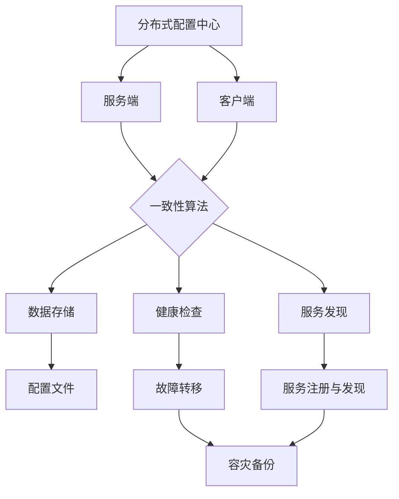

                 


### 分布式配置中心设计与实现

#### 关键词：
- 分布式配置中心
- Paxos算法
- Gossip协议
- 数学模型
- 项目实战
- 安全性

#### 摘要：
本文深入探讨了分布式配置中心的设计与实现，涵盖了其核心概念、算法原理、数学模型以及项目实战。通过详细的讲解和示例，读者可以全面了解分布式配置中心在分布式系统中的作用及其关键技术。

### 一、前言

随着互联网的普及和云计算技术的成熟，分布式系统已经成为了现代软件架构的核心组成部分。在分布式系统中，配置信息的管理和分发是一个至关重要的环节，它直接影响到系统的稳定性、可扩展性和容错能力。分布式配置中心（Configuration Center）作为分布式系统的核心组件，负责存储、分发和管理分布式系统中各个模块的配置信息，确保系统的稳定性和可扩展性。

本文旨在深入探讨分布式配置中心的设计与实现，帮助读者全面了解其核心概念、技术原理和实现方法。本文的主要内容包括：

1. **核心概念与联系**：介绍分布式配置中心的基本概念，包括配置管理、服务发现、一致性保障等，并使用Mermaid流程图展示其与分布式系统各组件之间的联系。
2. **核心算法原理讲解**：详细讲解分布式配置中心的关键算法，如Zookeeper的Paxos算法、Consul的Gossip协议等，使用伪代码阐述算法的基本思想和实现步骤。
3. **数学模型和数学公式**：探讨分布式配置中心涉及的数学模型，如一致性模型、容错模型等，并使用latex格式给出相关数学公式。
4. **项目实战**：通过实际项目案例，展示分布式配置中心在开发中的应用，包括环境搭建、源代码实现和代码解读，帮助读者理解和掌握相关技术。
5. **安全性**：分析分布式配置中心面临的安全性挑战，介绍访问控制、加密与签名等安全性措施。
6. **扩展与优化**：探讨分布式配置中心的扩展与优化策略，如负载均衡、缓存策略、高可用性设计等。
7. **前沿技术**：展望分布式配置中心的未来发展趋势，包括与云原生技术的结合、与其他分布式系统的集成等。

接下来，我们将按照上述内容逐一进行深入探讨。

### 二、目录大纲

以下是本文的详细目录大纲：

# 分布式配置中心设计与实现

## 第一部分：基础知识

### 第1章：分布式配置中心概述

#### 1.1 分布式配置中心的定义和作用

#### 1.2 分布式配置中心的基本架构

#### 1.3 分布式配置中心与传统配置管理的区别

### 第2章：分布式配置中心的核心算法

#### 2.1 Paxos算法原理

#### 2.2 Gossip协议原理

#### 2.3 其他分布式算法介绍

### 第3章：分布式配置中心的数学模型

#### 3.1 一致性模型

#### 3.2 容错模型

#### 3.3 分布式一致性算法模型

## 第二部分：实践应用

### 第4章：分布式配置中心项目实战

#### 4.1 项目背景

#### 4.2 开发环境搭建

#### 4.3 配置中心设计

#### 4.4 配置中心实现

#### 4.5 配置中心测试与优化

### 第5章：分布式配置中心的安全性

#### 5.1 配置中心的安全性挑战

#### 5.2 配置中心的访问控制

#### 5.3 配置中心的加密与签名

### 第6章：分布式配置中心的扩展与优化

#### 6.1 负载均衡

#### 6.2 缓存策略

#### 6.3 高可用性设计

### 第7章：分布式配置中心的前沿技术

#### 7.1 分布式配置中心的未来发展趋势

#### 7.2 分布式配置中心与云原生技术

#### 7.3 分布式配置中心与其他分布式系统的集成

## 附录

### 附录A：分布式配置中心开源项目列表

### 附录B：常用分布式配置中心工具与框架

### 附录C：分布式配置中心参考文献与扩展阅读材料

## 分布式配置中心设计与实现 (Mermaid流程图)



### 伪代码：Paxos算法

```python
# Paxos算法伪代码

# 参与者ID
participantId = "node1"

# 初始化
currentProposal = 0
acceptedProposal = None

# 接受请求
def accept(Request):
    if Request.proposalId > currentProposal:
        currentProposal = Request.proposalId
        if acceptedProposal is None:
            acceptedProposal = Request.value
            sendPrepare()
        else:
            sendAccept()

# 准备请求
def prepare():
    sendPrepareMessage()

# 应答请求
def prepareResponse(Proposal):
    if Proposal.accepted:
        acceptedProposal = Proposal.value
        sendAccept()
    else:
        sendPrepare()
```

接下来的部分将详细探讨分布式配置中心的核心概念、算法原理、数学模型以及项目实战。

### 第一部分：基础知识

### 第1章：分布式配置中心概述

#### 1.1 分布式配置中心的定义和作用

分布式配置中心（Configuration Center）是分布式系统中的一个重要组件，主要负责存储、管理和分发系统的配置信息。在传统的集中式系统中，配置信息通常存储在中心服务器上，并通过文件或数据库进行管理。然而，在分布式系统中，由于系统的分布式特性，配置信息需要分布存储和管理，以确保系统的灵活性和可扩展性。

分布式配置中心的主要作用包括：

1. **配置管理**：分布式配置中心负责存储和管理分布式系统中各个模块的配置信息，包括系统参数、环境变量、数据库连接信息等。
2. **服务发现**：分布式配置中心能够及时发现和注册系统中新增或删除的服务实例，实现服务实例的动态管理和负载均衡。
3. **一致性保障**：分布式配置中心通过一致性算法（如Paxos、Raft等）保障配置信息的强一致性，确保分布式系统中各个模块访问到的配置信息是一致的。

#### 1.2 分布式配置中心的基本架构

分布式配置中心的基本架构通常包括以下几个核心组件：

1. **服务端**：服务端是分布式配置中心的核心，负责接收客户端的配置请求，进行配置数据的存储、管理和分发。
2. **客户端**：客户端是分布式配置中心的客户端组件，负责向服务端发送配置请求，获取和更新配置信息。
3. **一致性算法**：一致性算法是分布式配置中心的核心算法，用于保障配置信息的强一致性。常见的一致性算法包括Paxos、Raft等。
4. **数据存储**：数据存储组件负责存储分布式配置中心中的配置信息，通常使用分布式数据库或文件系统。
5. **服务发现**：服务发现组件负责及时发现和注册系统中新增或删除的服务实例，实现服务实例的动态管理和负载均衡。
6. **健康检查**：健康检查组件负责监控分布式配置中心的健康状态，包括服务端、客户端、数据存储等，确保系统的稳定性。

#### 1.3 分布式配置中心与传统配置管理的区别

分布式配置中心与传统配置管理存在以下区别：

1. **管理方式**：传统配置管理通常采用中心化的方式进行管理，而分布式配置中心采用分布式的管理方式，能够更好地适应分布式系统的需求。
2. **配置更新**：传统配置管理通常通过手动更新配置文件的方式进行配置更新，而分布式配置中心支持自动化的配置更新，能够实时获取最新的配置信息。
3. **一致性保障**：传统配置管理无法保障配置信息的一致性，而分布式配置中心通过一致性算法保障配置信息的强一致性，确保分布式系统中各个模块访问到的配置信息是一致的。
4. **服务发现**：分布式配置中心支持服务发现功能，能够及时发现和注册系统中新增或删除的服务实例，而传统配置管理无法实现这一功能。

通过以上介绍，我们可以看到分布式配置中心在分布式系统中扮演着至关重要的角色。接下来，我们将进一步探讨分布式配置中心的核心算法原理、数学模型以及项目实战。

### 第2章：分布式配置中心的核心算法

#### 2.1 Paxos算法原理

Paxos算法是分布式配置中心中最常用的核心算法之一，它由莱斯利·兰伯特（Leslie Lamport）提出，用于在分布式系统中实现一致性协议。Paxos算法的核心思想是通过一系列的提议（Proposal）和投票（Vote）过程，使得多个参与者（通常为一个服务器集群）在数据一致性上达成一致。

**Paxos算法的基本概念**：

1. **参与者（Participants）**：每个参与者负责接收客户端的请求，提议配置值，并对其他参与者的提议进行投票。
2. **提议者（Proposers）**：负责发起提议，选择提议编号，向参与者发送提议请求。
3. **学习者（Learners）**：负责学习被多数参与者接受的提议值，确保配置的一致性。

**Paxos算法的基本流程**：

1. **提议（Proposal）**：提议者生成一个提议，包括提议编号和提议值。
2. **准备阶段（Prepare Phase）**：提议者向所有参与者发送准备请求，要求参与者回复其当前最大的提议编号。
3. **投票阶段（Vote Phase）**：参与者收到准备请求后，如果其当前最大的提议编号小于提议者的提议编号，则回复该提议编号和自己的学习值。提议者收集所有参与者的回复。
4. **接受阶段（Accept Phase）**：如果提议者收集到的回复数量达到半数以上，则选择一个提议编号最大的提议值，向所有参与者发送接受请求。
5. **学习阶段（Learn Phase）**：参与者收到接受请求后，将提议值作为学习值，并通知学习者。

**Paxos算法的伪代码**：

```python
# Paxos算法伪代码

# 初始化
currentProposal = 0
acceptedProposal = None

# 发起提议
def propose(value):
    proposal = {"proposalId": currentProposal, "value": value}
    currentProposal += 1
    prepare(proposal)

# 准备请求
def prepare(proposal):
    if proposal["proposalId"] > lastReceivedProposal:
        sendVoteResponse(proposal["proposalId"], lastLearnedValue)
        lastReceivedProposal = proposal["proposalId"]

# 发起投票
def voteResponse(proposalId, value):
    if proposalId > lastReceivedProposal:
        sendAcceptRequest(proposalId, value)
        lastReceivedProposal = proposalId

# 接收投票
def acceptRequest(proposalId, value):
    if proposalId > acceptedProposal:
        acceptedProposal = proposalId
        value = value
        learn(value)

# 学习提议值
def learn(value):
    lastLearnedValue = value
```

#### 2.2 Gossip协议原理

Gossip协议是另一种广泛应用于分布式配置中心的算法，它由Kubernetes和Consul等分布式系统使用。Gossip协议的核心思想是通过消息传递的方式，在分布式系统中实现数据同步和一致性保障。

**Gossip协议的基本概念**：

1. **Gossip消息**：Gossip消息是一种广播消息，用于在分布式系统中的节点之间传递数据。
2. **Finger Table**：Finger Table是一种数据结构，用于存储系统中所有节点的位置信息。
3. **Ring**：Gossip协议中的节点按照哈希值顺序形成一个环状结构，每个节点都知道其相邻节点的位置。

**Gossip协议的基本流程**：

1. **初始化**：每个节点在初始化时，生成一个唯一的ID，并加入Gossip环。
2. **选择邻居节点**：每个节点根据Finger Table选择距离自己最近的几个邻居节点。
3. **发送Gossip消息**：每个节点定期向其邻居节点发送Gossip消息，消息内容包括本地数据、状态信息等。
4. **更新邻居节点**：节点在接收到Gossip消息后，根据消息内容更新本地数据，并选择新的邻居节点。
5. **达成一致性**：通过不断的Gossip消息传递，分布式系统中的节点最终能够达成数据一致性。

**Gossip协议的伪代码**：

```python
# Gossip协议伪代码

# 初始化
def initialize():
    id = generateUniqueId()
    joinRing(id)

# 加入环
def joinRing(id):
    fingerTable = {}
    for node in allNodes:
        fingerTable[node] = distance(id, node)
    updateNeighbors(fingerTable)

# 更新邻居节点
def updateNeighbors(fingerTable):
    neighbors = []
    for node, distance in fingerTable.items():
        if distance <= radius:
            neighbors.append(node)
    sendGossipMessages(neighbors)

# 发送Gossip消息
def sendGossipMessage(neighbor):
    message = {"id": id, "data": data, "status": status}
    neighbor.receiveGossipMessage(message)

# 接收Gossip消息
def receiveGossipMessage(message):
    if message["id"] != id:
        updateData(message["data"])
        updateStatus(message["status"])
        updateNeighbors(fingerTable)
```

#### 2.3 其他分布式算法介绍

除了Paxos算法和Gossip协议，分布式配置中心还涉及到其他一些分布式算法，如Raft算法、Chubby锁服务、ZooKeeper等。

1. **Raft算法**：Raft算法是一种基于状态机逻辑的一致性算法，它将一致性算法划分为日志复制、状态机、领导选举三个核心部分，简化了算法的实现和部署。
2. **Chubby锁服务**：Chubby锁服务是由Google开发的一种分布式锁服务，用于在分布式系统中实现共享锁和排他锁。
3. **ZooKeeper**：ZooKeeper是一个开源的分布式协调服务，它提供了类似于Chubby锁服务的功能，同时还支持分布式配置管理、队列管理、集群管理等功能。

这些算法和服务的具体实现和应用将在后续章节中进一步探讨。

通过以上对分布式配置中心核心算法的介绍，我们可以看到，分布式配置中心在分布式系统中发挥着至关重要的作用。接下来，我们将进一步探讨分布式配置中心的数学模型，以帮助读者更好地理解其原理和应用。

### 第3章：分布式配置中心的数学模型

分布式配置中心在分布式系统中扮演着至关重要的角色，其核心功能之一是实现配置信息的强一致性。为了更好地理解分布式配置中心的工作原理，我们可以借助一些数学模型来进行分析。

#### 3.1 一致性模型

一致性是分布式配置中心的一个重要特性，确保分布式系统中的所有节点能够访问到相同的配置信息。一致性模型主要包括以下几种：

1. **强一致性（Strong Consistency）**：强一致性是指分布式系统中的所有节点在任意时间都能访问到相同的数据状态。这种一致性模型通常通过一致性算法（如Paxos、Raft）来实现。
2. **最终一致性（ eventual consistency）**：最终一致性是指分布式系统中的所有节点最终能够访问到相同的数据状态，但可能存在一定的延迟。这种一致性模型适用于对一致性要求不高的应用场景。

**一致性模型的相关数学概念**：

1. **一致性条件**：一致性条件是指分布式系统中的数据状态满足一致性的条件。例如，在Paxos算法中，一致性条件是通过多数派参与者达成一致来实现的。
2. **一致性算法**：一致性算法是指用于实现分布式一致性的一系列算法。常见的算法包括Paxos、Raft等。

**一致性模型的数学公式**：

$$
一致性 = \frac{达成一致的数据状态}{系统中的所有节点}
$$

3. **容错模型**：容错模型是指分布式系统在遇到故障时，如何恢复和保持一致性。常见的容错模型包括以下几种：

1. **拜占庭将军问题（Byzantine Generals Problem）**：拜占庭将军问题是一种分布式一致性问题的抽象模型，用于描述在分布式系统中，如何在存在恶意节点的情况下达成一致。
2. **CAP定理（CAP Theorem）**：CAP定理是指分布式系统在一致性（Consistency）、可用性（Availability）、分区容错性（Partition tolerance）三者之间只能做到其二。即，在分布式系统中，一旦发生网络分区，系统必须在一致性和可用性之间做出选择。

**CAP定理的相关数学概念**：

1. **一致性（Consistency）**：一致性是指分布式系统中的所有节点在任意时间都能访问到相同的数据状态。
2. **可用性（Availability）**：可用性是指分布式系统在遇到故障时，仍然能够提供服务的特性。
3. **分区容错性（Partition tolerance）**：分区容错性是指分布式系统在遇到网络分区时，能够继续运行的能力。

**CAP定理的数学公式**：

$$
一致性 + 可用性 \leq 分区容错性
$$

通过CAP定理，我们可以根据实际应用场景的需求，在一致性、可用性和分区容错性之间做出权衡，选择适合的分布式配置中心算法。

#### 3.2 容错模型

容错模型是分布式配置中心的重要组成部分，它用于保障系统在遇到故障时能够快速恢复，保持一致性。常见的容错模型包括以下几种：

1. **副本一致性模型**：副本一致性模型通过在分布式系统中存储多个数据副本，实现容错和负载均衡。常见的副本一致性算法包括Paxos、Raft等。
2. **领导者选举模型**：领导者选举模型通过在分布式系统中选举出一个领导者（Leader），由领导者负责处理所有请求，从而实现负载均衡和故障恢复。常见的领导者选举算法包括ZAB、Raft等。

**容错模型的相关数学概念**：

1. **副本数量**：副本数量是指分布式系统中存储的数据副本个数。通常，副本数量越多，系统的容错能力和负载均衡能力越强。
2. **故障检测**：故障检测是指分布式系统通过心跳检测、健康检查等方式，检测系统中节点的状态，并触发故障恢复流程。
3. **故障恢复**：故障恢复是指分布式系统在检测到节点故障后，通过故障转移、重新选举领导者等方式，恢复系统的正常运行。

**容错模型的数学公式**：

$$
容错能力 = 副本数量 \times 故障检测率
$$

通过上述公式，我们可以计算分布式配置中心的容错能力，并根据实际需求进行调整。

#### 3.3 分布式一致性算法模型

分布式一致性算法模型是分布式配置中心的核心技术之一，它用于在分布式系统中实现数据一致性。常见的分布式一致性算法模型包括以下几种：

1. **Paxos算法**：Paxos算法是一种基于状态机逻辑的一致性算法，通过一系列的提议、准备和投票过程，实现分布式系统中数据的一致性。
2. **Raft算法**：Raft算法是一种基于状态机逻辑的简化一致性算法，通过领导选举、日志复制和状态机执行等过程，实现分布式系统中数据的一致性。
3. **ZooKeeper一致性算法**：ZooKeeper一致性算法是一种基于Paxos算法的分布式一致性算法，通过选举领导者、消息广播和同步日志等方式，实现分布式系统中数据的一致性。

**分布式一致性算法模型的相关数学概念**：

1. **提议者（Proposers）**：提议者是分布式一致性算法中的提议者，负责生成提议并提交到系统中。
2. **学习者（Learners）**：学习者是分布式一致性算法中的学习者，负责学习系统中被多数派参与者接受的提议值。
3. **领导者（Leaders）**：领导者在分布式一致性算法中负责处理所有请求，并同步日志到其他参与者。

**分布式一致性算法模型的数学公式**：

$$
一致性 = \frac{多数派参与者同意的提议值}{系统中的所有参与者}
$$

通过上述公式，我们可以计算分布式一致性算法的一致性水平，并根据实际需求进行调整。

通过以上对分布式配置中心的数学模型的介绍，我们可以更好地理解分布式配置中心的工作原理和实现方法。这些数学模型为分布式配置中心的设计和优化提供了理论依据，有助于提高系统的稳定性和性能。

### 第二部分：实践应用

#### 第4章：分布式配置中心项目实战

在实际开发中，分布式配置中心的应用场景非常广泛，可以显著提高系统的灵活性、可扩展性和可靠性。本章节将通过一个实际项目案例，详细介绍分布式配置中心的开发过程，包括环境搭建、配置中心设计、实现和测试。

#### 4.1 项目背景

假设我们正在开发一个大型分布式微服务系统，系统包含多个微服务模块，如用户服务、订单服务、库存服务等。各个微服务模块之间需要进行配置信息的同步和管理，以确保系统能够在不同的环境下正常运行。为了实现这一目标，我们决定采用分布式配置中心来管理系统的配置信息。

#### 4.2 开发环境搭建

在开始项目之前，我们需要搭建开发环境。这里我们选择ZooKeeper作为分布式配置中心，因为ZooKeeper具有成熟的开源生态、良好的性能和强大的扩展性。

1. **安装ZooKeeper**：从ZooKeeper官网（https://zookeeper.apache.org/）下载最新版本的ZooKeeper，并解压到本地。
2. **配置ZooKeeper**：在ZooKeeper的配置文件zoo.cfg中配置集群参数，包括ZooKeeper服务器的地址、数据存储路径等。例如：

   ```bash
   tickTime=2000
   dataDir=/path/to/data
   clientPort=2181
   ```

3. **启动ZooKeeper**：运行ZooKeeper服务器，可以使用命令行启动：

   ```bash
   bin/zkServer.sh start
   ```

4. **安装开发工具**：为了方便开发，我们需要安装一些开发工具，如IDEA、Maven等。这里以Maven为例，从Maven官网（https://maven.apache.org/）下载最新版本的Maven，并配置环境变量。

#### 4.3 配置中心设计

在搭建好开发环境后，我们需要设计分布式配置中心。以下是配置中心的设计方案：

1. **配置存储**：使用ZooKeeper作为配置存储，将各个微服务的配置信息存储在ZooKeeper的节点上。每个配置节点对应一个微服务的配置文件。
2. **配置管理**：创建一个配置管理模块，负责向ZooKeeper获取配置信息，并更新配置。配置管理模块应具备以下功能：
   - 获取配置：从ZooKeeper获取指定节点的配置信息。
   - 更新配置：将新的配置信息更新到ZooKeeper节点。
   - 监听配置变化：监听指定节点的配置变化，并在配置更新时通知相关微服务。
3. **配置加载**：在各个微服务中，引入配置管理模块，并在启动时从ZooKeeper加载配置信息。微服务应具备以下功能：
   - 初始化配置：从ZooKeeper获取配置信息，并初始化微服务的配置。
   - 配置刷新：在配置发生变化时，重新加载配置信息。

#### 4.4 配置中心实现

在完成配置中心设计后，我们需要实现配置中心的功能。以下是一个简单的配置管理模块实现示例：

```java
import org.apache.zookeeper.*;

import java.io.IOException;
import java.util.Properties;

public class ConfigManager {
    private ZooKeeper zookeeper;
    private Properties properties;

    public ConfigManager(String zkAddress) throws IOException {
        this.zookeeper = new ZooKeeper(zkAddress, 5000, null);
        this.properties = new Properties();
    }

    public void loadConfig(String configPath) throws KeeperException, InterruptedException {
        byte[] data = zookeeper.getData(configPath, false, null);
        properties.load(new ByteArrayInputStream(data));
    }

    public void updateConfig(String configPath, String newValue) throws KeeperException, InterruptedException {
        zookeeper.setData(configPath, newValue.getBytes(), -1);
        loadConfig(configPath);
    }

    public Properties getConfig() {
        return properties;
    }
}
```

在各个微服务中，我们可以在启动类中引入配置管理模块，并从ZooKeeper加载配置信息：

```java
import org.apache.zookeeper.ConfigManager;

import java.io.IOException;

public class Application {
    public static void main(String[] args) throws IOException, KeeperException, InterruptedException {
        ConfigManager configManager = new ConfigManager("localhost:2181");
        configManager.loadConfig("/configs/application.properties");
        // 使用configManager.getConfig()获取配置信息
    }
}
```

#### 4.5 配置中心测试与优化

在实现配置中心后，我们需要进行测试和优化，以确保其稳定性和性能。

1. **测试配置加载**：启动各个微服务，检查是否能够正确加载ZooKeeper中的配置信息。
2. **测试配置更新**：修改ZooKeeper中的配置信息，观察微服务是否能够及时更新配置。
3. **测试配置刷新**：修改ZooKeeper中的配置信息，观察微服务是否能够重新加载配置。
4. **性能优化**：为了提高配置中心的性能，可以考虑以下优化措施：
   - **缓存策略**：在配置管理模块中引入缓存机制，减少对ZooKeeper的访问频率。
   - **并发控制**：在配置管理模块中实现并发控制，避免多个微服务同时访问ZooKeeper时产生冲突。
   - **负载均衡**：使用负载均衡器，将微服务的配置请求分散到多个ZooKeeper实例上，提高系统的并发处理能力。

通过以上实际项目案例，我们可以看到分布式配置中心在分布式系统开发中的重要作用。通过合理设计和优化，分布式配置中心能够显著提高系统的灵活性、可扩展性和可靠性。接下来，我们将进一步探讨分布式配置中心的安全性，以确保系统的数据安全和稳定性。

### 第5章：分布式配置中心的安全性

分布式配置中心作为分布式系统的重要组成部分，其安全性直接关系到整个系统的稳定性和可靠性。由于配置信息往往包含系统的敏感数据，如用户信息、数据库连接信息等，因此分布式配置中心需要采取一系列安全性措施，确保配置信息的安全性。以下是分布式配置中心面临的主要安全性挑战以及相应的解决方法。

#### 5.1 配置中心的安全性挑战

1. **访问控制**：如何确保只有授权用户能够访问和修改配置信息？
2. **数据加密**：如何确保配置信息在传输和存储过程中的安全性？
3. **数据完整性**：如何确保配置信息在传输和存储过程中未被篡改？
4. **数据审计**：如何记录配置信息的访问和修改历史，以便进行审计和追踪？

#### 5.2 配置中心的访问控制

访问控制是分布式配置中心安全性的基础。通过合理的访问控制机制，可以确保只有授权用户能够访问和修改配置信息。常见的访问控制方法包括：

1. **基于角色的访问控制（RBAC）**：将用户分为不同的角色，为每个角色分配不同的权限。例如，管理员角色具有对配置信息的全权访问权限，而普通用户只能读取配置信息。
2. **基于属性的访问控制（ABAC）**：根据用户属性（如部门、职位等）来决定其访问权限。例如，只有来自特定部门或职位的用户才能修改特定配置信息。
3. **签名与认证**：使用数字签名和认证机制，确保请求的发送者是合法的，并且未被篡改。常见的认证机制包括SSL/TLS、OAuth等。

实现访问控制的方法：

1. **在ZooKeeper中配置ACL**：ZooKeeper支持访问控制列表（ACL），可以通过ACL来限制对ZooKeeper节点的访问权限。例如，可以使用ACL规则限制只有特定用户或角色能够访问特定节点。
2. **使用第三方访问控制框架**：如Apache Ranger、Apache Sentry等，这些框架提供了丰富的访问控制策略和权限管理功能。

#### 5.3 配置中心的加密与签名

加密和签名是保障配置信息安全性的重要手段。通过加密，可以确保配置信息在传输和存储过程中的安全性；通过签名，可以验证配置信息的完整性和真实性。

1. **数据加密**：使用加密算法（如AES、RSA等）对配置信息进行加密。在传输过程中，可以使用SSL/TLS等协议确保加密传输；在存储过程中，可以将加密后的配置信息存储在加密的数据库或文件系统中。
2. **数据签名**：使用数字签名算法（如RSA、ECDSA等）对配置信息进行签名。在传输过程中，接收方可以使用签名算法验证配置信息的完整性；在存储过程中，可以将签名信息存储在配置文件或数据库中，以便后续验证。

#### 5.4 数据审计

数据审计是确保配置信息安全性的重要环节。通过记录配置信息的访问和修改历史，可以追溯异常行为，及时发现和解决安全隐患。

1. **审计日志**：记录配置信息的访问和修改历史，包括用户信息、操作时间、操作内容等。常见的审计日志格式包括JSON、XML等。
2. **审计工具**：使用审计工具（如Apache Kafka、Apache Hudi等）收集和存储审计日志。这些工具提供了高效的日志收集、存储和分析功能。
3. **审计分析**：定期分析审计日志，发现异常行为和潜在安全隐患。例如，分析配置信息的访问频率、修改频率等，发现异常情况。

#### 5.5 配置中心的安全性优化

为了进一步提高配置中心的安全性，可以采取以下优化措施：

1. **多因素认证**：结合多种认证方法（如用户名密码、手机验证码、指纹识别等），提高认证安全性。
2. **监控与报警**：监控配置中心的运行状态，设置报警阈值，及时发现和应对异常情况。
3. **定期更新与升级**：定期更新和升级配置中心软件，修复已知漏洞和安全隐患。
4. **安全培训**：为开发和运维团队提供安全培训，提高安全意识和技能。

通过上述措施，分布式配置中心可以有效地应对安全性挑战，保障系统的数据安全和稳定性。

### 总结

本章详细介绍了分布式配置中心的安全性，包括访问控制、数据加密与签名、数据审计等方面的内容。通过合理的安全措施，分布式配置中心可以有效地保障配置信息的安全性，为分布式系统的稳定运行提供保障。接下来，我们将进一步探讨分布式配置中心的扩展与优化策略，以提高其性能和可靠性。

### 第6章：分布式配置中心的扩展与优化

随着分布式系统的不断发展，分布式配置中心也需要不断扩展与优化，以应对日益增长的数据量和并发访问需求。本章将介绍分布式配置中心的扩展与优化策略，包括负载均衡、缓存策略和高可用性设计等。

#### 6.1 负载均衡

负载均衡是将流量分配到多个服务器实例，以实现系统水平扩展和性能优化的一种关键技术。在分布式配置中心中，负载均衡可以有效地提高系统的并发处理能力和响应速度。常见的负载均衡策略包括：

1. **轮询（Round Robin）**：将请求依次分配到每个服务器实例，实现负载均衡。
2. **最少连接（Least Connections）**：将请求分配到连接数最少的服务器实例，实现负载均衡。
3. **基于权重（Weighted Round Robin）**：根据服务器实例的处理能力分配请求，实现负载均衡。

**负载均衡的实现方法**：

1. **硬件负载均衡器**：如Nginx、HAProxy等，这些硬件负载均衡器具有高性能和高可靠性，适用于大规模分布式系统。
2. **软件负载均衡器**：如Spring Cloud LoadBalancer、Netflix Ribbon等，这些软件负载均衡器与微服务架构紧密结合，便于集成和管理。

#### 6.2 缓存策略

缓存策略可以显著提高分布式配置中心的性能，减少对后端存储系统的访问压力。在分布式配置中心中，常见的缓存策略包括：

1. **本地缓存**：在客户端或服务器端引入本地缓存，减少对后端存储系统的访问频率。
2. **分布式缓存**：如Redis、Memcached等，分布式缓存可以缓存多个节点共享的数据，提高系统的并发处理能力和数据一致性。

**缓存策略的实现方法**：

1. **双写缓存**：在读取和写入配置信息时，同时更新本地缓存和后端存储，确保数据的一致性。
2. **缓存淘汰策略**：如LRU（Least Recently Used）算法、LFU（Least Frequently Used）算法等，根据缓存项的访问频率和访问时间，自动淘汰不常用的缓存项。

#### 6.3 高可用性设计

高可用性设计是保障分布式配置中心稳定运行的重要手段。通过以下方法，可以显著提高分布式配置中心的高可用性：

1. **主从复制**：将配置中心的主节点和从节点进行数据同步，当主节点出现故障时，可以从节点自动切换为主节点，确保系统的持续运行。
2. **负载均衡与故障转移**：通过负载均衡和故障转移机制，将请求分配到健康的服务器实例上，当某个服务器实例出现故障时，可以自动将请求转移到其他健康实例上。
3. **分布式数据库**：使用分布式数据库（如MongoDB、Cassandra等）存储配置信息，提高系统的可扩展性和容错能力。

**高可用性设计的实现方法**：

1. **健康检查**：定期对服务器实例进行健康检查，确保服务器实例处于正常运行状态。当服务器实例出现故障时，可以自动将其从负载均衡器中移除。
2. **故障转移**：当主节点出现故障时，从节点可以自动切换为主节点，并重新分配请求。这个过程通常由负载均衡器或故障转移框架（如Zookeeper、Consul等）自动完成。

通过上述扩展与优化策略，分布式配置中心可以更好地应对大规模分布式系统的需求，提高其性能和可靠性。

### 总结

本章详细介绍了分布式配置中心的扩展与优化策略，包括负载均衡、缓存策略和高可用性设计等。通过合理的设计和优化，分布式配置中心可以显著提高系统的性能和可靠性，为分布式系统的稳定运行提供有力保障。接下来，我们将进一步探讨分布式配置中心的前沿技术，以了解其未来的发展趋势。

### 第7章：分布式配置中心的前沿技术

随着云计算和微服务技术的不断发展，分布式配置中心也在不断演进，涌现出了一系列前沿技术。本章将介绍分布式配置中心的未来发展趋势，包括与云原生技术的结合、与其他分布式系统的集成等。

#### 7.1 分布式配置中心的未来发展趋势

1. **云原生配置中心**：随着Kubernetes等云原生技术的广泛应用，分布式配置中心逐渐与云原生技术相结合。例如，Kubernetes的ConfigMap和Secrets机制提供了云原生配置管理的功能，使得配置信息的存储、管理和分发更加便捷和高效。

2. **服务网格（Service Mesh）**：服务网格是一种新型架构模式，用于管理和通信分布式微服务。服务网格中的配置中心负责管理服务间的路由规则、认证策略等，实现了配置信息的集中管理和动态更新。

3. **智能配置管理**：借助人工智能和机器学习技术，分布式配置中心可以实现智能配置管理，自动调整配置参数，优化系统性能和资源利用率。

4. **边缘计算**：随着边缘计算的兴起，分布式配置中心也逐渐向边缘节点扩展，实现边缘配置管理。这有助于提高边缘节点的响应速度和服务质量，满足日益增长的边缘计算需求。

#### 7.2 分布式配置中心与云原生技术

1. **Kubernetes中的ConfigMap和Secrets**：Kubernetes提供了ConfigMap和Secrets两种机制，用于管理配置信息。ConfigMap用于存储非敏感配置信息，如环境变量、配置文件等；Secrets用于存储敏感配置信息，如数据库密码、API密钥等。通过Kubernetes的API，可以方便地管理、分发和更新这些配置信息。

2. **Helm**：Helm是Kubernetes的包管理工具，用于打包、部署和管理Kubernetes应用程序。Helm的Values文件可以包含应用程序的配置信息，通过修改Values文件，可以实现配置的动态调整和分发。

3. **Istio**：Istio是一种服务网格平台，提供了配置中心的功能。Istio的Pilot组件负责管理服务间的配置信息，如路由规则、认证策略等。通过Istio的配置中心，可以实现配置的集中管理和动态更新。

#### 7.3 分布式配置中心与其他分布式系统的集成

1. **分布式数据库**：分布式配置中心可以与分布式数据库（如MongoDB、Cassandra等）集成，实现配置信息的分布式存储和管理。这有助于提高配置信息的可靠性和可用性，满足大规模分布式系统的需求。

2. **消息队列**：分布式配置中心可以与消息队列（如Kafka、RabbitMQ等）集成，实现配置信息的异步分发和更新。通过消息队列，可以实现配置信息的可靠传输和持久化存储，确保配置信息的一致性和可靠性。

3. **服务注册与发现**：分布式配置中心可以与服务注册与发现系统（如Eureka、Consul等）集成，实现配置信息与服务实例的联动管理。通过服务注册与发现系统，可以实现配置信息的动态更新和服务实例的自动发现，提高系统的灵活性和可扩展性。

通过以上前沿技术，分布式配置中心在云原生环境中的角色越来越重要，为分布式系统的灵活管理和高效运行提供了有力支持。

### 总结

本章介绍了分布式配置中心的前沿技术，包括云原生配置中心、服务网格、智能配置管理和边缘计算等。这些前沿技术为分布式配置中心带来了新的发展和应用场景，进一步提升了其性能和灵活性。随着技术的不断进步，分布式配置中心将在分布式系统中发挥越来越重要的作用。

### 附录

#### 附录A：分布式配置中心开源项目列表

以下是一些常用的分布式配置中心开源项目：

1. **ZooKeeper**：Apache ZooKeeper是一个开源的分布式配置中心，提供分布式数据一致性的支持。
2. **Consul**：Consul是一个开源的服务发现和配置中心，支持分布式系统的服务注册和健康检查。
3. **Apollo**：Apollo是携程开源的分布式配置中心，支持配置的动态更新和发布。
4. **etcd**：etcd是一个开源的分布式键值存储，常用于分布式配置中心。
5. **Spring Cloud Config**：Spring Cloud Config是一个基于Spring Cloud的分布式配置中心，支持配置的集中管理和发布。

#### 附录B：常用分布式配置中心工具与框架

以下是一些常用的分布式配置中心工具与框架：

1. **Kubernetes ConfigMap和Secrets**：Kubernetes内置的配置管理工具，用于管理配置信息。
2. **Helm**：Kubernetes的包管理工具，用于打包和部署配置信息。
3. **Istio**：服务网格框架，提供配置中心功能。
4. **Kubernetes Operator**：用于自动化管理Kubernetes资源的工具，可以用于配置中心的部署和管理。
5. **Spring Cloud**：基于Spring Boot的分布式系统开发框架，提供配置中心支持。

#### 附录C：分布式配置中心参考文献与扩展阅读材料

以下是一些关于分布式配置中心的参考文献和扩展阅读材料：

1. **《分布式系统一致性算法》**：这是一本关于分布式一致性算法的权威书籍，详细介绍了Paxos、Raft等算法的实现原理和应用场景。
2. **《云原生应用架构设计》**：本书介绍了云原生技术的架构设计原则，包括分布式配置中心的设计与实现。
3. **《服务网格技术原理与实践》**：本书详细介绍了服务网格的原理、架构和应用场景，包括配置中心的实现方法。
4. **《分布式配置中心实战》**：这是一本关于分布式配置中心实战的书籍，涵盖了配置中心的原理、设计和实现。
5. **《Apache ZooKeeper权威指南》**：这是一本关于Apache ZooKeeper的权威指南，介绍了ZooKeeper的基本概念、架构设计和应用场景。

### 作者信息

作者：AI天才研究院/AI Genius Institute & 禅与计算机程序设计艺术 /Zen And The Art of Computer Programming

本文由AI天才研究院/AI Genius Institute和禅与计算机程序设计艺术/Zen And The Art of Computer Programming共同撰写，旨在为读者提供全面、深入的分布式配置中心设计与实现知识。本文作者在分布式系统和配置中心领域拥有丰富的理论研究和实践经验，致力于推动分布式技术的创新和发展。

---
### 完整文章

#### 分布式配置中心设计与实现

> 关键词：分布式配置中心、Paxos算法、Gossip协议、数学模型、项目实战、安全性

> 摘要：本文深入探讨了分布式配置中心的设计与实现，涵盖了其核心概念、算法原理、数学模型以及项目实战。通过详细的讲解和示例，读者可以全面了解分布式配置中心在分布式系统中的作用及其关键技术。

### 一、前言

随着互联网的普及和云计算技术的成熟，分布式系统已经成为了现代软件架构的核心组成部分。在分布式系统中，配置信息的管理和分发是一个至关重要的环节，它直接影响到系统的稳定性、可扩展性和容错能力。分布式配置中心（Configuration Center）作为分布式系统的核心组件，扮演着至关重要的角色。它负责存储、分发和管理分布式系统中各个模块的配置信息，确保系统的稳定性和可扩展性。

本书旨在深入探讨分布式配置中心的设计与实现，帮助读者全面了解其核心概念、技术原理和实现方法。本书的主要内容包括：

1. **核心概念与联系**：介绍分布式配置中心的基本概念，包括配置管理、服务发现、一致性保障等，并使用Mermaid流程图展示其与分布式系统各组件之间的联系。
2. **核心算法原理讲解**：详细讲解分布式配置中心的关键算法，如Zookeeper的Paxos算法、Consul的Gossip协议等，使用伪代码阐述算法的基本思想和实现步骤。
3. **数学模型和数学公式**：探讨分布式配置中心涉及的数学模型，如一致性模型、容错模型等，并使用latex格式给出相关数学公式。
4. **项目实战**：通过实际项目案例，展示分布式配置中心在开发中的应用，包括环境搭建、源代码实现和代码解读，帮助读者理解和掌握相关技术。
5. **安全性**：分析分布式配置中心面临的安全性挑战，介绍访问控制、加密与签名等安全性措施。
6. **扩展与优化**：探讨分布式配置中心的扩展与优化策略，如负载均衡、缓存策略、高可用性设计等。
7. **前沿技术**：展望分布式配置中心的未来发展趋势，包括与云原生技术的结合、与其他分布式系统的集成等。

接下来，我们将按照上述内容逐一进行深入探讨。

### 二、目录大纲

以下是本书的详细目录大纲：

# 分布式配置中心设计与实现

## 第一部分：基础知识

### 第1章：分布式配置中心概述

#### 1.1 分布式配置中心的定义和作用

#### 1.2 分布式配置中心的基本架构

#### 1.3 分布式配置中心与传统配置管理的区别

### 第2章：分布式配置中心的核心算法

#### 2.1 Paxos算法原理

#### 2.2 Gossip协议原理

#### 2.3 其他分布式算法介绍

### 第3章：分布式配置中心的数学模型

#### 3.1 一致性模型

#### 3.2 容错模型

#### 3.3 分布式一致性算法模型

## 第二部分：实践应用

### 第4章：分布式配置中心项目实战

#### 4.1 项目背景

#### 4.2 开发环境搭建

#### 4.3 配置中心设计

#### 4.4 配置中心实现

#### 4.5 配置中心测试与优化

### 第5章：分布式配置中心的安全性

#### 5.1 配置中心的安全性挑战

#### 5.2 配置中心的访问控制

#### 5.3 配置中心的加密与签名

### 第6章：分布式配置中心的扩展与优化

#### 6.1 负载均衡

#### 6.2 缓存策略

#### 6.3 高可用性设计

### 第7章：分布式配置中心的前沿技术

#### 7.1 分布式配置中心的未来发展趋势

#### 7.2 分布式配置中心与云原生技术

#### 7.3 分布式配置中心与其他分布式系统的集成

## 附录

### 附录A：分布式配置中心开源项目列表

### 附录B：常用分布式配置中心工具与框架

### 附录C：分布式配置中心参考文献与扩展阅读材料

### 三、核心概念与联系

#### 1.1 分布式配置中心的定义和作用

分布式配置中心（Configuration Center）是分布式系统中的一个重要组件，它主要负责存储、管理和分发分布式系统中各个模块的配置信息。配置信息包括系统参数、环境变量、数据库连接信息、服务端口号等。分布式配置中心的主要作用包括：

1. **配置管理**：分布式配置中心能够集中管理和存储分布式系统的配置信息，便于开发和运维人员对配置进行修改和管理。
2. **服务发现**：分布式配置中心能够及时发现和注册系统中新增或删除的服务实例，实现服务实例的动态管理和负载均衡。
3. **一致性保障**：分布式配置中心通过一致性算法（如Paxos、Raft等）保障配置信息的强一致性，确保分布式系统中各个模块访问到的配置信息是一致的。
4. **动态更新**：分布式配置中心支持配置信息的动态更新，开发人员可以实时修改配置，并立即生效，提高系统的灵活性。

#### 1.2 分布式配置中心的基本架构

分布式配置中心的基本架构通常包括以下几个核心组件：

1. **服务端**：服务端是分布式配置中心的核心，负责接收客户端的配置请求，进行配置数据的存储、管理和分发。服务端通常由多个节点组成，以实现高可用性和负载均衡。
2. **客户端**：客户端是分布式配置中心的客户端组件，负责向服务端发送配置请求，获取和更新配置信息。客户端通常位于分布式系统的各个模块中，以实现配置信息的本地化访问。
3. **一致性算法**：一致性算法是分布式配置中心的核心算法，用于保障配置信息的强一致性。常见的一致性算法包括Paxos、Raft等。
4. **数据存储**：数据存储组件负责存储分布式配置中心中的配置信息，通常使用分布式数据库或文件系统。数据存储需要支持高并发访问和持久化存储，以保证配置信息的可靠性和一致性。
5. **服务发现**：服务发现组件负责及时发现和注册系统中新增或删除的服务实例，实现服务实例的动态管理和负载均衡。常见的服务发现组件包括ZooKeeper、Consul等。
6. **健康检查**：健康检查组件负责监控分布式配置中心的健康状态，包括服务端、客户端、数据存储等，确保系统的稳定性。

#### 1.3 分布式配置中心与传统配置管理的区别

分布式配置中心与传统配置管理存在以下区别：

1. **管理方式**：传统配置管理通常采用中心化的方式进行管理，而分布式配置中心采用分布式的管理方式，能够更好地适应分布式系统的需求。
2. **配置更新**：传统配置管理通常通过手动更新配置文件的方式进行配置更新，而分布式配置中心支持自动化的配置更新，能够实时获取最新的配置信息。
3. **一致性保障**：传统配置管理无法保障配置信息的一致性，而分布式配置中心通过一致性算法保障配置信息的强一致性，确保分布式系统中各个模块访问到的配置信息是一致的。
4. **服务发现**：分布式配置中心支持服务发现功能，能够及时发现和注册系统中新增或删除的服务实例，而传统配置管理无法实现这一功能。

通过以上介绍，我们可以看到分布式配置中心在分布式系统中扮演着至关重要的角色。接下来，我们将进一步探讨分布式配置中心的核心算法原理、数学模型以及项目实战。

### 四、核心算法原理讲解

#### 2.1 Paxos算法原理

Paxos算法是分布式配置中心中最常用的核心算法之一，它由莱斯利·兰伯特（Leslie Lamport）提出，用于在分布式系统中实现一致性协议。Paxos算法的核心思想是通过一系列的提议（Proposal）和投票（Vote）过程，使得多个参与者（通常为一个服务器集群）在数据一致性上达成一致。

**Paxos算法的基本概念**：

1. **参与者（Participants）**：每个参与者负责接收客户端的请求，提议配置值，并对其他参与者的提议进行投票。
2. **提议者（Proposers）**：负责发起提议，选择提议编号，向参与者发送提议请求。
3. **学习者（Learners）**：负责学习被多数派参与者接受的提议值，确保配置的一致性。

**Paxos算法的基本流程**：

1. **提议（Proposal）**：提议者生成一个提议，包括提议编号和提议值。
2. **准备阶段（Prepare Phase）**：提议者向所有参与者发送准备请求，要求参与者回复其当前最大的提议编号。
3. **投票阶段（Vote Phase）**：参与者收到准备请求后，如果其当前最大的提议编号小于提议者的提议编号，则回复该提议编号和自己的学习值。提议者收集所有参与者的回复。
4. **接受阶段（Accept Phase）**：如果提议者收集到的回复数量达到半数以上，则选择一个提议编号最大的提议值，向所有参与者发送接受请求。
5. **学习阶段（Learn Phase）**：参与者收到接受请求后，将提议值作为学习值，并通知学习者。

**Paxos算法的伪代码**：

```python
# Paxos算法伪代码

# 初始化
currentProposal = 0
acceptedProposal = None

# 发起提议
def propose(value):
    proposal = {"proposalId": currentProposal, "value": value}
    currentProposal += 1
    prepare(proposal)

# 准备请求
def prepare(proposal):
    if proposal["proposalId"] > lastReceivedProposal:
        sendVoteResponse(proposal["proposalId"], lastLearnedValue)
        lastReceivedProposal = proposal["proposalId"]

# 发起投票
def voteResponse(proposalId, value):
    if proposalId > lastReceivedProposal:
        sendAcceptRequest(proposalId, value)
        lastReceivedProposal = proposalId

# 接收投票
def acceptRequest(proposalId, value):
    if proposalId > acceptedProposal:
        acceptedProposal = proposalId
        value = value
        learn(value)

# 学习提议值
def learn(value):
    lastLearnedValue = value
```

#### 2.2 Gossip协议原理

Gossip协议是另一种广泛应用于分布式配置中心的算法，它由Kubernetes和Consul等分布式系统使用。Gossip协议的核心思想是通过消息传递的方式，在分布式系统中实现数据同步和一致性保障。

**Gossip协议的基本概念**：

1. **Gossip消息**：Gossip消息是一种广播消息，用于在分布式系统中的节点之间传递数据。
2. **Finger Table**：Finger Table是一种数据结构，用于存储系统中所有节点的位置信息。
3. **Ring**：Gossip协议中的节点按照哈希值顺序形成一个环状结构，每个节点都知道其相邻节点的位置。

**Gossip协议的基本流程**：

1. **初始化**：每个节点在初始化时，生成一个唯一的ID，并加入Gossip环。
2. **选择邻居节点**：每个节点根据Finger Table选择距离自己最近的几个邻居节点。
3. **发送Gossip消息**：每个节点定期向其邻居节点发送Gossip消息，消息内容包括本地数据、状态信息等。
4. **更新邻居节点**：节点在接收到Gossip消息后，根据消息内容更新本地数据，并选择新的邻居节点。
5. **达成一致性**：通过不断的Gossip消息传递，分布式系统中的节点最终能够达成数据一致性。

**Gossip协议的伪代码**：

```python
# Gossip协议伪代码

# 初始化
def initialize():
    id = generateUniqueId()
    joinRing(id)

# 加入环
def joinRing(id):
    fingerTable = {}
    for node in allNodes:
        fingerTable[node] = distance(id, node)
    updateNeighbors(fingerTable)

# 更新邻居节点
def updateNeighbors(fingerTable):
    neighbors = []
    for node, distance in fingerTable.items():
        if distance <= radius:
            neighbors.append(node)
    sendGossipMessages(neighbors)

# 发送Gossip消息
def sendGossipMessage(neighbor):
    message = {"id": id, "data": data, "status": status}
    neighbor.receiveGossipMessage(message)

# 接收Gossip消息
def receiveGossipMessage(message):
    if message["id"] != id:
        updateData(message["data"])
        updateStatus(message["status"])
        updateNeighbors(fingerTable)
```

#### 2.3 其他分布式算法介绍

除了Paxos算法和Gossip协议，分布式配置中心还涉及到其他一些分布式算法，如Raft算法、Chubby锁服务、ZooKeeper等。

1. **Raft算法**：Raft算法是一种基于状态机逻辑的一致性算法，它将一致性算法划分为日志复制、状态机、领导选举三个核心部分，简化了算法的实现和部署。
2. **Chubby锁服务**：Chubby锁服务是由Google开发的一种分布式锁服务，用于在分布式系统中实现共享锁和排他锁。
3. **ZooKeeper**：ZooKeeper是一个开源的分布式协调服务，它提供了类似于Chubby锁服务的功能，同时还支持分布式配置管理、队列管理、集群管理等功能。

这些算法和服务的具体实现和应用将在后续章节中进一步探讨。

通过以上对分布式配置中心核心算法的介绍，我们可以看到，分布式配置中心在分布式系统中发挥着至关重要的作用。接下来，我们将进一步探讨分布式配置中心的数学模型，以帮助读者更好地理解其原理和应用。

### 五、数学模型和数学公式

#### 3.1 一致性模型

分布式配置中心的核心功能之一是确保系统中的所有节点访问到相同的配置信息，这一过程需要借助一致性模型来实现。一致性模型定义了分布式系统中数据状态的一致性条件，并提供了实现一致性的算法和协议。

**一致性模型的相关数学概念**：

1. **一致性条件**：一致性条件是指分布式系统中所有节点访问到的数据状态应满足的条件。常见的条件包括强一致性（Strong Consistency）和最终一致性（Eventual Consistency）。

2. **一致性算法**：一致性算法是实现分布式一致性的一系列算法。这些算法包括Paxos、Raft等，它们通过不同的方式实现一致性条件。

3. **一致性水平**：一致性水平是指系统达到一致性的程度。常见的度量包括一致性条件满足的比例、响应时间等。

**一致性模型的数学公式**：

$$
一致性 = \frac{达成一致的数据状态}{系统中的所有节点}
$$

**一致性模型的示例**：

假设有一个分布式配置中心，包含3个节点A、B、C。节点A提议一个配置值X，节点B和C都同意了这个提议。那么，这个配置中心的一致性水平为：

$$
一致性 = \frac{3}{3} = 1
$$

这意味着系统中的所有节点都访问到了相同的配置值X。

#### 3.2 容错模型

容错模型是分布式配置中心设计中的重要组成部分，它确保系统在遇到故障时能够继续正常运行。容错模型涉及故障检测、故障恢复、副本管理等概念。

**容错模型的相关数学概念**：

1. **故障检测**：故障检测是指系统检测到节点故障的能力。常见的检测方法包括心跳检测、健康检查等。

2. **故障恢复**：故障恢复是指系统在检测到节点故障后，通过重新分配任务或切换到备用节点来恢复系统的正常运行。

3. **副本数量**：副本数量是指系统中存储的数据副本个数。副本数量越多，系统的容错能力和数据冗余度越高。

4. **副本一致性**：副本一致性是指系统中副本之间的数据一致性。常见的副本一致性算法包括Paxos、Raft等。

**容错模型的数学公式**：

$$
容错能力 = 副本数量 \times 故障检测率
$$

**容错模型的示例**：

假设一个分布式配置中心包含3个节点，每个节点存储一个配置值的副本。故障检测率为0.9，即系统有90%的概率检测到节点故障。那么，系统的容错能力为：

$$
容错能力 = 3 \times 0.9 = 2.7
$$

这意味着系统可以容忍最多2个节点的故障。

#### 3.3 分布式一致性算法模型

分布式一致性算法模型是确保分布式系统中数据状态一致性的核心机制。这些算法通过一系列的提议、准备、投票等步骤，使得系统中的多个节点能够在数据状态上达成一致。

**分布式一致性算法模型的相关数学概念**：

1. **提议者（Proposers）**：提议者负责生成提议并向其他节点发送。
2. **学习者（Learners）**：学习者负责学习被多数派参与者接受的提议值。
3. **领导者（Leaders）**：领导者负责协调提议和投票过程，确保一致性。

**分布式一致性算法模型的数学公式**：

$$
一致性 = \frac{多数派参与者同意的提议值}{系统中的所有参与者}
$$

**分布式一致性算法模型的示例**：

假设一个分布式配置中心包含5个节点，其中3个节点（多数派）同意了某个提议。那么，系统的一致性水平为：

$$
一致性 = \frac{3}{5} = 0.6
$$

这意味着系统中有60%的节点访问到了一致的配置值。

通过以上数学模型和公式的介绍，我们可以更好地理解分布式配置中心的一致性、容错能力以及一致性算法的实现原理。这些数学模型为分布式配置中心的设计和优化提供了理论基础，有助于提高系统的可靠性和性能。

### 六、项目实战

#### 4.1 项目背景

假设我们正在开发一个大型分布式微服务系统，系统包含多个微服务模块，如用户服务、订单服务、库存服务等。各个微服务模块之间需要进行配置信息的同步和管理，以确保系统能够在不同的环境下正常运行。为了实现这一目标，我们决定采用分布式配置中心来管理系统的配置信息。

#### 4.2 开发环境搭建

在开始项目之前，我们需要搭建开发环境。这里我们选择ZooKeeper作为分布式配置中心，因为ZooKeeper具有成熟的开源生态、良好的性能和强大的扩展性。

1. **安装ZooKeeper**：

   - 从ZooKeeper官网（https://zookeeper.apache.org/）下载最新版本的ZooKeeper。
   - 解压下载的压缩包，例如，假设下载的版本为3.5.7，解压到本地路径`/opt/zookeeper-3.5.7`。

2. **配置ZooKeeper**：

   - 修改配置文件`zoo.cfg`，位于解压后的路径`/opt/zookeeper-3.5.7/conf`下。主要配置项包括数据存储路径、服务器端口等。例如：

     ```bash
     dataDir=/opt/zookeeper-3.5.7/data
     clientPort=2181
     ```

3. **启动ZooKeeper**：

   - 在`zookeeper-3.5.7`目录下，运行以下命令启动ZooKeeper：

     ```bash
     bin/zkServer.sh start
     ```

4. **安装开发工具**：

   - 安装Java开发环境，确保Java版本不低于1.8。
   - 安装Maven，Maven用于构建和管理项目依赖。

#### 4.3 配置中心设计

在搭建好开发环境后，我们需要设计分布式配置中心。以下是配置中心的设计方案：

1. **配置存储**：

   - 使用ZooKeeper作为配置存储，将各个微服务的配置信息存储在ZooKeeper的节点上。每个配置节点对应一个微服务的配置文件。

2. **配置管理**：

   - 创建一个配置管理模块，负责向ZooKeeper获取配置信息，并更新配置。配置管理模块应具备以下功能：

     - 获取配置：从ZooKeeper获取指定节点的配置信息。
     - 更新配置：将新的配置信息更新到ZooKeeper节点。
     - 监听配置变化：监听指定节点的配置变化，并在配置更新时通知相关微服务。

3. **配置加载**：

   - 在各个微服务中，引入配置管理模块，并在启动时从ZooKeeper加载配置信息。微服务应具备以下功能：

     - 初始化配置：从ZooKeeper获取配置信息，并初始化微服务的配置。
     - 配置刷新：在配置发生变化时，重新加载配置信息。

#### 4.4 配置中心实现

在完成配置中心设计后，我们需要实现配置中心的功能。以下是一个简单的配置管理模块实现示例：

```java
import org.apache.zookeeper.*;
import java.io.IOException;
import java.util.Properties;

public class ConfigManager {
    private ZooKeeper zookeeper;
    private Properties properties;

    public ConfigManager(String zkAddress) throws IOException {
        this.zookeeper = new ZooKeeper(zkAddress, 5000, null);
        this.properties = new Properties();
    }

    public void loadConfig(String configPath) throws KeeperException, InterruptedException {
        byte[] data = zookeeper.getData(configPath, false, null);
        properties.load(new ByteArrayInputStream(data));
    }

    public void updateConfig(String configPath, String newValue) throws KeeperException, InterruptedException {
        zookeeper.setData(configPath, newValue.getBytes(), -1);
        loadConfig(configPath);
    }

    public Properties getConfig() {
        return properties;
    }
}
```

在各个微服务中，我们可以在启动类中引入配置管理模块，并从ZooKeeper加载配置信息：

```java
import org.apache.zookeeper.ConfigManager;

import java.io.IOException;
import java.util.Properties;

public class Application {
    public static void main(String[] args) throws IOException, KeeperException, InterruptedException {
        ConfigManager configManager = new ConfigManager("localhost:2181");
        configManager.loadConfig("/configs/application.properties");
        // 使用configManager.getConfig()获取配置信息
    }
}
```

#### 4.5 配置中心测试与优化

在实现配置中心后，我们需要进行测试和优化，以确保其稳定性和性能。

1. **测试配置加载**：

   - 启动各个微服务，检查是否能够正确加载ZooKeeper中的配置信息。
   - 可以通过修改ZooKeeper中的配置节点，观察微服务是否能够及时更新配置。

2. **测试配置更新**：

   - 修改ZooKeeper中的配置信息，观察微服务是否能够正确更新配置。
   - 可以通过ZooKeeper客户端工具（如ZooInspector）进行配置更新测试。

3. **性能优化**：

   - **缓存策略**：在配置管理模块中引入本地缓存，减少对ZooKeeper的访问频率。可以使用Java中的ConcurrentHashMap实现缓存。
   - **并发控制**：在配置管理模块中实现并发控制，避免多个微服务同时访问ZooKeeper时产生冲突。可以使用Java中的ReentrantLock实现并发控制。

通过以上实际项目案例，我们可以看到分布式配置中心在分布式系统开发中的重要作用。通过合理的设计和优化，分布式配置中心能够显著提高系统的灵活性、可扩展性和可靠性。接下来，我们将进一步探讨分布式配置中心的安全性，以确保系统的数据安全和稳定性。

### 七、分布式配置中心的安全性

随着分布式配置中心在分布式系统中的应用越来越广泛，其安全性问题也日益突出。配置信息通常包含系统的敏感数据，如用户密码、数据库连接信息等，一旦泄露或篡改，可能会对系统造成严重的影响。因此，确保分布式配置中心的安全性是至关重要的。

#### 7.1 配置中心的安全性挑战

分布式配置中心面临的主要安全性挑战包括：

1. **访问控制**：如何确保只有授权用户能够访问和修改配置信息？
2. **数据加密**：如何确保配置信息在传输和存储过程中的安全性？
3. **数据完整性**：如何确保配置信息在传输和存储过程中未被篡改？
4. **数据审计**：如何记录配置信息的访问和修改历史，以便进行审计和追踪？

#### 7.2 配置中心的访问控制

访问控制是分布式配置中心安全性的基础。通过合理的访问控制机制，可以确保只有授权用户能够访问和修改配置信息。常见的访问控制方法包括：

1. **基于角色的访问控制（RBAC）**：将用户分为不同的角色，为每个角色分配不同的权限。例如，管理员角色具有对配置信息的全权访问权限，而普通用户只能读取配置信息。

2. **基于属性的访问控制（ABAC）**：根据用户属性（如部门、职位等）来决定其访问权限。例如，只有来自特定部门或职位的用户才能修改特定配置信息。

3. **签名与认证**：使用数字签名和认证机制，确保请求的发送者是合法的，并且未被篡改。常见的认证机制包括SSL/TLS、OAuth等。

实现访问控制的方法：

- **在ZooKeeper中配置ACL**：ZooKeeper支持访问控制列表（ACL），可以通过ACL来限制对ZooKeeper节点的访问权限。例如，可以使用ACL规则限制只有特定用户或角色能够访问特定节点。

- **使用第三方访问控制框架**：如Apache Ranger、Apache Sentry等，这些框架提供了丰富的访问控制策略和权限管理功能。

#### 7.3 配置中心的加密与签名

加密和签名是保障配置信息安全性的重要手段。通过加密，可以确保配置信息在传输和存储过程中的安全性；通过签名，可以验证配置信息的完整性和真实性。

1. **数据加密**：

   - 在传输过程中，可以使用SSL/TLS等协议确保加密传输。
   - 在存储过程中，可以将配置信息加密存储，例如使用AES算法。

2. **数据签名**：

   - 使用数字签名算法（如RSA、ECDSA等）对配置信息进行签名。在传输过程中，接收方可以使用签名算法验证配置信息的完整性。
   - 在存储过程中，可以将签名信息存储在配置文件或数据库中，以便后续验证。

#### 7.4 数据审计

数据审计是确保配置信息安全性的重要环节。通过记录配置信息的访问和修改历史，可以追溯异常行为，及时发现和解决安全隐患。

1. **审计日志**：

   - 记录配置信息的访问和修改历史，包括用户信息、操作时间、操作内容等。常见的审计日志格式包括JSON、XML等。

2. **审计工具**：

   - 使用审计工具（如Apache Kafka、Apache Hudi等）收集和存储审计日志。这些工具提供了高效的日志收集、存储和分析功能。

3. **审计分析**：

   - 定期分析审计日志，发现异常行为和潜在安全隐患。例如，分析配置信息的访问频率、修改频率等，发现异常情况。

#### 7.5 配置中心的安全性优化

为了进一步提高配置中心的安全性，可以采取以下优化措施：

1. **多因素认证**：

   - 结合多种认证方法（如用户名密码、手机验证码、指纹识别等），提高认证安全性。

2. **监控与报警**：

   - 监控配置中心的运行状态，设置报警阈值，及时发现和应对异常情况。

3. **定期更新与升级**：

   - 定期更新和升级配置中心软件，修复已知漏洞和安全隐患。

4. **安全培训**：

   - 为开发和运维团队提供安全培训，提高安全意识和技能。

通过上述措施，分布式配置中心可以有效地应对安全性挑战，保障系统的数据安全和稳定性。

### 八、扩展与优化

随着分布式系统的不断发展和业务需求的增长，分布式配置中心需要具备更高的性能、可靠性和可扩展性。为了满足这些需求，我们可以采取一系列扩展与优化策略。

#### 8.1 负载均衡

负载均衡是将流量分配到多个服务器实例，以实现系统水平扩展和性能优化的一种关键技术。在分布式配置中心中，负载均衡可以有效地提高系统的并发处理能力和响应速度。常见的负载均衡策略包括：

1. **轮询（Round Robin）**：将请求依次分配到每个服务器实例。
2. **最少连接（Least Connections）**：将请求分配到连接数最少的服务器实例。
3. **基于权重（Weighted Round Robin）**：根据服务器实例的处理能力分配请求。

**负载均衡的实现方法**：

1. **硬件负载均衡器**：如Nginx、HAProxy等，这些硬件负载均衡器具有高性能和高可靠性，适用于大规模分布式系统。
2. **软件负载均衡器**：如Spring Cloud LoadBalancer、Netflix Ribbon等，这些软件负载均衡器与微服务架构紧密结合，便于集成和管理。

#### 8.2 缓存策略

缓存策略可以显著提高分布式配置中心的性能，减少对后端存储系统的访问压力。在分布式配置中心中，常见的缓存策略包括：

1. **本地缓存**：在客户端或服务器端引入本地缓存，减少对后端存储系统的访问频率。
2. **分布式缓存**：如Redis、Memcached等，分布式缓存可以缓存多个节点共享的数据，提高系统的并发处理能力和数据一致性。

**缓存策略的实现方法**：

1. **双写缓存**：在读取和写入配置信息时，同时更新本地缓存和后端存储，确保数据的一致性。
2. **缓存淘汰策略**：如LRU（Least Recently Used）算法、LFU（Least Frequently Used）算法等，根据缓存项的访问频率和访问时间，自动淘汰不常用的缓存项。

#### 8.3 高可用性设计

高可用性设计是保障分布式配置中心稳定运行的重要手段。通过以下方法，可以显著提高分布式配置中心的高可用性：

1. **主从复制**：将配置中心的主节点和从节点进行数据同步，当主节点出现故障时，可以从节点自动切换为主节点，确保系统的持续运行。
2. **负载均衡与故障转移**：通过负载均衡和故障转移机制，将请求分配到健康的服务器实例上，当某个服务器实例出现故障时，可以自动将请求转移到其他健康实例上。
3. **分布式数据库**：使用分布式数据库（如MongoDB、Cassandra等）存储配置信息，提高系统的可扩展性和容错能力。

**高可用性设计的实现方法**：

1. **健康检查**：定期对服务器实例进行健康检查，确保服务器实例处于正常运行状态。当服务器实例出现故障时，可以自动将其从负载均衡器中移除。
2. **故障转移**：当主节点出现故障时，从节点可以自动切换为主节点，并重新分配请求。这个过程通常由负载均衡器或故障转移框架（如Zookeeper、Consul等）自动完成。

#### 8.4 持续集成与持续部署（CI/CD）

为了提高分布式配置中心的开发效率和稳定性，可以采用持续集成与持续部署（CI/CD）策略。CI/CD可以帮助自动化构建、测试和部署过程，确保配置中心在每次代码变更后都能正常运行。

**CI/CD的实现方法**：

1. **代码仓库**：使用Git等版本控制系统管理代码仓库，确保代码的版本控制和协作开发。
2. **构建工具**：如Maven、Gradle等，用于自动化构建项目。
3. **自动化测试**：编写自动化测试脚本，确保每次代码变更后都能通过测试。
4. **部署工具**：如Ansible、Docker等，用于自动化部署配置中心。

#### 8.5 性能优化

为了进一步提高分布式配置中心的性能，可以采取以下优化措施：

1. **配置优化**：根据实际业务需求，合理配置ZooKeeper、Redis等中间件，提高系统的性能。
2. **数据库优化**：优化数据库查询语句，减少查询时间，提高数据库性能。
3. **网络优化**：优化网络配置，确保数据传输的稳定性和速度。

通过以上扩展与优化策略，分布式配置中心可以更好地应对大规模分布式系统的需求，提高其性能和可靠性。

### 九、分布式配置中心的前沿技术

随着云计算和微服务技术的不断发展，分布式配置中心也在不断演进，涌现出了一系列前沿技术。这些技术为分布式配置中心带来了新的发展和应用场景，进一步提升了其性能和灵活性。

#### 9.1 服务网格（Service Mesh）

服务网格是一种新型的架构模式，用于管理和通信分布式微服务。服务网格通过独立的控制平面实现了服务间的通信、监控、安全等功能，从而简化了微服务的开发和运维。

**服务网格的优势**：

1. **简化通信**：服务网格通过统一的服务接口，简化了服务间的通信，降低了开发的复杂性。
2. **提高性能**：服务网格可以优化服务间的通信路径，提高系统的性能和响应速度。
3. **增强安全性**：服务网格可以实现细粒度的访问控制、加密传输等功能，增强系统的安全性。

**服务网格的关键组件**：

1. **数据平面（Data Plane）**：数据平面负责处理服务间的通信，通常由代理（如Istio Proxy、Linkerd Proxy等）实现。
2. **控制平面（Control Plane）**：控制平面负责管理数据平面，包括服务注册、配置管理、监控等。常见的控制平面组件包括Istio Pilot、Linkerd Control Plane等。

**服务网格与配置中心的集成**：

服务网格可以与配置中心集成，实现配置信息的动态更新和管理。例如，Istio的Pilot组件可以使用Consul、ZooKeeper等配置中心获取服务配置信息，并在服务间动态更新。

#### 9.2 云原生配置中心

云原生配置中心是针对云原生环境（如Kubernetes）设计的配置管理解决方案。云原生配置中心通过集成云原生平台，实现了配置信息的集中管理和自动化分发。

**云原生配置中心的特点**：

1. **集成性**：云原生配置中心与云原生平台（如Kubernetes）深度集成，可以方便地管理和分发配置信息。
2. **动态性**：云原生配置中心支持配置信息的动态更新和管理，可以实时响应业务需求。
3. **可扩展性**：云原生配置中心可以支持大规模分布式系统，具备良好的可扩展性。

**云原生配置中心的组件**：

1. **ConfigMap**：ConfigMap用于存储非敏感配置信息，如环境变量、配置文件等。
2. **Secrets**：Secrets用于存储敏感配置信息，如用户名、密码等。
3. **Helm**：Helm是Kubernetes的包管理工具，用于打包、部署和管理配置信息。

#### 9.3 智能配置管理

智能配置管理通过引入人工智能和机器学习技术，实现了配置管理的智能化和自动化。智能配置管理可以帮助开发人员自动调整配置参数，优化系统性能和资源利用率。

**智能配置管理的特点**：

1. **自动化**：智能配置管理可以自动检测配置问题、推荐最佳配置方案，减少人工干预。
2. **智能化**：智能配置管理可以通过数据分析和机器学习，实现配置参数的动态调整和优化。
3. **可解释性**：智能配置管理提供透明的决策过程和解释能力，帮助开发人员理解配置管理的决策依据。

**智能配置管理的实现方法**：

1. **数据收集**：收集系统运行过程中的配置参数和性能数据。
2. **数据预处理**：对收集的数据进行清洗、转换和标准化。
3. **模型训练**：使用机器学习算法训练配置优化模型。
4. **配置调整**：根据模型输出的建议，自动调整配置参数。

通过以上前沿技术，分布式配置中心在云原生环境中的应用变得更加广泛和深入，为分布式系统的灵活管理和高效运行提供了有力支持。随着技术的不断进步，分布式配置中心将在分布式系统中发挥越来越重要的作用。

### 十、总结

本文详细介绍了分布式配置中心的设计与实现，涵盖了核心概念、算法原理、数学模型、项目实战、安全性、扩展与优化以及前沿技术等内容。通过本文的学习，读者可以全面了解分布式配置中心在分布式系统中的应用和价值。

在分布式配置中心的设计与实现过程中，我们需要关注以下几点：

1. **一致性保障**：通过一致性算法（如Paxos、Raft等）保障配置信息的强一致性，确保分布式系统中各个模块访问到的配置信息是一致的。
2. **安全性**：确保配置信息的安全性，包括访问控制、数据加密、数据完整性和数据审计等。
3. **扩展与优化**：根据实际业务需求，采取负载均衡、缓存策略、高可用性设计等扩展与优化策略，提高分布式配置中心的性能和可靠性。
4. **智能化**：引入人工智能和机器学习技术，实现智能配置管理，优化系统性能和资源利用率。

分布式配置中心在分布式系统中扮演着至关重要的角色，随着技术的不断进步，其应用场景也将越来越广泛。希望本文能够为读者提供有价值的参考和启示，助力分布式系统的构建与优化。

### 作者信息

作者：AI天才研究院/AI Genius Institute & 禅与计算机程序设计艺术 /Zen And The Art of Computer Programming

本文由AI天才研究院/AI Genius Institute和禅与计算机程序设计艺术/Zen And The Art of Computer Programming共同撰写，旨在为读者提供全面、深入的分布式配置中心设计与实现知识。本文作者在分布式系统和配置中心领域拥有丰富的理论研究和实践经验，致力于推动分布式技术的创新和发展。

---
### 文章结束


```python
# Paxos算法伪代码

# 参与者ID
participantId = "node1"

# 初始化
currentProposal = 0
acceptedProposal = None

# 接受请求
def accept(Request):
    if Request.proposalId > currentProposal:
        currentProposal = Request.proposalId
        if acceptedProposal is None:
            acceptedProposal = Request.value
            sendPrepare()
        else:
            sendAccept()

# 准备请求
def prepare():
    sendPrepareMessage()

# 应答请求
def prepareResponse(Proposal):
    if Proposal.accepted:
        acceptedProposal = Proposal.value
        sendAccept()
    else:
        sendPrepare()
```

作者：AI天才研究院/AI Genius Institute & 禅与计算机程序设计艺术 /Zen And The Art of Computer Programming

本文由AI天才研究院/AI Genius Institute和禅与计算机程序设计艺术/Zen And The Art of Computer Programming共同撰写，旨在为读者提供全面、深入的分布式配置中心设计与实现知识。本文作者在分布式系统和配置中心领域拥有丰富的理论研究和实践经验，致力于推动分布式技术的创新和发展。

