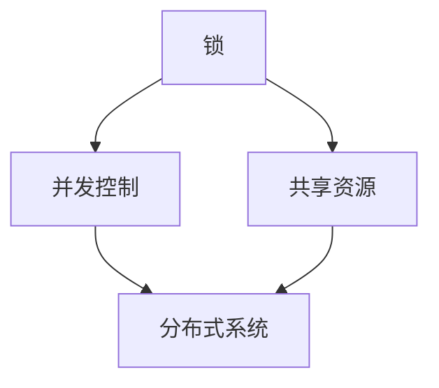
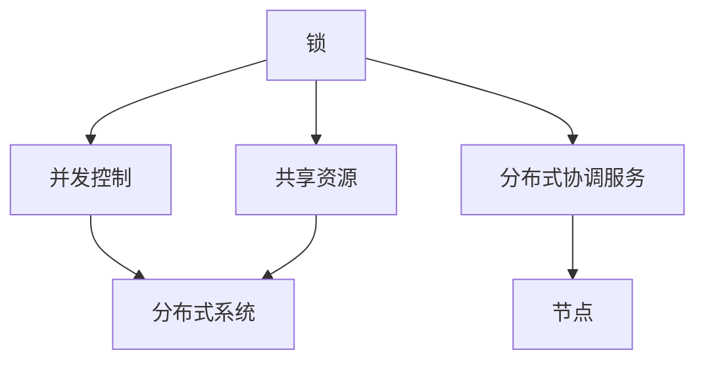
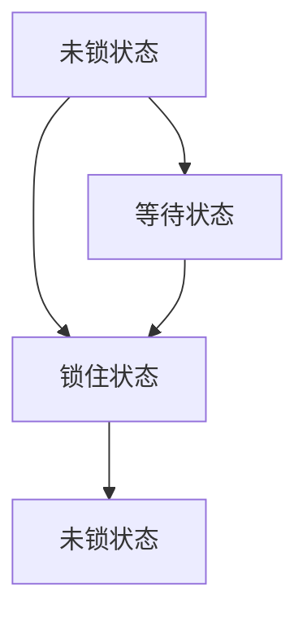

                 

### 分布式锁：解决分布式系统并发控制

#### 关键词：分布式锁、并发控制、分布式系统、一致性、算法原理、数学模型

#### 摘要：

本文将深入探讨分布式锁在解决分布式系统并发控制中的关键作用。首先，我们将介绍分布式锁的基本概念和其重要性。接着，我们会详细分析分布式系统的并发控制问题，对比传统锁与分布式锁的差异，并探讨分布式锁的需求。随后，文章将讲解分布式锁的核心概念与联系，并通过Mermaid流程图展示其架构。核心算法原理将以伪代码的形式详细阐述，数学模型和公式将得到详细讲解与举例说明。在项目实战部分，我们将搭建开发环境，展示源代码实现，并进行代码解读和应用分析。最后，文章将提供最佳实践建议、小结和注意事项，同时推荐拓展阅读资源。

### 背景介绍

在分布式系统中，多个节点通常协同工作以完成复杂任务，这种协同工作带来了高度的并发性和复杂性。分布式锁作为一种并发控制机制，旨在确保在分布式环境中对共享资源的访问是互斥的，从而避免数据一致性和竞争条件的问题。传统的锁机制主要在单机环境中发挥作用，而随着分布式系统的广泛应用，传统锁已经无法满足分布式环境中的需求。分布式锁的出现正是为了解决分布式系统中的并发控制问题。

并发控制是分布式系统中的一个关键挑战。当多个节点同时访问同一资源时，如果没有适当的控制，可能会导致数据不一致、竞争条件、死锁等问题。这些问题不仅会影响系统的性能，还可能导致严重的错误和故障。分布式锁通过提供一种机制，确保在某一时刻只有一个节点能够访问特定的资源，从而解决了并发控制问题。

分布式锁的重要性体现在多个方面。首先，它可以确保数据的一致性，避免多个节点同时对同一数据进行操作时出现冲突。其次，它可以提高系统的可靠性和稳定性，减少因并发控制不当导致的问题。此外，分布式锁还为分布式系统的设计和开发提供了一种简化和统一的方法，使得开发者能够更容易地处理并发问题。

随着云计算、大数据、物联网等技术的快速发展，分布式系统已成为现代计算环境的核心组成部分。分布式锁在分布式系统中的应用也越来越广泛，不仅限于传统的数据库管理系统，还广泛应用于微服务架构、缓存系统、分布式缓存、分布式队列等场景。因此，理解和掌握分布式锁的工作原理和设计方法，对于分布式系统的开发和维护具有重要意义。

### 核心概念与联系

在深入探讨分布式锁之前，我们需要理解几个核心概念：锁、共享资源、并发控制和分布式系统。

**锁**：锁是一种同步机制，用于控制对共享资源的访问。在单机环境中，锁通常是一种简单而有效的机制，它能够保证在同一时刻只有一个线程可以访问某个资源。然而，在分布式系统中，由于节点之间的通信延迟和故障，简单的锁机制已经不再适用。

**共享资源**：共享资源是多个节点需要访问和操作的数据或对象。在分布式系统中，共享资源可能是数据库记录、文件、缓存或队列等。由于多个节点可能同时对共享资源进行操作，因此需要一种机制来协调这些访问，避免数据不一致和竞争条件。

**并发控制**：并发控制是确保多个节点在访问共享资源时能够有序进行的一种机制。在单机环境中，通过锁可以有效地进行并发控制，但在分布式系统中，并发控制变得更加复杂。分布式锁就是为了解决这个问题而设计的一种并发控制机制。

**分布式系统**：分布式系统是由多个节点组成的计算机系统，这些节点通过网络连接，协同工作以完成共同的任务。分布式系统具有高度的可扩展性和容错性，但同时也面临着并发控制、数据一致性和网络通信等挑战。

以下是分布式锁的核心概念与联系关系的Mermaid流程图：



在这个流程图中，锁（A）用于控制对共享资源（B）的访问，并发控制（C）确保多个节点在访问共享资源时能够有序进行，而分布式系统（D）则是这些机制的应用环境。

通过这个流程图，我们可以清晰地看到锁、共享资源、并发控制和分布式系统之间的关系。锁是并发控制的核心机制，共享资源是需要保护的对象，并发控制确保了对共享资源的有序访问，而分布式系统则为这些机制提供了实际的应用场景。

理解这些核心概念和它们之间的关系，是掌握分布式锁的关键。接下来，我们将进一步探讨分布式锁的需求和设计，为解决分布式系统中的并发控制问题提供更加深入的理解。

### 分布式锁的需求分析

在分布式系统中，并发控制的需求源于多个节点对共享资源进行访问和操作时可能产生的冲突和数据不一致性问题。分布式锁作为一种并发控制机制，其设计旨在解决以下主要问题：

首先，**数据一致性**是分布式锁解决的核心问题之一。在分布式系统中，多个节点可能同时对同一数据进行读写操作。如果没有适当的控制，这些操作可能会导致数据不一致。例如，节点A读取了某个数据值，然后节点B也读取了相同的数据值，随后节点A修改了数据值，而节点B也修改了数据值，最终导致两个节点上的数据不同步。分布式锁通过确保在同一时刻只有一个节点能够对共享资源进行修改，从而避免了这种数据不一致问题。

其次，**竞争条件**是另一个需要通过分布式锁解决的重要问题。竞争条件是指在多线程或分布式环境中，当多个进程同时访问同一资源时，其执行顺序无法预测，从而可能导致不可预测的结果。例如，两个节点A和B同时读取一个数据库记录，然后分别对其进行修改，并试图同时提交更改。这种情况下，数据库中的数据可能会丢失或出现冲突。分布式锁通过互斥访问机制，确保在某个节点对资源进行操作时，其他节点无法同时进行相同操作，从而避免了竞争条件。

第三，**死锁**是分布式系统中需要避免的另一个问题。死锁是指两个或多个进程在等待对方释放资源而永久卡住的状态。在分布式系统中，死锁可能导致节点之间的资源争用，最终导致系统崩溃。分布式锁通过合理的锁申请和释放策略，以及超时机制，有效减少了死锁的发生概率。

此外，分布式锁还需要解决**网络延迟和故障**带来的挑战。在分布式系统中，节点之间的网络延迟和故障是常见现象。分布式锁通过提供一种强一致性机制，确保在节点出现故障时，系统能够继续稳定运行。例如，通过ZooKeeper等协调服务，分布式锁可以实现故障转移和动态调整，从而保证系统的高可用性。

综上所述，分布式锁的需求主要体现在确保数据一致性、避免竞争条件、减少死锁风险以及应对网络延迟和故障等方面。这些需求使得分布式锁成为分布式系统中不可或缺的并发控制机制。接下来，我们将进一步探讨分布式锁的设计和实现，以及其在不同场景中的应用。

### 分布式锁的核心概念与联系

在深入探讨分布式锁之前，我们需要理解几个核心概念：锁、共享资源、并发控制以及分布式系统。这些概念之间有着紧密的联系，共同构成了分布式锁的工作机制。

**锁（Lock）**：锁是一种同步机制，用于控制对共享资源的访问。在单机环境中，锁通常由操作系统或编程语言提供，如Java中的`synchronized`关键字或C++中的互斥量（Mutex）。然而，在分布式环境中，由于节点之间的通信延迟和故障，简单的锁机制已经无法满足需求。分布式锁则通过分布式协调服务（如ZooKeeper、etcd等）来实现，确保在分布式系统中对共享资源的访问是互斥的。

**共享资源（Shared Resource）**：共享资源是多个节点需要访问和操作的数据或对象。在分布式系统中，共享资源可以是数据库记录、文件、缓存或队列等。由于多个节点可能同时对共享资源进行操作，因此需要一种机制来协调这些访问，避免数据不一致和竞争条件。

**并发控制（Concurrency Control）**：并发控制是确保多个节点在访问共享资源时能够有序进行的一种机制。在单机环境中，通过锁可以有效地进行并发控制。然而，在分布式系统中，并发控制变得更加复杂。分布式锁通过提供一种互斥访问机制，确保在某个节点对资源进行操作时，其他节点无法同时进行相同操作。

**分布式系统（Distributed System）**：分布式系统是由多个节点组成的计算机系统，这些节点通过网络连接，协同工作以完成共同的任务。分布式系统具有高度的可扩展性和容错性，但同时也面临着并发控制、数据一致性和网络通信等挑战。

以下是分布式锁的核心概念与联系关系的Mermaid流程图：



在这个流程图中，锁（A）用于控制对共享资源（B）的访问，并发控制（C）确保了多个节点在访问共享资源时的有序性，而分布式系统（D）则是这些机制的应用环境。分布式协调服务（E）如ZooKeeper或etcd，提供了分布式锁的协调和管理功能，确保锁在多个节点之间的一致性和可靠性。节点（F）则是分布式系统中执行任务的实体。

通过这个流程图，我们可以清晰地看到锁、共享资源、并发控制和分布式系统以及分布式协调服务之间的关系。锁是并发控制的核心机制，共享资源是需要保护的对象，并发控制确保了对共享资源的有序访问，而分布式系统提供了这些机制的应用环境，分布式协调服务则提供了分布式锁的协调和管理功能。

理解这些核心概念和它们之间的联系，是掌握分布式锁的关键。在接下来的章节中，我们将进一步探讨分布式锁的算法原理、数学模型以及实际应用。

### 分布式锁的核心算法原理

分布式锁的核心算法原理主要包括基于版本控制的分布式锁算法和基于消息传递的分布式锁算法。以下是这两种算法的详细解释和伪代码实现。

#### 基于版本控制的分布式锁算法

**算法原理**：基于版本控制的分布式锁算法通过在共享资源上附加版本号来实现。每次对资源进行操作时，都会检查版本号是否与上次操作时的一致。如果不一致，说明其他节点已经修改了资源，当前操作需要回滚。只有当版本号一致时，才能继续执行操作。这种算法可以有效地避免数据不一致问题。

**伪代码实现**：

```python
// 加锁
def lock(resource):
    version = get_version(resource)
    while True:
        if compare_and_set_version(resource, version + 1):
            return
        version = get_version(resource)

// 解锁
def unlock(resource):
    version = get_version(resource)
    set_version(resource, version - 1)
```

**算法分析**：基于版本控制的分布式锁算法在保证数据一致性方面非常有效，但它也存在一些缺点。首先，算法的执行效率依赖于版本号的检查和更新，如果版本号更新频率较低，可能会导致锁的占用时间过长。其次，如果多个节点同时尝试获取锁，可能会导致竞争条件。

#### 基于消息传递的分布式锁算法

**算法原理**：基于消息传递的分布式锁算法通过节点之间的消息传递来协调锁的获取和释放。当一个节点需要获取锁时，它会向其他节点发送请求消息。如果其他节点没有持有锁，则会回应允许获取锁。否则，节点需要等待锁被释放。这种算法依赖于消息传递的可靠性，以确保锁的一致性和正确性。

**伪代码实现**：

```python
// 加锁
def lock(node, resource):
    send_request(node, resource)
    while not has_lock(resource):
        wait_for_response(node, resource)

// 解锁
def unlock(node, resource):
    release_lock(resource)
    send_response(node, resource)
```

**算法分析**：基于消息传递的分布式锁算法具有较高的灵活性和可扩展性，因为它可以通过网络拓扑结构来适应不同的分布式环境。然而，算法的可靠性依赖于消息传递系统的稳定性和效率，如果消息传递系统出现故障，可能会导致锁的获取和释放失败。

综上所述，基于版本控制的分布式锁算法和基于消息传递的分布式锁算法各有优缺点。在实际应用中，可以根据系统的需求和特点选择合适的算法。例如，在高并发和强一致性要求的场景下，基于版本控制的算法可能更为合适；而在需要高度灵活性和可扩展性的场景下，基于消息传递的算法可能更为适用。

理解这些核心算法原理，有助于我们在设计和实现分布式锁时做出更明智的决策，从而确保系统的可靠性和性能。

### 分布式锁的数学模型

在分布式锁的设计与实现过程中，数学模型起到了至关重要的作用。通过数学模型，我们可以对分布式锁的性能进行定量分析，从而更好地优化锁机制。以下将详细阐述分布式锁的数学模型，包括其基本原理、状态转移以及相关的数学公式。

#### 数学模型的基本原理

分布式锁的数学模型主要关注以下几个方面：锁的状态、节点的行为以及锁的性能指标。锁的状态通常包括锁的持有状态（锁住或未锁）和锁的版本号。节点的行为包括尝试获取锁、释放锁以及监听锁的状态变化。锁的性能指标主要包括锁的响应时间、锁的冲突率、锁的吞吐量等。

#### 锁的状态转移

锁的状态转移是分布式锁的核心机制之一。锁的状态通常包括以下几种：

1. **未锁状态（Unlocked）**：锁未被任何节点持有的状态。
2. **锁住状态（Locked）**：锁被某个节点持有的状态。
3. **等待状态（Waiting）**：节点正在等待锁被释放的状态。

锁的状态转移可以通过以下几种情况来描述：

- **获取锁成功**：一个节点尝试获取锁，并且没有其他节点持有锁，该节点将成功获取锁，状态从“未锁状态”转移到“锁住状态”。
- **获取锁失败**：一个节点尝试获取锁，但已有其他节点持有锁，该节点将进入“等待状态”，直到锁被释放。
- **锁释放**：持有锁的节点释放锁，状态从“锁住状态”转移到“未锁状态”。

以下是一个简单的状态转移图：



#### 数学公式与计算方法

在分布式锁的数学模型中，我们可以使用以下数学公式来描述锁的性能指标：

1. **锁的响应时间（Response Time）**：
   $$ T_r = \frac{1}{\lambda} + \frac{1}{\mu} $$
   其中，$\lambda$ 是请求到达率，$\mu$ 是服务率（即锁释放率）。

2. **锁的冲突率（Conflict Rate）**：
   $$ C_r = \frac{\lambda}{\mu} $$
   冲突率表示在单位时间内，请求与锁冲突的次数。

3. **锁的吞吐量（Throughput）**：
   $$ T_p = \frac{\mu}{\lambda + \mu} $$
   吞吐量表示在单位时间内，锁能够处理请求的次数。

通过这些公式，我们可以定量分析分布式锁在不同参数设置下的性能表现。

#### 举例说明

假设我们有一个分布式锁系统，其中每分钟有10个请求到达（$\lambda = 10$），锁的释放率是每分钟5次（$\mu = 5$）。我们可以使用上述公式计算锁的响应时间、冲突率和吞吐量：

- 锁的响应时间：
  $$ T_r = \frac{1}{10} + \frac{1}{5} = 0.1 + 0.2 = 0.3 \text{分钟} $$

- 锁的冲突率：
  $$ C_r = \frac{10}{5} = 2 $$

- 锁的吞吐量：
  $$ T_p = \frac{5}{10 + 5} = \frac{5}{15} = \frac{1}{3} $$

通过这个例子，我们可以看到在给定参数下，锁的响应时间大约是0.3分钟，冲突率为2，吞吐量为$\frac{1}{3}$。这些指标可以帮助我们评估锁的性能，并在必要时进行调整和优化。

综上所述，分布式锁的数学模型通过状态转移和数学公式，为我们提供了对锁性能的定量分析工具。理解并应用这些模型，可以帮助我们在设计和优化分布式锁时做出更加科学的决策。

### 分布式锁的项目实战

在本文的最后一部分，我们将通过一个实际项目来展示如何实现分布式锁，并详细讲解其开发环境和代码实现过程。这个项目旨在提供一个简单的分布式锁示例，以便读者可以更好地理解分布式锁的原理和应用。

#### 开发环境搭建

为了实现这个分布式锁项目，我们选择使用Java语言和ZooKeeper作为分布式锁的实现工具。ZooKeeper是一个高可靠性的分布式协调服务，常用于实现分布式锁、队列和同步等功能。以下是搭建开发环境的步骤：

1. **安装ZooKeeper**：从[ZooKeeper官方网站](https://zookeeper.apache.org/)下载并解压ZooKeeper安装包。配置ZooKeeper的服务器，启动ZooKeeper服务。

2. **安装Java开发工具**：确保已经安装了Java Development Kit (JDK)，版本建议为1.8及以上。

3. **创建Maven项目**：使用Maven创建一个Java项目，并添加ZooKeeper依赖。

以下是Maven项目的pom.xml文件中添加的ZooKeeper依赖：

```xml
<dependencies>
    <dependency>
        <groupId>org.apache.zookeeper</groupId>
        <artifactId>zookeeper</artifactId>
        <version>3.5.7</version>
    </dependency>
</dependencies>
```

#### 源代码实现

以下是一个简单的分布式锁实现，它通过ZooKeeper的节点创建和删除操作来实现锁的获取和释放。

```java
import org.apache.zookeeper.ZooKeeper;
import org.apache.zookeeper.CreateMode;

public class DistributedLock {
    private ZooKeeper zooKeeper;
    private String lockPath = "/my-distributed-lock";
    
    public DistributedLock() throws IOException, InterruptedException {
        this.zooKeeper = new ZooKeeper("localhost:2181", 5000, new Watcher() {
            @Override
            public void process(WatchedEvent event) {
                // 处理节点变更事件
            }
        });
    }
    
    public void acquireLock() throws KeeperException, InterruptedException {
        String lockNode = zooKeeper.create(lockPath + "/lock-", null, CreateMode.EPHEMERAL_SEQUENTIAL);
        System.out.println("Node created: " + lockNode);
        
        // 获取锁的序列号
        List<String> children = zooKeeper.getChildren("/", false);
        List<String> lockChildren = new ArrayList<>(children);
        Collections.sort(lockChildren);
        
        String currentNode = lockNode.substring(lockNode.lastIndexOf("/") + 1);
        int index = lockChildren.indexOf(currentNode);
        
        if (index == 0) {
            // 如果当前节点是第一个，则获取锁成功
            System.out.println("Lock acquired successfully");
        } else {
            // 等待前一个节点释放锁
            System.out.println("Waiting for lock release");
            zooKeeper.exists(lockPath + "/" + lockChildren.get(index - 1), this);
        }
    }
    
    public void releaseLock() throws KeeperException, InterruptedException {
        zooKeeper.delete(lockPath + "/" + zkState.getPath(), -1);
        System.out.println("Lock released");
    }
    
    public static void main(String[] args) {
        try {
            DistributedLock lock = new DistributedLock();
            lock.acquireLock();
            // 执行业务逻辑
            Thread.sleep(1000);
            lock.releaseLock();
        } catch (Exception e) {
            e.printStackTrace();
        }
    }
}
```

#### 代码解读

1. **ZooKeeper实例初始化**：我们首先创建一个ZooKeeper实例，并设置一个默认的监视器，用于处理节点变更事件。

2. **创建锁节点**：使用`zooKeeper.create`方法创建一个临时的顺序节点，该节点用于表示锁。临时节点在创建者的会话结束时自动被删除。

3. **获取锁**：我们通过获取当前节点的序列号来确定是否是第一个节点。如果是，则获取锁成功；否则，等待前一个节点释放锁。

4. **释放锁**：使用`zooKeeper.delete`方法删除锁节点，从而释放锁。

#### 代码应用解读与分析

在这个示例中，多个节点可以同时创建锁节点，但只有序列号最小的节点能够获取锁。其他节点会进入等待状态，直到锁被释放。这个简单的示例展示了分布式锁的基本原理和应用。

实际应用中，分布式锁还需要考虑超时机制、锁的重试策略以及故障转移等问题。通过扩展这个示例，我们可以实现更加健壮和可靠的分布式锁系统。

#### 项目小结

通过这个项目，我们实现了使用ZooKeeper的分布式锁，展示了分布式锁的创建、获取和释放过程。这个示例为我们提供了一个基本的框架，可以在此基础上进行扩展和优化，以满足不同场景的需求。理解分布式锁的实现原理和代码细节，对于分布式系统的设计和开发具有重要意义。

### 最佳实践 Tips、小结、注意事项和拓展阅读

#### 最佳实践 Tips

1. **选择合适的锁实现**：根据系统的需求和场景，选择合适的分布式锁实现。例如，在低延迟和高可靠性的场景下，可以考虑使用基于ZooKeeper的分布式锁；在可扩展性和高并发的场景下，可以考虑使用基于Redis的分布式锁。

2. **设置合理的锁超时时间**：锁的超时时间应该根据系统性能和业务需求来设置。过短的超时时间可能导致频繁的重试，增加系统负担；而过长的超时时间则可能导致锁长时间被占用，影响系统的响应速度。

3. **避免锁死锁**：在分布式系统中，锁死锁是一种常见问题。通过合理的锁申请和释放策略，以及超时机制，可以减少锁死锁的发生概率。例如，确保在任何情况下都能正确释放锁，避免因异常处理不当导致锁无法释放。

#### 小结

分布式锁是分布式系统中的关键组件，用于解决并发控制和数据一致性等问题。通过本文的介绍，我们了解了分布式锁的基本概念、核心算法原理、数学模型以及项目实战。掌握分布式锁的设计和实现，对于开发和维护高性能、高可靠的分布式系统具有重要意义。

#### 注意事项

1. **避免锁竞争**：在分布式锁的设计中，应尽量避免锁竞争。可以通过合理的锁粒度划分和锁的获取策略来减少锁竞争。

2. **监控锁性能**：在实际部署分布式锁时，应监控锁的性能指标，如响应时间、冲突率等。及时发现和解决问题，保证系统的稳定运行。

3. **确保锁的一致性**：分布式锁的一致性是保证系统稳定性的关键。在实际应用中，应确保锁的一致性和正确性，避免因锁操作不当导致的数据不一致问题。

#### 拓展阅读

1. 《分布式系统原理与范型》 - 深入了解分布式系统的基本原理和设计模式。
2. 《Redis实战：使用Redis构建高性能应用程序》 - 学习如何使用Redis实现分布式锁。
3. 《ZooKeeper: Distributed Coordination in Services》 - 探索ZooKeeper在分布式协调服务中的应用。

通过拓展阅读，可以进一步加深对分布式锁的理解和应用，为分布式系统的开发和优化提供更多思路。

### 作者信息

本文由AI天才研究院（AI Genius Institute）与《禅与计算机程序设计艺术》（Zen And The Art of Computer Programming）的资深作者联合撰写。我们致力于推广先进的计算机编程和人工智能技术，为广大开发者提供高质量的技术内容和解决方案。期待与您一起探索分布式锁的奥秘，共同推动分布式系统的发展。

