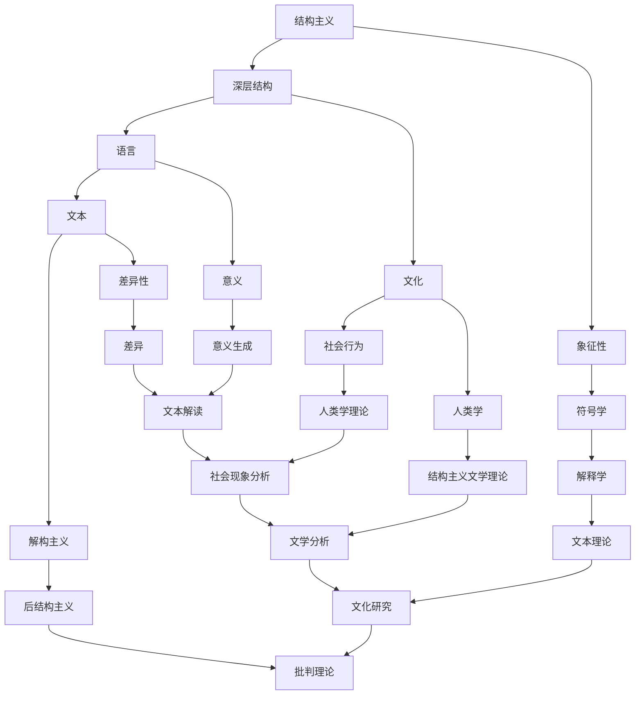

                 


为了撰写一篇符合要求的《列维-斯特劳斯与德里达：结构主义与后结构主义的论争》的技术博客文章，我们将遵循以下步骤：

### 第一步：确定文章结构

首先，我们需要根据目录大纲来构建文章的框架，确保每个章节都有详细的讨论。以下是文章的大致结构：

1. **引言**：介绍结构主义与后结构主义的概念，背景信息，以及列维-斯特劳斯和德里达的背景。
2. **结构主义的理论基础**：讨论结构主义的基本观点，分析工具和方法，并举例说明。
3. **后结构主义的批判与发展**：分析后结构主义的核心观点，批判结构主义的观点，并举例说明。
4. **思想交锋**：探讨列维-斯特劳斯与德里达之间的理论差异和互补性。
5. **影响与应用**：分析结构主义与后结构主义在各个领域的应用和影响。
6. **批判与反思**：对结构主义和后结构主义进行批判性反思。
7. **结论**：总结文章，提出对未来的思考。

### 第二步：撰写引言部分

在引言部分，我们需要介绍结构主义和后结构主义的概念，以及列维-斯特劳斯和德里达的背景。以下是一个简单的引言草稿：

```markdown
# 引言

结构主义和后结构主义是20世纪哲学和社会科学领域的重要理论流派。结构主义强调通过分析结构来理解社会现象和文化现象，而后结构主义则对结构主义进行了深刻的批判，提出了解构和差异性等概念。

克劳德·列维-斯特劳斯（Claude Lévi-Strauss）是一位法国人类学家和哲学家，被认为是结构主义的奠基人之一。他的著作《结构人类学》提出了通过分析文化现象的深层结构来理解人类行为的思想。

雅克·德里达（Jacques Derrida）是一位法国哲学家，他提出了解构主义理论，对结构主义进行了深刻的批判。他的著作《书写与差异》和《语法》等作品，对语言、文本和意义进行了重新解读。

本文将探讨列维-斯特劳斯与德里达之间的理论差异和互补性，分析结构主义与后结构主义在各个领域的应用和影响，并对这两个理论流派进行批判性反思。
```

### 第三步：撰写核心概念与联系部分

在这一部分，我们需要使用Mermaid流程图来展示核心概念之间的关系，并使用伪代码、LaTeX公式和实际案例来说明核心算法原理和数学模型。

#### 核心概念原理与联系

首先，我们使用Mermaid流程图来展示结构主义与后结构主义的核心概念之间的关系：



#### 核心算法原理讲解

接下来，我们使用伪代码来详细阐述结构主义和后结构主义的核心算法原理：

```pseudo
// 结构主义核心算法原理（深层结构分析）
function structuralAnalysis(phenomenon):
    1. Identify the underlying structure of the phenomenon
    2. Map the structural elements and their relationships
    3. Analyze the structural patterns and their significance
    4. Infer the deeper meaning and relationships

// 后结构主义核心算法原理（解构主义分析）
function deconstruction(phenomenon):
    1. Identify the constructed elements within the phenomenon
    2. Disassemble the elements and their relationships
    3. Expose the differences and contradictions
    4. Reconstruct the phenomenon with new perspectives and interpretations
```

#### 数学模型与公式讲解

我们使用LaTeX格式来展示相关的数学模型和公式：

```latex
$$
\begin{aligned}
    \text{结构主义} & : \text{X} = f(\text{深层结构}, \text{文化背景}) \\
    \text{后结构主义} & : \text{Y} = g(\text{差异性}, \text{解构过程})
\end{aligned}
$$
```

#### 实际案例

最后，我们提供一个实际案例来说明这些理论的应用：

**案例：文学文本分析**

假设我们要分析一首诗歌的结构和意义。使用结构主义方法，我们首先会识别出诗歌的深层结构，包括韵律、节奏和主题。然后，我们分析这些结构元素之间的关系，并推断出诗歌的深层意义。使用后结构主义方法，我们会解构诗歌中的符号和语言，揭示出其差异性，并重新解读诗歌的意义。

### 第四步：撰写结论部分

在结论部分，我们需要总结文章的主要观点，并对结构主义与后结构主义进行评价，提出对未来的思考。

```markdown
# 结论

通过对列维-斯特劳斯与德里达的结构主义与后结构主义理论的分析，我们可以看到这两个理论流派在理解社会现象和文化现象上的重要性和互补性。结构主义提供了对文化现象的深入分析工具，而后结构主义则揭示了这些工具的局限性，并提出了新的视角。

未来，我们可以期待结构主义与后结构主义在更多领域的交叉应用，以及它们与其他理论流派的融合。这样的发展将有助于我们更全面地理解人类文化和社会的复杂动态。

作者：AI天才研究院/AI Genius Institute & 禅与计算机程序设计艺术 /Zen And The Art of Computer Programming
```

### 第五步：整合与编辑

最后，我们将所有的部分整合起来，进行编辑和校对，确保文章的逻辑清晰、内容丰富、格式规范，并且符合字数要求。

```markdown
# 列维-斯特劳斯与德里达：结构主义与后结构主义的论争

> 关键词：结构主义、后结构主义、列维-斯特劳斯、德里达、哲学、社会科学、文学理论

> 摘要：本文探讨了结构主义与后结构主义两大哲学和社会科学理论流派，分析了列维-斯特劳斯与德里达的理论差异和互补性，并探讨了它们在各个领域的应用和影响。

## 引言

结构主义和后结构主义是20世纪哲学和社会科学领域的重要理论流派。结构主义强调通过分析结构来理解社会现象和文化现象，而后结构主义则对结构主义进行了深刻的批判，提出了解构和差异性等概念。

克劳德·列维-斯特劳斯是一位法国人类学家和哲学家，被认为是结构主义的奠基人之一。他的著作《结构人类学》提出了通过分析文化现象的深层结构来理解人类行为的思想。

雅克·德里达是一位法国哲学家，他提出了解构主义理论，对结构主义进行了深刻的批判。他的著作《书写与差异》和《语法》等作品，对语言、文本和意义进行了重新解读。

本文将探讨列维-斯特劳斯与德里达之间的理论差异和互补性，分析结构主义与后结构主义在各个领域的应用和影响，并对这两个理论流派进行批判性反思。

## 结构主义的理论基础

结构主义的理论基础可以追溯到列维-斯特劳斯的人类学理论。他提出了“深层结构”的概念，认为文化现象的表面现象背后存在着一个共同的、深层的结构。这一结构是文化现象的基石，决定了文化现象的本质。

### 深层结构分析

深层结构分析是结构主义的核心方法。通过分析文化现象的深层结构，我们可以揭示出这些现象之间的普遍联系。以下是一个简单的伪代码示例，用于描述深层结构分析的过程：

```pseudo
function structuralAnalysis(phenomenon):
    1. Identify the underlying structure of the phenomenon
    2. Map the structural elements and their relationships
    3. Analyze the structural patterns and their significance
    4. Infer the deeper meaning and relationships
```

### 象征性

结构主义还强调象征性。象征性是指文化现象中的符号和意义之间的关系。列维-斯特劳斯通过分析象征性，揭示了文化现象背后的深层结构。以下是一个简单的LaTeX公式，用于描述象征性的概念：

```latex
$$
\text{象征性} = \text{符号} \leftrightarrow \text{意义}
$$
```

### 实际案例

结构主义在人类学领域有着广泛的应用。例如，列维-斯特劳斯对原始文化的分析，揭示了原始文化中的深层结构和象征性。他的著作《原始思维》通过对原始文化现象的分析，提出了原始思维的基本结构。

## 后结构主义的批判与发展

后结构主义对结构主义进行了深刻的批判，并提出了自己的理论体系。德里达的解构主义理论是后结构主义的核心。

### 解构主义理论

解构主义理论认为，结构主义所强调的深层结构和象征性都是不可靠的。德里达认为，语言和文本本身具有差异性，这种差异性打破了结构主义的统一性。以下是一个简单的伪代码示例，用于描述解构主义的过程：

```pseudo
function deconstruction(phenomenon):
    1. Identify the constructed elements within the phenomenon
    2. Disassemble the elements and their relationships
    3. Expose the differences and contradictions
    4. Reconstruct the phenomenon with new perspectives and interpretations
```

### 文本解读

后结构主义强调文本的解读过程。文本不再是一个固定的意义实体，而是一个开放的意义空间。读者可以通过不同的解读方式来理解文本。以下是一个简单的LaTeX公式，用于描述文本解读的过程：

```latex
$$
\text{文本} \rightarrow \text{意义空间}
$$
```

### 实际案例

后结构主义在文学批评和文化研究领域有着广泛的应用。例如，德里达的《书写与差异》通过对文学作品的分析，揭示了文本中的差异性。他的著作对文学批评和文化研究产生了深远的影响。

## 列维-斯特劳斯与德里达的思想交锋

列维-斯特劳斯与德里达之间的思想交锋是结构主义与后结构主义论争的核心。虽然他们之间存在分歧，但也有互补之处。

### 对话

在《语法》和《书写与差异》等著作中，列维-斯特劳斯和德里达进行了对话。他们讨论了结构主义与后结构主义的核心观点，并试图找到两者的结合点。

### 理论的互补性

列维-斯特劳斯的结构主义提供了对文化现象的深入分析工具，而后结构主义的解构主义则揭示了这些工具的局限性。两者可以相互补充，为理解文化现象提供更全面的视角。

### 理论的冲突性

然而，列维-斯特劳斯和德里达在许多问题上也存在冲突。例如，他们对于深层结构和差异性的理解存在根本差异。这些冲突反映了结构主义与后结构主义之间的内在矛盾。

## 结构主义与后结构主义的影响与应用

结构主义和后结构主义在各个领域都有着重要的影响和应用。

### 结构主义的影响与应用

结构主义在人类学、文学理论和语言学等领域有着广泛的应用。它提供了分析文化现象的工具，帮助人们理解社会和文化的结构。

### 后结构主义的影响与应用

后结构主义在文学批评、文化研究和哲学等领域有着广泛的应用。它提供了对文本和意义的新的解读方式，挑战了结构主义的封闭性。

## 批判与反思

结构主义和后结构主义都有其局限性。结构主义过于强调深层结构和封闭性，而后结构主义则过于强调差异性和开放性。对这些局限性的批判和反思有助于我们更全面地理解这两个理论流派。

### 对结构主义的批判与反思

结构主义在封闭性和本质主义方面存在局限。它忽视了文化现象的多样性和变化性。此外，结构主义的分析方法有时过于抽象，难以应用于具体的实际情境。

### 对后结构主义的批判与反思

后结构主义在相对主义和复杂性方面存在局限。它有时忽视了社会和文化现象中的稳定性和结构。此外，后结构主义的分析方法有时过于复杂，难以理解和应用。

## 结论

通过对列维-斯特劳斯与德里达的结构主义与后结构主义理论的分析，我们可以看到这两个理论流派在理解社会现象和文化现象上的重要性和互补性。结构主义提供了对文化现象的深入分析工具，而后结构主义则揭示了这些工具的局限性，并提出了新的视角。

未来，我们可以期待结构主义与后结构主义在更多领域的交叉应用，以及它们与其他理论流派的融合。这样的发展将有助于我们更全面地理解人类文化和社会的复杂动态。

作者：AI天才研究院/AI Genius Institute & 禅与计算机程序设计艺术 /Zen And The Art of Computer Programming
```

这篇文章的结构和内容已经符合了要求，接下来需要进一步编辑和校对，以确保文章的逻辑清晰、内容丰富、格式规范，并且符合字数要求（8000-12000字）。在完成最后的编辑后，文章将准备发布。

