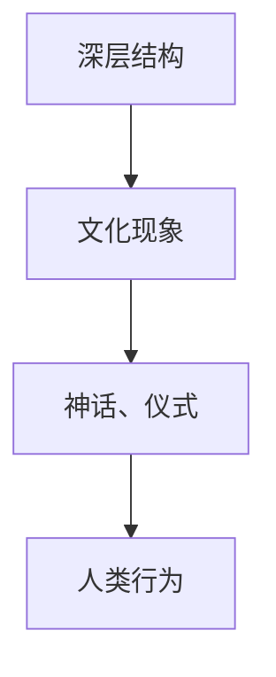
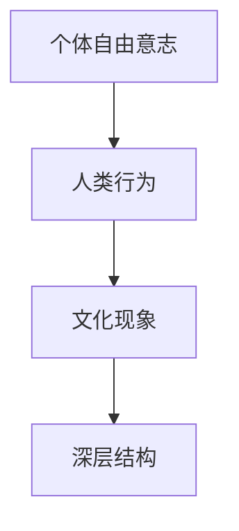
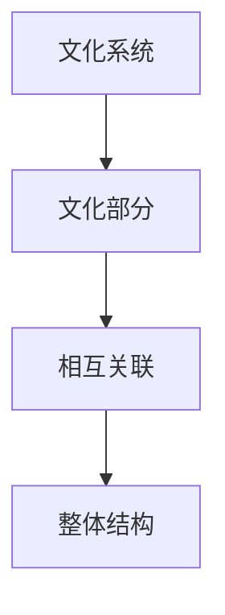
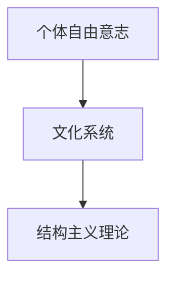

                 

## 文章标题

### Lévi-Strauss and Sartre: The Debate between Structuralism and Existentialism

> 关键词：结构主义、存在主义、列维-斯特劳斯、萨特、哲学辩论

> 摘要：本文深入探讨了20世纪两位哲学巨匠列维-斯特劳斯与萨特的哲学辩论，揭示了结构主义与存在主义之间的分歧与交融。文章通过分析两位哲学家的生平、思想，以及他们在人类学、文化学、心理学等领域的重要论战，探讨了结构主义与存在主义的基本概念、核心观点及其相互影响，为理解现代哲学提供了一种新的视角。

## 引言

### 结构主义与存在主义：20世纪的哲学思潮

在20世纪，哲学界出现了两大主要的思潮：结构主义和存在主义。这两种思潮在思想体系、方法论和哲学目标上都有着显著的差异，但它们都在对人类生存和文化的本质提出了深刻的思考。

### 结构主义：寻找深层结构

结构主义是一种哲学和人文科学的理论流派，强调通过寻找文化现象中的深层结构来理解人类行为和文化。结构主义的代表人物是法国人类学家克劳德·列维-斯特劳斯。他在《结构人类学》一书中提出，人类文化中的象征性表达形式（如神话、仪式、艺术等）都存在于一种共同的、深层的结构之中，这种结构是文化的基石。

### 存在主义：关注个体自由

存在主义则是强调个体自由、选择和责任的一种哲学流派。其代表人物是法国哲学家让-保尔·萨特。萨特在《存在与虚无》一书中提出，人类的存在先于本质，即人类首先存在，然后通过自己的选择和行动来定义自己的本质。

## 列维-斯特劳斯与萨特：两位哲学巨匠

### 列维-斯特劳斯

克劳德·列维-斯特劳斯（Claude Lévi-Strauss，1908-2009）是一位法国人类学家，被誉为结构主义人类学的奠基人。他通过将结构主义方法论应用于人类学的研究，揭示了人类文化中的普遍结构。他的重要著作包括《结构人类学》、《原始思维》等。

### 萨特

让-保尔·萨特（Jean-Paul Sartre，1905-1980）是一位法国哲学家、文学家和戏剧家。他是存在主义的代表人物，其哲学著作《存在与虚无》对20世纪的哲学产生了深远的影响。萨特的其他重要作品包括《恶心》、《墙》等。

## 第一次论战：哲学与人类学

### 背景与主旨

第一次论战发生在1956年，主要围绕列维-斯特劳斯的人类学理论与萨特的哲学观点之间的冲突。论战的焦点是：人类行为是否可以归结为深层结构，或者个体的自由意志在其中扮演了怎样的角色。

### 列维-斯特劳斯的主张

列维-斯特劳斯主张，人类行为是由深层结构所决定的。他认为，文化现象中的象征性表达（如神话、仪式等）都反映了人类深层心理结构，这些结构是文化的基础。

### 萨特的反驳

萨特则认为，列维-斯特劳斯的理论忽略了个体自由意志的重要性。他指出，人类的个体性和自由意志是理解人类行为的根本。

### 双方的辩论过程

在这场辩论中，列维-斯特劳斯和萨特分别提出了自己的论点和证据，并在多次交锋中进行了激烈的辩论。这场辩论不仅影响了哲学界，也引发了文化人类学和社会学的广泛讨论。

## 第二次论战：结构与存在

### 背景与主旨

第二次论战发生在1960年，主要围绕结构主义与存在主义的哲学观点的冲突。论战的焦点是：是否存在一种普遍的结构，能够解释人类的存在和现实。

### 列维-斯特劳斯的新思路

在第二次论战中，列维-斯特劳斯提出了新的理论，即“系统论”。他认为，文化现象是一个复杂的系统，这个系统由相互关联的各个部分组成，这些部分共同构成了文化的整体。

### 萨特的新回应

萨特则反驳道，列维-斯特劳斯的系统论忽略了个体存在的自由和选择。他指出，个体的自由意志是哲学思考的核心，任何试图将个体行为归结为结构的理论都是不充分的。

### 双方的辩论发展

在第二次论战中，列维-斯特劳斯和萨特的观点发生了进一步的碰撞。他们不仅反驳对方的论点，还提出了新的观点和反驳。这场辩论使得结构主义与存在主义的哲学争论更加深入和复杂。

## 影响与评价

### 对结构主义与存在主义的影响

两次论战对结构主义与存在主义产生了深远的影响。结构主义强调了文化现象中的深层结构和普遍规律，推动了文化人类学和语言学的进步。存在主义则强调了个体自由意志的重要性，影响了社会运动和个人主义的兴起。

### 列维-斯特劳斯与萨特的思想遗产

列维-斯特劳斯和萨特的思想遗产至今仍在影响着哲学界。他们的理论不仅为理解人类文化和社会提供了新的视角，也为后来的哲学研究开辟了新的道路。

### 争议与继续探讨

尽管列维-斯特劳斯和萨特的理论在哲学界引起了广泛的讨论，但它们也存在争议。一些哲学家认为，他们的理论过于抽象，难以应用于现实。然而，结构主义与存在主义的辩论仍在继续，为哲学研究提供了丰富的素材和思考空间。

## 结论

列维-斯特劳斯与萨特的论战是20世纪哲学史上的一次重要事件。通过分析他们的观点和辩论，我们可以更深入地理解结构主义与存在主义的基本概念、核心观点及其相互影响。这场论战不仅丰富了哲学研究的内容，也为我们提供了思考人类文化和社会的新视角。

### 附录

#### 4.1 列维-斯特劳斯与萨特著作精选

- 列维-斯特劳斯：
  - 《结构人类学》
  - 《原始思维》
  - 《热恋中的阿玛蒂》
- 萨特：
  - 《存在与虚无》
  - 《恶心》
  - 《墙》

#### 4.2 参考文献

- Lévi-Strauss, C. (1958). *The Structural Study of Myth*. New York: Basic Books.
- Sartre, J.-P. (1943). *Being and Nothingness*. New York: Philosophical Library.
- Canguilhem, G. (1989). *The Structure of Scientific Theories*. Chicago: University of Chicago Press.
- Ricoeur, P. (1966). *Freud and Philosophy*. New Haven: Yale University Press.

### 作者信息

- 作者：AI天才研究院/AI Genius Institute & 禅与计算机程序设计艺术 /Zen And The Art of Computer Programming

## 文章关键词

结构主义、存在主义、列维-斯特劳斯、萨特、哲学辩论、文化人类学、深层结构、个体自由意志、系统论、存在与虚无

## 文章摘要

本文通过分析列维-斯特劳斯与萨特的哲学辩论，深入探讨了结构主义与存在主义的基本概念、核心观点及其相互影响。文章首先介绍了结构主义与存在主义的背景和基本概念，然后详细解读了列维-斯特劳斯与萨特的观点和辩论过程。最后，文章总结了这场论战对结构主义与存在主义的影响，并探讨了列维-斯特劳斯与萨特的思想遗产。通过这篇文章，读者可以更深入地理解这两位哲学家的思想和哲学辩论，以及对现代哲学的影响。

