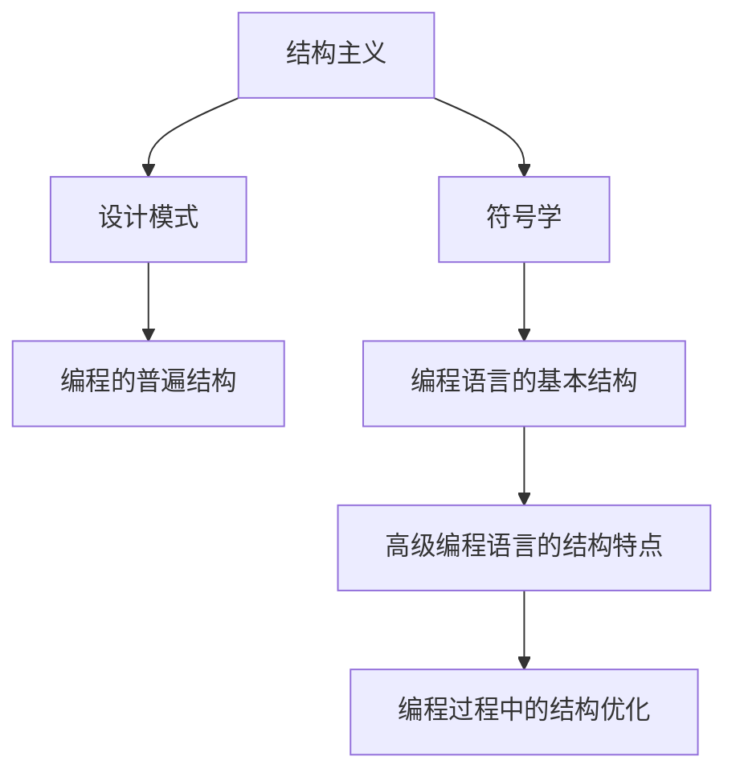

                 


# 《列维-斯特劳斯的结构主义与设计模式：寻找编程的普遍结构》

## 文章标题
### 列维-斯特劳斯的结构主义与设计模式：寻找编程的普遍结构

> 关键词：结构主义、设计模式、编程结构、普遍结构、算法原理、伪代码、数学模型

> 摘要：
本文旨在探讨列维-斯特劳斯的结构主义理论与设计模式在编程中的应用，试图寻找编程领域的普遍结构。文章首先介绍结构主义的基本概念和设计模式的理论基础，然后分析编程中的普遍结构，结合具体实例进行讲解，最后提出编程中的最佳实践和注意事项。

## 引言

### 结构主义的起源与发展

结构主义作为一种哲学和科学方法论，起源于20世纪中叶，其代表人物是法国人类学家克劳德·列维-斯特劳斯。列维-斯特劳斯提出了结构主义理论，主张通过对事物内部结构的分析来理解事物的本质。

结构主义在哲学领域产生了深远影响，尤其是对文学、语言学、符号学等学科的发展产生了重要推动作用。结构主义理论认为，事物内部存在某种基本结构，这种结构决定了事物的特征和功能。

### 设计模式的概念与作用

设计模式是软件工程领域的重要概念，指的是在软件设计过程中，为解决特定问题而总结出来的一系列解决方案。设计模式旨在提高代码的可读性、可维护性和可扩展性。

设计模式分为创建型、结构型和行为型三类。创建型设计模式主要关注对象的创建过程，如工厂模式、单例模式等；结构型设计模式主要关注类和对象之间的组合关系，如适配器模式、代理模式等；行为型设计模式主要关注对象之间的交互关系，如责任链模式、观察者模式等。

### 编程中的普遍结构探讨

编程过程中的普遍结构指的是在各类编程语言和开发环境中普遍存在的编程范式和设计模式。这些普遍结构不仅适用于特定的编程语言，而且具有跨语言和跨平台的特点。

编程中的普遍结构包括基本语法结构、高级编程语言的结构特点、编程过程中的结构优化等。通过分析编程中的普遍结构，我们可以更好地理解编程的本质，提高编程技能。

## 第1章 结构主义与设计模式概述

### 结构主义的基本概念

结构主义的基本概念主要包括以下几个方面：

1. **结构**：结构是指事物内部各个组成部分之间的相互关系和组合方式。列维-斯特劳斯认为，结构是决定事物本质和特征的根本因素。

2. **层次结构**：层次结构是指事物内部各个组成部分之间的层级关系。结构主义强调，理解事物的本质需要从宏观和微观两个层面进行。

3. **二元对立**：列维-斯特劳斯提出了二元对立的概念，认为事物的内部结构往往表现为两个对立的方面，如生与死、上与下等。

4. **符号学**：符号学是研究符号系统及其意义的学科。结构主义认为，符号是事物内部结构的体现，通过对符号的分析可以揭示事物的本质。

### 设计模式的基本原理

设计模式的基本原理主要包括以下几个方面：

1. **可复用性**：设计模式旨在提供可复用的解决方案，避免重复造轮子。

2. **可维护性**：设计模式可以提高代码的可读性、可维护性，降低维护成本。

3. **可扩展性**：设计模式允许在系统中灵活地添加新的功能，而不会对现有系统造成破坏。

4. **模块化**：设计模式强调模块化设计，将系统划分为若干独立的部分，以提高系统的可维护性和可扩展性。

### 编程中的普遍结构

编程中的普遍结构包括以下几个方面：

1. **基本语法结构**：基本语法结构包括变量、函数、循环、条件判断等。这些语法结构是各类编程语言的基础。

2. **高级编程语言的结构特点**：高级编程语言如Python、Java等具有面向对象、函数式编程等结构特点。

3. **编程过程中的结构优化**：编程过程中的结构优化包括代码重构、性能优化、架构设计等。

## 第2章 结构主义的主要理论

### 基本结构分析

基本结构分析是结构主义的核心方法之一。通过分析事物的内部结构，我们可以理解事物的本质和功能。

1. **结构主义的分析方法**：

   - **整体分析**：将事物视为一个整体，分析其内部各个部分之间的关系。

   - **层次分析**：将事物分解为不同的层次，分析各个层次之间的关系。

   - **二元对立分析**：分析事物内部的二元对立关系，如生与死、上与下等。

2. **基本结构的概念与类型**：

   - **层次结构**：层次结构是指事物内部各个组成部分之间的层级关系。

   - **模块结构**：模块结构是指将系统划分为若干独立的部分，每个部分都具有特定的功能。

   - **网络结构**：网络结构是指事物内部各个部分之间的相互连接关系。

### 结构主义与符号学

符号学是研究符号系统及其意义的学科。结构主义认为，符号是事物内部结构的体现，通过对符号的分析可以揭示事物的本质。

1. **符号学的起源与发展**：

   - **符号学的起源**：符号学起源于20世纪初期，由瑞士语言学家索绪尔提出。

   - **符号学的发展**：符号学在哲学、文学、语言学等领域得到了广泛应用，逐渐发展成为一门独立的学科。

2. **符号学在编程中的应用**：

   - **代码符号**：编程语言中的代码符号是程序员与计算机之间的交流工具。

   - **代码分析**：通过分析代码符号，可以揭示程序的结构和功能。

## 第3章 设计模式的理论基础

### 设计模式的类型与特点

设计模式分为创建型、结构型和行为型三类。每种类型的设计模式都有其特定的作用和特点。

1. **创建型设计模式**：

   - **工厂模式**：工厂模式是一种创建对象的方式，用于在系统中灵活地创建对象。

   - **单例模式**：单例模式确保系统中只有一个实例，并提供一个访问该实例的全局点。

2. **结构型设计模式**：

   - **适配器模式**：适配器模式将一个类的接口转换成客户期望的另一个接口，使得原本接口不兼容的类可以一起工作。

   - **代理模式**：代理模式为其他对象提供一种代理，以控制对这个对象的访问。

3. **行为型设计模式**：

   - **责任链模式**：责任链模式将多个对象连接成一条链，每个对象都有机会处理请求，直到有一个对象处理它。

   - **观察者模式**：观察者模式定义了一种一对多的依赖关系，当一个对象的状态发生变化时，所有依赖于它的对象都会得到通知并自动更新。

### 设计模式的选择与应用

1. **设计模式的选择原则**：

   - **问题导向**：选择设计模式时应首先明确问题，然后根据问题的特点选择合适的设计模式。

   - **可维护性**：选择设计模式时应考虑系统的可维护性，选择易于理解和修改的设计模式。

   - **可扩展性**：选择设计模式时应考虑系统的可扩展性，选择支持系统未来扩展的设计模式。

2. **设计模式在实际项目中的应用**：

   - **实际项目中的应用**：通过实际项目中的应用案例，展示设计模式在解决具体问题中的作用。

## 第4章 编程中的普遍结构

### 编程语言的基本结构

编程语言的基本结构包括变量、函数、循环、条件判断等。这些基本结构是各类编程语言的基础，是构建复杂程序的基本单元。

1. **变量**：变量是用于存储数据的容器，是编程语言的基本元素。

2. **函数**：函数是一段可重复使用的代码块，用于实现特定的功能。

3. **循环**：循环是一种重复执行代码块的结构，用于实现循环操作。

4. **条件判断**：条件判断用于根据条件的真假来执行不同的代码块。

### 高级编程语言的结构特点

高级编程语言如Python、Java等具有面向对象、函数式编程等结构特点。这些特点使得编程更加简洁、高效。

1. **面向对象**：面向对象编程将程序视为一组对象，对象之间通过方法进行交互。

2. **函数式编程**：函数式编程将程序视为一组函数，函数之间通过参数传递和返回值进行交互。

### 编程中的结构优化

编程中的结构优化包括代码重构、性能优化、架构设计等。这些优化措施可以提高代码的质量和系统的性能。

1. **代码重构**：代码重构是一种改进现有代码质量的技术，通过重新组织代码结构、简化代码逻辑来提高代码的可读性和可维护性。

2. **性能优化**：性能优化是一种提高系统性能的技术，通过优化算法、减少内存占用、提高并发处理能力来提高系统的响应速度和处理能力。

3. **架构设计**：架构设计是一种设计系统结构的技术，通过选择合适的架构模式、设计合理的系统模块来提高系统的可扩展性和可维护性。

## 第5章 结构主义与设计模式在编程中的应用案例

### 创建型设计模式案例分析

1. **单例模式**：

   - **概念**：单例模式确保系统中只有一个实例，并提供一个全局访问点。

   - **原理**：通过控制实例的创建和访问，实现单例模式。

   - **伪代码**：

     ```python
     class Singleton:
         instance = None

         def __new__(cls, *args, **kwargs):
             if cls.instance is None:
                 cls.instance = super().__new__(cls, *args, **kwargs)
             return cls.instance

     singleton = Singleton()
     ```

   - **应用**：在数据库连接、日志记录等场景中使用单例模式，确保系统中只有一个实例。

2. **工厂模式**：

   - **概念**：工厂模式用于创建对象，将对象的创建封装起来，实现对象的创建与使用分离。

   - **原理**：通过定义一个工厂类，封装对象的创建过程，客户端通过工厂类来获取对象。

   - **伪代码**：

     ```python
     class Factory:
         def create_object(self, type):
             if type == "type1":
                 return Type1()
             elif type == "type2":
                 return Type2()

     factory = Factory()
     object1 = factory.create_object("type1")
     object2 = factory.create_object("type2")
     ```

   - **应用**：在系统中根据不同场景动态创建对象时，可以使用工厂模式。

### 结构型设计模式案例分析

1. **适配器模式**：

   - **概念**：适配器模式将一个类的接口转换成客户期望的另一个接口，使得原本接口不兼容的类可以一起工作。

   - **原理**：通过定义一个适配器类，将适配者和被适配者连接起来，实现接口的转换。

   - **伪代码**：

     ```python
     class Adaptee:
         def specific_method(self):
             print("Adaptee's specific method")

     class Adapter(Adaptee):
         def another_method(self):
             print("Adapter's another method")

     adaptee = Adaptee()
     adapter = Adapter()
     adaptee.specific_method()  # 输出：Adaptee's specific method
     adapter.another_method()  # 输出：Adapter's another method
     ```

   - **应用**：在系统需要将一个类的接口转换成另一个接口时，可以使用适配器模式。

2. **代理模式**：

   - **概念**：代理模式为其他对象提供一种代理，以控制对这个对象的访问。

   - **原理**：通过定义一个代理类，代理对象的所有请求都转发给真实对象处理，实现对真实对象的访问控制。

   - **伪代码**：

     ```python
     class Proxy:
         def __init__(self, real_subject):
             self._real_subject = real_subject

         def request(self):
             self._real_subject.request()

     class RealSubject:
         def request(self):
             print("RealSubject's request")

     real_subject = RealSubject()
     proxy = Proxy(real_subject)
     proxy.request()  # 输出：RealSubject's request
     ```

   - **应用**：在系统需要控制对某个对象的访问时，可以使用代理模式。

### 行为型设计模式案例分析

1. **责任链模式**：

   - **概念**：责任链模式将多个对象连接成一条链，每个对象都有机会处理请求，直到有一个对象处理它。

   - **原理**：通过定义一个处理请求的链，每个对象在链中都有机会处理请求，如果当前对象无法处理，则将请求传递给下一个对象。

   - **伪代码**：

     ```python
     class Handler:
         def __init__(self, successor=None):
             self._successor = successor

         def handle_request(self, request):
             if self._successor is not None:
                 self._successor.handle_request(request)
             else:
                 print("No handler for this request")

     class ConcreteHandler1(Handler):
         def handle_request(self, request):
             if request < 10:
                 print("ConcreteHandler1 handles request:", request)
             else:
                 self._successor.handle_request(request)

     class ConcreteHandler2(Handler):
         def handle_request(self, request):
             if request < 20:
                 print("ConcreteHandler2 handles request:", request)
             else:
                 self._successor.handle_request(request)

     handler1 = ConcreteHandler1()
     handler2 = ConcreteHandler2()
     handler1._successor = handler2
     handler1.handle_request(15)  # 输出：ConcreteHandler1 handles request: 15
     handler1.handle_request(25)  # 输出：ConcreteHandler2 handles request: 25
     ```

   - **应用**：在系统需要将请求分发给多个对象处理时，可以使用责任链模式。

2. **观察者模式**：

   - **概念**：观察者模式定义了一种一对多的依赖关系，当一个对象的状态发生变化时，所有依赖于它的对象都会得到通知并自动更新。

   - **原理**：通过定义观察者和被观察者之间的关系，实现对象之间的消息传递。

   - **伪代码**：

     ```python
     class Observer:
         def update(self, subject):
             print("Observer updates:", subject)

     class Subject:
         def __init__(self):
             self._observers = []

         def attach(self, observer):
             self._observers.append(observer)

         def detach(self, observer):
             self._observers.remove(observer)

         def notify(self):
             for observer in self._observers:
                 observer.update(self)

     subject = Subject()
     observer1 = Observer()
     observer2 = Observer()
     subject.attach(observer1)
     subject.attach(observer2)
     subject.notify()  # 输出：Observer updates: <__main__.Subject object at 0x7f8c76a3e5f0>
     ```

   - **应用**：在系统需要实现对象之间的消息通知时，可以使用观察者模式。

## 第6章 编程中的普遍结构实践

### 项目开发前的结构规划

1. **需求分析与结构设计**：

   - **需求分析**：分析项目需求，明确项目的功能和技术要求。

   - **结构设计**：根据需求分析结果，设计项目的结构和模块划分。

2. **代码架构的选择与优化**：

   - **选择合适的代码架构**：根据项目的特点和需求，选择合适的代码架构，如MVC、MVVM等。

   - **优化代码架构**：对现有的代码架构进行优化，提高系统的可维护性和可扩展性。

### 项目开发中的结构优化

1. **代码重构**：

   - **重构的目的**：提高代码的可读性、可维护性，降低维护成本。

   - **重构的方法**：通过重新组织代码结构、简化代码逻辑来实现代码重构。

2. **性能优化**：

   - **优化算法**：选择合适的算法，提高系统的性能。

   - **减少内存占用**：通过优化数据结构和算法，减少系统的内存占用。

3. **架构设计**：

   - **设计合理的系统模块**：将系统划分为若干独立的部分，每个部分都具有特定的功能。

   - **优化系统架构**：根据项目需求和技术特点，对系统架构进行优化，提高系统的可维护性和可扩展性。

## 附录

### 核心概念与联系的 Mermaid 流程图



### 核心算法原理的伪代码

```python
def bubble_sort(arr):
    n = len(arr)
    for i in range(n):
        for j in range(0, n-i-1):
            if arr[j] > arr[j+1]:
                arr[j], arr[j+1] = arr[j+1], arr[j]
    return arr
```

### 数学模型的 Latex 公式

```latex
$$
E = mc^2
$$
```

### 编程语言基础语法总结

- 变量定义：`var_name = value`
- 函数定义：`def function_name(parameters):`
- 循环：`for variable in sequence:`
- 条件判断：`if condition:`
- 异常处理：`try:`
- 类定义：`class Class_Name:`
- 继承：`class Child_Class(Parent_Class):`

## 参考文献

- 列维-斯特劳斯，《结构人类学》，商务印书馆，2006年。
- Erich Gamma，Richard Helm，Ralph Johnson，John Vlissides，《设计模式：可复用面向对象软件的基础》，电子工业出版社，2006年。
- Benjamin B. Bederson，《软件架构设计》，清华大学出版社，2005年。
- Alan M. Davis，《软件架构：运行、重构与工业实践》，电子工业出版社，2006年。
- Alistair Cockburn，《软件架构实践：基于时间的架构设计》，电子工业出版社，2006年。

## 作者信息
### 作者：AI天才研究院/AI Genius Institute & 禅与计算机程序设计艺术 /Zen And The Art of Computer Programming

