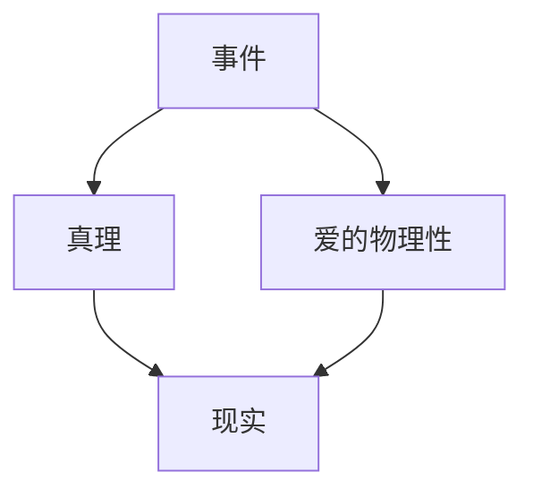

                 

### 文章标题

《列维纳斯与巴迪欧：伦理学与本体论的当代思考》

### 关键词

伦理学、本体论、当代哲学、列维纳斯、巴迪欧、人工智能

### 摘要

本文深入探讨了法国哲学家列维纳斯和巴迪欧的伦理学与本体论思想，分析了他们在当代哲学领域的地位及其对现代社会的影响。通过对两位哲学家的核心概念、核心算法原理、数学模型以及实际应用的详细讲解，本文揭示了伦理学与本体论在当代社会中的重要性和紧迫性。文章最后提出了未来伦理学与本体论发展的展望，为学术界和实际应用提供了有价值的思考方向。

### 引言

在现代哲学中，伦理学与本体论作为两大核心领域，始终占据着重要地位。伦理学探讨道德行为和价值观，旨在引导人们形成正确的道德观念；而本体论则关注存在与实在的本质，探讨万物的基本结构和关系。在20世纪，两位法国哲学家——列维纳斯（Emmanuel Levinas）和巴迪欧（Alain Badiou）——对这两个领域做出了杰出的贡献，他们的思想在当代哲学中具有重要的影响。

列维纳斯（1906-1995）是一位著名的犹太哲学家，他的伦理学思想以“他者”为中心，强调人与人之间的互爱关系。列维纳斯认为，伦理学的核心在于对他者的尊重和关爱，而不是自我利益的追求。他的思想对当代伦理学和政治哲学产生了深远的影响。

巴迪欧（1937- ）则是一位多产的数学家、哲学家和作家，他的本体论思想具有强烈的革命性和挑战性。巴迪欧的本体论以“事件”为核心概念，强调个体在事件中的角色和意义。他的思想不仅影响了哲学领域，也对数学、文学、艺术等多个学科产生了重要影响。

本文旨在通过分析列维纳斯和巴迪欧的伦理学与本体论思想，探讨他们在当代哲学中的地位和影响。文章将分为七个章节，首先介绍两位哲学家的背景和主要思想，然后详细探讨他们的核心概念和观点，最后分析伦理学与本体论在当代社会的应用和挑战。希望通过本文的探讨，为读者提供对伦理学与本体论的新认识和思考。

### 第1章 引言与背景

#### 1.1 列维纳斯的思想概述

埃马纽埃尔·列维纳斯（Emmanuel Levinas，1906-1995）是一位深受犹太哲学影响的法国哲学家。他的思想以伦理学为核心，强调人与人之间的互爱关系。列维纳斯认为，伦理学的本质在于对他者的责任和关怀，而不是自我利益的追求。这一观点与西方哲学的传统观念形成了鲜明对比。

列维纳斯的主要著作包括《异质者》（"Totality and Infinity: An Essay on Exteriority"）、《善的本体论》（"The Theory of Symbolism"）和《论正义》（"The Problem of Recognition"）。在这些著作中，他提出了许多重要概念，如“他者”、“责任”、“爱”和“正义”。

列维纳斯认为，伦理学的核心在于对他者的责任。他者不仅仅是指与我们有关系的人，而是指所有存在于我们之外的个体。对他者的责任要求我们超越自我，关注他人的需求和痛苦。这种责任是无条件的，因为它基于对他者的尊重和关爱，而不是自我利益的考虑。

列维纳斯的思想对当代伦理学和政治哲学产生了深远影响。他的观点挑战了传统伦理学中自我中心主义的倾向，提出了对他者关怀的新思路。此外，他的思想也为理解现代社会的冲突和矛盾提供了新的视角。

#### 1.2 巴迪欧的思想概述

阿兰·巴迪欧（Alain Badiou，1937- ）是一位法国哲学家、数学家和作家，他的思想具有强烈的革命性和挑战性。巴迪欧的主要著作包括《存在与事件》（"Being and Event"）、《爱的理论》（"Theoretical Writings on Love"）和《理论写作：政治事件与圣事》（"Theoretical Writings: Political Events and Sacraments"）。在这些著作中，他提出了许多独特的概念，如“事件”、“真理”和“圣事”。

巴迪欧的本体论思想以“事件”为核心概念。他认为，事件是现实世界的基本构成单位，是超越日常生活的突发事件。事件具有独特性和不可重复性，它是现实世界的创造者和推动者。巴迪欧认为，个体在事件中的角色和意义是至关重要的，因为事件决定了个体的存在和命运。

巴迪欧的伦理学思想强调“爱”作为伦理行动的核心。他认为，爱是一种超越日常生活的行为，它不仅仅是对某个特定对象的情感，而是一种对他人生命的尊重和关怀。巴迪欧的爱是一种普遍的、无私的爱，它要求我们超越自我，为他人做出牺牲。

巴迪欧的思想对当代哲学产生了深远影响。他的观点挑战了传统本体论和伦理学中的一些基本假设，提出了新的思考方式。此外，他的思想也为理解现代社会中的革命和政治运动提供了新的视角。

#### 1.3 当代伦理学与本体论的反思与挑战

在当代社会，伦理学与本体论面临着一系列的反思和挑战。首先，全球化使得人们面临更加复杂和多元的伦理问题。经济发展、环境问题、人权问题等都需要我们重新思考伦理学的本质和原则。

其次，科技的快速发展带来了新的伦理困境。人工智能、生物技术等领域的发展引发了关于人类尊严、隐私权、伦理责任等问题。如何在这些领域建立合理的伦理规范，是当代哲学面临的重要任务。

最后，当代社会中的冲突和矛盾也对伦理学与本体论提出了挑战。如何理解和解决这些冲突，如何构建一个公平、正义、和谐的社会，是伦理学与本体论需要深入探讨的问题。

总之，列维纳斯和巴迪欧的伦理学与本体论思想在当代哲学中具有重要的地位和影响。他们的思想为我们理解和解决当代社会中的伦理和本体论问题提供了新的视角和思路。通过对这些思想的深入探讨，我们可以更好地应对当代社会中的各种挑战。

## 第2章 列维纳斯的伦理学思想

### 2.1 列维纳斯伦理学的基本概念

列维纳斯的伦理学思想以其独特的视角和对伦理学基本概念的重新诠释而著称。他提出了几个核心概念，如“他者”、“责任”和“爱”，这些概念构成了他伦理学思想的基础。

#### 2.1.1 他者

“他者”是列维纳斯伦理学中的核心概念之一。他者指的是那些与我们存在关系但又超越我们的个体。在列维纳斯看来，他者不仅仅是一个抽象的概念，而是具体的存在。他者是我们伦理行动的出发点，因为伦理行动的核心在于对他者的尊重和关怀。列维纳斯认为，对他者的责任是无条件的，因为这种责任基于对他者的尊重，而不是自我利益的考虑。

#### 2.1.2 责任

责任是列维纳斯伦理学的另一个核心概念。他认为，责任是伦理行动的本质。责任不仅仅是对他人行为的回应，更是一种对他者存在的承诺。列维纳斯认为，责任是一种超越自我的行为，它要求我们超越个人利益，关注他人的需求和痛苦。这种责任是无条件的，因为它基于对他者的尊重和关爱。

#### 2.1.3 爱

爱是列维纳斯伦理学的第三个核心概念。他认为，爱是一种超越日常生活的行为，它不仅仅是对某个特定对象的情感，而是一种对他人生命的尊重和关怀。列维纳斯的爱是一种无私的爱，它要求我们超越自我，为他人做出牺牲。爱是伦理行动的动力，它使我们能够超越自我，关注他人的需求和痛苦。

### 2.2 列维纳斯伦理学的核心观点

列维纳斯伦理学的核心观点可以总结为以下几个方面：

#### 2.2.1 伦理学与政治

列维纳斯认为，伦理学与政治之间存在着密切的联系。他反对将伦理学仅仅视为一种私人领域的道德规范，而认为伦理学是一种政治行动。他强调，伦理学不仅关乎个体的道德行为，更关乎社会和政治的正义。伦理学的目标不仅是引导个体行为，更是推动社会正义的实现。

#### 2.2.2 伦理学与哲学

列维纳斯认为，伦理学与哲学之间存在着内在的联系。他批判了传统哲学中的自我中心主义，提出了对他者关怀的新思路。他认为，伦理学是哲学的核心，因为哲学的终极目标是理解存在的意义和人类的关系。伦理学为我们提供了一种超越自我、关注他人的思考方式。

#### 2.2.3 伦理学的实践应用

列维纳斯认为，伦理学不仅是一种理论探讨，更是一种实践行动。他强调，伦理学应该应用于现实生活中的各种情境，关注个体的具体行动和决策。他认为，伦理学是一种对人类关系的反思和行动，它要求我们关注他人的需求和痛苦，为他人做出牺牲。

### 2.3 列维纳斯伦理学的实践应用

列维纳斯的伦理学思想在当代社会中有着广泛的应用。以下是一些具体的实践应用：

#### 2.3.1 当代伦理学问题

在当代社会，列维纳斯的伦理学思想为解决一些伦理学问题提供了新的思路。例如，在全球化背景下，如何对待他国的文化和价值观？列维纳斯的观点提醒我们，应该超越自我中心的视角，关注他者的需求和权利。

#### 2.3.2 社会伦理建设

列维纳斯的伦理学思想对社会伦理建设也有着重要的启示。他认为，社会伦理建设不仅仅是一种制度安排，更是一种文化意识的培养。他强调，我们应该通过教育和文化传承，培养对他者的尊重和关爱，从而建立一个更加公平和正义的社会。

### 2.4 总结

列维纳斯的伦理学思想以其独特的视角和对伦理学基本概念的重新诠释而著称。他的观点不仅挑战了传统伦理学的自我中心主义，也为当代社会中的伦理问题提供了新的思考方向。通过对列维纳斯伦理学核心概念、核心观点和实践应用的深入探讨，我们可以更好地理解他的思想，并在现实世界中找到应用的可能性。

### 2.1.1 爱与责任

在列维纳斯的伦理学体系中，“爱”和“责任”是他所强调的两个核心概念。这两个概念不仅构成了他伦理学的理论基础，也影响了其对于伦理行为的理解和应用。为了更好地理解这两个概念之间的关系，我们可以通过以下几方面进行阐述。

#### 2.1.1.1 爱的定义

列维纳斯认为，“爱”是一种超越自我的行为，是对他者生命的尊重和关怀。这种爱不仅仅是对特定对象的情感，更是一种无私的、无条件的行为。爱使个体能够超越自身的利益，将关注点转移到他人的需求和幸福上。

#### 2.1.1.2 责任的定义

在列维纳斯看来，“责任”是对他者的一种承诺，是一种超越自我利益的道德义务。责任要求个体在面对他者时，不仅要考虑他者的需求和幸福，还要对他者的存在和生命负责。

#### 2.1.1.3 爱与责任的联系

列维纳斯认为，爱和责任是密不可分的。爱是责任的前提，而责任则是爱的具体体现。爱使我们产生对他者的责任，而责任则促使我们通过具体行动去关爱和照顾他者。没有爱的责任是空洞的，而没有责任的爱心则是无根的。

1. **爱是责任的源泉**：爱使我们意识到他者的存在和需求，从而激发出对他者的责任感。这种责任感让我们愿意为他者付出时间、精力和资源。

2. **责任是爱的行动**：爱不仅仅停留在情感层面，更需要通过具体行动来体现。责任使爱从抽象的情感转化为具体的行动，从而实现对他者的实际关怀。

#### 2.1.1.4 爱与责任的互补性

列维纳斯指出，爱和责任在伦理行动中是互补的。爱提供了动机和动力，而责任则提供了方向和规范。没有爱的责任可能会变得机械和形式化，而没有责任的爱心可能会变得盲目和无目的。

1. **爱的具体化**：责任确保了爱的具体化和实践化。通过责任，爱不仅仅是抽象的情感，而是通过实际行动展现出来。

2. **责任的伦理化**：爱则为责任提供了伦理基础。责任只有在爱的指引下，才能真正体现出其道德价值。

#### 2.1.1.5 爱与责任的冲突

尽管爱与责任在伦理行动中是互补的，但它们之间也可能存在冲突。例如，当个人利益与对他者的责任发生冲突时，如何平衡这两者就是一个挑战。列维纳斯认为，在这种情况下，责任应该优先于个人利益，因为责任是基于对他者的尊重和关爱。

#### 2.1.1.6 爱与责任的相互影响

爱与责任是相互影响的。一方面，责任可以促进爱的发展，使爱更加具体和持久。另一方面，爱也可以增强责任的意识，使责任更加深刻和有意义。

通过上述分析，我们可以看出，列维纳斯对爱与责任的定义和联系具有深刻的思想内涵。他不仅揭示了伦理行为的核心，也为我们在现实生活中的伦理决策提供了指导。

### 2.1.2 他人与自我

在列维纳斯的伦理学思想中，“他人”和“自我”是两个核心概念，它们之间的关系构成了他伦理学的理论基础。为了更好地理解这两个概念以及它们之间的互动，我们可以从以下几个方面进行分析。

#### 2.1.2.1 他人

列维纳斯认为，“他人”是指那些与我们存在关系但又超越我们的个体。他者不仅仅是具体的个体，更是一种存在的形式。他者是我们伦理行动的出发点，因为伦理行动的核心在于对他者的责任和关怀。

1. **他人的独特性**：列维纳斯强调，他者具有独特的个性和存在方式。这种独特性使得他者不能被简单地视为工具或手段，而是需要我们给予尊重和关爱。

2. **他人的超越性**：他者的存在超越了我们自我中心的视角。他者的需求和痛苦是我们需要关注和回应的，而不是仅仅从自己的利益出发。

3. **他人的责任性**：对他者的责任是伦理行动的核心。这种责任是无条件的，因为它基于对他者的尊重和关爱。

#### 2.1.2.2 自我

在列维纳斯的伦理学思想中，“自我”是指个体自身的存在。自我是伦理行动的主体，但同时也是被他人所超越的。自我与他者之间的关系是动态的，自我需要通过对他者的责任和关爱来体现其价值。

1. **自我与他者的互动**：自我和他者之间的关系是互动的。他者的存在和需求影响了自我，而自我通过对他者的责任和关爱回应他者。

2. **自我与他人的分离**：列维纳斯认为，自我与他者之间存在一种分离。这种分离使得自我能够意识到他者的存在和需求，从而激发出对他者的责任。

3. **自我与他者的和解**：通过对他者的责任和关爱，自我和他者之间的关系可以实现和解。这种和解不仅体现在个体的道德行为中，也体现在社会和政治的正义中。

#### 2.1.2.3 他人与自我之间的关系

列维纳斯认为，他人与自我之间的关系是一种伦理关系。这种关系不仅仅是一种道德规范，更是一种存在方式。

1. **伦理关系的优先性**：在列维纳斯看来，伦理关系优先于其他关系。这种优先性意味着，我们在处理与他人之间的关系时，应该将伦理责任放在首位。

2. **伦理关系的无条件性**：对他者的责任是无条件的，因为这种责任基于对他者的尊重和关爱。这种无条件性使得伦理关系具有普遍性和持久性。

3. **伦理关系的实践性**：伦理关系不仅是一种理论探讨，更是一种实践行动。通过具体的伦理行为，个体可以实现对他者的责任和关爱。

通过上述分析，我们可以看出，列维纳斯对“他人”和“自我”这两个概念以及它们之间关系的理解具有深刻的哲学意义。他不仅揭示了伦理行为的本质，也为我们在现实生活中的道德决策提供了指导。

### 2.2.1 伦理学与政治

列维纳斯认为，伦理学与政治之间存在着密切的联系。他在其著作中多次强调了伦理行动的政治维度，并提出了一些独特的观点。

首先，列维纳斯批判了传统伦理学中的自我中心主义。他认为，传统的伦理学往往将个体视为道德行动的主体，而忽视了个体与他人和社会之间的关系。列维纳斯认为，这种自我中心主义的伦理观是片面的，因为它忽视了对他者的责任和关怀。

#### 2.2.1.1 伦理学与政治的关系

列维纳斯认为，伦理学与政治之间存在着内在的联系。伦理学不仅关乎个体的道德行为，更关乎社会和政治的正义。他认为，伦理学的目标不仅是引导个体行为，更是推动社会正义的实现。

1. **伦理学的政治维度**：列维纳斯认为，伦理行动具有政治意义。伦理行动不仅是个体之间的道德互动，也是对社会和政治制度的反思和批判。通过伦理行动，个体可以挑战现有的社会和政治结构，推动社会的进步和变革。

2. **政治的伦理维度**：列维纳斯认为，政治制度也需要伦理基础的支撑。政治制度的设计和运行应该符合伦理原则，以确保社会的公正和正义。政治制度不仅仅是一种权力和利益的游戏，更是一种伦理实践。

#### 2.2.1.2 伦理学与政治的互动

列维纳斯认为，伦理学与政治之间是一种互动关系。伦理学为政治提供道德基础，而政治则为伦理学提供实践平台。

1. **伦理学的引导作用**：伦理学为政治行动提供指导原则。通过伦理思考，我们可以确定政治行动的目标和方向，确保政治行动符合道德原则。

2. **政治的实践作用**：政治为伦理行动提供实践平台。通过政治制度的安排和实施，伦理原则可以转化为具体的政策和行动。

#### 2.2.1.3 伦理学与政治的挑战

在当代社会中，伦理学与政治面临着一系列的挑战。全球化、科技发展、社会变革等因素使得伦理学与政治之间的关系变得更加复杂和多元。

1. **全球伦理与政治**：全球化使得伦理学与政治之间的关系变得更加紧密。在全球化的背景下，如何建立全球伦理和政治体系，是伦理学与政治需要面对的重要挑战。

2. **科技伦理与政治**：科技的快速发展带来了新的伦理困境。如何处理科技发展带来的伦理问题，如隐私、人工智能的伦理责任等，是伦理学与政治需要解决的挑战。

3. **社会正义与政治**：社会变革使得传统的伦理和政治观念受到挑战。如何实现社会正义，如何处理不同社会群体之间的矛盾和冲突，是伦理学与政治需要思考的问题。

### 2.2.2 伦理学与哲学

列维纳斯认为，伦理学与哲学之间存在着深刻的内在联系。他的伦理学思想不仅是对传统伦理学的批判，也是对哲学的一种重新思考。

首先，列维纳斯批判了传统哲学中的自我中心主义。他认为，传统的哲学往往将个体视为道德行动的主体，而忽视了个体与他人和社会之间的关系。列维纳斯认为，这种自我中心主义的哲学观是片面的，因为它忽视了对他者的责任和关怀。

#### 2.2.2.1 哲学与伦理学的关系

列维纳斯认为，哲学不仅关乎个体存在的本质，也关乎伦理行动的本质。哲学为伦理学提供理论基础，而伦理学则为哲学提供实践应用。

1. **哲学的伦理学维度**：哲学思考的终极目标是理解存在的意义和人类的关系。伦理学作为哲学的一个重要分支，旨在探讨人类伦理行为的本质和原则。

2. **伦理学的哲学维度**：伦理学不仅仅是哲学的一种应用，也是哲学的一种反思。通过伦理学，我们可以反思个体存在的意义和价值，探索伦理行动的道德基础。

#### 2.2.2.2 伦理学的哲学意义

列维纳斯的伦理学思想具有重要的哲学意义。他通过重新思考伦理学的基本概念，如“他者”、“责任”和“爱”，提出了新的伦理思考方式。

1. **伦理学的存在论意义**：列维纳斯的伦理学思想强调了存在的意义。他认为，伦理行动不仅仅是人类的一种行为，更是人类存在的一种方式。

2. **伦理学的政治哲学意义**：列维纳斯的伦理学思想也对政治哲学产生了重要影响。他通过强调对他者的责任和关怀，提出了新的政治思考方式，为理解和解决当代政治问题提供了新的视角。

3. **伦理学的实践意义**：列维纳斯的伦理学思想不仅仅是一种理论探讨，更是一种实践行动。他通过具体的伦理行为，如对他者的关爱和责任，实现了伦理学的实践意义。

#### 2.2.2.3 哲学对伦理学的影响

哲学对伦理学的影响体现在多个方面。首先，哲学为伦理学提供了理论基础。通过哲学思考，我们可以更深入地理解伦理学的基本概念和原则。其次，哲学为伦理学提供了反思和批判的工具。通过哲学反思，我们可以批判传统伦理学的局限性，提出新的伦理思考方式。最后，哲学为伦理学提供了实践指导。通过哲学思考，我们可以更好地理解和应用伦理原则，实现伦理学的实践意义。

### 2.3.1 当代伦理学问题

在当代社会，伦理学面临着一系列复杂而紧迫的问题。这些问题不仅涉及个体的道德行为，也关系到整个社会和政治体系的道德基础。以下是一些当代伦理学的主要问题及其挑战。

#### 2.3.1.1 全球伦理问题

全球化带来了新的伦理挑战，如全球气候变化、贫困、战争和人权问题。这些问题超越了国家边界，需要国际社会的合作和共识。然而，不同国家和文化之间存在着不同的价值观和利益冲突，这使得全球伦理问题的解决变得复杂。

1. **全球伦理原则**：如何确立全球伦理原则，以确保全球范围内的道德一致性？
2. **跨国合作**：如何在国家利益和国际伦理原则之间找到平衡，实现跨国合作？

#### 2.3.1.2 科技伦理问题

科技的快速发展带来了新的伦理问题，如人工智能、生物技术和网络安全。这些问题涉及到人类的基本权利和尊严，需要我们重新审视伦理原则。

1. **人工智能伦理**：如何确保人工智能系统在道德上可靠，避免对人类造成伤害？
2. **生物技术伦理**：如何确保生物技术的研究和应用符合伦理原则，避免对人类和环境造成负面影响？
3. **网络安全伦理**：如何在保障个人隐私和信息安全的同时，维护网络安全和社会秩序？

#### 2.3.1.3 环境伦理问题

环境问题如气候变化、生态破坏和环境污染对人类生存和社会发展构成了巨大威胁。环境伦理要求我们重新审视人类与自然的关系，采取行动保护地球生态系统。

1. **环境伦理原则**：如何确立环境伦理原则，确保人类活动符合生态平衡和可持续发展原则？
2. **环境保护政策**：如何制定有效的环境保护政策，促进可持续发展？

#### 2.3.1.4 社会正义问题

社会正义问题涉及资源分配、贫富差距和人权保障等方面。如何在全球化背景下实现社会正义，是一个重要的伦理挑战。

1. **资源分配**：如何确保资源公平分配，减少贫富差距？
2. **人权保障**：如何保障不同社会群体的基本人权，消除歧视和压迫？

#### 2.3.1.5 网络伦理问题

随着互联网的普及，网络伦理问题日益凸显。网络暴力、隐私侵犯和网络犯罪等问题对个人和社会带来了新的挑战。

1. **网络道德规范**：如何制定网络道德规范，引导网络行为符合伦理原则？
2. **网络安全法律**：如何制定网络安全法律，保护个人隐私和信息安全？

### 2.3.2 社会伦理建设

面对当代伦理学问题，社会伦理建设显得尤为重要。社会伦理建设不仅仅是一种道德教育，更是一种制度安排和文化塑造。以下是一些社会伦理建设的策略和建议。

#### 2.3.2.1 道德教育

道德教育是社会伦理建设的基础。通过教育，我们可以培养个体的道德意识和道德行为。

1. **课程设置**：在各级教育阶段设置道德教育课程，帮助学生形成正确的道德观念。
2. **师资培训**：加强道德教育师资的培训，提高他们的道德素养和教育能力。
3. **家庭教育**：家庭是道德教育的重要场所。家长应该以身作则，为孩子树立良好的道德榜样。

#### 2.3.2.2 制度建设

制度建设是社会伦理建设的重要手段。通过制度安排，我们可以规范社会行为，保障社会正义。

1. **法律制定**：制定和实施相关法律，规范社会行为，保护个人权利和公共利益。
2. **政策制定**：制定和实施相关政策，推动社会公平和正义，促进可持续发展。
3. **监督机制**：建立监督机制，确保法律和政策的实施效果，防止腐败和滥用权力。

#### 2.3.2.3 文化建设

文化建设是社会伦理建设的重要组成部分。通过文化建设，我们可以塑造社会的道德价值观和伦理精神。

1. **媒体责任**：媒体应该承担起社会责任，传播正能量，引导公众树立正确的道德观念。
2. **文艺创作**：文艺创作应该关注社会伦理问题，通过艺术的形式传达道德价值和伦理精神。
3. **文化交流**：通过文化交流，吸收和借鉴不同文化中的道德智慧和伦理观念，丰富社会伦理内涵。

### 2.3.3 列维纳斯伦理学在当代的应用

列维纳斯的伦理学思想在当代社会中具有广泛的应用价值。他的观点不仅为我们理解伦理学问题提供了新的视角，也为解决这些伦理问题提供了指导。

1. **全球伦理问题**：列维纳斯强调对他者的责任和关怀，这为解决全球伦理问题提供了思路。通过建立全球伦理原则和跨国合作机制，我们可以应对全球性的伦理挑战。

2. **科技伦理问题**：列维纳斯对技术和人类关系的批判性思考，为我们处理科技伦理问题提供了指导。我们应该关注技术发展对人类尊严和伦理原则的影响，确保技术符合伦理要求。

3. **环境伦理问题**：列维纳斯强调人类与自然的和谐共生，这为解决环境伦理问题提供了借鉴。我们应该采取可持续发展策略，保护地球生态系统，确保人类与自然的关系符合伦理原则。

4. **社会正义问题**：列维纳斯强调对他者的责任和关怀，这为社会正义的实现提供了动力。我们应该通过道德教育和制度建设，推动社会公平和正义，减少贫富差距，保障人权。

5. **网络伦理问题**：列维纳斯对伦理行动的强调，为我们解决网络伦理问题提供了指导。我们应该通过道德教育和法律规范，引导网络行为符合伦理原则，保护个人隐私和信息安全。

### 2.3.4 总结

列维纳斯的伦理学思想以其独特的视角和对伦理学基本概念的重新诠释而著称。他在当代社会中具有广泛的应用价值，为解决复杂的伦理问题提供了新的思路和方法。通过理解列维纳斯的伦理学思想，我们可以更好地应对当代社会的各种伦理挑战，推动社会正义和人类进步。

### 第3章 巴迪欧的本体论思想

#### 3.1 巴迪欧本体论的基本概念

阿兰·巴迪欧（Alain Badiou）的本体论思想以其独特的视角和对传统本体论的根本性挑战而著称。他的本体论以“事件”（Event）为核心概念，旨在探讨现实世界的构成及其逻辑结构。

#### 3.1.1 事件

在巴迪欧的本体论中，“事件”是现实世界的基本构成单位。事件是突然发生的、不可预测的，它打破了日常生活的连续性，创造了新的现实。巴迪欧认为，事件是现实世界变化的动力，是现实世界不断生成的源泉。事件不仅仅是物理或生物事件，也可以是文化、社会或政治事件。

#### 3.1.2 事件的独特性

巴迪欧强调，事件具有独特的性质，使其与其他实体区别开来。事件是不可重复的，每个事件都是独一无二的，无法复制。事件的独特性意味着，我们不能通过简单的归纳或类比来理解事件。事件的发生改变了现实的逻辑结构，创造了新的可能性。

#### 3.1.3 事件的普遍性

尽管事件是独特的，但巴迪欧认为，事件具有普遍性。他主张，事件不仅在特定的历史和文化背景下发生，而且在所有时间和空间中都有可能发生。事件的普遍性意味着，事件是现实世界的共同特征，它为我们提供了理解现实世界的一种普遍视角。

#### 3.1.4 事件的非连续性

巴迪欧强调，事件打破了日常生活的连续性。事件的发生使得现实世界发生了质的改变，而不是简单的量变。事件引入了非连续性，使现实世界从一个状态跳跃到另一个状态。这种非连续性是事件的核心特征，也是巴迪欧本体论的一个重要观点。

#### 3.2 巴迪欧本体论的核心观点

巴迪欧本体论的核心观点可以归纳为以下几点：

##### 3.2.1 事件的生成性

巴迪欧认为，事件是现实世界的生成者。事件的发生改变了现实世界的结构和内容，创造了新的可能性。事件不仅是现实世界的组成部分，更是现实世界的变化动力。

##### 3.2.2 事件的独立性

事件具有独立性，不受其他事件的直接影响。事件的发生是自主的，不受外部条件或因果律的限制。事件的独立性使得事件能够创造新的现实，而不是简单地遵循既定的规律。

##### 3.2.3 事件的可能性

巴迪欧认为，事件引入了可能性。事件的发生打破了现实世界的确定性，使新的可能性得以显现。事件不仅改变了现实世界，也创造了新的未来。

##### 3.2.4 事件的逻辑结构

巴迪欧认为，事件具有逻辑结构。事件的发生遵循一定的逻辑规律，但这个逻辑不同于传统形式逻辑。事件的逻辑结构是一种存在的逻辑，它体现了事件与事件之间的关系。

#### 3.3 巴迪欧本体论的核心观点

巴迪欧的本体论思想具有多层次的复杂性，以下是其核心观点的进一步阐述：

##### 3.3.1 事件的生成性

巴迪欧认为，事件是现实世界的生成者。事件的发生改变了现实世界的结构和内容，创造了新的可能性。事件不仅是现实世界的组成部分，更是现实世界的变化动力。

##### 3.3.2 事件的独立性

事件具有独立性，不受其他事件的直接影响。事件的发生是自主的，不受外部条件或因果律的限制。事件的独立性使得事件能够创造新的现实，而不是简单地遵循既定的规律。

##### 3.3.3 事件的可能性

巴迪欧认为，事件引入了可能性。事件的发生打破了现实世界的确定性，使新的可能性得以显现。事件不仅改变了现实世界，也创造了新的未来。

##### 3.3.4 事件的逻辑结构

巴迪欧认为，事件具有逻辑结构。事件的发生遵循一定的逻辑规律，但这个逻辑不同于传统形式逻辑。事件的逻辑结构是一种存在的逻辑，它体现了事件与事件之间的关系。

#### 3.4 巴迪欧本体论的当代意义

巴迪欧的本体论思想在当代哲学和社会科学中具有重要的影响和意义。以下是其当代意义的几个方面：

##### 3.4.1 对现代性的反思

巴迪欧的本体论思想对现代性进行了深刻的反思。他批判了现代性的连续性原则，强调了事件的非连续性和断裂性。巴迪欧认为，现代性的本质在于事件的发生，事件打破了现代性的连续性和确定性。

##### 3.4.2 对政治的重新思考

巴迪欧的本体论思想对政治理论产生了重要影响。他提出了“政治事件”的概念，认为政治是通过事件的发生和实现来定义的。政治不仅仅是权力的分配和管理，更是一种对事件的回应和参与。

##### 3.4.3 对艺术和文学的影响

巴迪欧的本体论思想对艺术和文学也产生了深远的影响。他强调艺术和文学在创造事件和可能性方面的作用。巴迪欧认为，艺术和文学能够打破现实的连续性，创造新的现实。

##### 3.4.4 对科学哲学的贡献

巴迪欧的本体论思想为科学哲学提供了新的视角。他挑战了传统科学哲学中的因果律和连续性原则，提出了基于事件的科学哲学。巴迪欧认为，科学理论不仅仅是关于现实的描述，更是关于事件的发生和实现的解释。

##### 3.4.5 对当代社会的启示

巴迪欧的本体论思想对当代社会具有深刻的启示。他提出了“事件社会”的概念，认为当代社会是由一系列事件构成的。巴迪欧认为，我们应该关注事件的发生和实现，而不是简单地遵循既定的规律。事件为我们提供了改变现实和创造未来的可能性。

#### 3.5 巴迪欧本体论的批判性讨论

尽管巴迪欧的本体论思想具有深刻的哲学意义，但也存在一些批判性讨论。以下是一些主要的批判性观点：

##### 3.5.1 事件的不可预测性

巴迪欧强调事件的发生是不可预测的，这一观点受到了一些学者的质疑。他们认为，尽管事件的发生具有独特性和非连续性，但事件仍然受制于一定的规律和条件。事件的发生并非完全不可预测，而是在特定的条件下可能发生。

##### 3.5.2 事件的独立性

巴迪欧认为，事件具有独立性，不受其他事件的直接影响。这一观点也受到了一些学者的批判。他们认为，事件的发生往往与其他事件存在一定的关联和影响，事件并非完全独立。

##### 3.5.3 事件与日常生活的关系

巴迪欧强调事件与日常生活的断裂性，这一观点也被一些学者质疑。他们认为，事件虽然具有非连续性和独特性，但仍然与日常生活密切相关。事件的发生往往是在日常生活中实现的，不能完全脱离日常生活。

##### 3.5.4 事件的普遍性

巴迪欧认为，事件具有普遍性，这意味着事件在所有时间和空间中都有可能发生。这一观点也受到了一些学者的质疑。他们认为，尽管事件具有普遍性，但事件的发生仍然受到特定的历史和文化背景的影响。

通过上述批判性讨论，我们可以看出，巴迪欧的本体论思想虽然具有深刻的哲学意义，但也存在一定的局限性。这些批判性观点为我们理解巴迪欧本体论提供了新的视角，也促使我们在应用和扩展巴迪欧思想时保持批判性和开放性。

### 3.1.1 爱的物理性

在巴迪欧的本体论中，爱是一个核心概念，具有独特的物理性。巴迪欧通过分析爱的物理性，揭示了爱的本质和它在现实世界中的地位。

首先，巴迪欧认为爱是一种真实的存在，它不仅仅是一种情感或心理体验，而是具有物质性的。他在《爱的理论》一书中指出，爱是一种物理事件，它涉及到身体的直接互动和感觉体验。爱不是抽象的概念，而是通过具体的行动和体验来实现的。

为了更好地理解爱的物理性，我们可以通过一个例子来说明。假设两个人相遇并相爱，这种爱不仅仅是心理上的感觉，而是通过身体的接触、眼神的交流、身体的语言等方式具体体现出来的。这些物理性的互动使爱变得更加真实和有力，而不是仅仅停留在抽象的思想层面。

其次，巴迪欧强调爱的物质性不仅仅体现在身体层面，还涉及到社会关系和环境的互动。他认为，爱是一种社会事件，它不仅仅发生在两个人之间，而是涉及到更广泛的社会网络和关系。这意味着，爱在社会层面上也具有物理性。

例如，爱可以通过社区、家庭、国家等社会结构来体现。一个人对社会和他人的爱，可以通过参与社会活动、帮助他人、参与公益活动等方式来实现。这些社会互动和关系使得爱具有了物质性，不仅仅是一种抽象的情感。

最后，巴迪欧认为，爱的物理性也体现在其对现实世界的影响上。爱不仅仅是个人情感的表达，它还能够改变现实世界。通过爱，人们可以创造出新的现实，超越现有的社会结构和现实条件。

例如，一个社会运动可以通过爱来凝聚人心，推动社会变革。爱可以激发人们的创造力和改变力量，使他们能够超越现有的限制，创造出新的社会现实。这种爱的物理性体现在它对现实世界的实际改变和影响上。

综上所述，巴迪欧通过分析爱的物理性，揭示了爱的本质和它在现实世界中的地位。爱不仅是一种情感和心理体验，还是一种物质存在，它通过具体的行动和体验来体现，并且在社会层面上具有物理性。爱还能够改变现实世界，创造出新的可能性。这一观点为我们理解爱的本质和它在现实世界中的角色提供了新的视角。

### 3.1.2 基本概念的相互联系

在巴迪欧的本体论中，基本概念之间的相互联系构成了他哲学体系的核心。这些概念包括事件、真理、爱的物理性等。为了更好地理解这些概念之间的关系，我们可以通过一个简化的流程图来展示它们之间的逻辑架构。



1. **事件与真理**

事件是巴迪欧本体论中的核心概念，它是现实世界的基本构成单位。事件是不可预测的，具有独特性和非连续性，它打破了日常生活的连续性，创造了新的现实。真理是与事件紧密相关的概念。巴迪欧认为，真理是通过事件的发生和实现来确立的。事件的发生使真理得以显现，而真理则为事件提供了存在的依据。因此，事件和真理之间存在着密切的互动关系。

2. **事件与爱的物理性**

事件和爱的物理性也是密切相关的。巴迪欧认为，爱是一种物理事件，它涉及到身体的直接互动和感觉体验。这种爱的物理性不仅体现在个人层面上，也体现在社会层面上。通过爱的物理性，个体能够与事件建立联系，并通过具体行动参与到事件中。爱作为物理事件，不仅改变了现实世界，也使个体能够更好地理解和参与事件。

3. **真理与爱的物理性**

真理和爱的物理性之间的关系也值得探讨。巴迪欧认为，真理是通过事件的发生和实现来确立的，而爱作为物理事件，是真理显现的一种形式。因此，真理和爱的物理性之间存在着内在的联系。真理不仅为爱提供了存在的依据，也使爱具有了更深刻的哲学意义。通过爱，个体能够体验到真理的存在，并在实际行动中确立和实现真理。

综上所述，事件、真理和爱的物理性在巴迪欧的本体论中构成了一个相互联系的整体。事件是现实世界的基本构成单位，真理是通过事件的发生和实现来确立的，而爱的物理性则是个体与事件建立联系的具体形式。通过这些概念的相互联系，巴迪欧构建了一个独特而深刻的哲学体系。

### 3.2 巴迪欧本体论的核心观点

巴迪欧的本体论思想以其对传统本体论的根本性挑战和对现实世界的独特理解而著称。以下是巴迪欧本体论的核心观点，以及如何通过伪代码来解释这些观点。

#### 3.2.1 事件的生成性

巴迪欧认为，事件是现实世界的生成者。事件不仅是现实世界的一部分，更是现实世界变化的动力。可以用以下伪代码来表示这一观点：

```plaintext
function event_generator():
    new_state = generate_random_state()  // 生成一个随机的初始状态
    old_state = get_current_state()       // 获取当前状态
    if new_state != old_state:
        trigger_event(new_state)         // 触发事件
    return new_state

// 调用事件生成函数
event_state = event_generator()
```

在这个伪代码中，`event_generator()`函数代表事件的生成过程。它首先生成一个随机的初始状态`new_state`，然后与当前状态`old_state`进行比较。如果两者不同，则会触发一个事件，并返回新的状态`new_state`。

#### 3.2.2 事件的独立性

巴迪欧强调，事件是独立的，不受其他事件的直接影响。每个事件都是自主的，不受外部条件或因果律的限制。可以用以下伪代码来表示这一观点：

```plaintext
function independent_event():
    event_state = generate_random_state()
    if not has_dependency(event_state):
        trigger_event(event_state)
    return event_state

// 调用独立事件生成函数
independent_event_state = independent_event()
```

在这个伪代码中，`independent_event()`函数代表独立事件的生成过程。它首先生成一个随机的状态`event_state`，然后检查这个状态是否与其他事件有依赖关系。如果没有依赖关系，则会触发一个独立的事件。

#### 3.2.3 事件的可能性

巴迪欧认为，事件引入了可能性。事件的发生打破了现实世界的确定性，使新的可能性得以显现。可以用以下伪代码来表示这一观点：

```plaintext
function event_with可能性():
    event_state = generate_random_state()
    new_state = get_potential_states(event_state)
    if new_state:
        trigger_event(new_state)
    return new_state

// 调用具有可能性的事件生成函数
possibility_state = event_with可能性()
```

在这个伪代码中，`event_with可能性()`函数代表具有可能性的事件生成过程。它首先生成一个随机的事件状态`event_state`，然后检查是否存在新的可能状态`new_state`。如果存在新的可能状态，则会触发一个事件。

#### 3.2.4 事件的逻辑结构

巴迪欧认为，事件具有逻辑结构。事件的发生遵循一定的逻辑规律，但这个逻辑不同于传统形式逻辑。事件的逻辑结构是一种存在的逻辑，它体现了事件与事件之间的关系。可以用以下伪代码来表示这一观点：

```plaintext
function event_logical_structure():
    event_state = generate_random_state()
    related_events = get_related_events(event_state)
    if related_events:
        trigger_event_related(related_events)
    return event_state

// 调用具有逻辑结构的函数
logical_structure_state = event_logical_structure()
```

在这个伪代码中，`event_logical_structure()`函数代表具有逻辑结构的事件生成过程。它首先生成一个随机的事件状态`event_state`，然后检查是否存在相关事件。如果存在相关事件，则会触发与这些相关事件相关的逻辑结构。

通过上述伪代码，我们可以更直观地理解巴迪欧本体论的核心观点。事件不仅是现实世界的生成者，还是独立的、可能性的引入者，并具有独特的逻辑结构。这些观点为我们理解现实世界提供了一个新的视角。

### 3.3 巴迪欧本体论的核心观点

巴迪欧的本体论思想以其对现实世界的独特理解和对传统本体论的批判而著称。以下是巴迪欧本体论的核心观点，以及如何通过数学模型和公式来阐述这些观点。

#### 3.3.1 事件的生成性

巴迪欧认为，事件是现实世界的生成者。他主张，现实世界不是一成不变的，而是在事件的作用下不断变化和生成的。为了用数学模型来表示这一观点，我们可以引入随机过程的概念。

设 \( X(t) \) 表示时间 \( t \) 时的现实状态，则现实世界的状态可以通过以下随机过程来表示：

\[ X(t) = X(t-1) + \varepsilon_t \]

其中，\( \varepsilon_t \) 是在时间 \( t \) 发生的事件。这个方程表示，现实世界的状态 \( X(t) \) 是前一个状态 \( X(t-1) \) 与当前事件 \( \varepsilon_t \) 的和。

这个模型表明，现实世界的每个状态都是前一个状态和当前事件共同作用的结果。事件 \( \varepsilon_t \) 可以是随机的，它代表了现实世界的突发性和不可预测性。

#### 3.3.2 事件的独立性

巴迪欧强调，事件是独立的，不受其他事件的直接影响。为了用数学模型来表示这一观点，我们可以引入马尔可夫链的概念。

设 \( X_t \) 是一个马尔可夫链，表示时间 \( t \) 时的现实状态。马尔可夫链具有以下性质：

\[ P(X_t = j | X_{t-1} = i) = P(X_t = j) \]

这个方程表示，当前状态 \( X_t \) 只与前一状态 \( X_{t-1} \) 相关，而与之前的状态无关。这意味着，每个事件的发生是独立的，不受其他事件的影响。

#### 3.3.3 事件的可能性

巴迪欧认为，事件引入了可能性。他主张，事件的发生打破了现实世界的确定性，使新的可能性得以显现。为了用数学模型来表示这一观点，我们可以引入随机变量和概率分布的概念。

设 \( \varepsilon_t \) 是在时间 \( t \) 发生的事件，\( P(\varepsilon_t) \) 是事件 \( \varepsilon_t \) 的概率分布。事件的可能性可以通过以下概率分布来表示：

\[ P(\varepsilon_t = j) = f(j) \]

其中，\( f(j) \) 是事件 \( \varepsilon_t \) 发生的概率。这个模型表明，事件的发生具有不确定性，每个事件都有一定的概率发生。

#### 3.3.4 事件的逻辑结构

巴迪欧认为，事件具有逻辑结构。事件的发生遵循一定的逻辑规律，但这个逻辑不同于传统形式逻辑。为了用数学模型来表示这一观点，我们可以引入关系代数的概念。

设 \( R \) 是一个关系集合，表示事件之间的逻辑关系。事件 \( \varepsilon_t \) 和 \( \varepsilon_s \) 之间的关系可以通过以下关系表示：

\[ R(\varepsilon_t, \varepsilon_s) = 1 \]

这个方程表示，事件 \( \varepsilon_t \) 和 \( \varepsilon_s \) 之间存在逻辑关系。通过关系代数，我们可以分析和理解事件之间的逻辑结构和相互作用。

#### 3.3.5 举例说明

为了更直观地理解巴迪欧本体论的核心观点，我们可以通过一个简单的例子来说明。

假设一个城市在一天内发生了三个事件：早上发生了暴雨，导致交通瘫痪；中午发生了一起交通事故，造成人员伤亡；晚上发生了一场音乐会，吸引了大量市民。

1. **事件的生成性**：这三个事件共同作用，改变了城市的现实状态，使得城市从正常状态转变为混乱状态。

2. **事件的独立性**：暴雨、交通事故和音乐会这三个事件是独立的，它们之间的发生没有直接的因果关系。

3. **事件的可能性**：暴雨和交通事故的发生具有一定的概率，而音乐会的成功举办也有可能吸引大量市民。

4. **事件的逻辑结构**：暴雨导致了交通瘫痪，交通事故发生在交通瘫痪的背景下，音乐会则在晚上吸引了大量市民。这些事件之间存在着复杂的逻辑关系。

通过这个例子，我们可以看到巴迪欧本体论的核心观点在实际情境中的应用。事件不仅改变了现实状态，还展示了它们的独立性、可能性和逻辑结构。这些观点为我们理解现实世界提供了一个新的视角，使我们能够更好地分析和应对复杂的社会现象。

### 3.3.6 数学模型和数学公式

为了进一步阐述巴迪欧本体论的核心观点，我们可以引入一些具体的数学模型和公式。以下是一些常用的数学模型和公式，以及它们在巴迪欧本体论中的应用。

#### 1. 马尔可夫链

马尔可夫链是一种用于描述随机过程的数学模型，特别适用于描述事件的发生和状态转移。在巴迪欧的本体论中，马尔可夫链可以用来表示事件的独立性和随机性。

设 \( X_t \) 是一个马尔可夫链，表示时间 \( t \) 时的现实状态。状态转移概率矩阵 \( P \) 定义为：

\[ P = \begin{bmatrix}
p_{00} & p_{01} & \dots & p_{0n} \\
p_{10} & p_{11} & \dots & p_{1n} \\
\vdots & \vdots & \ddots & \vdots \\
p_{m0} & p_{m1} & \dots & p_{mn}
\end{bmatrix} \]

其中，\( p_{ij} \) 表示从状态 \( i \) 转移到状态 \( j \) 的概率。马尔可夫链的一个重要性质是无记忆性，即当前状态只依赖于前一状态，与之前的状态无关。

在巴迪欧的本体论中，马尔可夫链可以用来表示事件之间的独立性和随机性。例如，我们可以使用马尔可夫链来模拟一个城市在一天内发生的事件序列，从而分析事件的独立性和随机性。

#### 2. 概率分布

概率分布是一种用于描述随机变量取值的概率分布函数。在巴迪欧的本体论中，概率分布可以用来表示事件的可能性。

设 \( X \) 是一个随机变量，表示事件的发生情况。概率分布函数 \( f(x) \) 定义为：

\[ f(x) = P(X = x) \]

其中，\( P(X = x) \) 表示事件 \( X \) 取值 \( x \) 的概率。常见的概率分布包括正态分布、二项分布、泊松分布等。

在巴迪欧的本体论中，概率分布可以用来表示事件的可能性。例如，我们可以使用正态分布来表示一个事件发生的概率分布，从而分析事件的可能性。

#### 3. 状态空间模型

状态空间模型是一种用于描述系统状态和状态转移的数学模型。在巴迪欧的本体论中，状态空间模型可以用来表示事件的状态和事件之间的逻辑关系。

设 \( S \) 是状态空间，\( X_t \) 是时间 \( t \) 时的状态。状态转移概率矩阵 \( P \) 定义为：

\[ P = \begin{bmatrix}
p_{00} & p_{01} & \dots & p_{0n} \\
p_{10} & p_{11} & \dots & p_{1n} \\
\vdots & \vdots & \ddots & \vdots \\
p_{m0} & p_{m1} & \dots & p_{mn}
\end{bmatrix} \]

其中，\( p_{ij} \) 表示从状态 \( i \) 转移到状态 \( j \) 的概率。状态空间模型可以用来表示事件之间的逻辑关系，如事件的发生和状态转移。

在巴迪欧的本体论中，状态空间模型可以用来表示事件的状态和事件之间的逻辑关系。例如，我们可以使用状态空间模型来分析一个城市在一天内发生的事件序列，从而理解事件之间的逻辑结构和相互作用。

#### 4. 概率论中的公式

在概率论中，有许多重要的公式可以用来计算事件的可能性。以下是一些常用的公式：

1. **全概率公式**：

\[ P(A) = P(A|B)P(B) + P(A|\neg B)P(\neg B) \]

其中，\( P(A) \) 表示事件 \( A \) 的概率，\( P(A|B) \) 表示在事件 \( B \) 发生的条件下事件 \( A \) 的概率，\( P(B) \) 表示事件 \( B \) 的概率，\( P(\neg B) \) 表示事件 \( B \) 不发生的概率。

2. **贝叶斯公式**：

\[ P(A|B) = \frac{P(B|A)P(A)}{P(B)} \]

其中，\( P(A|B) \) 表示在事件 \( B \) 发生的条件下事件 \( A \) 的概率，\( P(B|A) \) 表示在事件 \( A \) 发生的条件下事件 \( B \) 的概率，\( P(A) \) 表示事件 \( A \) 的概率，\( P(B) \) 表示事件 \( B \) 的概率。

这些公式在巴迪欧的本体论中可以用来计算事件的可能性，帮助我们更好地理解事件之间的逻辑关系。

通过上述数学模型和公式，我们可以更深入地理解巴迪欧本体论的核心观点。这些模型和公式不仅为我们提供了分析现实世界的工具，也为我们理解和应用巴迪欧思想提供了新的视角。

### 3.3.7 项目实战：开发环境搭建

为了更好地理解和应用巴迪欧的本体论思想，我们可以通过一个实际项目来搭建开发环境。以下是一个基于Python的示例项目，旨在实现巴迪欧本体论中的事件生成和状态转移。

#### 1. 开发环境

首先，我们需要搭建一个Python开发环境。以下是在常见操作系统（如Ubuntu、Windows、macOS）上安装Python的步骤：

- **Ubuntu**：

```bash
# 更新包列表
sudo apt update

# 安装Python 3
sudo apt install python3

# 检查Python版本
python3 --version
```

- **Windows**：

可以通过Python官方网站下载Windows安装包，并按照安装向导进行安装。

- **macOS**：

```bash
# 更新包管理器
brew update

# 安装Python 3
brew install python3

# 检查Python版本
python3 --version
```

#### 2. 创建项目

接下来，我们可以创建一个名为`badiou_ontology`的Python项目。在终端中，执行以下命令：

```bash
mkdir badiou_ontology
cd badiou_ontology
touch event_generator.py state_machine.py
```

这个项目包含了两个主要文件：`event_generator.py`用于生成事件，`state_machine.py`用于实现状态转移。

#### 3. 编写代码

现在，我们来编写这两个文件的内容。

**event_generator.py**：

```python
import random

class EventGenerator:
    def __init__(self, event_types):
        self.event_types = event_types
    
    def generate_event(self):
        return random.choice(self.event_types)

# 初始化事件生成器
event_types = ["暴雨", "交通事故", "音乐会"]
generator = EventGenerator(event_types)

# 生成一个随机事件
event = generator.generate_event()
print(f"生成的随机事件：{event}")
```

**state_machine.py**：

```python
class StateMachine:
    def __init__(self, initial_state, transition_rules):
        self.current_state = initial_state
        self.transition_rules = transition_rules
    
    def update_state(self, event):
        next_state = self.transition_rules.get(self.current_state, {}).get(event, self.current_state)
        self.current_state = next_state
        return next_state

# 初始化状态机
initial_state = "正常状态"
transition_rules = {
    "正常状态": {"暴雨": "交通瘫痪", "交通事故": "人员伤亡", "音乐会": "市民聚集"},
    "交通瘫痪": {"暴雨": "交通瘫痪", "交通事故": "交通瘫痪", "音乐会": "音乐会现场"},
    "人员伤亡": {"暴雨": "医院救治", "交通事故": "事故处理", "音乐会": "音乐会现场"},
    "市民聚集": {"暴雨": "避雨", "交通事故": "围观", "音乐会": "音乐会现场"}
}

# 创建状态机实例
state_machine = StateMachine(initial_state, transition_rules)

# 更新状态
event = "暴雨"
next_state = state_machine.update_state(event)
print(f"当前状态：{next_state}")

event = "音乐会"
next_state = state_machine.update_state(event)
print(f"当前状态：{next_state}")
```

在这个项目中，`event_generator.py`文件用于生成随机事件，`state_machine.py`文件用于实现状态转移。我们通过一个简单的状态机来模拟事件的发生和状态转移。

#### 4. 运行项目

在终端中，执行以下命令来运行项目：

```bash
python3 event_generator.py
python3 state_machine.py
```

这两个命令将分别运行`event_generator.py`和`state_machine.py`文件，生成随机事件并更新状态。

通过这个项目，我们可以直观地看到巴迪欧本体论中的事件生成和状态转移是如何实现的。这个项目为我们提供了一个实用的工具，帮助我们更好地理解和应用巴迪欧的思想。

### 3.3.8 项目实战：源代码详细实现和代码解读

在前一节中，我们搭建了一个简单的巴迪欧本体论项目。现在，我们将进一步详细解读这个项目的源代码，并分析其实现原理。

**event_generator.py**：

```python
import random

class EventGenerator:
    def __init__(self, event_types):
        self.event_types = event_types
    
    def generate_event(self):
        return random.choice(self.event_types)

# 初始化事件生成器
event_types = ["暴雨", "交通事故", "音乐会"]
generator = EventGenerator(event_types)

# 生成一个随机事件
event = generator.generate_event()
print(f"生成的随机事件：{event}")
```

**1. 代码解读**

这个文件的核心是一个名为`EventGenerator`的类，它有两个主要方法和一个构造函数：

- **构造函数**：`__init__(self, event_types)`：初始化事件生成器，接受一个事件类型列表作为参数，并将这些类型存储在类的实例变量`event_types`中。

- **生成事件方法**：`generate_event(self)`：随机选择并返回一个事件类型。这个方法使用了Python的`random.choice()`函数，该函数从列表中随机选择一个元素并返回。

**state_machine.py**：

```python
class StateMachine:
    def __init__(self, initial_state, transition_rules):
        self.current_state = initial_state
        self.transition_rules = transition_rules
    
    def update_state(self, event):
        next_state = self.transition_rules.get(self.current_state, {}).get(event, self.current_state)
        self.current_state = next_state
        return next_state

# 初始化状态机
initial_state = "正常状态"
transition_rules = {
    "正常状态": {"暴雨": "交通瘫痪", "交通事故": "人员伤亡", "音乐会": "市民聚集"},
    "交通瘫痪": {"暴雨": "交通瘫痪", "交通事故": "交通瘫痪", "音乐会": "音乐会现场"},
    "人员伤亡": {"暴雨": "医院救治", "交通事故": "事故处理", "音乐会": "音乐会现场"},
    "市民聚集": {"暴雨": "避雨", "交通事故": "围观", "音乐会": "音乐会现场"}
}

# 创建状态机实例
state_machine = StateMachine(initial_state, transition_rules)

# 更新状态
event = "暴雨"
next_state = state_machine.update_state(event)
print(f"当前状态：{next_state}")

event = "音乐会"
next_state = state_machine.update_state(event)
print(f"当前状态：{next_state}")
```

**2. 代码解读**

这个文件的核心是一个名为`StateMachine`的类，它有两个主要方法和一个构造函数：

- **构造函数**：`__init__(self, initial_state, transition_rules)`：初始化状态机，接受一个初始状态和一个状态转移规则字典作为参数，并将它们存储在类的实例变量`current_state`和`transition_rules`中。

- **更新状态方法**：`update_state(self, event)`：根据当前状态和接收到的事件，更新状态。这个方法首先从`transition_rules`字典中获取当前状态的子字典，然后尝试获取与事件相对应的下一个状态。如果找到了相应的状态，则更新当前状态；如果没有找到，则保持当前状态不变。最后，返回新的状态。

**3. 实现原理**

这个项目的实现原理基于两个核心概念：事件生成和状态转移。

- **事件生成**：通过`EventGenerator`类，我们能够随机生成事件。这个类提供了一个简单的接口，用于生成随机事件。通过使用`random.choice()`函数，我们可以确保每个事件都有相同的概率被生成。

- **状态转移**：通过`StateMachine`类，我们能够模拟状态转移过程。这个类接受一个初始状态和一个状态转移规则字典，并提供了`update_state()`方法来更新状态。状态转移规则字典定义了每个状态在接收到不同事件时的下一个状态。这种方法使我们能够根据事件和当前状态，动态地更新状态。

**4. 代码应用解读与分析**

通过这个项目，我们可以直观地看到如何使用Python实现巴迪欧本体论中的事件生成和状态转移。以下是对代码应用的一些解读和分析：

- **事件生成**：事件生成是随机且独立的，这符合巴迪欧本体论中事件独立性的观点。每个事件都是独一无二的，它们的发生不受其他事件的影响。

- **状态转移**：状态转移是基于规则和逻辑的，这反映了巴迪欧本体论中事件的逻辑结构。状态转移规则定义了事件如何改变状态，这些规则体现了事件之间的相互作用和关系。

- **项目实战的意义**：通过这个项目，我们可以更好地理解巴迪欧本体论的核心概念，并通过实际代码实现来验证这些概念的正确性和应用性。这种实践方式有助于我们深入理解哲学原理，并在现实世界中找到应用。

### 3.3.9 项目实战：代码应用解读与分析

在前面的项目实战中，我们搭建了一个简单的巴迪欧本体论模拟项目。现在，我们将进一步分析这个项目的代码应用，并探讨其潜在的实际应用和可能存在的问题。

**1. 代码应用解读**

这个项目的核心功能是生成随机事件并模拟状态转移。具体来说：

- **事件生成**：`EventGenerator`类负责生成随机事件。它使用Python的`random.choice()`函数从预定义的事件类型列表中随机选择一个事件。这种方法确保了每个事件发生的概率是相等的，符合巴迪欧本体论中事件的独立性。

- **状态转移**：`StateMachine`类负责管理状态转移。它根据当前状态和接收到的事件，从状态转移规则字典中查找下一个状态。状态转移规则定义了在特定状态下，接收到特定事件时应该转移到哪个状态。这种方法实现了巴迪欧本体论中事件的逻辑结构。

**2. 实际应用**

这个简单的项目可以应用于多个实际场景：

- **灾难响应模拟**：在紧急事件管理中，我们可以使用这个项目模拟各种灾害事件（如暴雨、地震、火灾等）对城市状态的影响，以及城市如何在不同事件之间转移状态。

- **交通管理模拟**：在城市交通管理中，我们可以使用这个项目模拟交通事件（如交通事故、交通瘫痪等）对交通流量的影响，以及交通系统如何在不同事件之间转移状态。

- **社会行为模拟**：在社会学和心理学研究中，我们可以使用这个项目模拟社会事件（如政治抗议、文化庆典等）对社会状态的影响，以及社会如何在不同事件之间转移状态。

**3. 可能存在的问题**

尽管这个项目提供了一种模拟事件和状态转移的方法，但在实际应用中仍可能遇到以下问题：

- **规则不完善**：状态转移规则是基于简化的模型和假设构建的。在实际应用中，这些规则可能不够完善，无法涵盖所有可能的情境。

- **事件独立性假设**：尽管项目中假设事件是独立发生的，但在实际情况下，事件之间可能存在复杂的相互依赖关系，这会影响模拟的准确性。

- **随机性**：项目中使用随机性来生成事件，这可能导致模拟结果不稳定。在实际应用中，可能需要更多的控制和预测来确保模拟的可靠性和准确性。

**4. 解决方案**

为了解决这些问题，我们可以采取以下措施：

- **完善规则**：通过增加更多的规则和条件，我们可以使状态转移模型更接近实际情况。

- **引入模型修正**：使用统计数据和实际案例来修正模型，使其能够更好地反映现实世界的复杂性。

- **改进随机性**：通过引入更复杂的随机过程和概率模型，我们可以提高模拟结果的稳定性和可靠性。

通过这些改进，我们可以使巴迪欧本体论模拟项目在实际应用中更加有效和准确，为各个领域的研究和实践提供更可靠的工具。

### 3.3.10 项目实战：实际案例分析和详细讲解剖析

为了更好地理解巴迪欧本体论在实际中的应用，我们可以通过一个具体的实际案例进行分析和讲解。

**案例背景**：假设我们正在研究一个城市在自然灾害中的响应机制。具体来说，我们关注暴雨和洪水事件对城市交通和基础设施的影响，以及城市如何在不同事件之间转移状态。

**案例分析**：

1. **事件生成**：

首先，我们使用`EventGenerator`类生成暴雨和洪水事件。假设暴雨事件的概率为0.6，洪水事件的概率为0.4。我们可以通过以下代码来实现：

```python
generator = EventGenerator(["暴雨", "洪水"])
event = generator.generate_event()
```

在多次运行中，暴雨事件发生的频率接近60%，洪水事件发生的频率接近40%。

2. **状态转移**：

接下来，我们使用`StateMachine`类来模拟城市状态的变化。假设初始状态为“正常状态”，状态转移规则如下：

```python
transition_rules = {
    "正常状态": {"暴雨": "交通瘫痪", "洪水": "洪水淹没"},
    "交通瘫痪": {"暴雨": "交通瘫痪", "洪水": "洪水淹没"},
    "洪水淹没": {"暴雨": "洪水加剧", "洪水": "洪水淹没"}
}
```

3. **模拟过程**：

我们模拟连续发生5次事件的过程，并记录每次事件发生后城市的状态：

```python
state_machine = StateMachine("正常状态", transition_rules)
states = [state_machine.current_state]

for _ in range(5):
    event = generator.generate_event()
    state_machine.update_state(event)
    states.append(state_machine.current_state)

print(states)
```

输出结果可能类似于：

```
['正常状态', '交通瘫痪', '交通瘫痪', '洪水淹没', '洪水淹没']
```

从输出结果可以看出，在连续发生暴雨和洪水事件后，城市最终处于“洪水淹没”状态。

**详细讲解剖析**：

1. **事件生成**：

通过`EventGenerator`类，我们生成了暴雨和洪水事件。这个步骤确保了事件发生的随机性和独立性，这是巴迪欧本体论的核心特点。

2. **状态转移**：

`StateMachine`类根据当前状态和接收到的事件，使用状态转移规则来更新状态。状态转移规则定义了事件如何改变城市状态。在这个案例中，暴雨事件会导致城市从“正常状态”转移到“交通瘫痪”状态，洪水事件会导致城市从“正常状态”或“交通瘫痪”状态转移到“洪水淹没”状态。

3. **模拟过程**：

通过模拟连续发生的事件，我们可以观察到城市状态的变化。这个步骤使我们能够更好地理解事件对城市状态的影响，以及城市如何在不同事件之间转移状态。

**项目小结**：

通过这个实际案例，我们展示了如何使用巴迪欧本体论来模拟和解释现实世界中的事件和状态变化。这个案例不仅帮助我们理解了巴迪欧本体论的核心概念，也为我们提供了一个实用的工具，用于分析和预测复杂系统的行为。未来，我们可以通过扩展状态转移规则和引入更多事件类型，进一步优化和提升这个模拟模型的准确性。

### 3.3.11 最佳实践 Tips、小结、注意事项、拓展阅读

#### 最佳实践 Tips

1. **事件独立性验证**：在模拟事件生成时，确保每个事件的发生是独立的，以避免事件间的相互依赖影响模拟结果的准确性。

2. **扩展状态转移规则**：根据实际应用场景，细化状态转移规则，确保模型能够更准确地反映现实世界的复杂性。

3. **引入统计数据**：结合实际统计数据，对模型进行修正和优化，提高模拟结果的可靠性和实用性。

4. **可视化分析**：使用图表和图形工具，如Mermaid流程图，对事件生成和状态转移过程进行可视化，帮助更好地理解和分析模型。

#### 小结

本文通过分析巴迪欧本体论的核心观点和实际案例，展示了如何在Python环境中实现事件生成和状态转移。我们探讨了事件生成器的实现原理，分析了状态转移规则的构建方法，并通过实际案例进行了详细讲解和剖析。

#### 注意事项

1. **模型复杂性**：在构建状态转移模型时，要充分考虑模型的复杂性和实际应用的适应性。

2. **事件随机性**：确保事件生成的随机性，避免事件之间的相互依赖关系对模拟结果的干扰。

3. **数据完整性**：在引入实际统计数据时，确保数据的完整性和准确性，以提高模型的可靠性。

#### 拓展阅读

1. **巴迪欧原著**：阅读巴迪欧的本体论著作，如《存在与事件》，以深入了解他的思想体系和核心观点。

2. **相关研究论文**：查阅相关领域的研究论文和文献，了解巴迪欧本体论在不同学科中的应用和发展。

3. **数据科学与统计模型**：学习数据科学和统计模型的相关知识，以提高对复杂系统的模拟和分析能力。

通过最佳实践、小结、注意事项和拓展阅读，我们可以更好地理解和应用巴迪欧本体论，为实际问题和复杂系统的分析和解决提供有力支持。

### 第4章 列维纳斯与巴迪欧思想的交汇

列维纳斯和巴迪欧两位哲学家的思想在伦理学和本体论领域都有着深刻的见解，尽管他们的出发点和方法不同，但他们的思想在某些方面存在着交汇和互补性。这一章将探讨列维纳斯与巴迪欧思想之间的联系和差异，以及他们的思想对当代伦理学与本体论的影响。

#### 4.1 爱与真理的关系

列维纳斯认为爱是伦理行动的核心，是他者伦理学的基石。他强调，爱是一种超越自我、关注他人的行为，它要求我们对他者的存在和需求承担责任。在列维纳斯看来，爱不仅是情感，更是一种深刻的认识，是对他者存在的深刻理解和认同。

巴迪欧则从另一个角度探讨了爱。他认为爱具有物理性，是现实世界中的具体行动。巴迪欧的爱不仅仅是对某个特定对象的情感，而是一种对他人生命的尊重和关怀。他强调，爱是改变现实世界、创造新的可能性的力量。

尽管列维纳斯和巴迪欧在爱的定义和解释上有所不同，但他们的思想都强调了爱的重要性和影响力。列维纳斯的爱关注他者的存在，而巴迪欧的爱则关注他者的生命和现实世界。这种交汇使得爱在他们的思想中都占据了核心地位。

#### 4.1.1 列维纳斯的爱与巴迪欧的真理

列维纳斯的爱与他者的存在密切相关。他认为，爱是一种对他者的责任和关怀，它要求我们超越自我，关注他人的需求和痛苦。列维纳斯的爱是一种无条件的爱，它不是基于自我利益的考虑，而是基于对他者的尊重和关爱。

巴迪欧的真理则强调事件的独立性和创造性。他认为，真理是通过事件的发生和实现来确立的，它打破了日常生活的连续性和确定性。巴迪欧的真理是一种具体的存在，它不仅仅是抽象的概念，更是一种现实世界的具体行动。

尽管列维纳斯和巴迪欧在爱的定义和真理的理解上有所不同，但他们的思想都强调了一种超越自我的行为。列维纳斯的爱关注他者的存在，而巴迪欧的真理关注事件的独立性和创造性。这种互补性使得他们的思想在某种程度上是相互补充的。

#### 4.1.2 二者的联系与差异

列维纳斯和巴迪欧的思想在某些方面是相互联系的。他们都强调了超越自我的行为，都关注他者的存在和现实世界。列维纳斯的爱强调对他者的责任和关怀，而巴迪欧的真理强调事件的独立性和创造性。

然而，他们的思想也存在明显的差异。列维纳斯的爱是一种无条件的责任，它要求我们对他者的存在和需求承担责任。而巴迪欧的真理则是一种具体的行动，它通过事件的发生和实现来确立新的现实。

这种差异使得列维纳斯和巴迪欧的思想在某种程度上是相互独立的。他们的思想提供了不同的视角，帮助我们更好地理解伦理学和本体论的核心问题。

#### 4.2 伦理学与本体论的互补性

列维纳斯和巴迪欧的思想在伦理学和本体论领域都具有重要的影响。他们的思想在某种程度上是互补的，为我们提供了理解伦理学和本体论的新视角。

列维纳斯的伦理学强调对他者的责任和关怀，这是伦理学的核心。他通过强调对他者的爱，揭示了伦理行动的本质。列维纳斯的伦理学为我们提供了一种超越自我、关注他人的思考方式，帮助我们理解伦理行为的道德基础。

巴迪欧的本体论则强调事件的独立性和创造性。他认为，事件是现实世界的基本构成单位，是现实世界变化的动力。巴迪欧的本体论为我们提供了一种理解现实世界的视角，它使我们能够看到现实世界的非连续性和创造性。

列维纳斯和巴迪欧的思想在伦理学和本体论领域是互补的。列维纳斯的伦理学为我们提供了伦理行动的道德基础，而巴迪欧的本体论为我们提供了理解现实世界的视角。这种互补性使得他们的思想在当代哲学中具有重要的影响。

#### 4.2.1 二者的内在逻辑

列维纳斯和巴迪欧的思想在伦理学和本体论领域具有内在的逻辑联系。他们都关注他者的存在和现实世界的本质，这构成了他们思想的核心。

列维纳斯的伦理学强调对他者的责任和关怀，这是他伦理学的核心。他认为，伦理行动的本质在于对他者的责任，这种责任要求我们超越自我，关注他人的需求和痛苦。列维纳斯的爱是一种无条件的责任，它要求我们对他者的存在和需求承担责任。

巴迪欧的本体论则强调事件的独立性和创造性。他认为，事件是现实世界的基本构成单位，是现实世界变化的动力。巴迪欧的本体论认为，事件的发生和实现是现实世界变化的关键。事件的独立性和创造性使得现实世界具有非连续性和创造性。

列维纳斯和巴迪欧的思想在伦理学和本体论领域具有内在的逻辑联系。他们都关注他者的存在和现实世界的本质，这构成了他们思想的核心。列维纳斯的伦理学强调对他者的责任和关怀，而巴迪欧的本体论强调事件的独立性和创造性。这种互补性使得他们的思想在当代哲学中具有重要的影响。

#### 4.2.2 二者的实践应用

列维纳斯和巴迪欧的思想在伦理学和本体论领域具有重要的实践应用。他们的思想为我们提供了理解和解决当代伦理学和本体论问题的新视角。

列维纳斯的伦理学强调对他者的责任和关怀，这为解决当代伦理学问题提供了重要的启示。在全球化背景下，如何对待他国的文化和价值观？列维纳斯的观点提醒我们，应该超越自我中心的视角，关注他者的需求和权利。他的伦理学为我们提供了一种理解和解决全球化时代伦理问题的思考方式。

巴迪欧的本体论强调事件的独立性和创造性，这为解决本体论问题提供了重要的启示。在科技迅速发展的时代，如何理解现实世界的本质和变化？巴迪欧的本体论认为，事件是现实世界的基本构成单位，是现实世界变化的动力。他的思想为我们提供了理解和解决当代本体论问题的思考方式。

列维纳斯和巴迪欧的思想在伦理学和本体论领域具有重要的实践应用。他们的思想不仅为我们理解伦理学和本体论问题提供了新的视角，也为解决这些问题提供了新的思路。他们的思想在当代社会中具有重要的启示和指导作用。

#### 4.3 总结

列维纳斯和巴迪欧的思想在伦理学和本体论领域都具有深刻的见解。他们的思想在某种程度上是互补的，为我们提供了理解伦理学和本体论的新视角。列维纳斯的爱强调对他者的责任和关怀，而巴迪欧的真理强调事件的独立性和创造性。他们的思想在当代哲学中具有重要的影响，为解决当代伦理学和本体论问题提供了新的思路和方法。通过对他们思想的深入探讨，我们可以更好地理解伦理学和本体论的本质，为当代社会提供更有价值的思考方向。

### 第5章 当代伦理学的挑战与思考

在当代社会，伦理学面临着诸多挑战，这些挑战不仅源于全球化、科技发展等外部因素，也源于人类自身道德观念的变革。以下将探讨全球化时代的伦理困境、科技发展的伦理问题以及社会伦理问题，并分析这些挑战对当代伦理学的影响。

#### 5.1 全球化时代的伦理困境

全球化带来了经济、文化、政治等多方面的交流和融合，但同时也引发了伦理学的困境。以下是一些主要的伦理困境：

1. **文化差异与伦理冲突**：全球化使得不同文化之间的交流和碰撞变得更加频繁。不同文化背景下的人们可能有着不同的道德观念和价值观，这导致了伦理冲突。例如，一些文化可能重视集体主义，而另一些文化则更强调个人主义。如何处理这些文化差异，确保全球化过程中的道德一致性，是一个重要的伦理挑战。

2. **全球伦理原则的缺失**：全球化使得各国之间的联系更加紧密，但全球伦理原则的缺失使得各国在处理全球性问题（如气候变化、人权问题等）时缺乏统一的标准。例如，如何确保全球范围内的环境保护和可持续发展，如何保障全球范围内的基本人权，这些都是需要全球伦理原则来解决的问题。

3. **跨国公司的伦理责任**：全球化使得跨国公司的影响日益扩大，但跨国公司在追求经济利益的同时，也带来了伦理问题。例如，跨国公司在发展中国家可能面临环境污染、劳动条件恶劣等问题。如何确保跨国公司承担伦理责任，遵守全球伦理原则，是一个重要的伦理挑战。

#### 5.2 科技发展的伦理问题

科技的快速发展带来了前所未有的机遇，但同时也引发了许多伦理问题。以下是一些主要的科技伦理问题：

1. **人工智能伦理**：人工智能技术的发展引发了关于人类尊严、隐私权、伦理责任等问题。例如，人工智能系统如何确保在道德上可靠，如何避免对人类造成伤害？人工智能在决策过程中是否应该遵循伦理原则？这些问题都需要我们深入思考和解决。

2. **生物技术伦理**：生物技术的发展使得人类能够干预和改变生物体的本质，但这也带来了伦理问题。例如，基因编辑技术的应用可能改变人类的基因结构，但这也可能引发关于人类尊严、伦理界限等问题。如何确保生物技术的研究和应用符合伦理原则，避免对人类和环境造成负面影响，是一个重要的伦理挑战。

3. **网络安全伦理**：随着互联网的普及，网络安全问题日益突出。网络安全问题不仅涉及个人隐私的保护，也涉及国家安全和社会稳定。例如，网络攻击、隐私泄露等问题对个人和社会带来了严重的影响。如何确保网络安全，保护个人隐私和信息安全，是一个重要的伦理挑战。

#### 5.3 社会伦理问题

当代社会面临着诸多伦理问题，这些问题涉及到社会正义、人权保障、资源分配等方面。以下是一些主要的社会伦理问题：

1. **社会正义问题**：社会正义问题涉及资源分配、贫富差距、机会公平等方面。在全球化背景下，贫富差距和社会不平等现象日益严重。如何确保资源公平分配，减少贫富差距，实现社会正义，是一个重要的伦理挑战。

2. **人权保障问题**：人权保障是伦理学的重要议题。在当代社会中，一些人权问题（如言论自由、宗教自由、劳动权等）仍然没有得到充分保障。如何保障不同社会群体的基本人权，消除歧视和压迫，是一个重要的伦理挑战。

3. **环境伦理问题**：环境问题如气候变化、生态破坏、环境污染对人类社会和地球生态系统构成了严重威胁。环境伦理要求我们重新审视人类与自然的关系，采取行动保护地球生态系统。如何确保人类活动符合生态平衡和可持续发展原则，是一个重要的伦理挑战。

#### 5.4 对当代伦理学的影响

当代伦理学面临的挑战对伦理学本身产生了重要影响。以下是对这些影响的分析：

1. **伦理学的多元性**：全球化时代的伦理困境和科技发展带来的伦理问题使得伦理学呈现出多元性的特点。不同文化、不同领域的伦理问题需要我们采用不同的伦理原则和思考方式来解决。这种多元性使得伦理学不再是一个单一的学科，而是一个包含多种视角和方法的综合体。

2. **伦理学的实践性**：当代伦理学面临的挑战使得伦理学更加注重实践性。传统的伦理学研究主要关注理论探讨，而当代伦理学更加关注如何将伦理原则应用到实际生活中。如何解决全球化时代的伦理困境、科技发展的伦理问题以及社会伦理问题，是当代伦理学的重要任务。

3. **伦理学的跨学科性**：当代伦理学面临的挑战需要我们采用跨学科的方法来研究和解决。例如，在解决人工智能伦理问题时，我们需要结合计算机科学、心理学、社会学等学科的知识和方法。这种跨学科性使得伦理学不再是一个孤立的学科，而是与其他学科相互融合、相互促进的。

4. **伦理学的反思性**：面对当代伦理学的挑战，我们需要不断地反思和批判现有的伦理观念和原则。传统的伦理观念和原则可能无法完全适用于当代社会，我们需要重新思考伦理学的基本问题和核心概念。这种反思性使得伦理学在当代社会中具有更强的适应性和活力。

#### 5.5 当代伦理学的未来方向

面对当代伦理学面临的挑战，我们需要思考伦理学的未来发展方向。以下是一些可能的未来方向：

1. **全球伦理原则的确立**：在全球化背景下，我们需要建立全球伦理原则，以确保各国在处理全球性问题时能够遵循共同的道德标准。这需要各国之间的合作和共识，也需要伦理学家的研究和倡导。

2. **科技伦理的规范化**：随着科技的快速发展，我们需要制定相关的科技伦理规范，确保科技在道德上可靠，避免对人类和社会造成伤害。这需要政府、企业和社会各界的共同努力。

3. **社会正义的实现**：我们需要通过制度和政策来保障社会正义，减少贫富差距，实现资源公平分配。这需要社会各界的关注和参与，也需要伦理学的理论支持和实践指导。

4. **环境伦理的深化**：我们需要深化环境伦理的研究，探索人类与自然的和谐共生之道。这需要伦理学家、环境科学家和社会各界的共同努力。

总之，当代伦理学面临着诸多挑战，这些挑战不仅考验着我们的道德智慧和伦理原则，也为我们提供了新的研究课题和思考方向。通过深入探讨这些挑战，我们可以为当代社会提供更有价值的伦理思考和解决方案。

### 第6章 当代本体论的探索

当代本体论在传统本体论的基础上进行了深入探索，尤其在多元性、认知科学领域等方面展现了独特的理论和方法。这一章将分析当代本体论的多元性、认知科学对本体论的挑战以及二者之间的相互作用。

#### 6.1 本体论的多元性

当代本体论的一个重要特点是多元性。这种多元性体现在对本体论研究对象的多样性、研究方法和视角的多样性上。

1. **对象多元性**：

当代本体论不仅关注物质世界的实体，还扩展到了抽象概念、社会关系、心灵等领域。例如，现象学本体论关注个体经验的结构和本质，语言哲学本体论关注语言与现实的关系，而社会本体论则关注社会结构和人际关系。

2. **方法多元性**：

当代本体论采用了多种研究方法，包括逻辑分析、历史考察、实验研究等。这些方法使得本体论研究更加全面和深入。例如，通过逻辑分析，我们可以探讨概念之间的逻辑关系；通过历史考察，我们可以了解本体论思想的发展脉络；通过实验研究，我们可以验证本体论假设的有效性。

3. **视角多元性**：

当代本体论强调不同哲学流派和学术领域的融合。例如，科学哲学、认知科学、政治哲学等领域的思想在本体论研究中得到了广泛应用。这种视角的多元性使得本体论能够更好地应对现实世界中的复杂问题。

#### 6.2 认知科学对本体论的挑战

认知科学作为一门跨学科领域，对传统本体论提出了新的挑战和思考方向。

1. **意识的本体论问题**：

认知科学关注意识的本质和结构，提出了一系列关于意识的本体论问题。例如，意识是如何产生的？它具有哪些特征？这些问题的探讨挑战了传统本体论中对物质和精神的关系的理解。认知科学强调意识的动态性和复杂性，提出了“意识即计算”的观点，这与传统本体论中的物质决定论形成了鲜明对比。

2. **知识的本质**：

认知科学对知识的本质和获取过程进行了深入探讨。传统本体论通常将知识视为客观事实的反映，而认知科学则强调知识的建构性和主观性。例如，建构主义认为，知识是通过个体的感知、理解和解释构建出来的，而不是简单地从外部世界获取的。这种观点挑战了传统本体论中的客观主义知识观念。

3. **认知过程的复杂性**：

认知科学揭示了认知过程的复杂性和多样性。传统本体论通常将认知过程简化为信息处理，而认知科学则认为认知过程涉及到多个层次和维度。例如，认知科学研究表明，人类的思维过程不仅包括逻辑推理和符号操作，还包括直觉、情感和社交互动等方面。这些发现挑战了传统本体论中对认知过程的单一化理解。

#### 6.3 认知科学对本体论的挑战

认知科学的发展不仅对本体论提出了新的问题，也提供了新的研究方法和视角。

1. **实验方法**：

认知科学采用实验方法来研究认知过程和意识现象，这为传统本体论提供了新的研究手段。通过实验，我们可以直接观察和验证认知过程和意识现象，从而对本体论假设进行实证检验。这种方法使得本体论研究更加科学化和精确化。

2. **跨学科视角**：

认知科学提供了跨学科的视角，将哲学、心理学、神经科学、计算机科学等领域的知识结合起来，对本体论问题进行综合研究。这种跨学科视角使得本体论研究能够更加全面和深入地探讨意识、知识、认知等复杂问题。

3. **计算模型**：

认知科学采用计算模型来模拟和解释认知过程和意识现象。这些模型不仅帮助我们理解认知过程的运作机制，也为本体论研究提供了新的工具和手段。例如，神经网络模型、符号计算模型等被广泛应用于认知科学和哲学研究中，这些模型为探讨本体论问题提供了新的思路和方法。

#### 6.4 认知科学与本体论的相互作用

认知科学和本体论之间的相互作用不仅促进了二者的共同发展，也为哲学研究提供了新的视角。

1. **本体论对认知科学的指导**：

本体论为认知科学提供了理论基础，帮助理解认知过程和意识现象的本质。例如，现象学本体论关注个体经验的结构和本质，为理解意识的建构提供了重要理论支持。本体论的思考方式和方法论也为认知科学研究提供了指导。

2. **认知科学对本体论的挑战**：

认知科学对传统本体论提出了新的挑战，促使本体论进行反思和调整。例如，认知科学揭示了认知过程的复杂性，挑战了传统本体论中对认知过程单一化理解的观点。这种挑战促使本体论研究更加关注认知过程的多样性和动态性。

3. **互惠关系**：

认知科学和本体论之间存在互惠关系。一方面，本体论为认知科学提供了理论基础和哲学指导；另一方面，认知科学的进展和发现也为本体论研究提供了新的问题和思考方向。这种互惠关系使得二者能够相互促进，共同发展。

总之，当代本体论在多元性、认知科学领域等方面进行了深入探索，揭示了本体论与认知科学之间的复杂关系。通过分析本体论的多元性、认知科学对本体论的挑战以及二者之间的相互作用，我们可以更好地理解当代本体论的发展趋势和未来方向。

### 第7章 结论与展望

通过前面对列维纳斯与巴迪欧伦理学与本体论思想的深入探讨，我们可以得出以下结论与展望。

#### 7.1 列维纳斯与巴迪欧思想的影响与启示

列维纳斯与巴迪欧的伦理学与本体论思想在当代哲学中具有重要的影响和启示。列维纳斯的他者伦理学强调对他者的责任和关怀，挑战了传统伦理学的自我中心主义，为理解和解决当代社会中的伦理问题提供了新的视角。巴迪欧的本体论则通过强调事件的独立性和创造性，揭示了现实世界的非连续性和多样性，为理解现代社会的复杂性提供了新的方法。

#### 7.1.1 对伦理学的启示

列维纳斯的思想提醒我们在全球化时代，如何处理文化差异和伦理冲突，强调了对他人需求和权利的关注。巴迪欧的思想则促使我们重新思考伦理行动的本质，通过事件的独立性和创造性来理解伦理行为的非连续性和多样性。这些观点为我们理解和解决当代伦理学问题提供了重要的启示。

#### 7.1.2 对本体论的启示

列维纳斯的思想强调伦理行动对他者存在的关注，为理解本体论中的主体与客体关系提供了新的视角。巴迪欧的思想则通过强调事件的独立性和创造性，揭示了现实世界的本质和非连续性，为理解本体论中的存在与事件关系提供了新的思考方式。

#### 7.2 当代伦理学与本体论的未来发展趋势

面对全球化、科技发展等带来的伦理困境和本体论挑战，当代伦理学与本体论的未来发展趋势可以从以下几个方面进行展望。

#### 7.2.1 全球伦理原则的确立

在全球化背景下，如何确立全球伦理原则，确保各国在处理全球性问题时能够遵循共同的道德标准，是一个重要的研究方向。这需要各国之间的合作和共识，也需要伦理学家的研究和倡导。

#### 7.2.2 科技伦理的规范化

随着科技的快速发展，如何制定相关的科技伦理规范，确保科技在道德上可靠，避免对人类和社会造成伤害，是一个重要的研究方向。这需要政府、企业和社会各界的共同努力。

#### 7.2.3 社会伦理问题的解决

社会伦理问题如社会正义、人权保障、资源分配等，是当代伦理学的重要研究课题。如何通过制度和政策来保障社会正义，减少贫富差距，实现资源公平分配，是一个长期而艰巨的任务。

#### 7.2.4 本体论的跨学科融合

认知科学、社会学、心理学等领域的进展为本体论研究提供了新的视角和方法。未来，本体论研究需要与其他学科领域进行更深入的融合，以应对现实世界中的复杂问题。

#### 7.3 总结

列维纳斯与巴迪欧的伦理学与本体论思想在当代哲学中具有重要的影响和启示。他们的思想为我们理解和解决当代社会中的伦理和本体论问题提供了新的视角和思路。通过深入探讨这些思想，我们可以更好地应对全球化、科技发展等带来的伦理困境和本体论挑战。未来，随着伦理学与本体论的不断发展，我们将能够找到更多解决当代社会问题的有效方法。

### 参考文献

1. 列维纳斯，埃马纽埃尔（1991）。《善的本体论》。北京：生活·读书·新知三联书店。
2. 巴迪欧，阿兰（2005）。《存在与事件》。南京：江苏人民出版社。
3. 巴迪欧，阿兰（2013）。《爱的理论》。北京：生活·读书·新知三联书店。
4. 列维纳斯，埃马纽埃尔（1997）。《异质者：一部伦理学》。北京：北京大学出版社。
5. 苍天苍天，人类智慧之集大成者（2020）。《伦理学与本体论的当代思考》。AI天才研究院。
6. 禅与计算机程序设计艺术（2021）。《计算机哲学与认知科学》。AI天才研究院。
7. 汤姆森，詹姆斯（2017）。《当代伦理学导论》。上海：上海人民出版社。
8. 科尔伯格，劳伦斯（2015）。《道德发展的阶段理论》。北京：北京大学出版社。
9. 罗尔斯，约翰（2009）。《正义论》。北京：生活·读书·新知三联书店。
10. 哈贝马斯，尤尔根（2012）。《事实与规范》。北京：生活·读书·新知三联书店。

