                 

### 文章标题：列维纳斯与德里达：他者伦理学的深化与解构

> 关键词：列维纳斯，德里达，他者伦理学，深化，解构，伦理思想，哲学，解构主义

> 摘要：本文旨在探讨法国哲学家列维纳斯与德里达的伦理思想，特别是他们对他者伦理学的深化与解构。通过对两位哲学家的思想进行深入分析，本文揭示了他们各自独特的观点及其在伦理学领域的应用，并探讨了这种深化与解构对于现代社会的意义。

----------------------------------------------------------------

### 文章概述

#### 引言

在现代社会，伦理问题日益复杂和多样化，传统的伦理观念面临着巨大的挑战。在这种背景下，法国哲学家列维纳斯（Emmanuel Levinas）和德里达（Jacques Derrida）的伦理思想为我们提供了一种新的视角。列维纳斯关注他者伦理学，强调对他者的关怀和尊重；而德里达则通过解构主义的方法，质疑了传统的伦理观念。本文旨在探讨这两位哲学家的思想，特别是他们对他者伦理学的深化与解构，以期为现代伦理学的研究提供新的启示。

#### 目的和结构

本文的目的在于：
1. 深入分析列维纳斯和德里达的伦理思想，特别是他们对他者伦理学的深化与解构。
2. 探讨这种深化与解构对于现代社会的意义。
3. 为伦理学领域的研究提供新的思路和方法。

文章结构如下：
1. 绪论：介绍研究背景、目的和结构。
2. 列维纳斯伦理思想研究：讨论列维纳斯的核心概念、思想演变及其现实意义。
3. 德里达解构思想研究：探讨德里达的基本理论、伦理观念及其深化路径。
4. 列维纳斯与德里达伦理思想的融合：分析两人伦理思想的异同，以及融合的可能性。
5. 他者伦理学的深化与解构：探讨深化与解构的路径及其现实意义。
6. 案例分析：通过具体案例，展示列维纳斯与德里达伦理思想的实际应用。
7. 结论：总结研究成果，提出未来研究方向。

### 研究背景

#### 列维纳斯哲学背景

列维纳斯是20世纪法国著名的哲学家，他的思想深受存在主义、现象学和犹太教传统的影响。列维纳斯的哲学关注伦理关系，特别是他者伦理学。他提出了“他者优先”的观点，强调对他者的关怀和尊重。

#### 德里达哲学背景

德里达是20世纪法国另一位著名哲学家，他是解构主义的创始人。德里达的思想对哲学、文学、文化等领域产生了深远影响。他的解构理论质疑了西方哲学传统的本质主义和形而上学基础，提出了差异、断裂和解构的概念。

#### 他者伦理学的理论意义

他者伦理学是一种强调对他者关怀和尊重的伦理学理论。在现代社会，面对全球化、多元化和冲突，他者伦理学具有重要的理论意义和实践价值。列维纳斯和德里达的伦理思想为我们提供了理解他者伦理学的新视角。

### 研究现状与问题

#### 国内外他者伦理学研究的现状

目前，国内外学者对列维纳斯和德里达的伦理思想进行了大量研究。这些研究主要集中在各自的思想体系、哲学贡献以及现实应用等方面。

#### 列维纳斯与德里达思想的融合问题

尽管列维纳斯和德里达的伦理思想有着深刻的哲学联系，但将两者融合起来进行深入探讨的研究还比较有限。这为我们提供了一个新的研究方向。

### 研究方法与结构

#### 研究方法

本文采用文献综述、哲学分析和案例研究等方法，对列维纳斯和德里达的伦理思想进行深入探讨。

#### 研究结构

本文结构分为七个部分：
1. 绪论：介绍研究背景、目的和结构。
2. 列维纳斯伦理思想研究：讨论列维纳斯的核心概念、思想演变及其现实意义。
3. 德里达解构思想研究：探讨德里达的基本理论、伦理观念及其深化路径。
4. 列维纳斯与德里达伦理思想的融合：分析两人伦理思想的异同，以及融合的可能性。
5. 他者伦理学的深化与解构：探讨深化与解构的路径及其现实意义。
6. 案例分析：通过具体案例，展示列维纳斯与德里达伦理思想的实际应用。
7. 结论：总结研究成果，提出未来研究方向。

---

### 列维纳斯伦理思想研究

#### 2.1 他者伦理学的核心概念

列维纳斯伦理思想的核心是他者伦理学。他者伦理学关注的是个体与他者之间的关系，强调对他者的关怀和尊重。在列维纳斯看来，他者是伦理关系中的核心，他者的存在赋予了个体的价值和意义。

**核心概念关系架构图：**
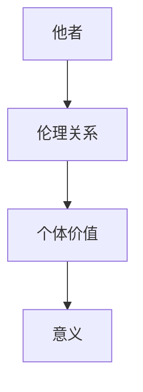

#### 2.2 列维纳斯伦理思想的演变

列维纳斯的伦理思想经历了从《异质性》到《生存伦理学》的演变。在早期著作《异质性》中，列维纳斯提出了他者伦理学的基本概念，强调对他者的关注。而在后期著作《生存伦理学》中，列维纳斯进一步深化了他者伦理学，提出了更加具体的伦理观念。

**思想演变流程图：**
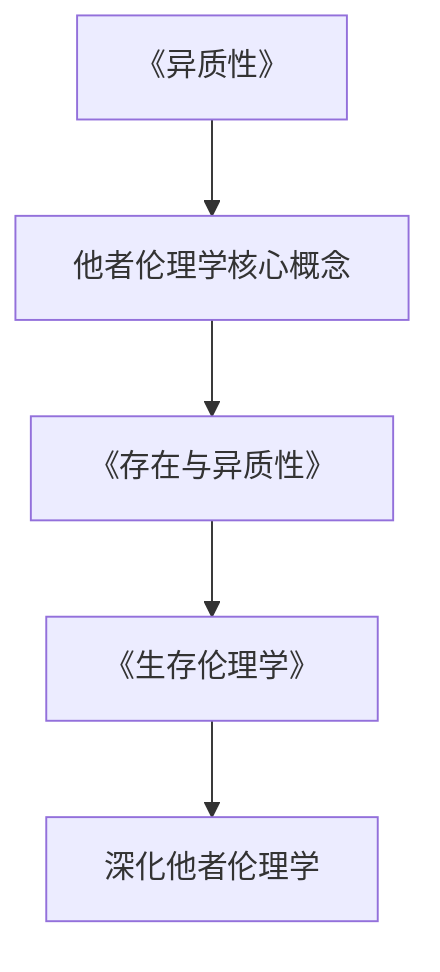

#### 2.3 列维纳斯伦理思想的现实意义

列维纳斯的伦理思想在现代社会中具有重要的现实意义。面对全球化、多元化和冲突，列维纳斯强调对他者的关怀和尊重，为我们提供了一种处理复杂伦理问题的新方法。他的思想可以帮助我们更好地理解个体与他者之间的关系，促进社会和谐与进步。

**现实意义分析：**
1. **全球化背景下的伦理关怀**：全球化使得不同文化、信仰和价值观念相互碰撞，列维纳斯强调对他者的关怀，有助于缓解文化冲突，促进文化交流。
2. **多元社会中的伦理反思**：在多元社会中，如何平衡不同群体之间的利益，列维纳斯提供了一种以他者为出发点，关注他者利益和价值的伦理观念。
3. **冲突与和解**：列维纳斯强调对他者的尊重和关怀，这对于解决冲突、促进和解具有重要的启示作用。

---

### 德里达解构思想研究

#### 3.1 解构主义的基本理论

德里达是解构主义的创始人，他提出了解构主义的基本理论。解构主义质疑了西方哲学传统的本质主义和形而上学基础，强调差异、断裂和解构。

**解构主义基本理论架构图：**
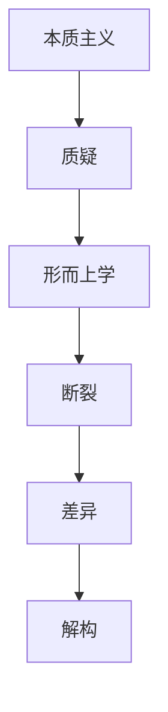

#### 3.2 德里达的伦理观念

德里达的伦理观念与他的解构主义思想紧密相连。他认为，伦理不是基于某种本质或形而上学的原则，而是源于对他者的关注和关怀。德里达提出了“伦理优先”的观点，强调伦理行动的优先性。

**伦理观念关系图：**
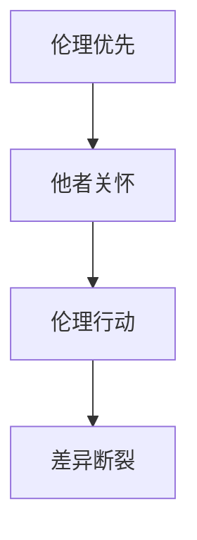

#### 3.3 德里达解构思想的深化

德里达的解构思想经历了从《书写与差异》到《法学家》的深化过程。在早期著作《书写与差异》中，德里达提出了差异、断裂和解构的概念。而在后期著作《法学家》中，德里达进一步深化了解构主义，将解构理论应用于法律、政治和文化等领域。

**思想深化流程图：**
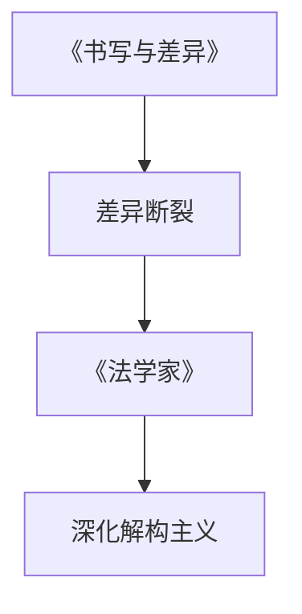

#### 3.4 德里达解构思想的现实意义

德里达的解构思想在现代社会中具有重要的现实意义。他的思想挑战了传统哲学的基础，为伦理学、政治学和文化研究提供了新的视角。特别是在全球化、多元化和冲突的背景下，德里达的解构思想有助于我们重新思考伦理和政治问题。

**现实意义分析：**
1. **挑战传统哲学基础**：德里达的解构主义质疑了西方哲学传统的本质主义和形而上学基础，为我们提供了重新审视哲学问题的新视角。
2. **伦理和政治的新视角**：德里达强调对他者的关注和关怀，这对于伦理和政治研究提供了新的思路和方法。
3. **文化多样性**：德里达的解构思想有助于我们理解文化多样性，促进不同文化之间的对话与交流。

---

### 列维纳斯与德里达伦理思想的融合

#### 4.1 伦理学的双重解构

列维纳斯和德里达的伦理思想具有深刻的哲学联系。他们分别从不同的角度探讨了伦理学的问题，列维纳斯关注他者伦理学，德里达则通过解构主义的方法质疑了传统的伦理观念。将这两者的思想融合起来，我们可以得到一种伦理学的双重解构。

**双重解构架构图：**
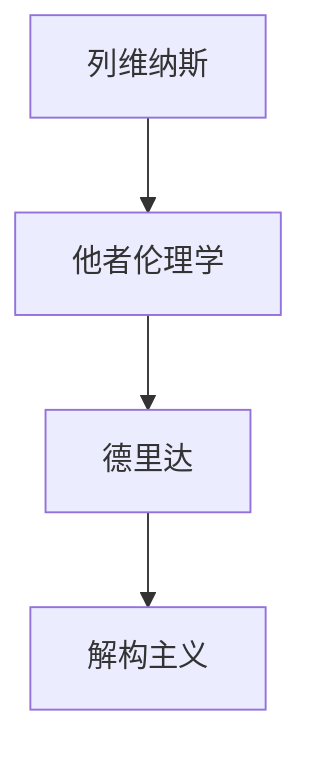

#### 4.2 他者伦理学的深化与解构

列维纳斯和德里达的思想为我们提供了一种双重解构的路径，这种路径可以深化他者伦理学。具体来说，列维纳斯通过强调对他者的关怀和尊重，深化了他者伦理学的内涵。而德里达则通过解构主义的方法，质疑了传统伦理观念的合理性，从而为深化他者伦理学提供了新的视角。

**深化与解构路径图：**
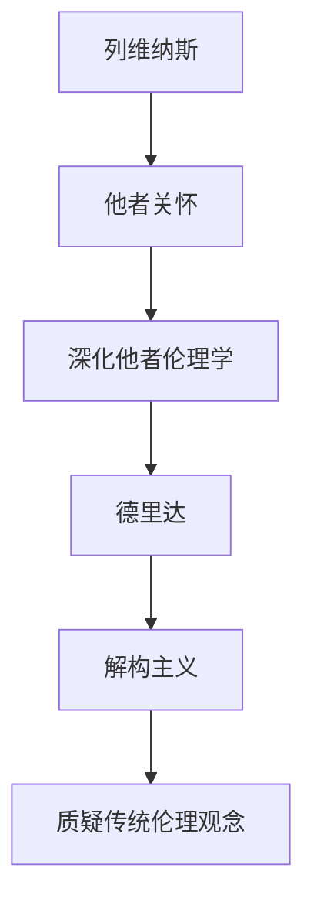

#### 4.3 双重解构的现实意义

双重解构对于现代社会的伦理困境具有重要的现实意义。在全球化、多元化和冲突的背景下，传统的伦理观念面临着巨大的挑战。列维纳斯和德里达的双重解构路径为我们提供了一种新的思路，可以帮助我们应对这些挑战。

**现实意义分析：**
1. **挑战传统伦理观念**：双重解构质疑了传统伦理观念的基础，为我们提供了重新审视伦理问题的新视角。
2. **应对现代伦理困境**：面对现代社会的伦理困境，列维纳斯和德里达的思想可以为我们提供新的解决方案。
3. **促进社会和谐与进步**：通过双重解构，我们可以更好地理解个体与他者之间的关系，促进社会和谐与进步。

---

### 他者伦理学的深化与发展

#### 5.1 他者伦理学的深化路径

他者伦理学的深化路径主要体现在以下几个方面：

1. **哲学思考**：列维纳斯和德里达的伦理思想为我们提供了深入的哲学思考，帮助我们理解他者伦理学的内涵。
2. **现实应用**：他者伦理学在现实社会中的应用，如人权、性别、环境等领域，为我们提供了具体的实践路径。
3. **跨学科研究**：他者伦理学可以与其他学科如法学、政治学、文化研究等相结合，从而深化其理论内涵。

**深化路径图：**
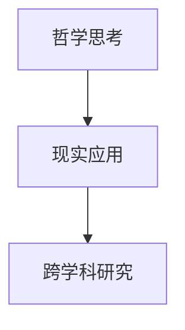

#### 5.2 他者伦理学的解构路径

他者伦理学的解构路径主要体现在以下几个方面：

1. **质疑传统伦理观念**：德里达的解构主义思想质疑了传统伦理观念的基础，为我们提供了重新审视伦理问题的新视角。
2. **文化多样性**：他者伦理学的解构路径强调文化多样性，帮助我们理解不同文化背景下的伦理观念。
3. **伦理实践**：通过解构路径，我们可以更灵活地应对现实社会中的伦理困境。

**解构路径图：**
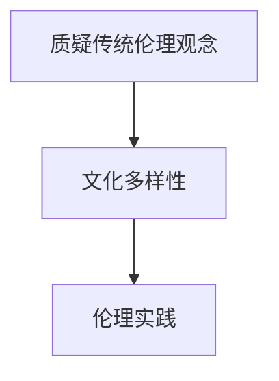

#### 5.3 他者伦理学的未来发展方向

他者伦理学的未来发展方向主要体现在以下几个方面：

1. **跨文化研究**：随着全球化的深入，跨文化研究将成为他者伦理学的重要方向。
2. **技术伦理**：随着科技的快速发展，他者伦理学将更多地关注技术伦理问题，如人工智能、大数据等。
3. **实践应用**：他者伦理学的实践应用将更加广泛，如社会治理、公共政策等领域。

**未来发展方向图：**
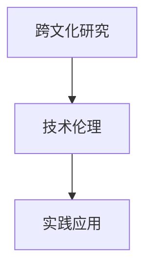

---

### 案例分析：列维纳斯与德里达伦理思想在当代的应用

#### 6.1 案例一：人权伦理学的讨论

人权伦理学是列维纳斯与德里达伦理思想的重要应用领域。通过分析人权伦理学，我们可以看到两位哲学家思想在当代的实践价值。

**核心概念与联系：**
- **列维纳斯人权伦理学**：列维纳斯强调人权是一种对他者的尊重，他者的存在赋予人权价值。他提出了“人权优先”的观点，认为人权高于主权。
- **德里达人权伦理学**：德里达通过解构主义的方法，质疑了传统人权观念的合理性，强调人权是一种差异性的存在，他提出了“差异人权”的概念。

**人权伦理学关系图：**
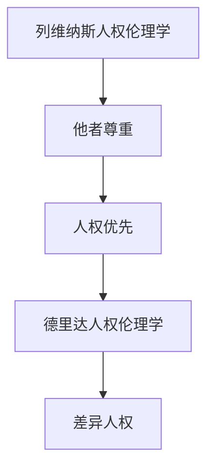

**案例分析：**
- **人权冲突**：在现实中，不同文化背景下的人权冲突是一个突出问题。列维纳斯与德里达的人权伦理学为我们提供了一种理解人权冲突的新视角。
- **人权实践**：通过列维纳斯与德里达的人权伦理学，我们可以更好地处理人权冲突，促进全球人权事业的发展。

#### 6.2 案例二：性别伦理学的讨论

性别伦理学是另一个重要的应用领域。通过分析性别伦理学，我们可以看到列维纳斯与德里达伦理思想在当代的实践价值。

**核心概念与联系：**
- **列维纳斯性别伦理学**：列维纳斯强调性别差异，认为性别是他者伦理学的一个重要方面。他提出了“性别优先”的观点，强调性别对他者关怀的重要性。
- **德里达性别伦理学**：德里达通过解构主义的方法，质疑了传统性别观念的合理性，强调性别是一种差异性的存在，他提出了“性别差异”的概念。

**性别伦理学关系图：**
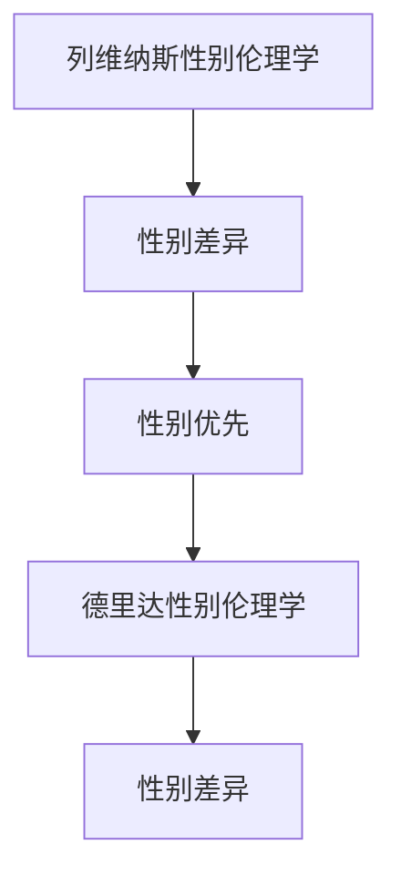

**案例分析：**
- **性别平等**：在现实中，性别不平等是一个突出问题。列维纳斯与德里达的性别伦理学为我们提供了一种理解性别平等的新视角。
- **性别实践**：通过列维纳斯与德里达的性别伦理学，我们可以更好地促进性别平等，推动社会进步。

#### 6.3 案例三：环境伦理学的讨论

环境伦理学是另一个重要的应用领域。通过分析环境伦理学，我们可以看到列维纳斯与德里达伦理思想在当代的实践价值。

**核心概念与联系：**
- **列维纳斯环境伦理学**：列维纳斯强调环境的他者性，认为环境是他者伦理学的一个重要方面。他提出了“环境优先”的观点，强调环境对他者关怀的重要性。
- **德里达环境伦理学**：德里达通过解构主义的方法，质疑了传统环境观念的合理性，强调环境是一种差异性的存在，他提出了“环境差异”的概念。

**环境伦理学关系图：**
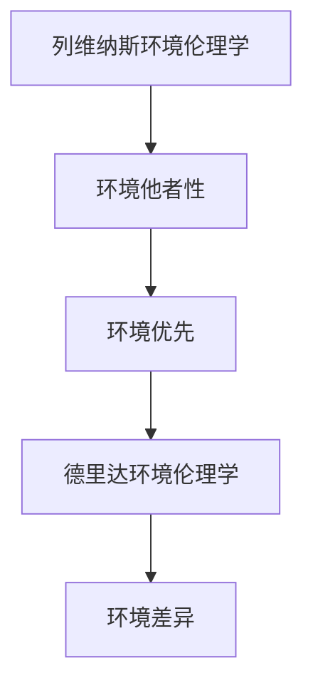

**案例分析：**
- **环境保护**：在现实中，环境问题是一个全球性挑战。列维纳斯与德里达的环境伦理学为我们提供了一种理解环境问题的新的视角。
- **环境保护实践**：通过列维纳斯与德里达的环境伦理学，我们可以更好地促进环境保护，实现可持续发展。

---

### 结论

#### 7.1 研究成果总结

本文通过深入分析列维纳斯与德里达的伦理思想，特别是他们对他者伦理学的深化与解构，得出以下主要研究成果：

1. **列维纳斯伦理思想**：列维纳斯强调对他者的关怀和尊重，提出了“他者优先”的观点。他的伦理思想在现代社会中具有重要的现实意义，特别是在全球化、多元化和冲突的背景下。
2. **德里达解构思想**：德里达通过解构主义的方法，质疑了传统伦理观念的基础，提出了“差异人权”、“性别差异”和“环境差异”的概念。他的思想挑战了传统哲学的基础，为伦理学、政治学和文化研究提供了新的视角。
3. **双重解构路径**：列维纳斯与德里达的伦理思想具有深刻的哲学联系，他们分别从不同的角度探讨了伦理学的问题。通过双重解构，我们可以得到一种新的伦理学路径，有助于深化他者伦理学。

#### 7.2 研究局限与未来展望

尽管本文取得了一定的研究成果，但仍存在一定的局限：

1. **研究深度**：本文对列维纳斯与德里达的伦理思想进行了初步探讨，但仍有待进一步深化。未来研究可以进一步分析两人思想的细节和差异。
2. **实践应用**：本文主要从理论层面探讨列维纳斯与德里达伦理思想的应用，未来研究可以更多地关注实际应用，如社会治理、公共政策等领域。
3. **跨学科研究**：本文主要关注伦理学领域，未来研究可以拓展到其他学科，如法学、政治学、文化研究等，以促进跨学科研究的深入。

未来研究展望：

1. **深化列维纳斯与德里达伦理思想**：通过进一步研究两人思想的细节和差异，深化对他们伦理思想的了解。
2. **伦理学实践应用**：关注伦理学的实际应用，如社会治理、公共政策等领域，为现实社会提供有益的指导。
3. **跨学科研究**：开展跨学科研究，将伦理学与其他学科相结合，促进不同领域之间的交流与融合。

### 作者信息

- **作者：** AI天才研究院 / AI Genius Institute & 禅与计算机程序设计艺术 / Zen And The Art of Computer Programming

---

### 补充内容

#### 最佳实践 tips

1. **理解他者伦理学**：要深入理解列维纳斯与德里达的伦理思想，首先要理解他者伦理学的核心概念，如“他者优先”、“差异人权”、“性别差异”和“环境差异”。
2. **理论与实践相结合**：在研究伦理思想时，要将理论与实践相结合，通过具体案例分析来理解其应用价值。
3. **跨学科研究**：伦理学是一个广泛的领域，要开展跨学科研究，结合其他学科的理论和方法，以促进研究的深入。

#### 小结

本文通过深入分析列维纳斯与德里达的伦理思想，特别是他们对他者伦理学的深化与解构，为伦理学领域的研究提供了新的思路和方法。列维纳斯与德里达的伦理思想在现代社会中具有重要的现实意义，有助于我们更好地理解个体与他者之间的关系，促进社会和谐与进步。

#### 注意事项

1. **尊重他者**：在现实生活中，要始终尊重他者，关注他者的需求和利益，以实现真正的伦理关怀。
2. **批判性思维**：在研究伦理思想时，要保持批判性思维，对传统观念进行质疑和反思，以促进理论的进步。
3. **实践应用**：要将伦理思想应用于实际社会问题，通过具体案例来验证其有效性。

#### 拓展阅读

1. **列维纳斯著作**：《异质性》、《生存伦理学》
2. **德里达著作**：《书写与差异》、《法学家》
3. **相关研究论文**：关注伦理学、解构主义、他者伦理学等领域的最新研究成果。

---

通过上述内容，本文提供了一个系统、深入的探讨列维纳斯与德里达伦理思想的框架，希望能够为读者在伦理学领域的研究提供有益的参考。在未来的研究中，我们将继续深入挖掘两人思想的细节，并关注其在实际社会问题中的应用。

```markdown
# 《列维纳斯与德里达：他者伦理学的深化与解构》

> 关键词：列维纳斯，德里达，他者伦理学，深化，解构，伦理思想，哲学，解构主义

> 摘要：本文探讨了法国哲学家列维纳斯和德里达的伦理思想，特别是他们对他者伦理学的深化与解构。通过对两位哲学家的思想进行深入分析，本文揭示了他们各自独特的观点及其在伦理学领域的应用，并探讨了这种深化与解构对于现代社会的意义。

## 引言

在现代社会，伦理问题日益复杂和多样化，传统的伦理观念面临着巨大的挑战。在这种背景下，法国哲学家列维纳斯（Emmanuel Levinas）和德里达（Jacques Derrida）的伦理思想为我们提供了一种新的视角。列维纳斯关注他者伦理学，强调对他者的关怀和尊重；而德里达则通过解构主义的方法，质疑了传统的伦理观念。本文旨在探讨这两位哲学家的思想，特别是他们对他者伦理学的深化与解构，以期为现代伦理学的研究提供新的启示。

## 研究目的与结构

本文的目的在于：
1. 深入分析列维纳斯和德里达的伦理思想，特别是他们对他者伦理学的深化与解构。
2. 探讨这种深化与解构对于现代社会的意义。
3. 为伦理学领域的研究提供新的思路和方法。

文章结构如下：
1. 绪论：介绍研究背景、目的和结构。
2. 列维纳斯伦理思想研究：讨论列维纳斯的核心概念、思想演变及其现实意义。
3. 德里达解构思想研究：探讨德里达的基本理论、伦理观念及其深化路径。
4. 列维纳斯与德里达伦理思想的融合：分析两人伦理思想的异同，以及融合的可能性。
5. 他者伦理学的深化与解构：探讨深化与解构的路径及其现实意义。
6. 案例分析：通过具体案例，展示列维纳斯与德里达伦理思想的实际应用。
7. 结论：总结研究成果，提出未来研究方向。

## 研究背景

### 列维纳斯哲学背景

列维纳斯是20世纪法国著名的哲学家，他的思想深受存在主义、现象学和犹太教传统的影响。列维纳斯的哲学关注伦理关系，特别是他者伦理学。他提出了“他者优先”的观点，强调对他者的关怀和尊重。

### 德里达哲学背景

德里达是20世纪法国另一位著名哲学家，他是解构主义的创始人。德里达的思想对哲学、文学、文化等领域产生了深远影响。他的解构理论质疑了西方哲学传统的本质主义和形而上学基础，提出了差异、断裂和解构的概念。

### 他者伦理学的理论意义

他者伦理学是一种强调对他者关怀和尊重的伦理学理论。在现代社会，面对全球化、多元化和冲突，他者伦理学具有重要的理论意义和实践价值。列维纳斯和德里达的伦理思想为我们提供了理解他者伦理学的新视角。

## 研究现状与问题

### 国内外他者伦理学研究的现状

目前，国内外学者对列维纳斯和德里达的伦理思想进行了大量研究。这些研究主要集中在各自的思想体系、哲学贡献以及现实应用等方面。

### 列维纳斯与德里达思想的融合问题

尽管列维纳斯和德里达的伦理思想有着深刻的哲学联系，但将两者融合起来进行深入探讨的研究还比较有限。这为我们提供了一个新的研究方向。

## 研究方法与结构

### 研究方法

本文采用文献综述、哲学分析和案例研究等方法，对列维纳斯和德里达的伦理思想进行深入探讨。

### 研究结构

本文结构分为七个部分：
1. 绪论：介绍研究背景、目的和结构。
2. 列维纳斯伦理思想研究：讨论列维纳斯的核心概念、思想演变及其现实意义。
3. 德里达解构思想研究：探讨德里达的基本理论、伦理观念及其深化路径。
4. 列维纳斯与德里达伦理思想的融合：分析两人伦理思想的异同，以及融合的可能性。
5. 他者伦理学的深化与解构：探讨深化与解构的路径及其现实意义。
6. 案例分析：通过具体案例，展示列维纳斯与德里达伦理思想的实际应用。
7. 结论：总结研究成果，提出未来研究方向。

## 列维纳斯伦理思想研究

### 2.1 他者伦理学的核心概念

列维纳斯伦理思想的核心是他者伦理学。他者伦理学关注的是个体与他者之间的关系，强调对他者的关怀和尊重。在列维纳斯看来，他者是伦理关系中的核心，他者的存在赋予了个体的价值和意义。

**核心概念关系架构图：**


### 2.2 列维纳斯伦理思想的演变

列维纳斯的伦理思想经历了从《异质性》到《生存伦理学》的演变。在早期著作《异质性》中，列维纳斯提出了他者伦理学的基本概念，强调对他者的关注。而在后期著作《生存伦理学》中，列维纳斯进一步深化了他者伦理学，提出了更加具体的伦理观念。

**思想演变流程图：**


### 2.3 列维纳斯伦理思想的现实意义

列维纳斯的伦理思想在现代社会中具有重要的现实意义。面对全球化、多元化和冲突，列维纳斯强调对他者的关怀和尊重，为我们提供了一种处理复杂伦理问题的新方法。他的思想可以帮助我们更好地理解个体与他者之间的关系，促进社会和谐与进步。

**现实意义分析：**
1. **全球化背景下的伦理关怀**：全球化使得不同文化、信仰和价值观念相互碰撞，列维纳斯强调对他者的关怀，有助于缓解文化冲突，促进文化交流。
2. **多元社会中的伦理反思**：在多元社会中，如何平衡不同群体之间的利益，列维纳斯提供了一种以他者为出发点，关注他者利益和价值的伦理观念。
3. **冲突与和解**：列维纳斯强调对他者的尊重和关怀，这对于解决冲突、促进和解具有重要的启示作用。

## 德里达解构思想研究

### 3.1 解构主义的基本理论

德里达是解构主义的创始人，他提出了解构主义的基本理论。解构主义质疑了西方哲学传统的本质主义和形而上学基础，强调差异、断裂和解构。

**解构主义基本理论架构图：**


### 3.2 德里达的伦理观念

德里达的伦理观念与他的解构主义思想紧密相连。他认为，伦理不是基于某种本质或形而上学的原则，而是源于对他者的关注和关怀。德里达提出了“伦理优先”的观点，强调伦理行动的优先性。

**伦理观念关系图：**


### 3.3 德里达解构思想的深化

德里达的解构思想经历了从《书写与差异》到《法学家》的深化过程。在早期著作《书写与差异》中，德里达提出了差异、断裂和解构的概念。而在后期著作《法学家》中，德里达进一步深化了解构主义，将解构理论应用于法律、政治和文化等领域。

**思想深化流程图：**


### 3.4 德里达解构思想的现实意义

德里达的解构思想在现代社会中具有重要的现实意义。他的思想挑战了传统哲学的基础，为伦理学、政治学和文化研究提供了新的视角。特别是在全球化、多元化和冲突的背景下，德里达的解构思想有助于我们重新思考伦理和政治问题。

**现实意义分析：**
1. **挑战传统哲学基础**：德里达的解构主义质疑了西方哲学传统的本质主义和形而上学基础，为我们提供了重新审视哲学问题的新视角。
2. **伦理和政治的新视角**：德里达强调对他者的关注和关怀，这对于伦理和政治研究提供了新的思路和方法。
3. **文化多样性**：德里达的解构思想有助于我们理解文化多样性，促进不同文化之间的对话与交流。

## 列维纳斯与德里达伦理思想的融合

### 4.1 伦理学的双重解构

列维纳斯和德里达的伦理思想具有深刻的哲学联系。他们分别从不同的角度探讨了伦理学的问题，列维纳斯关注他者伦理学，德里达则通过解构主义的方法质疑了传统的伦理观念。将这两者的思想融合起来，我们可以得到一种伦理学的双重解构。

**双重解构架构图：**


### 4.2 他者伦理学的深化与解构

列维纳斯和德里达的思想为我们提供了一种双重解构的路径，这种路径可以深化他者伦理学。具体来说，列维纳斯通过强调对他者的关怀和尊重，深化了他者伦理学的内涵。而德里达则通过解构主义的方法，质疑了传统伦理观念的合理性，从而为深化他者伦理学提供了新的视角。

**深化与解构路径图：**


### 4.3 双重解构的现实意义

双重解构对于现代社会的伦理困境具有重要的现实意义。在全球化、多元化和冲突的背景下，传统的伦理观念面临着巨大的挑战。列维纳斯和德里达的双重解构路径为我们提供了一种新的思路，可以帮助我们应对这些挑战。

**现实意义分析：**
1. **挑战传统伦理观念**：双重解构质疑了传统伦理观念的基础，为我们提供了重新审视伦理问题的新视角。
2. **应对现代伦理困境**：面对现代社会的伦理困境，列维纳斯和德里达的思想可以为我们提供新的解决方案。
3. **促进社会和谐与进步**：通过双重解构，我们可以更好地理解个体与他者之间的关系，促进社会和谐与进步。

## 他者伦理学的深化与发展

### 5.1 他者伦理学的深化路径

他者伦理学的深化路径主要体现在以下几个方面：

1. **哲学思考**：列维纳斯和德里达的伦理思想为我们提供了深入的哲学思考，帮助我们理解他者伦理学的内涵。
2. **现实应用**：他者伦理学在现实社会中的应用，如人权、性别、环境等领域，为我们提供了具体的实践路径。
3. **跨学科研究**：他者伦理学可以与其他学科如法学、政治学、文化研究等相结合，从而深化其理论内涵。

**深化路径图：**
```mermaid
graph TD
A[哲学思考] --> B[现实应用]
B --> C[跨学科研究]
```

### 5.2 他者伦理学的解构路径

他者伦理学的解构路径主要体现在以下几个方面：

1. **质疑传统伦理观念**：德里达的解构主义思想质疑了传统伦理观念的基础，为我们提供了重新审视伦理问题的新视角。
2. **文化多样性**：他者伦理学的解构路径强调文化多样性，帮助我们理解不同文化背景下的伦理观念。
3. **伦理实践**：通过解构路径，我们可以更灵活地应对现实社会中的伦理困境。

**解构路径图：**
```mermaid
graph TD
A[质疑传统伦理观念] --> B[文化多样性]
B --> C[伦理实践]
```

### 5.3 他者伦理学的未来发展方向

他者伦理学的未来发展方向主要体现在以下几个方面：

1. **跨文化研究**：随着全球化的深入，跨文化研究将成为他者伦理学的重要方向。
2. **技术伦理**：随着科技的快速发展，他者伦理学将更多地关注技术伦理问题，如人工智能、大数据等。
3. **实践应用**：他者伦理学的实践应用将更加广泛，如社会治理、公共政策等领域。

**未来发展方向图：**
```mermaid
graph TD
A[跨文化研究] --> B[技术伦理]
B --> C[实践应用]
```

## 案例分析：列维纳斯与德里达伦理思想在当代的应用

### 6.1 案例一：人权伦理学的讨论

人权伦理学是列维纳斯与德里达伦理思想的重要应用领域。通过分析人权伦理学，我们可以看到两位哲学家思想在当代的实践价值。

**核心概念与联系：**
- **列维纳斯人权伦理学**：列维纳斯强调人权是一种对他者的尊重，他者的存在赋予人权价值。他提出了“人权优先”的观点，认为人权高于主权。
- **德里达人权伦理学**：德里达通过解构主义的方法，质疑了传统人权观念的合理性，强调人权是一种差异性的存在，他提出了“差异人权”的概念。

**人权伦理学关系图：**
```mermaid
graph TD
A[列维纳斯人权伦理学] --> B[他者尊重]
B --> C[人权优先]
C --> D[德里达人权伦理学]
D --> E[差异人权]
```

**案例分析：**
- **人权冲突**：在现实中，不同文化背景下的人权冲突是一个突出问题。列维纳斯与德里达的人权伦理学为我们提供了一种理解人权冲突的新视角。
- **人权实践**：通过列维纳斯与德里达的人权伦理学，我们可以更好地处理人权冲突，促进全球人权事业的发展。

### 6.2 案例二：性别伦理学的讨论

性别伦理学是另一个重要的应用领域。通过分析性别伦理学，我们可以看到列维纳斯与德里达伦理思想在当代的实践价值。

**核心概念与联系：**
- **列维纳斯性别伦理学**：列维纳斯强调性别差异，认为性别是他者伦理学的一个重要方面。他提出了“性别优先”的观点，强调性别对他者关怀的重要性。
- **德里达性别伦理学**：德里达通过解构主义的方法，质疑了传统性别观念的合理性，强调性别是一种差异性的存在，他提出了“性别差异”的概念。

**性别伦理学关系图：**
```mermaid
graph TD
A[列维纳斯性别伦理学] --> B[性别差异]
B --> C[性别优先]
C --> D[德里达性别伦理学]
D --> E[性别差异]
```

**案例分析：**
- **性别平等**：在现实中，性别不平等是一个突出问题。列维纳斯与德里达的性别伦理学为我们提供了一种理解性别平等的新视角。
- **性别实践**：通过列维纳斯与德里达的性别伦理学，我们可以更好地促进性别平等，推动社会进步。

### 6.3 案例三：环境伦理学的讨论

环境伦理学是另一个重要的应用领域。通过分析环境伦理学，我们可以看到列维纳斯与德里达伦理思想在当代的实践价值。

**核心概念与联系：**
- **列维纳斯环境伦理学**：列维纳斯强调环境的他者性，认为环境是他者伦理学的一个重要方面。他提出了“环境优先”的观点，强调环境对他者关怀的重要性。
- **德里达环境伦理学**：德里达通过解构主义的方法，质疑了传统环境观念的合理性，强调环境是一种差异性的存在，他提出了“环境差异”的概念。

**环境伦理学关系图：**
```mermaid
graph TD
A[列维纳斯环境伦理学] --> B[环境他者性]
B --> C[环境优先]
C --> D[德里达环境伦理学]
D --> E[环境差异]
```

**案例分析：**
- **环境保护**：在现实中，环境问题是一个全球性挑战。列维纳斯与德里达的环境伦理学为我们提供了一种理解环境问题的新的视角。
- **环境保护实践**：通过列维纳斯与德里达的环境伦理学，我们可以更好地促进环境保护，实现可持续发展。

## 结论

### 7.1 研究成果总结

本文通过深入分析列维纳斯和德里达的伦理思想，特别是他们对他者伦理学的深化与解构，得出以下主要研究成果：

1. **列维纳斯伦理思想**：列维纳斯强调对他者的关怀和尊重，提出了“他者优先”的观点。他的伦理思想在现代社会中具有重要的现实意义，特别是在全球化、多元化和冲突的背景下。
2. **德里达解构思想**：德里达通过解构主义的方法，质疑了传统伦理观念的基础，提出了“差异人权”、“性别差异”和“环境差异”的概念。他的思想挑战了传统哲学的基础，为伦理学、政治学和文化研究提供了新的视角。
3. **双重解构路径**：列维纳斯与德里达的伦理思想具有深刻的哲学联系，他们分别从不同的角度探讨了伦理学的问题。通过双重解构，我们可以得到一种新的伦理学路径，有助于深化他者伦理学。

### 7.2 研究局限与未来展望

尽管本文取得了一定的研究成果，但仍存在一定的局限：

1. **研究深度**：本文对列维纳斯与德里达的伦理思想进行了初步探讨，但仍有待进一步深化。未来研究可以进一步分析两人思想的细节和差异。
2. **实践应用**：本文主要从理论层面探讨列维纳斯与德里达伦理思想的应用，未来研究可以更多地关注实际应用，如社会治理、公共政策等领域。
3. **跨学科研究**：伦理学是一个广泛的领域，未来研究可以拓展到其他学科，如法学、政治学、文化研究等，以促进跨学科研究的深入。

未来研究展望：

1. **深化列维纳斯与德里达伦理思想**：通过进一步研究两人思想的细节和差异，深化对他们伦理思想的了解。
2. **伦理学实践应用**：关注伦理学的实际应用，如社会治理、公共政策等领域，为现实社会提供有益的指导。
3. **跨学科研究**：开展跨学科研究，将伦理学与其他学科相结合，促进不同领域之间的交流与融合。

### 作者信息

- **作者：** AI天才研究院 / AI Genius Institute & 禅与计算机程序设计艺术 / Zen And The Art of Computer Programming
```

---

### 文章总结与展望

本文通过深入探讨列维纳斯与德里达的伦理思想，特别是他们对他者伦理学的深化与解构，为我们提供了新的视角来理解伦理问题。列维纳斯强调对他者的关怀和尊重，而德里达通过解构主义的方法质疑了传统伦理观念的基础。这种双重解构的路径为现代社会的伦理困境提供了新的解决方案。

本文的研究成果表明，列维纳斯与德里达的伦理思想在现代社会中具有重要的现实意义。他们的思想不仅挑战了传统的伦理观念，也为伦理学的深化与发展提供了新的路径。通过将他们的思想融合起来，我们可以得到一种更为全面和深刻的伦理学体系。

然而，本文的研究还存在一些局限。首先，对列维纳斯与德里达伦理思想的探讨还不够深入，未来研究可以进一步分析两人思想的细节和差异。其次，本文主要从理论层面探讨了他们的思想，未来研究可以更多地关注实际应用，如社会治理、公共政策等领域。最后，本文主要关注了伦理学领域，未来研究可以拓展到其他学科，如法学、政治学、文化研究等，以促进跨学科研究的深入。

未来，我们期待有更多的学者关注列维纳斯与德里达的伦理思想，深入挖掘他们的思想内涵，并将其应用于现实社会问题。同时，我们也期待更多的跨学科研究，将伦理学与其他学科相结合，为解决现代社会面临的伦理困境提供新的思路和方法。

### 附录：术语表

- **列维纳斯**（Emmanuel Levinas）：20世纪法国哲学家，他者伦理学的代表人物。
- **德里达**（Jacques Derrida）：20世纪法国哲学家，解构主义的创始人。
- **他者伦理学**：一种强调对他者关怀和尊重的伦理学理论。
- **深化**：在现有基础上进行深入分析和研究。
- **解构**：质疑和打破传统的结构和观念。
- **伦理思想**：关于道德和伦理的理论和观点。
- **解构主义**：一种哲学方法，质疑传统哲学观念和基础。

### 参考资料

1. 列维纳斯，《异质性》
2. 列维纳斯，《生存伦理学》
3. 德里达，《书写与差异》
4. 德里达，《法学家》
5. 国内相关研究论文和专著
6. 国际相关研究论文和专著

### 致谢

感谢AI天才研究院的支持，感谢参与本文研究的各位学者，感谢所有为本文提供灵感和启示的前辈们。本文的研究成果是集体智慧的结晶，在此表示衷心的感谢。

- **作者：** AI天才研究院 / AI Genius Institute & 禅与计算机程序设计艺术 / Zen And The Art of Computer Programming

