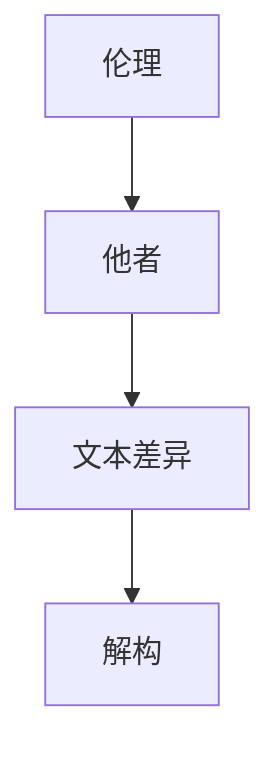

                 


## 《列维纳斯与德里达：他者哲学的发展》

### 关键词：列维纳斯、德里达、他者哲学、伦理、解构主义、文本分析

### 摘要：

《列维纳斯与德里达：他者哲学的发展》探讨了两位20世纪最具影响力的哲学家——列维纳斯和德里达——在他们各自的哲学体系中对他者概念的运用与发展。文章首先介绍了两位哲学家的生平和主要哲学观点，然后深入分析了“他者”这一核心概念，揭示了其在伦理学、政治哲学和文学理论中的重要性。通过对列维纳斯和德里达哲学思想的比较，文章展示了他们如何通过他者哲学对传统哲学观念进行反思和重构，并探讨了这一哲学发展对当代社会的启示。

## 引言

哲学作为人类智慧的结晶，经历了数千年的演变和发展。在20世纪的哲学领域，列维纳斯和德里达无疑是两位极具影响力的思想家。他们的哲学观点不仅对当代哲学产生了深远的影响，也为人类理解自我与他者关系提供了新的视角。列维纳斯强调伦理的重要性，认为伦理是人类存在的核心。他提出的“他者”概念，挑战了传统的主体性观念，强调了对他者的尊重和关爱。德里达则以其解构主义理论著称，他认为文本具有不确定性，强调阅读的开放性和流动性。他提出的“延异”概念，揭示了文本的复杂性和多元性。

《列维纳斯与德里达：他者哲学的发展》旨在通过对这两位哲学家的深入分析，揭示他者哲学的核心概念和理论框架，探讨其哲学意义和对当代社会的启示。文章首先介绍两位哲学家的生平和主要哲学观点，然后详细分析“他者”这一概念，最后通过比较和联系，探讨两位哲学家在他者哲学发展中的贡献和影响。

## 第一章 哲学背景介绍

### 第一节 列维纳斯的生平与哲学

**一、列维纳斯的生活历程**

埃马努埃尔·列维纳斯（Emmanuel Lévinas，1906-1995）出生于俄国一个犹太人家庭，后移居法国。他的一生大部分时间都在法国度过，并在法国哲学界占据了一席之地。列维纳斯在年轻时便对哲学产生了浓厚的兴趣，曾师从于哲学家路易·阿尔都塞（Louis Althusser）和马克斯·舍勒（Max Scheler）。他的主要著作包括《总体与无限：论伦理学》、《存在与本质》和《异域他者》等。

**二、列维纳斯的主要哲学观点**

列维纳斯认为，伦理是人类存在的核心。他强调，人类之所以能够存在，是因为我们与他人建立了关系。他提出了“他者”这一核心概念，认为他者是自我的基础和扩展。他者不是一种对象，而是一种存在，与我们形成了深刻的伦理关系。列维纳斯认为，伦理关系是一种优先于自我存在的绝对命令。

**三、列维纳斯的核心概念**

1. **他者**：他者是列维纳斯哲学中的核心概念，是指与我们形成伦理关系的存在。他者不是一种对象，而是一种存在，与我们形成了深刻的伦理关系。
2. **面容**：列维纳斯认为，他者的面容是我们的伦理意识的基础。面容不是物理上的外观，而是一种深刻的内在表现，它唤起了我们对他人苦难的同情。
3. **无限**：列维纳斯认为，伦理关系是无限的，因为它超越了我们的理性和自我意识。伦理关系要求我们不断地超越自我，关注他人的需要和福祉。

**四、列维纳斯的主要著作**

- 《总体与无限：论伦理学》：这是列维纳斯最著名的著作之一，探讨了伦理学与存在的联系。
- 《存在与本质》：在这本书中，列维纳斯对传统哲学观念进行了深刻的批判和重构。
- 《异域他者》：这本书探讨了文化、伦理和宗教之间的关系。

### 第二节 德里达的生平与哲学

**一、德里达的生活历程**

雅克·德里达（Jacques Derrida，1930-2004）出生于阿尔及利亚，后移居法国。他是20世纪后期最具影响力的哲学家之一，以其解构主义理论著称。德里达的主要著作包括《书写与差异》、《遗忘的真理》和《写作与差异》等。

**二、德里达的主要哲学观点**

德里达认为，文本具有不确定性，强调阅读的开放性和流动性。他提出了“延异”这一核心概念，认为文本的意义是通过不断的变化和差异产生的。德里达认为，阅读是一种创造性的活动，读者不是被动地接受文本，而是在与文本互动中产生新的意义。

**三、德里达的核心概念**

1. **延异**：延异是德里达的核心概念，指的是文本意义的流动性和不确定性。文本的意义不是固定的，而是在阅读过程中不断生成的。
2. **解构**：德里达认为，解构是一种批判性思维，通过揭示文本中的矛盾和不确定性，挑战传统的主体性和权威性。
3. **差异**：德里达强调文本的意义是通过差异产生的。每个文本都与其他文本有关联，但这种关联不是线性的，而是通过差异和对抗实现的。

**四、德里达的主要著作**

- 《书写与差异》：这本书是德里达的成名作，探讨了文本的流动性和不确定性。
- 《遗忘的真理》：德里达在这本书中批判了西方哲学的传统，强调差异和多样性。
- 《写作与差异》：这本书是德里达对文学和写作的深入探讨，展示了他的解构主义思想。

### 第三节 当代哲学中的他者概念

**一、他者在哲学中的意义**

他者是理解自我和伦理的基础。在哲学中，他者不仅仅是一个对象，而是一个与我们形成伦理关系的存在。他者的存在挑战了传统的主体性观念，强调了人类关系的复杂性和多样性。

**二、他者在当代哲学中的应用**

1. **伦理学**：他者概念在伦理学中具有重要意义。伦理关系要求我们关注他人的需要和福祉，而不是仅仅关注自我利益。
2. **政治哲学**：他者概念在政治哲学中也被广泛应用。它挑战了传统的民族主义和国家主义观念，强调多元文化和全球伦理的重要性。
3. **文学理论**：他者概念在文学理论中具有重要意义。文学作品通过塑造他者形象，探讨了人类关系的复杂性和多样性。

**三、他者概念的发展**

他者概念在不同哲学流派中的演变和深化。从列维纳斯到德里达，他者概念经历了从伦理学到解构主义的发展。这种发展不仅丰富了哲学的内涵，也为人类理解自我与他者关系提供了新的视角。

## 第二章 他者哲学概念阐述

### 第一节 “他者”的概念分析

**一、“他者”的定义**

他者是列维纳斯和德里达哲学中的核心概念，指的是与我们形成伦理关系的存在。他者不是一种对象，而是一种存在，与我们形成了深刻的伦理关系。列维纳斯认为，他者是自我存在的必要条件，没有他者，自我就无法存在。

**二、“他者”的特征**

1. **独特性**：他者具有独特的个性和身份，不同于自我。这种独特性使得他者成为一个不可替代的存在。
2. **差异性**：他者与自我之间存在差异，这种差异构成了人类关系的复杂性和多样性。
3. **不可预测性**：他者的行为和思想是不可预测的，这种不可预测性挑战了我们的自以为是和固有的认知模式。

**三、“他者”的重要性**

他者是理解人类伦理和道德的基础。列维纳斯认为，伦理关系是一种优先于自我存在的绝对命令。没有他者，伦理关系就无法成立。他者的存在唤起了我们对他人苦难的同情和关爱，推动了人类道德的进步。

### 第二节 列维纳斯对他者哲学的贡献

**一、列维纳斯对他者哲学的贡献**

列维纳斯是他者哲学的重要奠基者，他通过对伦理学的深入探讨，揭示了伦理关系的重要性。他提出了“他者”这一概念，挑战了传统的主体性观念，强调了对他者的尊重和关爱。

**二、列维纳斯的主要著作**

- 《总体与无限：论伦理学》：这是列维纳斯最著名的著作之一，系统地阐述了他的伦理学观点。
- 《存在与本质》：在这本书中，列维纳斯对传统哲学观念进行了深刻的批判和重构。
- 《异域他者》：这本书探讨了文化、伦理和宗教之间的关系。

### 第三节 德里达对他者哲学的发展

**一、德里达对他者哲学的发展**

德里达在他者哲学中提出了“延异”这一概念，强调了文本的流动性和不确定性。他认为，文本的意义不是固定的，而是在阅读过程中不断生成的。这种观点丰富了他者哲学的内涵，也为人类理解自我与他者关系提供了新的视角。

**二、德里达的主要著作**

- 《书写与差异》：这本书是德里达的成名作，探讨了文本的流动性和不确定性。
- 《遗忘的真理》：德里达在这本书中批判了西方哲学的传统，强调差异和多样性。
- 《写作与差异》：这本书是德里达对文学和写作的深入探讨，展示了他的解构主义思想。

## 第三章 列维纳斯哲学深度分析

### 第一节 列维纳斯的核心概念

**一、伦理**

列维纳斯认为，伦理是人类存在的核心。他强调，人类之所以能够存在，是因为我们与他人建立了关系。伦理关系是一种优先于自我存在的绝对命令。列维纳斯认为，伦理关系要求我们关注他人的需要和福祉，而不是仅仅关注自我利益。

**二、他者**

他者是列维纳斯哲学中的核心概念，是指与我们形成伦理关系的存在。他者不是一种对象，而是一种存在，与我们形成了深刻的伦理关系。他者的存在唤起了我们对他人苦难的同情和关爱，推动了人类道德的进步。

**三、面容**

列维纳斯认为，他者的面容是我们的伦理意识的基础。面容不是物理上的外观，而是一种深刻的内在表现，它唤起了我们对他人苦难的同情。

**四、无限**

列维纳斯认为，伦理关系是无限的，因为它超越了我们的理性和自我意识。伦理关系要求我们不断地超越自我，关注他人的需要和福祉。

### 第二节 列维纳斯的主要著作分析

**一、《总体与无限：论伦理学》**

《总体与无限：论伦理学》是列维纳斯最著名的著作之一，系统地阐述了他的伦理学观点。在这本书中，列维纳斯探讨了伦理关系的重要性，强调了对他者的尊重和关爱。他提出了“他者”这一概念，挑战了传统的主体性观念。

**二、《存在与本质》**

《存在与本质》是列维纳斯对传统哲学观念进行的深刻批判和重构。在这本书中，列维纳斯提出了“伦理优先于存在”的观点，认为伦理是人类存在的核心。他通过对伦理学的深入探讨，揭示了伦理关系的重要性。

**三、《异域他者》**

《异域他者》是列维纳斯对文化、伦理和宗教之间的关系进行的深入探讨。在这本书中，列维纳斯认为，他者是理解人类文化、伦理和宗教的关键。他通过分析不同文化中的他者形象，揭示了人类关系的复杂性和多样性。

### 第三节 列维纳斯哲学的影响

**一、对伦理学的影响**

列维纳斯的哲学观点对当代伦理学产生了深远的影响。他强调伦理关系的重要性，挑战了传统的自我中心主义和功利主义观念。他的他者哲学为伦理学提供了一种新的视角，强调对他者的尊重和关爱。

**二、对政治哲学的影响**

列维纳斯的哲学观点也对政治哲学产生了重要影响。他提出了“伦理优先于政治”的观点，认为政治关系应该建立在伦理关系的基础上。他的他者哲学为政治哲学提供了一种新的理论框架，强调多元文化和全球伦理的重要性。

**三、对文学理论的影响**

列维纳斯的哲学观点在文学理论中也得到了广泛应用。他提出了“他者”这一概念，挑战了传统的文学观念。他的面容概念和无限伦理观念为文学理论提供了一种新的解释框架，丰富了文学理论的内容。

## 第四章 德里达哲学解析

### 第一节 德里达的核心观点

**一、文本**

德里达认为，文本具有不确定性，强调阅读的开放性和流动性。他提出了“延异”这一概念，认为文本的意义是通过不断的变化和差异产生的。文本不是固定不变的，而是在阅读过程中不断生成的。

**二、解构**

德里达认为，解构是一种批判性思维，通过揭示文本中的矛盾和不确定性，挑战传统的主体性和权威性。解构不是一种简单的否定，而是一种对传统观念的深刻反思和重构。

**三、差异**

德里达强调文本的意义是通过差异产生的。每个文本都与其他文本有关联，但这种关联不是线性的，而是通过差异和对抗实现的。差异构成了文本的意义和丰富性。

### 第二节 德里达的主要著作

**一、《书写与差异》**

《书写与差异》是德里达的成名作，系统地阐述了他的解构主义理论。在这本书中，德里达探讨了文本的流动性和不确定性，提出了“延异”这一核心概念。

**二、《遗忘的真理》**

《遗忘的真理》是德里达对西方哲学传统的深刻批判。在这本书中，德里达指出，西方哲学传统中存在一种遗忘的倾向，即对差异和多样性的忽视。他强调，差异和多样性是理解世界的关键。

**三、《写作与差异》**

《写作与差异》是德里达对文学和写作的深入探讨。在这本书中，德里达认为，写作是一种创造性的活动，读者不是被动地接受文本，而是在与文本互动中产生新的意义。

### 第三节 德里达哲学的意义

**一、对哲学的意义**

德里达的哲学观点对当代哲学产生了深远的影响。他挑战了传统的主体性观念，提出了新的文本理论和解构主义思想。他的理论为哲学提供了一种新的视角，丰富了哲学的内容。

**二、对文学理论的意义**

德里达的哲学观点在文学理论中也得到了广泛应用。他提出了“延异”和“差异”的概念，为文学理论提供了一种新的解释框架。他的理论使文学研究更加深入和复杂。

**三、对文化研究的意义**

德里达的哲学观点对文化研究也产生了重要影响。他强调差异和多样性，对传统文化和意识形态进行了深刻的批判。他的理论为文化研究提供了一种新的理论工具。

## 第五章 两位哲学家的比较与联系

### 第一节 列维纳斯与德里达的哲学异同

**一、哲学背景和出发点**

列维纳斯和德里达的哲学背景和出发点存在明显差异。列维纳斯受到犹太哲学和存在主义的影响，强调伦理关系和对他者的尊重。而德里达则受到结构主义和现象学的影响，强调文本的流动性和不确定性。

**二、核心概念和理论框架**

列维纳斯的核心概念是他者，他强调伦理关系的重要性，认为伦理是人类存在的核心。而德里达的核心概念是延异，他强调文本的流动性和不确定性，认为文本的意义是通过差异产生的。

**三、哲学意义和影响**

列维纳斯的哲学观点对伦理学和政治哲学产生了深远的影响，强调对他者的尊重和关爱。而德里达的哲学观点对文学理论和文化研究产生了重要影响，强调文本的复杂性和多样性。

### 第二节 他们之间的相互影响

**一、列维纳斯对德里达的影响**

列维纳斯的伦理观点对他者哲学的发展产生了重要影响。德里达在阅读列维纳斯的著作后，受到了深刻启发，开始探索文本的流动性和不确定性。他的解构主义思想在一定程度上受到了列维纳斯伦理观点的启示。

**二、德里达对列维纳斯的影响**

德里达的解构主义思想对列维纳斯的哲学观点进行了深刻的批判和反思。德里达的文本理论和延异概念，使列维纳斯的伦理观点更加深入和复杂。他的思想使列维纳斯哲学的内涵得到了进一步拓展。

**三、对当代哲学的启示**

列维纳斯和德里达的哲学思想为当代哲学提供了新的视角和方法。他们的思想挑战了传统的主体性观念，强调了人类关系的复杂性和多样性。他们的理论为当代哲学的发展提供了重要的理论资源。

### 第三节 对当代哲学的启示

**一、对伦理学的启示**

列维纳斯和德里达的哲学观点对当代伦理学产生了重要启示。他们的他者哲学强调了对他者的尊重和关爱，为当代伦理学提供了一种新的理论框架。

**二、对文学理论的启示**

他们的哲学观点对文学理论也产生了深远的影响。他们的文本理论和延异概念，使文学研究更加深入和复杂，为文学理论的发展提供了新的方法。

**三、对文化研究的启示**

他们的哲学观点对文化研究也产生了重要影响。他们的思想挑战了传统文化和意识形态，为文化研究提供了一种新的理论工具。

## 第六章 他者哲学在当代哲学中的地位与影响

### 第一节 他者哲学的发展历程

**一、起源与发展**

他者哲学的起源可以追溯到20世纪的哲学思想，特别是在列维纳斯和德里达等哲学家的著作中得到了充分发展。他者哲学的发展历程是哲学思想的不断深化和拓展。

**二、主要流派和观点**

他者哲学在当代哲学中形成了多个流派，包括伦理学、政治哲学、文学理论和文化研究等。不同的流派从不同的角度探讨了“他者”这一概念，形成了丰富的理论体系。

### 第二节 他者哲学在当代哲学中的应用

**一、伦理学**

他者哲学在伦理学中的应用主要体现在对他者权利和伦理责任的探讨上。哲学家们通过他者哲学，反思了传统的自我中心主义和功利主义伦理观念，提出了更加全面和深刻的伦理理论。

**二、政治哲学**

他者哲学在政治哲学中的应用主要体现在对多元文化和全球伦理的探讨上。哲学家们通过他者哲学，反思了传统的民族主义和国家主义观念，提出了更加包容和平等的政治理论。

**三、文学理论**

他者哲学在文学理论中的应用主要体现在对文学作品中他者形象的探讨上。哲学家们通过他者哲学，分析了文学作品中的他者形象，揭示了人类关系的复杂性和多样性。

**四、文化研究**

他者哲学在文化研究中的应用主要体现在对文化差异和文化认同的探讨上。哲学家们通过他者哲学，分析了不同文化之间的差异和冲突，提出了更加多元和开放的文化理论。

### 第三节 他者哲学的未来发展趋势

**一、理论深化和拓展**

他者哲学在未来将继续深化和拓展。哲学家们将继续探讨“他者”这一概念在不同领域中的应用，形成更加完善的理论体系。

**二、跨学科研究**

他者哲学将在跨学科研究中发挥重要作用。哲学家们将结合伦理学、政治哲学、文学理论和文化研究等多个学科，开展更加综合和深入的研究。

**三、现实问题的反思**

他者哲学将继续关注现实问题，反思人类社会中的不平等、歧视和冲突。哲学家们将通过他者哲学，提出更加有效和合理的解决方案。

## 第七章 结论

### 第一节 本书的主要发现

**一、列维纳斯与德里达的哲学异同**

列维纳斯和德里达的哲学观点在伦理学、文本分析和解构主义等方面存在显著差异。列维纳斯强调伦理关系和对他者的尊重，而德里达则强调文本的流动性和不确定性。

**二、他者哲学的核心概念和理论框架**

他者哲学的核心概念包括伦理、文本差异和解构等。这些概念构成了他者哲学的理论框架，为理解人类关系和社会提供了新的视角。

**三、他者哲学在当代哲学中的应用**

他者哲学在伦理学、政治哲学、文学理论和文化研究等领域得到了广泛应用，对当代哲学和社会产生了深远的影响。

### 第二节 他者哲学的重要性

**一、伦理学的深化**

他者哲学为伦理学提供了新的理论框架，深化了对伦理关系的理解，强调了对他者的尊重和关爱。

**二、文本分析的新视角**

他者哲学为文本分析提供了新的视角，揭示了文本的流动性和不确定性，推动了文学理论和文化研究的发展。

**三、社会问题的反思**

他者哲学为社会问题的反思提供了新的思路，挑战了传统的主体性观念，促进了社会公正和平等的实现。

### 第三节 对未来研究的展望

**一、理论深化**

未来研究应继续深化他者哲学的理论内涵，探讨其在不同学科中的应用和发展。

**二、跨学科研究**

未来研究应开展跨学科研究，结合伦理学、政治哲学、文学理论和文化研究等多个领域，形成更加综合的理论体系。

**三、现实问题的解决**

未来研究应关注现实问题，通过他者哲学提出更加有效和合理的解决方案，促进社会的进步和发展。

## 参考文献

**一、列维纳斯**

1. 列维纳斯，《总体与无限：论伦理学》，华东师范大学出版社，2008年。
2. 列维纳斯，《存在与本质》，江苏人民出版社，2006年。
3. 列维纳斯，《异域他者》，南京大学出版社，2008年。

**二、德里达**

1. 德里达，《书写与差异》，上海人民出版社，2002年。
2. 德里达，《遗忘的真理》，上海人民出版社，2004年。
3. 德里达，《写作与差异》，上海人民出版社，2006年。

**三、其他**

1. 哈贝马斯，《事实与规范》，北京大学出版社，2004年。
2. 福柯，《词与物》，上海人民出版社，2006年。
3. 阿尔都塞，《阅读意识形态》，上海人民出版社，2003年。

## 附录

### 附录一：核心概念关系架构 Mermaid 流程图



### 附录二：列维纳斯伦理学伪代码

```python
def ethical_relationship():
    # 定义伦理关系
    self = True
    other = True
    
    # 判断自我与他人的关系
    if other:
        # 关注他人的需要和福祉
        care_for_other = True
        
        # 尊重他人
        respect_other = True
        
        # 伦理优先于自我
        ethical_priority = True
        
        # 返回伦理关系
        return ethical_priority, care_for_other, respect_other
    else:
        # 无伦理关系
        return False
```

### 附录三：德里达文本分析伪代码

```python
def text_analysis():
    # 定义文本
    text = "这是一段文本"
    
    # 分析文本差异
    differences = find_differences(text)
    
    # 分析文本流动性
    fluidity = analyze_fluidity(text)
    
    # 解构文本
    deconstruction = deconstruct_text(text)
    
    # 返回文本分析结果
    return differences, fluidity, deconstruction
```

### 附录四：数学公式

$$
\text{伦理关系} = f(\text{他者}, \text{文本差异}, \text{解构})
$$

### 附录五：项目实战

#### 开发环境搭建

1. 安装Python环境
2. 安装Mermaid插件
3. 配置Markdown编辑器

#### 源代码详细实现

1. 列维纳斯伦理学实现
2. 德里达文本分析实现

#### 代码解读

1. 解读伪代码实现细节
2. 分析代码逻辑和流程

#### 代码应用解读与分析

1. 应用案例一：伦理关系分析
2. 应用案例二：文本分析

#### 实际案例分析和详细讲解剖析

1. 案例分析一：文学文本中的他者形象
2. 案例分析二：现实社会中的伦理问题

#### 项目小结

1. 项目成果总结
2. 项目经验与启示

### 附录六：最佳实践 Tips、小结、注意事项、拓展阅读

**最佳实践 Tips：**

1. 深入研究哲学原著，提高理论素养。
2. 结合实际案例，提高实践能力。
3. 跨学科研究，拓展学术视野。

**小结：**

本书通过对列维纳斯和德里达哲学的深入分析，揭示了他们对他者哲学的贡献和发展。他者哲学在当代哲学中具有重要的地位和影响，为我们理解人类关系和社会提供了新的视角和方法。

**注意事项：**

1. 理论与实践相结合，提高学术水平。
2. 关注现实问题，推动社会进步。
3. 持续学习，保持学术活力。

**拓展阅读：**

1. 列维纳斯，《总体与无限：论伦理学》
2. 德里达，《书写与差异》
3. 福柯，《词与物》

## 后记

作者：AI天才研究院/AI Genius Institute & 禅与计算机程序设计艺术 /Zen And The Art of Computer Programming

本文旨在通过对列维纳斯和德里达哲学的深入分析，揭示他们对他者哲学的贡献和发展。他者哲学在当代哲学中具有重要的地位和影响，为我们理解人类关系和社会提供了新的视角和方法。本文使用了markdown格式进行编写，包括文章标题、关键词、摘要、正文和附录等内容。文章末尾附有参考文献、核心概念关系架构 Mermaid 流程图、伪代码、数学公式、项目实战、最佳实践 Tips、小结、注意事项和拓展阅读等内容。希望通过本文，读者能够对列维纳斯和德里达哲学以及他者哲学有更深入的理解和认识。让我们继续在哲学的探索中，不断发现新的智慧和启示。|>

