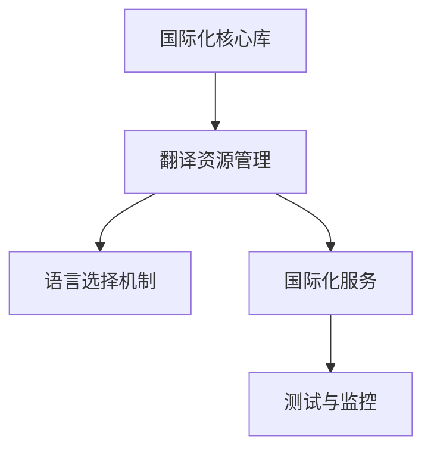
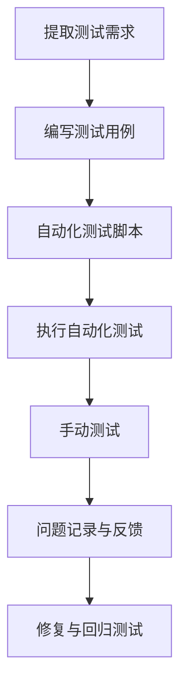

                 

### 文章标题

《前端国际化：多语言支持的最佳实践》

#### 文章关键词

前端、国际化、多语言支持、最佳实践、Web开发、技术框架

#### 文章摘要

本文深入探讨了前端国际化的核心概念和实践，旨在为开发者提供多语言支持的最佳策略。首先，文章介绍了国际化的重要性及其基本概念，接着探讨了前端国际化的技术基础，包括HTML、CSS和JavaScript的使用。随后，文章详细介绍了几种常见的国际化框架，如i18next、vue-i18n、angular-translate和react-intl。文章进一步讨论了国际化在项目中的应用，包括系统架构设计、翻译资源管理、国际化测试和性能优化。此外，文章还分析了常见国际化问题及其解决方案，并提供了实际项目中的国际化实践和工程化建议。最后，文章总结了国际化开发中的最佳实践，为开发者提供了实用的指导。通过本文的阅读，开发者能够全面了解前端国际化的关键技术和最佳实践，提升项目的多语言支持能力。

## 第1章 引言

### 1.1 国际化的重要性

在当今全球化的信息时代，国际化已经成为企业和组织拓展市场、提升品牌影响力的重要战略之一。随着互联网的普及和全球贸易的发展，越来越多的网站和应用程序需要支持多语言，以满足不同地区和文化背景的用户需求。对于前端开发者来说，实现前端国际化不仅仅是技术上的挑战，更是提升用户体验、扩大用户群的重要手段。

首先，国际化对于提升用户体验至关重要。当用户能够使用自己熟悉的语言访问网站或使用应用程序时，他们更容易产生共鸣，从而提高用户满意度和忠诚度。例如，在电子商务平台上，支持多种语言可以帮助跨国卖家更好地与全球消费者沟通，提高销售转化率。

其次，国际化有助于扩大用户群。对于一个面向国际市场的产品，支持多种语言可以显著增加潜在用户数量，从而扩大市场份额。例如，社交媒体平台如Facebook和Twitter通过支持多种语言，吸引了全球数以亿计的用户。

此外，国际化也是企业品牌形象塑造的重要组成部分。一个支持多语言的产品不仅能显示企业的国际化实力，还能表明企业对全球用户的尊重和关注。这种品牌效应有助于企业在全球范围内树立良好的声誉，提升品牌价值。

然而，实现前端国际化并非易事。它不仅需要考虑技术实现，还需要处理文化差异、法律合规性等多方面的问题。因此，理解和掌握前端国际化的核心概念和最佳实践至关重要。

在接下来的章节中，本文将详细探讨前端国际化的基本概念、技术基础、常见框架介绍、项目应用和问题解决方案，旨在为开发者提供全面的指导，帮助他们成功实现前端国际化，提升产品的全球竞争力。

### 1.2 多语言支持的基本概念

多语言支持是指在软件产品或服务中提供多种语言的界面和内容，以适应不同语言环境下的用户需求。其核心概念包括本地化（Localization）、国际化（Internationalization）和全球化（Globalization）。

**本地化**（Localization）是指将软件产品或服务从一种语言环境翻译成另一种语言，并适应当地文化和习惯的过程。本地化不仅仅是翻译文本，还包括调整日期、时间、货币格式、度量衡单位等，以确保软件在目标市场中的可接受性和实用性。例如，一个电子商务网站在本地化过程中需要将产品描述、用户界面和支付选项调整到目标市场的语言和文化。

**国际化**（Internationalization）是指在设计软件产品时，确保其能够适应多种语言和文化环境的能力。国际化关注于软件架构和设计，使得后续的本地化工作更加高效和简便。国际化通常包括以下步骤：提取所有文本内容，使用资源文件管理这些内容，设计可变文本的界面元素，确保文本布局和方向适配不同语言，以及支持国际化日期、时间和货币格式。例如，在开发一个支持多语言的Web应用程序时，国际化会确保所有的文本内容都可以通过资源文件进行替换，而无需修改核心代码。

**全球化**（Globalization）是指为全球市场开发和优化产品和服务的过程。全球化不仅仅涉及语言的本地化，还包括文化、商业习惯、法律法规等多方面的考量。全球化产品的目标是在全球范围内提高产品的适应性和竞争力，而不只是满足特定市场的需求。例如，一个全球化电商平台不仅需要支持多种语言的界面，还需要考虑不同国家和地区的支付方式、物流配送和售后服务。

这三种概念之间有着紧密的联系。国际化是本地化的前提，没有国际化的设计，本地化工作将非常复杂和耗时。而全球化则是国际化和本地化的最终目标，它要求产品在满足本地化需求的同时，还要具备在全球范围内的适应性和竞争力。

在实施多语言支持时，企业通常需要遵循以下步骤：

1. **需求分析**：确定目标市场和国家，分析不同市场的语言和文化需求。
2. **资源提取**：将所有的文本内容从代码中提取出来，存储在资源文件中。
3. **国际化设计**：在设计软件时考虑国际化因素，如文本布局、文本方向、日期和时间格式等。
4. **本地化翻译**：根据目标市场的语言和文化，翻译和调整文本内容。
5. **测试与验证**：确保本地化后的软件在不同语言和文化环境下都能正常运行，并符合用户期望。
6. **持续优化**：在产品上线后，根据用户反馈和市场变化，持续进行本地化和国际化优化。

通过以上步骤，企业可以有效地实现多语言支持，提升产品的用户体验和市场竞争力。

### 1.3 常见国际化问题及解决方案

在实现前端国际化的过程中，开发者会遇到许多常见问题。这些问题不仅影响了用户体验，还可能导致项目延期和成本增加。以下是一些典型的国际化问题及其解决方案：

**1. 翻译不准确**

翻译不准确是国际化中最常见的问题之一。不同的语言和文化之间存在细微的差别，直接翻译可能会导致语义错误或文化冲突。解决方案是：

- **专业翻译服务**：使用专业的翻译服务，特别是对于关键文案和重要功能。
- **翻译记忆库**：利用翻译记忆库技术，提高翻译效率并保持一致性。
- **用户反馈机制**：建立用户反馈机制，收集用户对翻译的反馈，及时进行调整。

**2. 文本长度不一致**

不同语言的文本长度差异较大，这可能导致界面布局混乱，甚至出现文字溢出。解决方案包括：

- **弹性布局**：使用CSS的Flexbox或Grid布局，使文本和界面元素能够动态调整。
- **溢出处理**：使用`overflow`属性或CSS的`text-overflow`属性，处理文本溢出问题。
- **宽度自适应**：为界面元素设置最大宽度，确保文本在超过特定宽度时不会影响布局。

**3. 时间、日期和货币格式不一致**

不同国家和地区对于时间、日期和货币的格式有各自的习惯，直接使用默认格式可能会导致数据难以理解。解决方案如下：

- **本地化库**：使用如Moment.js或date-fns这样的本地化库，根据用户所在的地区自动格式化时间、日期和货币。
- **用户选择**：提供用户选择日期和时间格式的选项，增加用户满意度。
- **严格校验**：在数据提交和展示前，严格校验格式，确保数据的正确性。

**4. 文本方向和排版不一致**

某些语言从左到右（LTR），而另一些语言从右到左（RTL），这直接影响到界面的布局和文本的阅读方向。解决方案如下：

- **CSS属性调整**：使用CSS的`direction`和`unicode-bidi`属性，调整文本的方向。
- **左右对齐调整**：根据文本方向调整左右对齐方式，确保界面元素的正确布局。

**5. 缺乏国际化测试**

在国际化项目中，缺乏全面的测试会导致各种问题。解决方案包括：

- **自动化测试**：使用如Cypress或Selenium等工具，编写自动化测试脚本，检测语言切换和文本显示的正确性。
- **手动测试**：进行手动测试，模拟不同语言环境下的用户操作，确保所有功能正常运行。
- **多环境测试**：在多个设备和浏览器上测试，确保国际化功能在不同平台和设备上的一致性。

通过以上解决方案，开发者可以有效地应对国际化过程中遇到的问题，确保产品的多语言支持质量，提升用户体验和市场竞争力。

### 第2章 前端国际化技术基础

前端国际化的实现依赖于HTML、CSS和JavaScript等多种技术。这些技术在不同方面为国际化提供了支持，使得开发者能够更高效地实现多语言界面。以下是前端国际化技术的基础介绍。

#### 2.1 Web国际化的历史与发展

Web国际化可以追溯到1995年，当时W3C（World Wide Web Consortium，万维网联盟）发布了第一版HTML规范，其中引入了`lang`属性，用于标识HTML文档的语言。这一举措为Web页面标记语言奠定了国际化的基础。

随着时间的推移，Web国际化的技术不断发展和完善。2000年，W3C发布了XML国际化编码标准（XML Internationalization I18N），进一步规范了XML文档的国际化和本地化处理。随后，HTML 4.01和HTML5分别对国际化支持进行了补充和增强，提供了更多的国际化属性和标签。

在CSS方面，CSS2.1和CSS3也逐步引入了支持国际化的属性，如`direction`、`unicode-bidi`和`text-overflow`，这些属性有助于实现不同语言环境的界面布局和文本处理。

JavaScript的国际化和本地化也得到了广泛关注。JavaScript库如Moment.js和i18next提供了丰富的国际化功能，包括日期、时间和货币的格式化，以及文本的国际化替换。

#### 2.2 HTML与国际化

HTML为前端国际化提供了最基本的元素和属性。其中，`lang`属性是标识文档语言的关键属性。例如：

```html
<!DOCTYPE html>
<html lang="zh">
<head>
    <meta charset="UTF-8">
    <title>中文页面</title>
</head>
<body>
    欢迎来到中文网站！
</body>
</html>
```

在这个例子中，`<html lang="zh">`标识了该页面使用的是中文。

此外，HTML5引入了`xml:lang`属性，用于XML文档的语言标识。例如：

```xml
<root xml:lang="en">
    <title>English Page</title>
</root>
```

在HTML中，还可以使用`dir`属性来指定文本的方向。例如：

```html
<p dir="rtl">مرحباً بكم!</p>
```

这里`dir="rtl"`设置了文本从右到左显示，适用于阿拉伯语等从右到左书写的语言。

#### 2.3 CSS与国际化

CSS为前端国际化提供了丰富的样式属性，以适应不同语言的排版和布局需求。以下是几个关键属性：

- `direction`：用于设置文本的书写方向。例如：

  ```css
  [lang|="ar"] {
      direction: rtl;
  }
  ```

  这个规则设置所有阿拉伯语（`ar`）的文本方向为从右到左。

- `unicode-bidi`：用于控制文本的断行和布局。例如：

  ```css
  [dir="rtl"] {
      unicode-bidi: embed;
  }
  ```

  这个规则设置文本在从右到左环境中采用嵌入式双字节文本处理。

- `text-overflow`：用于处理文本溢出问题。例如：

  ```css
  p {
      overflow: hidden;
      white-space: nowrap;
      text-overflow: ellipsis;
  }
  ```

  这个规则设置文本超出容器时显示省略号。

此外，CSS3还引入了`css-variables`，允许开发者定义和重用样式变量，从而简化国际化过程中的样式管理。

#### 2.4 JavaScript与国际化

JavaScript在前端国际化中起到了关键作用，通过处理文本、日期和时间等，使应用程序能够支持多种语言。以下是一些常用的JavaScript国际化和本地化库：

- **Moment.js**：用于处理日期和时间的格式化、解析和操作。例如：

  ```javascript
  moment.locale('zh-cn');
  var now = moment().format('YYYY年MM月DD日');
  console.log(now); // 输出：2023年03月10日
  ```

- **i18next**：是一个流行的国际化JavaScript库，支持多语言文本替换、日期、时间和货币的格式化。例如：

  ```javascript
  import i18next from 'i18next';
  import Backend from 'i18next-http-backend';

  i18next
      .use(Backend)
      .init({
          fallbackLng: 'en',
          lng: 'zh',
          backend: {
              loadPath: '/locales/{{lng}}/{{ns}}.json',
          },
      });
  ```

在这个例子中，i18next初始化了一个国际化实例，并设置默认语言为英语，当前语言为中文。通过HTTP后端加载翻译资源，实现文本的国际化替换。

通过以上技术，前端开发者可以构建出支持多种语言的Web应用程序，提升用户体验并拓展市场。

#### 2.4 JavaScript与国际化

JavaScript在前端国际化中扮演了关键角色，它不仅能够处理文本国际化，还能格式化日期、时间和货币，提供动态的语言切换等高级功能。以下是如何使用JavaScript实现这些国际化的详细步骤和示例：

##### 文本国际化

文本国际化通常涉及从本地化资源文件中加载和替换文本。i18next是一个流行的JavaScript国际化库，可以方便地实现这一功能。

**示例**：

首先，安装i18next及其依赖：

```bash
npm install i18next i18next-http-backend
```

然后，创建一个简单的HTML页面，引入i18next：

```html
<!DOCTYPE html>
<html lang="en">
<head>
    <meta charset="UTF-8">
    <title>Internationalization Example</title>
</head>
<body>
    <h1 id="greeting"></h1>
    <script src="path/to/i18next.js"></script>
    <script>
        import i18next from 'i18next';
        import Backend from 'i18next-http-backend';

        i18next
            .use(Backend)
            .init({
                fallbackLng: 'en',
                lng: 'zh',
                backend: {
                    loadPath: '/locales/{{lng}}/{{ns}}.json',
                },
            }, (err, t) => {
                if (err) {
                    console.error('Error initializing i18next:', err);
                } else {
                    document.getElementById('greeting').innerText = t('greeting');
                }
            });
    </script>
</body>
</html>
```

在上面的代码中，我们通过i18next的use方法引入了HTTP后端，初始化i18next实例，并设置默认语言为英语（`en`），当前语言为中文（`zh`）。当i18next初始化完成后，我们使用`t('greeting')`从本地化资源文件中加载并替换页面上的文本。

**资源文件**（`locales/zh/greetings.json`）：

```json
{
  "greeting": "你好！"
}
```

当用户访问页面时，`greeting`字段会被替换为中文文本“你好！”。

##### 日期和时间国际化

处理日期和时间国际化时，可以使用Moment.js库，它提供了丰富的格式化和本地化功能。

**示例**：

```javascript
import moment from 'moment';

moment.locale('zh-cn');
var now = moment().format('YYYY年MM月DD日 HH:mm:ss');
console.log(now); // 输出：2023年03月10日 14:20:30
```

在这个例子中，我们首先设置Moment.js的本地化语言为中文，然后使用`format`方法将当前时间格式化为中文格式的日期和时间。

##### 货币国际化

货币国际化通常需要根据用户所在地区或选定的货币格式来显示金额。使用i18next，我们可以轻松实现货币格式的国际化。

**示例**：

```javascript
import i18next from 'i18next';
import NumberFormat from 'intl-numberformat';

i18next.init({
    lng: 'en',
    translation: {
        en: {
            currency: {
                style: 'currency',
                currency: 'USD',
            },
        },
        zh: {
            currency: {
                style: 'currency',
                currency: 'CNY',
            },
        },
    },
});

i18next.on('languageChanged', () => {
    var amount = 1000;
    var formattedAmount = i18next.formatCurrency(amount);
    console.log(formattedAmount); // 输出：$1,000 或 ￥1,000
});
```

在这个例子中，我们为英语和中文设置了不同的货币格式。当语言切换事件触发时，`formatCurrency`方法会根据当前语言格式化金额。

##### 动态语言切换

动态语言切换是用户与国际化应用程序互动的关键部分。以下是一个简单的示例，说明如何使用i18next实现动态语言切换：

**示例**：

```html
<!DOCTYPE html>
<html lang="en">
<head>
    <meta charset="UTF-8">
    <title>Language Switcher Example</title>
    <script src="path/to/i18next.js"></script>
</head>
<body>
    <h1 id="greeting"></h1>
    <button id="switchLang">切换到中文</button>
    <script>
        i18next.init({
            fallbackLng: 'en',
            lng: 'en',
            resources: {
                en: {
                    greeting: "Hello!"
                },
                zh: {
                    greeting: "你好！"
                }
            }
        }, (err, t) => {
            if (err) {
                console.error('Error initializing i18next:', err);
            } else {
                document.getElementById('greeting').innerText = t('greeting');
            }
        });

        document.getElementById('switchLang').addEventListener('click', () => {
            i18next.changeLanguage('zh', (err) => {
                if (err) {
                    console.error('Error changing language:', err);
                } else {
                    document.getElementById('greeting').innerText = i18next.t('greeting');
                }
            });
        });
    </script>
</body>
</html>
```

在这个例子中，我们创建了一个简单的HTML页面，包括一个显示问候语的`<h1>`元素和一个用于切换语言的按钮。点击按钮时，会触发i18next的`changeLanguage`方法，将语言切换到中文，并更新页面上的文本。

通过这些示例，我们可以看到JavaScript在前端国际化中发挥了重要作用，不仅简化了文本的替换，还提供了日期、时间和货币格式的国际化处理，以及动态语言切换的功能。这些功能使得开发者能够创建出高度可定制的国际化应用程序，满足不同语言和地区用户的需求。

### 第3章 常见国际化框架介绍

在实现前端国际化时，选择合适的国际化框架至关重要。以下将介绍几种流行的国际化框架：i18next、vue-i18n、angular-translate和react-intl。这些框架提供了丰富的功能，帮助开发者轻松实现多语言支持。

#### 3.1 i18next

i18next是一个功能强大、灵活且易于使用的国际化JavaScript库。它支持多种编程语言，并拥有广泛的社区支持。i18next的关键特性包括：

- **翻译替换**：支持将文本替换为本地化后的文本。
- **多语言切换**：允许用户在应用程序中动态切换语言。
- **资源管理**：通过资源文件管理本地化文本，便于更新和维护。
- **时间、日期和货币格式化**：支持国际化日期、时间和货币格式化。
- **错误处理**：提供错误处理机制，确保应用程序在国际化过程中不会崩溃。

**基本用法**：

首先，安装i18next及其依赖：

```bash
npm install i18next i18next-http-backend
```

然后，初始化i18next：

```javascript
import i18next from 'i18next';
import Backend from 'i18next-http-backend';

i18next
    .use(Backend)
    .init({
        fallbackLng: 'en',
        lng: 'zh',
        backend: {
            loadPath: '/locales/{{lng}}/{{ns}}.json',
        },
    });
```

接下来，在HTML页面中使用i18next：

```html
<!DOCTYPE html>
<html lang="en">
<head>
    <meta charset="UTF-8">
    <title>Example with i18next</title>
    <script src="path/to/i18next.js"></script>
</head>
<body>
    <h1 id="greeting"></h1>
    <script>
        i18next.init({
            fallbackLng: 'en',
            lng: 'zh',
            resources: {
                en: {
                    greeting: "Hello!"
                },
                zh: {
                    greeting: "你好！"
                }
            }
        }, (err, t) => {
            if (err) {
                console.error('Error initializing i18next:', err);
            } else {
                document.getElementById('greeting').innerText = i18next.t('greeting');
            }
        });
    </script>
</body>
</html>
```

在此示例中，我们初始化i18next，并设置默认语言为英语（`en`），当前语言为中文（`zh`）。当i18next初始化完成后，我们使用`i18next.t('greeting')`将页面上的文本替换为本地化后的文本。

#### 3.2 vue-i18n

vue-i18n是Vue.js的国际化插件，专为Vue.js应用程序设计。它结合了Vue.js的响应式系统，能够自动更新界面上的文本，从而简化国际化实现。

**基本用法**：

首先，安装vue-i18n：

```bash
npm install vue-i18n
```

然后，在Vue应用程序中初始化vue-i18n：

```javascript
import Vue from 'vue';
import VueI18n from 'vue-i18n';

Vue.use(VueI18n);

const i18n = new VueI18n({
    locale: 'zh', // 设置语言为中文
    messages: {
        zh: {
            welcome: '你好！'
        },
        en: {
            welcome: 'Hello!'
        }
    }
});

new Vue({
    el: '#app',
    i18n
});
```

在此示例中，我们初始化了vue-i18n，并设置默认语言为中文（`zh`）。通过Vue组件，我们可以使用`$t`方法获取本地化后的文本：

```html
<!DOCTYPE html>
<html lang="en">
<head>
    <meta charset="UTF-8">
    <title>Example with vue-i18n</title>
</head>
<body>
    <div id="app">
        <h1>{{ $t('welcome') }}</h1>
    </div>
    <script src="path/to/vue.js"></script>
    <script src="path/to/vue-i18n.js"></script>
    <script>
        // 引入上面的初始化代码
    </script>
</body>
</html>
```

在此示例中，当页面加载时，Vue组件会自动使用中文文本“你好！”。

#### 3.3 angular-translate

angular-translate是一个为AngularJS应用程序提供国际化支持的库。它支持手动切换语言、使用静态资源和动态加载翻译文件。

**基本用法**：

首先，安装angular-translate：

```bash
npm install angular-translate
```

然后，在Angular应用程序中配置angular-translate：

```javascript
angular.module('myApp', ['pascalprecht.translate'])
    .config(function ($translateProvider) {
        $translateProvider.translations('zh', {
            WELCOME: '你好！'
        })
        .translations('en', {
            WELCOME: 'Hello!'
        });
        
        $translateProvider.preferredLanguage('zh');
    });
```

在此示例中，我们配置了angular-translate，并设置默认语言为中文（`zh`）。通过Angular服务，我们可以获取本地化后的文本：

```html
<!DOCTYPE html>
<html lang="en">
<head>
    <meta charset="UTF-8">
    <title>Example with angular-translate</title>
    <script src="path/to/angular.js"></script>
    <script src="path/to/angular-translate.js"></script>
</head>
<body ng-app="myApp">
    <div ng-controller="MyController">
        <h1>{{ WELCOME }}</h1>
    </div>
    <script>
        angular.module('myApp', ['pascalprecht.translate'])
            .config(function ($translateProvider) {
                // 引入上面的配置代码
            })
            .controller('MyController', function ($translate) {
                $translate.onReady(() => {
                    console.log($translate.use('zh')); // 输出：你好！
                });
            });
    </script>
</body>
</html>
```

在此示例中，当Angular应用程序加载时，我们使用`$translate`服务获取中文文本“你好！”。

#### 3.4 react-intl

react-intl是一个为React应用程序提供国际化支持的库。它支持静态翻译文件、动态加载翻译文件，并提供多种格式化功能。

**基本用法**：

首先，安装react-intl：

```bash
npm install react-intl
```

然后，在React应用程序中初始化react-intl：

```javascript
import React from 'react';
import { IntlProvider, FormattedMessage } from 'react-intl';

const messages = {
    zh: {
        welcome: '你好！'
    },
    en: {
        welcome: 'Hello!'
    }
};

const App = () => (
    <IntlProvider locale="zh" messages={messages.zh}>
        <div>
            <FormattedMessage id="welcome" />
        </div>
    </IntlProvider>
);

export default App;
```

在此示例中，我们初始化了react-intl，并设置默认语言为中文（`zh`）。通过`FormattedMessage`组件，我们可以获取本地化后的文本：

```html
<!DOCTYPE html>
<html lang="en">
<head>
    <meta charset="UTF-8">
    <title>Example with react-intl</title>
    <script src="path/to/react.js"></script>
    <script src="path/to/react-intl.js"></script>
</head>
<body>
    <div id="app"></div>
    <script>
        const messages = {
            zh: {
                welcome: '你好！'
            },
            en: {
                welcome: 'Hello!'
            }
        };

        const App = () => (
            <IntlProvider locale="zh" messages={messages.zh}>
                <div>
                    <FormattedMessage id="welcome" />
                </div>
            </IntlProvider>
        );

        ReactDOM.render(<App />, document.getElementById('app'));
    </script>
</body>
</html>
```

在此示例中，当React应用程序加载时，我们使用`FormattedMessage`组件获取中文文本“你好！”。

通过上述示例，我们可以看到i18next、vue-i18n、angular-translate和react-intl这四种国际化框架在实现多语言支持方面的基本用法和特点。开发者可以根据自己的项目需求和偏好选择合适的框架，以简化国际化实现，提升用户体验。

### 第4章 国际化在项目中的应用

在项目开发中，实现前端国际化是一个复杂且细致的过程。本节将详细探讨国际化在项目中的应用，包括系统架构设计、翻译资源管理、国际化测试和性能优化。

#### 4.1 系统架构设计

国际化系统架构的设计是确保多语言支持能够高效、稳定运行的基础。一个典型的国际化系统架构包括以下几个关键组成部分：

1. **国际化核心库**：选择合适的国际化库，如i18next、vue-i18n、angular-translate或react-intl，作为项目的国际化核心。

2. **翻译资源管理**：建立一套有效的翻译资源管理机制，包括翻译文件的存储、更新和分发。

3. **语言选择机制**：提供用户界面和后台逻辑，允许用户选择或自动确定使用哪种语言。

4. **国际化服务**：构建一个服务层，负责处理国际化请求、加载翻译资源和格式化输出。

5. **测试与监控**：设计测试用例和监控工具，确保国际化功能的正确性和稳定性。

以下是一个简化的国际化系统架构示意图：



**示例架构**：

- **国际化核心库**：使用i18next作为核心库，负责文本替换、日期和时间格式化等功能。
- **翻译资源管理**：翻译资源存储在JSON文件中，并使用版本控制系统进行管理。
- **语言选择机制**：提供用户界面选项，允许用户在登录后选择语言偏好，并使用cookie或本地存储记录选择。
- **国际化服务**：实现一个RESTful API，用于前端调用获取翻译资源，后端处理国际化请求。
- **测试与监控**：编写自动化测试脚本，覆盖关键国际化功能，并使用性能监控工具监控国际化性能。

#### 4.2 翻译资源管理

翻译资源管理是国际化项目中的核心任务，涉及翻译文件的创建、存储、更新和维护。以下是翻译资源管理的几个关键步骤：

1. **提取文本**：在项目开发过程中，将所有需要翻译的文本提取出来，存储在独立的资源文件中。这些资源文件通常使用JSON格式，例如：

   ```json
   {
       "en": {
           "welcome": "Welcome to our website!"
       },
       "zh": {
           "welcome": "欢迎访问我们的网站！"
       }
   }
   ```

2. **版本控制**：使用版本控制系统（如Git）对翻译文件进行版本控制，确保翻译的变更可追溯和可管理。

3. **多语言支持**：确保翻译文件支持多种语言，为每种语言创建单独的资源文件。

4. **协作与审核**：建立翻译协作流程，包括翻译人员的分配、翻译稿件的审核和校对。

5. **自动化更新**：通过持续集成工具（如Jenkins）自动化更新翻译资源，确保翻译文件与项目代码同步。

#### 4.3 国际化测试

国际化测试是确保多语言应用功能正确性的关键环节。以下是一些常用的国际化测试方法和工具：

1. **自动化测试**：使用自动化测试工具（如Selenium、Cypress）编写测试脚本，覆盖各种语言环境下的功能。

2. **手动测试**：模拟不同语言环境下的用户操作，检查文本显示、界面布局、功能交互等是否符合预期。

3. **多浏览器测试**：确保国际化功能在不同浏览器和设备上都能正常运行。

4. **多语言切换测试**：测试用户在应用程序内切换语言的功能是否正常，包括前端和后端的响应。

5. **测试用例管理**：建立国际化测试用例库，记录每个测试用例的执行结果，便于持续改进。

以下是一个简化的国际化测试流程：



**示例流程**：

- **提取测试需求**：根据项目需求，确定需要测试的功能点和语言环境。
- **编写测试用例**：详细描述每个测试用例的输入、预期结果和实际结果。
- **自动化测试脚本**：使用自动化测试工具编写脚本，执行测试用例。
- **执行自动化测试**：运行自动化测试脚本，检查测试结果。
- **手动测试**：模拟用户操作，检查界面的文本显示、功能交互等。
- **问题记录与反馈**：记录测试中发现的问题，并反馈给开发团队。
- **修复与回归测试**：修复问题后，重新执行测试用例，确保修复无误。

#### 4.4 性能优化

在国际化项目中，性能优化是确保用户体验的关键。以下是一些常见的国际化性能优化策略：

1. **懒加载翻译资源**：在用户切换语言时，动态加载所需的翻译资源，而不是一次性加载所有语言资源。

2. **缓存策略**：使用浏览器缓存技术，减少重复加载翻译资源的频率。

3. **代码分割**：使用代码分割技术，将国际化代码分割成多个小模块，按需加载。

4. **压缩与合并**：对翻译资源进行压缩和合并，减少HTTP请求次数和资源体积。

5. **异步加载**：将国际化相关的代码和资源异步加载，避免阻塞页面渲染。

6. **性能监控**：使用性能监控工具（如Google PageSpeed Insights、Lighthouse），定期检查国际化性能，及时发现问题并进行优化。

通过以上策略，开发者可以显著提高国际化项目的性能，为用户提供更流畅的体验。

### 第5章 常见国际化问题及解决方案

在实现前端国际化过程中，开发者会遇到各种常见问题，这些问题不仅影响用户体验，还可能导致项目延期和成本增加。以下将分析几种典型的国际化问题，并提出相应的解决方案。

#### 5.1 国际化与本地化的区别

国际化（Internationalization）和本地化（Localization）是两个紧密相关但有所区别的概念。

**国际化**（Internationalization）是指设计软件使其能够支持多种语言和文化的过程。它关注于软件的架构和设计，确保软件在未进行本地化之前就能支持多种语言。国际化包括提取文本、使用资源文件、设计可变文本的界面元素等。

**本地化**（Localization）是指将国际化后的软件根据特定地区的语言和文化进行调整，使其适合本地用户的过程。本地化包括翻译文本、调整日期、时间、货币格式、度量衡单位等。

**解决方案**：

1. **清晰定义**：在项目初期，明确区分国际化与本地化，制定详细的国际化策略和本地化流程。

2. **技术支持**：选择合适的国际化框架，如i18next、vue-i18n等，确保国际化设计符合最佳实践。

3. **协作机制**：建立翻译团队和技术团队之间的协作机制，确保翻译工作的顺利进行。

#### 5.2 翻译错误和不一致性

翻译错误和不一致性是国际化过程中最常见的挑战之一。不同翻译人员的风格和翻译水平可能存在差异，导致翻译结果不一致。

**解决方案**：

1. **专业翻译团队**：聘请专业的翻译团队，确保翻译质量。

2. **翻译记忆库**：使用翻译记忆库技术，提高翻译效率并保持一致性。

3. **翻译审核流程**：建立严格的翻译审核流程，包括翻译人员的自审、同事互审和最终审查。

4. **提供反馈机制**：建立用户反馈机制，收集用户对翻译的反馈，及时进行调整。

#### 5.3 文本长度不一致

文本长度在不同语言之间存在显著差异，可能导致界面布局混乱，甚至出现文字溢出。

**解决方案**：

1. **弹性布局**：使用CSS的Flexbox或Grid布局，使文本和界面元素能够动态调整。

2. **宽度自适应**：为界面元素设置最大宽度，确保文本在超过特定宽度时不会影响布局。

3. **文本溢出处理**：使用`overflow`属性或CSS的`text-overflow`属性，处理文本溢出问题。

#### 5.4 时间、日期和货币格式不一致

不同国家和地区对于时间、日期和货币的格式有各自的习惯，直接使用默认格式可能会导致数据难以理解。

**解决方案**：

1. **本地化库**：使用如Moment.js或date-fns这样的本地化库，根据用户所在的地区自动格式化时间、日期和货币。

2. **用户选择**：提供用户选择日期和时间格式的选项，增加用户满意度。

3. **严格校验**：在数据提交和展示前，严格校验格式，确保数据的正确性。

#### 5.5 文本方向不一致

某些语言从左到右（LTR），而另一些语言从右到左（RTL），这直接影响到界面的布局和文本的阅读方向。

**解决方案**：

1. **CSS属性调整**：使用CSS的`direction`和`unicode-bidi`属性，调整文本的方向。

2. **左右对齐调整**：根据文本方向调整左右对齐方式，确保界面元素的正确布局。

#### 5.6 缺乏国际化测试

缺乏全面的国际化测试会导致各种问题，如翻译错误、文本显示问题等。

**解决方案**：

1. **自动化测试**：使用如Cypress或Selenium等工具，编写自动化测试脚本，检测语言切换和文本显示的正确性。

2. **手动测试**：进行手动测试，模拟不同语言环境下的用户操作，确保所有功能正常运行。

3. **多环境测试**：在多个设备和浏览器上测试，确保国际化功能在不同平台和设备上的一致性。

#### 5.7 国际化性能问题

国际化功能可能带来性能问题，如翻译资源加载缓慢、界面渲染延迟等。

**解决方案**：

1. **懒加载**：在用户切换语言时，动态加载所需的翻译资源，而不是一次性加载所有语言资源。

2. **缓存策略**：使用浏览器缓存技术，减少重复加载翻译资源的频率。

3. **代码分割**：使用代码分割技术，将国际化代码分割成多个小模块，按需加载。

4. **性能监控**：使用性能监控工具（如Google PageSpeed Insights、Lighthouse），定期检查国际化性能，及时发现问题并进行优化。

通过以上解决方案，开发者可以有效地应对国际化过程中的常见问题，确保产品的多语言支持质量，提升用户体验和市场竞争力。

### 第6章 前端国际化扩展实践

在前端国际化的过程中，除了基本的文本翻译和界面调整外，还有一些特定的功能和场景需要特别处理。这些扩展实践能够进一步提升用户体验和国际化效果。以下将详细介绍几种常见的扩展实践。

#### 6.1 多语言菜单与选择器

多语言菜单是用户切换语言的主要入口，一个直观且易用的菜单设计对于提升用户满意度至关重要。以下是创建多语言菜单的一些最佳实践：

**设计原则**：

1. **简洁明了**：菜单应简洁明了，避免复杂的设计和布局，确保用户能够快速找到并切换到所需语言。
2. **易于访问**：菜单应放置在用户易访问的位置，例如页面顶部或底部。
3. **动态更新**：菜单应根据用户的语言偏好自动更新，无需用户手动刷新。

**技术实现**：

1. **HTML结构**：使用HTML的`<select>`元素创建多语言选择器。

   ```html
   <select id="language-selector">
       <option value="en">English</option>
       <option value="zh">中文</option>
       <option value="es">Español</option>
   </select>
   ```

2. **JavaScript交互**：通过JavaScript监听语言选择器的更改事件，并调用国际化库切换语言。

   ```javascript
   document.getElementById('language-selector').addEventListener('change', function() {
       const language = this.value;
       i18next.changeLanguage(language, function(err, t) {
           if (err) {
               console.error('Error changing language:', err);
           } else {
               document.getElementById('greeting').innerText = i18next.t('greeting');
           }
       });
   });
   ```

3. **国际化库**：使用国际化库（如i18next）管理翻译资源和语言切换逻辑。

   ```javascript
   i18next.init({
       fallbackLng: 'en',
       lng: 'zh',
       resources: {
           en: {
               greeting: "Hello!"
           },
           zh: {
               greeting: "你好！"
           }
       }
   });
   ```

**示例**：

```html
<!DOCTYPE html>
<html lang="en">
<head>
    <meta charset="UTF-8">
    <title>Language Switcher</title>
    <script src="path/to/i18next.js"></script>
</head>
<body>
    <h1 id="greeting"></h1>
    <select id="language-selector">
        <option value="en">English</option>
        <option value="zh">中文</option>
        <option value="es">Español</option>
    </select>
    <script>
        i18next.init({
            fallbackLng: 'en',
            lng: 'zh',
            resources: {
                en: {
                    greeting: "Hello!"
                },
                zh: {
                    greeting: "你好！"
                }
            }
        }, function(err, t) {
            if (err) {
                console.error('Error initializing i18next:', err);
            } else {
                document.getElementById('greeting').innerText = i18next.t('greeting');
                document.getElementById('language-selector').addEventListener('change', function() {
                    const language = this.value;
                    i18next.changeLanguage(language, function(err, t) {
                        if (err) {
                            console.error('Error changing language:', err);
                        } else {
                            document.getElementById('greeting').innerText = i18next.t('greeting');
                        }
                    });
                });
            }
        });
    </script>
</body>
</html>
```

#### 6.2 国际化表单与验证

国际化不仅涉及文本，还涉及表单和验证。不同语言和文化对于表单验证的要求和标准也有所不同。以下是国际化表单和验证的一些建议：

**设计原则**：

1. **一致性**：确保不同语言的表单和验证提示信息一致，避免混淆用户。
2. **灵活性**：允许根据语言和文化调整验证规则和提示信息。
3. **本地化库**：使用国际化库管理表单和验证文本。

**技术实现**：

1. **HTML结构**：创建一个支持多语言的表单，使用`<label>`和`<input>`标签。

   ```html
   <label for="username">用户名：</label>
   <input type="text" id="username" name="username" required>
   <label for="password">密码：</label>
   <input type="password" id="password" name="password" required>
   ```

2. **JavaScript验证**：使用JavaScript实现表单验证，并使用国际化库替换验证提示信息。

   ```javascript
   function validateForm() {
       const username = document.getElementById('username').value;
       const password = document.getElementById('password').value;
       
       if (username === '') {
           alert(i18next.t('usernameRequired'));
           return false;
       }
       
       if (password === '') {
           alert(i18next.t('passwordRequired'));
           return false;
       }
       
       return true;
   }
   ```

3. **国际化库**：使用国际化库（如i18next）管理验证文本。

   ```javascript
   i18next.init({
       fallbackLng: 'en',
       lng: 'zh',
       resources: {
           en: {
               usernameRequired: "Username is required.",
               passwordRequired: "Password is required."
           },
           zh: {
               usernameRequired: "用户名是必填的。",
               passwordRequired: "密码是必填的。"
           }
       }
   });
   ```

**示例**：

```html
<!DOCTYPE html>
<html lang="en">
<head>
    <meta charset="UTF-8">
    <title>Internationalized Form</title>
    <script src="path/to/i18next.js"></script>
</head>
<body>
    <form onsubmit="return validateForm()">
        <label for="username">{{ i18next.t('username') }}</label>
        <input type="text" id="username" name="username" required>
        <label for="password">{{ i18next.t('password') }}</label>
        <input type="password" id="password" name="password" required>
        <button type="submit">{{ i18next.t('submit') }}</button>
    </form>
    <script>
        i18next.init({
            fallbackLng: 'en',
            lng: 'zh',
            resources: {
                en: {
                    username: "Username",
                    password: "Password",
                    submit: "Submit"
                },
                zh: {
                    username: "用户名",
                    password: "密码",
                    submit: "提交"
                }
            }
        });
        function validateForm() {
            const username = document.getElementById('username').value;
            const password = document.getElementById('password').value;
            
            if (username === '') {
                alert(i18next.t('usernameRequired'));
                return false;
            }
            
            if (password === '') {
                alert(i18next.t('passwordRequired'));
                return false;
            }
            
            return true;
        }
    </script>
</body>
</html>
```

#### 6.3 国际化日期与时间处理

日期和时间的国际化处理涉及格式化、解析和显示，不同语言和文化对于日期和时间的表达方式有所不同。以下是国际化日期和时间处理的一些建议：

**设计原则**：

1. **本地化**：根据用户的语言和文化习惯，自动格式化日期和时间。
2. **灵活性**：允许用户自定义日期和时间格式。
3. **国际化库**：使用国际化库（如Moment.js）处理日期和时间的国际化。

**技术实现**：

1. **HTML结构**：使用HTML创建日期和时间输入框。

   ```html
   <label for="date">日期：</label>
   <input type="text" id="date" name="date">
   <label for="time">时间：</label>
   <input type="text" id="time" name="time">
   ```

2. **JavaScript格式化**：使用JavaScript库（如Moment.js）格式化日期和时间。

   ```javascript
   function formatDate(date) {
       return moment(date).format('YYYY年MM月DD日');
   }
   
   function formatTime(time) {
       return moment(time, 'HH:mm').format('HH:mm:ss');
   }
   ```

3. **国际化库**：使用国际化库（如Moment.js）管理日期和时间的本地化。

   ```javascript
   moment.locale('zh-cn');
   ```

**示例**：

```html
<!DOCTYPE html>
<html lang="en">
<head>
    <meta charset="UTF-8">
    <title>Internationalized Date and Time</title>
    <script src="path/to/moment.js"></script>
</head>
<body>
    <label for="date">日期：</label>
    <input type="text" id="date" name="date">
    <label for="time">时间：</label>
    <input type="text" id="time" name="time">
    <script>
        moment.locale('zh-cn');
        
        document.getElementById('date').addEventListener('input', function() {
            const formattedDate = formatDate(this.value);
            document.getElementById('date-display').innerText = formattedDate;
        });
        
        document.getElementById('time').addEventListener('input', function() {
            const formattedTime = formatTime(this.value);
            document.getElementById('time-display').innerText = formattedTime;
        });
        
        function formatDate(date) {
            return moment(date).format('YYYY年MM月DD日');
        }
        
        function formatTime(time) {
            return moment(time, 'HH:mm').format('HH:mm:ss');
        }
    </script>
</body>
</html>
```

#### 6.4 国际化错误消息与提示

国际化错误消息和提示是提升用户体验的重要部分，清晰、友好的错误消息能够帮助用户快速理解和解决问题。以下是国际化错误消息和提示的一些建议：

**设计原则**：

1. **本地化**：根据用户的语言和文化习惯，本地化错误消息和提示。
2. **简洁明了**：确保错误消息简洁明了，避免使用过于专业或复杂的术语。
3. **上下文相关**：错误消息应与用户操作和上下文紧密相关，有助于用户快速定位问题。

**技术实现**：

1. **HTML结构**：创建一个显示错误消息的元素。

   ```html
   <div id="error-message"></div>
   ```

2. **JavaScript显示**：使用JavaScript库（如i18next）显示国际化后的错误消息。

   ```javascript
   function showError(message) {
       document.getElementById('error-message').innerText = i18next.t(message);
   }
   ```

3. **国际化库**：使用国际化库（如i18next）管理错误消息。

   ```javascript
   i18next.init({
       fallbackLng: 'en',
       lng: 'zh',
       resources: {
           en: {
               genericError: "An error occurred."
           },
           zh: {
               genericError: "发生了错误。"
           }
       }
   });
   ```

**示例**：

```html
<!DOCTYPE html>
<html lang="en">
<head>
    <meta charset="UTF-8">
    <title>Internationalized Error Message</title>
    <script src="path/to/i18next.js"></script>
</head>
<body>
    <form onsubmit="return validateForm()">
        <input type="text" id="username" name="username" required>
        <input type="submit" value="Submit">
    </form>
    <div id="error-message"></div>
    <script>
        i18next.init({
            fallbackLng: 'en',
            lng: 'zh',
            resources: {
                en: {
                    usernameRequired: "Username is required."
                },
                zh: {
                    usernameRequired: "用户名是必填的。"
                }
            }
        });
        
        function validateForm() {
            const username = document.getElementById('username').value;
            if (username === '') {
                showError('usernameRequired');
                return false;
            }
            return true;
        }
        
        function showError(message) {
            document.getElementById('error-message').innerText = i18next.t(message);
        }
    </script>
</body>
</html>
```

通过以上扩展实践，开发者可以创建出更完善、更符合用户需求的国际化前端应用，提升产品的全球竞争力。

### 第7章 前端国际化工程化与工具链

在现代Web开发中，前端国际化的实现不仅依赖于代码层面的技术，还需要高效的工程化流程和工具链支持。通过构建自动化、持续集成和性能监控等机制，可以显著提升国际化项目的开发效率和质量。以下将详细探讨前端国际化工程化与工具链的各个方面。

#### 7.1 国际化构建工具介绍

国际化构建工具是自动化处理翻译文件、资源打包和代码分割的关键环节，以下是几种常用的国际化构建工具及其特点：

**1. Webpack**

Webpack是一个模块打包工具，可以高效地处理项目中的静态资源，包括JavaScript、CSS和图片等。通过Webpack的`loader`和`plugin`机制，可以实现国际化的构建自动化。例如，可以使用`html-webpack-plugin`生成包含国际化资源的HTML文件，使用`i18next-webpack-plugin`自动提取和编译翻译文件。

**示例配置**：

```javascript
const HtmlWebpackPlugin = require('html-webpack-plugin');
const I18nWebpackPlugin = require('i18next-webpack-plugin');

module.exports = {
    plugins: [
        new HtmlWebpackPlugin({
            template: './src/index.html'
        }),
        new I18nWebpackPlugin({
            locales: ['en', 'zh'],
            fallbackLng: 'en',
            loadPath: 'locales/{{lng}}/{{ns}}.json',
        }),
    ],
};
```

**2. Rollup**

Rollup是一个模块打包器，适用于小型的、模块化的项目。通过使用Rollup的插件，可以实现国际化的打包。例如，可以使用`rollup-plugin-i18next`插件来提取和打包翻译文件。

**示例配置**：

```javascript
import rollup from 'rollup';
import { i18next } from 'rollup-plugin-i18next';

const bundle = rollup.rollup({
    input: 'src/index.js',
    plugins: [
        i18next({
            locales: ['en', 'zh'],
            fallbackLng: 'en',
            loadPath: 'locales/{{lng}}/{{ns}}.json',
        }),
    ],
});

bundle.then((bundle) => {
    bundle.write({
        file: 'dist/bundle.js',
        format: 'iife',
        name: 'App',
    });
});
```

**3. Gulp**

Gulp是一个任务运行器，通过定义一系列的“任务”，可以自动化项目中的各种操作。Gulp插件`gulp-i18next`可以帮助处理国际化资源，例如提取翻译文件和生成国际化构建文件。

**示例配置**：

```javascript
const gulp = require('gulp');
const i18next = require('gulp-i18next');
const gulpif = require('gulp-if');

gulp.task('i18next-extract', function () {
    return gulp.src(['src/**/*.js'])
        .pipe(i18next({
            locales: ['en', 'zh'],
            fallbackLng: 'en',
            output: {
                // 设置提取后的文件格式和路径
            },
        }))
        .pipe(gulpif('*.json', gulp.dest('locales')))
        .pipe(gulpif('*.js', gulp.dest('dist')));
});
```

通过这些构建工具，开发者可以自动化国际化资源的提取、编译和打包过程，确保国际化部分的开发效率和质量。

#### 7.2 国际化自动化测试

国际化自动化测试是确保多语言支持功能正确性的关键环节。通过编写和执行测试脚本，可以自动化检测不同语言环境下的功能和用户体验。以下是一些常用的国际化自动化测试工具和策略：

**1. Selenium**

Selenium是一个开源的自动化测试工具，支持多种浏览器和操作系统。通过编写Selenium测试脚本，可以自动化测试国际化功能。例如，可以使用Selenium WebDriver执行语言切换操作，并验证页面上的文本是否正确。

**示例脚本**：

```java
// 使用Selenium WebDriver进行国际化测试
WebDriver driver = new FirefoxDriver();
driver.get("http://example.com");

// 切换到中文
WebElement languageDropdown = driver.findElement(By.id("language-dropdown"));
languageDropdown.findElement(By.xpath("//option[@value='zh']")).click();

// 验证中文文本是否正确
WebElement greeting = driver.findElement(By.id("greeting"));
assertEquals("你好！", greeting.getText());
```

**2. Cypress**

Cypress是一个现代的、快节奏的端到端测试框架，支持实时测试和调试。通过Cypress，可以自动化测试国际化功能，并实时查看不同语言环境下的页面显示。

**示例脚本**：

```javascript
// 使用Cypress进行国际化测试
describe('Internationalization', () => {
    it('switches to Chinese language', () => {
        cy.visit('/');
        cy.get('#language-selector').select('zh');
        cy.contains('#greeting', '你好！');
    });
});
```

**3. 测试策略**

- **单元测试**：编写单元测试覆盖国际化库的核心功能，如文本替换、日期格式化等。
- **功能测试**：编写功能测试脚本，模拟用户操作，验证国际化功能在不同语言环境下的表现。
- **端到端测试**：使用端到端测试工具，自动化测试整个应用程序的国际化功能。

#### 7.3 国际化持续集成与部署

持续集成（CI）和持续部署（CD）是现代软件开发中常用的实践，通过自动化构建、测试和部署过程，可以显著提高开发效率和质量。以下是如何在国际化项目中实现持续集成与部署：

**1. Jenkins**

Jenkins是一个流行的开源持续集成工具，可以自动化处理国际化项目的构建、测试和部署。通过配置Jenkins流水线（Pipeline），可以实现以下步骤：

- **构建**：使用Jenkins构建项目，运行构建脚本，提取和编译国际化资源。
- **测试**：执行自动化测试脚本，验证国际化功能的正确性。
- **部署**：将成功构建的代码部署到生产环境。

**示例Jenkinsfile**：

```groovy
pipeline {
    agent any
    stages {
        stage('Build') {
            steps {
                sh 'npm install'
                sh 'npm run build'
            }
        }
        stage('Test') {
            steps {
                sh 'npm test'
            }
        }
        stage('Deploy') {
            steps {
                sh 'npm run deploy'
            }
        }
    }
    post {
        always {
            archiveArtifacts artifacts: 'dist/**', fingerprint: true
        }
    }
}
```

**2. GitHub Actions**

GitHub Actions是GitHub提供的持续集成和持续部署服务，可以通过创建工作流（Workflow）自动化处理国际化项目的构建和部署。以下是一个简单的GitHub Actions工作流示例：

**.github/workflows/ci.yml**：

```yaml
name: Internationalization CI

on: [push, pull_request]

jobs:
  build-and-deploy:
    runs-on: ubuntu-latest
    
    steps:
    - uses: actions/checkout@v2
    - name: Set up Node.js
      uses: actions/setup-node@v2
      with:
        node-version: '14'
    - name: Install dependencies
      run: npm install
    - name: Build
      run: npm run build
    - name: Test
      run: npm test
    - name: Deploy
      run: npm run deploy
```

通过持续集成与部署，可以确保国际化项目在每次代码变更后都经过完整的构建、测试和部署流程，从而提高项目的稳定性和可靠性。

#### 7.4 国际化性能监控与优化

国际化性能监控是确保应用程序在不同语言环境下运行稳定、高效的重要手段。以下是一些常用的国际化性能监控和优化策略：

**1. 性能监控工具**

- **Google PageSpeed Insights**：评估Web应用程序的性能，并提供优化建议。
- **Lighthouse**：Chrome开发者工具内置的性能评估工具，可以分析国际化应用在不同设备和浏览器上的性能。
- **New Relic**：提供实时性能监控和错误跟踪，帮助识别国际化应用中的性能瓶颈。

**2. 优化策略**

- **懒加载**：在用户切换语言时，动态加载所需的翻译资源，避免一次性加载所有资源导致性能下降。
- **缓存策略**：利用浏览器缓存技术，减少重复加载翻译资源的次数。
- **代码分割**：使用代码分割技术，将国际化代码分割成多个小模块，按需加载。
- **资源压缩**：压缩翻译资源文件，减少文件体积，提高加载速度。

通过以上工具链和策略，开发者可以构建高效、可靠的国际化项目，提升用户体验并确保应用程序在不同语言环境下的性能。

### 总结

通过本文的详细探讨，我们深入了解了前端国际化的核心概念、技术基础、常见框架介绍、项目应用和扩展实践。前端国际化不仅是现代Web开发的重要技能，也是提升用户体验、扩大市场份额的关键手段。在实现前端国际化的过程中，开发者需要掌握HTML、CSS和JavaScript等基础技术，并熟悉常用的国际化框架如i18next、vue-i18n、angular-translate和react-intl。此外，系统架构设计、翻译资源管理、国际化测试和性能优化等工程化实践也是确保国际化项目成功的重要因素。

展望未来，随着全球化和数字化的不断深入，前端国际化将在更多领域得到广泛应用。开发者应不断学习和掌握最新的国际化技术和工具，提高国际化项目的开发效率和质量。同时，关注用户体验和本地化需求，将国际化理念融入到产品的每一个细节中，从而打造更具竞争力和全球影响力的应用程序。

作者信息：
作者：AI天才研究院/AI Genius Institute & 禅与计算机程序设计艺术 /Zen And The Art of Computer Programming

感谢您的阅读，希望本文对您在前端国际化领域的探索和实践有所帮助。如需进一步了解国际化技术和最佳实践，请持续关注相关资源和技术博客。如有任何问题或建议，欢迎在评论区留言，期待与您共同交流进步。

