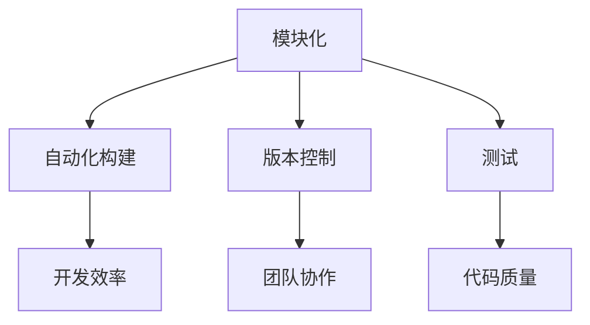

                 


## 引言：前端工程化的起源与发展

### 背景介绍

前端工程化是现代Web开发中一个日益重要的领域。它的起源可以追溯到Web开发早期的复杂性。当时，Web开发主要是手写HTML、CSS和JavaScript代码，开发者需要手动管理样式、脚本和页面布局。随着Web应用的复杂性增加，传统的开发方式变得难以维护，代码重复和错误率上升，这使得开发效率和质量都受到了很大的影响。

### 核心概念与联系

为了解决这些问题，前端工程化应运而生。前端工程化涉及一系列工具和实践，旨在提高开发效率、确保代码质量和优化开发流程。以下是前端工程化的核心概念和它们之间的联系：

- **模块化**：将代码拆分成独立的模块，使得代码更易于管理和复用。
- **自动化构建**：使用构建工具（如Webpack、Gulp等）自动化处理CSS、JavaScript和HTML文件的编译、打包和优化。
- **版本控制**：使用版本控制系统（如Git）管理代码版本和历史，方便团队协作和代码追踪。
- **测试**：通过编写测试用例来确保代码的稳定性和可靠性，包括单元测试、集成测试和端到端测试。

### Mermaid 流程图

以下是前端工程化的核心概念之间的联系架构的Mermaid流程图：



### 核心算法原理讲解

前端工程化不仅仅涉及工具和实践，还涉及到一些核心算法原理，例如代码压缩、打包和优化。以下是一个简单的伪代码示例，用于解释这些算法的基本原理：

```python
# 代码压缩
def compress_code(code):
    # 去掉空格、注释和换行符
    code = remove_whitespace_and_comments(code)
    # 使用字符串替换来简化代码
    code = replace_patterns(code)
    return code

# 打包
def bundle_assets(assets):
    # 将多个文件合并成一个文件
    bundled = combine_files(assets)
    # 压缩合并后的文件
    bundled = compress_code(bundled)
    return bundled

# 优化
def optimize_assets(assets):
    # 图片压缩
    optimized_images = compress_images(assets['images'])
    # CSS和JavaScript压缩
    optimized_css = compress_code(assets['css'])
    optimized_js = compress_code(assets['js'])
    return {'images': optimized_images, 'css': optimized_css, 'js': optimized_js}
```

### 数学模型和公式

在前端工程化中，一些算法的优化涉及到数学模型和公式。以下是一个用于计算文件压缩率的公式：

$$
\text{Compression Rate} = \frac{\text{Original Size} - \text{Compressed Size}}{\text{Original Size}} \times 100\%
$$

### 详细讲解与举例说明

例如，如果我们有一个原始的JavaScript文件，大小为1MB，压缩后大小为500KB，那么压缩率为：

$$
\text{Compression Rate} = \frac{1MB - 500KB}{1MB} \times 100\% = 50\%
$$

### 项目实战

在前端工程化的实际项目中，开发者通常会使用以下步骤来搭建开发环境：

1. **安装Node.js**：Node.js是一个JavaScript运行时环境，用于运行前端构建工具和测试框架。
2. **初始化项目**：使用`npm init`命令创建一个`package.json`文件，记录项目依赖和配置。
3. **安装构建工具**：根据项目需求安装Webpack、Gulp或其他构建工具。
4. **配置构建工具**：编写配置文件，指定构建过程和优化策略。
5. **编写测试用例**：编写测试代码，确保代码质量和功能正确性。

以下是项目实战的一个示例：

```bash
# 安装Node.js
curl -sL https://nodejs.org/dist/v14.17.0/node-v14.17.0-linux-x64.tar.xz | tar xJ -C /opt/
echo 'export PATH=/opt/node-v14.17.0-linux-x64/bin:$PATH' >> ~/.bashrc
source ~/.bashrc

# 初始化项目
npm init -y

# 安装Webpack
npm install webpack webpack-cli --save-dev

# 配置Webpack
touch webpack.config.js

# 编写Webpack配置
# ...
```

### 最佳实践 Tips

- **保持模块独立性**：确保每个模块只关注一个功能，避免代码冗余。
- **定期更新依赖**：及时更新项目依赖，以修复安全漏洞和性能问题。
- **使用代码格式化工具**：如Prettier和ESLint，保持代码风格一致。
- **持续集成**：使用CI/CD工具（如Jenkins、GitLab CI）自动化测试和部署。

### 小结

前端工程化是现代Web开发的基石，通过模块化、自动化、版本控制和测试等最佳实践，可以提高开发效率、确保代码质量和优化开发流程。了解前端工程化的核心概念和实践，将帮助开发者构建更健壮、高效和可维护的Web应用。

### 注意事项

- **遵循项目规范**：根据项目的具体情况，制定合适的开发规范和代码风格。
- **性能优化**：关注性能优化，避免过度工程化导致性能下降。

### 拓展阅读

- 《前端工程化实战》
- 《Webpack实战》
- 《前端性能优化最佳实践》

作者：AI天才研究院/AI Genius Institute & 禅与计算机程序设计艺术 /Zen And The Art of Computer Programming

