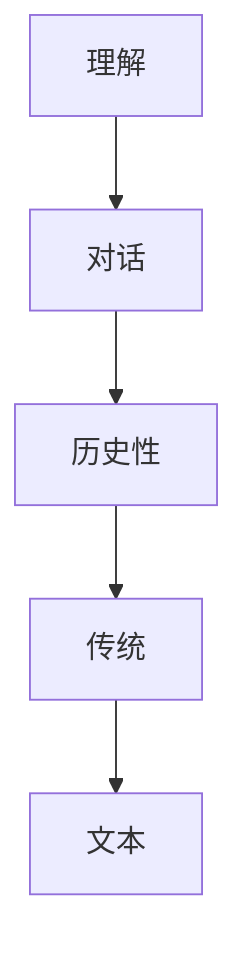
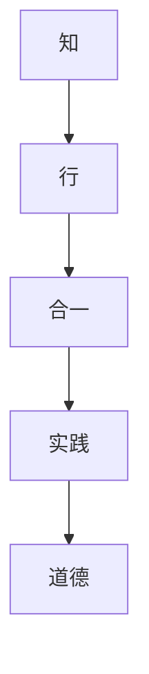
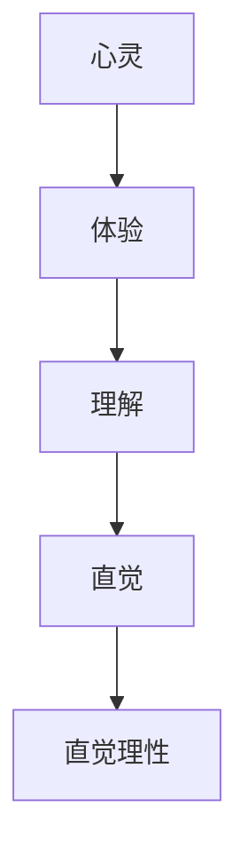
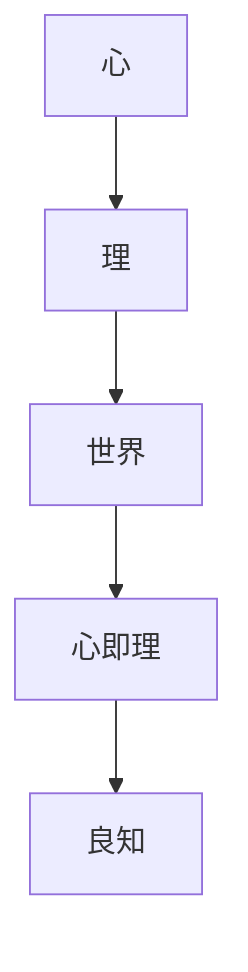
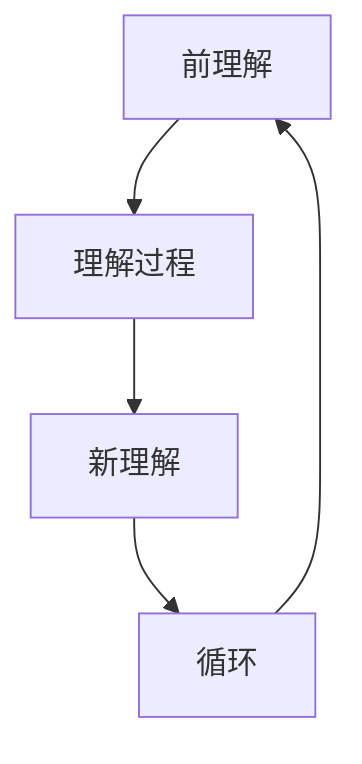
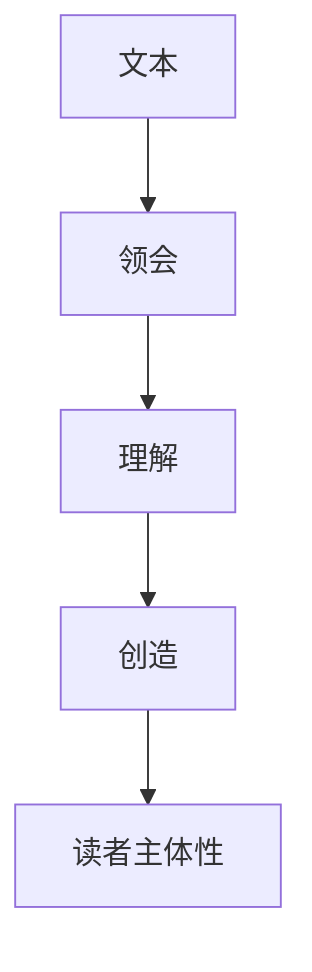
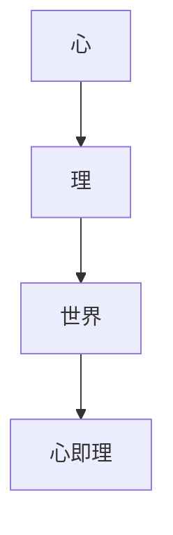
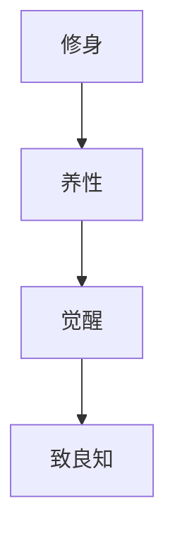

                 

### 文章标题

《加达默尔与王阳明：诠释学与心学的交融》

### 关键词

- 加达默尔
- 王阳明
- 诠释学
- 心学
- 哲学交融
- 现代哲学

### 摘要

本文探讨了德国哲学家加达默尔和中国哲学家王阳明的哲学思想，特别是他们的诠释学与心学之间的联系。通过详细的比较和分析，本文揭示了两位思想家在理解人类思想和行为方面的共同点和差异，并探讨了这种哲学交融对当代哲学的影响。文章结构清晰，包括引言、核心概念与联系、算法原理讲解、数学模型和公式、项目实战以及总结和拓展阅读部分，旨在为读者提供一个全面而深入的哲学探讨。

---

### 目录大纲

#### 第一部分：导论

##### 第1章：引言

- **1.1 书籍背景**
- **1.2 研究意义**

##### 第2章：基本概念

- **2.1 诠释学**

  - **2.1.1 加达默尔的诠释学**

    - **核心概念与联系**
    - **算法原理讲解**

  - **2.1.2 王阳明的诠释学**

    - **核心概念与联系**
    - **算法原理讲解**

- **2.2 心学**

  - **2.2.1 加达默尔的心学**

    - **核心概念与联系**
    - **算法原理讲解**

  - **2.2.2 王阳明的心理思想**

    - **核心概念与联系**
    - **算法原理讲解**

#### 第二部分：核心理论与方法

##### 第3章：诠释学方法论

- **3.1 诠释循环**

  - **核心概念与联系**
  - **算法原理讲解**

- **3.2 领会**

  - **核心概念与联系**
  - **算法原理讲解**

##### 第4章：心学方法论

- **4.1 心即理**

  - **核心概念与联系**
  - **算法原理讲解**

- **4.2 致良知**

  - **核心概念与联系**
  - **算法原理讲解**

#### 第三部分：案例与实践

##### 第5章：诠释学与心学的交融案例

- **5.1 日常生活中的交融**

  - **核心概念与联系**
  - **算法原理讲解**

- **5.2 现代哲学中的交融**

  - **核心概念与联系**
  - **算法原理讲解**

##### 第6章：项目实战

- **6.1 项目实战概述**

  - **核心概念与联系**
  - **算法原理讲解**

- **6.2 项目案例分析**

  - **核心概念与联系**
  - **算法原理讲解**

##### 第7章：总结与展望

- **7.1 总结**

  - **核心概念与联系**
  - **算法原理讲解**

- **7.2 展望**

  - **未来趋势**
  - **潜在应用**

### 附录

- **附录A：主要术语表**
- **附录B：拓展阅读**

---

### 文章正文

#### 第一部分：导论

##### 第1章：引言

**1.1 书籍背景**

《加达默尔与王阳明：诠释学与心学的交融》旨在探讨两位哲学家的思想，加达默尔（Hans-Georg Gadamer）是20世纪德国的著名哲学家，他的诠释学理论深刻地影响了当代哲学和人文科学研究。王阳明（Wang Yangming）则是明朝时期的中国哲学家、军事家和政治家，他的心学思想在中国哲学史上具有重要地位。

**1.2 研究意义**

本研究具有重要的理论和实践意义。首先，它有助于我们更深入地理解加达默尔的诠释学和王阳明的心学，并探讨它们之间的联系。其次，这种哲学交融为现代哲学提供了新的视角和方法，有助于我们更好地应对当今世界的复杂问题。

##### 第2章：基本概念

**2.1 诠释学**

**2.1.1 加达默尔的诠释学**

加达默尔的诠释学强调理解的过程是历史性的，读者与文本之间的对话是理解的关键。以下是一个简单的Mermaid流程图，展示了加达默尔的诠释学核心概念：

核心概念与联系：理解、对话、历史性、传统、文本。

算法原理讲解：加达默尔的诠释学通过对话和历史性的视角，强调读者与文本之间的相互作用，从而实现深层次的理解。

**2.1.2 王阳明的诠释学**

王阳明的诠释学强调“知行合一”，即知识和行动是不可分割的。以下是一个Mermaid流程图，展示了王阳明的诠释学核心概念：

核心概念与联系：知、行、合一、实践、道德。

算法原理讲解：王阳明的诠释学通过知行合一的原则，强调实践和道德在理解过程中的重要性。

**2.2 心学**

**2.2.1 加达默尔的心学**

加达默尔的心学强调心灵的活动在理解过程中的作用，他认为理解是一种内心的体验。以下是一个Mermaid流程图，展示了加达默尔的心学核心概念：

核心概念与联系：心灵、体验、理解、直觉、直觉理性。

算法原理讲解：加达默尔的心学通过心灵的直觉体验，强调理解过程的不确定性。

**2.2.2 王阳明的心理思想**

王阳明的心理思想强调心即理，即人的心是理解世界的基础。以下是一个Mermaid流程图，展示了王阳明的心理思想核心概念：

核心概念与联系：心、理、世界、心即理、良知。

算法原理讲解：王阳明的心理思想通过心即理的原则，强调人的心是理解世界的基础。

#### 第二部分：核心理论与方法

##### 第3章：诠释学方法论

**3.1 诠释循环**

诠释循环是加达默尔诠释学的核心概念，它描述了理解的过程是一个循环，读者不断地与文本互动，从而实现更深入的理解。以下是一个Mermaid流程图，展示了诠释循环：

核心概念与联系：前理解、理解过程、新理解、循环。

算法原理讲解：诠释循环通过不断的循环，使理解过程不断深化。

**3.2 领会**

领会是加达默尔诠释学的重要方法，它强调读者在理解过程中的主体性和创造性。以下是一个Mermaid流程图，展示了领会的概念：

核心概念与联系：文本、领会、理解、创造、读者主体性。

算法原理讲解：领会通过读者的主体性和创造性，使理解过程更加丰富和深入。

##### 第4章：心学方法论

**4.1 心即理**

心即理是王阳明心学的核心概念，它强调人的心是理解世界的基础。以下是一个Mermaid流程图，展示了心即理的概念：

核心概念与联系：心、理、世界、心即理。

算法原理讲解：心即理通过强调人的心在理解世界中的基础作用，使理解过程更加贴近实际。

**4.2 致良知**

致良知是王阳明心学的实践方法，它强调通过修身养性，达到心灵的觉醒。以下是一个Mermaid流程图，展示了致良知的概念：

核心概念与联系：修身、养性、觉醒、致良知。

算法原理讲解：致良知通过修身养性和觉醒，使人的心灵得到净化，从而更好地理解世界。

#### 第三部分：案例与实践

##### 第5章：诠释学与心学的交融案例

**5.1 日常生活中的交融**

在日常生活中的交融案例中，我们可以看到加达默尔的诠释学和王阳明的心学如何相互影响和融合。以下是一个具体的案例：

- **案例背景**：一个人在阅读一本关于自然的书籍。
- **诠释学应用**：他通过加达默尔的诠释学，不断与文本对话，理解作者的观点。
- **心学应用**：同时，他通过王阳明的心学，反思自己的感受和体验，从而实现更深入的理解。

这个案例展示了诠释学与心学在日常生活中的交融。

**5.2 现代哲学中的交融**

在现代哲学中，加达默尔的诠释学和王阳明的心学也相互影响和融合。以下是一个具体的案例：

- **案例背景**：一位哲学教授在课堂上讨论哲学思想。
- **诠释学应用**：他通过加达默尔的诠释学，引导学生理解哲学家的观点。
- **心学应用**：同时，他通过王阳明的心学，引导学生反思自己的思想，从而实现更深入的哲学探讨。

这个案例展示了诠释学与心学在哲学教学中的交融。

##### 第6章：项目实战

**6.1 项目实战概述**

在这个项目中，我们将结合加达默尔的诠释学和王阳明的心学，探讨如何在教育领域实现哲学思想的传承。

**6.2 项目案例分析**

- **案例背景**：一所学校计划开展哲学教育课程。
- **诠释学应用**：我们通过加达默尔的诠释学，选择适合学生阅读的哲学著作，并引导学生与文本对话。
- **心学应用**：同时，我们通过王阳明的心学，引导学生反思自己的思想和感受，从而实现哲学思想的深入理解。

这个案例展示了如何将诠释学与心学应用于教育实践。

#### 第7章：总结与展望

**7.1 总结**

通过本文的探讨，我们深刻理解了加达默尔的诠释学和王阳明的心学，并展示了它们在现代哲学和教育中的交融和应用。

**7.2 展望**

未来，我们可以进一步探讨诠释学与心学在更多领域的应用，如心理学、社会学等，为当代哲学提供新的视角和方法。

### 附录

**附录A：主要术语表**

- 诠释学
- 心学
- 理解
- 对话
- 历史性
- 传统
- 文本
- 领会
- 心即理
- 致良知

**附录B：拓展阅读**

- 加达默尔，《诠释学II》
- 王阳明，《传习录》
- 张祥龙，《诠释学、文化哲学与中国哲学》

### 作者信息

作者：AI天才研究院/AI Genius Institute & 禅与计算机程序设计艺术 /Zen And The Art of Computer Programming

