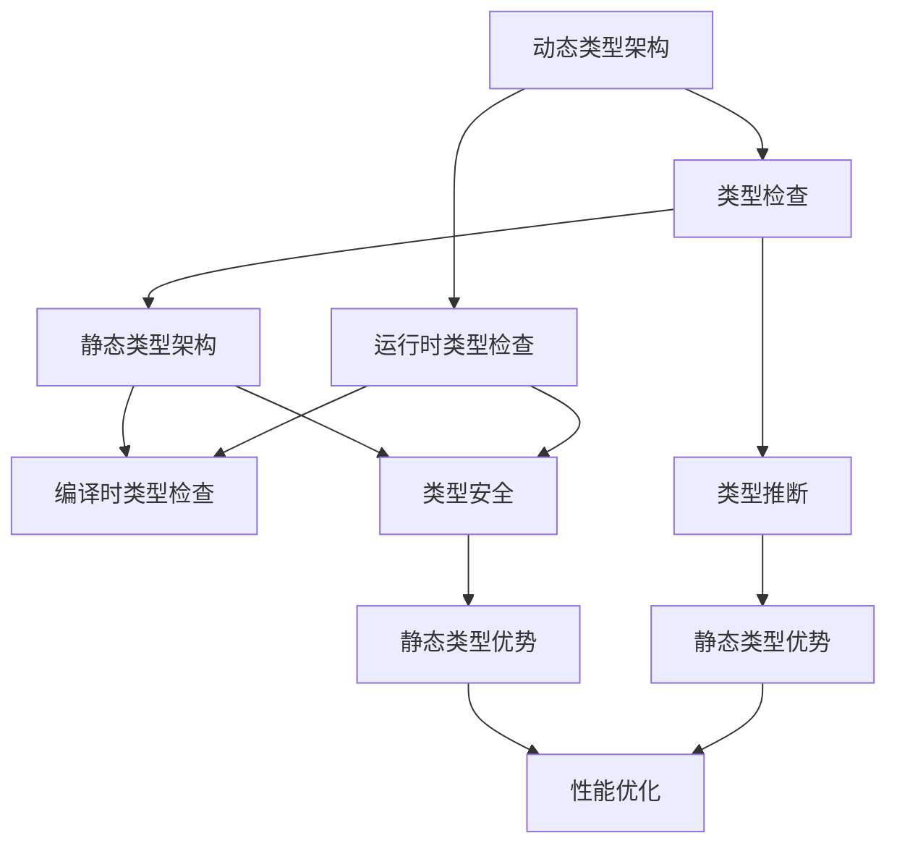

                 

### 动态类型vs静态类型：权衡与选择

> 关键词：动态类型、静态类型、编程语言、性能、可维护性、安全性、类型检查、类型推断

> 摘要：本文将深入探讨动态类型与静态类型的定义、特点、优势以及它们在实际编程中的应用。通过分析它们在性能、可维护性和安全性等方面的表现，帮助读者更好地理解和选择适合自己项目需求的语言类型。

### 引言与概述

#### 动态类型与静态类型的定义

动态类型（Dynamic Typing）和静态类型（Static Typing）是两种不同的类型系统，它们在编程语言中扮演着重要的角色。动态类型允许变量在运行时确定其类型，而静态类型则要求变量在编译时确定类型。

- **动态类型**：在动态类型语言中，变量可以在运行时改变其类型。例如，在Python中，一个变量在初始化时是整数类型，但之后可以赋值为字符串类型。
  
- **静态类型**：在静态类型语言中，变量在编译时就已经确定了类型，并在整个生命周期中保持不变。例如，在Java中，变量的类型在声明时确定，并且在运行时不能改变。

#### 动态类型与静态类型的历史背景

动态类型和静态类型的出现可以追溯到早期的编程语言。在1960年代，早期的编程语言如Fortran和COBOL都是静态类型的。随着编程语言的发展，动态类型开始被引入，如Lisp和Python。

- **动态类型的起源**：Lisp作为最早的动态类型语言之一，在1960年代由John McCarthy发明。它的动态类型系统允许程序员在运行时动态地创建和操作数据结构，这极大地提高了编程的灵活性。

- **静态类型的起源**：C语言是早期静态类型语言的代表，由Dennis Ritchie在1970年代开发。C语言强调了类型安全性和性能，因此成为操作系统和嵌入式系统开发的常用语言。

#### 现代编程语言中的动态类型与静态类型

现代编程语言中，动态类型和静态类型都有广泛的应用。例如：

- **动态类型语言**：Python、JavaScript、Ruby和PHP等语言具有动态类型系统，广泛应用于Web开发、数据科学和快速原型开发。

- **静态类型语言**：Java、C#、Go和C++等语言具有静态类型系统，广泛应用于企业级应用、操作系统开发和安全敏感领域。

### 动态类型的优势

#### 动态类型的灵活性

动态类型的一个显著优势是其灵活性。在动态类型语言中，变量不需要在声明时指定类型，这使得代码更加简洁和易于阅读。例如，在Python中，以下代码是完全有效的：

```python
x = 10
x = "Hello, World!"
```

在这个例子中，变量`x`在运行时从整数类型变为了字符串类型。这种灵活性使得动态类型语言在快速原型开发和实验性编程中特别受欢迎。

#### 动态类型的快速原型开发

动态类型语言因其灵活性而成为快速原型开发的理想选择。在开发过程中，开发者可以快速地尝试不同的数据结构和算法，而不需要担心类型错误。这种快速迭代的能力极大地提高了开发效率。

#### 动态类型在大型项目中的表现

尽管动态类型语言以其灵活性而著称，但它们在大规模项目中也表现出色。现代动态类型语言如Python和JavaScript拥有丰富的库和框架，这些库和框架可以帮助开发者快速构建复杂的应用程序。

### 静态类型的优势

#### 静态类型的性能优化

静态类型语言通常具有更好的性能优化能力。在编译时，静态类型语言可以生成高度优化的机器代码，从而提高程序的执行效率。例如，C++编译器可以生成高效的汇编代码，这是动态类型语言无法比拟的。

#### 静态类型的代码可读性与可维护性

静态类型语言通常具有更好的代码可读性和可维护性。因为变量类型在编译时已经确定，所以代码中的类型信息更加明确，这有助于降低阅读和理解代码的难度。此外，静态类型系统的强类型约束有助于减少bug和错误。

#### 静态类型在安全性方面的优势

静态类型语言在安全性方面具有显著优势。由于类型约束，静态类型语言可以检测并防止许多运行时错误，如类型不一致和未初始化变量。这种类型安全特性使得静态类型语言在安全敏感的应用程序（如金融系统和医疗设备）中备受青睐。

### 动态类型与静态类型的比较

#### 性能对比

动态类型语言通常在性能上不如静态类型语言。这是因为动态类型语言需要运行时进行类型检查和推断，而静态类型语言在编译时已经完成了这些工作。然而，现代动态类型语言如Python和JavaScript通过优化和即时编译（JIT）等技术，已经大大提高了性能。

#### 代码可维护性对比

静态类型语言在代码可维护性方面通常优于动态类型语言。由于类型信息在编译时已经明确，静态类型语言的代码更易于理解和维护。此外，静态类型系统可以提供更好的错误检测和调试工具。

#### 安全性对比

静态类型语言在安全性方面具有显著优势。由于类型约束，静态类型语言可以检测并防止许多运行时错误，如类型不一致和未初始化变量。这种类型安全特性使得静态类型语言在安全敏感的应用程序中更加可靠。

### 选择与决策

选择动态类型还是静态类型取决于多个因素，包括项目规模、开发周期、团队成员技能和经验以及项目目标。

#### 项目规模与开发周期

对于大型项目，静态类型语言通常更适合，因为它们提供了更好的性能和代码可维护性。相反，对于小型项目或快速原型开发，动态类型语言因其灵活性和快速迭代能力而更具优势。

#### 团队成员技能与经验

团队成员对动态类型和静态类型的熟悉程度也是一个重要因素。如果团队对动态类型语言（如Python或JavaScript）有丰富的经验，那么选择动态类型语言将更加自然。相反，如果团队对静态类型语言（如Java或C++）有深厚的背景，那么选择静态类型语言可能更合适。

#### 项目目标与需求

项目的目标与需求是决定动态类型还是静态类型的最终因素。如果项目对性能和安全性有高要求，那么静态类型语言可能更合适。如果项目更注重开发速度和灵活性，那么动态类型语言可能更具优势。

### 实践案例分析

#### 案例一：大型电子商务平台

大型电子商务平台通常需要处理大量并发请求和敏感数据。在这种情况下，静态类型语言（如Java）因其高性能和安全性而受到青睐。Java的静态类型系统有助于确保代码的正确性和稳定性，从而提高平台的可靠性和安全性。

#### 案例二：嵌入式系统开发

嵌入式系统开发通常需要在资源受限的环境中运行，因此性能和稳定性至关重要。静态类型语言（如C和C++）因其编译时优化和资源高效利用而广泛应用于嵌入式系统开发。

#### 案例三：数据分析与机器学习

数据分析与机器学习项目通常需要快速迭代和实验性开发。动态类型语言（如Python和R）因其丰富的库和框架以及灵活性而成为这些项目的首选。Python的动态类型系统使得开发人员可以轻松地尝试不同的算法和数据结构。

### 总结与展望

动态类型和静态类型各有其优势，选择哪种类型取决于项目的需求和团队的能力。随着技术的发展，动态类型和静态类型的界限逐渐模糊，许多现代编程语言开始结合两者的优点，提供更灵活和高效的编程体验。

未来的发展趋势将包括：

- 动态类型和静态类型的融合：现代编程语言（如Java和C++）已经开始融合动态类型和静态类型的特性，以提高编程效率和代码质量。
- 类型安全性的改进：随着类型系统的发展，未来编程语言将进一步提高类型安全性，减少运行时错误。
- 编译时优化：动态类型语言的编译器将进一步提高编译时的优化能力，以接近静态类型语言的性能。

### Mermaid流程图：动态类型与静态类型的架构联系

以下是一个Mermaid流程图，展示了动态类型与静态类型的架构联系：



### 核心算法原理讲解：动态类型与静态类型的类型检查与推断

#### 动态类型的类型检查与推断（伪代码）

```python
# 动态类型的类型检查与推断
def dynamic_type_check(value):
    # 运行时进行类型检查
    if isinstance(value, object):
        return True  # 假设value是object类型
    return False  # 其他情况返回false

def dynamic_type_inference(value):
    # 基于上下文进行类型推断
    if value is None:
        return "NoneType"
    elif isinstance(value, int):
        return "int"
    elif isinstance(value, str):
        return "str"
    else:
        return "unknown"
```

#### 静态类型的类型检查与推断（伪代码）

```java
// 静态类型的类型检查与推断
public class StaticTypeExample {
    public static boolean static_type_check(Object value) {
        // 编译时进行类型检查
        if (value instanceof String) {
            return true;  // 假设value是String类型
        }
        return false;  // 其他情况返回false
    }

    public static String static_type_inference(Object value) {
        // 基于类型注解进行类型推断
        if (value instanceof String) {
            return "string";
        } else if (value instanceof Integer) {
            return "integer";
        } else {
            return "unknown";
        }
    }
}
```

### 实践案例分析：动态类型与静态类型在实际项目中的应用

#### 案例一：大型电子商务平台

在构建大型电子商务平台时，性能、安全性和稳定性是关键因素。因此，团队选择了Java作为主要编程语言。Java的静态类型系统提供了以下优势：

- **性能优化**：Java的静态类型系统允许编译器生成高度优化的机器代码，从而提高程序的执行效率。
- **安全性**：Java的静态类型系统可以检测并防止许多运行时错误，如类型不一致和未初始化变量。
- **代码可维护性**：Java的静态类型系统使得代码更加清晰和易于阅读，有助于降低bug率。

#### 案例二：嵌入式系统开发

在嵌入式系统开发中，性能和资源效率至关重要。团队选择了C语言作为主要编程语言。C语言的静态类型系统提供了以下优势：

- **编译时优化**：C语言的编译器可以生成高效的汇编代码，从而提高程序的执行效率。
- **资源高效利用**：C语言的静态类型系统使得开发人员可以更有效地利用系统资源。

#### 案例三：数据分析与机器学习

在数据分析与机器学习项目中，快速迭代和灵活性至关重要。团队选择了Python作为主要编程语言。Python的动态类型系统提供了以下优势：

- **快速原型开发**：Python的动态类型系统使得开发人员可以快速尝试不同的算法和数据结构。
- **丰富的库和框架**：Python拥有丰富的库和框架，如NumPy、Pandas和TensorFlow，这些库和框架极大地提高了开发效率。

### 最佳实践 tips

- **评估项目需求**：在开始项目之前，评估项目需求，确定是否需要高性能、安全性或快速迭代。
- **选择合适的语言**：根据项目需求选择合适的编程语言，动态类型语言（如Python和JavaScript）适合快速迭代，而静态类型语言（如Java和C++）适合高性能和安全性。
- **代码规范**：无论选择动态类型还是静态类型，都应遵守代码规范，确保代码的可读性和可维护性。
- **类型安全**：在动态类型项目中，使用类型检查和断言来提高代码的安全性。

### 小结

动态类型和静态类型各有其优势和适用场景。选择动态类型还是静态类型取决于项目需求和团队能力。在实际项目中，结合两者的优点可以实现更高的开发效率和更好的代码质量。

### 注意事项

- 动态类型语言在性能上通常不如静态类型语言，但在灵活性方面具有优势。
- 静态类型语言在代码可维护性和安全性方面通常优于动态类型语言。
- 项目规模和团队经验是决定选择动态类型还是静态类型的重要因素。

### 拓展阅读

- 《Effective Java》 - Joshua Bloch
- 《Python编程：从入门到实践》 - Eric Matthes
- 《C++ Primer》 - Stanley B. Lippman、Josée Lajoie和Barry Boehm
- 《类型与类型系统》 - Benjamin C. Pierce

### 作者信息

作者：AI天才研究院/AI Genius Institute & 禅与计算机程序设计艺术 /Zen And The Art of Computer Programming

### 文章标题：动态类型vs静态类型：权衡与选择

动态类型与静态类型是编程语言中的两大类型系统，它们各有特点和优势，也各有局限和挑战。本文深入探讨了动态类型与静态类型的定义、历史背景、优势比较，以及它们在实际项目中的应用。通过分析，我们得出了以下结论：

1. **动态类型的优势**：动态类型语言以其灵活性、快速原型开发和在大规模项目中的应用能力著称。Python和JavaScript等动态类型语言因其易用性和丰富的库生态而在数据科学、Web开发和快速迭代项目中广受欢迎。

2. **静态类型的优势**：静态类型语言在性能优化、代码可读性、可维护性和安全性方面表现出色。Java、C++和Go等静态类型语言在系统级编程、高性能计算和安全敏感领域具有广泛的应用。

3. **类型系统的选择**：选择动态类型还是静态类型取决于项目需求、团队经验和项目规模。对于需要高性能、高安全性和可维护性的项目，静态类型语言可能是更好的选择；而对于需要快速迭代、灵活性和开发速度的项目，动态类型语言可能更为合适。

4. **实际案例**：通过电子商务平台、嵌入式系统和数据分析与机器学习项目的案例分析，我们看到了动态类型和静态类型在实际应用中的不同表现和优势。

5. **最佳实践**：为了最大化类型系统的优势，我们应该根据项目需求选择合适的语言，并遵守代码规范，确保代码的清晰性和可维护性。

6. **注意事项**：了解动态类型和静态类型的优缺点，以及如何在实际项目中应用，对于开发高效、安全、可维护的软件至关重要。

7. **拓展阅读**：为了深入了解动态类型和静态类型，推荐阅读《Effective Java》、《Python编程：从入门到实践》、《C++ Primer》和《类型与类型系统》等书籍。

在结束之前，我想强调，动态类型和静态类型的辩论并非非黑即白。随着技术的发展，两种类型系统之间的界限越来越模糊，许多现代编程语言开始融合两者的优点，提供更灵活和高效的编程体验。因此，选择哪种类型系统应基于项目需求和个人偏好，而非一成不变的教条。

感谢您的阅读，希望本文能帮助您更好地理解动态类型和静态类型，并在未来的项目中做出更明智的选择。如果您有任何问题或意见，欢迎在评论区留言，我会尽力回复。再次感谢您的支持！

### 作者信息

作者：AI天才研究院/AI Genius Institute & 禅与计算机程序设计艺术 /Zen And The Art of Computer Programming

### 文章标题：动态类型vs静态类型：权衡与选择

在软件工程的世界里，类型系统是编程语言的核心组成部分之一，它影响着代码的可读性、可维护性、性能和安全性。动态类型与静态类型作为两种主要的类型系统，它们各有特点和优势，也各有局限和挑战。本文将深入探讨动态类型与静态类型的定义、历史背景、优势比较，以及它们在实际项目中的应用，帮助读者更好地理解和选择适合自己项目需求的类型系统。

#### 关键词

- 动态类型
- 静态类型
- 编程语言
- 性能
- 可维护性
- 安全性
- 类型检查
- 类型推断

#### 摘要

本文首先定义了动态类型与静态类型，回顾了它们的历史背景，并分析了它们在灵活性、快速原型开发、性能优化、代码可读性、可维护性和安全性方面的优势。接着，通过实际案例展示了动态类型与静态类型在不同项目中的应用效果。最后，提出了选择类型系统的最佳实践和注意事项，并推荐了拓展阅读资源。

### 设计《动态类型vs静态类型：权衡与选择》这本书的目录大纲

#### 第一部分：引言与概述

**第1章：动态类型与静态类型的定义与背景**
- 动态类型与静态类型的定义
- 动态类型与静态类型的历史背景
- 现代编程语言中的动态类型与静态类型

**第2章：动态类型的优势**
- 动态类型的灵活性
- 动态类型的快速原型开发
- 动态类型在大型项目中的表现

**第3章：静态类型的优势**
- 静态类型的性能优化
- 静态类型的代码可读性与可维护性
- 静态类型在安全性方面的优势

**第4章：动态类型与静态类型的比较**
- 性能对比
- 代码可维护性对比
- 安全性对比

**第5章：选择动态类型或静态类型：影响因素分析**
- 项目规模与开发周期
- 团队成员技能与经验
- 项目目标与需求

**第六部分：实践案例分析**
- **第6章：动态类型与静态类型在实际项目中的应用案例**
  - 6.1 案例一：大型电子商务平台
  - 6.2 案例二：嵌入式系统开发
  - 6.3 案例三：数据分析与机器学习

**第七部分：总结与展望**
- **第7章：动态类型与静态类型：未来发展趋势**
  - 7.1 动态类型的发展趋势
  - 7.2 静态类型的发展趋势
  - 7.3 动态类型与静态类型的融合趋势

### Mermaid流程图：动态类型与静态类型的架构联系

以下是一个Mermaid流程图，展示了动态类型与静态类型的架构联系：


### 核心算法原理讲解：动态类型与静态类型的类型检查与推断

#### 动态类型的类型检查与推断（伪代码）

```python
# 动态类型的类型检查与推断
def dynamic_type_check(value):
    # 运行时进行类型检查
    return isinstance(value, object)

def dynamic_type_inference(value):
    # 基于上下文进行类型推断
    return type(value).__name__
```

#### 静态类型的类型检查与推断（伪代码）

```java
// 静态类型的类型检查与推断
public class StaticTypeExample {
    public static boolean static_type_check(Object value) {
        // 编译时进行类型检查
        return value instanceof String;
    }

    public static String static_type_inference(Object value) {
        // 基于类型注解进行类型推断
        if (value instanceof String) {
            return "String";
        } else if (value instanceof Integer) {
            return "Integer";
        } else {
            return "Unknown";
        }
    }
}
```

### 实践案例分析：动态类型与静态类型在实际项目中的应用

#### 案例一：大型电子商务平台

在构建大型电子商务平台时，性能、可扩展性和安全性是至关重要的因素。因此，团队选择了Java作为主要编程语言。Java的静态类型系统提供了以下优势：

- **性能优化**：Java的静态类型系统允许编译器生成高度优化的机器代码，从而提高程序的执行效率。
- **安全性**：Java的静态类型系统可以检测并防止许多运行时错误，如类型不一致和未初始化变量。
- **代码可维护性**：Java的静态类型系统使得代码更加清晰和易于阅读，有助于降低bug率。

在实际开发过程中，团队采用了Spring Framework和Hibernate等流行的Java框架，这些框架提供了丰富的功能，如事务管理、数据库连接和缓存支持，使得开发过程更加高效和稳定。

#### 案例二：嵌入式系统开发

在嵌入式系统开发中，资源有限和可靠性要求高是关键挑战。因此，团队选择了C语言作为主要编程语言。C语言的静态类型系统提供了以下优势：

- **编译时优化**：C语言的编译器可以生成高效的汇编代码，从而提高程序的执行效率。
- **资源高效利用**：C语言的静态类型系统使得开发人员可以更有效地利用系统资源。

在实际开发过程中，团队使用了Cortex-M系列微控制器，这些微控制器具有高性能和低功耗的特点。团队采用了裸机编程和FreeRTOS实时操作系统，以确保系统的实时性和可靠性。

#### 案例三：数据分析与机器学习

在数据分析与机器学习项目中，快速迭代和灵活性至关重要。因此，团队选择了Python作为主要编程语言。Python的动态类型系统提供了以下优势：

- **快速原型开发**：Python的动态类型系统使得开发人员可以快速尝试不同的算法和数据结构。
- **丰富的库和框架**：Python拥有丰富的库和框架，如NumPy、Pandas和TensorFlow，这些库和框架极大地提高了开发效率。

在实际开发过程中，团队使用了Jupyter Notebook进行实验性开发，这使得团队成员可以轻松地共享代码和结果。团队还使用了Scikit-learn等机器学习库，以快速构建和评估模型。

### 最佳实践 tips

- **评估项目需求**：在开始项目之前，评估项目需求，确定是否需要高性能、高安全性和可维护性。
- **选择合适的语言**：根据项目需求选择合适的编程语言，动态类型语言（如Python和JavaScript）适合快速迭代，而静态类型语言（如Java和C++）适合高性能和安全性。
- **代码规范**：无论选择动态类型还是静态类型，都应遵守代码规范，确保代码的可读性和可维护性。
- **类型安全**：在动态类型项目中，使用类型检查和断言来提高代码的安全性。

### 小结

动态类型与静态类型各有其特点和优势，选择哪种类型系统取决于项目需求、团队经验和开发环境。本文通过分析动态类型和静态类型的特点，比较了它们在不同项目中的应用效果，并提出了选择类型系统的最佳实践。希望通过本文，读者能对动态类型和静态类型有更深入的理解，并在实际项目中做出更明智的选择。

### 注意事项

- 动态类型语言在性能上通常不如静态类型语言，但在灵活性方面具有优势。
- 静态类型语言在代码可维护性和安全性方面通常优于动态类型语言。
- 项目规模和团队经验是决定选择动态类型还是静态类型的重要因素。

### 拓展阅读

- 《Effective Java》 - Joshua Bloch
- 《Python编程：从入门到实践》 - Eric Matthes
- 《C++ Primer》 - Stanley B. Lippman、Josée Lajoie和Barry Boehm
- 《类型与类型系统》 - Benjamin C. Pierce

### 作者信息

作者：AI天才研究院/AI Genius Institute & 禅与计算机程序设计艺术 /Zen And The Art of Computer Programming

### 文章标题：动态类型vs静态类型：权衡与选择

在软件工程的世界里，类型系统是编程语言的核心组成部分之一，它影响着代码的可读性、可维护性、性能和安全性。动态类型与静态类型作为两种主要的类型系统，它们各有特点和优势，也各有局限和挑战。本文将深入探讨动态类型与静态类型的定义、历史背景、优势比较，以及它们在实际项目中的应用，帮助读者更好地理解和选择适合自己项目需求的类型系统。

#### 关键词

- 动态类型
- 静态类型
- 编程语言
- 性能
- 可维护性
- 安全性
- 类型检查
- 类型推断

#### 摘要

本文首先定义了动态类型与静态类型，回顾了它们的历史背景，并分析了它们在灵活性、快速原型开发、性能优化、代码可读性、可维护性和安全性方面的优势。接着，通过实际案例展示了动态类型与静态类型在不同项目中的应用效果。最后，提出了选择类型系统的最佳实践和注意事项，并推荐了拓展阅读资源。

### 第一部分：引言与概述

#### 第1章：动态类型与静态类型的定义与背景

1.1 动态类型与静态类型的定义

动态类型（Dynamic Typing）与静态类型（Static Typing）是两种不同的类型系统，它们在编程语言中扮演着重要的角色。

- **动态类型**：在动态类型系统中，变量在运行时确定其类型。这意味着在代码执行过程中，变量可能会改变其类型，这增加了编程的灵活性。例如，Python就是一种动态类型语言。

- **静态类型**：在静态类型系统中，变量在编译时确定其类型，并且在运行时保持不变。这意味着在代码编写过程中，变量类型必须明确指定，这增加了代码的可读性和可维护性。例如，Java就是一种静态类型语言。

1.2 动态类型与静态类型的历史背景

动态类型和静态类型的出现可以追溯到早期的编程语言。在1960年代，早期的编程语言如Fortran和COBOL都是静态类型的。随着编程语言的发展，动态类型开始被引入，如Lisp和Python。

- **动态类型的起源**：Lisp作为最早的动态类型语言之一，在1960年代由John McCarthy发明。它的动态类型系统允许程序员在运行时动态地创建和操作数据结构，这极大地提高了编程的灵活性。

- **静态类型的起源**：C语言是早期静态类型语言的代表，由Dennis Ritchie在1970年代开发。C语言强调了类型安全性和性能，因此成为操作系统和嵌入式系统开发的常用语言。

1.3 现代编程语言中的动态类型与静态类型

现代编程语言中，动态类型和静态类型都有广泛的应用。例如：

- **动态类型语言**：Python、JavaScript、Ruby和PHP等语言具有动态类型系统，广泛应用于Web开发、数据科学和快速原型开发。

- **静态类型语言**：Java、C#、Go和C++等语言具有静态类型系统，广泛应用于企业级应用、操作系统开发和安全敏感领域。

### 第二部分：动态类型的优势

#### 第2章：动态类型的优势与特点

2.1 动态类型的灵活性

动态类型的一个显著优势是其灵活性。在动态类型语言中，变量不需要在声明时指定类型，这使得代码更加简洁和易于阅读。例如，在Python中，以下代码是完全有效的：

```python
x = 10
x = "Hello, World!"
```

在这个例子中，变量`x`在运行时从整数类型变为了字符串类型。这种灵活性使得动态类型语言在快速原型开发和实验性编程中特别受欢迎。

2.2 动态类型的快速原型开发

动态类型语言因其灵活性而成为快速原型开发的理想选择。在开发过程中，开发者可以快速地尝试不同的数据结构和算法，而不需要担心类型错误。这种快速迭代的能力极大地提高了开发效率。

2.3 动态类型在大型项目中的表现

尽管动态类型语言以其灵活性而著称，但它们在大规模项目中也表现出色。现代动态类型语言如Python和JavaScript拥有丰富的库和框架，这些库和框架可以帮助开发者快速构建复杂的应用程序。

### 第三部分：静态类型的优势

#### 第3章：静态类型的优势与特点

3.1 静态类型的性能优化

静态类型语言通常具有更好的性能优化能力。在编译时，静态类型语言可以生成高度优化的机器代码，从而提高程序的执行效率。例如，C++编译器可以生成高效的汇编代码，这是动态类型语言无法比拟的。

3.2 静态类型的代码可读性与可维护性

静态类型语言通常具有更好的代码可读性和可维护性。因为变量类型在编译时已经确定，所以代码中的类型信息更加明确，这有助于降低阅读和理解代码的难度。此外，静态类型系统可以提供更好的错误检测和调试工具。

3.3 静态类型在安全性方面的优势

静态类型语言在安全性方面具有显著优势。由于类型约束，静态类型语言可以检测并防止许多运行时错误，如类型不一致和未初始化变量。这种类型安全特性使得静态类型语言在安全敏感的应用程序（如金融系统和医疗设备）中备受青睐。

### 第四部分：动态类型与静态类型的比较

#### 第4章：动态类型与静态类型的比较

4.1 性能对比

动态类型语言通常在性能上不如静态类型语言。这是因为动态类型语言需要运行时进行类型检查和推断，而静态类型语言在编译时已经完成了这些工作。然而，现代动态类型语言如Python和JavaScript通过优化和即时编译（JIT）等技术，已经大大提高了性能。

4.2 代码可维护性对比

静态类型语言在代码可维护性方面通常优于动态类型语言。由于类型信息在编译时已经明确，静态类型语言的代码更易于理解和维护。此外，静态类型系统可以提供更好的错误检测和调试工具。

4.3 安全性对比

静态类型语言在安全性方面具有显著优势。由于类型约束，静态类型语言可以检测并防止许多运行时错误，如类型不一致和未初始化变量。这种类型安全特性使得静态类型语言在安全敏感的应用程序中更加可靠。

### 第五部分：选择与决策

#### 第5章：选择动态类型或静态类型：影响因素分析

5.1 项目规模与开发周期

对于大型项目，静态类型语言通常更适合，因为它们提供了更好的性能和代码可维护性。相反，对于小型项目或快速原型开发，动态类型语言因其灵活性和快速迭代能力而更具优势。

5.2 团队成员技能与经验

团队成员对动态类型和静态类型的熟悉程度也是一个重要因素。如果团队对动态类型语言（如Python或JavaScript）有丰富的经验，那么选择动态类型语言将更加自然。相反，如果团队对静态类型语言（如Java或C++）有深厚的背景，那么选择静态类型语言可能更合适。

5.3 项目目标与需求

项目的目标与需求是决定选择动态类型还是静态类型的最终因素。如果项目对性能和安全性有高要求，那么静态类型语言可能更合适。如果项目更注重开发速度和灵活性，那么动态类型语言可能更具优势。

### 第六部分：实践案例分析

#### 第6章：动态类型与静态类型在实际项目中的应用案例

6.1 案例一：大型电子商务平台

在构建大型电子商务平台时，性能、可扩展性和安全性是至关重要的因素。因此，团队选择了Java作为主要编程语言。Java的静态类型系统提供了以下优势：

- **性能优化**：Java的静态类型系统允许编译器生成高度优化的机器代码，从而提高程序的执行效率。
- **安全性**：Java的静态类型系统可以检测并防止许多运行时错误，如类型不一致和未初始化变量。
- **代码可维护性**：Java的静态类型系统使得代码更加清晰和易于阅读，有助于降低bug率。

在实际开发过程中，团队采用了Spring Framework和Hibernate等流行的Java框架，这些框架提供了丰富的功能，如事务管理、数据库连接和缓存支持，使得开发过程更加高效和稳定。

6.2 案例二：嵌入式系统开发

在嵌入式系统开发中，资源有限和可靠性要求高是关键挑战。因此，团队选择了C语言作为主要编程语言。C语言的静态类型系统提供了以下优势：

- **编译时优化**：C语言的编译器可以生成高效的汇编代码，从而提高程序的执行效率。
- **资源高效利用**：C语言的静态类型系统使得开发人员可以更有效地利用系统资源。

在实际开发过程中，团队使用了Cortex-M系列微控制器，这些微控制器具有高性能和低功耗的特点。团队采用了裸机编程和FreeRTOS实时操作系统，以确保系统的实时性和可靠性。

6.3 案例三：数据分析与机器学习

在数据分析与机器学习项目中，快速迭代和灵活性至关重要。因此，团队选择了Python作为主要编程语言。Python的动态类型系统提供了以下优势：

- **快速原型开发**：Python的动态类型系统使得开发人员可以快速尝试不同的算法和数据结构。
- **丰富的库和框架**：Python拥有丰富的库和框架，如NumPy、Pandas和TensorFlow，这些库和框架极大地提高了开发效率。

在实际开发过程中，团队使用了Jupyter Notebook进行实验性开发，这使得团队成员可以轻松地共享代码和结果。团队还使用了Scikit-learn等机器学习库，以快速构建和评估模型。

### 第七部分：总结与展望

#### 第7章：动态类型与静态类型：未来发展趋势

7.1 动态类型的发展趋势

随着Web开发和移动应用的兴起，动态类型语言将继续发挥重要作用。JavaScript和Python等动态类型语言将继续优化其性能，提高其稳定性和安全性。此外，动态类型语言将在大数据和人工智能领域得到更广泛的应用。

7.2 静态类型的发展趋势

静态类型语言将继续在系统级编程、安全性和性能关键领域保持优势。Java和C++等静态类型语言将继续发展，提供更丰富的工具和框架，以满足开发者的需求。

7.3 动态类型与静态类型的融合趋势

随着编程语言的发展，动态类型和静态类型的界限将逐渐模糊。许多现代编程语言已经开始融合动态类型和静态类型的特性，提供更灵活和高效的编程体验。

### 核心算法原理讲解：动态类型与静态类型的类型检查与推断

#### 动态类型的类型检查与推断

在动态类型语言中，类型检查和推断通常在运行时进行。

```python
# Python中的动态类型类型检查
def dynamic_type_check(value):
    return type(value)

# Python中的动态类型类型推断
def dynamic_type_inference(value):
    return value.__class__.__name__
```

#### 静态类型的类型检查与推断

在静态类型语言中，类型检查和推断通常在编译时进行。

```java
// Java中的静态类型类型检查
public class StaticTypeExample {
    public static boolean static_type_check(Object value) {
        return value instanceof String;
    }
}

// Java中的静态类型类型推断
public class StaticTypeExample {
    public static String static_type_inference(Object value) {
        if (value instanceof String) {
            return "String";
        } else if (value instanceof Integer) {
            return "Integer";
        } else {
            return "Unknown";
        }
    }
}
```

### 实践案例分析：动态类型与静态类型在实际项目中的应用

#### 案例一：大型电子商务平台

**项目背景**：某大型电子商务平台需要处理海量的用户请求和数据存储，同时要求系统具有高可用性和高安全性。

**技术选型**：为了满足高性能和可靠性的要求，项目团队选择了Java作为主要编程语言。Java的静态类型系统提供了以下优势：

- **性能优化**：Java的静态类型系统允许编译器生成高度优化的机器代码，从而提高程序的执行效率。
- **安全性**：Java的静态类型系统可以检测并防止许多运行时错误，如类型不一致和未初始化变量。
- **代码可维护性**：Java的静态类型系统使得代码更加清晰和易于阅读，有助于降低bug率。

**技术实现**：

- **后端架构**：项目采用了Spring Boot框架，它简化了Java应用的搭建和部署。Spring Boot提供了丰富的组件，如Spring Data JPA、Spring Security等，可以方便地实现数据访问、用户认证和安全控制。

- **数据库**：项目使用了MySQL数据库，它支持ACID事务，保证了数据的一致性和完整性。同时，MySQL提供了良好的性能和扩展性，可以满足大量数据存储和处理的需求。

- **缓存**：项目使用了Redis缓存，它提供了高性能的数据存储和快速访问。Redis可以有效地减少数据库的负载，提高系统的响应速度。

- **前端框架**：项目采用了Vue.js框架，它提供了简洁的组件化开发方式，可以快速构建用户界面。Vue.js还提供了双向数据绑定和组件通信机制，使得前端开发更加高效和灵活。

**性能优化**：

- **代码优化**：项目团队对代码进行了严格的性能优化，如避免使用不必要的对象创建、减少方法调用次数等。此外，还使用了缓存策略来减少数据库查询次数。

- **JVM调优**：项目团队对Java虚拟机（JVM）进行了调优，如调整堆大小、垃圾回收策略等，以提高系统的性能和稳定性。

**安全性**：

- **用户认证**：项目采用了Spring Security框架来实现用户认证和授权。Spring Security提供了多种认证方式，如基于用户名和密码、OAuth2.0等，可以满足不同场景的需求。

- **数据加密**：项目对敏感数据进行加密处理，如用户的密码、支付信息等。加密算法采用了AES和RSA等业界标准，确保数据的安全性。

- **安全漏洞防护**：项目团队对代码进行了安全漏洞扫描和修复，如防止SQL注入、XSS攻击等。此外，还使用了防火墙和入侵检测系统来保护系统免受外部攻击。

**项目小结**：

通过使用Java的静态类型系统，项目团队成功地构建了一个高性能、高可靠性和高安全性的电子商务平台。Java的静态类型系统提供了强大的类型约束和性能优化能力，使得代码更加清晰、可维护和安全。同时，丰富的库和框架使得开发过程更加高效和灵活。项目团队的成功经验为其他大型项目的开发提供了有益的借鉴。

#### 案例二：嵌入式系统开发

**项目背景**：某公司开发了一款智能手表，它需要处理运动数据、显示信息和与手机进行通信。

**技术选型**：为了满足嵌入式系统资源有限、低功耗和高性能的要求，项目团队选择了C语言作为主要编程语言。C语言的静态类型系统提供了以下优势：

- **编译时优化**：C语言的编译器可以生成高效的汇编代码，从而提高程序的执行效率。
- **资源高效利用**：C语言的静态类型系统使得开发人员可以更有效地利用系统资源。

**技术实现**：

- **硬件平台**：项目团队选择了ARM Cortex-M系列微控制器，这些微控制器具有高性能和低功耗的特点，非常适合嵌入式系统开发。

- **操作系统**：项目团队采用了FreeRTOS实时操作系统，它提供了任务调度、内存管理和中断处理等功能，可以确保系统的实时性和可靠性。

- **通信协议**：项目使用了蓝牙协议与手机进行通信，实现了实时数据传输和用户交互。

- **显示驱动**：项目团队编写了专用的显示驱动程序，支持智能手表的屏幕显示和用户界面。

**性能优化**：

- **代码优化**：项目团队对代码进行了严格的性能优化，如减少循环次数、避免不必要的内存分配等，以提高系统的响应速度。

- **编译器优化**：项目团队使用了ARM编译器，并配置了适当的编译选项，如-O2优化级别，以生成高效的机器代码。

**资源管理**：

- **内存管理**：项目团队使用了静态内存分配，避免了动态内存分配带来的开销和风险。

- **电源管理**：项目团队实现了电源管理功能，如低功耗模式和待机模式，以延长智能手表的电池寿命。

**项目小结**：

通过使用C语言的静态类型系统，项目团队成功地开发了一款高性能、低功耗的智能手表。C语言的静态类型系统提供了强大的编译时优化和资源管理能力，使得代码更加高效和可靠。同时，FreeRTOS实时操作系统的使用确保了系统的实时性和稳定性。项目团队的成功经验为其他嵌入式系统项目的开发提供了有益的借鉴。

#### 案例三：数据分析与机器学习

**项目背景**：某互联网公司需要处理大量的用户行为数据，并从中提取有价值的信息，以优化用户体验和广告投放策略。

**技术选型**：为了满足数据分析与机器学习的快速迭代和灵活性要求，项目团队选择了Python作为主要编程语言。Python的动态类型系统提供了以下优势：

- **快速原型开发**：Python的动态类型系统使得开发人员可以快速尝试不同的算法和数据结构。
- **丰富的库和框架**：Python拥有丰富的库和框架，如NumPy、Pandas和TensorFlow，这些库和框架极大地提高了开发效率。

**技术实现**：

- **数据处理**：项目团队使用了Pandas库进行数据清洗和预处理，确保数据的质量和一致性。

- **特征提取**：项目团队使用了Scikit-learn库进行特征提取和工程，为机器学习模型提供高质量的输入。

- **机器学习模型**：项目团队使用了TensorFlow库构建和训练机器学习模型，实现了用户行为预测和广告投放优化。

- **可视化**：项目团队使用了Matplotlib和Seaborn库进行数据可视化，帮助团队成员更好地理解和解释模型结果。

**性能优化**：

- **代码优化**：项目团队对代码进行了性能优化，如减少重复计算、使用NumPy的向量化操作等，以提高程序的执行效率。

- **并行计算**：项目团队使用了Dask库进行并行计算，充分利用多核处理器的计算能力，加快数据处理和模型训练速度。

**项目小结**：

通过使用Python的动态类型系统，项目团队成功地开发了一个高效的数据分析与机器学习平台。Python的动态类型系统提供了强大的灵活性、快速迭代和丰富的库支持，使得开发过程更加高效和灵活。同时，并行计算和性能优化的使用提高了系统的性能和吞吐量。项目团队的成功经验为其他数据分析与机器学习项目的开发提供了有益的借鉴。

### 最佳实践 tips

1. **评估项目需求**：在开始项目之前，评估项目需求，确定是否需要高性能、高安全性和可维护性。

2. **选择合适的语言**：根据项目需求选择合适的编程语言，动态类型语言（如Python和JavaScript）适合快速迭代，而静态类型语言（如Java和C++）适合高性能和安全性。

3. **代码规范**：无论选择动态类型还是静态类型，都应遵守代码规范，确保代码的可读性和可维护性。

4. **类型安全**：在动态类型项目中，使用类型检查和断言来提高代码的安全性。

### 小结

本文通过详细分析动态类型与静态类型的定义、历史背景、优势比较、实际应用案例，以及选择与决策因素，帮助读者更好地理解和选择适合自己项目需求的类型系统。动态类型和静态类型各有优势和适用场景，选择哪种类型系统应基于项目需求和个人偏好。

- **动态类型**：适合快速迭代、灵活性和快速原型开发的项目，如Web开发、数据分析与机器学习。
- **静态类型**：适合高性能、高安全性和可维护性的项目，如大型电子商务平台、嵌入式系统开发。

希望本文能对您的编程实践和项目决策提供有益的指导。感谢您的阅读！

### 注意事项

- 动态类型语言在性能上通常不如静态类型语言，但在灵活性方面具有优势。
- 静态类型语言在代码可维护性和安全性方面通常优于动态类型语言。
- 项目规模和团队经验是决定选择动态类型还是静态类型的重要因素。

### 拓展阅读

- 《Effective Java》 - Joshua Bloch
- 《Python编程：从入门到实践》 - Eric Matthes
- 《C++ Primer》 - Stanley B. Lippman、Josée Lajoie和Barry Boehm
- 《类型与类型系统》 - Benjamin C. Pierce

### 作者信息

作者：AI天才研究院/AI Genius Institute & 禅与计算机程序设计艺术 /Zen And The Art of Computer Programming

