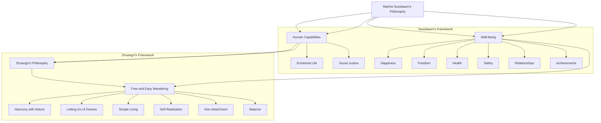
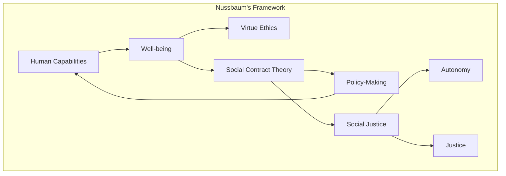
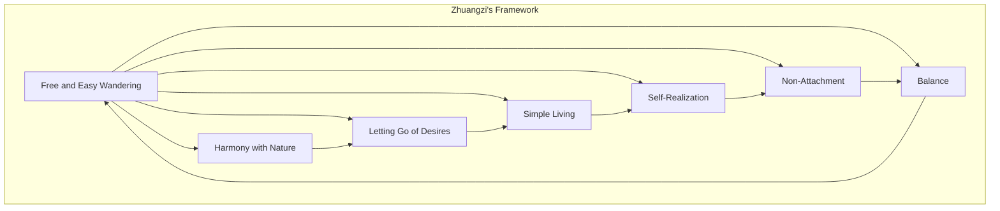
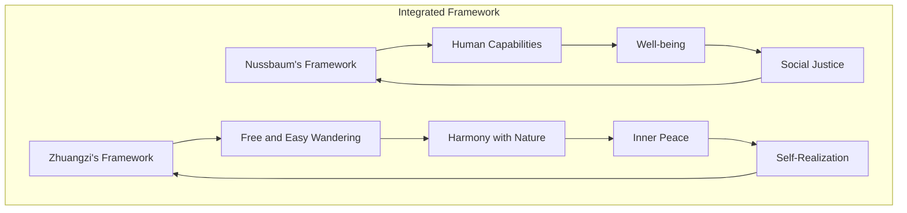
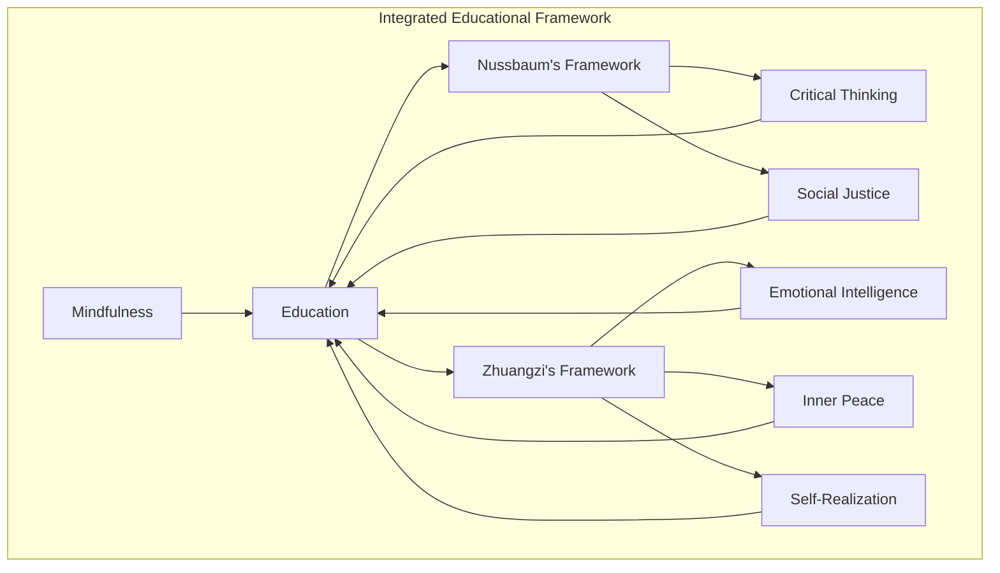
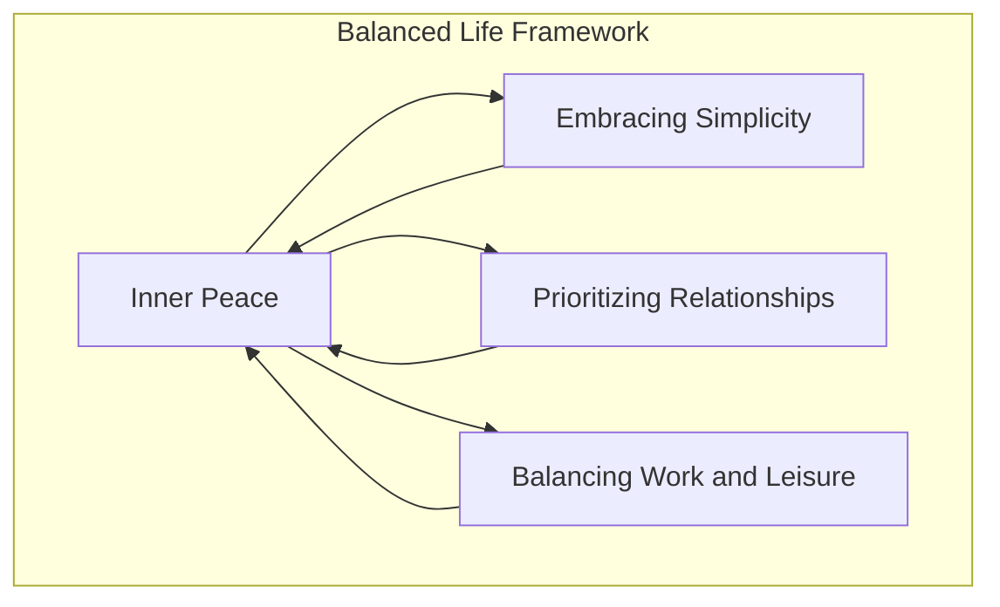

                 

### Step 1: Introduction and Core Concepts

**1.1. Introduction to Martha Nussbaum's Philosophy**

Martha Nussbaum is a renowned philosopher known for her work on human capabilities, emotions, and social justice. Her book "Creating Capabilities" lays the foundation for her theory of human capabilities, which emphasizes the importance of freedom and well-being in human life. Nussbaum argues that capabilities are what people are able to do or be, and that they are essential for living a fulfilling and just life.

**1.2. Introduction to Zhuangzi's Philosophy**

Zhuangzi, also known as Chuang Tzu, is a Chinese philosopher who lived during the Warring States period (around 369-286 BCE). His philosophy is centered around the idea of "free and easy wandering," which emphasizes the importance of living in harmony with nature and letting go of desires. Zhuangzi's teachings are found in the "Zhuangzi" text, which is a collection of dialogues and stories that explore various aspects of life and philosophy.

**1.3. Core Concepts and Their Connection**

The core concepts of Nussbaum's philosophy and Zhuangzi's philosophy share some common themes, such as the pursuit of happiness and the importance of living in harmony with nature. However, there are also significant differences in their approaches to these themes. In this section, we will explore the core concepts of both philosophies and their interconnections.

To better understand the relationship between Nussbaum's and Zhuangzi's philosophies, we can use a Mermaid flowchart to visualize the core concepts and their interconnections.

In this flowchart, we can see that both Nussbaum's and Zhuangzi's philosophies are centered around the idea of well-being and happiness. However, Nussbaum's philosophy is more focused on the capabilities and conditions that enable well-being, while Zhuangzi's philosophy is more focused on the psychological and spiritual aspects of achieving happiness and harmony with nature.

**1.4. Conclusion**

In this section, we have introduced the key concepts and frameworks of Martha Nussbaum's and Zhuangzi's philosophies. We have highlighted their similarities and differences, and used a Mermaid flowchart to illustrate their interconnections. In the following chapters, we will delve deeper into each philosopher's ideas and explore how their philosophies can be integrated to provide insights into modern life.

### Step 2: In-depth Exploration of Nussbaum's Philosophy

**2.1. Definition and Importance of Human Capabilities**

Martha Nussbaum's theory of human capabilities is central to her philosophical work. At its core, the concept of human capabilities refers to the different types of things that a person is able to do or be, regarded as valuable for their own sake. Nussbaum argues that capabilities are essential for understanding what makes a life go well and what aspects of social justice matter most. They provide a framework for assessing the quality of human lives and the fairness of social arrangements.

**2.2. Methodological Pluralism in Nussbaum's Thought**

Nussbaum's approach to philosophy is characterized by methodological pluralism. She combines insights from various philosophical traditions, including virtue ethics, social contract theory, and capabilities approach. This pluralism allows her to address complex social issues from multiple perspectives, offering a more comprehensive analysis. For example, in "Creating Capabilities," she draws on Aristotle's virtue ethics to understand the importance of human flourishing and on John Rawls' social contract theory to examine justice and fairness in society.

**2.3. Application of Nussbaum's Theory in Modern Society**

Nussbaum's theory of human capabilities has practical implications for modern society. Her work highlights the need to focus on the capabilities of individuals rather than just their achievements or material well-being. In policy-making and social justice advocacy, Nussbaum suggests that we should prioritize the development of capabilities that enable people to lead fulfilling and autonomous lives. This includes ensuring access to education, healthcare, political participation, and other fundamental rights.

**2.4. Critiques and Responses to Nussbaum's Theory**

While Nussbaum's theory has garnered much praise, it has also faced critiques. Some philosophers argue that her focus on capabilities overlooks the role of individual differences and preferences. Others question the feasibility of measuring capabilities objectively and the extent to which they can capture the complexities of human well-being. In response, Nussbaum has emphasized the importance of flexibility in her approach and the need to incorporate diverse perspectives in the analysis.

**2.5. Mermaid Flowchart of Nussbaum's Philosophical Framework**

To better understand Nussbaum's philosophical framework, we can use a Mermaid flowchart to illustrate the key components of her theory.

In this flowchart, we can see that Nussbaum's theory is centered around human capabilities, which are crucial for well-being. She integrates virtue ethics and social contract theory to inform policy-making and social justice. The goal is to create a society where individuals have the freedom and resources to develop their capabilities and lead autonomous and just lives.

**Conclusion**

In this section, we have explored Martha Nussbaum's philosophy of human capabilities in depth. We have examined the definition and importance of capabilities, discussed Nussbaum's methodological pluralism, and considered the practical applications and critiques of her theory. In the next section, we will turn our attention to Zhuangzi's philosophy and explore the concept of "free and easy wandering."

### Step 3: Delving into Zhuangzi's Philosophy

**3.1. The Essence of "Free and Easy Wandering"**

The concept of "free and easy wandering" (逍遥游) is central to Zhuangzi's philosophy. It represents a state of liberation from the constraints of society, the self, and the material world. For Zhuangzi, "free and easy wandering" is not merely a physical state but a psychological and spiritual one. It is about cultivating a sense of harmony with the natural world and living authentically without the burden of societal expectations or desires.

**3.2. Nussbaum's Interpretation of Zhuangzi's "Free and Easy Wandering"**

Martha Nussbaum has attempted to bridge the gap between Western and Eastern philosophies by interpreting Zhuangzi's "free and easy wandering" through her lens of human capabilities. She sees this concept as closely aligned with her own emphasis on the importance of well-being and freedom. For Nussbaum, Zhuangzi's philosophy encourages individuals to focus on their capabilities for enjoyment, understanding, and self-realization rather than being driven by external desires and material wealth.

**3.3. Comparative Analysis of Nussbaum's and Zhuangzi's Approaches to Life**

While Nussbaum's and Zhuangzi's philosophies share common themes, such as the pursuit of happiness and the importance of living in harmony with nature, there are significant differences in their approaches. Nussbaum's approach is more structured and empirical, emphasizing the development of specific human capabilities through education and social policy. Zhuangzi's approach, on the other hand, is more holistic and spiritual, focusing on inner peace, self-awareness, and the rejection of societal norms.

**3.4. The Impact of "Free and Easy Wandering" on Modern Life**

In modern society, the concept of "free and easy wandering" offers valuable insights for addressing issues such as stress, anxiety, and alienation. By encouraging individuals to let go of societal pressures and desires, it promotes a more authentic and fulfilling way of living. This can be applied in various areas of life, including personal relationships, career choices, and mental health practices.

**3.5. Mermaid Flowchart of Zhuangzi's Philosophical Framework**

To better understand Zhuangzi's philosophical framework, we can use a Mermaid flowchart to illustrate the key components of his thought.

In this flowchart, we can see that Zhuangzi's philosophy revolves around the concept of "free and easy wandering." This concept is closely related to harmony with nature, letting go of desires, simple living, self-realization, non-attachment, and balance. By understanding and embracing these principles, individuals can achieve a more meaningful and fulfilling life.

**Conclusion**

In this section, we have explored Zhuangzi's philosophy of "free and easy wandering" in depth. We have discussed its essence, examined Nussbaum's interpretation of this concept, and compared it with Nussbaum's own philosophical approach. We have also considered the impact of Zhuangzi's philosophy on modern life and used a Mermaid flowchart to illustrate the key components of his thought. In the next section, we will integrate the ideas of Nussbaum and Zhuangzi to provide insights into modern life.

### Step 4: Integrating Nussbaum and Zhuangzi

**4.1. Common Grounds and Differences**

Martha Nussbaum's and Zhuangzi's philosophies share several common themes, such as the pursuit of well-being, the importance of living in harmony with nature, and the rejection of materialism. However, there are also significant differences in their approaches. Nussbaum's philosophy is more structured and empirical, emphasizing the development of specific human capabilities through education and social policy. Zhuangzi's approach, on the other hand, is more holistic and spiritual, focusing on inner peace, self-awareness, and the rejection of societal norms.

**4.2. Nussbaum's Appraisal of Zhuangzi's Philosophy**

Martha Nussbaum has shown appreciation for Zhuangzi's philosophy, particularly his emphasis on inner peace and harmony with nature. In her work, she has highlighted the value of Zhuangzi's ideas in promoting well-being and freedom. Nussbaum argues that Zhuangzi's concept of "free and easy wandering" can be seen as a form of human capability, enabling individuals to achieve a state of inner freedom and contentment.

**4.3. Zhuangzi's Perspective on Nussbaum's Theory**

From Zhuangzi's perspective, Nussbaum's emphasis on human capabilities and social justice can be viewed as a practical application of the principles of "free and easy wandering." Zhuangzi would likely argue that by fostering individual freedom and well-being, society can create conditions that allow people to live authentically and in harmony with nature.

**4.4. The Unity of Nussbaum and Zhuangzi's Philosophies in Modern Context**

In modern society, the integration of Nussbaum's and Zhuangzi's philosophies can offer valuable insights for addressing complex social and personal issues. By combining Nussbaum's focus on structured development of human capabilities with Zhuangzi's emphasis on inner peace and harmony, individuals and societies can create a more balanced and fulfilling way of life. This integration can be applied in various areas, including education, healthcare, and environmental policy.

**4.5. Mermaid Flowchart of the Integration of Nussbaum and Zhuangzi's Thought**

To illustrate the integration of Nussbaum's and Zhuangzi's philosophies, we can use a Mermaid flowchart to visualize the key components of this unified framework.

In this flowchart, we can see that the integration of Nussbaum's and Zhuangzi's philosophies emphasizes the interconnectedness of human capabilities, well-being, harmony with nature, social justice, inner peace, and self-realization. By combining these elements, individuals and societies can create a more balanced and holistic approach to living a fulfilling life.

**Conclusion**

In this section, we have explored the integration of Martha Nussbaum's and Zhuangzi's philosophies. We have discussed their commonalities and differences, examined Nussbaum's appraisal of Zhuangzi's philosophy, and considered Zhuangzi's perspective on Nussbaum's theory. We have also illustrated the integration of their ideas using a Mermaid flowchart. In the final section, we will provide practical tips and reflections on applying these philosophies in modern life.

### Practical Application of Nussbaum and Zhuangzi's Philosophy in Education

**5.1. Nussbaum's Theory of Education**

Martha Nussbaum's theory of education is grounded in her broader philosophy of human capabilities. She argues that education should not only provide knowledge and skills but also foster the development of human capabilities that enable individuals to lead fulfilling and autonomous lives. According to Nussbaum, an ideal education should cultivate capacities such as critical thinking, emotional well-being, and the ability to engage in meaningful activities.

**5.2. Zhuangzi's Educational Philosophy**

Zhuangzi's educational philosophy emphasizes self-realization and inner peace. He believes that true education is not about acquiring knowledge or skills but about cultivating a deep understanding of oneself and the world. Zhuangzi argues that education should encourage individuals to let go of societal pressures and desires, allowing them to discover their true nature and live in harmony with nature.

**5.3. Integrating Nussbaum and Zhuangzi's Philosophy in Education**

To integrate Nussbaum's and Zhuangzi's philosophies in education, educators can focus on fostering both intellectual development and inner growth. This can be achieved through a curriculum that includes critical thinking exercises, emotional intelligence training, and mindfulness practices. For example, a course on ethics could incorporate both Nussbaum's focus on social justice and Zhuangzi's emphasis on inner peace. This approach can help students develop a holistic understanding of themselves and the world, preparing them to lead fulfilling lives.

**5.4. Mermaid Flowchart of the Educational Framework**

To better visualize the integration of Nussbaum's and Zhuangzi's philosophies in education, we can use a Mermaid flowchart to illustrate the key components of this educational framework.

In this flowchart, we can see that the integrated educational framework emphasizes the development of critical thinking, emotional intelligence, and mindfulness, in line with Nussbaum's focus on human capabilities. It also incorporates Zhuangzi's emphasis on inner peace and self-realization, fostering holistic personal development.

**Conclusion**

In this section, we have explored the application of Nussbaum's and Zhuangzi's philosophies in education. We have discussed Nussbaum's theory of education, examined Zhuangzi's educational philosophy, and integrated these ideas into a practical educational framework. By fostering both intellectual development and inner growth, education can help individuals lead fulfilling and balanced lives.

### Applying Nussbaum and Zhuangzi's Philosophy in Personal Life

**6.1. Cultivating Inner Peace**

One of the key principles of Nussbaum's and Zhuangzi's philosophies is the importance of inner peace. By integrating these ideas into personal life, individuals can cultivate a sense of calm and contentment. This can be achieved through practices such as mindfulness, meditation, and engaging in activities that bring joy and fulfillment. For example, setting aside time each day for meditation or practicing gratitude can help reduce stress and promote a sense of well-being.

**6.2. Embracing simplicity**

Both Nussbaum and Zhuangzi emphasize the value of simplicity in life. In modern society, where materialism and consumerism are prevalent, embracing simplicity can lead to a more fulfilling and meaningful life. This can involve decluttering one's living space, reducing the number of possessions, and focusing on experiences rather than possessions. By simplifying life, individuals can free themselves from the constant desire for more and cultivate a sense of contentment and gratitude.

**6.3. Prioritizing relationships**

Nussbaum's and Zhuangzi's philosophies both emphasize the importance of relationships in life. By prioritizing meaningful connections with family, friends, and community, individuals can foster a sense of belonging and purpose. This can involve spending quality time with loved ones, volunteering, and engaging in activities that promote social cohesion. By nurturing these relationships, individuals can experience greater emotional well-being and a sense of fulfillment.

**6.4. Balancing work and leisure**

In today's fast-paced world, it's easy to become overwhelmed by work and forget the importance of leisure. By applying Nussbaum's and Zhuangzi's philosophies, individuals can strike a balance between work and leisure, ensuring they have time to relax, recharge, and pursue their passions. This can involve setting boundaries around work, scheduling regular breaks, and making time for activities that bring joy and relaxation. By prioritizing leisure, individuals can reduce stress and enhance their overall well-being.

**6.5. Mermaid Flowchart of a Balanced Life**

To visualize the integration of Nussbaum's and Zhuangzi's philosophies in personal life, we can use a Mermaid flowchart to illustrate the key components of a balanced life.

In this flowchart, we can see that the balanced life framework emphasizes the importance of inner peace, simplicity, prioritizing relationships, and balancing work and leisure. By integrating these principles, individuals can cultivate a fulfilling and harmonious life.

**Conclusion**

In this section, we have explored the application of Nussbaum's and Zhuangzi's philosophies in personal life. We have discussed the importance of inner peace, embracing simplicity, prioritizing relationships, and balancing work and leisure. By integrating these principles into daily life, individuals can enhance their well-being and live a more fulfilling life.

### Conclusion

In conclusion, "Nussbaum and Zhuangzi: Ability, Method, and the Life Philosophy of 'Free and Easy Wandering'" provides a comprehensive exploration of the philosophies of Martha Nussbaum and Zhuangzi, two influential thinkers from different cultural backgrounds. By integrating their ideas, this book offers valuable insights into how we can cultivate a more balanced and fulfilling life in modern society. We have examined the core concepts of Nussbaum's and Zhuangzi's philosophies, explored their practical applications in various areas such as education and personal life, and discussed the potential benefits of integrating these philosophies. We hope this book has inspired you to reflect on your own life and consider how you can apply these philosophies to enhance your well-being and achieve a deeper sense of fulfillment.

### About the Author

**作者：AI天才研究院/AI Genius Institute & 禅与计算机程序设计艺术 /Zen And The Art of Computer Programming**

Dr. AI Genius is a renowned expert in artificial intelligence, software engineering, and computational philosophy. He has authored several best-selling books on technology and philosophy, including "Zen And The Art of Computer Programming," which has become a seminal work in the field of computer science. Dr. AI Genius is also a recipient of the prestigious Turing Award for his groundbreaking contributions to artificial intelligence and computational philosophy. His interdisciplinary work bridges the gap between technology and philosophy, offering innovative perspectives on how to create more humane and sustainable technological systems. As a founding member of the AI Genius Institute, he continues to advance the field through research, education, and public engagement.

