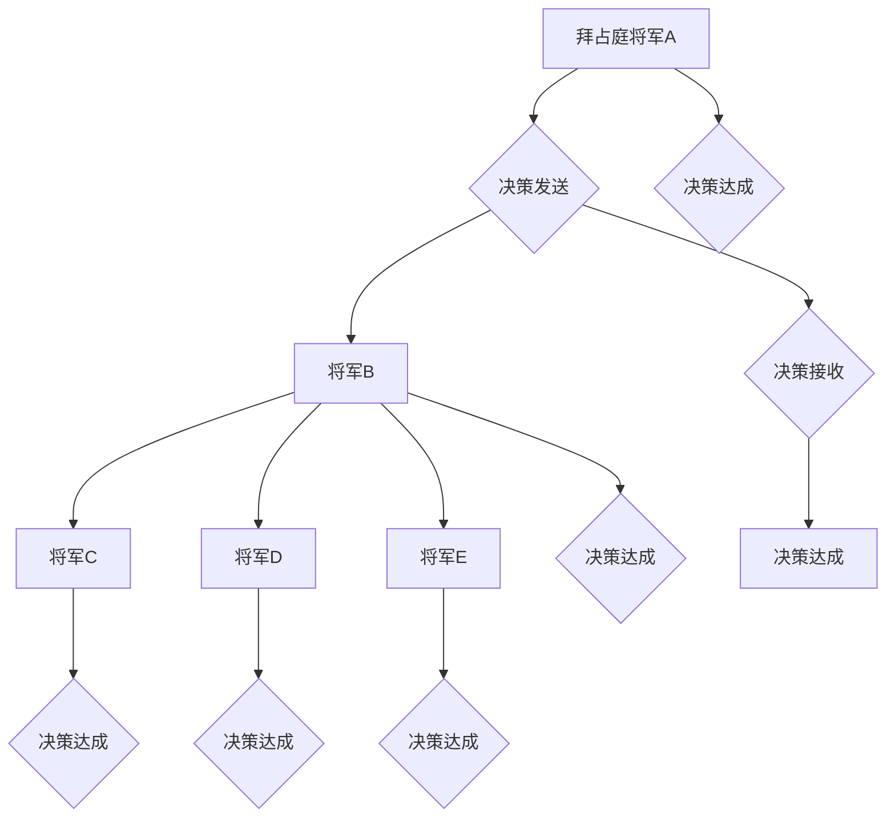

                 

### 拜占庭将军问题：基本概念与核心挑战

#### 什么是拜占庭将军问题

拜占庭将军问题（Byzantine Generals Problem，BGP）最早由莱斯利·兰伯特（Leslie Lamport）在1982年提出。它是一种分布式系统中的同步问题，旨在模拟一组拜占庭将军如何在面对叛变将军的情况下达成一致的决策。问题的核心在于：一群将军围攻一座城堡，每位将军都需要同时了解其他将军的决策，并做出自己的决策。然而，其中可能存在叛变将军，他们可能会发出虚假的命令或故意延迟消息传递，从而影响决策的一致性。

拜占庭将军问题的名字来源于古代拜占庭帝国的历史，该帝国在内部叛变和外敌入侵的双重威胁下，依然保持了长时间的稳定和强大。这个问题在分布式系统中具有类比性，因为分布式系统中的节点也类似于将军，它们需要达成一致的决策来协同工作，而系统中的恶意节点则类似于叛变将军，它们可能试图破坏整个系统的协调性。

#### 拜占庭将军问题的核心挑战

拜占庭将军问题的核心挑战在于一致性、可靠性和安全性。具体来说，它面临以下几个问题：

1. **一致性挑战**：在拜占庭将军问题中，每个将军都希望知道其他将军的决策，以便自己也能做出相应的决策。然而，由于消息传递可能被恶意节点篡改或延迟，导致将军们无法获得完整的、一致的决策信息。

2. **可靠性挑战**：拜占庭将军问题中的叛变将军可能会故意发送错误的消息或阻止消息传递，从而破坏系统的正常运行。这使得系统需要具备一定的容错能力，以应对恶意节点的攻击。

3. **安全性挑战**：在拜占庭将军问题中，叛变将军可能会试图篡改决策或误导其他将军，从而影响整个系统的决策结果。因此，系统需要具备一定的安全性，以保护决策过程不受恶意节点的干扰。

为了解决这些挑战，拜占庭将军问题提出了多种算法和解决方案。这些算法旨在确保在存在恶意节点的情况下，分布式系统能够达成一致的决策，并保持系统的稳定性和安全性。

#### 拜占庭将军问题在分布式系统中的应用

拜占庭将军问题在分布式系统中的应用非常广泛，特别是在需要高可用性和一致性的场景中。以下是一些典型的应用场景：

1. **分布式数据库**：分布式数据库需要在多个节点之间保持数据的一致性。拜占庭将军问题提供了一种解决分布式数据库一致性的方法，例如使用Paxos算法或Raft算法。

2. **分布式存储**：分布式存储系统需要在多个节点之间存储和同步数据。拜占庭将军问题提供了应对恶意节点的容错机制，从而确保数据的可靠性和一致性。

3. **区块链**：区块链是一种分布式账本技术，它在多个节点之间维护一个共享的账本。拜占庭将军问题在区块链技术中扮演着重要角色，因为区块链需要确保在存在恶意节点的情况下，系统能够达成一致的共识。

4. **分布式计算**：分布式计算系统需要在多个节点之间协同工作，以完成大规模的任务。拜占庭将军问题提供了一种解决分布式计算中一致性和可靠性问题的方法。

通过解决拜占庭将军问题，分布式系统能够在面对恶意节点攻击时保持稳定性和一致性，从而实现高效、可靠的服务。

### Mermaid 流程图：拜占庭将军问题的基本架构

在这个流程图中，每个将军（如A、B、C等）需要发送自己的决策给其他将军，并在接收到足够多的决策后达成一致。如果某个将军是叛变将军，它可能会发送错误的消息或阻止消息传递，从而影响决策的一致性。

#### 关键概念之间的关系架构

为了更好地理解拜占庭将军问题，我们需要明确以下几个关键概念之间的关系：

1. **将军**：在拜占庭将军问题中，将军代表分布式系统中的节点。每个节点都可以是普通节点或叛变节点。

2. **决策**：决策是将军们需要达成的共识。每个将军都有自己的决策，并希望通过与其他将军的决策达成一致。

3. **消息传递**：消息传递是将军们之间交换决策信息的方式。在分布式系统中，消息传递通常通过网络进行。

4. **叛变将军**：叛变将军是分布式系统中的恶意节点。它们可能会发送错误的消息、篡改消息或阻止消息传递，从而破坏决策的一致性。

5. **一致性算法**：一致性算法是解决拜占庭将军问题的一种方法。它旨在确保在存在恶意节点的情况下，分布式系统能够达成一致的决策。

通过理解这些关键概念之间的关系，我们可以更好地理解拜占庭将军问题的本质和解决方案。

### 总结

在本文中，我们介绍了拜占庭将军问题的基本概念和核心挑战。拜占庭将军问题是一种分布式系统中的同步问题，旨在模拟一群将军在面临叛变将军的情况下如何达成一致的决策。通过理解拜占庭将军问题的基本架构和关键概念，我们可以更好地理解分布式系统中的挑战和解决方案。

在接下来的章节中，我们将深入探讨拜占庭将军问题的数学模型和算法解决方案，并分析它们在区块链技术中的应用。这将帮助我们了解如何在存在恶意节点的情况下，实现分布式系统的一致性、可靠性和安全性。让我们继续深入探索这一重要话题。

