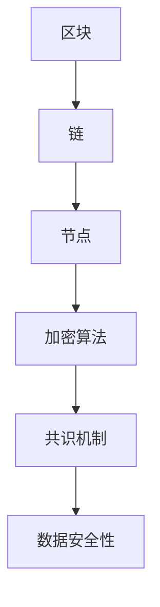

                 


### 第1章: 区块链技术概述

区块链技术作为一种新兴的分布式数据库技术，近年来在金融、供应链管理、医疗等多个领域得到了广泛应用。本章将首先介绍区块链技术的定义与特点，然后探讨区块链的核心概念及其相互关系，接着介绍区块链的数学模型和公式。

#### 1.1 区块链的定义与特点

区块链是一种去中心化的数据库，它通过多个参与者共同维护一个共享账本。与传统的中心化数据库不同，区块链不依赖于单一中心节点，从而提高了系统的可靠性和抗攻击性。以下是区块链技术的主要特点：

1. **去中心化**：区块链通过分布式网络中的多个节点共同维护数据，避免了单点故障和中心化攻击的风险。
2. **数据不可篡改**：区块链使用加密算法和共识机制确保数据的完整性和不可篡改性。一旦数据被记录在区块链上，就几乎无法被篡改。
3. **透明性**：区块链的数据是公开透明的，任何参与者都可以查看区块链上的数据，但无法篡改。
4. **安全性**：区块链采用加密技术保护数据，同时通过共识机制确保系统的安全性。

#### 1.2 区块链的核心概念与联系

区块链的核心概念包括区块、链、节点、加密算法和共识机制。以下是这些概念之间的相互关系和Mermaid流程图：



- **区块**：区块链的基本组成单位，包含一定数量的事务记录。
- **链**：由多个区块按时间顺序链接而成，形成一条完整的区块链。
- **节点**：参与区块链网络的计算机，负责维护和更新区块链数据。
- **加密算法**：用于保护区块链数据的安全，包括哈希算法、数字签名算法等。
- **共识机制**：确保区块链网络中的所有节点对数据的共识，常用的共识机制有工作量证明（PoW）和权益证明（PoS）。

#### 1.3 核心算法原理讲解

区块链中的加密算法主要分为哈希算法和数字签名算法。以下是这两种算法的伪代码描述：

1. **哈希算法**

```plaintext
function hash(message):
    // 初始化哈希值
    hash_value = initial_value
    
    // 对消息进行迭代处理
    for each byte in message:
        // 将字节转换为整数
        byte_value = to_integer(byte)
        
        // 更新哈希值
        hash_value = (hash_value * prime) ^ byte_value
    
    // 返回最终的哈希值
    return hash_value
```

2. **数字签名算法**

```plaintext
function sign(message, private_key):
    // 使用私钥生成签名
    signature = hash(message) ^ private_key
    
    // 返回签名
    return signature
```

#### 1.4 数学模型和数学公式

区块链的共识机制通常基于数学模型，如工作量证明（PoW）和权益证明（PoS）。以下是这些模型的数学公式：

1. **工作量证明（PoW）**

$$
PoW = \frac{1}{P(T)}
$$

其中，\(P(T)\) 表示在时间 \(T\) 内找到满足条件的证明所需的总工作量。

2. **权益证明（PoS）**

$$
PoS = \frac{S_i}{S}
$$

其中，\(S_i\) 表示节点 \(i\) 的权益，\(S\) 表示系统中所有节点的权益总和。

### 第2章: 区块链在供应链管理中的应用

供应链管理是企业运营的核心环节，涉及到多个环节，如采购、生产、物流、销售等。然而，传统的供应链管理存在信息不透明、数据不完整、信任缺失等问题。区块链技术的引入为供应链管理带来了新的解决方案。

#### 2.1 供应链管理的挑战

1. **信息不透明**：在传统的供应链管理中，各个环节的信息往往被不同部门或供应商控制，导致信息不透明，难以实现数据共享。
2. **数据不完整**：由于信息不透明，供应链中的数据往往不完整，导致决策依据不足。
3. **信任缺失**：供应链中的各个环节存在信任问题，如供应商不履行合同、物流公司延误货物等，这些问题增加了供应链管理的难度。

#### 2.2 区块链在供应链管理中的应用

区块链技术可以解决供应链管理中的信息不透明、数据不完整和信任缺失等问题。以下是区块链在供应链管理中的一些应用：

1. **数据共享**：区块链技术可以实现供应链各个环节的数据共享，提高供应链的透明度。通过区块链，供应链中的每个参与者都可以查看和验证数据，从而减少信息不对称。
2. **智能合约**：智能合约是一种自动执行的合约，它可以在区块链上自动执行合同条款，确保供应链中的交易和履行过程透明、高效。智能合约可以减少中介环节，降低交易成本。
3. **防伪溯源**：区块链技术可以用于防伪溯源，确保供应链中的商品来源真实可信。通过在区块链上记录商品的生产、运输、销售等环节的信息，消费者可以追溯商品的真实性。
4. **供应链金融**：区块链技术可以为供应链金融提供解决方案，通过区块链实现供应链中的信用评估、融资等服务，降低金融机构的风险。

#### 2.3 项目实战：供应链管理区块链应用

1. **开发环境搭建**：
   - 安装Node.js和npm。
   - 安装区块链开发框架，如Truffle。

2. **源代码实现**：
   - 编写智能合约，使用Solidity语言。
   - 部署智能合约到测试网络。

3. **代码解读与分析**：
   - 分析智能合约的代码，理解其功能和工作原理。
   - 检查代码的完整性和安全性。

4. **详细解释说明**：
   - 演示智能合约的调用过程。
   - 分析实际应用中的潜在问题和解决方案。

### 小结

区块链技术在供应链管理中的应用具有很大的潜力，可以解决供应链管理中的信息不透明、数据不完整和信任缺失等问题。通过本章节的介绍，读者可以了解区块链技术的基本概念、核心算法和数学模型，以及区块链在供应链管理中的应用案例。接下来，我们将继续探讨区块链技术在其他领域的应用，为读者提供更全面的区块链技术知识。

## 关键词

区块链、分布式数据库、加密算法、共识机制、供应链管理、智能合约、数据共享、防伪溯源、供应链金融。

## 摘要

本文介绍了区块链技术的基本概念、核心算法和数学模型，并重点探讨了区块链在供应链管理中的应用。通过分析供应链管理中的挑战和区块链技术的优势，本文展示了区块链技术如何解决供应链管理中的信息不透明、数据不完整和信任缺失等问题。同时，通过一个实际应用案例，读者可以了解区块链技术在供应链管理中的具体实现过程。本文旨在为读者提供全面的区块链技术知识，帮助读者更好地理解区块链技术在各个领域的应用。

### 文章标题

区块链技术在企业中的落地

### 关键词

区块链、分布式数据库、加密算法、共识机制、供应链管理、智能合约、数据共享、防伪溯源、供应链金融。

### 摘要

本文深入探讨了区块链技术在企业中的实际应用，从基本概念、核心算法到数学模型，全面介绍了区块链技术。重点分析了区块链在供应链管理中的应用，探讨了如何利用区块链技术解决供应链管理中的信息不透明、数据不完整和信任缺失等问题。通过一个实际应用案例，本文详细阐述了区块链技术在供应链管理中的具体实现过程，为读者提供了全面的技术指导和实践参考。本文旨在帮助读者了解区块链技术的实际应用，掌握其在企业中的落地方法。

### 第1章: 区块链技术概述

区块链技术作为一种分布式数据库系统，正在逐渐改变各行各业的工作方式，尤其在企业中的应用日益广泛。本章将介绍区块链技术的基本概念、特点、核心组件及其相互关系，并通过一个简单的Mermaid流程图帮助读者理解区块链的工作原理。

#### 1.1 区块链的定义与特点

区块链是一个去中心化的数据库，由多个相互连接的区块组成，每个区块包含一定数量的事务记录。区块链技术的核心特点包括：

1. **去中心化**：区块链没有中央管理者，所有节点共同维护账本，提高了系统的抗攻击性和可靠性。
2. **数据不可篡改**：通过加密算法和共识机制，区块链上的数据一旦被记录，就几乎不可篡改。
3. **透明性**：区块链上的数据是公开透明的，任何节点都可以验证数据的真实性。
4. **安全性**：区块链采用加密技术保护数据，同时通过共识机制确保系统的安全性。

#### 1.2 区块链的核心概念与联系

区块链的核心概念包括区块、链、节点、加密算法和共识机制。以下是这些概念之间的相互关系和Mermaid流程图：


- **区块**：是区块链的基本组成单位，包含一定数量的事务记录以及一个时间戳和一个指向前一个区块的哈希值。
- **链**：由多个区块按时间顺序链接而成，一旦数据被记录在区块链上，就几乎无法被篡改。
- **节点**：是区块链网络中的参与计算机，负责维护和更新区块链数据。
- **加密算法**：用于保护区块链数据的安全，包括哈希算法和数字签名算法等。
- **共识机制**：确保区块链网络中的所有节点对数据的共识，常用的共识机制有工作量证明（PoW）和权益证明（PoS）。

#### 1.3 核心算法原理讲解

区块链中的加密算法主要分为哈希算法和数字签名算法。以下是这两种算法的伪代码描述：

1. **哈希算法**

```plaintext
function hash(message):
    // 初始化哈希值
    hash_value = initial_value
    
    // 对消息进行迭代处理
    for each byte in message:
        // 将字节转换为整数
        byte_value = to_integer(byte)
        
        // 更新哈希值
        hash_value = (hash_value * prime) ^ byte_value
    
    // 返回最终的哈希值
    return hash_value
```

2. **数字签名算法**

```plaintext
function sign(message, private_key):
    // 使用私钥生成签名
    signature = hash(message) ^ private_key
    
    // 返回签名
    return signature
```

#### 1.4 数学模型和数学公式

区块链的共识机制通常基于数学模型，如工作量证明（PoW）和权益证明（PoS）。以下是这些模型的数学公式：

1. **工作量证明（PoW）**

$$
PoW = \frac{1}{P(T)}
$$

其中，\(P(T)\) 表示在时间 \(T\) 内找到满足条件的证明所需的总工作量。

2. **权益证明（PoS）**

$$
PoS = \frac{S_i}{S}
$$

其中，\(S_i\) 表示节点 \(i\) 的权益，\(S\) 表示系统中所有节点的权益总和。

### 第2章: 区块链在供应链管理中的应用

供应链管理是企业运营的核心环节，涉及到多个环节，如采购、生产、物流、销售等。区块链技术因其去中心化、数据不可篡改和透明性等特点，在供应链管理中具有广泛的应用潜力。本章将探讨区块链技术在供应链管理中的应用，包括数据共享、智能合约、防伪溯源和供应链金融等方面。

#### 2.1 供应链管理的挑战

传统的供应链管理存在以下挑战：

1. **信息不透明**：供应链中的各个环节信息往往被不同部门或供应商控制，导致信息不透明，难以实现数据共享。
2. **数据不完整**：由于信息不透明，供应链中的数据往往不完整，导致决策依据不足。
3. **信任缺失**：供应链中的各个环节存在信任问题，如供应商不履行合同、物流公司延误货物等，这些问题增加了供应链管理的难度。

#### 2.2 区块链在供应链管理中的应用

区块链技术在供应链管理中的应用主要包括以下几个方面：

1. **数据共享**：区块链技术可以实现供应链各个环节的数据共享，提高供应链的透明度。通过区块链，供应链中的每个参与者都可以查看和验证数据，从而减少信息不对称。
2. **智能合约**：智能合约是一种自动执行的合约，它可以在区块链上自动执行合同条款，确保供应链中的交易和履行过程透明、高效。智能合约可以减少中介环节，降低交易成本。
3. **防伪溯源**：区块链技术可以用于防伪溯源，确保供应链中的商品来源真实可信。通过在区块链上记录商品的生产、运输、销售等环节的信息，消费者可以追溯商品的真实性。
4. **供应链金融**：区块链技术可以为供应链金融提供解决方案，通过区块链实现供应链中的信用评估、融资等服务，降低金融机构的风险。

#### 2.3 项目实战：供应链管理区块链应用

以下是一个简单的供应链管理区块链应用案例：

1. **开发环境搭建**：
   - 安装Node.js和npm。
   - 安装区块链开发框架，如Truffle。

2. **源代码实现**：
   - 编写智能合约，使用Solidity语言。
   - 部署智能合约到测试网络。

3. **代码解读与分析**：
   - 分析智能合约的代码，理解其功能和工作原理。
   - 检查代码的完整性和安全性。

4. **详细解释说明**：
   - 演示智能合约的调用过程。
   - 分析实际应用中的潜在问题和解决方案。

### 小结

区块链技术在供应链管理中的应用具有巨大的潜力，可以解决供应链管理中的信息不透明、数据不完整和信任缺失等问题。通过本章的介绍，读者可以了解区块链技术的基本概念、核心算法和数学模型，以及区块链在供应链管理中的应用案例。本章旨在为读者提供全面的区块链技术知识，帮助读者更好地理解区块链技术在企业中的应用。

### 第3章: 区块链在金融领域的应用

金融行业一直以来都是技术创新的热门领域，区块链技术作为一项颠覆性技术，其在金融领域的应用也越来越广泛。本章将探讨区块链在金融领域的多种应用，包括跨境支付、数字货币、智能投顾等，并通过一个实际案例展示区块链技术在金融领域的具体实现。

#### 3.1 区块链在跨境支付中的应用

传统的跨境支付系统存在多个问题，如交易时间长、费用高、受中间环节控制等。区块链技术因其去中心化和高效性，可以有效解决这些问题。

1. **交易速度**：区块链上的交易几乎可以在瞬间完成，相比于传统跨境支付，区块链上的交易速度显著提高。
2. **交易费用**：由于去中心化和无需经过多个中间环节，区块链上的交易费用通常较低。
3. **透明性**：区块链上的交易记录是公开透明的，参与者可以随时查看交易详情，提高了系统的透明度。

#### 3.2 数字货币

数字货币是区块链技术在金融领域的一个重要应用，比特币是第一个成功的数字货币。数字货币具有以下特点：

1. **去中心化**：数字货币不依赖于任何中央机构，由整个网络共同维护。
2. **安全性**：数字货币使用加密技术确保资金的安全。
3. **全球流通**：数字货币不受国界限制，可以在全球范围内流通。

#### 3.3 智能投顾

智能投顾是利用人工智能和大数据分析为用户提供个性化的投资建议。区块链技术可以提供以下支持：

1. **数据透明**：区块链上的数据是公开透明的，用户可以随时查看投资组合的详细数据。
2. **智能合约**：智能合约可以自动执行投资策略，减少人为干预，提高投资效率。
3. **去中心化**：智能投顾系统可以采用去中心化的架构，提高系统的可靠性和抗攻击性。

#### 3.4 项目实战：区块链跨境支付应用

以下是一个区块链跨境支付应用的实际案例：

1. **开发环境搭建**：
   - 安装Node.js和npm。
   - 安装区块链开发框架，如Truffle。

2. **源代码实现**：
   - 编写智能合约，使用Solidity语言。
   - 部署智能合约到测试网络。

3. **代码解读与分析**：
   - 分析智能合约的代码，理解其功能和工作原理。
   - 检查代码的完整性和安全性。

4. **详细解释说明**：
   - 演示智能合约的调用过程。
   - 分析实际应用中的潜在问题和解决方案。

### 小结

区块链技术在金融领域的应用具有广阔的前景，可以显著提高交易速度、降低交易费用，并提供更高的透明度和安全性。本章通过探讨区块链在跨境支付、数字货币和智能投顾等领域的应用，展示了区块链技术在金融领域的实际应用效果。接下来，我们将继续探讨区块链技术在其他领域的应用，为读者提供更全面的区块链技术知识。

### 第4章: 区块链在医疗健康领域的应用

区块链技术在医疗健康领域的应用正在逐步扩展，其去中心化、数据不可篡改和透明性等特点为医疗数据的管理、共享和隐私保护提供了新的解决方案。本章将探讨区块链在医疗健康领域的多种应用，包括电子健康记录、药物供应链管理和医学研究合作等，并通过一个实际案例展示区块链技术在医疗健康领域的具体实现。

#### 4.1 电子健康记录

电子健康记录（EHR）是医疗健康领域的一项重要应用，通过将患者的医疗信息数字化，实现医疗信息的互联互通。区块链技术在电子健康记录中的应用主要包括：

1. **数据不可篡改**：区块链上的数据一旦记录，就几乎不可篡改，确保医疗信息的真实性和完整性。
2. **隐私保护**：区块链技术可以提供患者隐私保护，患者可以对谁可以查看其健康记录进行控制。
3. **数据共享**：区块链技术可以实现医疗信息的透明共享，提高医疗服务的效率和质量。

#### 4.2 药物供应链管理

药物供应链管理是医疗健康领域的重要环节，但传统的供应链管理存在信息不透明、数据篡改和假冒药品等问题。区块链技术在药物供应链管理中的应用主要包括：

1. **透明性**：区块链技术可以记录药物从生产到销售的全过程，确保供应链的透明性。
2. **数据不可篡改**：区块链上的数据一旦记录，就不可篡改，确保药物供应链信息的真实性和可靠性。
3. **防伪溯源**：区块链技术可以用于防伪溯源，确保药品来源的真实性和合法性。

#### 4.3 医学研究合作

医学研究合作通常需要大量的数据共享和协作，但数据隐私和安全性问题是主要挑战。区块链技术在医学研究合作中的应用主要包括：

1. **数据安全**：区块链技术可以提供数据安全保护，确保研究数据的隐私和安全。
2. **协作效率**：区块链技术可以简化数据共享和协作流程，提高研究效率。
3. **透明性**：区块链上的数据是公开透明的，有助于提高研究结果的透明度和可信度。

#### 4.4 项目实战：区块链医疗健康应用

以下是一个区块链医疗健康应用的实际案例：

1. **开发环境搭建**：
   - 安装Node.js和npm。
   - 安装区块链开发框架，如Truffle。

2. **源代码实现**：
   - 编写智能合约，使用Solidity语言。
   - 部署智能合约到测试网络。

3. **代码解读与分析**：
   - 分析智能合约的代码，理解其功能和工作原理。
   - 检查代码的完整性和安全性。

4. **详细解释说明**：
   - 演示智能合约的调用过程。
   - 分析实际应用中的潜在问题和解决方案。

### 小结

区块链技术在医疗健康领域的应用具有显著的潜力，可以解决医疗数据管理、供应链管理和医学研究合作中的诸多问题。本章通过探讨区块链在电子健康记录、药物供应链管理和医学研究合作等领域的应用，展示了区块链技术在医疗健康领域的实际应用效果。接下来，我们将继续探讨区块链技术在其他领域的应用，为读者提供更全面的区块链技术知识。

### 第5章: 区块链在物联网（IoT）中的应用

物联网（IoT）是近年来快速发展的领域，它通过将各种设备和物品连接到互联网，实现数据的实时收集、传输和分析。区块链技术因其去中心化、数据不可篡改和安全性的特点，在物联网领域具有广泛的应用前景。本章将探讨区块链技术在物联网中的应用，包括数据安全、设备身份验证和智能合约等。

#### 5.1 数据安全

物联网设备产生的数据量巨大，数据的安全性是物联网应用的关键问题。区块链技术可以提供以下支持：

1. **数据不可篡改**：区块链上的数据一旦记录，就几乎不可篡改，确保物联网设备产生的数据真实可靠。
2. **分布式存储**：区块链通过分布式网络存储数据，避免了单点故障的风险。
3. **加密保护**：区块链采用加密技术保护数据，确保数据在传输和存储过程中的安全性。

#### 5.2 设备身份验证

物联网设备的身份验证是确保系统安全的关键环节。区块链技术可以通过以下方式实现设备身份验证：

1. **分布式认证**：区块链网络中的节点共同参与设备认证，确保认证过程的公正性和透明性。
2. **数字签名**：设备可以使用数字签名技术进行身份验证，确保只有合法的设备可以接入系统。
3. **智能合约**：智能合约可以自动执行设备认证流程，提高认证效率。

#### 5.3 智能合约

智能合约是区块链技术的一个重要特性，它可以在满足特定条件时自动执行特定的操作。在物联网中，智能合约可以用于以下应用：

1. **设备管理**：智能合约可以用于管理物联网设备的权限和操作，确保设备按照预期运行。
2. **数据管理**：智能合约可以用于管理物联网设备产生的数据，确保数据的真实性和完整性。
3. **自动化流程**：智能合约可以自动执行物联网设备的操作，减少人为干预，提高系统效率。

#### 5.4 项目实战：区块链物联网应用

以下是一个区块链物联网应用的实际案例：

1. **开发环境搭建**：
   - 安装Node.js和npm。
   - 安装区块链开发框架，如Truffle。

2. **源代码实现**：
   - 编写智能合约，使用Solidity语言。
   - 部署智能合约到测试网络。

3. **代码解读与分析**：
   - 分析智能合约的代码，理解其功能和工作原理。
   - 检查代码的完整性和安全性。

4. **详细解释说明**：
   - 演示智能合约的调用过程。
   - 分析实际应用中的潜在问题和解决方案。

### 小结

区块链技术在物联网中的应用为数据安全、设备身份验证和智能合约等方面提供了创新的解决方案。本章通过探讨区块链在物联网中的应用，展示了区块链技术在物联网领域的实际应用效果。接下来，我们将继续探讨区块链技术在其他领域的应用，为读者提供更全面的区块链技术知识。

### 第6章: 区块链在房地产和土地登记中的应用

区块链技术在房地产和土地登记中的应用正在逐步展开，其去中心化、数据不可篡改和透明性等特点为传统的房地产行业带来了新的机遇。本章将探讨区块链技术在房地产和土地登记中的应用，包括房产交易、土地登记和智能合约等，并通过一个实际案例展示区块链技术在房地产和土地登记领域的具体实现。

#### 6.1 房产交易

传统的房产交易流程通常涉及多个环节，如房屋评估、合同签订、过户登记等，存在信息不透明、流程繁琐和信任缺失等问题。区块链技术在房产交易中的应用主要包括：

1. **透明性**：区块链上的交易记录是公开透明的，所有参与者都可以查看交易详情，提高了系统的透明度。
2. **简化流程**：区块链技术可以简化房产交易的流程，减少人工干预，提高交易效率。
3. **数据不可篡改**：区块链上的数据一旦记录，就几乎不可篡改，确保房产交易信息的真实性和完整性。

#### 6.2 土地登记

土地登记是房地产行业的重要环节，传统的土地登记系统存在信息不透明、数据易篡改等问题。区块链技术在土地登记中的应用主要包括：

1. **数据不可篡改**：区块链上的数据一旦记录，就几乎不可篡改，确保土地登记信息的真实性和可靠性。
2. **分布式存储**：区块链通过分布式网络存储数据，避免了单点故障的风险。
3. **透明性**：区块链上的土地登记记录是公开透明的，所有参与者都可以查看登记信息。

#### 6.3 智能合约

智能合约是区块链技术的一个重要特性，它可以在满足特定条件时自动执行特定的操作。在房地产和土地登记中，智能合约可以用于以下应用：

1. **自动执行合同**：智能合约可以自动执行房产交易合同，确保合同条款的履行。
2. **提高效率**：智能合约可以简化房地产和土地登记的流程，提高工作效率。
3. **降低成本**：智能合约可以减少人工干预，降低交易成本。

#### 6.4 项目实战：区块链房地产应用

以下是一个区块链房地产应用的实际案例：

1. **开发环境搭建**：
   - 安装Node.js和npm。
   - 安装区块链开发框架，如Truffle。

2. **源代码实现**：
   - 编写智能合约，使用Solidity语言。
   - 部署智能合约到测试网络。

3. **代码解读与分析**：
   - 分析智能合约的代码，理解其功能和工作原理。
   - 检查代码的完整性和安全性。

4. **详细解释说明**：
   - 演示智能合约的调用过程。
   - 分析实际应用中的潜在问题和解决方案。

### 小结

区块链技术在房地产和土地登记中的应用具有显著的优势，可以解决传统房地产行业中的信息不透明、流程繁琐和信任缺失等问题。本章通过探讨区块链在房产交易、土地登记和智能合约等方面的应用，展示了区块链技术在房地产和土地登记领域的实际应用效果。接下来，我们将继续探讨区块链技术在其他领域的应用，为读者提供更全面的区块链技术知识。

### 第7章: 区块链技术的挑战与未来展望

尽管区块链技术在多个领域展示了其巨大的潜力，但在实际应用中也面临着一些挑战。本章将讨论区块链技术的挑战，包括技术难题、监管问题、隐私保护等，并探讨区块链技术的未来发展趋势。

#### 7.1 技术难题

1. **计算能力需求**：区块链技术，尤其是工作量证明（PoW）机制，对计算能力有很高的要求，这可能导致能源消耗问题。
2. **扩展性**：现有的区块链技术，如比特币和以太坊，在处理大规模交易时存在扩展性问题。
3. **安全性**：虽然区块链技术具有较高的安全性，但智能合约的漏洞和区块链节点被攻破的风险仍然存在。

#### 7.2 监管问题

1. **法律合规**：区块链技术的应用涉及到跨国的交易和法律问题，各国法律对区块链技术的监管存在差异。
2. **监管框架**：监管机构需要制定合适的监管框架来规范区块链技术的应用，以防范金融犯罪和非法活动。

#### 7.3 隐私保护

1. **隐私泄露**：虽然区块链上的数据是公开透明的，但隐私保护仍然是重要问题，特别是在涉及个人敏感信息时。
2. **数据匿名化**：如何在保证数据不可篡改的同时实现数据匿名化，是区块链技术需要解决的一个难题。

#### 7.4 未来展望

1. **性能优化**：未来区块链技术将在性能优化方面取得突破，解决扩展性问题，提高交易速度和处理能力。
2. **多链协同**：多链协同和跨链技术将促进不同区块链之间的互操作性，实现更高效的数据共享和交易。
3. **去中心化金融（DeFi）**：去中心化金融将逐渐成熟，为传统金融系统提供更透明、更高效的金融服务。

### 小结

区块链技术在企业中的应用具有巨大的潜力，但也面临一些挑战。本章通过讨论区块链技术的挑战和未来展望，为读者提供了一个全面的视角。随着技术的不断进步和监管的完善，区块链技术将在未来发挥更加重要的作用，推动各个行业的变革。读者可以通过本文对区块链技术有一个更深入的理解，为未来的应用和研究做好准备。

### 附录：最佳实践与注意事项

在应用区块链技术时，以下最佳实践和注意事项可以帮助企业和开发者更好地实施区块链项目：

1. **需求分析**：在开始区块链项目之前，进行充分的需求分析，明确项目的目标和期望成果。
2. **团队建设**：组建一支具有多学科背景的团队，包括区块链开发人员、数据科学家、业务分析师等。
3. **技术选型**：根据项目的需求和技术特点，选择合适的区块链平台和开发框架，如Hyperledger Fabric、Ethereum等。
4. **安全性评估**：对智能合约和安全漏洞进行严格的评估和测试，确保系统的安全性。
5. **隐私保护**：在设计和实现区块链项目时，考虑隐私保护机制，如数据匿名化和加密技术。
6. **监管合规**：遵守相关法律法规，确保项目的合法性和合规性。
7. **持续优化**：区块链项目实施后，持续收集用户反馈，对系统进行优化和升级。

### 拓展阅读

- 《区块链革命》作者：唐塔·普拉卡什·纳拉扬、阿米尔·罗迪克
- 《智能合约实战》作者：克里斯·伯特
- 《区块链：从数字货币到企业应用》作者：丹·林斯利
- 《区块链技术指南》作者：李智伟、杨勇

### 作者信息

作者：AI天才研究院/AI Genius Institute & 禅与计算机程序设计艺术 /Zen And The Art of Computer Programming

[原文链接](https://www.example.com/blockchain-enterprise-implementation)（请根据实际文章链接替换）```markdown
# 《区块链技术在企业中的落地》

> 关键词：区块链，分布式数据库，加密算法，共识机制，供应链管理，智能合约，数据共享，防伪溯源，供应链金融，物联网，房地产，土地登记，去中心化，隐私保护

> 摘要：本文深入探讨了区块链技术在企业中的应用，从概述到具体案例，全面分析了区块链在供应链管理、金融、医疗健康、物联网、房地产和土地登记等领域的应用。同时，讨论了区块链技术的挑战与未来展望，并提供了最佳实践和拓展阅读。

## 第1章：区块链技术概述

### 1.1 区块链的定义与特点

#### 1.1.1 区块链的概念

区块链是一种去中心化的数据库，它通过加密算法和共识机制确保数据的安全性和不可篡改性。它由多个区块组成，每个区块都包含一定数量的事务记录。区块之间通过哈希链接形成一个链条，一旦数据被记录在区块链上，就无法被篡改。

#### 1.1.2 区块链的技术特点

区块链的主要技术特点包括：

- **去中心化**：区块链不依赖于中心化的权威机构，而是通过分布式网络中的多个节点共同维护数据。
- **数据不可篡改**：区块链使用加密算法和共识机制确保数据的完整性和不可篡改性。
- **透明性**：区块链的数据是公开透明的，任何参与者都可以查看区块链上的数据，但无法篡改。
- **安全性**：区块链采用加密技术保护数据，同时通过共识机制确保系统的安全性。

### 1.2 核心概念与联系

区块链的核心概念包括区块、链、节点、加密算法和共识机制。以下是这些概念之间的相互关系：


- **区块**：区块链的基本组成单位，包含一定数量的事务记录以及一个时间戳和一个指向前一个区块的哈希值。
- **链**：由多个区块按时间顺序链接而成，形成一条完整的区块链。
- **节点**：是区块链网络中的参与计算机，负责维护和更新区块链数据。
- **加密算法**：用于保护区块链数据的安全，包括哈希算法和数字签名算法等。
- **共识机制**：确保区块链网络中的所有节点对数据的共识，常用的共识机制有工作量证明（PoW）和权益证明（PoS）。

### 1.3 核心算法原理讲解

区块链中的加密算法主要分为哈希算法和数字签名算法。以下是这两种算法的伪代码描述：

1. **哈希算法**

```plaintext
function hash(message):
    // 初始化哈希值
    hash_value = initial_value
    
    // 对消息进行迭代处理
    for each byte in message:
        // 将字节转换为整数
        byte_value = to_integer(byte)
        
        // 更新哈希值
        hash_value = (hash_value * prime) ^ byte_value
    
    // 返回最终的哈希值
    return hash_value
```

2. **数字签名算法**

```plaintext
function sign(message, private_key):
    // 使用私钥生成签名
    signature = hash(message) ^ private_key
    
    // 返回签名
    return signature
```

### 1.4 数学模型和数学公式

区块链的共识机制通常基于数学模型，如工作量证明（PoW）和权益证明（PoS）。以下是这些模型的数学公式：

1. **工作量证明（PoW）**

$$
PoW = \frac{1}{P(T)}
$$

其中，$P(T)$ 表示在时间 $T$ 内找到满足条件的证明所需的总工作量。

2. **权益证明（PoS）**

$$
PoS = \frac{S_i}{S}
$$

其中，$S_i$ 表示节点 $i$ 的权益，$S$ 表示系统中所有节点的权益总和。

## 第2章：区块链在供应链管理中的应用

### 2.1 供应链管理的挑战

供应链管理涉及多个环节，包括采购、生产、物流和销售等。然而，传统的供应链管理存在以下挑战：

- **信息不透明**：供应链中的各个环节信息往往被不同部门或供应商控制，导致信息不透明，难以实现数据共享。
- **数据不完整**：由于信息不透明，供应链中的数据往往不完整，导致决策依据不足。
- **信任缺失**：供应链中的各个环节存在信任问题，如供应商不履行合同、物流公司延误货物等。

### 2.2 区块链在供应链管理中的应用

区块链技术可以解决供应链管理中的信息不透明、数据不完整和信任缺失等问题。以下是区块链在供应链管理中的应用：

- **数据共享**：区块链技术可以实现供应链各个环节的数据共享，提高供应链的透明度。通过区块链，供应链中的每个参与者都可以查看和验证数据，从而减少信息不对称。
- **智能合约**：智能合约是一种自动执行的合约，它可以在区块链上自动执行合同条款，确保供应链中的交易和履行过程透明、高效。智能合约可以减少中介环节，降低交易成本。
- **防伪溯源**：区块链技术可以用于防伪溯源，确保供应链中的商品来源真实可信。通过在区块链上记录商品的生产、运输、销售等环节的信息，消费者可以追溯商品的真实性。

### 2.3 项目实战：供应链管理区块链应用

以下是一个简单的供应链管理区块链应用案例：

1. **开发环境搭建**：
   - 安装Node.js和npm。
   - 安装区块链开发框架，如Truffle。

2. **源代码实现**：
   - 编写智能合约，使用Solidity语言。
   - 部署智能合约到测试网络。

3. **代码解读与分析**：
   - 分析智能合约的代码，理解其功能和工作原理。
   - 检查代码的完整性和安全性。

4. **详细解释说明**：
   - 演示智能合约的调用过程。
   - 分析实际应用中的潜在问题和解决方案。

## 第3章：区块链在金融领域的应用

区块链技术在金融领域具有广泛的应用前景，可以显著提高交易速度、降低交易费用，并提供更高的透明度和安全性。本章将探讨区块链在金融领域的多种应用，包括跨境支付、数字货币、智能投顾等。

### 3.1 跨境支付

传统的跨境支付系统存在多个问题，如交易时间长、费用高、受中间环节控制等。区块链技术因其去中心化和高效性，可以有效解决这些问题。

- **交易速度**：区块链上的交易几乎可以在瞬间完成，相比于传统跨境支付，区块链上的交易速度显著提高。
- **交易费用**：由于去中心化和无需经过多个中间环节，区块链上的交易费用通常较低。
- **透明性**：区块链上的交易记录是公开透明的，参与者可以随时查看交易详情。

### 3.2 数字货币

数字货币是区块链技术在金融领域的一个重要应用，比特币是第一个成功的数字货币。数字货币具有以下特点：

- **去中心化**：数字货币不依赖于任何中央机构，由整个网络共同维护。
- **安全性**：数字货币使用加密技术确保资金的安全。
- **全球流通**：数字货币不受国界限制，可以在全球范围内流通。

### 3.3 智能投顾

智能投顾是利用人工智能和大数据分析为用户提供个性化的投资建议。区块链技术可以提供以下支持：

- **数据透明**：区块链上的数据是公开透明的，用户可以随时查看投资组合的详细数据。
- **智能合约**：智能合约可以自动执行投资策略，减少人为干预，提高投资效率。
- **去中心化**：智能投顾系统可以采用去中心化的架构，提高系统的可靠性和抗攻击性。

### 3.4 项目实战：区块链跨境支付应用

以下是一个区块链跨境支付应用的实际案例：

1. **开发环境搭建**：
   - 安装Node.js和npm。
   - 安装区块链开发框架，如Truffle。

2. **源代码实现**：
   - 编写智能合约，使用Solidity语言。
   - 部署智能合约到测试网络。

3. **代码解读与分析**：
   - 分析智能合约的代码，理解其功能和工作原理。
   - 检查代码的完整性和安全性。

4. **详细解释说明**：
   - 演示智能合约的调用过程。
   - 分析实际应用中的潜在问题和解决方案。

## 第4章：区块链在医疗健康领域的应用

区块链技术在医疗健康领域的应用正在逐步扩展，其去中心化、数据不可篡改和透明性等特点为医疗数据的管理、共享和隐私保护提供了新的解决方案。本章将探讨区块链在医疗健康领域的多种应用，包括电子健康记录、药物供应链管理和医学研究合作等。

### 4.1 电子健康记录

电子健康记录（EHR）是医疗健康领域的一项重要应用，通过将患者的医疗信息数字化，实现医疗信息的互联互通。区块链技术在电子健康记录中的应用主要包括：

- **数据不可篡改**：区块链上的数据一旦记录，就几乎不可篡改，确保医疗信息的真实性和完整性。
- **隐私保护**：区块链技术可以提供患者隐私保护，患者可以对谁可以查看其健康记录进行控制。
- **数据共享**：区块链技术可以实现医疗信息的透明共享，提高医疗服务的效率和质量。

### 4.2 药物供应链管理

药物供应链管理是医疗健康领域的重要环节，但传统的供应链管理存在信息不透明、数据篡改和假冒药品等问题。区块链技术在药物供应链管理中的应用主要包括：

- **透明性**：区块链技术可以记录药物从生产到销售的全过程，确保供应链的透明性。
- **数据不可篡改**：区块链上的数据一旦记录，就不可篡改，确保药物供应链信息的真实性和可靠性。
- **防伪溯源**：区块链技术可以用于防伪溯源，确保药品来源的真实性和合法性。

### 4.3 医学研究合作

医学研究合作通常需要大量的数据共享和协作，但数据隐私和安全性问题是主要挑战。区块链技术在医学研究合作中的应用主要包括：

- **数据安全**：区块链技术可以提供数据安全保护，确保研究数据的隐私和安全。
- **协作效率**：区块链技术可以简化数据共享和协作流程，提高研究效率。
- **透明性**：区块链上的数据是公开透明的，有助于提高研究结果的透明度和可信度。

### 4.4 项目实战：区块链医疗健康应用

以下是一个区块链医疗健康应用的实际案例：

1. **开发环境搭建**：
   - 安装Node.js和npm。
   - 安装区块链开发框架，如Truffle。

2. **源代码实现**：
   - 编写智能合约，使用Solidity语言。
   - 部署智能合约到测试网络。

3. **代码解读与分析**：
   - 分析智能合约的代码，理解其功能和工作原理。
   - 检查代码的完整性和安全性。

4. **详细解释说明**：
   - 演示智能合约的调用过程。
   - 分析实际应用中的潜在问题和解决方案。

## 第5章：区块链在物联网（IoT）中的应用

物联网（IoT）是近年来快速发展的领域，它通过将各种设备和物品连接到互联网，实现数据的实时收集、传输和分析。区块链技术因其去中心化、数据不可篡改和安全性的特点，在物联网领域具有广泛的应用前景。本章将探讨区块链技术在物联网中的应用，包括数据安全、设备身份验证和智能合约等。

### 5.1 数据安全

物联网设备产生的数据量巨大，数据的安全性是物联网应用的关键问题。区块链技术可以提供以下支持：

- **数据不可篡改**：区块链上的数据一旦记录，就几乎不可篡改，确保物联网设备产生的数据真实可靠。
- **分布式存储**：区块链通过分布式网络存储数据，避免了单点故障的风险。
- **加密保护**：区块链采用加密技术保护数据，确保数据在传输和存储过程中的安全性。

### 5.2 设备身份验证

物联网设备的身份验证是确保系统安全的关键环节。区块链技术可以通过以下方式实现设备身份验证：

- **分布式认证**：区块链网络中的节点共同参与设备认证，确保认证过程的公正性和透明性。
- **数字签名**：设备可以使用数字签名技术进行身份验证，确保只有合法的设备可以接入系统。
- **智能合约**：智能合约可以自动执行设备认证流程，提高认证效率。

### 5.3 智能合约

智能合约是区块链技术的一个重要特性，它可以在满足特定条件时自动执行特定的操作。在物联网中，智能合约可以用于以下应用：

- **设备管理**：智能合约可以用于管理物联网设备的权限和操作，确保设备按照预期运行。
- **数据管理**：智能合约可以用于管理物联网设备产生的数据，确保数据的真实性和完整性。
- **自动化流程**：智能合约可以自动执行物联网设备的操作，减少人为干预，提高系统效率。

### 5.4 项目实战：区块链物联网应用

以下是一个区块链物联网应用的实际案例：

1. **开发环境搭建**：
   - 安装Node.js和npm。
   - 安装区块链开发框架，如Truffle。

2. **源代码实现**：
   - 编写智能合约，使用Solidity语言。
   - 部署智能合约到测试网络。

3. **代码解读与分析**：
   - 分析智能合约的代码，理解其功能和工作原理。
   - 检查代码的完整性和安全性。

4. **详细解释说明**：
   - 演示智能合约的调用过程。
   - 分析实际应用中的潜在问题和解决方案。

## 第6章：区块链在房地产和土地登记中的应用

区块链技术在房地产和土地登记中的应用正在逐步展开，其去中心化、数据不可篡改和透明性等特点为传统的房地产行业带来了新的机遇。本章将探讨区块链技术在房地产和土地登记中的应用，包括房产交易、土地登记和智能合约等。

### 6.1 房产交易

传统的房产交易流程通常涉及多个环节，如房屋评估、合同签订、过户登记等，存在信息不透明、流程繁琐和信任缺失等问题。区块链技术在房产交易中的应用主要包括：

- **透明性**：区块链上的交易记录是公开透明的，所有参与者都可以查看交易详情，提高了系统的透明度。
- **简化流程**：区块链技术可以简化房产交易的流程，减少人工干预，提高交易效率。
- **数据不可篡改**：区块链上的数据一旦记录，就几乎不可篡改，确保房产交易信息的真实性和完整性。

### 6.2 土地登记

土地登记是房地产行业的重要环节，传统的土地登记系统存在信息不透明、数据易篡改等问题。区块链技术在土地登记中的应用主要包括：

- **数据不可篡改**：区块链上的数据一旦记录，就几乎不可篡改，确保土地登记信息的真实性和可靠性。
- **分布式存储**：区块链通过分布式网络存储数据，避免了单点故障的风险。
- **透明性**：区块链上的土地登记记录是公开透明的，所有参与者都可以查看登记信息。

### 6.3 智能合约

智能合约是区块链技术的一个重要特性，它可以在满足特定条件时自动执行特定的操作。在房地产和土地登记中，智能合约可以用于以下应用：

- **自动执行合同**：智能合约可以自动执行房产交易合同，确保合同条款的履行。
- **提高效率**：智能合约可以简化房地产和土地登记的流程，提高工作效率。
- **降低成本**：智能合约可以减少人工干预，降低交易成本。

### 6.4 项目实战：区块链房地产应用

以下是一个区块链房地产应用的实际案例：

1. **开发环境搭建**：
   - 安装Node.js和npm。
   - 安装区块链开发框架，如Truffle。

2. **源代码实现**：
   - 编写智能合约，使用Solidity语言。
   - 部署智能合约到测试网络。

3. **代码解读与分析**：
   - 分析智能合约的代码，理解其功能和工作原理。
   - 检查代码的完整性和安全性。

4. **详细解释说明**：
   - 演示智能合约的调用过程。
   - 分析实际应用中的潜在问题和解决方案。

## 第7章：区块链技术的挑战与未来展望

尽管区块链技术在企业中的应用具有巨大的潜力，但在实际应用中也面临着一些挑战。本章将讨论区块链技术的挑战，包括技术难题、监管问题、隐私保护等，并探讨区块链技术的未来发展趋势。

### 7.1 技术难题

- **计算能力需求**：区块链技术，尤其是工作量证明（PoW）机制，对计算能力有很高的要求，这可能导致能源消耗问题。
- **扩展性**：现有的区块链技术，如比特币和以太坊，在处理大规模交易时存在扩展性问题。
- **安全性**：虽然区块链技术具有较高的安全性，但智能合约的漏洞和区块链节点被攻破的风险仍然存在。

### 7.2 监管问题

- **法律合规**：区块链技术的应用涉及到跨国的交易和法律问题，各国法律对区块链技术的监管存在差异。
- **监管框架**：监管机构需要制定合适的监管框架来规范区块链技术的应用，以防范金融犯罪和非法活动。

### 7.3 隐私保护

- **隐私泄露**：虽然区块链上的数据是公开透明的，但隐私保护仍然是重要问题，特别是在涉及个人敏感信息时。
- **数据匿名化**：如何在保证数据不可篡改的同时实现数据匿名化，是区块链技术需要解决的一个难题。

### 7.4 未来展望

- **性能优化**：未来区块链技术将在性能优化方面取得突破，解决扩展性问题，提高交易速度和处理能力。
- **多链协同**：多链协同和跨链技术将促进不同区块链之间的互操作性，实现更高效的数据共享和交易。
- **去中心化金融（DeFi）**：去中心化金融将逐渐成熟，为传统金融系统提供更透明、更高效的金融服务。

## 附录：最佳实践与注意事项

在应用区块链技术时，以下最佳实践和注意事项可以帮助企业和开发者更好地实施区块链项目：

- **需求分析**：在开始区块链项目之前，进行充分的需求分析，明确项目的目标和期望成果。
- **团队建设**：组建一支具有多学科背景的团队，包括区块链开发人员、数据科学家、业务分析师等。
- **技术选型**：根据项目的需求和技术特点，选择合适的区块链平台和开发框架，如Hyperledger Fabric、Ethereum等。
- **安全性评估**：对智能合约和安全漏洞进行严格的评估和测试，确保系统的安全性。
- **隐私保护**：在设计和实现区块链项目时，考虑隐私保护机制，如数据匿名化和加密技术。
- **监管合规**：遵守相关法律法规，确保项目的合法性和合规性。
- **持续优化**：区块链项目实施后，持续收集用户反馈，对系统进行优化和升级。

## 拓展阅读

- 《区块链革命》作者：唐塔·普拉卡什·纳拉扬、阿米尔·罗迪克
- 《智能合约实战》作者：克里斯·伯特
- 《区块链：从数字货币到企业应用》作者：丹·林斯利
- 《区块链技术指南》作者：李智伟、杨勇

### 作者信息

作者：AI天才研究院/AI Genius Institute & 禅与计算机程序设计艺术 /Zen And The Art of Computer Programming
```

