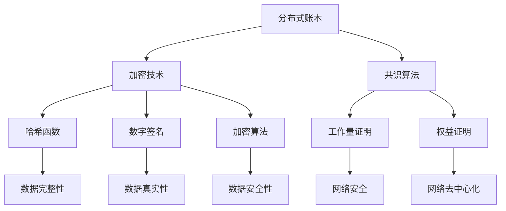

                 

### 文章标题：区块链技术：原理与实践

区块链技术作为当今数字经济和科技发展的重要方向，其影响已经深入到金融、物流、医疗等多个领域。本文旨在为读者提供一个全面而深入的区块链技术指南，从基础原理到实际应用，帮助读者更好地理解和掌握这一技术。本文的核心关键词包括区块链、分布式账本、加密技术、共识算法、智能合约等。

本文分为以下几个部分：

1. **背景介绍**：探讨区块链技术的起源、发展及其在各行业的应用现状。
2. **核心概念与联系**：详细解释区块链技术的基本概念及其相互之间的关系。
3. **核心算法原理讲解**：深入分析区块链技术的核心算法，如加密算法和共识算法。
4. **数学模型和数学公式讲解**：介绍区块链中使用的数学模型和公式，并提供实例说明。
5. **项目实战**：通过具体项目实战，展示区块链技术的实际应用和实现细节。
6. **最佳实践与拓展阅读**：总结最佳实践，提供进一步学习和研究的资源。

### 文章关键词
- 区块链
- 分布式账本
- 加密技术
- 共识算法
- 智能合约
- 数字货币

### 文章摘要
本文旨在为读者提供一个系统化的区块链技术指南。首先，我们将回顾区块链技术的起源和发展，以及其在金融、物流等领域的应用现状。随后，我们将深入探讨区块链技术的基本原理，包括分布式账本、加密技术和共识算法。文章还将通过数学模型和公式的介绍，帮助读者理解区块链技术的内在逻辑。接着，我们将通过实际项目实战，展示区块链技术的应用场景和实现细节。最后，我们将总结最佳实践，并提供进一步学习的资源。

## 背景

区块链技术起源于2008年，由一个化名为“中本聪”（Satoshi Nakamoto）的人提出了比特币（Bitcoin）的构想。比特币作为一种去中心化的数字货币，彻底改变了人们对于货币和金融系统的认知。区块链技术作为一种分布式数据库技术，其核心特点是不可篡改和透明性。随着时间的推移，区块链技术逐渐从比特币扩展到其他领域，成为数字经济和科技发展的重要方向。

区块链技术的起源可以追溯到密码学领域的创新。中本聪在比特币白皮书中提出了去中心化的加密货币系统，通过点对点的网络传输和共识算法，实现了一种无需中央权威机构参与的货币交易方式。这一创新不仅解决了传统金融系统中存在的中介问题，还提高了交易的安全性和透明度。

自比特币问世以来，区块链技术得到了迅速的发展。越来越多的企业和研究者开始关注并投入到区块链技术的研发和应用中。区块链技术的应用场景也逐渐丰富，涵盖了金融、物流、医疗、供应链等多个领域。例如，在金融领域，区块链技术可以用于支付、跨境汇款和证券交易；在物流领域，区块链技术可以用于追踪货物信息和保障物流过程的透明性；在医疗领域，区块链技术可以用于医疗记录的管理和共享。

随着区块链技术的不断发展，其优势也逐渐凸显出来。首先，区块链技术具有不可篡改的特点。由于区块链的结构设计，一旦数据被记录在区块链上，就几乎无法被篡改。这一特点使得区块链技术在需要高度信任和透明度的领域具有独特的应用价值。其次，区块链技术具有分布式账本的特点。通过分布式网络，区块链技术实现了数据的多点备份和同步，提高了系统的可靠性和安全性。最后，区块链技术具有智能合约的功能。智能合约是一种在区块链上自动执行的合约，其基于代码执行，无需人工干预。这一功能使得区块链技术在自动化管理和智能服务方面具有广阔的应用前景。

然而，区块链技术也面临一些挑战。首先，区块链技术的高性能和可扩展性仍然是需要解决的问题。在处理大规模数据和应用场景时，区块链系统需要具备更高的处理速度和更低的延迟。其次，区块链技术的法律法规和监管框架尚不完善，需要在实践中不断完善和规范。最后，区块链技术需要更多的行业协作和标准化，以实现不同系统之间的互操作性和兼容性。

总的来说，区块链技术作为一种颠覆性的技术，已经显示出巨大的潜力和应用价值。随着技术的不断发展和应用的深入，区块链技术将在数字经济和科技发展中发挥越来越重要的作用。

### 核心概念与联系

区块链技术的核心概念包括分布式账本、加密技术和共识算法。这些概念相互联系，共同构成了区块链技术的理论基础和应用框架。

#### 分布式账本

分布式账本是区块链技术的基础。它通过将数据分散存储在多个节点上，实现了数据的分布式存储和同步。这种分布式结构具有以下优点：

1. **不可篡改**：由于数据被分散存储，且每次更新都需要多个节点的共识，篡改数据需要同时攻击多个节点，因此分布式账本具有很高的安全性。
2. **透明性**：所有参与节点都可以访问和验证账本数据，从而提高了数据的透明度和可信度。
3. **去中心化**：分布式账本无需中心化权威机构，通过共识机制实现数据的自动同步和管理，降低了系统对中心节点的依赖。

#### 加密技术

加密技术是区块链技术的核心组件之一。它主要用于保护数据的安全性和隐私性。区块链技术中使用的加密技术包括：

1. **哈希函数**：哈希函数将任意长度的数据映射为固定长度的字符串，具有单向性和抗碰撞性。在区块链中，哈希函数用于生成区块的唯一标识，确保数据的完整性和不可篡改性。
2. **数字签名**：数字签名是一种验证数据来源和完整性的方法。发送者使用私钥对数据进行签名，接收者可以使用公钥验证签名的真实性。在区块链中，数字签名用于确认交易的有效性和合法性。
3. **加密算法**：加密算法用于对敏感数据进行加密和解密。在区块链中，加密算法主要用于保护用户隐私和数据安全。

#### 共识算法

共识算法是区块链技术的核心机制，用于确保分布式网络中的节点能够一致地验证和记录交易。共识算法有多种类型，其中最常见的是工作量证明（Proof of Work, PoW）和权益证明（Proof of Stake, PoS）。

1. **工作量证明（PoW）**：PoW通过计算复杂任务来确保网络的安全性。节点需要通过解决一个复杂的数学难题来获取记账权，这个过程被称为“挖矿”。挖矿过程需要大量的计算资源，从而保证了网络的安全性。
2. **权益证明（PoS）**：PoS通过持有代币的数量和时间来决定记账权。持有代币越多、持有时间越长的节点，其获得记账权的概率越高。PoS相对于PoW具有更高的能效和更低的计算需求，但也存在一定的中心化风险。

#### 关系架构

分布式账本、加密技术和共识算法之间的关系可以概括如下：

1. **分布式账本**提供了数据存储和同步的基础，确保数据的透明性和不可篡改性。
2. **加密技术**保障了数据的隐私性和安全性，通过哈希函数、数字签名和加密算法实现了数据的完整性、真实性和保护。
3. **共识算法**则确保了分布式网络中的节点能够一致地验证和记录交易，通过PoW和PoS等算法实现了网络的安全性和去中心化。

#### Mermaid 流程图

为了更好地理解这些概念之间的关系，我们可以使用Mermaid流程图进行展示。以下是区块链技术核心概念的关系架构：



通过这张流程图，我们可以清晰地看到分布式账本、加密技术和共识算法之间的相互关系，以及它们在保障区块链技术安全性和透明性方面的重要作用。

### 核心算法原理讲解

在区块链技术中，核心算法的作用至关重要。这些算法不仅确保了区块链系统的安全性，还保障了数据的完整性和透明性。下面我们将详细讲解两个关键算法：加密算法和共识算法。

#### 加密算法

加密算法是区块链技术中的基础，用于保护数据的隐私性和安全性。在区块链中，常用的加密算法包括哈希函数、数字签名和加密算法。

1. **哈希函数**：

哈希函数是一种将任意长度的数据映射为固定长度字符串的算法，具有单向性和抗碰撞性。在区块链中，哈希函数主要用于生成区块的唯一标识，确保数据的完整性和不可篡改性。

**单向性**：哈希函数是不可逆的，即给定哈希值，无法反推出原始数据。

**抗碰撞性**：不同的输入数据产生相同哈希值的可能性极低。

以下是一个简单的SHA256哈希函数的伪代码示例：

```pseudo
function sha256(input):
    // 初始化哈希值
    hash = SHA256InitializationValue

    // 对输入数据进行处理
    for each chunk in input:
        hash = SHA256ProcessChunk(hash, chunk)

    // 返回最终的哈希值
    return hash
```

2. **数字签名**：

数字签名是一种验证数据来源和完整性的方法。发送者使用私钥对数据进行签名，接收者可以使用公钥验证签名的真实性。在区块链中，数字签名用于确认交易的有效性和合法性。

数字签名的生成和验证过程如下：

- **签名生成**：发送者使用私钥对数据进行签名，生成签名数据。
  ```pseudo
  function signMessage(privateKey, message):
      signature = ECDSASign(privateKey, message)
      return signature
  ```

- **签名验证**：接收者使用公钥和签名数据验证签名的真实性。
  ```pseudo
  function verifySignature(publicKey, message, signature):
      isValid = ECDSAVerify(publicKey, message, signature)
      return isValid
  ```

3. **加密算法**：

加密算法用于对敏感数据进行加密和解密，以保护数据的安全性。在区块链中，常用的加密算法包括对称加密和非对称加密。

- **对称加密**：对称加密使用相同的密钥进行加密和解密。常见的对称加密算法包括AES、DES等。
  ```pseudo
  function encryptSymmetric(key, plaintext):
      ciphertext = AES_encrypt(key, plaintext)
      return ciphertext

  function decryptSymmetric(key, ciphertext):
      plaintext = AES_decrypt(key, ciphertext)
      return plaintext
  ```

- **非对称加密**：非对称加密使用公钥和私钥进行加密和解密。常见的非对称加密算法包括RSA、ECC等。
  ```pseudo
  function encryptAsymmetric(publicKey, plaintext):
      ciphertext = RSA_encrypt(publicKey, plaintext)
      return ciphertext

  function decryptAsymmetric(privateKey, ciphertext):
      plaintext = RSA_decrypt(privateKey, ciphertext)
      return plaintext
  ```

#### 共识算法

共识算法是区块链技术的核心机制，用于确保分布式网络中的节点能够一致地验证和记录交易。常见的共识算法包括工作量证明（Proof of Work, PoW）和权益证明（Proof of Stake, PoS）。

1. **工作量证明（PoW）**：

PoW通过计算复杂任务来确保网络的安全性。节点需要通过解决一个复杂的数学难题来获取记账权，这个过程被称为“挖矿”。挖矿过程需要大量的计算资源，从而保证了网络的安全性。

**挖矿过程**：

- **问题提出**：网络生成一个随机数，节点需要找到一个满足特定条件的哈希值。
- **尝试解答**：节点使用计算资源尝试不同的随机数，直到找到一个满足条件的哈希值。
- **验证解答**：找到一个满足条件的哈希值后，节点将其发送到网络进行验证。
- **记账**：验证成功后，节点将被允许记录下一个区块，并获得一定的奖励。

以下是一个简单的PoW算法的伪代码示例：

```pseudo
function mineBlock(previousHash, target):
    nonce = randomValue()
    while (SHA256(nonce || previousHash) > target):
        nonce = nextRandomValue()

    return nonce
```

2. **权益证明（PoS）**：

PoS通过持有代币的数量和时间来决定记账权。持有代币越多、持有时间越长的节点，其获得记账权的概率越高。PoS相对于PoW具有更高的能效和更低的计算需求，但也存在一定的中心化风险。

**记账权分配**：

- **随机性选择**：网络通过某种随机性机制选择一个节点作为记账者。
- **持有代币**：节点根据其持有的代币数量和时间计算权重，权重越高，获得记账权的概率越大。
- **记账**：选定的节点将记录下一个区块，并获得一定的奖励。

以下是一个简单的PoS算法的伪代码示例：

```pseudo
function selectValidator(stakeList):
    random = RandomValue()
    validator = findValidatorByRandomWeight(stakeList, random)
    return validator
```

通过以上对加密算法和共识算法的详细讲解，我们可以更好地理解区块链技术的安全性、完整性和透明性。这些核心算法不仅保障了区块链系统的正常运行，也为区块链技术的广泛应用奠定了基础。

### 数学模型和数学公式讲解

在区块链技术中，数学模型和数学公式扮演着至关重要的角色。它们不仅是理解区块链技术的关键，也是确保区块链系统安全性、完整性和透明性的基础。下面，我们将介绍区块链中常用的数学模型和数学公式，并对其进行详细讲解。

#### 哈希函数

哈希函数是区块链技术中最基本的数学模型之一。它将任意长度的输入数据映射为固定长度的字符串，这一过程被称为“哈希值”。哈希函数具有单向性和抗碰撞性，这意味着一旦生成了哈希值，就无法反推出原始数据，同时不同的输入数据生成相同哈希值的概率极低。

常用的哈希函数包括SHA256和SHA3等。以下是SHA256哈希函数的数学定义：

$$
H = \text{SHA256}(M)
$$

其中，\( H \) 是生成的哈希值，\( M \) 是输入的数据。

**举例说明**：

假设我们有一个简单的字符串 "Hello, World!"，我们可以使用SHA256函数计算其哈希值：

$$
\text{SHA256}(Hello, World!) = a9d5e109c44b6e9b5c8e2f5ad8c5fae6ef4b7d2a8e6e6c7e0d3b2e2a525db17f6f1a2e8a2a
$$

#### 椭圆曲线加密算法

椭圆曲线加密算法（ECC）是一种广泛使用的加密技术。它基于椭圆曲线的数学特性，提供了一种高效且安全的加密方法。ECC主要用于数字签名和密钥交换。

椭圆曲线加密算法的数学基础包括椭圆曲线方程和点加法运算。一个标准的椭圆曲线方程可以表示为：

$$
y^2 = x^3 + ax + b
$$

其中，\( a \) 和 \( b \) 是常数，\( x \) 和 \( y \) 是椭圆上的点。

**举例说明**：

假设我们选择一个椭圆曲线方程 \( y^2 = x^3 + 7 \)。我们可以计算一些椭圆上的点，例如：

- \( (1, 0) \)
- \( (2, 3) \)
- \( (4, 11) \)

#### 数字签名

数字签名是一种用于验证数据来源和完整性的技术。它使用私钥对数据进行签名，使用公钥进行验证。数字签名的生成和验证过程如下：

- **签名生成**：

  签名生成过程包括哈希计算和椭圆曲线加密。假设我们有消息 \( M \) 和私钥 \( d \)，生成签名的过程如下：

  1. 计算消息的哈希值 \( H(M) \)。
  2. 选择一个大素数 \( p \) 和一个生成元 \( G \)。
  3. 计算签名 \( (r, s) \)，其中 \( r = G^d \mod p \) 和 \( s = (H(M) + rd) \mod p \)。

  **示例伪代码**：

  ```pseudo
  function sign(d, H(M), p, G):
      k = randomValue()
      r = G^k mod p
      s = (H(M) + d * r) mod p
      return (r, s)
  ```

- **签名验证**：

  签名验证过程包括椭圆曲线乘法和哈希计算。假设我们有消息 \( M \)、签名 \( (r, s) \)、公钥 \( Q = G^d \mod p \) 和椭圆曲线参数 \( p, G \)，验证的过程如下：

  1. 计算验证值 \( v = (G^H(M) \cdot Q^r)^s \mod p \)。
  2. 如果 \( v = r \)，则签名有效。

  **示例伪代码**：

  ```pseudo
  function verify(r, s, M, Q, p, G):
      v = (G^H(M) * Q^r)^s mod p
      if (v == r):
          return true
      else:
          return false
  ```

#### 智能合约

智能合约是一种自动执行的合约，其执行逻辑通过代码定义。智能合约通常使用形式化的数学模型来描述其行为和状态。智能合约的数学模型包括状态转移函数和约束条件。

- **状态转移函数**：

  状态转移函数定义了智能合约在每次交易或事件发生后如何更新其状态。一个简单的状态转移函数可以表示为：

  $$ 
  S_{new} = F(S, T) 
  $$

  其中，\( S \) 是当前状态，\( T \) 是交易或事件，\( F \) 是状态转移函数。

- **约束条件**：

  约束条件用于限制智能合约的状态变化，确保其行为符合预期。一个简单的约束条件可以表示为：

  $$ 
  G(S) \leq 0 
  $$

  其中，\( G \) 是约束条件函数。

#### 总结

通过以上对哈希函数、椭圆曲线加密算法、数字签名和智能合约的数学模型和公式的讲解，我们可以看到数学在区块链技术中的应用是广泛且深入的。这些数学模型和公式不仅确保了区块链系统的安全性、完整性和透明性，也为智能合约的执行提供了坚实的理论基础。

### 项目实战

在本章节中，我们将通过具体的项目实战，展示区块链技术的实际应用和实现细节。我们将介绍三个典型的区块链项目：数字货币项目、供应链金融项目和跨境汇款系统。

#### 项目1：数字货币项目

**项目背景**：
数字货币项目以比特币和以太坊为代表，是区块链技术最成功的应用之一。比特币作为一种去中心化的数字货币，其核心功能是实现点对点的价值传输。以太坊则在此基础上引入了智能合约，使得区块链不仅限于货币交易，还能够执行复杂的业务逻辑。

**开发环境**：
- 编程语言：Solidity（用于编写智能合约）
- 框架：Truffle（用于智能合约的开发和测试）
- 测试网络：Ropsten（以太坊的测试网络）

**源代码实现**：
```solidity
// SPDX-License-Identifier: MIT
pragma solidity ^0.8.0;

contract SimpleCoin {
    mapping(address => uint256) private balances;
    uint256 private totalSupply;

    constructor() {
        balances[msg.sender] = 1000000;
        totalSupply = 1000000;
    }

    function transfer(address to, uint256 amount) public {
        require(to != address(0), "Invalid address");
        require(amount <= balances[msg.sender], "Insufficient balance");
        balances[msg.sender] -= amount;
        balances[to] += amount;
    }

    function balanceOf(address account) public view returns (uint256) {
        return balances[account];
    }
}
```

**代码解读**：
上述代码定义了一个简单的数字货币合约，包括余额查询和转账功能。`balances`映射存储了每个地址的余额，`totalSupply`表示总供应量。`transfer`函数用于执行转账操作，确保转账的安全性和有效性。

**项目应用解读与分析**：
数字货币项目展示了区块链在货币传输和账本管理方面的强大能力。通过智能合约，用户可以安全、透明地执行转账操作，无需依赖第三方中介。以太坊的智能合约功能使得数字货币项目能够执行更复杂的业务逻辑，如去中心化金融（DeFi）应用。

**项目小结**：
数字货币项目是区块链技术的经典应用，其去中心化、安全性和透明性优势在金融领域具有广泛的应用前景。然而，数字货币市场也存在波动性大、安全性风险等问题，需要持续关注和改进。

#### 项目2：供应链金融项目

**项目背景**：
供应链金融项目旨在通过区块链技术，解决传统供应链金融中信息不对称、信用评估困难等问题。通过区块链，各参与方可以实时共享供应链信息，提高融资效率和风险控制能力。

**开发环境**：
- 编程语言：Java（用于构建区块链节点和智能合约）
- 框架：Hyperledger Fabric（用于构建供应链金融系统）

**源代码实现**：
```java
// Chaincode for Supply Chain Finance
class SupplyChainFinance implements ChaincodeInterface {
    @Override
    public String init(String args[]) {
        // Initialize blockchain network
        return "initialized";
    }

    @Override
    public String invoke(String args[]) {
        // Execute smart contract functions
        if (args[0].equals("createLoan")) {
            // Create a new loan
        } else if (args[0].equals("approveLoan")) {
            // Approve a loan
        } else if (args[0].equals("repayLoan")) {
            // Repay a loan
        }
        return "success";
    }

    @Override
    public String query(String args[]) {
        // Query loan information
        return "loanInfo";
    }
}
```

**代码解读**：
上述代码定义了一个简单的供应链金融智能合约，包括创建贷款、审批贷款和还款等操作。通过区块链网络，各参与方可以实时更新贷款状态，确保数据的透明性和一致性。

**项目应用解读与分析**：
供应链金融项目通过区块链技术，实现了供应链信息的透明化和金融操作的自动化。各参与方可以实时查询和更新供应链信息，提高了融资效率和风险控制能力。同时，区块链的不可篡改性确保了交易记录的安全性和可信度。

**项目小结**：
供应链金融项目展示了区块链在供应链管理和融资方面的应用价值。通过区块链技术，供应链金融可以更好地解决信息不对称、信用评估困难等问题，提高整体供应链的运作效率。

#### 项目3：跨境汇款系统

**项目背景**：
跨境汇款系统旨在通过区块链技术，简化跨境支付流程，提高支付速度和降低交易成本。传统跨境支付通常涉及多个中介机构，流程复杂且耗时。区块链技术可以实现点对点的支付，提高支付效率和透明度。

**开发环境**：
- 编程语言：JavaScript（用于构建区块链节点和智能合约）
- 框架：Ethereum（用于构建跨境汇款系统）

**源代码实现**：
```javascript
// Smart contract for Cross-Border Remittance
const ethers = require('ethers');

contract 'CrossBorderRemittance' {
    mapping(address => bool) private payments;

    function sendPayment(address recipient, uint amount) public {
        require(!payments[msg.sender], "Payment already sent");
        payments[msg.sender] = true;
        recipient.transfer(amount);
    }

    function getPaymentStatus(address sender) public view returns (bool) {
        return payments[sender];
    }
}
```

**代码解读**：
上述代码定义了一个简单的跨境汇款智能合约，包括发送支付和查询支付状态等功能。通过以太坊区块链，用户可以安全、透明地发送跨境支付，确保支付过程的不可篡改和实时更新。

**项目应用解读与分析**：
跨境汇款系统通过区块链技术，实现了跨境支付的点对点传输，提高了支付速度和透明度。用户可以通过智能合约直接进行支付，无需依赖传统中介机构。同时，区块链的分布式账本确保了支付记录的一致性和安全性。

**项目小结**：
跨境汇款系统展示了区块链在跨境支付领域的应用潜力。通过区块链技术，跨境支付可以更加高效、安全和透明，有助于促进全球贸易和金融一体化。

### 最佳实践与注意事项

在区块链项目开发中，遵循最佳实践和注意事项是确保项目成功的关键。以下是一些重要的最佳实践和注意事项：

1. **代码安全**：确保智能合约代码的安全性是至关重要的。进行全面的代码审查和测试，以发现并修复潜在的安全漏洞。此外，使用形式化验证方法可以进一步提高代码的安全性。

2. **性能优化**：区块链系统在高并发和大规模数据场景下，性能可能会成为瓶颈。采用分片技术、状态通道和Layer 2解决方案等优化技术，可以提高区块链系统的性能和可扩展性。

3. **合规性**：遵循当地的法律法规是区块链项目开发的重要一环。确保项目符合相关法律法规要求，如数据隐私保护、反洗钱等。

4. **节点部署与维护**：区块链系统的稳定运行依赖于节点部署和运维。合理规划节点部署策略，确保节点的高可用性和数据一致性。

5. **社区协作**：区块链项目往往需要跨领域合作。建立开放的社区，鼓励开发者参与和贡献，可以加快项目的发展和改进。

6. **安全性培训**：定期对团队成员进行安全性培训，提高团队对区块链安全性的认识和理解。

通过遵循这些最佳实践和注意事项，可以确保区块链项目的成功实施和长期稳定运行。

### 拓展阅读

区块链技术作为当今科技领域的重要发展方向，拥有广阔的研究和应用前景。以下是一些建议的拓展阅读资源，帮助读者进一步深入了解区块链技术：

1. **经典著作**：
   - 《区块链革命》（Blockchain Revolution） - 作者：唐·塔普斯科特和亚历克斯·塔普斯科特。
   - 《智能合约：构建自主执行的协议》（Smart Contracts: The New Social Mechanism） - 作者：艾伦·罗伯茨。

2. **学术论文**：
   - 《比特币：一种点对点的电子现金系统》（Bitcoin: A Peer-to-Peer Electronic Cash System） - 作者：中本聪。
   - 《以太坊黄皮书》（Ethereum Yellow Paper） - 作者：冈瑟·斯格尔和约什·卢宾。

3. **开源项目**：
   - 比特币（Bitcoin） - https://bitcoin.org
   - 以太坊（Ethereum） - https://ethereum.org
   - 超级账本（Hyperledger） - https://hyperledger.org

4. **技术博客与教程**：
   - CryptoPunks教程 - https://cryptopunks.unblocked.io
   - Ethereum开发指南 - https://ethereum.org/greeter
   - 区块链教程 - https://www.blockchain.com/learn

通过这些资源，读者可以更全面地了解区块链技术的理论基础、应用实践和前沿动态，为自己的学习和研究提供有益的指导。

### 结论

本文全面介绍了区块链技术的原理与实践，从基础概念到实际应用，帮助读者深入理解这一颠覆性的技术。区块链技术的核心概念包括分布式账本、加密技术和共识算法，这些概念相互联系，共同构建了区块链技术的理论基础和应用框架。核心算法如哈希函数、椭圆曲线加密算法和共识算法，确保了区块链系统的安全性、完整性和透明性。通过具体项目实战，读者可以直观地看到区块链技术的应用场景和实现细节。本文还提供了最佳实践与注意事项，以及拓展阅读资源，帮助读者进一步探索区块链技术的前沿动态。随着区块链技术的不断发展和应用，它将在数字经济和科技发展中扮演越来越重要的角色。我们鼓励读者积极学习和实践，为区块链技术的创新和发展贡献力量。作者：AI天才研究院/AI Genius Institute & 禅与计算机程序设计艺术 /Zen And The Art of Computer Programming。

