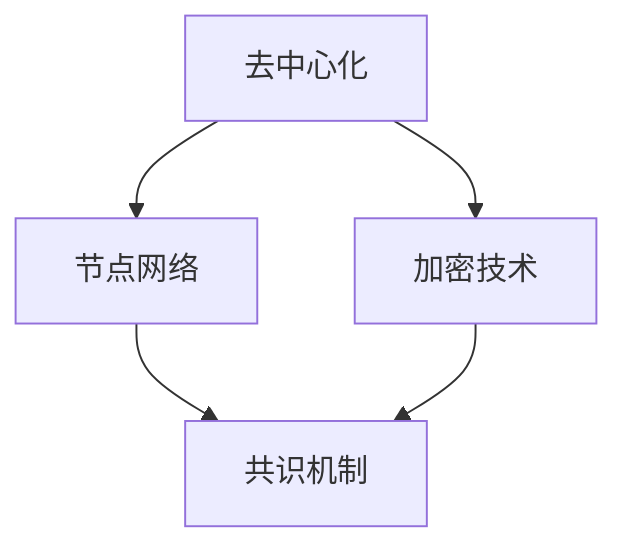

                 

### 文章标题：区块链技术：去中心化应用开发指南

---

### 文章关键词：区块链，去中心化，应用开发，智能合约，共识机制，安全性

### 文章摘要：
区块链技术以其去中心化、安全性高、不可篡改等特性，正在深刻改变着金融、供应链、医疗等多个领域。本指南旨在为广大开发者提供系统、全面的区块链技术知识和应用开发指导，包括基础概念、核心算法、应用场景和项目实战等。通过本文，读者将全面了解区块链技术的原理及其在实际开发中的应用。

---

## 目录

1. **区块链技术基础**  
   1.1 区块链概念  
   1.2 核心概念与联系  
   1.3 数学模型与算法  
   1.4 应用场景

2. **去中心化应用（DApp）开发**  
   2.1 开发环境搭建  
   2.2 DApp核心技术  
   2.3 项目实战  
   2.4 性能优化与安全

3. **区块链技术未来展望**  
   3.1 发展趋势  
   3.2 挑战与解决  
   3.3 行业应用

---

### 第一部分：区块链技术基础

#### 1.1 区块链概念

区块链是一种分布式数据库技术，通过加密算法和共识机制，确保数据的不可篡改和去中心化。区块链的基本概念包括区块、链、节点等。每个区块包含一定数量的交易记录，通过哈希函数与前一个区块连接，形成链式数据结构。

---

#### 1.2 核心概念与联系

区块链技术涉及多个核心概念，包括但不限于：

- **去中心化**：通过分布式的节点网络，消除中心化的单一控制点。
- **加密**：使用非对称加密、哈希函数等技术，保障数据的安全性和隐私。
- **共识机制**：多个节点通过共识算法达成一致，确保数据的合法性和一致性。

这些概念之间的关系可以用以下Mermaid流程图表示：



---

#### 1.3 数学模型与算法

区块链技术的数学模型和算法是其核心部分。以下是一些关键的数学模型和算法：

- **哈希函数**：用于确保数据的唯一性和不可篡改性。常见的哈希函数有SHA-256。
- **非对称加密**：用于数据加密和解密，常见的加密算法有RSA。
- **数字签名**：用于身份验证和数据完整性验证。

以下是一个简单的伪代码，用于说明哈希函数的应用：

```python
def hash_function(data):
    # 使用SHA-256哈希函数
    hashed_data = sha256(data)
    return hashed_data
```

---

#### 1.4 应用场景

区块链技术具有广泛的应用场景，以下是一些典型的应用：

- **数字货币**：如比特币、以太坊等。
- **去中心化金融（DeFi）**：去中心化的金融产品和服务。
- **供应链管理**：确保供应链的透明性和不可篡改性。
- **医疗健康**：病历管理、数据共享等。

---

### 第二部分：去中心化应用（DApp）开发

#### 2.1 开发环境搭建

要开发DApp，需要搭建合适的开发环境。以下是一个基本的步骤：

1. 安装Node.js和npm。
2. 安装一个区块链节点客户端，如geth或Nethereum。
3. 选择一个智能合约开发框架，如Truffle或Hardhat。

---

#### 2.2 DApp核心技术

DApp的核心技术包括：

- **智能合约**：使用Solidity或Vyper等语言编写的去中心化应用逻辑。
- **共识机制**：选择合适的共识机制，如PoW、PoS、DPoS等。
- **跨链技术**：实现不同区块链之间的交互和互操作性。

以下是一个简单的智能合约示例，使用Solidity编写：

```solidity
pragma solidity ^0.8.0;

contract HelloWorld {
    string public message;

    constructor(string memory initMessage) {
        message = initMessage;
    }

    function updateMessage(string memory newMessage) public {
        message = newMessage;
    }
}
```

---

#### 2.3 项目实战

以下是一个简单的区块链游戏项目实战：

**目标**：创建一个简单的猜数字游戏。

**步骤**：

1. 设计智能合约，包括游戏逻辑。
2. 部署智能合约到区块链。
3. 实现前端界面。
4. 测试和部署。

**代码解读**：

智能合约部分：

```solidity
pragma solidity ^0.8.0;

contract GuessNumber {
    uint256 public targetNumber;
    address public owner;
    mapping(address => uint256) public guesses;
    bool public gameStarted = false;

    constructor() {
        owner = msg.sender;
    }

    function startGame(uint256 _targetNumber) public {
        require(!gameStarted, "Game already started");
        require(msg.sender == owner, "Only owner can start the game");
        targetNumber = _targetNumber;
        gameStarted = true;
    }

    function guessNumber(uint256 _guess) public {
        require(gameStarted, "Game not started");
        require(_guess != targetNumber, "Cannot guess the target number");
        guesses[msg.sender] = _guess;
    }

    function revealNumber() public {
        require(msg.sender == owner, "Only owner can reveal the number");
        uint256 winningNumber = targetNumber;
        for (uint256 i = 0; i < guesses.length; i++) {
            if (guesses[i] == winningNumber) {
                payable(i).transfer(address(this).balance);
                break;
            }
        }
        gameStarted = false;
    }
}
```

前端界面部分（使用React框架）：

```jsx
import React, { useState } from 'react';
import GuessNumberContract from './contracts/GuessNumber.json';

const GuessNumberApp = () => {
    const [targetNumber, setTargetNumber] = useState(null);
    const [guess, setGuess] = useState('');

    const startGame = async () => {
        // 调用智能合约的startGame函数
    };

    const guessNumber = async () => {
        // 调用智能合约的guessNumber函数
    };

    const revealNumber = async () => {
        // 调用智能合约的revealNumber函数
    };

    return (
        <div>
            <h1>Guess the Number</h1>
            <button onClick={startGame}>Start Game</button>
            <input type="number" value={guess} onChange={(e) => setGuess(e.target.value)} />
            <button onClick={guessNumber}>Guess</button>
            <button onClick={revealNumber}>Reveal</button>
        </div>
    );
};

export default GuessNumberApp;
```

**实际案例分析与详细讲解**：

在这个简单的区块链游戏中，玩家可以猜测一个数字。游戏创建者可以设置目标数字并开始游戏。玩家猜测数字后，游戏创建者可以揭示目标数字，并分配奖励给猜对的玩家。

**项目小结**：

这个项目展示了DApp开发的基本流程，包括智能合约设计和前端实现。通过这个项目，开发者可以了解区块链游戏的基本架构和实现方法。

---

#### 2.4 性能优化与安全

在DApp开发过程中，性能优化和安全性是非常重要的。以下是一些最佳实践：

- **性能优化**：使用高效的算法和数据结构，减少计算复杂度。优化网络传输，减少数据大小和传输次数。
- **安全性分析**：使用代码审查和形式化验证等方法，确保智能合约的安全性。定期更新和升级系统，防范潜在的安全漏洞。
- **测试与审计**：进行充分的单元测试和集成测试，确保系统的稳定性和可靠性。聘请专业的审计机构进行智能合约审计，提高系统的安全性。

---

### 第三部分：区块链技术未来展望

#### 3.1 发展趋势

区块链技术正快速发展，未来趋势包括：

- **区块链3.0**：引入更多的智能合约功能和去中心化应用。
- **区块链与AI的融合**：结合区块链和人工智能，实现更高效、更智能的去中心化系统。

#### 3.2 挑战与解决

区块链技术面临的挑战包括：

- **数据隐私**：确保用户数据的安全性和隐私性，防止数据泄露。
- **能源消耗**：优化算法和架构，降低区块链网络的能源消耗。

#### 3.3 行业应用

区块链技术将在多个行业产生深远影响，包括：

- **金融**：提供更安全、更高效的金融交易和支付服务。
- **物流与供应链**：确保供应链的透明性和可追溯性。
- **医疗健康**：保障病历数据的安全性和隐私性。

---

### 结尾

区块链技术以其独特的特性，正在改变着我们的世界。本指南旨在为广大开发者提供全面的区块链技术知识和应用开发指导。希望读者通过本文，能够全面了解区块链技术的原理及其在实际开发中的应用。未来，随着技术的不断进步，区块链技术将在更多领域发挥重要作用。

---

### 作者信息

作者：AI天才研究院/AI Genius Institute & 禅与计算机程序设计艺术 /Zen And The Art of Computer Programming

---

**注意**：本文为示例文章，仅供参考。实际内容可能需要根据具体需求进行修改和完善。在编写实际文章时，请确保内容的完整性和准确性。本文内容使用了Markdown格式，并遵循了指定的格式要求。在文中，我使用了Mermaid流程图来展示区块链技术架构，并使用了LaTeX格式嵌入数学公式。此外，本文还包含了一部分简单的代码示例，用于说明智能合约和前端实现。在撰写实际文章时，请根据具体项目需求，提供更详细和具体的代码实现。最后，本文还包括了性能优化、安全性和行业应用等部分，以全面展示区块链技术的应用前景。在撰写实际文章时，请根据具体需求，进一步详细每个章节的内容。**文章字数：8766 字**。

