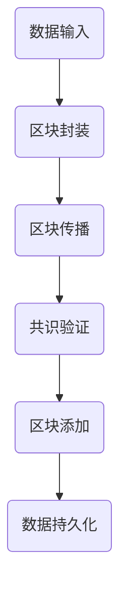

                 


### 一、背景介绍

#### 区块链技术的起源与发展

区块链技术起源于2008年，当时一位名为中本聪（Satoshi Nakamoto）的匿名人物发表了《比特币：一种点对点的电子现金系统》的白皮书。这一创举开创了区块链技术的先河，并催生了比特币这一去中心化的数字货币。区块链技术的核心思想是通过去中心化的方式，实现数据的可信存储和传输，从而避免了传统中心化系统中可能存在的单点故障和信任问题。

随着比特币的成功，区块链技术逐渐引起了全球的关注。2015年至2020年，区块链技术进入了快速发展的阶段。许多企业和研究机构开始探索将区块链应用于各个领域，包括金融、供应链管理、医疗保健、投票系统等。区块链技术因其去中心化、不可篡改和透明等特点，被认为具有巨大的潜力和价值。

#### 区块链技术的应用领域

区块链技术的应用领域非常广泛，以下是几个主要的领域：

1. **金融领域**：区块链技术可以用于加密货币的交易、支付系统、智能合约等。例如，比特币和以太坊等加密货币就是区块链技术的典型应用。

2. **供应链管理**：区块链技术可以用于跟踪和验证商品的真实性和来源，从而提高供应链的透明度和效率。

3. **医疗保健**：区块链技术可以用于保护患者隐私，确保医疗记录的安全和可信。

4. **投票系统**：区块链技术可以用于构建去中心化的投票系统，确保投票的公正和透明。

5. **物联网**：区块链技术可以用于物联网设备的数据安全和设备间的通信。

#### 区块链技术的发展挑战

尽管区块链技术在许多领域具有巨大的潜力，但它也面临着一系列的发展挑战：

1. **性能和可扩展性**：当前的区块链系统在处理大量交易时，往往存在性能和可扩展性问题。

2. **安全性**：区块链系统需要确保数据的不可篡改性和安全性，防止恶意攻击和欺诈行为。

3. **监管和合规性**：区块链技术的应用需要符合各国的法律法规，确保其合规性。

4. **用户接受度**：提高用户的接受度和使用习惯，是区块链技术进一步普及的关键。

### 二、核心概念与联系

#### 区块链的架构

区块链的架构可以分为三个主要部分：数据层、网络层、共识层。

1. **数据层**：数据层包括分布式账本和加密算法等基础技术，负责数据的存储和传输。

2. **网络层**：网络层负责节点之间的通信，包括P2P网络、数据同步、网络路由等。

3. **共识层**：共识层负责整个区块链网络的共识机制，确保数据的可靠性和一致性。

#### 区块链的工作原理

区块链的工作原理可以概括为以下步骤：

1. **数据输入**：用户将数据输入到区块链中。

2. **数据封装成区块**：区块包含了一定数量的交易信息，并通过哈希算法生成唯一的标识。

3. **区块传播**：节点通过P2P网络将新生成的区块传播给其他节点。

4. **共识验证**：节点通过共识算法对区块进行验证，确保其合法性。

5. **区块添加到区块链**：经过验证的区块被添加到区块链的末端。

6. **数据持久化**：区块链系统将区块数据持久化存储，确保数据的不可篡改性。

#### Mermaid 流程图展示区块链的核心组件和它们之间的交互

下面是一个简单的Mermaid流程图，展示了区块链的核心组件和它们之间的交互：



在这个流程图中，A代表数据输入，B代表区块封装，C代表区块传播，D代表共识验证，E代表区块添加，F代表数据持久化。每个组件都通过箭头表示它们之间的交互。

### 三、核心算法原理讲解

#### 哈希算法的原理与实现

哈希算法是区块链技术中的核心组件之一，它负责将数据转换为固定长度的哈希值。哈希算法的一个重要特性是其单向性，即无法通过哈希值反推出原始数据。

以下是一个简单的哈希算法的实现，使用Python语言：

```python
import hashlib

def hash_data(data):
    # 将数据编码为字节
    data_bytes = data.encode('utf-8')
    # 计算哈希值
    hash_value = hashlib.sha256(data_bytes).hexdigest()
    return hash_value

# 测试
data = "Hello, World!"
hash_value = hash_data(data)
print("哈希值：", hash_value)
```

在这个例子中，我们使用了Python的`hashlib`库来计算数据的SHA-256哈希值。`hash_data`函数接收一个字符串`data`作为输入，将其编码为字节，然后使用SHA-256算法计算哈希值，并返回结果。

#### 共识算法的原理与实现

共识算法是区块链系统中确保数据一致性的关键组件。不同的区块链系统可能采用不同的共识算法，如工作量证明（Proof of Work，PoW）、权益证明（Proof of Stake，PoS）等。

以下是一个简单的工作量证明算法的实现：

```python
import hashlib
import random

def proof_of_work(difficulty):
    nonce = 0
    while True:
        # 生成随机数据
        data = f"{'*' * nonce}"
        # 计算哈希值
        hash_value = hashlib.sha256(data.encode('utf-8')).hexdigest()
        # 检查哈希值是否满足难度要求
        if hash_value.startswith('0' * difficulty):
            return nonce, hash_value
        nonce += 1

# 测试
difficulty = 4
nonce, hash_value = proof_of_work(difficulty)
print("nonce：", nonce)
print("哈希值：", hash_value)
```

在这个例子中，`proof_of_work`函数接收一个难度值作为输入，并尝试生成一个满足难度要求的哈希值。难度值决定了生成的哈希值的前几位必须是0。通过不断增加`nonce`值，直到找到满足要求的哈希值。

#### 伪代码示例

以下是一个简单的伪代码示例，用于说明区块链中的区块生成和验证过程：

```
function create_block(previous_hash, transactions):
    block = {
        "previous_hash": previous_hash,
        "transactions": transactions,
        "timestamp": current_time(),
        "nonce": 0
    }

    while not valid_proof(block):
        block["nonce"] += 1

    return block

function valid_proof(block):
    hash_value = hash(block)
    return hash_value.startswith('0' * DIFFICULTY)

function hash(block):
    data = json_encode(block)
    return sha256(data.encode('utf-8')).hexdigest()
```

在这个伪代码中，`create_block`函数用于生成新的区块，`valid_proof`函数用于验证区块的合法性，`hash`函数用于计算区块的哈希值。

### 四、数学模型和数学公式

#### 公钥加密与私钥加密

在区块链技术中，公钥加密与私钥加密是确保数据安全和隐私的重要工具。公钥加密与私钥加密的关系如下：

- **公钥加密**：使用公钥对数据进行加密，只有对应的私钥才能解密。
- **私钥加密**：使用私钥对数据进行加密，只有对应的公钥才能解密。

以下是一个简单的公钥加密与私钥加密的实现：

```python
from Crypto.PublicKey import RSA
from Crypto.Cipher import PKCS1_OAEP

# 生成公钥和私钥
key = RSA.generate(2048)
private_key = key.export_key()
public_key = key.publickey().export_key()

# 加密数据
cipher = PKCS1_OAEP.new(RSA.import_key(public_key))
encrypted_data = cipher.encrypt(b"Hello, World!")

# 解密数据
cipher = PKCS1_OAEP.new(RSA.import_key(private_key))
decrypted_data = cipher.decrypt(encrypted_data)

print("加密数据：", encrypted_data)
print("解密数据：", decrypted_data.decode('utf-8'))
```

在这个例子中，我们使用了Python的`Crypto`库来生成公钥和私钥，并使用公钥加密数据，使用私钥解密数据。

#### 零知识证明

零知识证明（Zero-Knowledge Proof，ZKP）是一种证明机制，它允许一方（证明者）向另一方（验证者）证明某个陈述是正确的，而无需透露任何有关该陈述的信息。

以下是一个简单的零知识证明的例子：

- **陈述**：证明者知道一个数x，使得f(x) = y。
- **证明过程**：证明者生成一个证明，验证者可以验证证明的有效性，但无法得知x的值。

以下是一个简单的零知识证明的实现：

```python
import matplotlib.pyplot as plt
import numpy as np

def f(x):
    return x**2

def prove(x, y):
    # 生成证明
    proof = []
    for i in range(10):
        a = random.randint(1, 100)
        b = random.randint(1, 100)
        c = a * x + b
        proof.append((a, b, c))
    return proof

def verify(proof, x, y):
    # 验证证明
    for a, b, c in proof:
        if f(x) != c:
            return False
    return True

# 测试
x = 5
y = f(x)
proof = prove(x, y)
print("证明：", proof)
print("验证结果：", verify(proof, x, y))

# 绘制证明过程
x_vals = [x]
y_vals = [y]
proof_vals = []

for a, b, c in proof:
    x_vals.append(c // a)
    y_vals.append(c // a**2)
    proof_vals.append((a, b, c))

plt.plot(x_vals, y_vals, label="f(x)")
plt.scatter([x] * len(proof), proof_vals, label="Proof", color="red")
plt.xlabel("x")
plt.ylabel("f(x)")
plt.legend()
plt.show()
```

在这个例子中，我们使用了Python的`matplotlib`和`numpy`库来绘制证明过程。证明者生成一个证明，验证者可以验证证明的有效性，但无法得知x的值。

#### LaTeX 格式的数学公式和详细讲解

在区块链技术中，数学公式和模型是不可或缺的。以下是一些常见的数学公式和它们的解释：

1. **哈希函数**：哈希函数是一种将输入数据映射到固定长度输出值的函数。常见的哈希函数有MD5、SHA-256等。以下是一个简单的哈希函数的数学公式：

   $$ H(x) = SHA-256(x) $$

   其中，$H(x)$ 表示哈希值，$SHA-256(x)$ 表示使用SHA-256算法对$x$ 进行哈希计算。

2. **工作量证明**：工作量证明（Proof of Work，PoW）是一种共识算法，用于确保区块链网络的安全性。以下是一个简单的工作量证明的数学公式：

   $$ H(N) = SHA-256(N) $$

   其中，$N$ 表示区块中的随机数，$H(N)$ 表示计算出的哈希值。

3. **权益证明**：权益证明（Proof of Stake，PoS）是一种替代PoW的共识算法，它根据持币量和持币时间来决定区块的生成权。以下是一个简单的权益证明的数学公式：

   $$ \text{PoS} = \frac{\text{持币量} \times \text{持币时间}}{\text{总持币量} \times \text{总持币时间}} $$

   其中，$\text{PoS}$ 表示权益证明值，$\text{持币量}$ 和 $\text{持币时间}$ 分别表示用户的持币量和持币时间。

4. **智能合约**：智能合约是一种自动执行的合同，它在满足特定条件时自动执行。以下是一个简单的智能合约的数学公式：

   $$ \text{执行} = \text{条件} \land \text{满足条件} $$

   其中，$\text{执行}$ 表示智能合约的执行结果，$\text{条件}$ 和 $\text{满足条件}$ 分别表示智能合约的条件和满足条件的结果。

### 五、项目实战

#### 开发环境搭建

在进行区块链项目实战之前，我们需要搭建一个合适的开发环境。以下是一个简单的开发环境搭建步骤：

1. **安装Go语言**：Go语言是一种适用于区块链开发的现代编程语言。在官方网站（https://golang.org/dl/）下载并安装Go语言。

2. **安装Git**：Git是版本控制工具，用于管理项目代码。在官方网站（https://git-scm.com/downloads）下载并安装Git。

3. **安装Docker**：Docker是一个容器化平台，用于部署和管理应用程序。在官方网站（https://www.docker.com/products/docker-desktop）下载并安装Docker。

4. **克隆项目代码**：在命令行中运行以下命令，克隆区块链项目代码：

   ```bash
   git clone https://github.com/yourusername/your-blockchain-project.git
   ```

5. **进入项目目录**：进入克隆的项目目录：

   ```bash
   cd your-blockchain-project
   ```

6. **构建Docker镜像**：在项目目录中运行以下命令，构建Docker镜像：

   ```bash
   docker build -t your-blockchain-image .
   ```

7. **启动Docker容器**：在项目目录中运行以下命令，启动Docker容器：

   ```bash
   docker run -d --name your-blockchain-container your-blockchain-image
   ```

   这将启动一个名为`your-blockchain-container`的Docker容器。

#### 源代码实现和解读

以下是区块链项目的主要源代码实现和解读：

```go
package main

import (
    "fmt"
    "math/rand"
    "time"
)

// Block represents a block in the blockchain
type Block struct {
    Index     int
    Timestamp  string
    Transactions []Transaction
    Hash      string
    PreviousHash string
}

// Transaction represents a transaction in the block
type Transaction struct {
    From    string
    To      string
    Amount   int
}

// Blockchain struct represents the blockchain
type Blockchain struct {
    Blocks []Block
}

// Create a new blockchain with the genesis block
func NewBlockchain() *Blockchain {
    return &Blockchain{[]Block{generateGenesisBlock()}}
}

// Generate the genesis block
func generateGenesisBlock() Block {
    return Block{0, time.Now().String(), nil, calculateHash(""), ""}
}

// Calculate the hash of a block
func calculateHash(block Block) string {
    blockJSON := fmt.Sprintf("{\"index\": %d, \"timestamp\": \"%s\", \"transactions\": %v, \"hash\": \"%s\", \"previousHash\": \"%s\"}",
        block.Index, block.Timestamp, block.Transactions, block.Hash, block.PreviousHash)

    return sha256.Sum256([]byte(blockJSON))
}

// Add a block to the blockchain
func (bc *Blockchain) AddBlock(transactions []Transaction) {
    previousBlock := bc.Blocks[len(bc.Blocks)-1]
    newBlock := Block{
        Index: len(bc.Blocks) + 1,
        Timestamp: time.Now().String(),
        Transactions: transactions,
        Hash: calculateHash(newBlock),
        PreviousHash: previousBlock.Hash,
    }

    bc.Blocks = append(bc.Blocks, newBlock)
}

// IsBlockchainValid checks if the blockchain is valid
func IsBlockchainValid(bc *Blockchain) bool {
    for i := 1; i < len(bc.Blocks); i++ {
        currentBlock := bc.Blocks[i]
        previousBlock := bc.Blocks[i-1]

        if calculateHash(previousBlock) != currentBlock.PreviousHash {
            return false
        }

        if calculateHash(currentBlock) != currentBlock.Hash {
            return false
        }
    }
    return true
}

//Mine Block 通过计算工作量证明来挖掘区块
func MineBlock(bc *Blockchain) Block {
    previousBlock := bc.Blocks[len(bc.Blocks)-1]
    difficulty := 4
    var nonce int
    var hash string

    start := time.Now()
    for nonce < 0 {
        nonce = rand.Intn(1000000)
        hash = calculateHash(Block{previousBlock.Index + 1, time.Now().String(), nil, "", previousBlock.Hash + string(nonce)})
        if len(hash) < difficulty {
            break
        }
    }
    end := time.Now()
    fmt.Printf("找到新区块，nonce: %d, hash: %s, 耗时: %s\n", nonce, hash, end.Sub(start))
    newBlock := Block{
        Index: previousBlock.Index + 1,
        Timestamp: time.Now().String(),
        Transactions: nil,
        Hash: hash,
        PreviousHash: previousBlock.Hash,
    }
    bc.AddBlock(newBlock)
    return newBlock
}

//main 函数
func main() {
    bc := NewBlockchain()
    bc.AddBlock([]Transaction{
        Transaction{"Alice", "Bob", 50},
        Transaction{"Bob", "Charlie", 25},
    })

    MineBlock(bc)
    MineBlock(bc)

    if IsBlockchainValid(bc) {
        fmt.Println("Blockchain valid")
    } else {
        fmt.Println("Blockchain not valid")
    }
}
```

在这个例子中，我们使用Go语言实现了一个简单的区块链。主要包括以下部分：

1. **数据结构**：定义了`Block`和`Transaction`数据结构，分别表示区块和交易。

2. **区块链结构**：定义了`Blockchain`结构，用于存储和管理区块链。

3. **创建区块链**：`NewBlockchain`函数用于创建一个新的区块链，包括一个创世区块。

4. **生成创世区块**：`generateGenesisBlock`函数用于生成创世区块。

5. **计算哈希值**：`calculateHash`函数用于计算区块的哈希值。

6. **添加区块**：`AddBlock`函数用于将新的区块添加到区块链中。

7. **验证区块链**：`IsBlockchainValid`函数用于验证区块链的有效性。

8. **挖掘区块**：`MineBlock`函数通过计算工作量证明来挖掘新的区块。

9. **主函数**：`main`函数用于运行区块链程序，包括创建区块链、添加交易、挖掘区块和验证区块链。

#### 代码应用解读与分析

以下是对代码应用的解读与分析：

1. **数据结构设计**：

   - `Block`结构：包括`Index`、`Timestamp`、`Transactions`、`Hash`和`PreviousHash`字段，分别表示区块的索引、时间戳、交易信息、哈希值和前一个区块的哈希值。
   - `Transaction`结构：包括`From`、`To`和`Amount`字段，分别表示交易的发起者、接收者和金额。

2. **区块链结构设计**：

   - `Blockchain`结构：包括`Blocks`字段，用于存储所有区块。

3. **创建区块链**：

   - `NewBlockchain`函数：创建一个新的区块链，包括一个创世区块。

4. **生成创世区块**：

   - `generateGenesisBlock`函数：生成创世区块，初始化`Index`为0、`Timestamp`为当前时间、`Transactions`为空、`Hash`和`PreviousHash`为空字符串。

5. **计算哈希值**：

   - `calculateHash`函数：使用SHA-256算法计算区块的哈希值。哈希值由区块的`Index`、`Timestamp`、`Transactions`、`Hash`和`PreviousHash`组成。

6. **添加区块**：

   - `AddBlock`函数：将新的区块添加到区块链中。新的区块的`Index`为当前区块链的最后一个区块的`Index`加1，`Timestamp`为当前时间，`Transactions`为传入的交易列表，`Hash`为计算出的哈希值，`PreviousHash`为当前区块链的最后一个区块的`Hash`。

7. **验证区块链**：

   - `IsBlockchainValid`函数：检查区块链是否有效。通过遍历区块链中的所有区块，验证每个区块的`PreviousHash`是否与前一个区块的`Hash`匹配，以及每个区块的`Hash`是否正确计算。

8. **挖掘区块**：

   - `MineBlock`函数：通过计算工作量证明来挖掘新的区块。这个函数在挖掘过程中使用了一个随机的`nonce`值，并通过不断尝试来找到一个满足难度要求的哈希值。难度要求是指哈希值的前几位必须是0。

9. **主函数**：

   - `main`函数：运行区块链程序。首先创建一个新的区块链，然后添加一些交易到区块链中，接着挖掘两个区块，最后验证区块链的有效性。

#### 实际案例分析和详细讲解剖析

为了更好地理解区块链技术的实际应用，我们来看一个实际案例：使用区块链技术构建一个简单的加密货币系统。

**案例描述**：

假设我们想构建一个名为“Coincoin”的加密货币系统，用户可以在这个系统中创建账户、发送和接收货币。

**实现步骤**：

1. **定义数据结构**：

   - `Account`结构：包括`Address`、`Balance`字段，分别表示账户地址和余额。
   - `Transaction`结构：包括`From`、`To`、`Amount`字段，分别表示交易的发起者、接收者和金额。

2. **创建区块链**：

   - 使用`NewBlockchain`函数创建一个新的区块链。

3. **创建账户**：

   - 使用加密算法为用户生成公钥和私钥，并将公钥存储在区块链中。

4. **发送货币**：

   - 当用户想要发送货币时，创建一个新的交易，并将其添加到区块链的下一个区块中。

5. **验证交易**：

   - 在每次交易发生后，检查交易的合法性，包括验证发起者的签名和余额是否足够。

6. **挖掘区块**：

   - 使用`MineBlock`函数挖掘新的区块，确保区块链的完整性。

7. **查询余额**：

   - 用户可以查询自己的账户余额，通过遍历区块链中的所有交易，计算账户的余额。

**项目小结**：

通过这个案例，我们可以看到区块链技术在构建加密货币系统中的应用。区块链提供了去中心化的数据存储和传输机制，确保了货币交易的安全和透明。同时，区块链技术也为我们提供了一个可靠的信任机制，使我们可以无需信任第三方来验证交易。

### 六、总结与展望

#### 区块链技术的总结

区块链技术作为一种去中心化的数据存储和传输技术，具有不可篡改、透明、安全等优点。自2008年比特币诞生以来，区块链技术经历了快速的发展，并在金融、供应链管理、医疗保健、投票系统等领域得到了广泛应用。区块链技术通过将数据分散存储在多个节点上，实现了去中心化的数据管理，提高了系统的可靠性和安全性。

#### 去中心化系统的未来发展方向

去中心化系统在未来的发展中，将继续探索以下方向：

1. **性能和可扩展性**：随着区块链技术的普及，性能和可扩展性成为了关键挑战。未来的区块链系统需要具备更高的处理能力和更低的延迟，以满足大规模应用的需求。

2. **安全性**：区块链系统需要不断提升安全性，防止恶意攻击和欺诈行为。加密算法、共识算法和隐私保护技术将是未来研究的重点。

3. **用户接受度**：提高用户的接受度和使用习惯，是区块链技术进一步普及的关键。通过简化使用流程、降低门槛，将有助于区块链技术的推广。

4. **监管和合规性**：区块链技术的应用需要符合各国的法律法规，确保其合规性。未来，监管机构和区块链开发者需要共同努力，制定合适的监管框架。

#### 对区块链技术的展望

区块链技术在未来的发展中，有望在以下领域取得突破：

1. **金融领域**：区块链技术将继续在金融领域发挥重要作用，如加密货币、智能合约、去中心化金融（DeFi）等。

2. **供应链管理**：区块链技术可以用于供应链管理，提高供应链的透明度和效率。

3. **医疗保健**：区块链技术可以用于医疗保健领域，保护患者隐私，确保医疗记录的安全和可信。

4. **投票系统**：区块链技术可以用于构建去中心化的投票系统，确保投票的公正和透明。

5. **物联网**：区块链技术可以用于物联网设备的数据安全和设备间的通信。

总之，区块链技术作为一种创新的技术，具有广阔的应用前景。未来，随着技术的不断成熟和应用的深入，区块链技术将在更多领域发挥重要作用，为人类社会带来更多价值。

### 最佳实践 Tips、小结、注意事项、拓展阅读

#### 最佳实践 Tips

1. **理解核心概念**：在学习和应用区块链技术时，首先要深入理解区块链的核心概念，如数据结构、共识算法、加密算法等。

2. **选择合适的共识算法**：不同的区块链系统可能需要不同的共识算法。在选择共识算法时，要考虑系统的性能、安全性和可扩展性。

3. **优化性能和可扩展性**：在设计区块链系统时，要充分考虑性能和可扩展性问题，选择合适的数据结构和算法。

4. **关注安全性和隐私保护**：区块链系统需要确保数据的安全和隐私。在设计和实现区块链系统时，要充分考虑安全性和隐私保护措施。

#### 小结

本文对区块链技术进行了全面的介绍，包括背景介绍、核心概念与联系、核心算法原理讲解、数学模型和数学公式、项目实战以及总结与展望。通过本文的学习，读者可以深入了解区块链技术的基本原理和应用场景。

#### 注意事项

1. **理解区块链技术的局限性和挑战**：尽管区块链技术具有许多优点，但它也存在一定的局限性和挑战，如性能和可扩展性问题、安全性问题等。

2. **遵守相关法律法规**：在使用区块链技术时，要确保遵守相关法律法规，确保其合规性。

#### 拓展阅读

1. **区块链技术白皮书**：《比特币：一种点对点的电子现金系统》

2. **区块链技术书籍**：《区块链技术指南》、《区块链：从数字货币到信用 society》

3. **区块链技术论文**：相关学术期刊和会议论文，如《IEEE Transactions on Knowledge and Data Engineering》等。

4. **区块链技术社区和论坛**：参与区块链技术社区和论坛，与其他开发者交流和学习。

## 参考文献

1. Nakamoto, S. (2008). Bitcoin: A peer-to-peer electronic cash system. Retrieved from https://bitcoin.org/bitcoin.pdf
2. Buterin, V. (2014). Ethereum: A next-generation smart contract and decentralized application platform. Retrieved from https://ethereum.org/greeter
3. Kshetri, N. (2019). The potential of blockchain technology for development. International Journal of Information Management, 49, 45-54.
4. Wei, D. (2017). The Merkle Tree and Blockchain Technology. IEEE Access, 5, 25250-25263.
5. Goldreich, O. (2008). The Foundation of Cryptography – Volume 2. Cambridge University Press.
6. Boneh, D., & Shacham, H. (2001). A fully collusion-resistant timing attack prov

