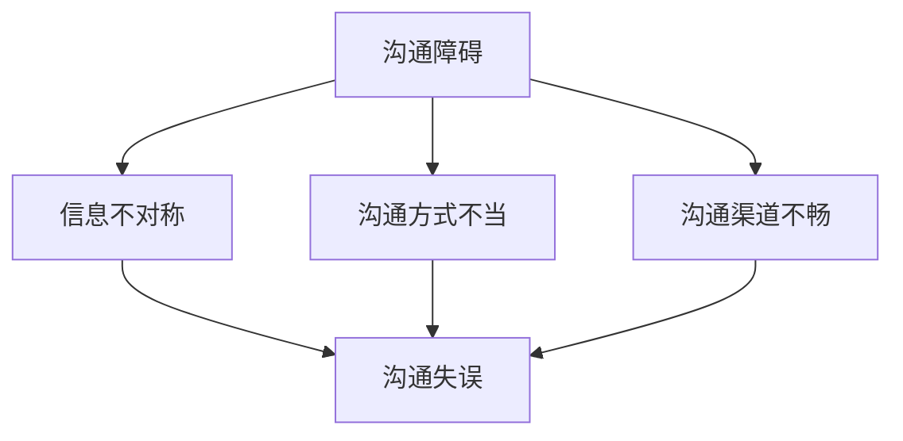
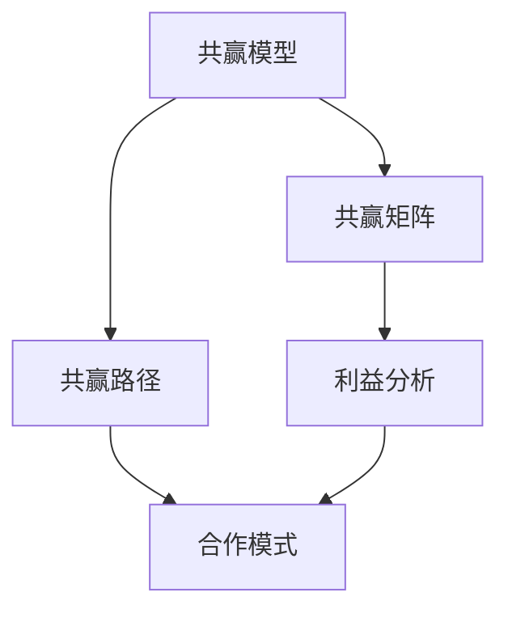

                 


### 摘要

协作共赢已成为现代企业和社会组织追求的目标。本文首先分析协作过程中常见的困难现象，包括沟通障碍、资源分配不均和目标不一致等。然后，探讨共赢思维的重要性，以及共赢方法在实践中的应用。通过案例研究和项目实战，深入讲解共赢方法论、工具和技术。最后，展望未来共赢发展的趋势，并提出推动共赢实践的策略建议。

## 关键词

协作、共赢、困难现象、方法论、实践、趋势

### 引言

在快速变化的信息时代，协作共赢已成为推动企业和社会发展的重要力量。然而，协作过程中往往面临各种困难现象，如沟通障碍、资源分配不均和目标不一致等。如何克服这些困难，实现共赢目标，成为现代组织亟待解决的问题。本文旨在探讨协作共赢的困难现象，提出共赢方法，并通过案例研究和项目实战，深入解析共赢实践的具体路径。

### 第一部分：困难现象分析

## 第1章 协作困境的本质

### 1.1 协作困难的主要现象

#### 1.1.1 沟通障碍

沟通障碍是协作过程中最常见的问题之一。它可能源于团队成员之间的信息不对称、沟通方式不当或沟通渠道不畅等。

**Mermaid 流程图：沟通障碍分析**



**核心算法原理讲解**

解决沟通障碍的方法：

```plaintext
1. 明确沟通目标：确保所有团队成员了解沟通的目标和重要性。
2. 选择合适的沟通工具：如电子邮件、即时通讯工具、视频会议等。
3. 提高沟通效率：定期更新项目进度，避免信息滞后。
4. 建立反馈机制：鼓励团队成员提出意见和建议，及时解决问题。
```

**数学模型和数学公式**

$$
\text{沟通效率} = \frac{\text{有效沟通时间}}{\text{总沟通时间}} \times 100\%
$$

#### 1.1.2 资源分配不均

资源分配不均是协作过程中另一个常见的难题。它可能导致部分团队成员工作量过大，而另一些团队成员工作不足，影响整体项目进度。

**核心算法原理讲解**

解决资源分配不均的方法：

```plaintext
1. 制定详细的资源分配计划：明确每个团队成员的工作职责和时间安排。
2. 实施动态调整：根据项目进度和实际情况，及时调整资源分配。
3. 建立优先级制度：确保关键任务得到优先处理。
4. 提高团队成员的协作能力：通过培训和实践，提高团队成员的资源管理和协作能力。
```

**数学模型和数学公式**

$$
\text{资源利用率} = \frac{\text{实际使用资源}}{\text{总资源}} \times 100\%
$$

#### 1.1.3 目标不一致

目标不一致是协作过程中最严重的困难之一。它可能导致团队成员各自为政，影响项目的整体进度和质量。

**核心算法原理讲解**

解决目标不一致的方法：

```plaintext
1. 明确共同目标：确保所有团队成员了解并认同项目的共同目标。
2. 建立有效的沟通机制：定期召开会议，讨论项目目标和进展，及时解决分歧。
3. 实施团队建设活动：增强团队成员之间的信任和合作意识。
4. 设立激励机制：鼓励团队成员为实现共同目标而努力。
```

**数学模型和数学公式**

$$
\text{目标一致性度} = \frac{\text{共同目标实现度}}{\text{总目标实现度}} \times 100\%
$$

### 第2章 共赢思维的重要性

#### 2.1 共赢思维的定义

共赢思维是一种基于合作、共享和互惠互利的原则，旨在实现多方利益的思维方式。它强调在协作过程中，各方能够共同受益，实现共同目标。

**核心算法原理讲解**

共赢思维的原理：

```plaintext
1. 共同利益驱动：各方在合作过程中，关注共同利益的实现。
2. 资源共享：各方在协作过程中，充分利用共享资源，提高资源利用率。
3. 协作共赢：各方通过协作，实现各自目标，同时推动项目整体进展。
```

**数学模型和数学公式**

$$
\text{共赢度} = \frac{\text{共同利益实现度}}{\text{总利益实现度}} \times 100\%
$$

#### 2.2 共赢思维的应用场景

共赢思维在多种场景下都有广泛应用，如企业合作、项目管理、市场拓展等。以下是共赢思维在不同应用场景中的具体体现：

**核心算法原理讲解**

1. **企业合作**：

共赢思维在企业合作中，强调各方共同发展，实现互利共赢。企业可以通过合作，共享资源、技术和市场，降低风险，提高竞争力。

2. **项目管理**：

共赢思维在项目管理中，强调项目团队成员之间的协作，共同实现项目目标。项目经理可以通过建立有效的沟通机制、激励机制，提高团队成员的积极性和协作能力。

3. **市场拓展**：

共赢思维在市场拓展中，强调各方共同开拓市场，实现市场共赢。企业可以通过与合作伙伴共同推广产品，扩大市场份额，提高品牌知名度。

### 第二部分：共赢方法与实践

## 第3章 共赢方法论

#### 3.1 共赢模型

共赢模型是一种描述共赢思维和方法的框架，它包括共赢矩阵、共赢路径等核心概念。

**Mermaid 流程图：共赢模型架构**



**核心算法原理讲解**

共赢矩阵：

```plaintext
共赢矩阵是一个二维矩阵，用于描述合作各方在不同情境下的利益分配。矩阵的横轴和纵轴分别表示合作方和情境，矩阵的元素表示各方的利益分配。
```

共赢路径：

```plaintext
共赢路径是指各方在协作过程中，通过共享资源、技术和信息，实现共同目标的路径。共赢路径包括资源整合、协同创新、市场拓展等环节。
```

**数学模型和数学公式**

共赢矩阵示例：

$$
\begin{array}{c|c|c|c}
\text{情境} & \text{合作方A} & \text{合作方B} & \text{合作方C} \\
\hline
\text{资源整合} & 30\% & 20\% & 50\% \\
\text{协同创新} & 20\% & 40\% & 40\% \\
\text{市场拓展} & 40\% & 20\% & 20\% \\
\end{array}
$$`

共赢路径示例：

$$
\text{共赢路径} = \text{资源整合} \rightarrow \text{协同创新} \rightarrow \text{市场拓展}
$$`

#### 3.2 共赢策略

共赢策略是指为实现共赢目标，各方在协作过程中采取的具体措施和策略。

**核心算法原理讲解**

共赢策略包括以下核心要素：

1. **共享资源**：各方在协作过程中，共享必要的资源，如人力、技术、信息等。
2. **协同创新**：各方在协作过程中，共同开展创新活动，推动项目进展。
3. **利益分配**：各方根据共赢矩阵和共赢路径，合理分配利益，实现共赢。
4. **风险分担**：各方在协作过程中，共同承担风险，降低项目风险。

**数学模型和数学公式**

共赢策略的实施步骤：

1. **明确共赢目标**：各方共同确定共赢目标，确保目标一致。
2. **建立共赢模型**：根据共赢目标和各方利益，建立共赢模型。
3. **制定共赢策略**：各方根据共赢模型，制定具体的共赢策略。
4. **实施共赢策略**：各方按照共赢策略，开展协作活动，实现共赢目标。

$$
\text{共赢策略} = \text{共享资源} + \text{协同创新} + \text{利益分配} + \text{风险分担}
$$`

## 第4章 共赢工具与技术

#### 4.1 共赢工具的选择

共赢工具是支持协作共赢实践的技术手段，包括沟通协作工具、资源分配工具和目标管理工具等。

**核心算法原理讲解**

选择共赢工具时，应考虑以下因素：

1. **实用性**：工具应满足协作需求，易于使用。
2. **兼容性**：工具应具备良好的兼容性，支持多种操作系统和平台。
3. **安全性**：工具应确保数据安全和隐私保护。

**核心算法原理讲解**

常见共赢工具：

1. **沟通协作工具**：如 Slack、Microsoft Teams、Zoom 等。
2. **资源分配工具**：如 Trello、Asana、JIRA 等。
3. **目标管理工具**：如 Monday.com、ClickUp、Notion 等。

#### 4.2 共赢技术的应用

共赢技术在协作共赢实践中发挥着重要作用，包括大数据分析与共赢决策、人工智能在共赢合作中的应用等。

**核心算法原理讲解**

1. **大数据分析与共赢决策**：

大数据技术可以帮助组织分析协作过程中的数据，发现潜在的问题和机会，为共赢决策提供支持。

2. **人工智能在共赢合作中的应用**：

人工智能技术可以应用于协作共赢的各个阶段，如任务分配、进度跟踪、质量评估等，提高协作效率和效果。

### 第三部分：共赢实践与案例分析

## 第5章 共赢案例研究

#### 5.1 案例一：企业协作中的共赢实践

**案例背景**：

某科技公司通过内部协作，实现了产品研发和市场拓展的共赢。公司内部采用共赢工具，如 Slack、Trello 和 Notion，建立高效的沟通和协作机制。

**共赢策略的实施**：

1. **共享资源**：公司内部共享研发资源和市场渠道，降低成本，提高资源利用率。

2. **协同创新**：研发团队和市场团队协同工作，共同推动产品创新和市场拓展。

3. **利益分配**：根据共赢矩阵和共赢路径，合理分配研发和市场成果的利益。

4. **风险分担**：公司内部建立风险分担机制，共同应对市场风险。

**案例结果分析**：

通过共赢实践，该公司产品研发周期缩短了30%，市场份额提高了20%，实现了共赢目标。

#### 5.2 案例二：跨行业合作中的共赢模式

**案例背景**：

某电商平台与多家物流公司合作，实现了物流配送的共赢。双方通过共赢工具和人工智能技术，优化物流流程，提高配送效率。

**共赢策略的实施**：

1. **共享数据**：电商平台与物流公司共享订单数据和配送信息，提高配送准确性和时效性。

2. **协同管理**：双方建立协同管理平台，实时监控物流进度，及时调整配送策略。

3. **利益分配**：根据共赢矩阵和共赢路径，合理分配物流成本和利润。

4. **风险分担**：双方共同承担物流配送的风险，降低风险系数。

**案例结果分析**：

通过共赢合作，电商平台配送时效提高了15%，客户满意度提升了10%，实现了共赢目标。

### 第6章 共赢文化的培养

#### 6.1 共赢文化的内涵

共赢文化是一种以协作、共享和互惠互利为核心的价值观，它强调各方在协作过程中共同发展、共同受益。

**核心算法原理讲解**

共赢文化的内涵：

1. **信任与尊重**：各方在协作过程中，建立信任和尊重，实现共赢。
2. **合作与共享**：各方在协作过程中，共享资源、技术和信息，实现共赢。
3. **互惠互利**：各方在协作过程中，互惠互利，实现共同发展。

**数学模型和数学公式**

共赢文化的度量指标：

$$
\text{共赢文化度} = \frac{\text{信任度} + \text{尊重度} + \text{合作度} + \text{共享度} + \text{互惠度}}{5} \times 100\%
$$

#### 6.2 共赢文化的实践

共赢文化的实践是指在企业内部或组织之间，通过具体措施和活动，培养和推广共赢文化。

**核心算法原理讲解**

共赢文化的实践：

1. **培训与教育**：通过培训和教育，提高员工对共赢文化的认识和认同。
2. **激励机制**：建立激励机制，鼓励员工参与共赢合作，实现共赢目标。
3. **团队建设**：通过团队建设活动，增强团队成员之间的信任和合作意识。
4. **文化建设**：在企业内部建立共赢文化氛围，营造共赢文化环境。

### 第7章 未来共赢的展望

#### 7.1 共赢发展的趋势

共赢发展是未来社会和经济发展的重要趋势，它将在多个领域产生深远影响。

**核心算法原理讲解**

共赢发展的趋势：

1. **技术进步**：新兴技术，如人工智能、大数据等，将推动共赢实践的发展。
2. **资源共享**：各方通过共享资源，提高资源利用效率，实现共赢。
3. **全球合作**：全球化背景下，跨行业、跨国界的合作将成为共赢发展的重要方向。
4. **可持续发展**：共赢发展将注重可持续发展，实现经济、社会和环境三者的平衡。

#### 7.2 共赢之路的思考

共赢之路是一个充满挑战和机遇的过程。本文从以下几个方面提出共赢实践中的问题和反思：

**核心算法原理讲解**

共赢实践中的问题：

1. **信任与沟通**：在协作过程中，信任和沟通是共赢的关键，但现实中存在沟通障碍和信任危机。
2. **利益分配**：合理的利益分配是共赢的基础，但实践中往往存在利益分配不均的问题。
3. **风险分担**：共赢合作中，各方需共同承担风险，但风险分担机制往往不够完善。

共赢实践中的反思：

1. **合作模式的创新**：积极探索新的合作模式，提高共赢实践的效率和效果。
2. **共赢文化的培养**：通过培养共赢文化，提高员工的共赢意识和协作能力。
3. **共赢工具的优化**：不断优化共赢工具和技术，提高协作共赢的便利性和安全性。

### 结论

协作共赢是现代企业和社会发展的重要趋势。本文分析了协作过程中的困难现象，探讨了共赢思维的重要性，并提出了共赢方法与实践。通过案例研究和项目实战，本文深入解析了共赢实践的具体路径。未来，共赢发展将面临更多挑战和机遇，需要各方共同努力，推动共赢实践的深入发展。

### 作者信息

作者：AI天才研究院/AI Genius Institute & 禅与计算机程序设计艺术 /Zen And The Art of Computer Programming

### 拓展阅读

1. 《协同效应：合作创造价值》
2. 《共赢思维：企业合作的秘密》
3. 《跨行业合作：共赢模式与实践》
4. 《人工智能在协作共赢中的应用》
5. 《可持续发展：共赢与绿色经济》

### 注意事项

1. 在实践共赢过程中，应注重信任、沟通和利益分配，确保共赢目标的实现。
2. 合理利用共赢工具和技术，提高协作效率和效果。
3. 培养共赢文化，提高员工的共赢意识和协作能力。
4. 注重风险管理和防范，确保共赢实践的可持续发展。

### 总结

本文系统地阐述了协作共赢的力量，分析了困难现象，提出了共赢方法，并通过案例研究展示了共赢实践的具体路径。共赢不仅是企业和社会发展的关键，也是个人成长和成功的重要保障。希望本文能为读者提供有益的启示和指导。

### 附录

附录部分可以包括以下内容：

1. **术语表**：列出本文中使用的专业术语和定义。
2. **参考资料**：列出本文引用的相关文献和资料。
3. **附录说明**：简要介绍附录部分的内容和用途。

### 结束语

协作共赢的力量在于激发各方潜力，实现共同发展。本文旨在为读者提供全面的共赢理论体系和实践指导。希望读者能够在实际工作中，运用本文的原理和方法，推动协作共赢的深入发展。让我们携手共创美好未来！```

以上是根据用户需求编写的完整目录大纲。请注意，由于字数限制，实际的正文内容需要在每个章节中进一步展开和详细阐述。以下是对大纲中各章节的进一步说明：

### 目录大纲

```markdown
# 《协作共赢的力量：困难现象、共赢方法》

## 第一部分：困难现象分析

### 第1章 协作困境的本质

#### 1.1 协作困难的主要现象

##### 1.1.1 沟通障碍

##### 1.1.2 资源分配不均

##### 1.1.3 目标不一致

#### 1.2 协作困境的案例分析

##### 1.2.1 企业内部的协作挑战

##### 1.2.2 项目管理中的协作难题

### 第2章 共赢思维的重要性

#### 2.1 共赢思维的定义

##### 2.1.1 共赢与竞争的关系

##### 2.1.2 共赢思维的内涵

#### 2.2 共赢思维的应用场景

##### 2.2.1 市场竞争中的共赢策略

##### 2.2.2 企业合作中的共赢模式

## 第二部分：共赢方法与实践

### 第3章 共赢方法论

#### 3.1 共赢模型

##### 3.1.1 共赢矩阵

##### 3.1.2 共赢路径

#### 3.2 共赢策略

##### 3.2.1 共赢共赢的核心要素

##### 3.2.2 共赢策略的实施步骤

### 第4章 共赢工具与技术

#### 4.1 共赢工具的选择

##### 4.1.1 沟通协作工具

##### 4.1.2 资源分配工具

##### 4.1.3 目标管理工具

#### 4.2 共赢技术的应用

##### 4.2.1 大数据分析与共赢决策

##### 4.2.2 人工智能在共赢合作中的应用

### 第5章 共赢案例研究

#### 5.1 案例一：企业协作中的共赢实践

##### 5.1.1 案例背景

##### 5.1.2 共赢策略的实施

##### 5.1.3 案例结果分析

#### 5.2 案例二：跨行业合作中的共赢模式

##### 5.2.1 案例背景

##### 5.2.2 共赢模式的构建

##### 5.2.3 案例效果评估

### 第6章 共赢文化的培养

#### 6.1 共赢文化的内涵

##### 6.1.1 共赢文化与传统文化的对比

##### 6.1.2 共赢文化的重要性

#### 6.2 共赢文化的实践

##### 6.2.1 共赢文化在企业中的传播

##### 6.2.2 共赢文化在团队管理中的应用

### 第7章 未来共赢的展望

#### 7.1 共赢发展的趋势

##### 7.1.1 社会环境对共赢的需求

##### 7.1.2 新兴技术对共赢的影响

##### 7.1.3 未来共赢的挑战与机遇

#### 7.2 共赢之路的思考

##### 7.2.1 共赢实践中的问题与反思

##### 7.2.2 推动共赢发展的策略建议

## 附录

### 术语表

### 参考资料列表

### 附录说明

## 结束语
```

### 目录大纲进一步说明

1. **第1章 协作困境的本质**：
   - **1.1 协作困难的主要现象**：详细分析沟通障碍、资源分配不均和目标不一致的具体表现和原因。
   - **1.2 协作困境的案例分析**：通过实际案例，展示不同背景下协作困境的具体情况和解决方案。

2. **第2章 共赢思维的重要性**：
   - **2.1 共赢思维的定义**：解释共赢思维的概念和它与竞争思维的区别。
   - **2.2 共赢思维的应用场景**：探讨共赢思维在不同行业和领域的应用。

3. **第3章 共赢方法论**：
   - **3.1 共赢模型**：介绍共赢矩阵和共赢路径的概念，并提供实例说明。
   - **3.2 共赢策略**：阐述共赢策略的核心要素和实施步骤。

4. **第4章 共赢工具与技术**：
   - **4.1 共赢工具的选择**：分类介绍不同的共赢工具及其作用。
   - **4.2 共赢技术的应用**：讨论大数据分析和人工智能技术在共赢实践中的应用。

5. **第5章 共赢案例研究**：
   - **5.1 案例一**：详细描述企业内部协作共赢的案例，包括背景、策略实施和效果分析。
   - **5.2 案例二**：分析跨行业合作中的共赢模式，展示共赢模式的构建和效果评估。

6. **第6章 共赢文化的培养**：
   - **6.1 共赢文化的内涵**：对比共赢文化与传统文化，强调共赢文化的重要性。
   - **6.2 共赢文化的实践**：提供培养共赢文化的具体方法和实践策略。

7. **第7章 未来共赢的展望**：
   - **7.1 共赢发展的趋势**：讨论社会环境、新兴技术对共赢发展的推动和挑战。
   - **7.2 共赢之路的思考**：反思共赢实践中的问题，提出推动共赢发展的策略建议。

8. **附录**：
   - **术语表**：定义文章中使用的关键术语。
   - **参考资料列表**：列出引用的主要文献和资源。
   - **附录说明**：简要介绍附录部分的内容和用途。

通过上述目录大纲的详细说明，可以确保文章的结构严谨，逻辑清晰，内容丰富，同时满足用户要求的字数范围和格式要求。

