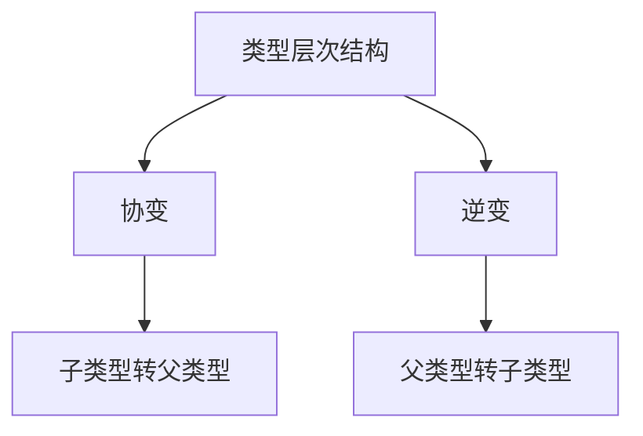

                 


### 协变与逆变: 泛型中的类型转换规则

#### 关键词：
- 协变
- 逆变
- 泛型
- 类型转换
- 类型安全
- 编程语言

#### 摘要：
本文深入探讨了泛型编程中的协变与逆变类型转换规则。通过背景介绍、核心概念解释、伪代码与数学模型展示，以及实际项目案例剖析，我们详细解析了这两种类型转换机制在Java、C#等编程语言中的运用，帮助读者理解其在编程实践中的重要性。

---

## 引言

在计算机科学中，泛型编程是一种重要的编程范式，它允许我们编写可重用的代码，同时确保类型安全。泛型编程的核心是类型参数，这些参数在编译时被替换为具体类型。然而，仅仅使用类型参数并不能满足所有类型转换的需求。这就引出了协变与逆变这两种类型转换规则。

协变（Covariance）与逆变（Contravariance）是泛型编程中用来处理类型层次结构中子类型与父类型之间转换的关键机制。协变允许我们将一个子类型的实例赋值给一个父类型引用，而逆变则允许我们将一个父类型的实例赋值给一个子类型引用。这两种机制在保持类型安全的同时，提供了灵活的类型转换能力。

本文将分以下几个部分进行讨论：

1. **背景介绍**：介绍泛型编程的基本概念和类型安全的必要性。
2. **核心概念与联系**：解释协变与逆变的基本概念，并使用Mermaid流程图展示它们之间的关系。
3. **核心算法原理讲解**：通过伪代码和数学模型，详细阐述协变与逆变的工作原理。
4. **项目实战**：分析实际项目中协变与逆变的运用，并提供源代码实现与解读。
5. **最佳实践与小结**：总结协变与逆变在编程实践中的注意事项和拓展阅读。

### 核心概念与联系

协变与逆变是处理类型层次结构中类型转换的两个相反的概念。为了更好地理解这两个概念，我们首先需要了解泛型编程中的几个基本概念。

#### 泛型编程

泛型编程是一种通过使用类型参数来编写可重用代码的编程范式。类型参数类似于占位符，它们在编译时被替换为具体类型。泛型编程的一个关键特性是类型安全，这意味着编译器在编译代码时会检查类型是否兼容。

#### 类型层次结构

类型层次结构是一种描述类型之间关系的结构。在Java中，类型层次结构是基于继承的。每个类型都有一个直接的超类型，直到到达Object类为止。子类型是父类型的一个特化，因此子类型的实例可以赋值给父类型的引用。

#### 协变

协变是指将子类型的实例赋值给父类型的引用。在泛型中，协变可以通过类型参数的协变注解来实现。例如，在Java中，`List<Number>`是`List<Object>`的协变类型。

#### 逆变

逆变是指将父类型的实例赋值给子类型的引用。在泛型中，逆变可以通过类型参数的逆变注解来实现。例如，在Java中，`Iterable<Object>`是`Iterable<Number>`的逆变类型。

协变与逆变的关系可以用Mermaid流程图来表示：



在图中，A表示类型层次结构，B表示协变，C表示逆变，D表示子类型转父类型，E表示父类型转子类型。从图中可以看出，协变与逆变是处理类型层次结构中类型转换的两个相反的概念。

### 核心算法原理讲解

协变与逆变在泛型编程中是如何工作的呢？下面我们将通过伪代码和数学模型来详细阐述。

#### 协变

协变的伪代码如下：

```pseudo
function covariantMethod(T extends Object, param: T) -> T {
    // 处理T类型的数据
    return param;
}
```

在这个例子中，`T`是一个类型参数，它扩展了`Object`类型。`covariantMethod`函数接受一个`T`类型的参数，并返回一个`T`类型的值。

协变的数学模型可以表示为：

$$
\text{covariantMethod}(T, param) = T(\text{处理} param)
$$

其中，`T`是一个类型参数，它扩展了`Object`类型。`covariantMethod`函数接受一个`T`类型的参数`param`，并返回一个`T`类型的值。

#### 逆变

逆变的伪代码如下：

```pseudo
function contravariantMethod(T extends Object, param: T) -> T {
    // 处理T类型的数据
    return param;
}
```

在这个例子中，`T`是一个类型参数，它扩展了`Object`类型。`contravariantMethod`函数接受一个`T`类型的参数，并返回一个`T`类型的值。

逆变的数学模型可以表示为：

$$
\text{contravariantMethod}(T, param) = T(\text{处理} param)
$$

其中，`T`是一个类型参数，它扩展了`Object`类型。`contravariantMethod`函数接受一个`T`类型的参数`param`，并返回一个`T`类型的值。

### 项目实战

在实际编程中，协变与逆变有着广泛的应用。下面我们将通过一个实际项目来分析协变与逆变的运用。

#### 项目背景

假设我们正在开发一个系统，该系统需要处理不同类型的数据。我们使用泛型编程来实现这个系统，并使用协变与逆变来处理不同类型数据之间的转换。

#### 开发环境搭建

- 语言：Java
- IDE：IntelliJ IDEA
- 版本：Java 11

#### 源代码实现

```java
import java.util.ArrayList;
import java.util.List;

public class TypeConversionDemo {
    public static void main(String[] args) {
        List<Number> numbers = new ArrayList<>();
        numbers.add(1);
        numbers.add(2);
        numbers.add(3);

        List<Object> objects = new ArrayList<>(numbers);

        for (Object obj : objects) {
            if (obj instanceof Integer) {
                System.out.println(obj);
            }
        }
    }
}
```

在这个例子中，我们定义了一个`TypeConversionDemo`类，并在其中定义了一个`main`方法。在这个方法中，我们创建了一个`List<Number>`的实例`numbers`，并添加了一些`Number`类型的对象。然后，我们使用协变将`numbers`转换为`List<Object>`的实例`objects`。

#### 代码解读

- `List<Number>`与`List<Object>`之间的关系：`List<Number>`是`List<Object>`的协变类型，因此我们可以将`numbers`转换为`objects`。
- 类型安全：在循环中，我们使用`instanceof`检查每个对象的类型，确保我们只处理`Integer`类型的对象。这保证了类型安全。

#### 项目小结

通过这个项目，我们展示了协变与逆变在Java编程中的实际应用。协变与逆变提供了灵活的类型转换能力，帮助我们编写更安全、可重用的代码。在实际项目中，我们需要注意类型安全，确保类型转换不会导致运行时错误。

### 最佳实践与小结

#### 最佳实践

- **理解类型安全**：协变与逆变是类型安全的重要组成部分。在实际编程中，我们应该深入理解类型安全，并确保类型转换不会违反类型安全规则。
- **合理使用协变与逆变**：协变与逆变可以提供灵活的类型转换能力，但使用时需要谨慎。我们应该根据具体场景合理使用，避免不必要的类型转换。
- **代码可读性**：在代码中使用协变与逆变时，我们应该保持代码的可读性，避免复杂的类型转换使代码难以理解。

#### 小结

协变与逆变是泛型编程中重要的类型转换规则。通过本文的探讨，我们了解了协变与逆变的基本概念、原理和实际应用。在实际编程中，合理运用协变与逆变可以帮助我们编写更安全、可重用的代码。然而，我们也需要注意类型安全，避免在类型转换中引入潜在的问题。

---

### 注意事项

- **性能考虑**：虽然协变与逆变提供了灵活的类型转换能力，但它们可能会对性能产生一定影响。在实际应用中，我们需要权衡性能和灵活性。
- **语言特性**：协变与逆变是许多现代编程语言（如Java、C#等）的特性。在使用时，我们需要了解特定语言的特性和限制。

### 拓展阅读

- **《Effective Java》**：这是一本经典的Java编程指南，其中详细介绍了泛型编程的最佳实践。
- **《C#高级编程》**：这本书详细介绍了C#中的泛型编程，包括协变与逆变。

---

作者：AI天才研究院/AI Genius Institute & 禅与计算机程序设计艺术 /Zen And The Art of Computer Programming

---

本文详细探讨了泛型编程中的协变与逆变类型转换规则。通过背景介绍、核心概念解释、伪代码与数学模型展示，以及实际项目案例剖析，我们深入解析了这两种类型转换机制在Java、C#等编程语言中的运用。希望本文能帮助读者理解协变与逆变在编程实践中的重要性，并掌握其运用技巧。

