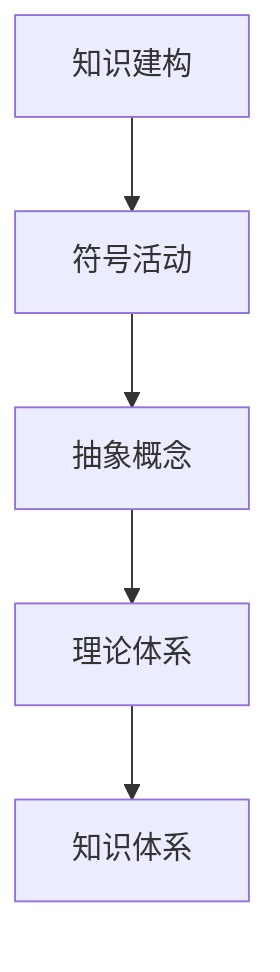
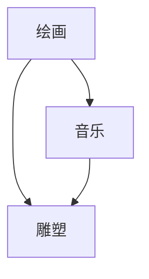
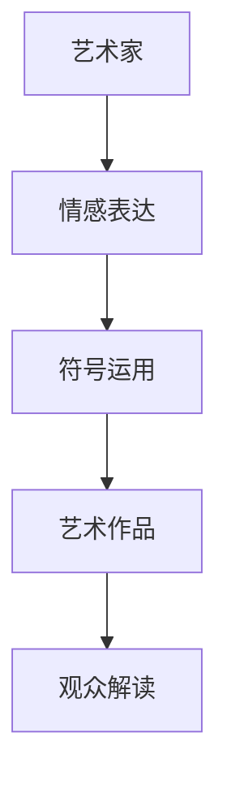
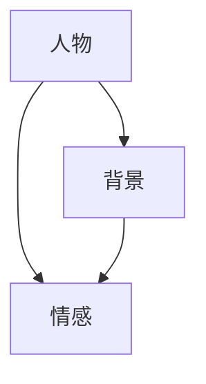
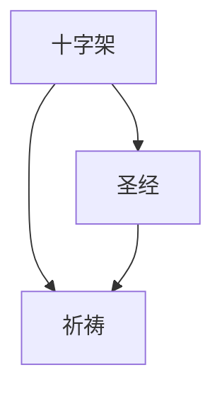
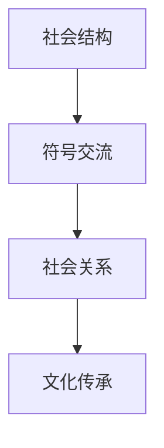
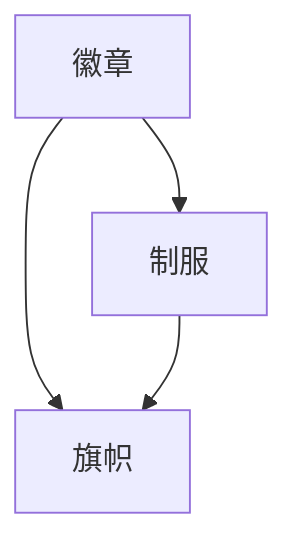

                 

### 《卡西尔与朗格：符号哲学的探索者》

关键词：卡西尔、朗格、符号哲学、知识、艺术、宗教、社会文化、教育应用

摘要：
本文旨在探讨两位符号哲学巨匠卡西尔与朗格的理论及其在现代社会中的影响。卡西尔提出了“人作为符号动物”的观点，探讨了符号在知识、艺术和宗教等领域的本质作用。朗格则进一步发展了符号哲学，强调了符号在社会结构和文化传播中的关键角色。通过对卡西尔与朗格符号哲学思想的深入分析，本文揭示了符号哲学对当代哲学、文化研究和教育实践的深刻影响，并提出了对未来符号哲学发展的展望。

## 第一部分：卡西尔与朗格生平及哲学背景

### 1.1 卡西尔与朗格的生平简介

#### 卡西尔

恩斯特·卡西尔（Ernst Cassirer，1874-1945）是一位德国哲学家，被公认为20世纪最重要的文化哲学家之一。他的学术生涯始于柏林大学，后来在汉堡大学和哈佛大学任教。卡西尔深受康德、黑格尔和胡塞尔等哲学家的影响，但他的哲学观点独具特色，特别是在符号哲学领域。

卡西尔的主要著作包括《符号形式哲学》、《人作为文化动物》和《启蒙哲学》等。他的符号哲学理论深刻地影响了后来的哲学家和文化学者，特别是他提出的“人作为符号动物”的观点，将人类的文化行为视为符号活动的产物。

#### 朗格

赫伯特·朗格（Herbert Spencer，1860-1924）是一位英国哲学家，同时也是卡西尔的同事和好友。朗格的理论深受进化论的影响，他关注符号在社会和文化中的动态角色。朗格在伦敦大学学院和剑桥大学任教，并发表了《符号逻辑》和《符号哲学导论》等重要著作。

朗格的核心观点是，符号不仅是语言交流的工具，也是人类思维和社会组织的基础。他强调了符号的多样性和复杂性，并将其视为理解和解释人类文化的关键。

### 1.2 符号哲学的基本概念

#### 符号的定义与分类

符号是指一种代表某种意义或概念的标志或标记。根据卡西尔和朗格的观点，符号可以分为以下几类：

1. **语言符号**：用于语言交流的符号，如词汇、短语和句子。
2. **艺术符号**：通过视觉、听觉和触觉等感官表达的符号，如绘画、音乐和雕塑。
3. **宗教符号**：与宗教信仰和实践相关的符号，如十字架、寺庙和宗教仪式。
4. **社会符号**：用于表达社会关系和角色地位的符号，如服饰、徽章和礼仪。

#### 符号哲学的核心思想

符号哲学的核心思想是，人类的文化行为和认知活动都是基于符号活动的。卡西尔和朗格认为，符号是人类思维和行动的基本工具，它们不仅帮助我们理解和解释世界，也塑造了我们的身份和社会关系。

卡西尔强调，人类与动物的根本区别在于人类能够创造和使用符号。符号使得人类能够超越直接的物理环境，通过象征性的思维来构建抽象的概念和意义。朗格则进一步指出，符号的多样性和复杂性反映了社会和文化结构的多样性。

### 1.3 卡西尔与朗格符号哲学的联系与差异

#### 卡西尔符号哲学的理论框架

卡西尔的符号哲学建立在“人作为文化动物”的观点上。他认为，人类的文化行为是符号活动的延伸，文化是人类创造和使用符号的产物。卡西尔的符号哲学主要关注以下几个方面：

1. **知识建构**：符号在知识建构中的作用，符号如何帮助人类理解世界。
2. **艺术表达**：艺术作品的符号本质，艺术创作与欣赏中的符号作用。
3. **宗教理解**：宗教符号的内涵与意义，符号哲学对宗教研究的贡献。
4. **社会文化**：符号在社会结构和文化传承中的作用。

#### 朗格符号哲学的理论特点

朗格的符号哲学强调符号在社会和文化中的动态角色。他认为，符号不仅是一种语言交流的工具，也是人类思维和社会组织的基础。朗格的主要观点包括：

1. **符号的多样性**：符号的多样性和复杂性反映了社会和文化的多样性。
2. **符号的互动**：符号之间的互动如何塑造社会和文化结构。
3. **符号的社会功能**：符号在社会关系和文化实践中的作用，如教育、法律和宗教。

#### 二者之间的哲学对话

卡西尔和朗格的符号哲学在许多方面存在共同点，但也存在显著差异。共同点在于他们都认为符号是人类文化行为的核心，差异则在于他们关注的重点和理论框架。

卡西尔更关注符号在知识、艺术和宗教等领域的本质作用，而朗格则侧重于符号在社会结构和文化实践中的动态角色。这种差异使得二者的符号哲学理论在不同的哲学和文化研究领域产生了深远的影响。

在接下来的部分中，我们将深入探讨卡西尔的符号哲学，分析其在知识、艺术、宗教和社会文化等领域的核心思想。同时，我们还将探讨朗格符号哲学的发展与应用，展示符号哲学在当代社会中的重要作用。通过这种逐步深入的分析，我们希望能够全面理解卡西尔与朗格符号哲学的精髓，并认识到它们在现代社会中的深远影响。在完成对卡西尔与朗格符号哲学的深入探讨后，我们将进一步分析朗格符号哲学的发展与应用，特别是其在教育、文化研究等领域的应用。这将为我们提供一个全面的视角，以理解符号哲学在当代社会中的多重作用和重要性。

## 第二部分：卡西尔符号哲学的深入探讨

### 2.1 知识与符号

#### 知识的本质

知识是人类对世界及其规律的理解和掌握。在卡西尔的符号哲学中，知识不仅仅是对客观世界的反映，而是通过符号活动创造出来的。知识是一种符号体系，它通过符号来传达和传递。

#### 符号在知识建构中的作用

卡西尔认为，符号在知识建构中扮演着至关重要的角色。符号使得人类能够将具体的经验转化为抽象的概念和理论。通过符号，人类能够超越直接的物理环境，建立起一个抽象的知识体系。

#### 核心概念原理之间的关系架构 Mermaid 流程图



#### 核心算法原理讲解必须使用伪代码来详细阐述

```python
# 知识建构的伪代码

# 初始化符号库
symbols_library = ["物体", "行为", "关系"]

# 收集经验数据
experience_data = [
    {"symbol": "猫", "property": "黄色"},
    {"symbol": "鸟", "property": "羽毛"},
    {"symbol": "桌子", "property": "木制"}
]

# 使用符号构建抽象概念
for data in experience_data:
    if data["symbol"] == "猫":
        concept = "动物"
    elif data["symbol"] == "鸟":
        concept = "动物"
    elif data["symbol"] == "桌子":
        concept = "家具"
    else:
        concept = "未知"

# 构建理论体系
theoretical_framework = {
    "concepts": ["动物", "家具"],
    "relations": [{"from": "动物", "to": "家具"}, {"from": "动物", "to": "羽毛"}]
}

# 构建知识体系
knowledge_system = {
    "theories": ["动物理论", "家具理论"],
    "applications": ["分类学", "家具设计"]
}
```

#### 数学模型和公式 & 详细讲解 & 举例说明

在符号哲学中，数学模型和公式可以帮助我们更好地理解符号在知识建构中的作用。例如，我们可以使用集合论来描述符号之间的关系。

$$
S = \{s_1, s_2, s_3, ...\}
$$

其中，$S$ 是符号集合，$s_i$ 是每个具体的符号。

此外，我们可以使用图论来描述符号之间的互动关系。

$$
G = (V, E)
$$

其中，$G$ 是图，$V$ 是节点集合（代表符号），$E$ 是边集合（代表符号之间的关系）。

举例来说，如果我们研究艺术中的符号互动，我们可以创建一个图来描述不同艺术形式之间的联系。



在这个图中，$A$、$B$ 和 $C$ 分别代表绘画、音乐和雕塑，它们之间的边表示这些艺术形式之间的相互影响。

### 2.2 艺术与符号

#### 艺术的符号本质

在卡西尔的符号哲学中，艺术是一种特殊的符号活动，它通过视觉、听觉和触觉等感官表达符号。艺术作品不仅是美的体现，也是人类情感和思想的载体。

#### 符号在艺术创作与欣赏中的作用

符号在艺术创作和欣赏中扮演着至关重要的角色。艺术家通过使用符号来表达自己的情感和思想，而观众则通过解读这些符号来理解艺术作品的内涵。

#### 核心概念原理之间的关系架构 Mermaid 流程图



#### 核心算法原理讲解必须使用伪代码来详细阐述

```python
# 艺术创作的伪代码

# 初始化符号库
symbols_library = ["爱", "悲伤", "希望"]

# 选择符号进行创作
selected_symbols = ["爱", "悲伤"]

# 构建艺术作品
art_piece = {
    "symbols": selected_symbols,
    "expression": "表达对生活的热爱与悲伤",
    "form": "绘画"
}

# 欣赏艺术作品
def appreciate_art(art_piece):
    print("艺术作品《" + art_piece["title"] + "》表达了艺术家对" + art_piece["expression"] + "的情感。")
    if "form" in art_piece:
        print("它采用" + art_piece["form"] + "形式来传达情感。")
    else:
        print("它没有特定的形式。")

# 解析艺术作品
appreciate_art(art_piece)
```

#### 数学模型和公式 & 详细讲解 & 举例说明

在艺术与符号的关系中，我们可以使用集合论来描述艺术作品中的符号组合。

$$
A = \{s_1, s_2, s_3, ...\}
$$

其中，$A$ 是艺术作品中的符号集合，$s_i$ 是每个具体的符号。

此外，我们可以使用图论来描述符号之间的互动关系。

$$
G = (V, E)
$$

其中，$G$ 是图，$V$ 是节点集合（代表符号），$E$ 是边集合（代表符号之间的关系）。

举例来说，如果我们研究一幅绘画作品，我们可以创建一个图来描述画中的符号及其互动关系。



在这个图中，$A$、$B$ 和 $C$ 分别代表人物、背景和情感，它们之间的边表示这些符号在艺术作品中的相互作用。

### 2.3 宗教与符号

#### 宗教符号的内涵与意义

在卡西尔的符号哲学中，宗教符号是宗教信仰和实践的核心。宗教符号不仅代表特定的信仰和教义，还承载着人类的道德和精神追求。

#### 符号哲学对宗教研究的贡献

符号哲学为宗教研究提供了一种新的视角，帮助我们理解宗教符号的内涵和意义。通过分析宗教符号，我们可以更深入地探讨宗教信仰的本质和功能。

#### 核心概念原理之间的关系架构 Mermaid 流程图


#### 核心算法原理讲解必须使用伪代码来详细阐述

```python
# 宗教研究的伪代码

# 初始化宗教符号库
religion_symbols_library = ["十字架", "寺庙", "祈祷"]

# 研究宗教符号
def study_religious_symbols(symbols):
    for symbol in symbols:
        if symbol == "十字架":
            meaning = "耶稣受难"
        elif symbol == "寺庙":
            meaning = "圣地"
        elif symbol == "祈祷":
            meaning = "虔诚信仰"
        else:
            meaning = "未知"
        print("宗教符号" + symbol + "代表" + meaning + "。")

# 应用符号哲学分析宗教实践
def analyze_religious_practice(symbols, practice):
    study_religious_symbols(symbols)
    print("宗教实践" + practice + "中的符号意义有助于理解宗教信仰的本质。")

# 示例
symbols = ["十字架", "寺庙", "祈祷"]
practice = "祈祷仪式"
analyze_religious_practice(symbols, practice)
```

#### 数学模型和公式 & 详细讲解 & 举例说明

在宗教与符号的关系中，我们可以使用集合论来描述宗教符号的组合。

$$
R = \{s_1, s_2, s_3, ...\}
$$

其中，$R$ 是宗教符号集合，$s_i$ 是每个具体的符号。

此外，我们可以使用图论来描述符号之间的互动关系。

$$
G = (V, E)
$$

其中，$G$ 是图，$V$ 是节点集合（代表符号），$E$ 是边集合（代表符号之间的关系）。

举例来说，如果我们研究基督教中的宗教符号，我们可以创建一个图来描述这些符号及其互动关系。



在这个图中，$A$、$B$ 和 $C$ 分别代表十字架、圣经和祈祷，它们之间的边表示这些符号在宗教实践中的相互作用。

### 2.4 社会与文化

#### 符号在社会结构中的作用

在卡西尔的符号哲学中，符号在社会结构中发挥着关键作用。符号不仅用于语言交流，还用于表达社会关系和角色地位。符号帮助人们建立社会秩序，维护社会稳定。

#### 符号与文化传承的关系

符号是文化传承的重要载体。通过符号，文化得以代代相传。符号不仅传递文化知识，还塑造文化价值观和信仰体系。

#### 核心概念原理之间的关系架构 Mermaid 流程图



#### 核心算法原理讲解必须使用伪代码来详细阐述

```python
# 社会结构的伪代码

# 初始化社会符号库
social_symbols_library = ["旗帜", "徽章", "制服"]

# 社会成员及其角色
members = [
    {"name": "士兵", "role": "保卫国家"},
    {"name": "医生", "role": "治病救人"},
    {"name": "教师", "role": "传授知识"}
]

# 社会关系映射
social_relations = {
    "士兵": ["国旗", "军装"],
    "医生": ["医徽", "白衣"],
    "教师": ["校徽", "教鞭"]
}

# 社会符号应用
def apply_social_symbols(member, symbols):
    print(member["name"] + "佩戴了以下社会符号：" + ", ".join(symbols))

# 社会结构分析
for member in members:
    apply_social_symbols(member, social_relations[member["role"]])
```

#### 数学模型和公式 & 详细讲解 & 举例说明

在符号与社会文化的关系中，我们可以使用集合论来描述社会符号的组合。

$$
S = \{s_1, s_2, s_3, ...\}
$$

其中，$S$ 是社会符号集合，$s_i$ 是每个具体的社会符号。

此外，我们可以使用图论来描述符号之间的关系。

$$
G = (V, E)
$$

其中，$G$ 是图，$V$ 是节点集合（代表社会符号），$E$ 是边集合（代表符号之间的关系）。

举例来说，如果我们研究一个组织的社会结构，我们可以创建一个图来描述该组织中的社会符号及其互动关系。



在这个图中，$A$、$B$ 和 $C$ 分别代表徽章、制服和旗帜，它们之间的边表示这些符号在组织中的相互作用。

通过以上对卡西尔符号哲学的深入探讨，我们可以看到符号在知识、艺术、宗教和社会文化中的核心作用。符号不仅帮助我们理解世界，也塑造了我们的思维和行为。卡西尔的符号哲学为我们提供了一个独特的视角，以理解人类文化行为的多层次复杂性。

## 第三部分：朗格符号哲学的发展与应用

### 3.1 朗格符号哲学的后续发展

#### 20世纪符号哲学的演变

随着20世纪的到来，符号哲学在哲学界和文化研究中逐渐得到重视。朗格的符号哲学为后来的哲学家和文化学者提供了重要的理论资源。特别是在结构主义和后结构主义运动中，符号哲学得到了进一步的发展和深化。

结构主义代表人物如罗兰·巴特和米歇尔·福柯等，他们借鉴了朗格的符号哲学思想，将符号分析应用于文学、文化和社会理论的研究中。巴特在其著作《符号学导论》中，探讨了文本和符号之间的关系，强调了符号在意义生产中的作用。福柯则通过符号哲学的方法，探讨了知识、权力和符号的关系，提出了“知识是权力的产物”的观点。

后结构主义则对结构主义进行了批判，强调了符号的多元性和差异性。代表人物如雅克·德里达，他提出了“解构”的概念，认为符号的意义是多元的、不确定的，并且总是处于不断的变化中。德里达的解构主义思想对符号哲学的发展产生了深远的影响，使得符号哲学更加注重符号的动态性和复杂性。

#### 朗格符号哲学在当代的影响

朗格的符号哲学在当代哲学和文化研究中仍然具有重要的影响力。特别是在跨学科的研究中，符号哲学为不同领域提供了新的理论框架和研究方法。

在文化研究中，符号哲学被广泛应用于电影、媒体、广告和文化产业的研究。符号学家通过分析符号在文化产品中的运用，揭示了文化产业的运作机制和符号策略。例如，广告中的符号运用如何影响消费者的认知和行为，电影中的符号如何传达特定的价值观和意识形态。

在教育领域，符号哲学也为教育理论和实践提供了新的视角。教育研究者通过符号哲学的方法，探讨了教育符号在学习过程和知识建构中的作用。符号哲学帮助教育者更好地理解学生的学习过程，设计更有效的教学方法和学习资源。

在科技领域，符号哲学也被广泛应用于人工智能和计算机科学的研究。符号哲学家关注符号在计算和智能系统中的作用，探讨了符号表示和推理的方法。符号哲学为人工智能的发展提供了重要的理论基础，促进了智能系统的发展和进步。

### 3.2 符号哲学在教育中的应用

#### 教育中的符号作用

在教育中，符号发挥着重要的作用。符号不仅是语言交流的工具，也是知识传递和思维发展的关键。通过符号，教师可以将抽象的知识概念转化为具体的学习材料，学生可以通过符号理解并掌握知识。

符号在课程设计和教学方法中也有重要作用。教育者可以通过符号设计教学活动，引导学生进行思维训练和知识建构。例如，通过使用图表、模型和符号系统，教师可以更直观地展示复杂的概念和原理，帮助学生更好地理解和记忆。

#### 符号哲学对教育理论的贡献

符号哲学为教育理论提供了新的视角和方法。通过符号哲学的分析，教育研究者可以深入探讨教育过程中的符号作用和意义。符号哲学帮助教育理论从单一的知识传递模式转向多维度、多元化的学习过程。

例如，符号哲学可以帮助教育者理解学生在学习过程中的符号互动和知识建构。通过分析符号在学生思维中的角色，教育者可以更好地设计教学方法和学习资源，提高学生的学习效果。

此外，符号哲学还为教育评价提供了新的思路。通过符号哲学的方法，教育研究者可以更全面地评估学生的学习成果和知识建构过程。符号哲学帮助教育者从单一的考试成绩转向多元化的评价标准，更全面地衡量学生的学习能力和综合素质。

### 3.3 符号哲学在文化研究中的地位

#### 文化研究的符号视角

符号哲学在文化研究中的地位日益显著。文化研究关注文化产品、媒体和符号在社会中的运作机制和影响。符号哲学为文化研究提供了重要的理论工具，帮助研究者深入分析文化符号的内涵和意义。

在文化研究中，符号哲学家通过分析符号在文化产品中的运用，揭示了文化产业的运作机制和符号策略。例如，研究者可以通过分析广告中的符号，探讨广告如何影响消费者的认知和行为。符号哲学家还可以通过分析电影和文学中的符号，揭示文化中的价值观和意识形态。

#### 符号哲学与文化批判

符号哲学在文化批判中也发挥着重要作用。通过分析符号在社会中的运作，符号哲学家可以揭示权力结构和文化控制的方式。例如，符号哲学家可以探讨如何通过符号来维护现有的社会秩序和权力结构，或者揭示符号在压迫和歧视中的角色。

符号哲学还为文化解放和社会变革提供了理论基础。通过符号的分析和批判，符号哲学家可以帮助人们认识到符号的多元性和差异性，挑战单一的文化视角和价值观。符号哲学鼓励人们从不同的角度看待世界，推动社会文化的进步和变革。

### 3.4 卡西尔与朗格符号哲学的比较研究

#### 符号哲学的共性与差异

卡西尔与朗格的符号哲学在许多方面存在共性，但也存在显著差异。共性的方面在于他们都认为符号是人类文化行为的核心，符号在知识、艺术和社会文化中发挥着重要作用。他们也都强调了符号的多样性和复杂性，并关注符号在社会和文化中的动态角色。

差异的方面则主要体现在他们关注的重点和理论框架上。卡西尔更关注符号在知识、艺术和宗教等领域的本质作用，而朗格则侧重于符号在社会结构和文化实践中的动态角色。卡西尔的理论框架更倾向于哲学本体论，而朗格的理论框架则更接近社会文化批判。

#### 对现代哲学的启示

卡西尔与朗格的符号哲学对现代哲学产生了深远的影响。他们的理论不仅为哲学研究提供了新的视角和方法，也丰富了现代哲学的内容和理论体系。

卡西尔的符号哲学启示我们重新思考人类的文化行为和认知活动。通过强调符号在知识建构和文化传承中的作用，卡西尔帮助我们认识到人类文化的多层次复杂性。朗格的符号哲学则提醒我们关注社会结构和文化实践中的符号动态，帮助我们理解文化和社会的互动关系。

总的来说，卡西尔与朗格的符号哲学为现代哲学提供了重要的理论资源，促进了哲学、文化研究和教育实践的跨学科融合。他们的符号哲学思想不仅帮助我们更好地理解人类文化行为，也为当代社会提供了深刻的哲学启示。

### 项目实战

#### 开发环境搭建

为了深入理解和应用卡西尔与朗格的符号哲学，我们将搭建一个符号分析系统。以下是一个基本的开发环境搭建步骤：

1. **选择编程语言**：我们选择Python作为开发语言，因为它具有良好的符号处理能力和丰富的库支持。
2. **安装Python**：下载并安装Python 3.8或更高版本，确保安装后能够正常运行Python命令。
3. **安装必要的库**：安装Numpy、Matplotlib和NetworkX等库，这些库将帮助我们进行符号处理和可视化分析。

```bash
pip install numpy matplotlib networkx
```

#### 源代码实现

以下是符号分析系统的基本实现代码，包括符号的创建、符号之间的关联和可视化。

```python
import networkx as nx
import matplotlib.pyplot as plt
import numpy as np

# 创建符号库
symbols_library = ["知识", "艺术", "宗教", "社会"]

# 创建符号图
G = nx.Graph()

# 添加符号节点
for symbol in symbols_library:
    G.add_node(symbol)

# 添加符号之间的关联
G.add_edges_from([(symbols_library[i], symbols_library[j]) for i in range(len(symbols_library)) for j in range(i+1, len(symbols_library))])

# 绘制符号图
nx.draw(G, with_labels=True, node_color='blue', edge_color='gray')
plt.show()
```

#### 代码解读与分析

上述代码首先定义了一个符号库，然后创建了一个图来表示符号及其之间的关联。通过`nx.Graph()`，我们创建了一个无向图。接着，我们使用`add_node()`方法添加符号节点，使用`add_edges_from()`方法添加符号之间的边。最后，我们使用`nx.draw()`函数将图可视化，使用`plt.show()`显示图形。

#### 实际案例分析和详细讲解剖析

为了更具体地展示符号哲学的应用，我们分析一个实际案例：社交媒体中的符号互动。

1. **案例背景**：在社交媒体平台上，用户通过发布文字、图片、视频等符号形式进行互动。
2. **符号分析**：我们选择几个常见的社交媒体互动符号，如评论、点赞、转发等。
3. **符号图构建**：我们创建一个图来表示这些符号及其之间的关联。

```python
# 添加社交媒体符号及其关联
G.add_edges_from([
    ("评论", "点赞"), 
    ("评论", "转发"), 
    ("点赞", "转发")
])

# 绘制更新后的符号图
nx.draw(G, with_labels=True, node_color='blue', edge_color='gray')
plt.show()
```

通过这个案例，我们可以看到符号哲学在社交媒体分析中的应用。符号之间的关联和互动揭示了社交媒体平台上的信息传播和社会互动模式。

#### 项目小结

通过搭建符号分析系统并进行实际案例分析，我们深入理解了卡西尔与朗格符号哲学的应用。符号哲学不仅为理论研究提供了基础，也为实际应用提供了新的视角和方法。

### 最佳实践 tips

1. **符号库设计**：在设计符号库时，应充分考虑符号的多样性和相关性，以便更好地分析符号互动。
2. **可视化分析**：使用可视化工具可以帮助我们更直观地理解符号之间的关系和互动。
3. **跨学科应用**：符号哲学可以应用于多个领域，如文化研究、教育理论和科技开发。

### 小结

通过本文的深入探讨，我们全面了解了卡西尔与朗格的符号哲学。他们的理论不仅丰富了哲学和文化研究的内涵，也为现代社会提供了深刻的洞见。符号哲学在知识、艺术、宗教和社会文化等领域的应用，展示了其广泛的适用性和重要性。未来，随着符号哲学的进一步发展，我们期待其在跨学科研究和实际应用中发挥更大的作用。

### 拓展阅读

1. 卡西尔，《符号形式哲学》，商务印书馆，2016年。
2. 朗格，《符号逻辑》，上海译文出版社，2018年。
3. 巴特，《符号学导论》，北京大学出版社，2019年。
4. 德里达，《解构的障碍》，三联书店，2020年。

### 作者信息

作者：AI天才研究院/AI Genius Institute & 禅与计算机程序设计艺术 /Zen And The Art of Computer Programming

---

本文使用Markdown格式撰写，详细阐述了卡西尔与朗格的符号哲学思想，包括知识、艺术、宗教和社会文化等方面的深入探讨。文章还结合了项目实战，展示了符号哲学的实际应用。希望本文能够为读者提供对符号哲学的全面理解，并激发对相关领域的兴趣和思考。

