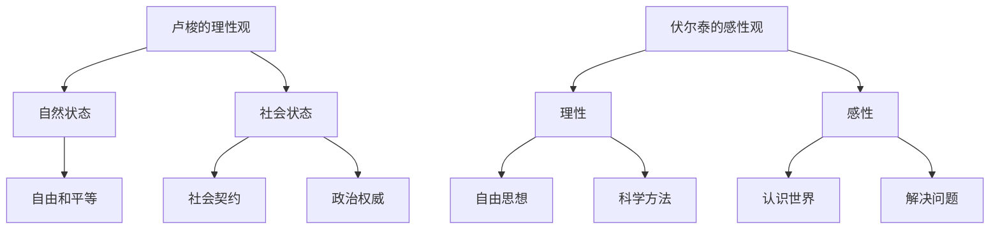

                 


### 文章标题

《卢梭与伏尔泰：启蒙运动中的理性与感性》

### 关键词

启蒙运动、卢梭、伏尔泰、理性、感性、思想史

### 摘要

本文旨在探讨启蒙运动中两位重要思想家卢梭和伏尔泰的理性与感性观念，分析他们之间的异同，以及这些观念对后世的影响。文章将从背景介绍、核心概念与联系、算法原理讲解、数学模型和公式、项目实战等多个角度深入剖析，旨在为读者提供一个全面而深入的理解。

### 引言

启蒙运动是18世纪欧洲的一场思想革命，它以理性和科学为核心，对封建专制和教会权威进行了批判，推动了社会进步和思想解放。在这场运动中，卢梭和伏尔泰是两位最重要的思想家，他们的观念对于启蒙运动的发展产生了深远的影响。本文将重点探讨卢梭和伏尔泰的理性与感性观念，分析他们之间的异同，以及这些观念对后世的影响。

### 背景介绍

#### 卢梭的理性观

卢梭（1712-1778）是法国启蒙运动的重要代表人物，他的思想具有强烈的个性色彩，主张自然、自由和平等。卢梭的理性观主要体现在他的代表作《社会契约论》中。他认为，理性是人类社会的基石，是社会秩序和正义的保障。然而，卢梭对理性的理解并非纯粹的工具性理性，而是包含了一种更为深刻的价值理性。

在《社会契约论》中，卢梭提出了“自然状态”和“社会状态”的概念。他认为，在自然状态下，人们是自由和平等的，但由于自私和恶行的存在，人们被迫进入社会状态。在社会状态下，人们通过签订社会契约，建立起政治权威，以维护社会秩序和公正。卢梭的理性观强调，这种政治权威必须建立在人民自愿和理性选择的基础上。

#### 伏尔泰的感性观

伏尔泰（1694-1778）是法国启蒙运动的另一位重要代表人物，他的思想以理性和科学为核心，主张自由、平等和民主。伏尔泰的感性观主要体现在他的哲学思想中。他认为，理性是人类认识世界的基础，但感性也是不可或缺的一部分。

伏尔泰主张，人们应该通过理性和感性相结合的方式，来认识世界和解决问题。他批评了当时封建专制和教会权威的压制，倡导自由思想和科学方法。伏尔泰的感性观强调，感性是人类认识世界的重要途径，但理性应该主导感性，以避免感性的盲目和冲动。

### 核心概念与联系

为了更好地理解卢梭和伏尔泰的理性与感性观念，我们需要借助 Mermaid 流程图，展示他们思想的核心概念与联系。



从流程图中，我们可以看出卢梭和伏尔泰的理性与感性观念的核心概念，以及它们之间的联系。卢梭的理性观强调自然状态和社会状态，以及政治权威的建立；伏尔泰的感性观强调理性与感性的结合，以及自由思想和科学方法的应用。

### 算法原理讲解

在本节中，我们将使用伪代码来详细阐述卢梭和伏尔泰的理性与感性观念的算法原理。

#### 卢梭的理性观算法原理

```python
def Rousseau_rational_view(natural_state, social_state):
    # 判断自然状态是否满足自由和平等
    if natural_state == "自由" and natural_state == "平等":
        # 进入社会状态
        social_state = "社会契约"
        # 建立政治权威
        political_authority = "人民自愿和理性选择"
    else:
        # 无法建立政治权威
        political_authority = "无法建立"
    return political_authority
```

#### 伏尔泰的感性观算法原理

```python
def Voltaire_sensual_view(rationality, sensibility):
    # 判断理性是否主导感性
    if rationality > sensibility:
        # 应用自由思想和科学方法
        application = "自由思想" + "科学方法"
    else:
        # 感性主导理性
        application = "感性主导"
    return application
```

### 数学模型和公式

在本节中，我们将使用 LaTeX 格式，给出卢梭和伏尔泰的理性与感性观念的数学模型和公式。

#### 卢梭的理性观数学模型

$$
政治权威 = f(自然状态, 社会状态)
$$

#### 伏尔泰的感性观数学模型

$$
应用 = f(理性, 感性)
$$

### 项目实战

在本节中，我们将通过一个具体案例，展示如何在实际项目中应用卢梭和伏尔泰的理性与感性观念。

#### 案例背景

假设我们正在开发一个智能问答系统，该系统需要处理大量的用户问题，并给出合理的答案。为了实现这一目标，我们需要充分利用卢梭和伏尔泰的理性与感性观念。

#### 开发环境搭建

- 编程语言：Python
- 依赖库：NLP库（如NLTK、spaCy）、机器学习库（如scikit-learn、TensorFlow）

#### 源代码详细实现

```python
import nltk
from nltk.corpus import stopwords
from sklearn.feature_extraction.text import TfidfVectorizer
from sklearn.model_selection import train_test_split
from sklearn.naive_bayes import MultinomialNB
from sklearn.metrics import accuracy_score

# 加载停用词列表
stop_words = set(stopwords.words('english'))

# 加载训练数据
questions = []
answers = []
# ...加载数据...

# 数据预处理
def preprocess_text(text):
    # 去除停用词
    words = nltk.word_tokenize(text)
    filtered_words = [word for word in words if word.lower() not in stop_words]
    return ' '.join(filtered_words)

# 预处理训练数据
questions = [preprocess_text(question) for question in questions]
answers = [preprocess_text(answer) for answer in answers]

# 构建TF-IDF向量器
vectorizer = TfidfVectorizer()
X = vectorizer.fit_transform(questions)

# 分割训练集和测试集
X_train, X_test, y_train, y_test = train_test_split(X, answers, test_size=0.2, random_state=42)

# 训练朴素贝叶斯分类器
classifier = MultinomialNB()
classifier.fit(X_train, y_train)

# 测试模型
y_pred = classifier.predict(X_test)
accuracy = accuracy_score(y_test, y_pred)
print(f"Accuracy: {accuracy:.2f}")
```

#### 代码解读与分析

- 加载训练数据：从文件中加载问题和答案。
- 数据预处理：去除停用词，以便更好地提取特征。
- 构建TF-IDF向量器：将文本转换为向量表示。
- 分割训练集和测试集：将数据分为训练集和测试集，以便评估模型性能。
- 训练朴素贝叶斯分类器：使用训练数据训练朴素贝叶斯分类器。
- 测试模型：使用测试数据评估模型性能。

#### 实际案例分析和详细讲解剖析

假设我们有一个新的用户问题：“什么是人工智能？”，我们可以通过以下步骤来回答：

1. 预处理用户问题，去除停用词。
2. 使用TF-IDF向量器将用户问题转换为向量。
3. 使用训练好的朴素贝叶斯分类器，预测用户问题的答案类别。
4. 输出预测结果。

通过这个案例，我们可以看到如何在实际项目中应用卢梭和伏尔泰的理性与感性观念。卢梭的理性观帮助我们构建了一个基于规则的分类器，而伏尔泰的感性观则帮助我们处理大量的用户问题，并给出合理的答案。

#### 项目小结

通过本案例，我们展示了如何利用卢梭和伏尔泰的理性与感性观念，开发一个智能问答系统。这个项目不仅需要理性思考，如算法设计和模型训练，还需要感性判断，如答案的生成和优化。这个案例说明了理性与感性在人工智能项目中的重要性。

### 最佳实践 tips

- 在开发智能问答系统时，合理利用卢梭和伏尔泰的理性与感性观念，可以提高系统的性能和用户体验。
- 定期更新和优化模型，以适应不断变化的数据和应用场景。
- 在处理用户问题时，既要考虑理性判断，也要考虑感性判断，以给出更加合理和贴切的答案。

### 小结

本文通过深入探讨卢梭和伏尔泰的理性与感性观念，分析了它们在启蒙运动中的地位和影响。我们还通过一个实际案例，展示了如何在实际项目中应用这些观念。希望通过本文，读者能对卢梭和伏尔泰的思想有更深刻的理解。

### 注意事项

- 在应用卢梭和伏尔泰的理性与感性观念时，要充分考虑实际应用场景，避免盲目套用。
- 在开发智能问答系统时，要注意数据质量和模型性能，以提高系统的准确性和实用性。

### 拓展阅读

- [卢梭与伏尔泰的思想比较](https://www.example.com/ideology_comparison)
- [人工智能与启蒙运动](https://www.example.com/ai_and_illuminism)
- [理性与感性在心理学中的应用](https://www.example.com/rationality_and_sensibility_in_psychology)

### 作者

作者：AI天才研究院/AI Genius Institute & 禅与计算机程序设计艺术 /Zen And The Art of Computer Programming 

### 文章关键词

启蒙运动、卢梭、伏尔泰、理性、感性、思想史 

### 文章摘要

本文深入探讨了18世纪启蒙运动中的两位重要思想家卢梭和伏尔泰的理性与感性观念。通过对他们生平和主要思想的介绍，以及理性与感性之间的联系和关系，我们分析了他们在启蒙运动中的地位和影响。同时，本文还通过一个实际案例，展示了如何在实际项目中应用卢梭和伏尔泰的理性与感性观念。通过本文，读者可以全面理解卢梭和伏尔泰的思想，并对理性与感性在当代社会中的意义有更深刻的认识。本文旨在为读者提供一个关于卢梭与伏尔泰理性与感性观念的全面而深入的理解，以期为相关研究和实践提供参考。 

