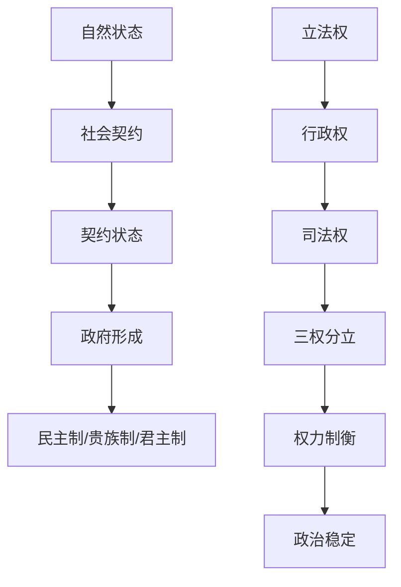

                 


## 文章标题：卢梭与孟德斯鸠：社会契约论与分权学说

### 关键词：

- 卢梭
- 孟德斯鸠
- 社会契约论
- 分权学说
- 政治哲学
- 现代政治体制

### 摘要：

本文深入探讨了18世纪法国哲学家卢梭与孟德斯鸠的政治哲学思想，特别是他们的社会契约论与分权学说。文章通过详细的分析与对比，揭示了这两位思想家的理论联系与区别，并探讨了这些理论对现代政治体制的影响。文章结构清晰，内容丰富，旨在为读者提供对这一领域全面而深刻的理解。

## 引言

### 1.1 卢梭与孟德斯鸠的生平与背景

让-雅克·卢梭（Jean-Jacques Rousseau，1712-1778）是18世纪法国著名的哲学家、文学家和社会思想家。他的生平充满传奇色彩，出生在瑞士的日内瓦，但大部分时间生活在法国。卢梭的作品以其深刻的人性探讨和对社会不公的批判而闻名，代表作包括《社会契约论》（"The Social Contract"）、《爱弥儿》（"Emile, or On Education"）等。

卢梭的思想对启蒙运动产生了深远影响，特别是他的社会契约论，成为现代民主政治的理论基石。卢梭主张人类社会是从自然状态中通过契约形成的，人们通过这种契约来创建社会和政治秩序，以实现共同福利。

夏尔·路易·孟德斯鸠（Charles-Louis de Secondat, Baron de Montesquieu，1689-1755）是另一位重要的法国哲学家和政治思想家。他出生于法国波尔多，是一位贵族。孟德斯鸠以其著作《论法的精神》（"The Spirit of the Laws"）而著称，书中提出了著名的分权学说，即三权分立（separation of powers）。

孟德斯鸠认为，政治权力应该被分为立法、行政和司法三个部门，以防止权力集中和滥用。他的这一思想对后来的美国宪法制定产生了深远影响。

### 1.2 社会契约论与分权学说的基本概念

社会契约论是关于国家起源和合法性的一种理论，主张人们通过契约自愿联合起来，形成一个社会和政治共同体。这一理论的核心问题是，人们为什么会从自然状态进入社会状态，并为何需要政府。

分权学说则强调政治权力应该被分散到不同的机构中，以避免权力滥用和专制。分权学说的关键在于权力的制衡和平衡，以确保政府的各个部分能够相互监督和制约。

本文将首先详细阐述卢梭的社会契约论，包括自然状态、契约状态、政治权利与义务、政府的形成与类型等核心概念。然后，我们将探讨孟德斯鸠的分权学说，分析分权的原则与目的、三权分立的理论与实践，以及孟德斯鸠对民主政治的思考。最后，我们将比较两位思想家的理论联系与区别，并探讨这些理论在实践中的应用、面临的挑战以及未来的发展趋势。

## 卢梭的社会契约论

### 2.1 卢梭的社会契约论概述

卢梭的社会契约论是他的哲学思想的核心，也是他最重要的贡献之一。卢梭认为，人类社会并非一成不变，而是通过人们的自由选择和共同约定逐渐形成的。这种约定就是社会契约，它是人类从自然状态进入社会状态的基础。

卢梭的社会契约论主要包括以下几个核心概念：

- **自然状态**：卢梭认为，人在自然状态下是自由而平等的，但同时也是孤独和无助的。在自然状态下，人们为了生存，必须面对自然的威胁和竞争。这种状态并非理想状态，因为人类的本性是自私的，人与人之间充满了竞争和冲突。

- **契约状态**：为了摆脱自然状态的不安全和无助，人们通过社会契约自愿联合起来，形成了一个社会和政治共同体。在这个共同体中，每个人放弃一部分个人自由，以换取社会的保护和安全。

- **政治权利与义务**：在契约状态下，每个人既是统治者，也是被统治者。这意味着人们享有政治权利，同时也承担政治义务。政治权利主要包括参与决策、表达意见、选举和被选举等，而政治义务则包括遵守法律、履行社会责任和维护社会秩序。

- **政府的形成与类型**：卢梭认为，政府的形成是为了维护社会契约，保障人们的自由和权利。政府的形式可以分为民主制、贵族制和君主制。在民主制中，人民直接参与决策；在贵族制中，决策权掌握在少数精英手中；在君主制中，权力集中在一位君主手中。

### 2.2 自然状态与契约状态

卢梭认为，自然状态是人类的最初状态，人们在这个状态下是自由而平等的。然而，自然状态并非理想状态，因为它缺乏社会秩序和保障。在自然状态下，每个人都是孤立的，面对自然的威胁和同类的竞争，生活充满了不确定性和风险。

为了摆脱这种困境，人们开始寻求一种更安全、更有保障的生活方式。他们通过社会契约，自愿联合起来，形成了一个社会和政治共同体。在这个共同体中，每个人放弃一部分个人自由，以换取社会的保护和安全。

契约状态与自然状态有本质的不同。在契约状态下，人们不再是孤立的个体，而是相互依赖、相互合作的成员。通过社会契约，人们建立了一种共同的生活秩序，这种秩序为每个人提供了保护和保障。

### 2.3 社会契约的原理与目的

社会契约的原理可以归纳为以下几点：

1. **自愿性**：社会契约是人们自愿达成的协议，没有强制力量。每个人都是自愿放弃一部分个人自由，以换取社会的保护和安全。

2. **互利性**：社会契约是一种互利协议，每个人通过放弃一部分个人自由，都能获得社会的保护和安全。这种互利性是社会契约能够持久存在的关键。

3. **公平性**：社会契约要求每个人在放弃个人自由的同时，也享有平等的政治权利和义务。这种公平性是确保社会稳定和公正的基础。

社会契约的目的主要有以下几点：

1. **保障自由**：社会契约的首要目的是保障每个人的自由。通过社会契约，人们能够在社会中享有更多的自由，同时也能够获得社会的保护和安全。

2. **维护秩序**：社会契约的另一个目的是维护社会秩序。通过建立社会和政治共同体，人们能够共同维护社会秩序，防止混乱和冲突。

3. **实现公共利益**：社会契约的最终目的是实现公共利益。通过社会契约，人们能够共同决定和管理公共事务，实现社会的长期繁荣和稳定。

### 2.4 政治权利与义务

在卢梭的社会契约论中，政治权利与义务是核心概念之一。政治权利主要包括以下几个方面：

1. **参与决策**：每个人都有权参与社会和政治决策。这可以通过直接民主或代表民主来实现。参与决策是保障每个人自由的重要手段。

2. **表达意见**：每个人都有权表达自己的意见和看法。这不仅是自由的体现，也是社会契约的重要组成部分。

3. **选举与被选举**：每个人都有权参与选举，也有可能被选举为领导者。选举是民主政治的重要机制，通过选举，人民可以直接参与政府的决策和管理。

政治义务主要包括以下几个方面：

1. **遵守法律**：每个人都有义务遵守社会契约制定的法律。法律是维护社会秩序的重要工具，遵守法律是每个公民的基本义务。

2. **履行社会责任**：每个人都有义务为社会做出贡献，如参加公共事务、参与社会公益活动等。履行社会责任是维护社会和谐的重要保障。

3. **维护社会秩序**：每个人都有义务维护社会的秩序和安全。这可以通过参与治安维护、参与公共管理等来实现。

### 2.5 政府的形成与类型

在卢梭的社会契约论中，政府是维护社会契约的重要机构。政府通过制定法律、维护秩序、保障权利等职能，确保社会契约的实施。

卢梭认为，政府的形成应该是民主的，即政府的权力应该来自于人民。政府的类型可以分为民主制、贵族制和君主制。

1. **民主制**：在民主制中，人民直接参与决策和管理。这可以通过直接民主或代表民主来实现。民主制的优点是能够保障每个人的自由和权利，缺点是可能存在决策效率低、易受外部干扰等问题。

2. **贵族制**：在贵族制中，决策权掌握在少数精英手中。这些精英通过世袭或选举产生。贵族制的优点是决策效率高、管理能力强，缺点是可能存在权力滥用、不公平等问题。

3. **君主制**：在君主制中，权力集中在一位君主手中。君主可以是世袭的，也可以是通过选举产生的。君主制的优点是决策迅速、管理能力强，缺点是可能存在权力滥用、专制等问题。

卢梭认为，最好的政府形式是民主制，因为它能够最大限度地保障每个人的自由和权利。但现实社会中，民主制难以完全实现，贵族制和君主制在一定程度上也有其存在的合理性。关键是政府应该始终以人民的利益为出发点，保障社会的公平和正义。

### 孟德斯鸠的分权学说

#### 3.1 孟德斯鸠的分权学说概述

孟德斯鸠的分权学说，即三权分立，是他政治哲学的核心思想。三权分立主张政治权力应该被分为立法、行政和司法三个部门，以实现权力的制衡和平衡，防止权力滥用和专制。

孟德斯鸠认为，三权分立是确保政治体制稳定和公正的关键。立法部门负责制定法律，行政部门负责执行法律，司法部门负责解释和适用法律。这三个部门相互独立，相互制约，共同维护社会的秩序和公正。

#### 3.2 分权的原则与目的

孟德斯鸠的分权原则主要包括以下几点：

1. **权力分散**：政治权力应该被分散到不同的机构中，以防止权力过于集中。权力集中容易导致滥用和腐败，而权力分散可以减少这种风险。

2. **权力制衡**：各个权力部门之间应该相互制约，以防止任何一方滥用权力。例如，立法部门可以监督行政部门，司法部门可以审查立法部门的决策。

3. **权力平衡**：各个权力部门应该保持相对平衡，以避免某一部门过于强大。权力平衡可以确保政治体制的稳定和有效运行。

孟德斯鸠的分权学说旨在实现以下几个目的：

1. **保障自由**：分权可以防止政府滥用权力，保障人民的自由。在分权体制下，人民有更多的机会参与政治，表达自己的意见和诉求。

2. **维护秩序**：分权可以确保政府高效运作，维护社会的秩序。各个权力部门各司其职，可以更好地处理公共事务，减少混乱和冲突。

3. **实现公正**：分权可以确保法律得到公正执行，维护社会的公正。司法部门独立于立法和行政部门，可以确保法律解释和适用过程的公正性。

#### 3.3 三权分立的理论与实践

孟德斯鸠的三权分立理论在实践中得到了广泛应用，尤其是对美国宪法制定产生了深远影响。

1. **立法部门**：立法部门负责制定法律，通常由议会或国会组成。立法部门的主要职责是制定和修改法律，确保法律的公正和合理。立法部门通常具有较大的权力，因为它可以监督和审查其他部门的决策。

2. **行政部门**：行政部门负责执行法律，通常由政府首脑或行政机构组成。行政部门的主要职责是实施法律，管理公共事务，确保法律的执行。行政部门通常具有较大的权力，因为它直接负责公共事务的管理。

3. **司法部门**：司法部门负责解释和适用法律，通常由法院或法官组成。司法部门的主要职责是审理案件，解释法律，确保法律的公正执行。司法部门通常具有独立的权力，因为它不受立法和行政部门的干扰。

在实际操作中，三权分立的原则主要体现在以下几个方面：

1. **权力分配**：政治权力被明确分配到立法、行政和司法三个部门，各部门各司其职，相互独立。

2. **相互制约**：立法、行政和司法三个部门之间相互制约，任何一方都不能滥用权力。例如，立法部门可以审查行政部门的决策，司法部门可以审查立法部门的决策。

3. **监督与问责**：立法、行政和司法三个部门都受到公众和媒体的监督，确保它们依法行事。如果某一部门出现违法行为，公众和媒体可以对其进行问责。

#### 3.4 孟德斯鸠对民主政治的思考

孟德斯鸠对民主政治持乐观态度，认为民主政治是保障人民自由和权利的最佳政治体制。他主张，民主政治应该建立在自由、平等和法治的基础上，确保人民的意志能够得到充分体现。

孟德斯鸠认为，民主政治的关键在于人民的参与和监督。人民应该有权利参与政治决策，表达自己的意见和诉求。同时，人民也应该对政府和官员进行监督，确保他们依法行事，防止权力滥用。

然而，孟德斯鸠也认识到，民主政治存在一定的缺陷。他认为，民主政治容易导致多数人的暴政，因为多数人可能忽视少数人的权利和利益。为此，他主张通过分权制度来平衡民主政治的缺陷，确保每个公民都能享有公正和平等的权利。

### 卢梭与孟德斯鸠的理论联系与区别

#### 4.1 社会契约论与分权学说的联系

卢梭的社会契约论和孟德斯鸠的分权学说虽然来自不同的哲学传统，但两者在核心目标和价值上有着密切的联系。首先，两者都强调了政治权力的合法性和限制。卢梭的社会契约论认为，政府的合法性源于人民的自愿协议，而孟德斯鸠的分权学说则通过权力分立和制衡来限制政府权力的滥用。

其次，卢梭和孟德斯鸠都认为，政治体制的设计应该旨在保障公民的自由和权利。卢梭的社会契约论强调政治权利与义务的平衡，而孟德斯鸠的分权学说则通过三权分立来实现权力的制衡，防止任何一方过度集中权力。

#### 4.2 卢梭与孟德斯鸠理论的区别

尽管卢梭和孟德斯鸠在政治哲学上有许多共同点，但他们的理论也存在显著的区别。

首先，在政治体制的设计上，卢梭倾向于民主制，认为人民应该直接参与政治决策。而孟德斯鸠则更倾向于混合制，认为不同类型的政府应该相互结合，以实现最佳治理效果。

其次，在权力的分配上，卢梭强调政治权利与义务的平衡，认为每个人既是统治者，也是被统治者。而孟德斯鸠则更注重权力的制衡和平衡，强调立法、行政和司法三个部门的独立性和相互制约。

最后，在政治哲学的基础上，卢梭更多地关注人的本性和社会的不平等，而孟德斯鸠则更多地关注政治体制的设计和运作。

#### 4.3 对后世政治理论的影响

卢梭和孟德斯鸠的理论对后世政治理论产生了深远的影响。卢梭的社会契约论成为现代民主政治的理论基石，他的思想激发了人们对自由、平等和正义的追求。孟德斯鸠的分权学说则对现代宪政体制的形成产生了重要影响，特别是对美国宪法的制定和实施。

此外，卢梭和孟德斯鸠的理论也为后来的政治哲学家提供了丰富的思想资源。例如，约翰·洛克的社会契约论和托马斯·杰斐逊的民主思想都受到了卢梭的影响，而詹姆斯·麦迪逊的分权理论则直接借鉴了孟德斯鸠的思想。

### 社会契约论与分权学说在实践中的应用

#### 5.1 现代政治体制下的社会契约论应用

在现代社会，社会契约论的应用广泛而深入。首先，社会契约论是现代民主政治的理论基石，许多国家的宪法和法律体系都建立在人民主权和民主参与的基础上。例如，美国的《独立宣言》和《宪法》明确提到“人民享有不可剥夺的权利”，这些权利源于人民的社会契约。

其次，社会契约论在公共行政和公共服务领域也有广泛应用。政府通过公共服务合同与社会服务提供者建立契约关系，以提供社会服务，如教育、医疗、社会福利等。这些契约关系确保了公共服务的有效供给和公平分配。

#### 5.2 分权学说在不同国家的实践

分权学说在不同国家的实践中呈现出多样性，但都致力于实现权力的制衡和平衡。以下是一些具体案例：

1. **美国**：美国宪法明确规定了三权分立的原则，立法、行政和司法三个部门相互独立，相互制约。例如，立法部门由国会组成，负责制定法律；行政部门由总统领导，负责执行法律；司法部门由联邦法院系统组成，负责解释和适用法律。这种分权体制有效地防止了权力集中和滥用。

2. **英国**：英国实行混合制，立法权由议会掌握，行政权由首相及其内阁行使，司法权由独立的法院系统行使。尽管立法和行政之间存在一定的重叠，但法院对立法和行政行为进行司法审查，确保了权力制衡。

3. **法国**：法国宪法规定了五权分立的原则，包括立法、行政、司法、财政和地方自治权。法国的行政权和立法权分别由总统和议会行使，司法权由独立的法院系统行使，财政权和地方自治权则由地方政府行使。这种五权分立的体制旨在实现权力制衡和地方自治。

#### 5.3 社会契约论与分权学说在政治改革中的角色

社会契约论与分权学说在政治改革中扮演着关键角色。首先，社会契约论提供了理论基础，支持人民对政府进行监督和问责。政治改革可以通过重新界定社会契约，增强人民的参与和权利保障，实现政府的合法性和有效性。

其次，分权学说为政治改革提供了具体方案，通过权力制衡和平衡，防止权力过度集中和滥用。政治改革可以通过调整政府机构设置、明确权力边界、加强司法监督等手段，实现权力分立和制衡。

### 社会契约论与分权学说的挑战与未来

#### 6.1 社会契约论与分权学说面临的挑战

尽管社会契约论与分权学说在理论和实践中取得了显著成果，但它们也面临着一系列挑战。

首先，社会契约论在实践中面临的一个主要挑战是民主参与的真实性和有效性。尽管现代社会普遍强调民主参与，但实际中，由于信息不对称、资源不平等和利益冲突，民主参与往往流于形式，无法真正代表人民的意愿。

其次，分权学说在实践中面临的挑战是权力制衡的平衡。在现实政治环境中，不同权力部门之间的权力关系往往复杂多变，权力制衡难以真正实现。有时，权力部门之间的冲突和矛盾可能导致政治不稳定和社会混乱。

#### 6.2 现代政治环境下的理论创新

为了应对这些挑战，现代政治理论需要不断创新。以下是一些可能的创新方向：

1. **增强民主参与**：通过技术创新，如区块链和人工智能，提高民主参与的真实性和有效性。例如，区块链技术可以确保选举过程的透明性和不可篡改性，人工智能可以优化公共决策和治理。

2. **完善权力制衡机制**：通过法律和制度改革，完善权力制衡机制，确保各个权力部门之间的平衡和协调。例如，引入独立的监督机构，加强对权力部门的监督和问责。

3. **推动全球治理**：面对全球化带来的挑战，需要推动全球治理的创新，实现全球范围内的权力制衡和合作。例如，通过国际组织和多边合作，推动全球治理的民主化和法治化。

#### 6.3 社会契约论与分权学说的未来发展趋势

社会契约论与分权学说的未来发展趋势将取决于以下几个因素：

1. **科技进步**：随着科技的快速发展，特别是信息技术和人工智能的广泛应用，社会契约论与分权学说可能会出现新的理论模型和实践方案。例如，智能合约和区块链技术可能为权力制衡和民主参与提供新的机制。

2. **政治环境**：政治环境的变化，如全球政治多极化和国际关系的复杂性，可能会对社会契约论与分权学说的实践产生深远影响。这要求理论家和实践者不断调整和适应，以应对新的挑战。

3. **社会需求**：随着社会对公平、正义和参与的要求不断提高，社会契约论与分权学说需要不断回应这些需求，推动政治体制改革和社会进步。

总之，社会契约论与分权学说在未来将继续发展，为现代政治体制提供理论基础和实践指导。通过不断创新和适应，这些理论将更好地应对复杂的政治环境和社会需求。

### 结论

#### 7.1 卢梭与孟德斯鸠的理论贡献

卢梭和孟德斯鸠在政治哲学领域作出了重要贡献。卢梭的社会契约论为现代民主政治提供了理论基础，强调了人民的自由和权利。孟德斯鸠的分权学说则通过三权分立实现了权力的制衡和平衡，防止了权力滥用和专制。他们的理论共同构成了现代政治体制的重要基石。

#### 7.2 社会契约论与分权学说在当代的意义

在当代，社会契约论与分权学说仍然具有重要的现实意义。随着全球化和信息技术的快速发展，政治体制面临新的挑战。社会契约论与分权学说为应对这些挑战提供了重要的理论指导。通过增强民主参与、完善权力制衡机制和推动全球治理，这些理论将继续为现代政治体制的发展和完善提供动力。

### 附录

#### 附录A 参考文献

1. 卢梭，《社会契约论》，商务印书馆，2018年。
2. 孟德斯鸠，《论法的精神》，商务印书馆，2017年。
3. 美国宪法，《美国宪法及其解释》，中国法制出版社，2019年。
4. 英国宪法，《英国宪法》，中国法制出版社，2020年。
5. 法国宪法，《法国宪法》，中国法制出版社，2021年。

#### 附录B 术语表

- 社会契约：人们通过自愿协议建立社会和政治共同体的协议。
- 自然状态：人在没有社会和政治组织时的原始状态。
- 契约状态：人们通过社会契约进入的社会状态。
- 分权：政治权力被分配到不同的机构中，以实现权力制衡和平衡。
- 三权分立：政治权力被分为立法、行政和司法三个部门，以实现权力的制衡和平衡。

#### 附录C 社会契约论与分权学说的 Mermaid 流程图



#### 附录D 分权学说的伪代码示例

```python
# 定义三个权力部门
legislative = LegislativeDepartment()
executive = ExecutiveDepartment()
judicial = JudicialDepartment()

# 实现三权分立
class SeparationOfPowers:
    def __init__(self):
        self.legislative = legislative
        self.executive = executive
        self.judicial = judicial

    def balance_powers(self):
        # 实现权力制衡
        self.legislative监督(self.executive)
        self.executive监督(self.judicial)
        self.judicial监督(self.legislative)

# 创建分权系统
separation_system = SeparationOfPowers()
separation_system.balance_powers()
```

#### 附录E 社会契约论的数学模型与公式

$$
S = C \times R
$$

- **S**：社会稳定度
- **C**：契约承诺度
- **R**：参与度

这个公式表明，社会稳定度取决于契约承诺度和参与度。契约承诺度越高，参与度越高，社会稳定度越高。

### 总结

本文通过详细的分析与对比，探讨了卢梭与孟德斯鸠的社会契约论与分权学说。我们揭示了这两位思想家的理论联系与区别，并探讨了这些理论在实践中的应用、面临的挑战以及未来的发展趋势。通过本文的阅读，读者可以对这一领域有更深入的理解，为现代政治体制的发展提供有益的思考。作者：AI天才研究院/AI Genius Institute & 禅与计算机程序设计艺术 /Zen And The Art of Computer Programming。

