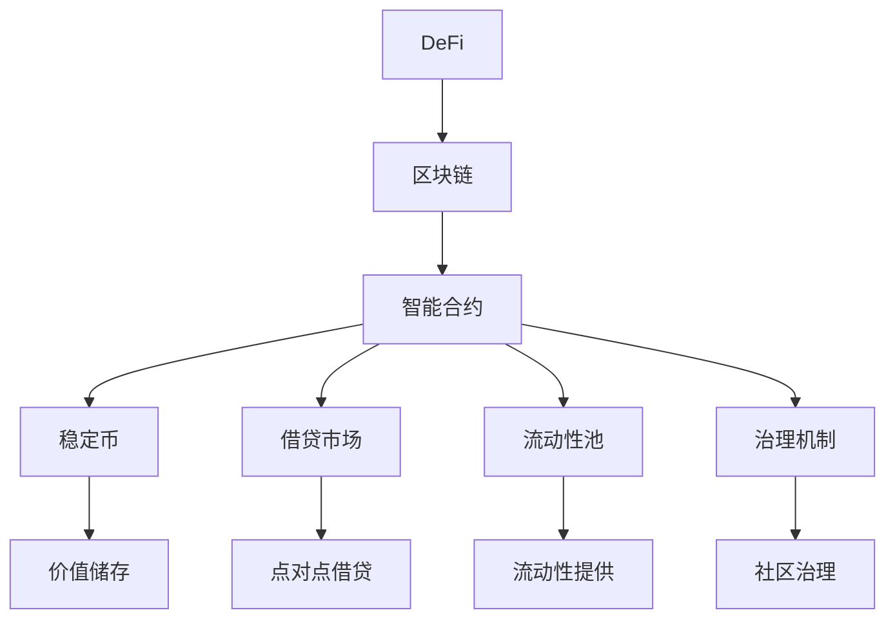

                 

 
## 文章标题：去中心化金融（DeFi）：区块链驱动的金融创新

### 关键词：去中心化金融（DeFi）、区块链、金融创新、智能合约、去中心化应用（DApp）、跨链技术、稳定币、代币经济学、安全性、法律与监管

#### 摘要：
本文将深入探讨去中心化金融（DeFi）的概念、原理、架构和技术，揭示其作为区块链驱动的金融创新的重要性和潜力。通过逐步分析，我们将了解DeFi如何改变传统金融体系的运作方式，以及其面临的安全与挑战。本文还将提供实际项目案例，以帮助读者更好地理解和应用DeFi技术。

## 引言与背景

去中心化金融（DeFi）作为区块链技术的重要应用之一，近年来在全球金融领域引发了广泛关注。DeFi的核心在于通过区块链和智能合约技术，实现金融服务的去中心化和自动化，从而改变传统金融体系的运作方式。

### 1.1 DeFi的定义与历史

去中心化金融（Decentralized Finance，简称DeFi）是一种基于区块链技术的金融模式，它通过智能合约提供金融服务，不需要传统的金融机构作为中介。DeFi的历史可以追溯到2017年，当时以太坊区块链的兴起促进了智能合约技术的发展，从而为DeFi的诞生奠定了基础。

### 1.2 区块链与去中心化金融的关系

区块链技术为DeFi提供了安全的分布式账本，确保了交易记录的不可篡改性和透明性。智能合约则实现了自动化和可信的执行，使得金融交易可以在无需第三方中介的情况下进行。这种关系使得DeFi能够实现去中心化和高效率的金融运作。

### 1.3 DeFi的核心概念与特点

DeFi的核心概念包括去中心化、透明性、开放性、安全性和自动化。去中心化意味着金融服务不再依赖于单一中心化的机构，提高了系统的抗风险能力。透明性则来自于区块链上的所有交易记录都是公开可查的，确保了金融操作的透明性。开放性使得任何人都可以访问和使用DeFi服务，不受地理和金融限制。安全性依赖于区块链技术的加密算法和智能合约的可靠性。自动化则是智能合约的核心特性，通过代码自动执行金融交易，提高了效率。

## DeFi核心概念与原理

### 2.1 区块链基础

区块链是DeFi的基础技术，它通过分布式账本技术确保了交易记录的安全性和不可篡改性。区块链由一系列按时间顺序排列的区块组成，每个区块都包含一定数量的交易记录。这些区块通过加密算法相互链接，形成了一个不可篡改的链条。

### 2.2 智能合约基础

智能合约是DeFi的核心组件，它是一种自动执行的合约，通过编程语言实现金融逻辑。智能合约在区块链上运行，确保了金融交易的自动化和可信性。智能合约的关键特性包括自执行性、不可篡改性、透明性和安全性。

### 2.3 DeFi的核心概念与联系

DeFi的核心概念包括去中心化金融、稳定币、借贷市场、流动性池和治理机制。这些概念相互关联，共同构成了DeFi生态系统。例如，稳定币是DeFi中的价值储存和交易媒介，借贷市场则通过智能合约实现点对点的借贷服务。流动性池则提供了流动性，使得金融市场保持高效运作。治理机制则确保了DeFi社区的公正和透明。

### 2.4 Mermaid流程图

为了更好地理解DeFi的核心概念和架构，我们可以使用Mermaid流程图来展示它们之间的关系。以下是一个简化的DeFi流程图：



### 2.5 核心算法原理讲解

DeFi中的核心算法主要包括加密算法、共识算法和智能合约算法。以下是一个简化的伪代码，展示了这些算法的原理：

```plaintext
// 加密算法
function encrypt(data, key) {
    // 使用对称加密算法
    return encryptedData;
}

function decrypt(encryptedData, key) {
    // 使用对称加密算法
    return decryptedData;
}

// 共识算法
function consensus Algorithm(block1, block2) {
    // 比较区块的哈希值，确保一致性
    if (block1.hash == block2.hash) {
        return true;
    } else {
        return false;
    }
}

// 智能合约算法
function executeContract(contractCode, data) {
    // 解释执行智能合约代码
    contractOutput = contractCode.execute(data);
    return contractOutput;
}
```

### 2.6 数学模型和数学公式

DeFi中的数学模型和数学公式主要用于稳定币的发行、借贷市场的利率计算和治理机制的投票。以下是一个简单的数学公式示例：

$$
V = \frac{C \times P}{I}
$$

其中，V代表价值，C代表成本，P代表利润，I代表投资。

### 2.7 详细讲解与举例说明

为了更好地理解上述数学模型和公式，我们可以通过一个具体的例子来进行讲解。假设我们有一个DeFi项目，其稳定币的发行成本为100万美元，利润为50万美元，投资为200万美元。那么，该稳定币的价值可以通过上述公式计算：

$$
V = \frac{100万 \times 50万}{200万} = 25万
$$

这意味着每个稳定币的价值为25万美元。

## DeFi架构与技术实现

### 3.1 DeFi架构设计

DeFi的架构设计涉及多个层次，包括网络层、协议层和应用层。网络层负责区块链基础设施的搭建，协议层实现智能合约和去中心化应用（DApp）的运行，应用层提供用户界面和交互体验。

### 3.2 模块化设计与可扩展性

模块化设计使得DeFi系统具有高度的灵活性和可扩展性。通过将系统划分为多个模块，每个模块可以独立开发、测试和部署。这种方式不仅提高了开发效率，还降低了系统复杂度。

### 3.3 安全性与稳定性保障

DeFi系统的安全性是至关重要的，因此需要采取多种措施来保障。这包括加密算法的安全性、智能合约的安全性、网络攻击防护和系统容错性。同时，为了确保系统的稳定性，需要定期进行系统升级和维护。

### 3.4 开发实践

在实际开发中，我们可以使用现有的DeFi框架和工具，如Truffle、Ganache和Hardhat等，来搭建开发环境。以下是一个简化的开发流程：

```plaintext
1. 环境搭建：安装Node.js、npm和指定版本的Solidity编译器。
2. 初始化项目：使用Truffle框架创建一个新的DeFi项目。
3. 编写智能合约：使用Solidity编写智能合约代码，并进行编译和测试。
4. 部署合约：使用Truffle部署智能合约到测试网络，如Ropsten或Goerli。
5. 集成DApp：使用Web3.js或Ethers.js等库与智能合约进行交互，搭建用户界面。
6. 测试与调试：进行功能测试和性能测试，修复潜在问题。
7. 部署到主网：在确保所有测试通过后，将智能合约部署到主网。
```

### 3.5 项目实战

以下是一个具体的DeFi项目案例：稳定币的发行与交易。

#### 开发环境搭建

1. 安装Node.js和npm。
2. 安装Truffle框架：`npm install -g truffle`.
3. 安装Ganache：下载并安装Ganache桌面应用。

#### 源代码实现

```solidity
// SPDX-License-Identifier: MIT
pragma solidity ^0.8.0;

import "@openzeppelin/contracts/token/ERC20/ERC20.sol";

contract StableCoin is ERC20 {
    uint256 public totalSupply;
    mapping(address => uint256) public balanceOf;

    constructor() ERC20("StableCoin", "SC") {
        totalSupply = 1000000 * (10 ** 18); // 初始化总供应量为1000万
        balanceOf[msg.sender] = totalSupply; // 初始化合约拥有者拥有全部代币
    }

    function mint(address account, uint256 amount) public {
        require(account != address(0), "Invalid address");
        totalSupply += amount;
        balanceOf[account] += amount;
        emit Transfer(address(0), account, amount);
    }

    function burn(address account, uint256 amount) public {
        require(account != address(0), "Invalid address");
        require(balanceOf[account] >= amount, "Insufficient balance");
        totalSupply -= amount;
        balanceOf[account] -= amount;
        emit Transfer(account, address(0), amount);
    }
}
```

#### 代码解读

1. 使用OpenZeppelin库中的ERC20合约实现稳定币的基本功能。
2. `mint`函数用于发行稳定币，`burn`函数用于销毁稳定币。
3. `balanceOf`函数用于查询用户余额。

#### 代码应用解读与分析

通过这个稳定币合约，用户可以方便地发行、持有和交易稳定币。例如，开发者可以创建一个DApp，允许用户通过智能合约发行稳定币，并在区块链上进行交易。

#### 实际案例分析

以Compound Finance为例，这是一个去中心化借贷平台，用户可以使用稳定币进行借贷和交易。通过分析Compound Finance的合约代码和架构，我们可以深入了解DeFi的实际应用和运作机制。

#### 项目小结

通过这个案例，我们展示了如何使用智能合约和区块链技术实现DeFi项目。这种方法不仅提高了金融服务的效率，还确保了交易的安全性和透明性。

### 3.6 最佳实践 tips

- 在开发DeFi项目时，务必进行详尽的测试，确保智能合约的正确性和安全性。
- 使用成熟的开源框架和工具，如Truffle、Ganache和Hardhat等，以提高开发效率。
- 关注社区反馈和安全报告，及时修复潜在的安全漏洞。

### 3.7 小结、注意事项、拓展阅读

- DeFi作为区块链驱动的金融创新，具有巨大的潜力。然而，其安全性、法律和监管问题仍然需要关注和解决。
- 欲深入了解DeFi的技术细节和应用，请参考以下拓展阅读：
  - 《智能合约与区块链编程》
  - 《区块链技术指南》
  - 《去中心化金融：原理与实践》

## DeFi安全与挑战

### 4.1 常见风险类型

DeFi系统面临的主要风险包括智能合约漏洞、网络攻击、市场操纵和合规性问题。智能合约漏洞可能导致代币被盗或系统瘫痪。网络攻击，如DDoS攻击，可能破坏系统的可用性。市场操纵则可能导致市场失真。合规性问题则涉及到法律和监管问题，可能对项目造成重大影响。

### 4.2 风险管理策略

为了应对这些风险，DeFi项目可以采取以下策略：

- 审计与审查：定期对智能合约进行专业审计，以确保其安全性。
- 防火墙与监控：部署防火墙和监控系统，及时发现并应对潜在的网络攻击。
- 法律合规：遵守当地法律和监管要求，确保项目的合法性和可持续性。

### 4.3 法律与监管问题

DeFi的法律和监管问题复杂且多变。不同国家和地区的法律法规对DeFi项目有不同的看法和要求。例如，一些国家将DeFi视为合法的金融创新，而另一些国家则可能对DeFi项目进行严格监管。因此，DeFi项目需要密切关注当地法律法规的变化，以确保项目的合法性和合规性。

### 4.4 安全案例分析

以下是一些DeFi项目的安全事件案例：

- TheDAO事件：2016年，TheDAO智能合约遭受黑客攻击，导致约3600万美元的以太币被盗。
- Parity钱包漏洞：2017年，Parity钱包出现漏洞，导致数百万美元的以太币被锁定。
- Quant Network黑客攻击：2020年，Quant Network的智能合约遭受黑客攻击，导致超过1000万美元的加密货币被盗。

### 4.5 安全漏洞分析与防御

通过分析这些安全事件，我们可以得出以下结论：

- 智能合约漏洞是DeFi系统面临的主要风险之一。因此，开发者在编写智能合约时需要严格遵守最佳实践，确保代码的安全性和正确性。
- 定期进行代码审计和安全测试，及时发现和修复潜在的安全漏洞。
- 引入多重签名和权限管理机制，以降低单点故障的风险。
- 加强网络攻击防护，部署防火墙和入侵检测系统。

### 4.6 注意事项

- 在使用DeFi服务时，务必了解项目的安全措施和透明度。
- 不随意点击不明链接或下载未知文件，以免遭受网络攻击。
- 关注社区反馈和安全报告，及时更新系统和安全工具。

## DeFi未来发展趋势

### 5.1 新兴技术与应用场景

随着区块链技术的不断演进，DeFi将继续探索更多新兴技术和应用场景。例如，跨链技术将促进不同区块链之间的互操作性，实现更广泛的金融生态系统。去中心化身份验证和隐私保护技术也将提高DeFi的安全性。此外，人工智能和机器学习技术的应用将使DeFi平台更加智能和高效。

### 5.2 国际化与全球化趋势

DeFi的发展趋势之一是国际化与全球化。随着全球金融监管环境的逐步开放，DeFi项目将更容易进入不同国家和地区。这将促进全球金融市场的融合和流动，为用户提供更多选择和机会。

### 5.3 社会影响力与可持续发展

DeFi不仅具有金融潜力，还对社会和可持续发展具有深远影响。通过去中心化的金融服务，DeFi可以帮助解决传统金融服务覆盖不足的问题，提高金融包容性。此外，DeFi项目可以引入环保激励机制，推动可持续发展和环境保护。

### 5.4 潜在发展机会

- 智能合约与去中心化金融的深度融合，将带来更多的创新应用。
- 跨链技术的发展，将实现不同区块链之间的价值流通和协作。
- 去中心化身份验证和隐私保护技术的应用，将提高用户隐私和安全。
- 社区参与和治理机制的优化，将增强DeFi生态系统的透明性和公正性。

## DeFi的未来挑战与展望

### 6.1 技术与市场挑战

尽管DeFi展示了巨大的潜力，但其在技术、市场和应用层面仍面临诸多挑战。技术挑战包括智能合约安全性、性能优化和跨链技术的成熟度。市场挑战则包括用户教育、市场接受度和监管不确定性。

### 6.2 法规与政策环境

DeFi的监管环境复杂且多变。不同国家和地区的监管政策对DeFi项目的接受程度和合规要求有所不同。因此，DeFi项目需要密切关注监管动态，确保项目的合法性和合规性。

### 6.3 社会影响与伦理问题

DeFi的发展对社会和伦理问题提出了新的挑战。例如，金融包容性、隐私保护和数据安全等问题需要引起广泛关注。DeFi项目需要积极应对这些挑战，确保其对社会和用户产生积极影响。

### 6.4 持续发展与创新

面对挑战，DeFi需要持续发展和创新。通过技术突破、市场教育和政策倡导，DeFi项目可以不断改进和完善，实现长期可持续发展。

### 总结与展望

去中心化金融（DeFi）作为区块链驱动的金融创新，具有改变传统金融体系潜力。通过本文的逐步分析，我们深入了解了DeFi的核心概念、原理、架构和技术，探讨了其面临的安全与挑战，展望了未来的发展趋势。

### 作者信息

作者：AI天才研究院/AI Genius Institute & 禅与计算机程序设计艺术 /Zen And The Art of Computer Programming

## 附录

### 附录A：DeFi资源与工具

#### A.1 开发工具与框架

- Truffle：智能合约开发框架，提供本地测试网络和部署工具。
- Hardhat：基于以太坊的智能合约开发工具，提供本地开发环境和运行时。
- OpenZeppelin：智能合约库，提供安全性和功能性模块。
- Ganache：本地以太坊节点和测试网络，用于开发和测试智能合约。

#### A.2 学习资源与教程

- Ethereum官方文档：全面介绍以太坊区块链和智能合约技术。
- Blockchain Education Network：提供区块链和DeFi的相关课程和教程。
- CoinGeek：区块链新闻和资源，涵盖DeFi领域的研究和分析。

#### A.3 社区与论坛

- Ethereum社区：以太坊区块链和DeFi的核心社区，提供技术支持和讨论。
- DeFi Pulse：DeFi项目的排名和数据分析，帮助用户了解市场动态。
- r/DeFi：Reddit上的DeFi社区，讨论DeFi技术和项目。
```

### 关键词：去中心化金融（DeFi）、区块链、金融创新、智能合约、去中心化应用（DApp）、跨链技术、稳定币、代币经济学、安全性、法律与监管

### 摘要：
本文深入探讨了去中心化金融（DeFi）的概念、原理、架构和技术，以及其在区块链驱动的金融创新中的重要性。通过逐步分析，我们了解了DeFi如何改变传统金融体系的运作方式，以及其面临的安全与挑战。文章还提供了实际项目案例，以帮助读者更好地理解和应用DeFi技术。展望未来，DeFi将继续在全球金融领域发挥重要作用，但同时也需要解决技术、市场和监管等方面的挑战。

