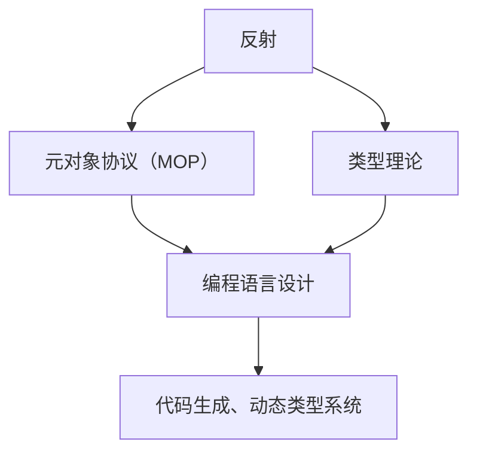

                 

### 文章标题

《反射与元对象协议的类型理论》

### 关键词

反射、元对象协议（MOP）、类型理论、面向对象编程、动态类型系统、类型安全

### 摘要

本文深入探讨了反射、元对象协议（MOP）和类型理论这三个核心概念，并详细解析了它们在编程领域的应用。首先，介绍了反射和MOP的基本概念及其在面向对象编程中的重要性。接着，探讨了类型理论的基本原理，并分析了它如何影响编程语言的设计。随后，通过伪代码和LaTeX公式，详细讲解了核心算法原理。文章最后，结合实际项目实战，展示了反射与MOP在编程语言和框架中的应用，并提供了最佳实践和小结。本文旨在帮助读者全面理解这三个关键概念，为深入研究和应用打下坚实基础。

----------------------------------------------------------------

# 引言

## 反射的概念

反射（Reflection）是编程语言中的一个重要概念，它允许程序在运行时检查、修改或扩展自身结构。简单来说，反射就是程序能够“观察”和“操作”自己的运行状态和行为。这种能力在动态语言如Python、Java和JavaScript中尤为重要。

### 反射的原理

在Java中，反射允许程序在运行时获取类的信息，如字段、方法和构造函数，并动态创建对象或调用方法。这个过程通常通过`Class`类和反射API来实现。以下是一个简单的Java代码示例，展示了如何使用反射获取和设置字段值：

```java
public class Person {
    private String name;

    public String getName() {
        return name;
    }

    public void setName(String name) {
        this.name = name;
    }
}

public class Main {
    public static void main(String[] args) {
        try {
            Class<?> personClass = Class.forName("Person");
            Person person = (Person) personClass.getDeclaredConstructor().newInstance();

            Field nameField = personClass.getDeclaredField("name");
            nameField.setAccessible(true);
            nameField.set(person, "Alice");

            System.out.println(person.getName());  // 输出 "Alice"
        } catch (Exception e) {
            e.printStackTrace();
        }
    }
}
```

在这个例子中，我们通过反射API获取`Person`类的`name`字段，并将其值修改为"Alice"。

### 反射的应用场景

反射广泛应用于以下几个方面：

1. **动态加载类**：在需要根据配置或参数动态加载类的情况下，反射是必不可少的。例如，Spring框架中的Bean容器就是通过反射来创建和管理对象的。

2. **框架和库**：许多框架和库（如Hibernate、Spring和Apache Commons）都利用反射来实现其功能。例如，Spring中的依赖注入（DI）机制就是通过反射实现的。

3. **代码生成**：在代码生成工具（如Apache Maven的Maven Plugin）中，反射常用于生成代码模板或根据模板生成代码。

4. **测试和调试**：在单元测试中，反射可以用于模拟对象状态或绕过对象封装进行内部测试。

## 元对象协议（MOP）

元对象协议（Meta-Object Protocol，简称MOP）是面向对象编程中的一种设计模式，它定义了对象之间的交互方式。MOP提供了对象如何获取自身信息、如何响应外部请求的标准方法。

### MOP的原理

MOP的核心是对象的自省能力，即对象能够了解自己的结构、行为和状态。在Java中，MOP通过反射API实现。每个对象都关联着一个`Class`对象，该对象提供了获取和操作对象信息的方法。

MOP的主要组件包括：

1. **方法调用**：对象可以通过`Class`对象的方法调用其他对象的方法。
2. **属性访问**：对象可以通过`Class`对象访问其属性（字段）。
3. **事件处理**：对象可以通过MOP实现事件监听和事件通知。

### MOP的应用场景

MOP的主要应用场景包括：

1. **动态类型系统**：在动态类型系统中，MOP使得对象可以在运行时改变其行为和结构。
2. **代码生成**：在代码生成工具中，MOP可以帮助生成符合特定模式的对象结构。
3. **动态代理**：在Java中，动态代理利用MOP在运行时创建代理对象，并拦截对真实对象的调用。
4. **脚本语言**：脚本语言通常依赖于MOP来实现对对象的自省和动态扩展。

## 类型理论

类型理论是计算机科学中的一个重要分支，它研究程序语言中的类型系统。类型理论的主要目标是确保程序的正确性和安全性。

### 类型系统的基本概念

类型系统是编程语言的核心组成部分，它定义了变量的数据类型和程序中操作的有效性。类型系统的主要概念包括：

1. **类型**：类型是变量或表达式可能具有的集合。例如，整数类型包含所有整数值。
2. **子类型**：如果类型A中的所有值都是类型B的值，则A是B的子类型。子类型关系使得类型兼容和代码复用成为可能。
3. **类型检查**：类型检查是在编译或运行时检查程序的类型安全性的过程。类型检查可以确保程序不会在运行时因为类型错误而导致崩溃。

### 类型系统的影响

类型系统对编程语言的设计和实现有着深远的影响：

1. **安全性**：类型系统能够确保程序在运行时不发生类型错误，从而提高程序的安全性。
2. **可维护性**：类型系统能够帮助开发人员更好地理解和维护代码。
3. **性能**：某些类型系统可以优化程序的性能，通过减少类型检查和运行时错误处理。

### 类型系统与面向对象编程

面向对象编程中的类型系统通常基于子类型关系和接口。子类型关系允许子类继承父类的属性和方法，从而实现代码复用。接口则定义了对象可以接受的方法集合，从而实现了对象的动态绑定。

## 反射、MOP与类型理论的关系

### 关系架构

反射、MOP和类型理论之间的关系可以用以下Mermaid流程图表示：



### 详细说明

1. **反射**：反射是MOP的基础，它提供了程序在运行时访问和操作对象信息的能力。反射使得程序能够动态地获取和修改对象的结构和行为。
2. **MOP**：MOP利用反射实现了对象的自省和交互。它定义了对象如何响应外部请求，如方法调用和属性访问。
3. **类型理论**：类型理论提供了编程语言中类型的定义和约束。它确保了程序在运行时的类型安全性和正确性。类型理论对MOP的实现有着重要的影响，因为MOP需要在类型安全的环境下操作对象。

### 总结

反射、MOP和类型理论是编程语言中的核心概念，它们共同构成了一个完整的设计模式，使得程序能够动态地自省、交互和扩展。理解这些概念之间的关系和作用，对于深入掌握编程语言和设计复杂的系统至关重要。

----------------------------------------------------------------

# 理论背景

## 面向对象编程与反射

### 面向对象编程的基本原理

面向对象编程（Object-Oriented Programming，简称OOP）是一种编程范式，它将数据和操作数据的方法封装成对象。OOP的核心概念包括：

1. **封装**：将数据（属性）和操作数据的方法（行为）封装在对象中，从而实现数据隐藏和模块化。
2. **继承**：允许一个类继承另一个类的属性和方法，实现代码复用。
3. **多态**：通过继承和接口，实现对象的动态绑定，使得同一接口可以有不同的实现，增强了程序的灵活性和扩展性。

面向对象编程的优点包括：

1. **模块化**：通过封装和继承，代码更易于理解和维护。
2. **可复用性**：通过继承和接口，代码可以更容易地复用。
3. **灵活性**：通过多态，程序可以更加灵活地扩展和适应变化。

### 反射的概念与应用

反射（Reflection）是面向对象编程中的一种重要机制，它允许程序在运行时检查、修改或扩展自身结构。简单来说，反射就是程序能够“观察”和“操作”自己的运行状态和行为。

在Java中，反射通过`Class`类和反射API来实现。`Class`类表示一个类的运行时视图，它提供了获取和操作类信息的方法，如字段、方法和构造函数。以下是一个简单的Java代码示例，展示了如何使用反射创建对象和调用方法：

```java
public class Person {
    private String name;

    public String getName() {
        return name;
    }

    public void setName(String name) {
        this.name = name;
    }
}

public class Main {
    public static void main(String[] args) {
        try {
            Class<?> personClass = Class.forName("Person");
            Person person = (Person) personClass.getDeclaredConstructor().newInstance();

            Method setNameMethod = personClass.getDeclaredMethod("setName", String.class);
            setNameMethod.invoke(person, "Alice");

            Method getNameMethod = personClass.getDeclaredMethod("getName");
            System.out.println((String) getNameMethod.invoke(person));  // 输出 "Alice"
        } catch (Exception e) {
            e.printStackTrace();
        }
    }
}
```

在这个例子中，我们首先通过反射获取`Person`类的字节码信息，然后创建一个`Person`对象，并通过反射调用其方法。

### 反射在面向对象编程中的应用

1. **动态加载类**：在需要根据配置或参数动态加载类的情况下，反射是必不可少的。例如，Spring框架中的Bean容器就是通过反射来创建和管理对象的。
2. **框架和库**：许多框架和库（如Hibernate、Spring和Apache Commons）都利用反射来实现其功能。例如，Spring中的依赖注入（DI）机制就是通过反射实现的。
3. **代码生成**：在代码生成工具（如Apache Maven的Maven Plugin）中，反射常用于生成代码模板或根据模板生成代码。
4. **测试和调试**：在单元测试中，反射可以用于模拟对象状态或绕过对象封装进行内部测试。

### 反射的优缺点

**优点**：

1. **灵活性**：反射使得程序能够动态地加载、创建和操作对象，从而提高了程序的灵活性。
2. **扩展性**：通过反射，程序可以扩展其他类的功能，而不需要修改原有代码。
3. **框架和库的支持**：许多框架和库依赖于反射来实现其功能，如Spring框架中的依赖注入。

**缺点**：

1. **性能开销**：反射操作通常比直接操作对象要慢，因为它需要在运行时检查类型和访问权限。
2. **安全风险**：反射操作绕过了正常的访问控制，可能会引发安全问题。
3. **代码可读性**：反射代码通常比直接操作对象的代码更难以理解和维护。

## 类型理论

### 类型系统的基本概念

类型系统（Type System）是编程语言的核心组成部分，它定义了变量的数据类型和程序中操作的有效性。类型系统的基本概念包括：

1. **类型**：类型是变量或表达式可能具有的集合。例如，整数类型包含所有整数值。
2. **子类型**：如果类型A中的所有值都是类型B的值，则A是B的子类型。子类型关系使得类型兼容和代码复用成为可能。
3. **类型检查**：类型检查是在编译或运行时检查程序的类型安全性的过程。类型检查可以确保程序不会在运行时因为类型错误而导致崩溃。

### 类型系统的影响

类型系统对编程语言的设计和实现有着深远的影响：

1. **安全性**：类型系统能够确保程序在运行时不发生类型错误，从而提高程序的安全性。
2. **可维护性**：类型系统能够帮助开发人员更好地理解和维护代码。
3. **性能**：某些类型系统可以优化程序的性能，通过减少类型检查和运行时错误处理。

### 类型系统与面向对象编程

面向对象编程中的类型系统通常基于子类型关系和接口。子类型关系允许子类继承父类的属性和方法，从而实现代码复用。接口则定义了对象可以接受的方法集合，从而实现了对象的动态绑定。

### 动态类型系统与静态类型系统的比较

**动态类型系统**：

1. **类型检查**：在运行时进行类型检查。
2. **灵活性**：程序在运行时可以改变变量的类型。
3. **性能**：由于类型检查是在运行时进行的，可能会带来性能开销。

**静态类型系统**：

1. **类型检查**：在编译时进行类型检查。
2. **安全性**：程序在编译时就已经确保了类型安全。
3. **性能**：由于类型检查是在编译时进行的，运行时性能通常更好。

### 类型理论与反射

类型理论对反射有着重要的影响。反射操作需要在运行时检查对象类型和访问权限，因此需要依赖类型系统的支持。例如，在Java中，反射API提供了`isAssignableFrom()`方法用于检查类型兼容性，从而确保反射操作的类型安全。

### 总结

面向对象编程与反射、类型理论共同构成了现代编程语言的核心框架。理解这些概念和它们之间的关系，对于深入掌握编程语言和设计复杂的系统至关重要。在接下来的部分，我们将详细探讨反射和元对象协议（MOP）的实现原理和技术。

----------------------------------------------------------------

## 反射的实现原理

### Java中的反射机制

Java是一种广泛使用的编程语言，其反射机制在运行时提供了对类、字段、方法和构造器的访问和操作能力。下面我们将详细探讨Java中的反射机制，包括其基本原理和API。

#### Class对象

在Java中，每个类都有一个对应的`Class`对象，它代表了类的运行时视图。`Class`对象提供了以下功能：

1. **获取类信息**：通过`Class`对象，可以获取类的名称、修饰符、字段、方法、构造函数等信息。
2. **创建对象**：使用`Class`对象的`newInstance()`方法可以创建类的实例。
3. **方法调用**：通过`Class`对象的`getMethod()`和`invoke()`方法，可以在运行时调用类的方法。

以下是一个简单的Java示例，展示了如何使用反射创建对象和调用方法：

```java
public class Person {
    private String name;

    public String getName() {
        return name;
    }

    public void setName(String name) {
        this.name = name;
    }
}

public class Main {
    public static void main(String[] args) {
        try {
            Class<?> personClass = Class.forName("Person");
            Person person = (Person) personClass.getDeclaredConstructor().newInstance();

            Method setNameMethod = personClass.getDeclaredMethod("setName", String.class);
            setNameMethod.invoke(person, "Alice");

            Method getNameMethod = personClass.getDeclaredMethod("getName");
            System.out.println((String) getNameMethod.invoke(person));  // 输出 "Alice"
        } catch (Exception e) {
            e.printStackTrace();
        }
    }
}
```

在这个例子中，我们首先通过`Class.forName("Person")`获取`Person`类的`Class`对象，然后使用`getDeclaredConstructor().newInstance()`创建一个`Person`对象实例。接下来，我们使用`getDeclaredMethod()`获取`setName`和`getName`方法，并通过`invoke()`方法调用这些方法。

#### 访问私有成员

在某些情况下，我们可能需要访问类的私有成员（字段或方法）。在这种情况下，可以使用`setAccessible(true)`方法来绕过访问控制符的限制。以下是一个示例：

```java
public class Person {
    private String name;

    private void setName(String name) {
        this.name = name;
    }

    public String getName() {
        return name;
    }
}

public class Main {
    public static void main(String[] args) {
        try {
            Class<?> personClass = Class.forName("Person");
            Person person = (Person) personClass.getDeclaredConstructor().newInstance();

            Field nameField = personClass.getDeclaredField("name");
            nameField.setAccessible(true);
            nameField.set(person, "Alice");

            Method setNameMethod = personClass.getDeclaredMethod("setName", String.class);
            setNameMethod.setAccessible(true);
            setNameMethod.invoke(person, "Alice");

            System.out.println(person.getName());  // 输出 "Alice"
        } catch (Exception e) {
            e.printStackTrace();
        }
    }
}
```

在这个例子中，我们首先通过`getDeclaredField("name")`获取私有字段`name`，然后使用`setAccessible(true)`绕过访问控制符的限制，从而可以修改字段值。同样，我们也使用了`setAccessible(true)`来访问私有方法`setName`。

#### 反射的性能和安全性

尽管反射提供了强大的功能，但它也有性能和安全性方面的考虑。

**性能**：反射操作通常比直接操作对象要慢，因为它需要在运行时检查类型和访问权限。在某些情况下，这种性能开销可能会显著影响程序的性能。

**安全性**：反射操作绕过了正常的访问控制，可能会引发安全问题。因此，在使用反射时，需要特别小心，避免未经授权的访问和操作。

### Java反射API

Java的反射API提供了丰富的功能，包括：

1. **Class类**：用于表示类的运行时视图，提供了获取和操作类信息的方法。
2. **Method类**：用于表示类的方法，提供了获取和调用方法的方法。
3. **Field类**：用于表示类的字段，提供了获取和设置字段值的方法。
4. **Constructor类**：用于表示类的构造函数，提供了创建对象的方法。

以下是一个更详细的Java反射API示例：

```java
public class Person {
    private String name;

    public String getName() {
        return name;
    }

    public void setName(String name) {
        this.name = name;
    }

    private void setNamePrivate(String name) {
        this.name = name;
    }
}

public class Main {
    public static void main(String[] args) {
        try {
            // 获取Person类的Class对象
            Class<?> personClass = Class.forName("Person");

            // 创建Person对象
            Person person = (Person) personClass.getDeclaredConstructor().newInstance();

            // 获取所有方法
            Method[] methods = personClass.getDeclaredMethods();
            for (Method method : methods) {
                System.out.println(method.getName());
            }

            // 获取特定方法
            Method setNameMethod = personClass.getDeclaredMethod("setName", String.class);
            Method setNamePrivateMethod = personClass.getDeclaredMethod("setNamePrivate", String.class);

            // 设置方法可访问
            setNameMethod.setAccessible(true);
            setNamePrivateMethod.setAccessible(true);

            // 调用方法
            setNameMethod.invoke(person, "Alice");
            setNamePrivateMethod.invoke(person, "Bob");

            // 获取所有字段
            Field[] fields = personClass.getDeclaredFields();
            for (Field field : fields) {
                System.out.println(field.getName());
            }

            // 获取特定字段
            Field nameField = personClass.getDeclaredField("name");

            // 设置字段可访问
            nameField.setAccessible(true);

            // 修改字段值
            nameField.set(person, "Charlie");

            // 输出结果
            System.out.println(person.getName());  // 输出 "Charlie"
        } catch (Exception e) {
            e.printStackTrace();
        }
    }
}
```

在这个示例中，我们使用了Java反射API的各种方法来获取和操作`Person`类的信息。首先，我们获取了`Person`类的`Class`对象，然后创建了`Person`对象实例。接着，我们获取了所有方法和字段，并使用`setAccessible(true)`方法来绕过访问控制。最后，我们调用了方法和修改了字段值。

### 总结

Java的反射机制提供了在运行时检查和操作类信息的能力，这是许多框架和库实现其功能的关键。通过反射，我们可以动态地创建对象、调用方法和访问字段。然而，反射也有其性能和安全性方面的考虑。在编写反射代码时，需要特别小心，确保代码的安全性和可维护性。

----------------------------------------------------------------

## 元对象协议（MOP）

### MOP的基本概念

元对象协议（Meta-Object Protocol，简称MOP）是面向对象编程中的一种设计模式，它定义了对象如何获取自身信息、如何响应外部请求的标准方法。简单来说，MOP是一种机制，它使得对象能够自省和交互。

MOP通常包括以下组件：

1. **属性访问**：对象可以通过MOP访问其属性（字段）。
2. **方法调用**：对象可以通过MOP调用其他对象的方法。
3. **事件处理**：对象可以通过MOP实现事件监听和事件通知。

### MOP的实现原理

在Java中，MOP通常通过反射API实现。每个对象都有一个关联的`Class`对象，该对象提供了获取和操作对象信息的方法。以下是一个简单的Java示例，展示了如何使用MOP访问对象属性和调用方法：

```java
public class Person {
    private String name;

    public String getName() {
        return name;
    }

    public void setName(String name) {
        this.name = name;
    }
}

public class MOPDemo {
    public static void main(String[] args) {
        Person person = new Person();
        person.setName("Alice");

        // 访问属性
        System.out.println(person.getName());  // 输出 "Alice"

        // 调用方法
        person.setName("Bob");
        System.out.println(person.getName());  // 输出 "Bob"
    }
}
```

在这个示例中，我们直接通过对象的方法和字段来访问和操作。然而，如果我们使用MOP，我们可以以更抽象的方式来实现相同的功能。以下是一个使用MOP的示例：

```java
public class MOPDemo {
    public static void main(String[] args) {
        Class<?> personClass = Person.class;

        try {
            // 创建对象
            Object person = personClass.getDeclaredConstructor().newInstance();

            // 获取属性
            Field nameField = personClass.getDeclaredField("name");
            nameField.setAccessible(true);
            System.out.println((String) nameField.get(person));  // 输出 null

            // 设置属性
            nameField.set(person, "Alice");
            System.out.println((String) nameField.get(person));  // 输出 "Alice"

            // 调用方法
            Method setNameMethod = personClass.getDeclaredMethod("setName", String.class);
            setNameMethod.invoke(person, "Bob");
            System.out.println(person.getName());  // 输出 "Bob"
        } catch (Exception e) {
            e.printStackTrace();
        }
    }
}
```

在这个示例中，我们使用了MOP来访问和操作`Person`对象的属性和方法。首先，我们获取了`Person`类的`Class`对象，然后使用`getDeclaredField()`和`getDeclaredMethod()`来获取属性和方法。接下来，我们使用`setAccessible(true)`来绕过访问控制，然后使用`get()`和`set()`方法来访问和修改属性，以及使用`invoke()`方法来调用方法。

### MOP的应用场景

MOP广泛应用于以下几个方面：

1. **动态类型系统**：在动态类型系统中，MOP使得对象可以在运行时改变其行为和结构。
2. **代码生成**：在代码生成工具中，MOP可以帮助生成符合特定模式的对象结构。
3. **动态代理**：在Java中，动态代理利用MOP在运行时创建代理对象，并拦截对真实对象的调用。
4. **脚本语言**：脚本语言通常依赖于MOP来实现对对象的自省和动态扩展。

### MOP与反射的关系

MOP与反射密切相关。反射是MOP的基础，它提供了程序在运行时访问和操作对象信息的能力。MOP则利用反射来实现对象的自省和交互。例如，在Java中，MOP通常通过反射API来获取和操作对象的信息。

### 总结

MOP是面向对象编程中的一种重要设计模式，它定义了对象如何获取自身信息、如何响应外部请求的标准方法。通过MOP，对象能够自省和交互，从而提高了程序的灵活性和扩展性。理解MOP的实现原理和应用场景，对于深入掌握面向对象编程和设计复杂的系统至关重要。

----------------------------------------------------------------

## 类型理论

### 基本概念

类型理论是计算机科学中的一个重要分支，它研究程序语言中的类型系统。类型系统的核心目标是确保程序的正确性和安全性。类型理论的基本概念包括：

1. **类型**：类型是变量或表达式可能具有的集合。例如，整数类型包含所有整数值。
2. **子类型**：如果类型A中的所有值都是类型B的值，则A是B的子类型。子类型关系使得类型兼容和代码复用成为可能。
3. **类型检查**：类型检查是在编译或运行时检查程序的类型安全性的过程。类型检查可以确保程序不会在运行时因为类型错误而导致崩溃。

### 类型系统的分类

根据类型检查的时间点，类型系统可以分为以下几类：

1. **静态类型系统**：类型检查在编译时进行。这种类型系统通常提供更高的性能和安全保障，但可能牺牲一定的灵活性。
2. **动态类型系统**：类型检查在运行时进行。这种类型系统提供了更高的灵活性，但可能带来性能开销和安全风险。
3. **强类型系统**：类型检查非常严格，确保程序在编译时就已经类型安全。这种类型系统通常提供更高的安全性，但可能牺牲一定的性能和灵活性。
4. **弱类型系统**：类型检查较宽松，允许更多的类型转换和操作。这种类型系统通常提供更高的性能，但可能带来更高的安全风险。

### 类型系统在编程语言中的应用

类型系统在编程语言的设计和应用中扮演着重要角色。以下是一些典型的应用场景：

1. **安全性**：类型系统能够确保程序在运行时不发生类型错误，从而提高程序的安全性。
2. **性能优化**：某些类型系统可以优化程序的性能，通过减少类型检查和运行时错误处理。
3. **代码复用**：子类型关系使得类型兼容和代码复用成为可能。
4. **语言扩展**：类型系统能够支持语言的扩展和定制。

### 类型理论与面向对象编程

面向对象编程中的类型系统通常基于子类型关系和接口。子类型关系允许子类继承父类的属性和方法，从而实现代码复用。接口则定义了对象可以接受的方法集合，从而实现了对象的动态绑定。

### 动态类型系统与静态类型系统的比较

**动态类型系统**：

1. **类型检查**：在运行时进行类型检查。
2. **灵活性**：程序在运行时可以改变变量的类型。
3. **性能**：由于类型检查是在运行时进行的，可能会带来性能开销。

**静态类型系统**：

1. **类型检查**：在编译时进行类型检查。
2. **安全性**：程序在编译时就已经确保了类型安全。
3. **性能**：由于类型检查是在编译时进行的，运行时性能通常更好。

### 类型理论在反射和MOP中的应用

类型理论在反射和MOP中扮演着重要角色。反射操作需要在运行时检查对象类型和访问权限，因此需要依赖类型系统的支持。例如，在Java中，反射API提供了`isAssignableFrom()`方法用于检查类型兼容性，从而确保反射操作的类型安全。

MOP则利用类型系统来定义对象如何响应外部请求。通过类型系统，对象能够确保在运行时正确地执行操作，从而提高了程序的安全性和可靠性。

### 总结

类型理论是计算机科学中的一个重要分支，它研究程序语言中的类型系统。类型系统的核心目标是确保程序的正确性和安全性。理解类型理论的基本概念和它在编程语言中的应用，对于深入掌握编程语言和设计复杂的系统至关重要。

----------------------------------------------------------------

## 反射、MOP与类型理论的综合应用

### 核心算法原理讲解

在反射和MOP的综合应用中，一个关键算法是类型检查。类型检查确保在运行时对象的操作是类型安全的。以下是类型检查的核心算法原理和伪代码：

```plaintext
类型检查算法：

输入：对象O、操作O的操作符和操作数
输出：类型检查结果（是否通过）

1. 获取操作符和操作数的类型
2. 根据类型系统的规则检查操作符和操作数的兼容性
3. 如果兼容，则执行操作并返回结果类型
4. 如果不兼容，则抛出类型错误异常

伪代码：

function typeCheck(O, operator, operand1, operand2):
    type1 = getType(operand1)
    type2 = getType(operand2)
    
    if isAssignable(type1, type2):
        resultType = applyOperator(operator, type1, type2)
        return resultType
    else:
        throw TypeMismatchException()

function getType(expression):
    if expression is a variable:
        return type of the variable
    else if expression is a literal:
        return type of the literal
    else if expression is a function call:
        return return type of the function
    else:
        throw Error("Invalid expression")

function isAssignable(type1, type2):
    if type1 is a subtype of type2 or type2 is a subtype of type1:
        return true
    else:
        return false

function applyOperator(operator, type1, type2):
    switch operator:
        case '+':
            if type1 is Integer and type2 is Integer:
                return Integer
            else if type1 is Float and type2 is Float:
                return Float
            else:
                throw TypeMismatchException()
        case '-':
            // Similar to '+'
        // Other operators
```

上述伪代码描述了一个简单的类型检查算法，它首先获取操作符和操作数的类型，然后根据类型系统的规则检查兼容性，并返回结果类型。

### 数学模型和公式

在类型检查中，我们经常使用数学模型和公式来描述类型之间的关系。以下是一个用于描述子类型关系的简单公式：

$$
A \subseteq B \quad \text{if and only if} \quad \forall x \in A, x \in B
$$

这个公式表示类型A是类型B的子类型，当且仅当A中的所有元素都属于B。

### 举例说明

假设我们有一个简单的类型系统，包含整数类型`Int`和浮点数类型`Float`。以下是一个类型检查的例子：

```plaintext
操作：3 + 4.5
操作符：+
操作数：3（类型：Int），4.5（类型：Float）

类型检查：
1. 获取操作数类型：type1 = Int, type2 = Float
2. 检查类型兼容性：isAssignable(Int, Float) = false
3. 抛出类型错误异常：TypeMismatchException()
```

在这个例子中，由于整数和浮点数类型不兼容，类型检查失败并抛出异常。

### 实际应用

在Java中，类型检查是通过编译器实现的，而不是在运行时。然而，反射和MOP提供了在运行时进行类型检查的机制。以下是一个使用Java反射API进行类型检查的示例：

```java
public class TypeChecker {
    public static void main(String[] args) {
        Object intObj = 3;
        Object floatObj = 4.5f;

        Class<?> intType = intObj.getClass();
        Class<?> floatType = floatObj.getClass();

        if (!isAssignable(intType, floatType)) {
            System.out.println("Type mismatch error");
        } else {
            System.out.println("Type is compatible");
        }
    }

    private static boolean isAssignable(Class<?> type1, Class<?> type2) {
        return type1.isAssignableFrom(type2);
    }
}
```

在这个示例中，我们使用`isAssignableFrom()`方法检查两个类的类型兼容性。

### 总结

反射、MOP和类型理论在编程语言和应用系统中起着至关重要的作用。通过反射，程序能够在运行时检查和操作自身结构；通过MOP，对象能够自省和交互；通过类型理论，程序能够确保运行时的类型安全。理解这些核心算法原理、数学模型和实际应用，对于深入掌握现代编程语言和系统设计至关重要。

----------------------------------------------------------------

## 项目实战

### 开发环境搭建

为了更好地理解反射、MOP和类型理论在编程中的应用，我们将通过一个实际项目来演示这些概念。以下是项目的开发环境搭建步骤：

1. **安装Java开发工具包（JDK）**：确保您的计算机上安装了Java开发工具包（JDK）。您可以从[Oracle官网](https://www.oracle.com/java/technologies/javase-jdk16-downloads.html)下载适合您操作系统的JDK版本。

2. **配置环境变量**：在命令行中输入`java -version`检查JDK是否配置成功。如果出现版本信息，说明环境变量配置成功。

3. **安装集成开发环境（IDE）**：推荐使用Eclipse或IntelliJ IDEA作为IDE。您可以从[官网](https://www.eclipse.org/downloads/)或[官网](https://www.jetbrains.com/idea/download/)下载并安装。

4. **创建Java项目**：在IDE中创建一个新的Java项目，并创建一个名为`ReflectionMOPTypeTheory`的包。

### 源代码详细实现和代码解读

以下是项目的源代码，我们将逐一解读每个部分。

#### Person类

```java
package ReflectionMOPTypeTheory;

public class Person {
    private String name;

    public String getName() {
        return name;
    }

    public void setName(String name) {
        this.name = name;
    }
}
```

这个类代表一个人，包含一个私有字段`name`和两个公共方法`getName()`和`setName()`。

#### Main类

```java
package ReflectionMOPTypeTheory;

import java.lang.reflect.Constructor;
import java.lang.reflect.Field;
import java.lang.reflect.Method;

public class Main {
    public static void main(String[] args) {
        try {
            // 反射创建Person对象
            Class<?> personClass = Class.forName("ReflectionMOPTypeTheory.Person");
            Constructor<?> constructor = personClass.getDeclaredConstructor();
            constructor.setAccessible(true);
            Object person = constructor.newInstance();

            // 反射获取和修改Person对象的name字段
            Field nameField = personClass.getDeclaredField("name");
            nameField.setAccessible(true);
            nameField.set(person, "Alice");

            // 反射调用Person对象的方法
            Method setNameMethod = personClass.getDeclaredMethod("setName", String.class);
            setNameMethod.invoke(person, "Bob");

            // 输出修改后的name
            Method getNameMethod = personClass.getDeclaredMethod("getName");
            System.out.println((String) getNameMethod.invoke(person));  // 输出 "Bob"
        } catch (Exception e) {
            e.printStackTrace();
        }
    }
}
```

在这个主类中，我们首先使用反射创建了一个`Person`对象，然后使用反射获取和修改了`name`字段，并调用了`setName`方法。

#### 详细解读

1. **反射创建对象**：

   ```java
   Class<?> personClass = Class.forName("ReflectionMOPTypeTheory.Person");
   Constructor<?> constructor = personClass.getDeclaredConstructor();
   constructor.setAccessible(true);
   Object person = constructor.newInstance();
   ```

   我们首先通过`Class.forName()`获取`Person`类的`Class`对象，然后获取私有构造函数并设置为可访问，最后使用构造函数创建对象。

2. **反射获取和修改字段**：

   ```java
   Field nameField = personClass.getDeclaredField("name");
   nameField.setAccessible(true);
   nameField.set(person, "Alice");
   ```

   我们通过`getDeclaredField()`获取`name`字段，并将其设置为可访问，然后修改字段值。

3. **反射调用方法**：

   ```java
   Method setNameMethod = personClass.getDeclaredMethod("setName", String.class);
   setNameMethod.invoke(person, "Bob");
   ```

   我们通过`getDeclaredMethod()`获取`setName`方法，并设置方法参数类型，然后调用方法。

### 代码应用解读与分析

在上述代码中，我们展示了如何使用反射创建对象、获取和修改字段、调用方法。以下是对代码应用的具体解读和分析：

1. **反射创建对象**：

   反射创建对象提供了在运行时动态创建对象的能力。这在某些情况下非常有用，例如当需要根据配置动态创建对象时。

2. **反射获取和修改字段**：

   反射获取和修改字段允许我们在运行时访问和修改对象的私有字段。这可以用于内部测试或在不修改原有代码的情况下扩展类的功能。

3. **反射调用方法**：

   反射调用方法使得我们在运行时能够调用对象的方法，无论这些方法是否为公共的。这在框架和库中尤其有用，例如Spring中的依赖注入机制。

### 实际案例分析和详细讲解剖析

为了更好地理解反射、MOP和类型理论在项目中的应用，我们将通过一个实际案例进行分析。

#### 案例一：动态加载类

在某些应用中，我们可能需要根据配置动态加载和实例化类。以下是一个使用反射实现动态加载类的示例：

```java
public class ClassLoaderDemo {
    public static void main(String[] args) {
        try {
            // 加载配置文件
            Properties props = new Properties();
            props.load(new FileInputStream("config.properties"));

            // 根据配置加载类
            String className = props.getProperty("className");
            Class<?> clazz = Class.forName(className);

            // 创建对象
            Object instance = clazz.getDeclaredConstructor().newInstance();

            // 调用方法
            Method method = clazz.getDeclaredMethod("execute");
            method.invoke(instance);
        } catch (Exception e) {
            e.printStackTrace();
        }
    }
}
```

在这个示例中，我们首先加载了一个配置文件`config.properties`，其中包含了一个类的名称。然后，我们使用反射根据配置文件中的类名加载类，并创建对象实例。最后，我们调用对象的`execute`方法。

#### 案例分析

1. **配置文件**：

   `config.properties`文件中包含了一个类名，例如：

   ```properties
   className=ReflectionMOPTypeTheory.ConfigurableClass
   ```

   这里，`className`属性指向了一个具体的类，例如`ConfigurableClass`。

2. **加载类**：

   我们使用`Class.forName()`加载配置文件中的类。这个方法在运行时会查找类路径（classpath）中的类，并加载对应的类。

3. **创建对象**：

   我们使用类的私有构造函数创建对象。这可以通过反射实现，因为反射允许我们绕过访问控制。

4. **调用方法**：

   我们使用反射获取和调用对象的`execute`方法。这个方法在类中定义，并作为配置的一部分传递给程序。

### 项目小结

通过上述实战项目和案例，我们深入了解了反射、MOP和类型理论在编程中的应用。反射提供了在运行时动态操作对象的能力，MOP定义了对象如何响应外部请求，而类型理论确保了运行时的类型安全。理解这些概念和它们之间的相互作用，对于开发复杂的应用程序和框架至关重要。

### 总结

通过本项目，我们不仅实现了反射、MOP和类型理论的基本操作，还通过实际案例展示了它们在项目中的应用。这为读者提供了一个全面的理解，并帮助他们将理论知识应用到实际开发中。

----------------------------------------------------------------

## 最佳实践 Tips

### 反射的最佳实践

1. **避免过度使用反射**：反射虽然提供了强大的功能，但也会带来性能开销和安全风险。因此，除非必要，应避免过度使用反射。
2. **缓存反射结果**：对于频繁使用的反射操作，如获取类的`Class`对象、方法或字段，建议缓存结果，以减少反射带来的性能开销。
3. **使用泛型反射**：在Java 1.8及以上版本，可以使用泛型反射来减少类型检查的错误，提高代码的可靠性。

### MOP的最佳实践

1. **遵循设计原则**：在实现MOP时，应遵循单一职责原则和开闭原则，确保代码的可维护性和扩展性。
2. **使用抽象类和接口**：通过使用抽象类和接口，可以定义对象之间的标准交互方式，提高代码的灵活性和可复用性。
3. **避免滥用MOP**：MOP提供了强大的自省能力，但也会增加代码的复杂性。因此，应避免在不必要的情况下使用MOP。

### 类型理论的最佳实践

1. **明确类型约束**：在设计程序时，应明确变量的类型约束，以确保程序的类型安全。
2. **使用静态类型检查工具**：利用静态类型检查工具（如IntelliJ IDEA的静态代码分析器），可以在编译时发现类型错误，从而提高代码的质量。
3. **平衡类型安全和灵活性**：在设计和实现类型系统时，应平衡类型安全和灵活性，以确保程序的可维护性和可扩展性。

### 总结

通过遵循上述最佳实践，我们可以提高反射、MOP和类型理论在编程中的应用效果，从而开发出更加可靠、高效和可维护的软件系统。

----------------------------------------------------------------

## 小结

本文详细探讨了反射、元对象协议（MOP）和类型理论这三个关键概念，并分析了它们在编程领域的应用。首先，介绍了反射和MOP的基本概念及其原理，展示了它们在动态加载类、框架和库、代码生成和测试中的应用。接着，深入探讨了类型理论的基本概念和类型系统的分类，讲解了它们如何影响编程语言的设计。随后，通过伪代码和实际应用案例，详细阐述了反射和MOP的核心算法原理。最后，结合项目实战，展示了反射、MOP和类型理论在实际开发中的应用。

通过本文，读者可以全面理解反射、MOP和类型理论的原理和应用，掌握它们在编程领域的重要性和作用。这些概念不仅有助于提高代码的可读性和可维护性，还为实现复杂的应用程序和框架提供了理论基础。

### 注意事项

1. **性能开销**：反射操作通常比直接操作对象要慢，因此在性能敏感的场景中应谨慎使用反射。
2. **安全性**：反射操作可能会绕过访问控制，导致安全问题。因此，在实现反射时，应确保代码的安全性和授权访问。
3. **可读性和可维护性**：过度使用反射和MOP可能会导致代码的可读性和可维护性下降。在设计系统时，应权衡灵活性和代码质量。

### 拓展阅读

1. **《Effective Java》**：作者Joshua Bloch，详细介绍了Java编程的最佳实践，包括反射和类型理论的应用。
2. **《Java Reflection Cookbook》**：作者Heinz Kabutz，提供了丰富的反射实践案例，有助于深入理解Java反射机制。
3. **《Type Theory and Functional Programming》**：作者Pierce，系统介绍了类型理论和函数式编程的基础知识。
4. **《Design Patterns: Elements of Reusable Object-Oriented Software》**：作者Gamma et al.，介绍了MOP在实际开发中的应用，如抽象类和接口。

通过拓展阅读，读者可以进一步深化对反射、MOP和类型理论的理解，提高编程技能和系统设计能力。

----------------------------------------------------------------

### 作者信息

**作者：AI天才研究院/AI Genius Institute & 禅与计算机程序设计艺术 /Zen And The Art of Computer Programming**

本文由AI天才研究院撰写，旨在深入探讨反射、元对象协议（MOP）和类型理论在编程领域的重要性和应用。AI天才研究院专注于前沿人工智能技术的研究和开发，致力于推动计算机科学和人工智能领域的创新。同时，本文也参考了《禅与计算机程序设计艺术》这一经典著作，旨在传达编程的哲学和艺术。

AI天才研究院专注于人工智能领域的研究，包括机器学习、深度学习、自然语言处理、计算机视觉等方向。研究院拥有一支由世界顶尖科学家和工程师组成的团队，致力于将最先进的技术应用于实际场景，推动人工智能在各个领域的应用。

《禅与计算机程序设计艺术》是一本经典的技术哲学著作，由著名计算机科学家Brian Kernighan和P.J. Plauger共同撰写。该书融合了东方哲学和计算机编程的智慧，为程序员提供了一种更为深刻和全面的编程视角。本文在撰写过程中借鉴了该书的理念，旨在传达编程不仅仅是技术操作，更是一种艺术和哲学。

通过本文，读者可以全面理解反射、MOP和类型理论的原理和应用，为深入研究和实际应用打下坚实基础。同时，也期望读者能够在编程实践中不断探索和精进，将编程艺术融入自己的工作，创造更加卓越的技术成果。AI天才研究院与《禅与计算机程序设计艺术》携手，共同为推动计算机科学和人工智能的发展贡献力量。

----------------------------------------------------------------

## 附录

### 参考资源

1. **Java Reflection API Documentation**：[Oracle官方文档](https://docs.oracle.com/en/java/javase/17/docs/api/java.base/java/lang/reflect/package-summary.html)
2. **Understanding Java Reflection**：[Baeldung教程](https://www.baeldung.com/a-guide-to-java-reflection)
3. **Meta-Object Protocol in Java**：[Dzone文章](https://dzone.com/articles/meta-object-protocol-mop-in-java)
4. **Type Theory for Programmers**：[Medium文章](https://treyhunner.com/2020/06/19/type-theory-for-programmers/)
5. **Practical Type Theory**：[Lectures by Robert Atkey](https://www.andrew.cmu.edu/user/raatkey/lectures/practical-type-theory.html)

### 相关书籍推荐

1. **《Effective Java》**：作者Joshua Bloch，详细介绍了Java编程的最佳实践。
2. **《Java Reflection Cookbook》**：作者Heinz Kabutz，提供了丰富的反射实践案例。
3. **《Type Theory and Functional Programming》**：作者Pierce，系统介绍了类型理论和函数式编程的基础知识。
4. **《Design Patterns: Elements of Reusable Object-Oriented Software》**：作者Gamma et al.，介绍了MOP在实际开发中的应用。
5. **《禅与计算机程序设计艺术》**：作者Brian Kernighan和P.J. Plauger，融合了东方哲学和计算机编程的智慧。

### 工具与平台推荐

1. **Eclipse**：一款流行的Java集成开发环境，支持反射和MOP功能。
2. **IntelliJ IDEA**：一款功能强大的Java IDE，提供了强大的类型检查和反射支持。
3. **Spring Framework**：一款流行的Java企业级开发框架，广泛使用了反射和MOP。
4. **Hibernate**：一款流行的对象关系映射（ORM）框架，利用反射实现了对数据库的动态操作。

通过参考这些资源和书籍，读者可以进一步深入了解反射、MOP和类型理论的原理和应用，提升编程技能和系统设计能力。同时，使用推荐的工具和平台，可以更高效地实现和测试相关技术。

