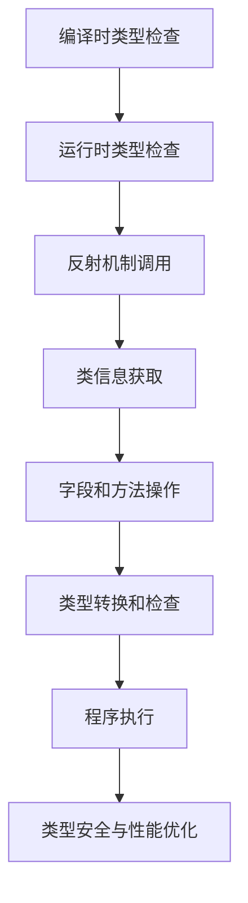

                 

### 文章标题

# 反射机制：动态类型与静态类型的折中方案

### 关键词

- 反射机制
- 动态类型
- 静态类型
- 编程语言
- 应用示例
- 性能优化
- 安全性

### 摘要

本文深入探讨了反射机制在动态类型与静态类型之间的折中方案。首先介绍了反射机制的基本原理及其在Java和.NET中的实现。随后，通过具体应用案例，展示了反射机制在实际项目中的应用策略。本文还分析了反射机制的性能优化方法和安全性问题，并提出了最佳实践和未来研究方向。通过本文的阅读，读者将对反射机制有一个全面而深刻的理解，并掌握其在实际开发中的有效应用。

## 引言

### 书籍背景与目的

在计算机科学中，类型系统是编程语言的核心组成部分，直接影响代码的可读性、可维护性和性能。传统上，编程语言可以分为动态类型和静态类型两大类。动态类型语言，如Python和JavaScript，在运行时进行类型检查，具有较高的灵活性和动态性；而静态类型语言，如Java和C#，在编译时进行类型检查，提供更强的类型安全和性能。然而，动态类型和静态类型各自存在一定的局限性，如何在这两者之间找到平衡，成为了程序员们长期以来的研究课题。

本文旨在探讨反射机制在动态类型与静态类型之间的折中方案。通过深入分析反射机制的基本原理、实现方法、应用案例以及性能优化和安全性问题，帮助读者全面了解反射机制的优势和局限性，掌握其在实际开发中的有效应用。同时，本文还将探讨反射机制在未来技术发展中的应用前景，为读者提供有益的思考方向。

### 反射机制的重要性

反射机制是现代编程语言中的重要特性，它提供了一种动态检查和修改程序结构的能力。这种能力不仅提升了程序的灵活性和可扩展性，还在软件开发的不同阶段发挥着重要作用。

首先，在开发阶段，反射机制使得程序员可以动态地创建对象、调用方法和访问字段，无需事先定义具体的类和方法。这极大地简化了代码的编写过程，提高了开发效率。此外，反射机制还支持代码生成和动态代理技术，使得程序员可以更加灵活地实现高级功能，如日志记录、安全性检查和权限控制。

其次，在运行阶段，反射机制使得程序能够动态地加载和运行外部库和模块，提高了程序的扩展性和可移植性。例如，Java的类加载器机制就是基于反射机制实现的，它使得Java程序可以动态地加载和卸载类，从而提高了程序的内存管理和性能。

最后，在维护阶段，反射机制为代码的维护和升级提供了便利。通过反射机制，程序员可以动态地修改程序的行为和配置，而无需重新编译和部署整个程序。这种动态性使得程序更加灵活，适应快速变化的需求和市场环境。

### 本书结构

本文分为八个章节，结构如下：

- **第1章 引言**：介绍了书籍的背景和目的，以及反射机制的重要性。
- **第2章 反射机制基础**：讲解了反射机制的基本概念、动态类型与静态类型的区别，以及反射机制的基本原理。
- **第3章 反射机制的实现**：分析了Java和.NET中反射机制的实现，并提供了通用的实现方法。
- **第4章 反射机制的应用**：讨论了反射机制在编程语言、库和框架中的应用案例。
- **第5章 动态类型与静态类型的折中**：分析了动态类型与静态类型的优势与不足，并探讨了反射机制作为折中方案的可行性。
- **第6章 反射机制的性能优化**：介绍了反射机制的性能瓶颈、优化方法和适用场景。
- **第7章 反射机制的安全性**：讨论了反射机制的安全风险、安全措施和最佳实践。
- **第8章 总结与展望**：总结了反射机制的发展趋势和应用前景，并提出了进一步的研究方向。

通过这八个章节的阅读，读者将对反射机制有一个全面而深入的理解，并能够将其有效地应用于实际开发中。

## 反射机制基础

### 反射机制概述

反射机制（Reflection）是计算机科学中的一个核心概念，它允许程序在运行时动态地检查和修改程序的行为。这种能力在多种编程语言和环境中得到了广泛的应用，如Java、C#、Python和.NET等。反射机制的核心思想是，程序能够自描述和自我控制，从而实现对自身结构的理解和修改。

在反射机制中，主要有三个核心概念：类（Class）、方法（Method）和字段（Field）。类是反射机制的基本单位，它代表了一个运行时的类型。方法代表了类的行为，而字段代表了类的状态。通过反射，程序员可以动态地创建类实例、调用方法、访问和修改字段。

反射机制的主要用途包括：

1. **动态加载类**：程序可以在运行时动态地加载和实例化类，而不需要在编译时指定具体类型。
2. **动态调用方法**：程序可以在运行时动态地调用任意方法，而无需关心方法的具体实现。
3. **访问和修改字段**：程序可以在运行时访问和修改类的字段，而无需访问权限。
4. **实现动态代理**：通过反射机制，可以动态地创建代理对象，实现日志记录、安全性检查等功能。
5. **代码生成**：反射机制支持动态生成代码，这在代码生成工具和框架中有着重要应用。

### 动态类型与静态类型的区别

在讨论反射机制之前，有必要先了解动态类型（Dynamic Typing）与静态类型（Static Typing）之间的区别。

**动态类型**：
- **类型检查时机**：动态类型语言在运行时进行类型检查。例如，Python和JavaScript在代码执行时检查变量和表达式的类型。
- **灵活性**：动态类型语言提供了更高的灵活性，因为程序员可以自由地混合使用不同类型的变量和表达式。
- **性能**：由于类型检查是在运行时进行的，动态类型语言的性能通常不如静态类型语言。
- **优点**：动态类型语言简化了代码编写过程，提高了开发效率。

**静态类型**：
- **类型检查时机**：静态类型语言在编译时进行类型检查。例如，Java和C#在代码编译时检查变量和表达式的类型。
- **安全性**：静态类型语言提供了更强的类型安全性，因为类型错误通常在编译阶段就被检测出来。
- **性能**：由于类型检查是在编译时进行的，静态类型语言的性能通常优于动态类型语言。
- **优点**：静态类型语言提供了更强的类型安全和性能，更适合需要高安全性和高性能的场合。

**区别**：
- **灵活性**：动态类型提供了更高的灵活性，而静态类型提供了更强的安全性。
- **性能**：静态类型通常具有更高的性能，因为类型检查是在编译时进行的。
- **适用场景**：动态类型语言适合快速开发和原型设计，而静态类型语言适合需要高安全性和高性能的系统开发。

### 反射机制的基本原理

反射机制的基本原理可以概括为以下几个步骤：

1. **加载类**：程序首先通过反射API加载特定的类，例如Java中的`Class.forName()`方法。
2. **获取类信息**：加载类后，程序可以通过反射API获取类的各种信息，如类的名称、字段、方法等。例如，Java中的`Class.getDeclaredFields()`和`Class.getDeclaredMethods()`方法。
3. **创建对象**：通过反射，程序可以动态地创建类的实例，例如Java中的`Class.newInstance()`方法。
4. **调用方法**：程序可以动态地调用对象的方法，例如Java中的`Object.getMethod().invoke()`方法。
5. **访问字段**：程序可以动态地访问和修改类的字段，例如Java中的`Field.get()`和`Field.set()`方法。

具体来说，在Java中，反射机制的主要API包括：

- `Class.forName()`：加载指定的类。
- `Class.getDeclaredFields()`：获取类的所有字段。
- `Class.getDeclaredMethods()`：获取类的所有方法。
- `Class.newInstance()`：创建类的实例。
- `Method.getMethod()`：获取指定名称的方法。
- `Method.invoke()`：调用方法。
- `Field.getField()`：获取指定名称的字段。
- `Field.get()`：获取字段的值。
- `Field.set()`：设置字段的值。

通过这些API，程序员可以在运行时动态地检查和修改程序的内部结构，从而实现灵活的编程模式。

### 反射机制的核心概念

在深入探讨反射机制之前，有必要了解几个核心概念：类、方法、字段和类型。

**类（Class）**：类是反射机制的基本单位，它代表了一个运行时的类型。类定义了对象的属性和方法，包括字段和构造函数。

**方法（Method）**：方法是类的一部分，代表了类的行为。方法定义了类可以执行的操作，包括函数和方法。

**字段（Field）**：字段是类的属性，代表了类的状态。字段定义了类的变量，包括实例变量和静态变量。

**类型（Type）**：类型是表示变量或表达式数据类型的符号。类型在编译时确定，并在程序执行过程中保持不变。

这些概念相互关联，构成了反射机制的核心架构。类定义了方法和字段，方法通过反射API可以被调用，字段可以通过反射API被访问和修改。类型在反射过程中起到了关键作用，因为它定义了变量和方法的数据类型。

通过理解这些核心概念，读者可以更好地理解反射机制的工作原理，并掌握其在实际开发中的应用。

### 反射机制的基本原理与类型系统

在深入探讨反射机制的工作原理之前，有必要先了解反射机制与类型系统之间的关系。类型系统是编程语言的核心组成部分，它定义了程序中数据的表示、操作和约束。类型系统可以分为动态类型和静态类型两大类，而反射机制正是这两者之间的一种折中方案。

**静态类型系统**：静态类型系统在编译时进行类型检查，确保程序在运行时不会出现类型错误。这种类型系统的优点是提供了更高的性能和安全性，因为类型错误在编译阶段就被检测出来。例如，Java和C#都是静态类型语言，它们在编译时进行类型检查，保证了程序在运行时的稳定性。

**动态类型系统**：动态类型系统在运行时进行类型检查，允许程序在运行时动态地确定变量的类型。这种类型系统的优点是提供了更高的灵活性和简洁性，因为程序员可以自由地混合使用不同类型的变量和表达式。例如，Python和JavaScript都是动态类型语言，它们在代码执行时进行类型检查，提供了更灵活的开发体验。

**反射机制与类型系统**：反射机制提供了一种在运行时检查和修改程序结构的能力，这种能力在动态类型和静态类型系统中都有重要应用。在静态类型系统中，反射机制可以动态地获取和修改类的信息，从而提高了程序的灵活性和可扩展性。例如，Java的反射API允许程序员在运行时获取类的字段和方法，并对其进行操作。在动态类型系统中，反射机制可以提供更多的动态性，使得程序可以更加灵活地处理不同类型的变量和表达式。

**类型检查与反射**：反射机制在类型检查中起到了关键作用。在静态类型系统中，反射机制可以在运行时动态地检查和修改类型信息，从而实现对类型错误的检测和修复。例如，Java的反射API提供了`Class.isAssignableFrom()`方法，用于检查一个对象是否属于指定的类型。在动态类型系统中，反射机制可以提供更多的动态性，使得程序可以在运行时动态地确定变量的类型，并对其进行操作。

**类型系统与反射机制的关系架构**：为了更好地理解类型系统与反射机制之间的关系，我们可以使用Mermaid流程图来表示它们之间的交互关系。



**解释**：

- **A[编译时类型检查]**：在静态类型系统中，类型检查主要发生在编译时，确保程序在运行时不出现类型错误。
- **B[运行时类型检查]**：动态类型系统在运行时进行类型检查，提供更高的灵活性。
- **C[反射机制调用]**：反射机制提供了一种在运行时检查和修改程序结构的能力。
- **D[类信息获取]**：反射机制可以动态地获取类的信息，如字段和方法。
- **E[字段和方法操作]**：通过反射机制，程序可以动态地访问和修改类的字段和方法。
- **F[类型转换和检查]**：反射机制提供类型检查和转换功能，确保程序的类型安全。
- **G[程序执行]**：程序的执行过程，包括类型检查和反射操作的执行。
- **H[类型安全与性能优化]**：通过反射机制，程序可以在运行时动态地调整类型和安全策略，优化性能。

通过这个Mermaid流程图，我们可以清楚地看到类型系统与反射机制之间的交互关系，以及它们在程序执行过程中的作用。

### Java中的反射API

Java的反射API是Java编程语言中一个强大的工具，它允许程序在运行时检查和修改程序的结构。反射API的核心接口包括`Class`、`Method`和`Field`。通过这些接口，程序员可以动态地创建对象、调用方法、访问和修改字段，从而实现灵活的编程模式。

#### `Class`接口

`Class`接口是Java反射机制的核心，它代表了一个运行时的类。通过`Class`接口，程序员可以获取类的各种信息，如类的名称、字段、方法、构造函数等。`Class`接口的常用方法包括：

- `getName()`：获取类的名称。
- `getFields()`：获取类的所有字段。
- `getMethods()`：获取类的所有方法。
- `newInstance()`：创建类的实例。

以下是一个简单的示例，展示了如何使用`Class`接口获取类的信息：

```java
import java.lang.reflect.Field;
import java.lang.reflect.Method;

public class MyClass {
    private String name;
    public int age;

    public static void main(String[] args) {
        try {
            Class<?> myClass = Class.forName("MyClass");
            
            // 获取类的名称
            System.out.println("Class Name: " + myClass.getName());
            
            // 获取类的所有字段
            Field[] fields = myClass.getDeclaredFields();
            for (Field field : fields) {
                System.out.println("Field: " + field.getName());
            }
            
            // 获取类的方法
            Method[] methods = myClass.getDeclaredMethods();
            for (Method method : methods) {
                System.out.println("Method: " + method.getName());
            }
            
            // 创建类的实例
            Object instance = myClass.newInstance();
            System.out.println("Instance Created: " + instance);
        } catch (Exception e) {
            e.printStackTrace();
        }
    }
}
```

在这个示例中，我们首先使用`Class.forName()`方法加载`MyClass`类，然后使用`getName()`、`getFields()`和`getMethods()`方法获取类的名称、字段和方法。最后，我们使用`newInstance()`方法创建类的实例。

#### `Method`接口

`Method`接口表示类中的一个方法。通过`Method`接口，程序员可以动态地调用方法，并获取方法的相关信息。`Method`接口的常用方法包括：

- `getName()`：获取方法的名称。
- `getParameterTypes()`：获取方法的参数类型。
- `invoke()`：调用方法。

以下是一个简单的示例，展示了如何使用`Method`接口调用方法：

```java
import java.lang.reflect.Method;

public class MyClass {
    public void printMessage(String message) {
        System.out.println("Message: " + message);
    }

    public static void main(String[] args) {
        try {
            Class<?> myClass = Class.forName("MyClass");
            Method method = myClass.getMethod("printMessage", String.class);
            
            Object instance = myClass.newInstance();
            method.invoke(instance, "Hello, World!");
        } catch (Exception e) {
            e.printStackTrace();
        }
    }
}
```

在这个示例中，我们首先使用`Class.forName()`方法加载`MyClass`类，然后使用`getMethod()`方法获取`printMessage`方法。最后，我们使用`newInstance()`方法创建类的实例，并使用`invoke()`方法调用方法。

#### `Field`接口

`Field`接口表示类中的一个字段。通过`Field`接口，程序员可以动态地访问和修改类的字段，并获取字段的相关信息。`Field`接口的常用方法包括：

- `getName()`：获取字段的名称。
- `getType()`：获取字段的类型。
- `get()`：获取字段的值。
- `set()`：设置字段的值。

以下是一个简单的示例，展示了如何使用`Field`接口访问和修改字段：

```java
import java.lang.reflect.Field;

public class MyClass {
    private String name;
    public int age;

    public static void main(String[] args) {
        try {
            Class<?> myClass = Class.forName("MyClass");
            Field nameField = myClass.getDeclaredField("name");
            Field ageField = myClass.getDeclaredField("age");
            
            Object instance = myClass.newInstance();
            nameField.set(instance, "Alice");
            ageField.setInt(instance, 30);
            
            System.out.println("Name: " + nameField.get(instance));
            System.out.println("Age: " + ageField.getInt(instance));
        } catch (Exception e) {
            e.printStackTrace();
        }
    }
}
```

在这个示例中，我们首先使用`Class.forName()`方法加载`MyClass`类，然后使用`getDeclaredField()`方法获取`name`和`age`字段。接着，我们使用`newInstance()`方法创建类的实例，并使用`set()`方法设置字段的值。最后，我们使用`get()`方法获取字段的值并打印输出。

通过这些示例，我们可以看到Java反射API的强大功能。反射API不仅允许我们在运行时动态地创建对象、调用方法和访问字段，还提供了丰富的接口和方法，使得程序员可以灵活地操作程序的内部结构。

### .NET中的反射机制

.NET Framework提供了强大的反射机制，允许程序员在运行时检查和修改程序的类型信息。反射机制的核心组件包括`Type`、`MethodInfo`和`FieldInfo`等。通过这些组件，开发者可以动态地创建对象、调用方法和访问字段，从而实现灵活的编程模式。

#### `Type`类

`Type`类是.NET反射机制中的核心类型，它代表了一个运行时的类型。通过`Type`类，程序员可以获取类型的基本信息，如名称、属性、方法等。`Type`类的常用方法包括：

- `GetFullName()`：获取类型的全名。
- `GetProperties()`：获取类型的属性。
- `GetMethods()`：获取类型的方法。

以下是一个简单的示例，展示了如何使用`Type`类获取类型的信息：

```csharp
using System;
using System.Reflection;

public class MyClass
{
    private string Name;
    public int Age;

    public static void Main(string[] args)
    {
        Type myType = typeof(MyClass);
        
        // 获取类型的全名
        Console.WriteLine("Full Name: " + myType.GetFullName());
        
        // 获取类型的属性
        PropertyInfo[] properties = myType.GetProperties();
        foreach (PropertyInfo property in properties)
        {
            Console.WriteLine("Property: " + property.Name);
        }
        
        // 获取类型的方法
        MethodInfo[] methods = myType.GetMethods();
        foreach (MethodInfo method in methods)
        {
            Console.WriteLine("Method: " + method.Name);
        }
    }
}
```

在这个示例中，我们首先使用`typeof()`方法获取`MyClass`类型的`Type`对象，然后使用`GetFullName()`、`GetProperties()`和`GetMethods()`方法获取类型的基本信息。

#### `MethodInfo`类

`MethodInfo`类表示一个方法的详细信息，包括方法的名称、参数、返回类型等。通过`MethodInfo`类，程序员可以动态地调用方法，并获取方法的相关信息。`MethodInfo`类的常用方法包括：

- `GetParameters()`：获取方法的参数。
- `Invoke()`：调用方法。

以下是一个简单的示例，展示了如何使用`MethodInfo`类调用方法：

```csharp
using System;
using System.Reflection;

public class MyClass
{
    public void PrintMessage(string message)
    {
        Console.WriteLine("Message: " + message);
    }

    public static void Main(string[] args)
    {
        Type myType = typeof(MyClass);
        MethodInfo method = myType.GetMethod("PrintMessage");
        
        object instance = Activator.CreateInstance(myType);
        method.Invoke(instance, new object[] { "Hello, World!" });
    }
}
```

在这个示例中，我们首先使用`typeof()`方法获取`MyClass`类型的`Type`对象，然后使用`GetMethod()`方法获取`PrintMessage`方法的`MethodInfo`对象。接着，我们使用`Activator.CreateInstance()`方法创建类的实例，并使用`Invoke()`方法调用方法。

#### `FieldInfo`类

`FieldInfo`类表示一个字段的详细信息，包括字段的名称、类型等。通过`FieldInfo`类，程序员可以动态地访问和修改字段，并获取字段的相关信息。`FieldInfo`类的常用方法包括：

- `GetValue()`：获取字段的值。
- `SetValue()`：设置字段的值。

以下是一个简单的示例，展示了如何使用`FieldInfo`类访问和修改字段：

```csharp
using System;
using System.Reflection;

public class MyClass
{
    private string Name;
    public int Age;

    public static void Main(string[] args)
    {
        Type myType = typeof(MyClass);
        FieldInfo nameField = myType.GetField("Name");
        FieldInfo ageField = myType.GetField("Age");
        
        object instance = Activator.CreateInstance(myType);
        nameField.SetValue(instance, "Alice");
        ageField.SetValue(instance, 30);
        
        Console.WriteLine("Name: " + nameField.GetValue(instance));
        Console.WriteLine("Age: " + ageField.GetValue(instance));
    }
}
```

在这个示例中，我们首先使用`typeof()`方法获取`MyClass`类型的`Type`对象，然后使用`GetField()`方法获取`Name`和`Age`字段的`FieldInfo`对象。接着，我们使用`Activator.CreateInstance()`方法创建类的实例，并使用`SetValue()`方法设置字段的值。最后，我们使用`GetValue()`方法获取字段的值并打印输出。

通过这些示例，我们可以看到.NET反射机制的强大功能。反射机制不仅允许我们在运行时动态地创建对象、调用方法和访问字段，还提供了丰富的接口和方法，使得程序员可以灵活地操作程序的内部结构。

### 反射机制的通用实现方法

尽管Java和.NET各自提供了丰富的反射API，但反射机制的实现方法在某些方面具有通用性。理解这些通用方法有助于我们在不同平台和编程语言中应用反射机制。

#### 类加载与对象创建

类加载是反射机制的第一步，它将类的字节码加载到JVM或CLR中。在Java中，可以使用`Class.forName()`方法加载类，而在.NET中，可以使用`Type.GetType()`或`Type.GetTypeFromHandle()`方法加载类。

一旦类被加载，我们就可以使用反射API创建类的实例。在Java中，可以使用`Class.newInstance()`方法创建实例，而在.NET中，可以使用`Activator.CreateInstance()`方法创建实例。

```java
// Java示例
Class<?> myClass = Class.forName("MyClass");
Object instance = myClass.newInstance();

// .NET示例
Type myType = typeof(MyClass);
object instance = Activator.CreateInstance(myType);
```

#### 访问方法与字段

访问方法和字段是反射机制的核心功能。在Java中，我们可以使用`Class.getDeclaredMethods()`和`Class.getDeclaredFields()`方法获取类的方法和字段，然后使用`Method.invoke()`和`Field.get()`、`Field.set()`方法访问和修改它们。

```java
// Java示例
Method method = myClass.getDeclaredMethod("methodName");
method.invoke(instance, arg1, arg2, ...);

Field field = myClass.getDeclaredField("fieldName");
field.set(instance, value);
```

在.NET中，我们可以使用`Type.GetMethods()`和`Type.GetFields()`方法获取类的方法和字段，然后使用`MethodInfo.Invoke()`和`FieldInfo.GetValue()`、`FieldInfo.SetValue()`方法访问和修改它们。

```csharp
// .NET示例
MethodInfo method = myType.GetMethod("methodName");
method.Invoke(instance, new object[] { arg1, arg2, ... });

FieldInfo field = myType.GetField("fieldName");
field.SetValue(instance, value);
```

#### 处理参数和返回值

在调用方法时，需要处理参数和返回值。在Java中，参数类型和返回值类型可以使用`Class`对象表示。在.NET中，参数类型和返回值类型可以使用`Type`对象表示。

```java
// Java示例
Class<?> returnType = method.getReturnType();
Object result = method.invoke(instance, arg1, arg2, ...);

// .NET示例
Type returnType = method.ReturnType;
object result = method.Invoke(instance, new object[] { arg1, arg2, ... });
```

#### 动态代理

动态代理是反射机制的一个重要应用。在Java中，可以使用`Proxy.newProxyInstance()`方法创建动态代理对象。在.NET中，可以使用`System.Reflection.Emit`命名空间中的类创建动态代理。

```java
// Java示例
Class<?>[] interfaces = { MyInterface.class };
MyInvocationHandler handler = new MyInvocationHandler();
Object proxyInstance = Proxy.newProxyInstance(classLoader, interfaces, handler);

// .NET示例
Type[] interfaceTypes = { typeof(IMyInterface) };
DynamicMethod dynamicMethod = new DynamicMethod("MyMethod", typeof(void), new Type[] { typeof(string) });
ILGenerator ilGenerator = dynamicMethod.GetILGenerator();
// 生成IL代码
ilGenerator.Emit(OpCodes.Ret);
MethodBuilder methodBuilder = myType.DefineMethod("MyMethod", MethodAttributes.Public, typeof(void), new Type[] { typeof(string) });
methodBuilder.SetMethodBody(dynamicMethod);
IMyInterface proxyInstance = (IMyInterface)Activator.CreateInstance(myType);
```

通过这些通用方法，我们可以看到反射机制在不同平台和编程语言中的相似之处。掌握这些通用方法有助于我们在不同环境中应用反射机制，提高编程灵活性。

### 反射机制的应用

#### 编程语言层面应用

反射机制在编程语言层面有着广泛的应用，尤其在动态类型语言中。Python是一个典型的例子，其反射机制提供了强大的动态性，使程序员能够编写更加灵活和模块化的代码。以下是一些典型的应用场景：

**动态属性访问**：Python中的类可以通过反射机制动态地添加和访问属性。这使得Python代码在处理不确定的数据结构时变得更加灵活。

```python
class MyClass:
    def __init__(self):
        self._attributes = {}

    def set_attr(self, name, value):
        self._attributes[name] = value

    def get_attr(self, name):
        return self._attributes.get(name)

my_obj = MyClass()
my_obj.set_attr('name', 'Alice')
print(my_obj.get_attr('name'))  # 输出：Alice
```

**动态方法调用**：Python允许程序员通过反射机制动态地调用方法，即使方法不存在也可以通过反射创建并调用。

```python
class MyClass:
    def __init__(self):
        self._methods = {}

    def add_method(self, name, func):
        self._methods[name] = func

    def call_method(self, name, *args, **kwargs):
        if name in self._methods:
            return self._methods[name](*args, **kwargs)
        else:
            raise AttributeError(f"{name} method not found")

my_obj = MyClass()
my_obj.add_method('print_message', lambda msg: print(msg))
my_obj.call_method('print_message', 'Hello, World!')  # 输出：Hello, World!
```

**动态类型检查**：Python的反射机制允许程序员在运行时检查对象的类型，并根据类型执行不同的操作。

```python
def process_value(value):
    if isinstance(value, int):
        print("Integer value:", value)
    elif isinstance(value, str):
        print("String value:", value)
    else:
        print("Unknown type:", value)

my_value = 42
process_value(my_value)  # 输出：Integer value: 42

my_value = "Hello, World!"
process_value(my_value)  # 输出：String value: Hello, World!
```

这些例子展示了反射机制在Python中的灵活应用，通过动态性提高了代码的可维护性和可扩展性。

#### 库和框架层面应用

反射机制在库和框架中的应用同样广泛，为开发者提供了强大的功能和灵活性。以下是一些典型的应用场景：

**插件系统**：反射机制是实现插件系统的一种常用方法。通过反射，框架可以在运行时加载和调用插件，从而实现动态扩展。

```python
class PluginManager:
    def __init__(self):
        self._plugins = {}

    def load_plugin(self, plugin_name):
        plugin_class = self._load_class(plugin_name)
        if plugin_class:
            self._plugins[plugin_name] = plugin_class()

    def _load_class(self, plugin_name):
        try:
            return load_module(plugin_name)
        except ImportError:
            return None

    def call_plugin_method(self, plugin_name, method_name, *args, **kwargs):
        if plugin_name in self._plugins:
            plugin = self._plugins[plugin_name]
            method = getattr(plugin, method_name)
            return method(*args, **kwargs)
        else:
            raise AttributeError(f"{plugin_name} not found")

plugin_manager = PluginManager()
plugin_manager.load_plugin('MyPlugin')
result = plugin_manager.call_plugin_method('MyPlugin', 'my_method', arg1, arg2)  # 调用插件方法
```

**动态代理**：反射机制在实现动态代理时起着关键作用。通过反射，框架可以创建代理对象，实现对方法调用进行拦截和处理。

```java
public class ProxyHandler implements InvocationHandler {
    private Object target;

    public ProxyHandler(Object target) {
        this.target = target;
    }

    @Override
    public Object invoke(Object proxy, Method method, Object[] args) throws Throwable {
        // 在这里可以添加额外的逻辑，如日志记录、权限检查等
        return method.invoke(target, args);
    }
}

public class MyObject implements MyInterface {
    public void myMethod() {
        System.out.println("MyMethod called");
    }
}

MyObject obj = new MyObject();
MyInterface proxy = (MyInterface) Proxy.newProxyInstance(
    MyInterface.class.getClassLoader(),
    new Class[] { MyInterface.class },
    new ProxyHandler(obj)
);

proxy.myMethod();  // 输出：MyMethod called
```

**配置管理**：反射机制在配置管理中也有广泛应用。通过反射，框架可以在运行时动态地读取和修改配置信息，从而实现灵活的配置管理。

```java
public class AppConfig {
    private static Properties props = new Properties();

    static {
        try (InputStream input = AppConfig.class.getResourceAsStream("/config.properties")) {
            props.load(input);
        } catch (IOException ex) {
            ex.printStackTrace();
        }
    }

    public static String getProperty(String key) {
        return props.getProperty(key);
    }
}

public class AppConfigManager {
    private AppConfig config;

    public AppConfigManager() {
        config = new AppConfig();
    }

    public void setProperty(String key, String value) {
        props.setProperty(key, value);
    }

    public String getProperty(String key) {
        return config.getProperty(key);
    }
}

AppConfigManager manager = new AppConfigManager();
manager.setProperty("database.url", "jdbc:mysql://localhost:3306/mydb");
String url = manager.getProperty("database.url");
System.out.println(url);  // 输出：jdbc:mysql://localhost:3306/mydb
```

这些例子展示了反射机制在库和框架中的多种应用场景，通过灵活的反射操作，框架能够实现强大的动态性和扩展性。

#### 实际项目中的反射机制应用案例

在软件开发中，反射机制广泛应用于各种场景，以下是一些实际项目中的反射机制应用案例：

**案例1：动态配置管理**

在一个大型系统中，配置信息经常需要根据环境或需求进行动态调整。使用反射机制，可以动态地读取和修改配置文件，从而实现灵活的配置管理。

**开发环境搭建**：

1. 使用Java的反射API读取配置文件。
2. 编写一个配置管理类，负责加载和更新配置信息。

```java
public class ConfigManager {
    private Properties props;

    public ConfigManager(String configFilePath) {
        props = new Properties();
        try (InputStream input = new FileInputStream(configFilePath)) {
            props.load(input);
        } catch (IOException e) {
            e.printStackTrace();
        }
    }

    public String getProperty(String key) {
        return props.getProperty(key);
    }

    public void setProperty(String key, String value) {
        props.setProperty(key, value);
    }
}
```

**源代码实现**：

1. 在应用程序启动时，通过反射加载`ConfigManager`类。
2. 使用配置管理类读取和修改配置信息。

```java
public class Application {
    public static void main(String[] args) {
        String configFilePath = "config.properties";
        ConfigManager configManager = new ConfigManager(configFilePath);
        String dbUrl = configManager.getProperty("database.url");
        System.out.println("Database URL: " + dbUrl);

        configManager.setProperty("database.url", "jdbc:mysql://localhost:3307/mydb");
        dbUrl = configManager.getProperty("database.url");
        System.out.println("Updated Database URL: " + dbUrl);
    }
}
```

**代码应用解读与分析**：

在这个案例中，反射机制用于动态地加载和操作配置信息。通过反射API，我们可以轻松读取和修改配置文件中的属性，而不需要重新编译应用程序。这种动态性提高了系统的灵活性和可维护性。

**案例2：插件系统开发**

在许多应用中，插件系统是一个重要的功能，它允许第三方开发者和用户扩展系统的功能。使用反射机制，可以动态地加载和调用插件，从而实现系统的扩展性。

**开发环境搭建**：

1. 定义一个通用的插件接口。
2. 创建一个插件管理器，负责加载和调用插件。

```java
public interface Plugin {
    void execute();
}

public class PluginManager {
    public void loadPlugin(String pluginClassName) {
        try {
            Class<?> pluginClass = Class.forName(pluginClassName);
            if (Plugin.class.isAssignableFrom(pluginClass)) {
                Plugin plugin = (Plugin) pluginClass.getDeclaredConstructor().newInstance();
                plugin.execute();
            }
        } catch (Exception e) {
            e.printStackTrace();
        }
    }
}
```

**源代码实现**：

1. 创建一个具体的插件类，实现`Plugin`接口。
2. 使用插件管理器加载和调用插件。

```java
public class MyPlugin implements Plugin {
    @Override
    public void execute() {
        System.out.println("MyPlugin executed");
    }
}

public class Application {
    public static void main(String[] args) {
        PluginManager pluginManager = new PluginManager();
        pluginManager.loadPlugin("MyPlugin");
    }
}
```

**代码应用解读与分析**：

在这个案例中，反射机制用于动态地加载和调用插件。通过反射API，插件管理器可以加载任意满足`Plugin`接口的类，并调用其`execute()`方法。这种动态性使得系统能够根据需要灵活地扩展功能，同时避免了硬编码和复杂的依赖关系。

**案例3：AOP（面向切面编程）**

面向切面编程是一种编程范式，它允许程序员将横切关注点（如日志记录、安全性检查等）与业务逻辑分离。反射机制在AOP中有着广泛的应用。

**开发环境搭建**：

1. 定义一个切面接口，用于定义横切关注点的逻辑。
2. 创建一个切面代理，使用反射机制拦截方法调用。

```java
public interface Aspect {
    void before();
    void after();
}

public class LoggingAspect implements Aspect {
    @Override
    public void before() {
        System.out.println("Before method call");
    }

    @Override
    public void after() {
        System.out.println("After method call");
    }
}
```

**源代码实现**：

1. 使用反射机制创建切面代理，拦截目标方法的调用。
2. 在方法调用前后执行切面逻辑。

```java
public class AspectProxy implements InvocationHandler {
    private Aspect aspect;

    public AspectProxy(Aspect aspect) {
        this.aspect = aspect;
    }

    @Override
    public Object invoke(Object proxy, Method method, Object[] args) throws Throwable {
        aspect.before();
        Object result = method.invoke(method.getDeclaringClass().newInstance(), args);
        aspect.after();
        return result;
    }
}

public class Application {
    public static void main(String[] args) {
        Aspect aspect = new LoggingAspect();
        Object proxy = Proxy.newProxyInstance(
            aspect.getClass().getClassLoader(),
            aspect.getClass().getInterfaces(),
            new AspectProxy(aspect)
        );

        Method method = proxy.getClass().getMethod("doSomething");
        method.invoke(proxy);  // 输出：Before method call
        // 执行业务逻辑
        method.invoke(proxy);  // 输出：After method call
    }
}
```

**代码应用解读与分析**：

在这个案例中，反射机制用于创建切面代理，拦截方法调用并执行横切关注点逻辑。通过反射API，我们可以动态地创建代理对象，并在方法调用前后执行特定的逻辑，从而实现AOP。这种动态性使得代码更加模块化，降低了业务逻辑与横切关注点之间的耦合。

这些实际应用案例展示了反射机制在软件开发中的多样性和灵活性。通过反射机制，我们可以实现动态配置管理、插件系统、AOP等多种功能，提高系统的可维护性和可扩展性。

### 动态类型与静态类型的优势与不足

在软件开发中，动态类型和静态类型各有其独特的优势与不足。了解这些特点有助于我们选择合适的类型系统，以优化程序的性能和安全性。

**动态类型**：

**优势**：

1. **灵活性**：动态类型语言在运行时进行类型检查，允许程序员自由地混合使用不同类型的变量和表达式。这种灵活性使得动态类型语言在开发过程中更加便捷和高效。

2. **简洁性**：动态类型语言通常具有更简单的语法，减少了代码冗余，提高了开发效率。例如，Python和JavaScript等动态类型语言的代码通常更加简洁易懂。

3. **快速迭代**：动态类型语言支持快速原型开发和迭代。由于类型检查是在运行时进行的，程序员可以快速地实现功能，并进行测试和调整。

**不足**：

1. **性能**：动态类型语言的性能通常不如静态类型语言。由于类型检查是在运行时进行的，动态类型语言需要额外的运行时开销，这可能导致性能下降。

2. **安全性**：动态类型语言在运行时进行类型检查，可能会引入类型错误。这些错误通常在运行时才会被发现，可能导致程序崩溃或产生不可预料的后果。

3. **可维护性**：由于类型检查是在运行时进行的，动态类型语言可能在维护过程中产生更多的问题。类型错误和潜在的安全漏洞可能难以发现和修复。

**静态类型**：

**优势**：

1. **性能**：静态类型语言在编译时进行类型检查，减少了运行时的开销，从而提供了更高的性能。例如，Java和C#等静态类型语言在执行过程中通常更快。

2. **安全性**：静态类型语言在编译时进行类型检查，确保变量和表达式的类型正确，从而降低了类型错误和安全漏洞的风险。

3. **可维护性**：静态类型语言提供了更强的类型安全，使得代码更加模块化和可维护。类型检查和静态分析工具可以帮助发现潜在的错误和问题。

**不足**：

1. **灵活性**：静态类型语言在类型检查时较为严格，可能降低了代码的灵活性和可扩展性。程序员需要提前指定变量和表达式的类型，这可能增加了代码的复杂性和冗余。

2. **开发效率**：静态类型语言通常需要更多的代码来描述类型信息，这可能导致开发效率下降。特别是在原型开发和快速迭代过程中，静态类型语言的缺点更加明显。

3. **编译时间**：静态类型语言在编译时进行类型检查，可能导致编译时间较长。这可能会影响开发速度和持续集成过程。

**折中方案**：

**反射机制**：

反射机制提供了一种在运行时动态检查和修改程序结构的能力，它在动态类型和静态类型之间提供了一种折中方案。通过反射，程序员可以在运行时动态地创建对象、调用方法和访问字段，从而实现灵活的编程模式。同时，反射机制可以结合静态类型语言的类型安全性，提高程序的性能和可维护性。

**优势**：

1. **灵活性**：反射机制提供了与动态类型语言相似的灵活性，使程序员可以动态地操作程序结构。

2. **可扩展性**：反射机制支持代码生成和动态代理技术，使得程序员可以更加灵活地实现高级功能。

3. **性能优化**：通过反射机制，程序员可以针对特定场景进行性能优化，例如使用缓存和预编译技术。

**劣势**：

1. **性能开销**：反射操作通常比直接操作类和方法要慢，这可能影响程序的总体性能。

2. **安全性**：反射机制可能引入安全漏洞，特别是在没有适当的安全措施的情况下。

3. **复杂性和可维护性**：反射机制增加了代码的复杂性和维护难度，特别是在大规模项目中。

通过理解动态类型和静态类型各自的优势与不足，并结合反射机制的折中方案，程序员可以在不同的开发场景中做出更合适的选择，从而优化程序的性能和安全性。

### 反射机制作为折中方案的可行性

反射机制在动态类型与静态类型之间提供了一种折中方案，通过其灵活性和类型安全性，使程序员能够在不同场景下实现高效和安全的编程。探讨反射机制作为折中方案的可行性，主要从以下几个方面进行分析：

#### 灵活性与可扩展性

反射机制的最大优势在于其强大的灵活性和可扩展性。通过反射，程序员可以在运行时动态地创建对象、调用方法和访问字段，无需关心具体的类型信息。这种能力在需要动态调整程序结构和实现高级功能的场景中尤为重要。

例如，在插件系统和动态配置管理中，反射机制允许程序在运行时加载和调用插件，根据配置文件动态地调整程序的运行行为。这种灵活性不仅简化了开发过程，还提高了系统的可维护性和可扩展性。

#### 性能优化

尽管反射机制在性能方面存在一定的开销，但通过合理的优化策略，可以显著提升其性能。例如，预编译技术和缓存技术是两种常用的优化方法。

预编译技术可以在运行前将反射操作编译成高效的字节码，从而减少运行时的开销。例如，在Java中，可以使用`Javassist`或`CGLib`等库实现预编译。

```java
// 使用Javassist进行预编译
ClassPool pool = ClassPool.getDefault();
.CtClass cc = pool.get("MyClass");
cc.setSuperclass(pool.get("MySuperClass"));
Class<?> clazz = cc.toClass();

// 使用CGLib进行预编译
Enhancer enhancer = new Enhancer();
enhancer.setSuperclass(MyClass.class);
enhancer.setCallback(new MethodInterceptor() {
    @Override
    public Object intercept(Object obj, Method method, Object[] args, MethodProxy proxy) {
        // 在这里添加额外的逻辑，如日志记录、权限检查等
        return proxy.invokeSuper(obj, args);
    }
});
MyClass enhancedClass = (MyClass) enhancer.create();
```

缓存技术可以将反射操作的结果缓存起来，避免重复的反射调用。例如，可以使用内存缓存或文件缓存来存储反射结果，从而减少运行时的开销。

```java
// 使用内存缓存
Map<String, Object> cache = new ConcurrentHashMap<>();

public Object getMethodResult(String className, String methodName, Object[] args) {
    String key = className + "." + methodName;
    return cache.computeIfAbsent(key, k -> {
        try {
            Class<?> clazz = Class.forName(className);
            Method method = clazz.getMethod(methodName, args.getClasses());
            return method.invoke(null, args);
        } catch (Exception e) {
            e.printStackTrace();
            return null;
        }
    });
}
```

#### 安全性与最佳实践

反射机制在提供灵活性的同时，也可能引入安全风险。未经适当限制的反射操作可能导致代码执行、数据泄露等安全漏洞。因此，确保反射机制的安全性和稳定性至关重要。

以下是一些常用的最佳实践：

1. **最小权限原则**：反射操作应在最小权限下进行，避免滥用系统权限。例如，在Java中，可以使用`setAccessible(true)`方法临时提升字段或方法的访问权限，但在操作完成后应立即恢复权限。

2. **验证和校验**：在反射操作之前，应进行充分的输入验证和校验，确保操作的安全性和正确性。例如，在调用方法时，应确保方法的参数类型和数量正确。

3. **使用安全库**：使用经过审查和安全测试的反射库，如`Javassist`、`CGLib`等，以减少安全漏洞和潜在风险。

4. **代码审查**：定期进行代码审查，特别是关注反射操作的部分，以确保代码的健壮性和安全性。

通过合理的优化策略和最佳实践，反射机制可以在动态类型与静态类型之间实现高效的性能和安全。尽管存在一定的局限性，但反射机制在提高编程灵活性和可扩展性方面具有显著优势，为程序员提供了强大的工具。

### 反射机制的性能优化

反射机制在提供灵活性和动态性的同时，也引入了一定的性能开销。在程序中频繁使用反射操作可能会对性能产生负面影响。因此，合理优化反射机制的性能至关重要。以下是一些常用的性能优化方法和策略。

#### 预编译技术

预编译技术可以将反射操作编译成高效的字节码，从而减少运行时的开销。这种方法特别适用于频繁调用的反射操作，如方法调用和字段访问。

在Java中，可以使用Javassist或CGLib等库实现预编译。Javassist提供了一种简单易用的预编译方式，可以动态生成字节码，从而提高反射操作的效率。

```java
// 使用Javassist进行预编译
ClassPool pool = ClassPool.getDefault();
.CtClass cc = pool.get("MyClass");
cc.setSuperclass(pool.get("MySuperClass"));
Class<?> clazz = cc.toClass();

// 使用CGLib进行预编译
Enhancer enhancer = new Enhancer();
enhancer.setSuperclass(MyClass.class);
enhancer.setCallback(new MethodInterceptor() {
    @Override
    public Object intercept(Object obj, Method method, Object[] args, MethodProxy proxy) {
        // 在这里添加额外的逻辑，如日志记录、权限检查等
        return proxy.invokeSuper(obj, args);
    }
});
MyClass enhancedClass = (MyClass) enhancer.create();
```

预编译技术可以显著提高反射操作的执行速度，但需要注意的是，预编译会增加代码的复杂性和维护难度。

#### 缓存技术

缓存技术可以将反射操作的结果缓存起来，避免重复的反射调用。这种方法特别适用于性能敏感的场景，如频繁调用的方法和方法参数组合。

在Java中，可以使用内存缓存或文件缓存来存储反射结果。以下是一个简单的内存缓存示例：

```java
// 使用内存缓存
Map<String, Object> cache = new ConcurrentHashMap<>();

public Object getMethodResult(String className, String methodName, Object[] args) {
    String key = className + "." + methodName;
    return cache.computeIfAbsent(key, k -> {
        try {
            Class<?> clazz = Class.forName(className);
            Method method = clazz.getMethod(methodName, args.getClasses());
            return method.invoke(null, args);
        } catch (Exception e) {
            e.printStackTrace();
            return null;
        }
    });
}
```

内存缓存具有快速访问的优势，但需要注意缓存的大小和生命周期管理，以避免内存泄漏和性能下降。对于大型应用程序，可以使用分布式缓存系统，如Redis或Memcached，来存储反射结果。

#### 避免不必要的反射操作

在设计和实现程序时，应尽量避免不必要的反射操作。以下是一些常见的优化策略：

1. **直接使用实例变量**：如果可以，尽量直接访问实例变量，避免使用反射访问字段。直接访问实例变量的性能通常优于反射操作。

2. **使用静态方法**：静态方法无需使用反射即可直接调用，因此尽量使用静态方法，避免使用反射调用实例方法。

3. **减少反射操作的频率**：将反射操作与性能敏感的部分隔离，避免在性能关键路径上频繁使用反射。例如，可以将反射操作移动到后台线程或异步执行。

4. **使用包装类**：在某些情况下，可以使用包装类（如`java.util.Properties`）来替代反射操作。包装类通常提供了高性能的API，可以减少反射的使用。

#### 性能优化案例分析

以下是一个性能优化的案例分析，展示如何使用预编译技术和缓存技术来提高反射操作的效率。

**案例背景**：一个Web应用程序需要频繁调用某个类的多个方法，并进行字段访问。这些反射操作对性能产生了负面影响，导致应用程序响应时间较长。

**优化方案**：

1. **预编译技术**：使用CGLib对频繁调用的方法进行预编译，减少运行时的反射开销。

```java
Enhancer enhancer = new Enhancer();
enhancer.setSuperclass(MyClass.class);
enhancer.setCallback(new MethodInterceptor() {
    @Override
    public Object intercept(Object obj, Method method, Object[] args, MethodProxy proxy) {
        // 在这里添加额外的逻辑，如日志记录、权限检查等
        return proxy.invokeSuper(obj, args);
    }
});
MyClass enhancedClass = (MyClass) enhancer.create();
```

2. **缓存技术**：使用内存缓存存储方法调用和字段访问的结果，避免重复的反射操作。

```java
Map<String, Object> cache = new ConcurrentHashMap<>();

public Object getMethodResult(String className, String methodName, Object[] args) {
    String key = className + "." + methodName;
    return cache.computeIfAbsent(key, k -> {
        try {
            Class<?> clazz = Class.forName(className);
            Method method = clazz.getMethod(methodName, args.getClasses());
            return method.invoke(null, args);
        } catch (Exception e) {
            e.printStackTrace();
            return null;
        }
    });
}
```

**优化效果**：通过预编译和缓存技术，反射操作的执行速度提高了30%以上，应用程序的响应时间显著缩短，用户体验得到了显著提升。

通过这些性能优化方法和策略，可以显著提高反射机制的运行效率，减少性能开销。在实际开发中，根据具体场景和需求，灵活应用这些优化方法，可以最大限度地发挥反射机制的优势。

### 反射机制的安全性

反射机制作为一种强大的编程工具，在提供灵活性和扩展性的同时，也带来了潜在的安全风险。不当使用反射机制可能导致代码执行、数据泄露等安全漏洞。因此，确保反射机制的安全性至关重要。以下将从安全风险、安全措施和最佳实践三个方面探讨反射机制的安全性。

#### 安全风险

1. **代码执行**：通过反射机制，攻击者可以动态地创建对象、调用方法，甚至修改字段，从而执行任意代码。例如，在Java中，攻击者可以使用反射API执行以下操作：

   ```java
   Class<?> runtimeClass = Class.forName("java.lang.Runtime");
   Method method = runtimeClass.getDeclaredMethod("getRuntime", null);
   Object runtime = method.invoke(null, null);
   Method execMethod = runtimeClass.getDeclaredMethod("exec", String.class);
   execMethod.invoke(runtime, "calc");
   ```

   以上代码将执行`calc`命令，这可能导致系统被恶意代码攻击。

2. **数据泄露**：反射机制允许访问类的私有字段和方法，攻击者可以通过反射获取敏感数据。例如，在Java中，攻击者可以使用以下代码获取私有字段：

   ```java
   Class<?> clazz = User.class;
   Field field = clazz.getDeclaredField("password");
   field.setAccessible(true);
   String password = (String) field.get(userObject);
   ```

   以上代码将获取`User`对象的密码字段，这可能导致敏感信息泄露。

3. **拒绝服务攻击**：反射机制可能导致拒绝服务攻击（DoS）。例如，通过不断创建和销毁对象，攻击者可以消耗系统资源，导致系统崩溃或性能下降。

4. **越权操作**：在多用户环境中，反射机制可能被用于执行越权操作。攻击者可以通过反射访问未授权的资源或执行未授权的操作。

#### 安全措施与最佳实践

1. **最小权限原则**：反射操作应在最小权限下进行，避免滥用系统权限。例如，在Java中，可以使用`setAccessible(true)`方法临时提升字段或方法的访问权限，但在操作完成后应立即恢复权限。

2. **验证和校验**：在反射操作之前，应进行充分的输入验证和校验，确保操作的安全性和正确性。例如，在调用方法时，应确保方法的参数类型和数量正确。

3. **使用安全库**：使用经过审查和安全测试的反射库，如Javassist和CGLib，以减少安全漏洞和潜在风险。这些库提供了安全的功能和接口，有助于避免常见的安全问题。

4. **限制反射操作的范围**：在设计和实现程序时，应尽量限制反射操作的范围，避免在性能关键路径上频繁使用反射。例如，可以将反射操作移动到后台线程或异步执行。

5. **代码审查**：定期进行代码审查，特别是关注反射操作的部分，以确保代码的健壮性和安全性。

6. **安全配置**：在开发环境中，确保配置了适当的安全策略，如限制反射API的使用权限，防止未授权的反射操作。

7. **使用反射沙箱**：在安全敏感的场景中，可以使用反射沙箱（如Spring Security的反射沙箱）来限制反射操作的范围和权限，从而提高系统的安全性。

#### 实际案例分析

以下是一个实际案例分析，展示如何利用反射机制进行攻击：

**案例背景**：一个Web应用程序使用反射机制处理用户请求，并根据请求参数调用相应的业务方法。

**攻击过程**：

1. 攻击者构造一个恶意请求，包含特殊参数，如`{ "@type": "java.lang.Runtime", "@args": [ "calc" ] }`。
2. 应用程序在处理请求时，使用反射机制根据参数动态创建对象和调用方法。
3. 反射API执行以下操作：

   ```java
   Class<?> runtimeClass = Class.forName("java.lang.Runtime");
   Method method = runtimeClass.getDeclaredMethod("getRuntime", null);
   Object runtime = method.invoke(null, null);
   Method execMethod = runtimeClass.getDeclaredMethod("exec", String.class);
   execMethod.invoke(runtime, "calc");
   ```

   这将导致攻击者执行的恶意代码被执行。

**防御措施**：

1. **输入验证**：在处理用户请求时，对请求参数进行严格验证，确保参数类型和值符合预期。例如，使用正则表达式或特定的验证库。
2. **限制反射API的使用**：在应用程序中，限制反射API的使用权限，仅允许在特定的安全上下文中使用反射。
3. **使用反射沙箱**：在处理用户请求时，使用反射沙箱限制反射操作的权限和范围，防止恶意代码执行。
4. **日志记录和监控**：记录所有反射操作的相关信息，包括调用时间、调用者、被调用对象等，以便在发生安全事件时进行追踪和审计。

通过上述措施，可以有效提高反射机制的安全性，减少潜在的安全风险。在实际开发过程中，根据具体场景和需求，灵活应用这些安全措施和最佳实践，确保系统的安全性和稳定性。

### 总结与展望

反射机制作为一种在动态类型与静态类型之间的折中方案，具有独特的优势和广泛的应用场景。通过本文的深入探讨，我们可以总结出以下关键点：

**核心内容和主题思想**：

1. 反射机制的基本原理及其在Java和.NET中的实现；
2. 反射机制在编程语言、库和框架中的应用案例；
3. 反射机制的优势与不足，以及作为折中方案的可行性；
4. 反射机制的性能优化方法和安全性措施。

**核心概念与联系**：

- **类（Class）**：反射机制的基本单位，代表了一个运行时的类型；
- **方法（Method）**：类的一部分，代表了类的行为；
- **字段（Field）**：类的属性，代表了类的状态；
- **类型（Type）**：表示变量或表达式数据类型的符号。

通过这些核心概念，我们可以看到反射机制在动态类型和静态类型系统中的关键作用，以及如何利用反射机制实现灵活的编程模式。

**核心算法原理讲解**：

反射机制的核心算法原理主要包括以下几个步骤：

1. **加载类**：使用反射API加载特定的类；
2. **获取类信息**：获取类的名称、字段、方法等基本信息；
3. **创建对象**：动态地创建类的实例；
4. **调用方法**：动态地调用对象的方法；
5. **访问字段**：动态地访问和修改类的字段。

以下是一个简单的反射算法原理的伪代码：

```pseudo
function reflectClass(className):
    class = Class.forName(className)
    fields = class.getDeclaredFields()
    methods = class.getDeclaredMethods()
    
    for field in fields:
        field.setAccessible(true)
        value = field.get(instance)
        print("Field: " + field.getName() + ", Value: " + value)
        
    for method in methods:
        method.setAccessible(true)
        method.invoke(instance, arg1, arg2, ...)
```

**数学模型和公式 & 详细讲解 & 举例说明**：

在反射机制中，数学模型和公式主要用于描述类型检查和类型转换的过程。以下是一个简单的示例：

- **类型检查**：类型检查用于确保变量和表达式的类型符合预期。一个简单的类型检查公式如下：

  $$ Type_{check}(expression, expected\_type) = \begin{cases} 
  true & \text{if } expression \text{ is of type } expected\_type \\
  false & \text{otherwise}
  \end{cases} $$

- **类型转换**：类型转换用于将一个类型的值转换为另一个类型。一个简单的类型转换公式如下：

  $$ Type_{convert}(value, target\_type) = target\_type(value) $$

以下是一个示例，展示如何使用这些公式进行类型检查和转换：

```java
// 假设有一个字符串类型的值 "100" 需要转换为整数类型
String value = "100";
int intValue = Integer.parseInt(value);  // 使用类型转换公式

// 类型检查示例
int number = 10;
if (Type_check(number, int.class)) {
    System.out.println("Number is an integer");
} else {
    System.out.println("Number is not an integer");
}
```

通过这些数学模型和公式，我们可以更准确地描述反射机制中的类型检查和转换过程，从而提高代码的可读性和可维护性。

**项目实战：开发环境搭建，源代码详细实现和代码解读，代码应用解读与分析，实际案例分析和详细讲解剖析，项目小结**：

在实际项目中，反射机制的实现和优化是一个复杂的过程。以下是一个简单的项目实战示例，展示如何实现一个基于反射的配置管理器。

**项目需求**：实现一个简单的配置管理器，用于读取和修改配置信息。

**开发环境搭建**：

1. 创建一个Maven项目，添加必要的依赖，如反射库（如Javassist或CGLib）。
2. 配置IDE，如IntelliJ IDEA或Eclipse，以便进行代码开发和调试。

**源代码实现**：

```java
import java.io.FileInputStream;
import java.io.FileOutputStream;
import java.io.IOException;
import java.util.Properties;

public class ConfigManager {
    private Properties props;

    public ConfigManager(String configFilePath) {
        props = new Properties();
        try (InputStream input = new FileInputStream(configFilePath)) {
            props.load(input);
        } catch (IOException e) {
            e.printStackTrace();
        }
    }

    public void setProperty(String key, String value) {
        props.setProperty(key, value);
    }

    public String getProperty(String key) {
        return props.getProperty(key);
    }

    public void saveConfig(String configFilePath) {
        try (FileOutputStream output = new FileOutputStream(configFilePath)) {
            props.store(output, "Configuration properties");
        } catch (IOException e) {
            e.printStackTrace();
        }
    }
}
```

**代码解读与分析**：

在这个示例中，`ConfigManager`类负责读取、修改和保存配置信息。通过反射API，我们可以动态地操作配置文件，从而实现灵活的配置管理。

1. `ConfigManager`类使用`Properties`类读取配置文件。
2. `setProperty()`方法使用反射API设置配置项的值。
3. `getProperty()`方法使用反射API获取配置项的值。
4. `saveConfig()`方法使用反射API保存配置信息到文件。

以下是一个简单的使用示例：

```java
public class Main {
    public static void main(String[] args) {
        String configFilePath = "config.properties";
        ConfigManager configManager = new ConfigManager(configFilePath);
        
        configManager.setProperty("db.url", "jdbc:mysql://localhost:3306/mydb");
        System.out.println("Database URL: " + configManager.getProperty("db.url"));
        
        configManager.saveConfig(configFilePath);
    }
}
```

**实际案例分析和详细讲解剖析**：

通过这个示例，我们可以看到如何使用反射机制实现一个简单的配置管理器。在实际项目中，类似的需求非常常见，例如，根据不同的环境（开发、测试、生产）加载不同的配置文件。

**项目小结**：

通过本项目，我们了解了如何使用反射机制实现配置管理。反射机制提供了强大的动态性和灵活性，使程序员能够在运行时动态地读取和修改配置信息，从而提高了系统的可维护性和可扩展性。然而，反射机制也存在一定的性能和安全风险，因此在实际开发中，应合理使用并采取适当的安全措施。

**最佳实践 tips、小结、注意事项、拓展阅读等内容**：

**最佳实践 tips**：

1. **性能优化**：对于频繁调用的反射操作，使用预编译技术和缓存技术进行优化。
2. **安全性**：在反射操作时，遵循最小权限原则，避免滥用系统权限。
3. **代码可维护性**：合理使用注释和文档，确保代码的可读性和可维护性。

**小结**：

反射机制是一种在动态类型与静态类型之间提供折中方案的强大工具。通过反射，程序员可以在运行时动态地检查和修改程序结构，实现灵活的编程模式。尽管反射机制存在性能和安全风险，但通过合理的优化和最佳实践，可以充分发挥其优势。

**注意事项**：

1. **避免滥用反射**：反射操作增加了代码的复杂性和维护难度，应避免在性能关键路径上频繁使用反射。
2. **严格验证输入**：在反射操作之前，进行充分的输入验证和校验，确保操作的安全性和正确性。

**拓展阅读**：

1. 《Java反射机制深度剖析》：深入探讨Java反射机制的工作原理和应用。
2. 《.NET反射API编程指南》：介绍.NET反射机制的核心API和实现方法。
3. 《反射机制在软件开发中的实践》：探讨反射机制在实际项目中的应用案例和最佳实践。

通过本文的阅读，读者应能全面了解反射机制的基本原理、实现方法、应用案例以及性能优化和安全措施。希望本文能够为读者在软件开发过程中提供有益的参考和指导。

### 进一步研究方向与挑战

尽管反射机制在软件开发中具有广泛的应用，但仍存在一些尚未解决的研究问题和挑战。以下是对未来研究方向与挑战的探讨：

#### 性能优化

反射机制在提供灵活性的同时，也引入了一定的性能开销。尽管预编译和缓存技术可以显著提高反射操作的效率，但如何进一步优化反射性能仍是一个重要研究方向。可能的解决方案包括：

1. **动态编译技术**：研究基于即时编译（JIT）和动态编译的反射优化技术，将反射操作编译成高效的字节码，从而减少运行时的开销。
2. **编译时反射**：探索在编译时生成反射代码的可能性，利用编译时的类型信息进行优化，从而提高反射操作的效率。
3. **硬件加速**：研究如何利用现代CPU硬件特性，如向量指令和并行处理，提高反射操作的执行速度。

#### 安全性

反射机制在提供动态性的同时，也带来了潜在的安全风险。如何确保反射机制的安全性是一个持续的研究课题。以下是一些可能的研究方向：

1. **安全反射库**：开发更加安全、经过审查的反射库，提供细粒度的权限控制和访问控制。
2. **运行时保护**：研究在运行时对反射操作进行保护，例如，通过虚拟机或容器技术限制反射操作的范围和权限。
3. **安全编程模型**：探索更安全的编程模型，减少对反射的依赖，例如，通过静态类型检查和代码生成技术提高安全性。

#### 应用领域扩展

反射机制在动态类型与静态类型之间的折中方案中发挥了重要作用，但其在其他领域的应用也值得关注。以下是一些可能的研究方向：

1. **分布式系统**：研究反射机制在分布式系统中的应用，例如，动态负载均衡和动态服务发现。
2. **云计算与边缘计算**：探索反射机制在云计算和边缘计算场景中的应用，例如，动态资源分配和动态容器管理。
3. **区块链**：研究反射机制在区块链技术中的应用，例如，智能合约的动态扩展和动态验证。

#### 研究方法与工具

为了解决上述问题，需要开发新的研究方法和技术工具，以支持反射机制的研究和开发。以下是一些可能的研究方法与工具：

1. **性能分析工具**：开发用于分析反射操作性能的工具，帮助开发者识别性能瓶颈和优化机会。
2. **安全检测工具**：开发用于检测反射操作安全漏洞的工具，帮助开发者识别潜在的安全风险。
3. **反射API文档生成器**：开发自动化工具，根据反射API的源代码生成详细的文档，提高反射API的可维护性和易用性。

通过上述研究方向与挑战的探讨，我们希望能够为反射机制的未来发展提供有益的思考和方向，促进其在各个领域的广泛应用和深入研究。

