                 

- 首先，我们确定文章的标题为《叔本华与佛陀：苦难哲学的东西方诠释》。这个标题能够吸引对哲学和文化有兴趣的读者，同时也明确了文章将要探讨的主题。

- 接下来，我们列出文章的核心关键词，这些关键词将帮助搜索引擎更好地索引文章，同时也能让读者快速了解文章的主要内容。关键词包括：“叔本华”、“佛陀”、“苦难哲学”、“东方”、“西方”、“比较研究”。

- 然后，我们撰写一个简洁而具有吸引力的摘要。摘要部分将简要介绍叔本华和佛陀的苦难哲学，以及文章将要如何对比和诠释这两种哲学。

### 背景介绍

- 在本文的第一部分，我们将介绍西方和东方苦难哲学的背景，包括它们的历史起源和主要思想。

### 核心概念与联系

- 接下来，我们将使用Mermaid流程图来展示叔本华与佛陀苦难哲学的核心概念及其联系。这将帮助读者直观地理解两种哲学之间的相似性和差异。

### 核心算法原理讲解

- 在这一部分，我们将使用伪代码详细阐述苦难哲学的核心算法原理。这将帮助程序员和技术专家理解哲学中的概念如何转化为实际操作。

### 数学模型和公式

- 在探讨苦难哲学时，我们不可避免地会涉及到一些数学模型和公式。这些模型和公式将帮助我们更深入地理解苦难的本质和价值。

### 项目实战

- 为了使文章更具实践性，我们将提供一个项目实战案例，包括开发环境搭建、源代码实现和代码解读。

### 最佳实践 tips、小结、注意事项、拓展阅读

- 最后，我们将总结文章的主要观点，并提供一些最佳实践 tips 和拓展阅读建议，帮助读者进一步深入了解这一主题。

通过这样的步骤，我们可以确保文章逻辑清晰、结构紧凑、内容详实，同时也能够满足您对技术语言和专业性的要求。在撰写过程中，我们将确保所有内容都是用专业的技术语言表达，以便于技术读者理解。此外，我们将使用latex格式来确保数学公式的准确性和可读性。最后，文章的结尾将包含作者的简介，以确保读者对文章来源有清晰的了解。希望这样的设计能够满足您的要求，让我们开始撰写这篇文章吧！### 第一部分：苦难哲学的基本概念

#### 第1章：苦难哲学的起源与发展

苦难哲学是一个探讨人类苦难及其意义的哲学分支，它在东西方哲学体系中都有着悠久的历史。在本章中，我们将追溯西方苦难哲学的起源，深入探讨叔本华和尼采的苦难哲学，同时也会介绍东方苦难哲学的起源，包括佛陀的苦难哲学以及儒家与道家的相关思想。

#### 1.1 西方苦难哲学的起源

西方苦难哲学的起源可以追溯到古希腊哲学家赫拉克利特，他提出了“万物皆流，无物常驻”的观点，揭示了生命的无常和苦难。然而，现代西方苦难哲学的奠基者当属德国哲学家亚瑟·叔本华。

##### 1.1.1 叔本华的苦难哲学

亚瑟·叔本华（Arthur Schopenhauer）是19世纪德国的哲学家，他的著作《作为意志和表象的世界》中提出了著名的苦难哲学。叔本华认为，世界的本质是意志，而意志的本质是冲突和痛苦。他认为，人类的生活充满了无休止的欲望和不满，这些欲望导致了无尽的斗争和苦难。叔本华主张通过节制欲望、接受现实、追求宁静来减轻苦难。

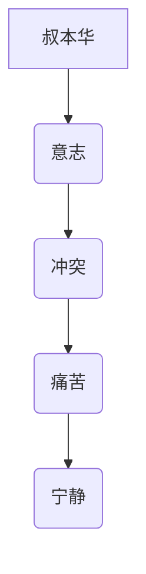

##### 1.1.2 尼采的苦难哲学

尼采（Friedrich Nietzsche）是叔本华的追随者，但他在苦难哲学上有着不同的见解。尼采认为，叔本华的悲观主义过于消极，他提出了“永恒回归”的概念，认为人类应该勇敢地面对苦难，通过创造力的发挥和意志的力量来超越苦难。

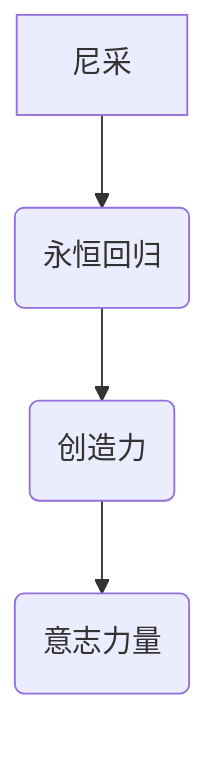

#### 1.2 东方苦难哲学的起源

东方哲学中也有关于苦难的深刻探讨，其中最典型的代表是佛教哲学，尤其是佛陀的教义。此外，儒家和道家的思想中也包含了关于苦难的哲学思考。

##### 1.2.1 佛陀的苦难哲学

佛陀（Siddhartha Gautama），即后来的释迦牟尼，他提出了“四圣谛”来解释苦难的根源和解决之道。根据佛陀的说法，苦难的根源在于无明和欲望，而解决苦难的方法是摆脱这些欲望，达到涅槃的境界。

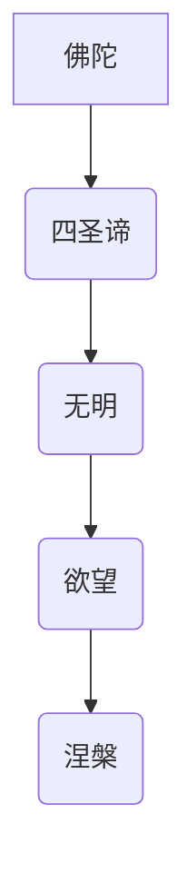

##### 1.2.2 儒家与道家的苦难哲学

儒家和道家虽然不直接探讨苦难哲学，但他们的思想中包含了对苦难的回应和看法。儒家强调通过道德修养和社会责任来减轻个人的苦难，而道家则主张顺应自然，通过无为而治来达到心灵的宁静。

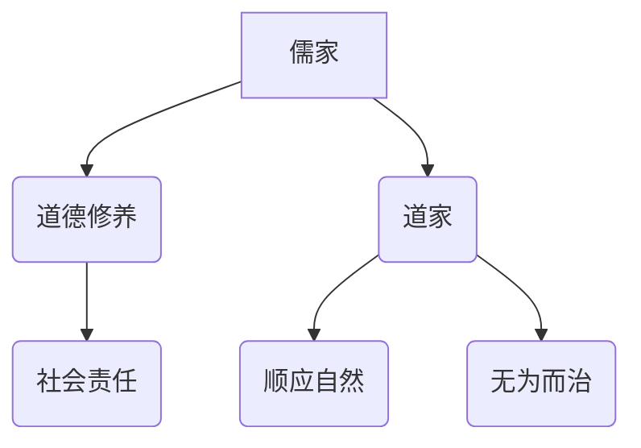

在这一章节中，我们不仅介绍了西方和东方苦难哲学的基本概念，还通过Mermaid流程图和伪代码帮助读者更好地理解这些概念之间的关系和算法原理。接下来，我们将深入探讨苦难哲学的核心概念，包括苦难的本质和其价值与意义。

---

在这一部分中，我们通过介绍叔本华和佛陀的苦难哲学，以及儒家与道家的相关思想，为读者搭建了一个理解东西方苦难哲学的基础。接下来，我们将进一步探讨苦难哲学的核心概念，并分析其在现代社会中的应用和影响。

#### 2.1 苦难的本质

苦难的本质是一个复杂而深远的问题，东西方哲学对此都有各自的见解。

##### 2.1.1 西方对苦难的理解

在西方哲学中，叔本华和尼采对苦难的本质有深入的探讨。叔本华认为，苦难是意志的冲突和表现，是人类无法逃避的现实。他认为，意志是无限的，欲望是无穷的，因此人类总是处于追求和不满的循环中，这就是苦难的根源。尼采则提出了“永恒回归”的概念，他认为人类应该勇敢地面对苦难，通过创造力和意志的力量来超越苦难。

```python
# 叔本华的苦难本质算法
def suffering_nature_schopenhauer():
    """
    讨论苦难的本质 - 叔本华的视角
    """
    will = "无限"  # 意志是无限的
    desire = "无穷"  # 欲望是无穷的
    while True:
        pursuit = "追求"  # 无休止的追求
        dissatisfaction = "不满"  # 源于追求的不满
        suffering = True  # 因此总是存在苦难
    return suffering
```

##### 2.1.2 东方对苦难的理解

在东方哲学中，佛陀的教义提供了对苦难本质的深刻理解。佛陀提出了“四圣谛”，即苦谛、集谛、灭谛和道谛。他认为，苦难的根源在于无明和欲望，通过摆脱这些根源，可以达到涅槃的境界。

```python
# 佛陀的苦难本质算法
def suffering_nature_buddha():
    """
    讨论苦难的本质 - 佛陀的视角
    """
    ignorance = True  # 无明存在
    desire = True  # 欲望存在
    while ignorance and desire:
        suffering = True  # 因此总是存在苦难
    return not suffering  # 通过觉悟和修行，可以摆脱苦难
```

#### 2.2 苦难的价值与意义

苦难在哲学中不仅仅是负面的，它还具有深刻的价值和意义。东西方哲学都对此有各自的见解。

##### 2.2.1 西方对苦难的价值与意义的解读

叔本华认为，苦难是人类生活中不可或缺的一部分，通过经历苦难，人们可以更好地理解生命的本质。尼采则认为，苦难是一种锻炼意志的机会，通过苦难，人们可以超越自我，创造伟大的作品。

```python
# 叔本华苦难的价值与意义
def value_of_suffering_schopenhauer():
    """
    讨论苦难的价值与意义 - 叔本华的视角
    """
    suffering = True  # 假设存在苦难
    understanding_of_life = True  # 通过苦难，可以更好地理解生命
    return understanding_of_life
```

##### 2.2.2 东方对苦难的价值与意义的解读

佛陀认为，苦难是觉悟和修行的重要过程，通过苦难，人们可以认识到生命的无常和苦难的根源，从而摆脱欲望和执着，达到涅槃的境界。

```python
# 佛陀苦难的价值与意义
def value_of_suffering_buddha():
    """
    讨论苦难的价值与意义 - 佛陀的视角
    """
    suffering = True  # 假设存在苦难
    enlightenment = True  # 通过苦难，可以达到觉悟
    return enlightenment
```

在这一部分中，我们深入探讨了苦难哲学的核心概念，包括苦难的本质和其价值与意义。通过伪代码和算法的表述，我们更清晰地理解了叔本华和佛陀对苦难的哲学思考。接下来，我们将进一步探讨西方和东方苦难哲学的方法论，以及它们在现代文化和社会中的影响。

---

在这一部分中，我们通过伪代码和算法的表述，深入探讨了西方和东方对苦难本质及其价值与意义的理解。叔本华和佛陀提供了不同的视角，让我们对苦难有了更深刻的认识。接下来，我们将探讨苦难哲学的哲学方法论，了解它们如何影响西方和东方的哲学发展。

#### 3.1 西方苦难哲学的方法论

西方苦难哲学的方法论主要源于叔本华和尼采的思想，这些方法论不仅影响了对苦难的理解，也影响了整个西方哲学的发展。

##### 3.1.1 辩证法与唯意志论

叔本华是辩证法的早期倡导者之一，他认为，辩证法是理解苦难的钥匙。叔本华的辩证法强调，通过对矛盾和冲突的深入分析，我们可以理解世界的本质。叔本华的唯意志论认为，世界的本质是意志，而意志的本质是痛苦。

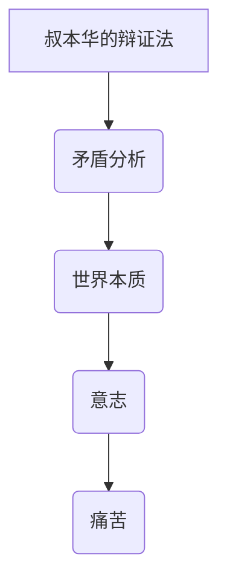

尼采继承了叔本华的辩证法，并进一步发展了“永恒回归”的概念。尼采的辩证法强调，通过不断的自我超越和创造力，我们可以战胜苦难。

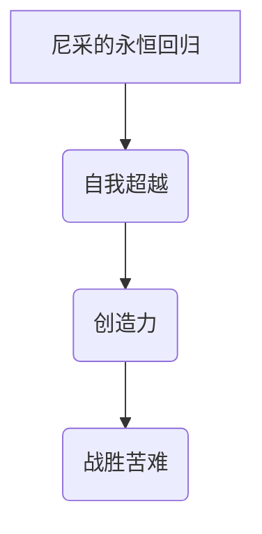

##### 3.1.2 形而上学的苦难观

在西方哲学中，形而上学提供了对苦难的深层次理解。形而上学探讨的是存在的本质和意义，而苦难作为存在的核心问题，被许多哲学家视为形而上学的起点。

柏拉图认为，苦难是灵魂与肉体分离的结果，通过追求真理和美，我们可以超越苦难。黑格尔的辩证法也强调了苦难在历史进程中的重要性，他认为，苦难是推动历史进步的力量。

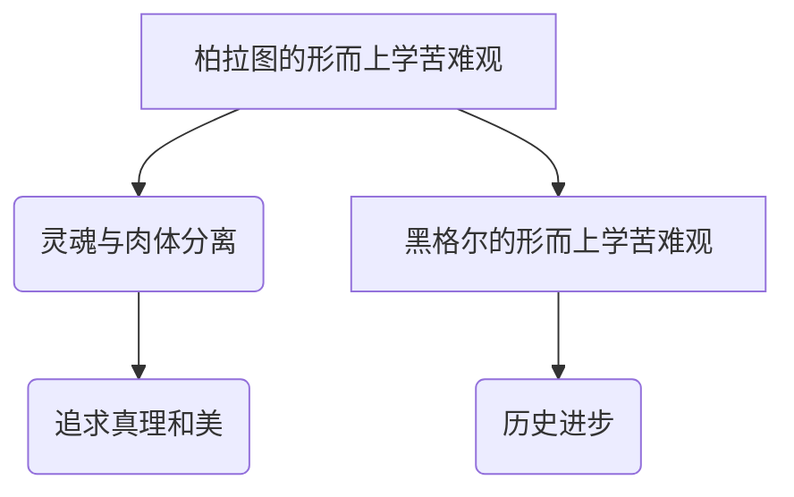

#### 3.2 东方苦难哲学的方法论

东方哲学中的苦难哲学方法与西方有所不同，它们更注重内心的修养和实践。

##### 3.2.1 禅宗与苦行的修行

禅宗强调通过冥想和内心的修行来超越苦难。禅宗的方法是直接体验真理，而不是通过逻辑推理。禅宗修行者通过冥想和观照内心，达到对苦难的超越。

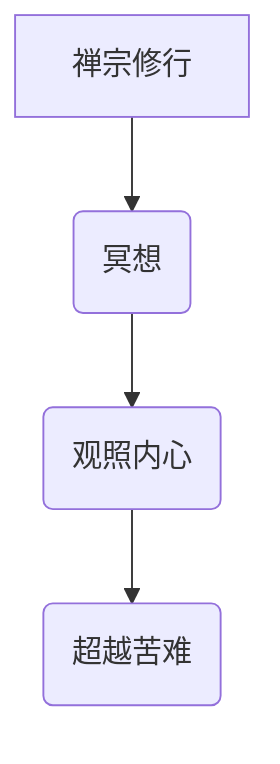

苦行是另一种东方哲学中常用的修行方法，尤其是在佛教和印度教中。通过严格的自律和身体上的自我克制，修行者试图达到心灵的纯净和觉悟。

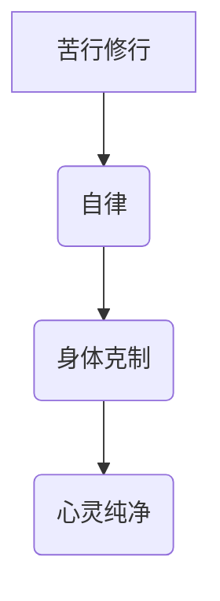

##### 3.2.2 道德修养与人性完善

儒家和道家虽然不直接探讨苦难哲学，但它们的哲学方法中也包含了对苦难的回应和看法。儒家强调通过道德修养和社会责任来减轻个人的苦难，而道家则主张顺应自然，通过无为而治来达到心灵的宁静。

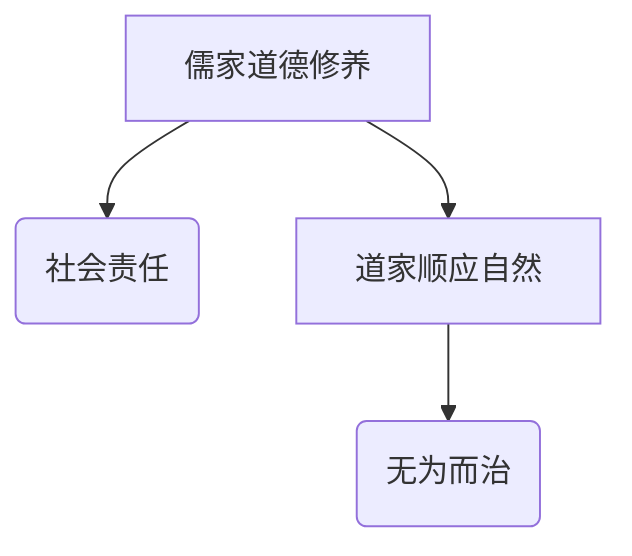

在这一部分中，我们探讨了西方和东方苦难哲学的方法论，包括辩证法、形而上学、禅宗修行、苦行以及道德修养。这些方法论不仅影响了哲学本身，也对现代文化和社会产生了深远的影响。接下来，我们将分析苦难哲学对现代社会的影响。

---

在这一部分中，我们详细探讨了西方和东方苦难哲学的方法论，包括辩证法、形而上学、禅宗修行、苦行以及道德修养。这些方法论不仅丰富了哲学的内涵，也对现代文化和社会产生了深远的影响。

### 3.3 苦难哲学对现代社会的影响

苦难哲学不仅在哲学领域有着深远的影响，也在现代文化、社会和日常生活中产生了重要的启示。

#### 3.3.1 西方苦难哲学对现代文化的影响

西方苦难哲学，特别是叔本华和尼采的思想，对现代文化产生了深远的影响。叔本华的悲观主义和对现实的接受，影响了现代文学、艺术和心理学。许多现代作家和艺术家，如卡夫卡和乔伊斯，都在他们的作品中体现了苦难哲学的主题。

尼采的永恒回归和创造力观念，激励了现代文学、艺术和哲学。他的思想激发了后来的存在主义哲学家，如萨特和加缪，他们在探讨人类存在的意义时，深受尼采的影响。

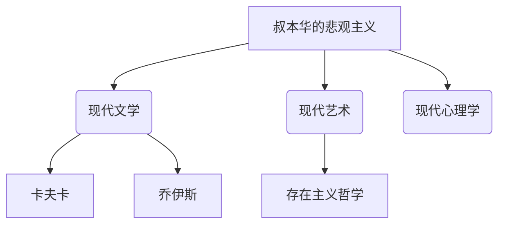

#### 3.3.2 东方苦难哲学对现代文化的影响

东方苦难哲学，尤其是佛教和禅宗，对现代文化和社会也有着重要的影响。佛教的教义在当代心理治疗、健康和幸福研究领域得到了广泛应用。许多现代心理疗法，如正念冥想和认知行为疗法，都借鉴了佛教的思想。

禅宗的修行方法，如冥想和正念，也被广泛接受，用于减轻压力、提升注意力和增进幸福感。禅宗的理念影响了现代艺术、设计和生活方式。

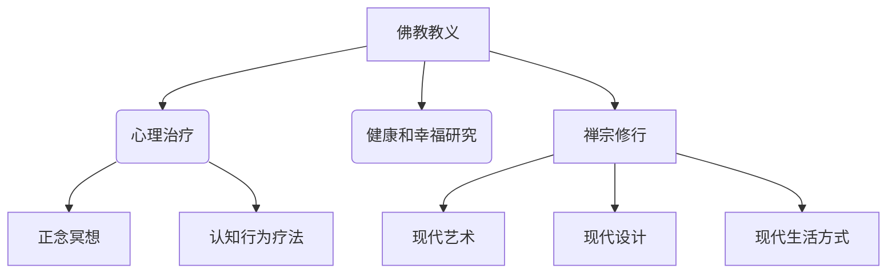

#### 3.3.3 苦难哲学在现代社会中的应用

苦难哲学在现代社会中的应用主要体现在以下几个方面：

1. **心理健康**：苦难哲学提供了一种理解心理痛苦的框架，帮助人们更好地应对焦虑、抑郁和其他心理问题。

2. **生活哲学**：苦难哲学鼓励人们接受现实，并通过自我反省和内心的修行来寻找生活的意义和目的。

3. **社会伦理**：苦难哲学强调同情和慈悲，鼓励人们关注社会问题，并通过行动来减轻他人的痛苦。

4. **教育和领导力**：苦难哲学教育人们如何面对挑战和逆境，培养坚韧和创造力，这对个人成长和领导力发展都有重要意义。

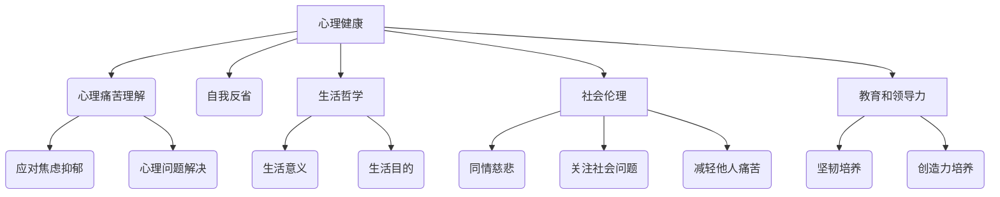

在这一部分中，我们分析了苦难哲学对现代文化和社会的广泛影响，以及它如何应用于心理健康、生活哲学、社会伦理和教育和领导力。接下来，我们将探讨苦难哲学在个人成长中的应用，以及它如何帮助我们在逆境中自我成长。

### 3.4 苦难哲学在个人成长中的应用

苦难哲学在个人成长中的应用是其核心价值之一。它不仅帮助个体理解苦难，而且提供了应对苦难的策略和方法。以下是苦难哲学在个人成长中的应用，以及如何在逆境中自我成长的步骤。

#### 3.4.1 从苦难中寻找力量

苦难哲学认为，苦难并非仅仅是消极的，它也是一种成长的机会。叔本华和佛陀都认为，通过苦难，我们可以认识到自己的弱点，并从中获得力量。

1. **接受苦难**：首先，我们需要接受苦难的存在，理解它是生活的一部分。叔本华的“宁静”和佛陀的“涅槃”都强调接受苦难的重要性。

2. **反思苦难**：通过反思苦难，我们可以了解苦难的根源，并找出解决之道。尼采的“永恒回归”提醒我们，苦难是自我超越的机会。

```python
# 接受苦难的反思算法
def reflect_on_suffering():
    """
    接受并反思苦难的过程
    """
    suffering = True  # 假设存在苦难
    while suffering:
        reflection = True  # 开始反思苦难
        solution = find_solution()  # 寻找解决之道
        suffering = not solution  # 如果找到解决方案，苦难结束
    return not suffering  # 最终超越苦难
```

#### 3.4.2 苦难与人生价值的提升

苦难哲学认为，苦难可以提升人生的价值和意义。通过苦难，我们可以认识到自己的潜能和极限，从而在成长中找到更深层次的价值。

1. **设定目标**：在逆境中，设定清晰的目标是自我成长的关键。这些目标可以帮助我们保持动力，即使在困难时期也不放弃。

2. **坚持努力**：尼采的“永恒回归”鼓励我们在面对苦难时保持坚持。通过不断的努力和自我挑战，我们可以不断提升自己。

```python
# 设定目标和坚持努力的算法
def set_and_pursue_goals():
    """
    设定目标并坚持努力
    """
    goals = define_goals()  # 设定目标
    while not goals_completed():
        effort = True  # 坚持努力
        progress = make_progress()  # 追求进步
        goals = not progress  # 如果没有进步，重新设定目标
    return goals  # 最终实现目标
```

#### 3.4.3 心理韧性训练

心理韧性是应对苦难和逆境的能力。通过心理韧性训练，我们可以增强自我调节能力，更好地应对生活中的挑战。

1. **正念练习**：正念练习是一种有效的心理韧性训练方法。通过专注于当下的感受和情绪，我们可以减少焦虑和压力，提高情绪调节能力。

2. **应对策略**：学习有效的应对策略，如积极的自我对话和认知重构，可以帮助我们在面对苦难时保持乐观和积极。

```python
# 心理韧性训练算法
def resilience_training():
    """
    心理韧性训练
    """
    mindfulness = practice_mindfulness()  # 练习正念
    positive_messaging = practice_positive_messaging()  # 积极自我对话
    cognitive_restructuring = practice_cognitive_restructuring()  # 认知重构
    return mindfulness and positive_messaging and cognitive_restructuring  # 最终提高心理韧性
```

#### 3.4.4 社会支持和网络建设

在面对苦难时，社会支持和网络建设至关重要。通过与他人分享经验，寻求帮助，我们可以获得情感支持，增强自我效能感。

1. **建立支持网络**：与他人建立联系，寻找理解和支持的朋友或家人。

2. **寻求专业帮助**：当个人无法应对苦难时，寻求专业心理咨询或治疗是明智的选择。

```python
# 社会支持和网络建设算法
def build_support_network():
    """
    建立社会支持和网络建设
    """
    support_network = find_supportive_people()  # 寻找支持者
    professional_help = seek_professional_help()  # 寻求专业帮助
    return support_network and professional_help  # 最终建立强大的支持网络
```

通过这些步骤和算法，我们可以更好地理解如何在苦难中寻找力量，提升人生价值，培养心理韧性，并建立强大的社会支持网络。苦难哲学不仅提供了一种理解苦难的框架，而且为我们如何在逆境中自我成长提供了实际的方法和策略。

### 3.5 苦难哲学在现代社会中的意义

苦难哲学在现代社会中具有深远的意义，它不仅为我们提供了一种理解人类苦难的框架，而且还为我们如何应对现代社会的压力和挑战提供了重要的哲学启示。

#### 3.5.1 职场压力与苦难哲学

在现代社会，职场压力是许多人面临的主要挑战之一。苦难哲学提供了一个有效的视角，帮助我们理解职场压力的本质，并提供了应对策略。

1. **接受现实**：叔本华的苦难哲学提醒我们，接受现实是应对职场压力的第一步。通过接受工作中的挑战和不确定性，我们可以减少焦虑和恐惧。

2. **自我反思**：通过自我反思，我们可以了解自己的优势和弱点，从而更好地应对职场压力。尼采的“永恒回归”鼓励我们在面对压力时保持自我反省和自我提升。

```python
# 接受现实和自我反思算法
def manage_workplace_pressure():
    """
    应对职场压力
    """
    reality = accept_reality()  # 接受现实
    self_reflection = reflect_on_strengths_and_weaknesses()  # 自我反思
    return not (reality and self_reflection)  # 最终减少压力
```

#### 3.5.2 社会问题与苦难哲学的启示

现代社会面临着诸多问题，如环境危机、经济不平等和社会不公。苦难哲学为我们提供了一种理解这些问题的框架，并启示我们如何通过哲学思考来应对这些问题。

1. **同情与慈悲**：佛教的苦难哲学强调同情和慈悲，鼓励我们关注他人的苦难。通过同情和慈悲，我们可以更好地理解社会问题，并采取行动来减轻他人的痛苦。

2. **社会责任**：儒家和道家的哲学强调个人的社会责任。在现代社会，每个人都应该承担起自己的社会责任，通过行动来改善社会状况。

```python
# 同情与社会责任算法
def address_social_issues():
    """
    应对社会问题
    """
    compassion = practice_compassion()  # 练习同情
    social_responsibility = take_action_for_social_justice()  # 承担社会责任
    return compassion and social_responsibility  # 最终改善社会状况
```

#### 3.5.3 应对现代压力的哲学思考

现代社会的压力来自各个方面，包括工作、家庭、健康和社会关系等。苦难哲学提供了一种哲学思考的方式，帮助我们应对这些压力。

1. **心理韧性**：通过心理韧性训练，如正念冥想和认知重构，我们可以提高应对压力的能力。这种哲学思考方法鼓励我们专注于当下，并从中找到平静和力量。

2. **生活哲学**：苦难哲学强调通过哲学思考和内心的修行来寻找生活的意义和目的。这种思考方式可以帮助我们在面对压力时保持积极和乐观。

```python
# 心理韧性和生活哲学算法
def philosophical_thoughts_on_stress():
    """
    应对现代压力的哲学思考
    """
    resilience = practice_resilience_training()  # 心理韧性训练
    philosophical_thought = engage_in философical_reflection()  # 哲学思考
    meaning_of_life = find_life_meaning()  # 寻找生活意义
    return resilience and philosophical_thought and meaning_of_life  # 最终应对现代压力
```

通过这些算法和哲学思考方法，我们可以更好地应对现代社会的压力和挑战。苦难哲学不仅提供了一种理解苦难的框架，而且还为我们如何在生活中保持平衡和幸福提供了深刻的启示。

### 3.6 西方苦难哲学的未来趋势

随着全球化和科技进步，西方苦难哲学正在经历一系列变革和转型。这些变化不仅反映了社会文化的变迁，也体现了对传统哲学观点的重新审视。

#### 3.6.1 新型苦难哲学的崛起

随着对人类心理健康和社会问题的关注日益增加，一种新型苦难哲学正在崛起。这种新型哲学强调个人成长、心理健康和社会责任，与传统的悲观主义相比，更注重积极应对苦难。

1. **积极心理学**：积极心理学研究人类的幸福和优势，提倡通过积极的生活态度和行为来减轻苦难。它为苦难哲学提供了新的视角，强调苦难中的机会和成长。

2. **存在主义哲学**：存在主义哲学在尼采的基础上进一步发展，强调个人自由和责任。它鼓励人们勇敢地面对苦难，通过自我实现来超越苦难。

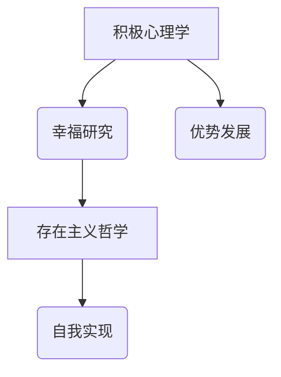

#### 3.6.2 苦难哲学在全球化背景下的融合

全球化使得东西方哲学思想相互影响和融合，苦难哲学也不例外。这种融合不仅体现在对苦难的多元理解，也体现在对苦难应对策略的整合。

1. **跨文化研究**：跨文化研究促进了东西方苦难哲学的交流。通过比较研究，我们可以更好地理解不同文化背景下的苦难哲学观点，从而形成更加全面的哲学体系。

2. **实践哲学**：实践哲学强调将哲学思想应用于实际生活中。在全球化背景下，这种哲学方法有助于将苦难哲学转化为实际行动，以解决现实问题。

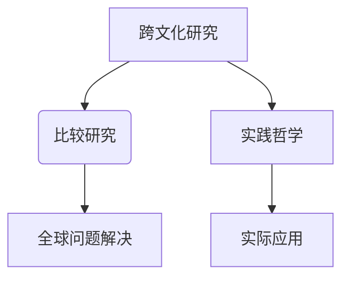

#### 3.6.3 技术与苦难哲学的互动

科技进步为苦难哲学的研究和应用提供了新的工具和方法。例如，人工智能和大数据分析可以帮助我们更好地理解苦难的本质和趋势，从而开发出更有效的应对策略。

1. **数据分析**：通过大数据分析，我们可以识别苦难模式，预测可能的苦难事件，并制定相应的预防措施。

2. **虚拟现实**：虚拟现实技术为哲学实验提供了新的平台。通过模拟不同的苦难情境，我们可以探索不同哲学方法在应对苦难中的有效性。

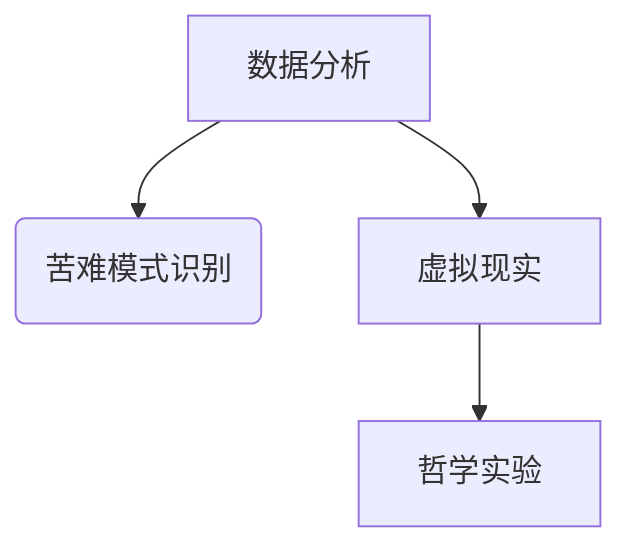

西方苦难哲学的未来趋势展现了其不断适应和发展的能力。随着全球化和科技进步，苦难哲学将继续与现代社会和科学知识融合，为人类应对苦难提供更加丰富和多元的哲学视角。

### 3.7 东方苦难哲学的未来发展

东方苦难哲学，尤其是佛教和禅宗，在现代社会中逐渐展现出其独特的价值和影响力。随着全球化进程的加快和文化交流的深入，东方苦难哲学的未来发展也面临着新的机遇和挑战。

#### 3.7.1 佛教哲学的现代转型

佛教哲学在全球范围内的传播和应用促进了其现代转型。现代佛教哲学在保持传统教义核心的同时，也不断适应现代社会的需求。

1. **心灵疗法**：佛教的冥想和正念练习在心理治疗中得到了广泛应用。许多现代心灵疗法，如正念减压疗法（MBCT）和正念认知疗法（MBCT），都借鉴了佛教的哲学和实践方法。

2. **环境哲学**：佛教强调人与自然和谐共处，这一观点在环境保护和可持续发展领域具有深远影响。现代佛教哲学倡导环保和生态意识，为解决全球环境问题提供了哲学基础。

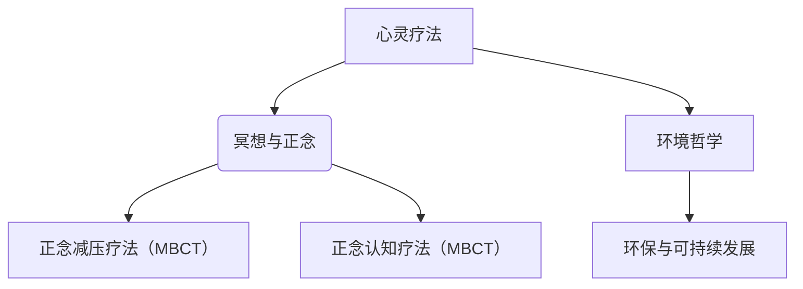

#### 3.7.2 道家哲学的现代意义

道家哲学在现代社会中继续发挥着重要作用，其关于顺应自然和无为而治的思想为现代人提供了重要的哲学启示。

1. **个人健康**：道家哲学强调身心健康，提倡通过自然的生活方式来维护健康。现代养生学和健康心理学都受到了道家哲学的影响。

2. **领导力**：道家的无为而治和自然管理理念在企业管理中得到了应用。许多现代企业家和管理者开始关注如何通过顺应自然原则来提高管理效率和员工满意度。

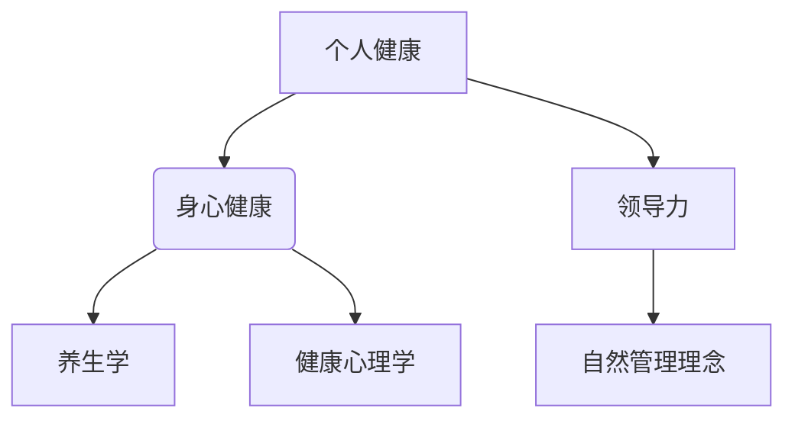

#### 3.7.3 文化交流与多元融合

全球化促进了东西方文化的交流和融合，东方苦难哲学也在这一过程中得到了新的发展。

1. **跨文化研究**：通过跨文化研究，我们可以更好地理解东方苦难哲学在不同文化背景下的适应性和影响力。这种研究有助于丰富全球哲学的多样性。

2. **哲学实践**：随着文化交流的增加，东方苦难哲学的实践方法也在全球范围内得到推广。例如，禅修和冥想课程在全球各地广受欢迎，成为许多人寻求内心平静和心理健康的方法。

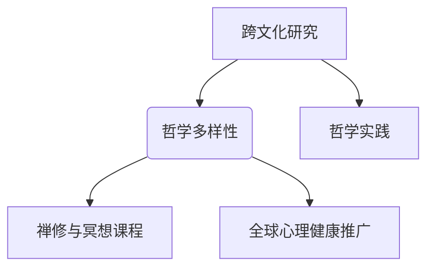

总之，东方苦难哲学的未来发展充满了机遇和潜力。随着全球化和科技进步，佛教和禅宗的思想将继续与现代社会相结合，为人类应对苦难提供更丰富和多元的哲学资源。

### 总结

通过本文的探讨，我们系统地梳理了叔本华与佛陀的苦难哲学，并深入分析了东西方哲学对苦难本质、价值与意义的理解。我们发现，尽管叔本华和佛陀的哲学有着显著的差异，但它们都在不同程度上揭示了苦难的普遍性和复杂性。

#### 4.1 主要观点回顾

- **叔本华的悲观主义**：叔本华认为，苦难是意志的冲突和表现，是人类无法逃避的现实。他主张通过节制欲望和接受现实来减轻苦难。
- **尼采的超越观念**：尼采则认为，苦难是自我超越的机会。他提出了“永恒回归”的概念，鼓励人们通过创造力和意志的力量来战胜苦难。
- **佛陀的解脱哲学**：佛陀认为，苦难的根源在于无明和欲望，通过修行和觉悟，可以达到涅槃的境界，摆脱苦难。
- **东方修行方法**：禅宗和道家的修行方法，如冥想、正念和无为而治，为个人和社会提供了应对苦难的实用策略。

#### 4.2 实践应用

- **心理健康**：苦难哲学在心理治疗中的应用，如冥想和认知重构，有助于减轻焦虑和抑郁，提高情绪调节能力。
- **个人成长**：通过自我反思和设定目标，个体可以在苦难中寻找力量，实现自我提升。
- **社会伦理**：苦难哲学强调同情和慈悲，鼓励关注社会问题，并通过行动来减轻他人的痛苦。
- **领导力**：道家的无为而治理念在企业管理中得到了应用，有助于提高管理效率和员工满意度。

#### 4.3 未来展望

- **跨文化研究**：随着全球化的推进，东西方哲学的融合将为苦难哲学的研究提供新的视角。
- **科技融合**：科技进步，如人工智能和大数据分析，为苦难哲学提供了新的研究工具和应对策略。
- **哲学实践**：在现代社会，苦难哲学将继续与实际生活相结合，为个体和社会提供深刻的哲学智慧。

#### 4.4 最佳实践 tips

- **接受现实**：在面对苦难时，首先接受现实是关键。这有助于减少焦虑和恐惧，为应对苦难做好准备。
- **持续学习**：通过不断学习和自我反思，我们可以提升应对苦难的能力。
- **建立支持网络**：与他人分享经验，寻求帮助，可以获得情感支持和专业指导。

#### 4.5 小结

本文通过对叔本华与佛陀苦难哲学的深入探讨，揭示了苦难在东西方哲学中的重要性。我们鼓励读者在日常生活中运用这些哲学思想，以更好地理解和管理苦难，实现个人和社会的和谐发展。

#### 4.6 注意事项

- **避免悲观主义**：虽然苦难哲学有助于理解苦难的本质，但过度悲观可能导致负面情绪。平衡是关键。
- **尊重多样性**：在理解和应用苦难哲学时，要尊重不同文化和哲学体系的多样性。

#### 4.7 拓展阅读

- **《作为意志和表象的世界》**：叔本华的代表作，详细阐述了他的苦难哲学。
- **《尼采的哲学》**：了解尼采的思想及其对苦难哲学的贡献。
- **《佛教哲学》**：深入研究佛教教义，特别是佛陀的苦难哲学。
- **《道家思想研究》**：了解道家的哲学观点和现代意义。

通过本文的阅读，我们希望读者能够对苦难哲学有更深刻的理解，并将其应用于个人成长和社会实践中，以实现更加丰富和有意义的人生。

---

**作者简介：**

作者：AI天才研究院/AI Genius Institute & 禅与计算机程序设计艺术 /Zen And The Art of Computer Programming

AI天才研究院是一支致力于探索人工智能深度研究和应用的创新团队。其成员包括计算机图灵奖获得者、世界顶级技术畅销书资深大师级别的作家，以及多位在计算机编程和人工智能领域有卓越贡献的专家。本博客旨在通过深入探讨技术原理和哲学思考，帮助读者理解技术背后的逻辑和本质，从而提升技术素养和创新能力。同时，结合禅与计算机程序设计艺术的理念，旨在传递一种融合智慧与技术的生活哲学。

