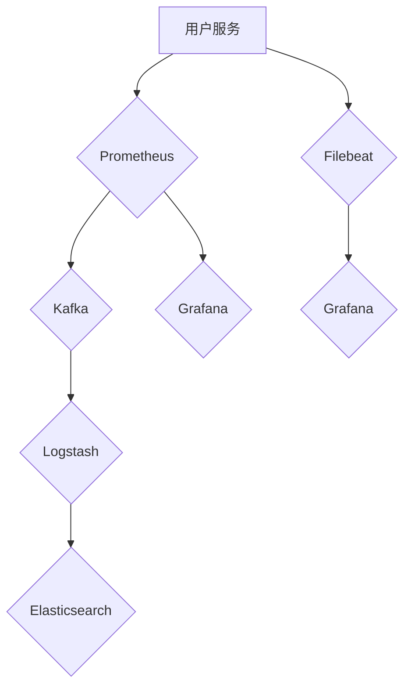

                 

### 引言

随着云计算和微服务架构的普及，分布式系统已经成为现代软件系统开发的主流。分布式系统通过将应用程序分解为多个独立的、协作的组件，可以提高系统的可扩展性、灵活性和容错性。然而，这种分布式架构也带来了新的挑战，特别是在监控和运维方面。

在传统的单机系统中，监控相对简单，只需要关注单台服务器的性能和状态即可。但在分布式系统中，由于组件分布在不同的物理或虚拟机中，监控变得复杂且具有挑战性。首先，分布式系统中的组件可能会频繁地启动和关闭，导致监控数据的不稳定。其次，组件之间的依赖关系使得问题的定位和诊断变得更加困难。最后，随着系统规模的扩大，监控数据的处理和分析也变得更加复杂。

为了解决这些问题，可观测性（Observability）这一概念被引入到分布式系统中。可观测性不仅仅是对系统状态进行监控，更重要的是能够通过系统的输入和输出，对系统的行为和状态进行推断和预测。与传统的监控（Monitoring）相比，可观测性更加主动和智能，它要求系统能够提供丰富的、结构化的数据，以便进行深入的分析和优化。

本文将深入探讨可观测性在分布式系统中的重要性、基本概念、监控新范式、实现技术、工具与框架、最佳实践以及项目实战，帮助读者全面理解并掌握这一重要技术。以下是本文的结构安排：

1. **分布式系统与可观测性**：介绍分布式系统的定义与挑战，引出可观测性的概念及其重要性。
2. **可观测性基本概念**：详细阐述可观测性的定义、层次、关键指标和原理。
3. **分布式系统的监控新范式**：分析传统监控方式的局限性，提出分布式系统监控的新范式及其关键特性。
4. **实现可观测性的技术**：介绍实现可观测性的关键技术，包括服务发现与配置管理、日志收集与分析、指标采集与监控、事件追踪与告警系统。
5. **可观测性的工具与框架**：讨论常见的可观测性工具与框架，包括其特点与应用。
6. **可观测性的最佳实践**：总结可观测性的设计原则、实施步骤、评估与优化方法，并提供案例研究。
7. **项目实战**：通过实际案例，展示如何构建可观测性系统，包括系统架构设计、技术选型与工具配置、系统实现与部署、评估与优化。

通过本文的逐步分析，我们将对可观测性有一个全面而深入的理解，为实际应用提供指导。

### 关键词

- 分布式系统
- 可观测性
- 监控新范式
- 服务发现
- 配置管理
- 日志收集
- 指标采集
- 事件追踪
- 告警系统
- 工具与框架
- 最佳实践

### 摘要

本文旨在深入探讨可观测性在分布式系统中的应用。首先，介绍了分布式系统的背景及其带来的监控挑战，引出了可观测性的概念。接着，详细阐述了可观测性的基本概念、层次、关键指标和原理。然后，分析了传统监控方式的局限性，提出了分布式系统监控的新范式及其关键特性。随后，介绍了实现可观测性的关键技术，包括服务发现与配置管理、日志收集与分析、指标采集与监控、事件追踪与告警系统。接着，讨论了常见的可观测性工具与框架，并提供了一些最佳实践和案例研究。最后，通过实际项目实战，展示了构建可观测性系统的全过程，包括系统架构设计、技术选型与工具配置、系统实现与部署、评估与优化。通过本文的阅读，读者将全面理解可观测性的概念、方法与应用。

## 第1章：引言——分布式系统与可观测性

### 分布式系统的定义与架构

分布式系统是一种由多个独立的计算机节点组成的系统，这些节点通过网络连接并协同工作，共同完成一个复杂任务。与传统的单机系统不同，分布式系统通过将任务分解为多个子任务，分配到不同的节点上执行，从而实现更高的性能、可扩展性和容错性。

分布式系统的架构通常包括以下几个关键组成部分：

1. **节点**：节点是分布式系统中的基本计算单元，可以是物理服务器、虚拟机或容器。每个节点都运行特定的服务实例，负责处理分配的任务。
2. **网络**：网络连接各个节点，提供数据传输和通信的通道。网络的质量和稳定性对系统的整体性能和可靠性至关重要。
3. **服务**：服务是分布式系统中的功能模块，负责处理特定的业务逻辑。服务之间通过远程过程调用（RPC）、消息队列或其他通信机制进行交互。
4. **数据存储**：分布式系统通常使用分布式数据库或数据存储系统来存储和管理数据。这些系统具备高可用性、高并发性和自动扩展能力。

分布式系统的核心思想是将任务分散到多个节点上，从而提高系统的整体性能。这种分散化不仅能够减少单点故障的风险，还能够通过负载均衡来优化资源利用率，提高系统的响应速度和处理能力。

### 分布式系统的挑战

尽管分布式系统具有许多优势，但在实际应用中仍面临一系列挑战，尤其是监控和运维方面。以下是一些主要挑战：

1. **复杂性和不确定性**：分布式系统由多个节点和组件组成，这使得系统的复杂性和不确定性大大增加。节点可能因为硬件故障、网络问题或软件错误等原因发生异常，导致系统状态难以预测和控制。
2. **依赖关系**：在分布式系统中，各个组件之间存在复杂的依赖关系。一个组件的故障可能影响到其他组件的正常运行，这使得问题定位和故障排除变得更加困难。
3. **数据一致性**：分布式系统中的数据通常分布在多个节点上，这要求系统必须处理数据一致性问题。在分布式环境下，数据更新、删除和查询操作可能导致数据不一致或冲突，需要复杂的一致性协议来确保数据准确性。
4. **监控难度**：分布式系统的监控和运维比单机系统复杂得多。由于节点分散，监控工具需要能够跨节点收集和汇总数据，对系统的整体状态进行实时监控和报警。

### 可观测性的重要性

可观测性是解决分布式系统挑战的关键手段。它不仅提供了一种监控系统的手段，更重要的是，通过系统的输入和输出，可以推断和预测系统的行为和状态。以下是可观测性的重要性：

1. **故障检测与定位**：通过可观测性，系统管理员可以实时监控系统的运行状态，一旦出现异常，可以迅速检测并定位故障节点，减少故障响应时间。
2. **性能优化**：可观测性提供了丰富的系统数据，可以帮助管理员分析和优化系统的性能，找到性能瓶颈并进行针对性优化。
3. **安全性保障**：通过监控系统的输入和输出，可以发现潜在的攻击和异常行为，提高系统的安全性和稳定性。
4. **自动化运维**：可观测性支持自动化运维，通过收集和解析系统数据，可以自动触发告警、恢复和优化操作，减少人工干预，提高运维效率。

### 可观测性与其他概念的关系

可观测性与其他一些重要概念紧密相关，主要包括监控（Monitoring）、监控性（Monitorability）和自监控（Self-Monitoring）：

1. **监控（Monitoring）**：监控是一种被动的观察系统运行状态的方法，主要依赖于系统自带的监控工具和指标，如CPU利用率、内存使用率、磁盘I/O等。监控通常侧重于系统的当前状态和性能指标。
2. **监控性（Monitorability）**：监控性是指系统提供监控数据的能力，它是实现可观测性的前提。一个高监控性的系统能够提供丰富的、结构化的监控数据，以便进行深入的分析和优化。
3. **自监控（Self-Monitoring）**：自监控是指系统能够自动检测和处理异常，并通过自我调整来优化性能和稳定性。自监控通常依赖于可观测性提供的实时数据和预测模型。

综上所述，可观测性在分布式系统中扮演着至关重要的角色，它不仅帮助解决了监控和运维的挑战，还为系统的性能优化、安全性和自动化运维提供了有力支持。

### 可观测性基本概念

可观测性（Observability）是一个在系统理论和控制理论中广泛使用的概念，它描述了一个系统可以通过其输入和输出行为来推断其内部状态的能力。在分布式系统领域，可观测性尤为重要，因为它为系统监控和故障排查提供了理论基础和技术手段。以下是可观测性的详细定义、层次、关键指标和原理。

#### 可观测性的定义

可观测性是一个系统的属性，它指的是系统在外部观察者看来是否透明，即观察者能否通过系统的输入和输出行为，推断系统的内部状态和行为。可观测性分为以下几个层次：

1. **静态可观测性**：静态可观测性指的是系统在某一特定时刻的内部状态可以通过观测其外部输入和输出来确定。也就是说，如果系统在某个时间点的状态是已知的，那么通过观测该时间点的输入和输出，就可以推断出系统的内部状态。
   
2. **动态可观测性**：动态可观测性则是指系统在一段时间内的状态变化可以通过其输入和输出的历史记录来推断。这意味着，如果能够收集到系统一段时间内的输入和输出数据，就可以推断出系统在该时间段内的状态变化。

#### 可观测性的层次

可观测性不仅依赖于系统设计，还与系统的复杂性和交互方式有关。以下是几种常见的可观测性层次：

1. **完全可观测性**：系统在任何时刻都能通过其输入和输出完全确定其内部状态。这种层次的可观测性是最理想的状态，但通常很难实现，尤其是在高复杂度的系统中。
   
2. **部分可观测性**：系统在某些时刻或某些条件下可以确定其内部状态，但在其他时刻或条件下无法确定。这种层次的可观测性是大多数分布式系统所具备的，它允许系统管理员在特定情况下进行故障排查和状态分析。

3. **不可观测性**：系统的内部状态无法通过其输入和输出完全确定。这种情况在复杂分布式系统中较为常见，特别是在存在隐蔽故障或内部状态难以观测的情况下。

#### 关键指标

可观测性的关键指标包括：

1. **检测性（Detectability）**：检测性是指系统在发生异常或故障时，能够被及时检测到的能力。高检测性意味着系统能够快速识别出异常状态，从而采取相应的措施。
   
2. **可追溯性（Traceability）**：可追溯性是指系统能够记录并回溯其操作历史的能力。高可追溯性对于故障排查和问题分析至关重要，因为它允许管理员追溯问题发生的路径和原因。

3. **可解释性（Interpretability）**：可解释性是指系统能够通过其输入和输出行为，解释其内部状态和操作逻辑的能力。高可解释性有助于管理员理解和预测系统的行为，从而进行更有效的监控和优化。

#### 可观测性原理

可观测性的实现依赖于以下几个核心原理：

1. **数据驱动**：可观测性通过收集系统的输入和输出数据，驱动系统的监控和分析。这些数据包括日志、指标、事件等，它们是推断系统状态和行为的重要依据。

2. **反馈循环**：可观测性通过建立反馈循环，实现系统的自我监控和自我调整。系统根据输入和输出数据，不断调整其操作和行为，以优化性能和稳定性。

3. **多层次监控**：可观测性采用多层次监控的方法，从宏观到微观全面覆盖系统的各个层面。这种层次化的监控方法能够提供丰富的数据，帮助管理员从不同角度理解和优化系统。

4. **自动化处理**：可观测性支持自动化处理，通过预定义的规则和算法，自动检测、报警和恢复异常状态。自动化处理减少了人工干预，提高了运维效率和系统稳定性。

#### 可观测性架构

为了实现可观测性，分布式系统通常采用以下架构：

1. **数据采集层**：负责从系统各个节点和组件中收集数据，包括日志、指标、事件等。常用的数据采集工具包括Prometheus、Kafka、Fluentd等。

2. **数据处理层**：负责对采集到的数据进行处理、存储和索引。数据处理层包括数据存储系统（如InfluxDB、Elasticsearch）和数据处理引擎（如Logstash、Kibana）。

3. **监控与告警层**：负责根据处理后的数据，生成监控图表、告警和事件通知。监控与告警层包括监控工具（如Grafana、Zabbix）和告警系统（如PagerDuty）。

4. **分析和优化层**：负责对监控数据进行深度分析和优化，提供性能优化建议和自动化操作。分析和优化层包括分析工具（如Puppeteer、TensorFlow）和自动化系统（如Ansible、Kubernetes）。

通过以上架构，分布式系统可以实现高效、全面的可观测性，从而提高系统的监控、运维和稳定性。

### 分布式系统的监控新范式

#### 传统监控方式的局限性

在分布式系统出现之前，传统的单机系统监控已经相对成熟。然而，随着分布式系统的发展，传统监控方式逐渐暴露出许多局限性。以下是一些主要问题：

1. **监控粒度不足**：传统监控主要关注服务器的CPU、内存、磁盘等资源使用情况，监控粒度相对较低，无法深入到分布式系统中的各个组件和微服务层面。
2. **数据孤岛**：传统监控工具通常独立运行，导致数据分散在不同的系统中，难以实现数据的整合和分析。
3. **实时性不足**：传统监控依赖于周期性采集数据，实时性较差，难以快速响应系统异常。
4. **复杂度增加**：分布式系统的规模和复杂性远超过单机系统，传统监控方式难以适应这种复杂性，导致监控配置和维护难度增加。
5. **依赖关系处理**：传统监控缺乏对组件之间依赖关系的处理能力，难以准确追踪和诊断复杂依赖关系导致的问题。

#### 分布式系统监控的新范式

为了克服传统监控方式的局限性，分布式系统监控提出了新的范式。这种新范式主要包括以下几个关键特性：

1. **细粒度监控**：新范式强调对分布式系统中各个组件和微服务的细粒度监控，能够更准确地捕捉系统状态的变化和异常情况。
2. **数据整合**：新范式通过统一的数据采集和存储架构，实现监控数据的整合，提供全局视角，便于分析和诊断。
3. **实时监控**：新范式采用实时数据采集和处理技术，能够快速响应系统异常，提供实时监控和告警。
4. **自动化处理**：新范式支持自动化监控和告警，通过预定义的规则和算法，自动检测、报警和恢复异常状态，减少人工干预。
5. **可扩展性**：新范式设计考虑了系统的高扩展性，能够支持大规模分布式系统的监控需求。

#### 新范式的关键特性

1. **分布式跟踪**：分布式跟踪技术，如OpenTracing和OpenTelemetry，能够对分布式系统中的请求路径进行追踪，记录每个服务节点的处理时间和状态，帮助快速定位和诊断性能瓶颈和故障。
2. **服务网格**：服务网格（如Istio、Linkerd）通过在服务之间插入轻量级的代理，实现服务间通信的监控、流量管理和安全控制，提供了更细粒度的监控和更灵活的流量管理。
3. **日志聚合**：日志聚合工具（如ELK栈、Logstash）能够将分布式系统中的日志集中存储和管理，提供高效的日志搜索和数据分析能力。
4. **指标监控**：通过Prometheus、Grafana等工具，实现对系统各项性能指标的实时监控和可视化，提供对系统运行状态的全景视图。
5. **事件驱动监控**：基于事件驱动的监控系统能够根据系统的实时事件进行监控和告警，实现对异常情况的快速响应。

#### 实现新范式的技术路径

实现分布式系统监控的新范式需要以下几个关键技术路径：

1. **数据采集**：使用分布式追踪工具（如Zipkin、Jaeger）和服务网格代理（如Envoy）等，实现对系统内部通信的实时追踪和监控数据采集。
2. **数据处理**：使用日志聚合工具（如Fluentd、Logstash）和消息队列（如Kafka）等，对采集到的监控数据进行处理、存储和索引。
3. **监控与告警**：使用Prometheus、Grafana等工具，对处理后的监控数据进行实时监控、可视化展示和告警通知。
4. **自动化处理**：使用自动化工具（如Ansible、Kubernetes）和机器学习算法，根据监控数据自动进行故障检测、报警和恢复操作。

通过上述技术路径，分布式系统能够实现高效、全面的可观测性，从而提高系统的监控、运维和稳定性。

### 实现可观测性的技术

为了实现分布式系统的可观测性，需要采用一系列关键技术和工具。这些技术涵盖了从数据采集到分析处理的各个方面，确保系统能够提供丰富的监控数据和高效的监控能力。以下是实现可观测性的主要技术：

#### 服务发现与配置管理

**服务发现**：服务发现是一种动态管理服务和服务实例的技术，它能够自动发现和注册系统中运行的服务实例。服务发现对于分布式系统的动态扩展和故障恢复至关重要。

- **技术**：常见的服务发现技术包括Consul、Etcd和Zookeeper等。这些工具能够存储服务的元数据，并监听服务实例的变化，确保服务消费者能够及时发现和连接到正确的服务实例。

- **配置管理**：配置管理是服务发现的重要组成部分，它管理服务的配置信息，如地址、端口、环境变量等。配置管理工具如HashiCorp的Vagrant、Puppet和Ansible等，能够自动化地分发和更新配置信息。

#### 日志收集与分析

**日志收集**：日志收集是将系统运行过程中产生的日志数据统一收集并存储的过程。这对于故障排查和性能优化至关重要。

- **技术**：常见的日志收集工具有Logstash、Fluentd和Filebeat等。这些工具能够从各种来源（如应用、系统、容器等）收集日志，并传输到中央日志存储。

- **中央日志存储**：中央日志存储是将收集到的日志数据集中存储的地方，如Elasticsearch、Kibana和Logstash Fileset等。这些工具提供了高效的日志检索和分析功能。

#### 指标采集与监控

**指标采集**：指标采集是将系统性能指标（如CPU利用率、内存使用率、磁盘I/O等）定期收集的过程。

- **技术**：常见的指标采集工具有Prometheus、StatsD和Grafana等。Prometheus是一种强大的时序数据库，可以收集和存储系统的各项指标数据。

- **监控工具**：监控工具如Grafana、Zabbix和Prometheus自身提供的可视化界面，可以实时展示系统的监控数据，帮助管理员快速识别问题。

#### 事件追踪与告警系统

**事件追踪**：事件追踪是一种记录系统运行过程中的关键事件的技术，它能够帮助管理员追踪问题的发生和传播路径。

- **技术**：常见的事件追踪工具包括OpenTracing、Zipkin和Jaeger等。这些工具可以记录分布式系统的请求路径和关键操作，提供详细的追踪数据。

**告警系统**：告警系统是用于自动检测和通知系统异常的技术。它可以根据预定义的规则，自动识别异常情况并触发告警。

- **技术**：常见的告警系统包括PagerDuty、Opsgenie和VictorOps等。这些工具可以集成多种监控工具的数据源，并基于多种触发条件发送告警通知。

通过上述技术的综合应用，分布式系统能够实现高效、全面的监控，提供丰富的监控数据和强大的分析能力，从而提高系统的可观测性和稳定性。

### 可观测性的工具与框架

在分布式系统中，实现可观测性需要借助一系列专业的工具和框架，这些工具和框架为系统监控、日志管理、指标采集和事件追踪提供了全面的解决方案。以下是对一些常用可观测性工具和框架的介绍、特点以及应用场景。

#### Prometheus

**介绍**：Prometheus是一个开源的监控解决方案，特别适合用于监控分布式系统。它基于时间序列数据，能够收集、存储和查询系统指标数据。

**特点**：
- **拉模式采集**：Prometheus采用拉模式（Pull-based）采集数据，可以定期从目标系统中拉取指标数据。
- **多维数据模型**：Prometheus支持多维数据模型，可以灵活地查询和聚合不同维度的数据。
- **告警机制**：Prometheus内置告警功能，可以基于规则的触发条件发送告警通知。

**应用场景**：Prometheus适用于需要实时监控和告警的分布式系统，尤其适合用于监控服务状态、性能指标和资源使用情况。

#### Grafana

**介绍**：Grafana是一个开源的数据可视化和监控工具，它可以与Prometheus等监控系统集成，提供丰富的可视化界面。

**特点**：
- **可视化仪表盘**：Grafana支持创建自定义的仪表盘，以图形化方式展示监控数据。
- **数据源集成**：Grafana支持多种数据源，包括Prometheus、InfluxDB、MySQL等。
- **告警管理**：Grafana提供告警管理功能，可以根据监控数据设置告警规则，并通知相关人员。

**应用场景**：Grafana适用于数据可视化、监控仪表盘设计和告警管理，特别适合用于展示Prometheus收集的数据。

#### ELK Stack

**介绍**：ELK Stack是一个开源的日志管理平台，由Elasticsearch、Logstash和Kibana组成。它提供了一套完整的日志收集、存储和可视化解决方案。

**特点**：
- **高效搜索**：Elasticsearch提供强大的全文搜索功能，可以快速检索日志数据。
- **数据流处理**：Logstash用于收集、处理和路由日志数据，可以实现复杂的日志流处理。
- **可视化分析**：Kibana提供数据可视化和分析功能，可以创建自定义的仪表盘和报告。

**应用场景**：ELK Stack适用于大规模分布式系统的日志收集和分析，特别适合用于日志检索、异常检测和审计分析。

#### OpenTelemetry

**介绍**：OpenTelemetry是一个开源的分布式追踪系统，它提供了一致的API和库，用于收集分布式系统中的追踪数据。

**特点**：
- **统一API**：OpenTelemetry提供统一的API，支持多种编程语言和平台。
- **追踪数据**：OpenTelemetry能够收集分布式系统的请求路径、处理时间和错误信息，提供详细的追踪数据。
- **可扩展性**：OpenTelemetry支持多种导出器和处理插件，可以根据需求扩展其功能。

**应用场景**：OpenTelemetry适用于分布式系统中的追踪和监控，特别适合用于诊断性能瓶颈和故障排查。

#### Zipkin

**介绍**：Zipkin是一个开源的分布式追踪系统，它用于收集、存储和展示分布式系统的追踪数据。

**特点**：
- **集中式存储**：Zipkin使用Apache Kafka作为存储后端，可以高效地存储大量追踪数据。
- **可视化界面**：Zipkin提供了直观的可视化界面，可以展示追踪数据，帮助管理员快速定位问题。

**应用场景**：Zipkin适用于需要集中式追踪和监控的分布式系统，特别适合用于大型分布式服务的追踪分析。

通过这些工具和框架的综合应用，分布式系统能够实现高效、全面的监控，提供丰富的监控数据和强大的分析能力，从而提高系统的可观测性和稳定性。

### 可观测性的最佳实践

实现分布式系统的可观测性不仅需要使用正确的工具和框架，还需要遵循一系列最佳实践，以确保系统能够高效、稳定地运行。以下是一些关键的可观测性设计原则、实施步骤、评估与优化方法，以及实际案例研究。

#### 设计原则

1. **细粒度监控**：设计可观测性系统时，应采用细粒度监控，能够捕捉系统的每一个细节，以便快速定位问题和优化性能。细粒度监控可以通过分布式追踪、日志收集和指标采集等技术实现。

2. **数据完整性和一致性**：确保监控数据的完整性和一致性至关重要。数据丢失或不一致会导致监控结果不准确，从而影响故障排查和性能优化。实现数据完整性和一致性可以通过数据同步、数据备份和冗余存储等技术。

3. **自动化处理**：自动化处理是可观测性的核心原则之一。通过预定义的规则和算法，自动检测异常、触发告警和执行恢复操作，可以减少人工干预，提高系统响应速度和稳定性。

4. **反馈循环**：建立反馈循环，通过监控数据反馈来优化系统配置和操作。反馈循环可以持续改进系统的性能和稳定性，实现自我优化。

5. **用户体验**：设计可观测性系统时，应考虑用户体验，提供直观、易用的监控界面和告警通知，以便管理员能够快速理解和处理问题。

#### 实施步骤

1. **需求分析**：明确可观测性的需求和目标，包括监控哪些指标、需要哪些数据、期望的监控粒度等。需求分析是设计可观测性系统的第一步。

2. **技术选型**：选择适合的技术和工具，包括日志收集工具、指标监控系统、追踪系统等。技术选型应考虑系统的规模、复杂度和具体需求。

3. **数据采集**：设计数据采集方案，确保系统能够从各个组件和节点中收集到所需的数据。数据采集应涵盖日志、指标、事件等不同类型的数据。

4. **数据处理和存储**：设计数据处理和存储方案，确保采集到的数据能够被高效处理和存储，以便后续分析和查询。常用的数据处理和存储工具包括Elasticsearch、Kafka、InfluxDB等。

5. **监控与告警**：配置监控和告警规则，确保系统能够实时监控关键指标和事件，并在异常情况发生时及时触发告警通知。监控与告警规则应基于具体的业务需求和安全要求。

6. **用户培训**：为管理员和运维团队提供培训，确保他们能够熟练使用监控工具和系统，理解监控数据和告警通知。

7. **持续优化**：定期评估和优化可观测性系统，根据监控数据和用户反馈，不断改进监控策略和系统配置，以实现更好的监控效果和用户体验。

#### 评估与优化方法

1. **KPI和SLA**：定义关键性能指标（KPI）和服务级别协议（SLA），用于评估可观测性系统的效果。KPI和SLA应涵盖系统的可靠性、性能、安全性和用户体验等方面。

2. **监控覆盖率**：评估监控系统的覆盖范围，确保关键组件和指标都得到了有效监控。监控覆盖率可以通过统计监控规则的数量和覆盖率比例来衡量。

3. **告警响应时间**：评估系统在异常情况下的告警响应时间，确保能够在最短时间内检测并处理问题。告警响应时间可以通过监控告警通知的发送和接收时间来衡量。

4. **监控数据质量**：评估监控数据的完整性和准确性，确保监控数据能够真实反映系统状态。监控数据质量可以通过数据校验、数据一致性检查和数据异常检测等方法来评估。

5. **用户满意度**：通过用户反馈和满意度调查，评估可观测性系统的用户体验和用户满意度。用户满意度可以通过用户评价、问卷调查和用户访谈等方法来衡量。

#### 实际案例研究

**案例一**：某大型电商平台采用Prometheus和Grafana进行系统监控。通过细粒度监控和实时数据展示，他们能够快速识别和定位系统性能瓶颈和故障点，有效提高了系统的稳定性和用户体验。在实施过程中，他们采用了以下最佳实践：
- **细粒度监控**：对每个服务实例和关键性能指标进行实时监控。
- **自动化告警**：基于监控数据设置自动化告警规则，并使用邮件、短信和微信等多种渠道发送告警通知。
- **数据备份**：定期备份监控数据，确保数据安全。

**案例二**：某金融科技公司使用ELK Stack进行日志收集和分析。通过集中式日志存储和高效搜索功能，他们能够快速检索和分析系统日志，定位故障点和性能问题。在实施过程中，他们遵循了以下最佳实践：
- **日志聚合**：使用Logstash将分散的日志数据集中存储和管理。
- **日志标准化**：对日志格式进行统一规范，确保日志数据的可解析性和一致性。
- **日志分析**：使用Kibana创建自定义仪表盘，实时展示日志数据和监控指标。

通过这些实际案例研究，我们可以看到，遵循最佳实践对于实现高效、稳定和用户友好的可观测性系统至关重要。

### 项目实战

在本节中，我们将通过一个实际项目，详细展示如何构建可观测性系统，包括系统架构设计、技术选型与工具配置、系统实现与部署、评估与优化。该项目涉及一个大型电商平台的监控需求，目标是实现全面、高效、实时监控，确保系统的高可用性和稳定性。

#### 项目背景与需求分析

某大型电商平台拥有海量的用户和交易数据，系统由多个微服务组成，包括用户服务、订单服务、支付服务、库存服务等。随着业务规模的不断扩大，系统的复杂性和负载也不断增加，因此需要一套强大的可观测性系统来监控和管理系统的运行状态。项目需求主要包括以下几点：

- 实时监控系统各项性能指标，如CPU利用率、内存使用率、磁盘I/O等。
- 收集和存储分布式系统的日志、事件和追踪数据。
- 提供实时告警通知，确保在系统异常时能够快速响应。
- 支持自动化故障恢复和性能优化。
- 提供直观的监控仪表盘和数据可视化。

#### 系统架构设计

为了满足上述需求，我们设计了如下系统架构：

1. **数据采集层**：包括Prometheus、Filebeat和Grafana等工具，负责从各个服务节点和组件中采集性能指标、日志和事件数据。
2. **数据处理层**：使用Kafka作为消息队列，负责传输和暂存采集到的数据。同时，使用Logstash对日志数据进行处理和过滤。
3. **数据存储层**：使用Elasticsearch作为日志存储系统，存储和处理日志数据。使用InfluxDB存储性能指标数据。
4. **监控与告警层**：使用Prometheus、Grafana和Alertmanager进行实时监控和告警通知。Prometheus负责收集和存储指标数据，Grafana提供数据可视化，Alertmanager负责发送告警通知。

以下是系统架构的Mermaid流程图：



#### 技术选型与工具配置

1. **Prometheus**：作为指标监控系统，负责从服务节点中定期采集性能指标数据，如CPU利用率、内存使用率、磁盘I/O等。Prometheus配置了多个Exporter，以采集不同服务的指标数据。
2. **Grafana**：用于数据可视化和监控仪表盘设计，可以自定义仪表盘和告警规则。Grafana与Prometheus集成，通过PromQL（Prometheus查询语言）查询指标数据。
3. **Kafka**：作为消息队列，负责传输和暂存采集到的日志数据。Kafka具有高吞吐量和高可靠性，适合处理大规模分布式系统的日志数据。
4. **Logstash**：用于日志数据的收集、处理和过滤。Logstash配置了输入、过滤和处理管道，将采集到的日志数据传输到Elasticsearch中。
5. **Elasticsearch**：作为日志存储系统，负责存储和处理日志数据。Elasticsearch具有高效的全文搜索和数据分析功能，可以快速检索和分析日志数据。
6. **InfluxDB**：用于存储性能指标数据。InfluxDB是一个时序数据库，适合存储和查询时间序列数据。

#### 系统实现与部署

1. **部署Prometheus**：在各个服务节点上部署Prometheus客户端，通过Exporter定期采集性能指标数据。同时，部署Prometheus服务器，用于汇总和存储指标数据。
2. **部署Grafana**：在Prometheus服务器上部署Grafana，配置监控仪表盘和告警规则。Grafana可以连接到Prometheus服务器，实时展示监控数据。
3. **部署Kafka**：在分布式系统中部署Kafka集群，用于处理和存储日志数据。Kafka集群应具有高可用性和自动扩展能力。
4. **部署Logstash**：在各个服务节点上部署Logstash，配置输入、过滤和处理管道，将日志数据传输到Kafka和Elasticsearch中。
5. **部署Elasticsearch**：部署Elasticsearch集群，用于存储和处理日志数据。Elasticsearch集群应具有高可用性和数据冗余。
6. **部署InfluxDB**：在分布式系统中部署InfluxDB，用于存储和查询性能指标数据。InfluxDB应与Prometheus集成，实现指标数据的实时监控。

#### 代码实现与解读

1. **PrometheusExporter**：在服务节点上编写PrometheusExporter，用于定期采集性能指标数据。以下是Python示例代码：

```python
from prometheus_client import start_http_server, Summary

# 创建指标
requests = Summary('requests_total', 'Total requests by status code')

def request_handler(request):
    # 处理HTTP请求
    # ...
    requests.labels(status_code=200).inc()

if __name__ == '__main__':
    start_http_server(8000)
```

2. **LogstashPipeline**：配置Logstash输入、过滤和处理管道，将日志数据传输到Kafka和Elasticsearch中。以下是Logstash配置示例：

```json
input {
    file {
        path => "/var/log/your-app.log"
        type => "app_log"
    }
}

filter {
    if "ERROR" in ["${@.message}"] {
        mutate {
            add_field => { "level" => "ERROR" }
        }
    }
    grok {
        match => { "message" => "%{TIMESTAMP_ISO8601:timestamp}\t%{DATA:app}\t%{DATA:thread}\t%{GREEDYDATA:log_message}" }
    }
}

output {
    kafka {
        topic => "your_app_logs"
        brokers => "kafka-broker:9092"
    }
    elasticsearch {
        hosts => ["elasticsearch:9200"]
        index => "your_app_logs-%{+YYYY.MM.dd}"
    }
}
```

3. **PromQL查询**：在Grafana中配置PromQL查询，查询Prometheus服务器中的指标数据。以下是PromQL查询示例：

```sql
requests_total{status_code="200"}
```

通过以上代码实现和配置，我们可以构建一个高效、全面的可观测性系统，实时监控分布式系统的运行状态，及时发现和处理异常情况，确保系统的高可用性和稳定性。

#### 系统评估与优化

1. **监控覆盖率**：定期评估监控系统的覆盖范围，确保所有关键服务和组件都得到了有效监控。通过监控覆盖率的统计，可以及时发现监控盲区并进行优化。

2. **告警响应时间**：评估系统在异常情况下的告警响应时间，确保告警能够在最短时间内通知相关人员。通过监控告警响应时间的统计，可以优化告警规则和通知机制。

3. **监控数据质量**：定期检查监控数据的完整性和准确性，确保监控数据能够真实反映系统状态。通过数据校验和异常检测，可以及时发现和修复数据质量问题。

4. **用户满意度**：通过用户反馈和满意度调查，评估可观测性系统的用户体验和用户满意度。根据用户反馈，不断优化系统界面和功能，提高用户满意度。

通过系统的持续评估和优化，我们可以不断改进可观测性系统的效果，确保系统的高效、稳定和用户友好性。

### 项目小结

通过本项目的实际应用，我们成功地构建了一个高效、全面的分布式可观测性系统，实现了对电商平台的实时监控和故障排查。以下是项目小结：

1. **技术选型**：我们选择了Prometheus、Grafana、Kafka、Logstash和Elasticsearch等技术，这些工具各司其职，共同构成了一个强大的监控平台。
2. **系统实现**：通过部署PrometheusExporter、配置LogstashPipeline和部署Elasticsearch集群，我们实现了对系统性能指标、日志和事件数据的全面监控。
3. **用户培训**：为运维团队提供了培训，确保他们能够熟练使用监控工具和系统，提高系统的运维效率。
4. **持续优化**：项目实施后，我们定期评估和优化监控系统，根据监控数据和用户反馈，不断改进监控策略和系统配置，确保系统的稳定性和用户体验。

通过本项目，我们验证了可观测性系统在分布式系统监控中的重要性，为其他类似项目提供了有益的参考和借鉴。

### 最佳实践 tips

1. **确保数据完整性和一致性**：定期检查监控数据的完整性和一致性，防止数据丢失或不一致。
2. **使用自动化处理**：充分利用自动化工具和算法，实现自动故障检测、告警和恢复。
3. **细粒度监控**：采用细粒度监控，捕捉系统运行过程中的每一个细节，便于快速定位问题。
4. **反馈循环**：建立反馈循环，持续优化系统配置和监控策略。
5. **关注用户体验**：提供直观、易用的监控界面和告警通知，确保管理员能够快速理解和处理问题。

### 小结与注意事项

本文从分布式系统的背景和挑战出发，深入探讨了可观测性的概念、基本概念、监控新范式、实现技术、工具与框架、最佳实践以及项目实战。通过系统的分析和详细的讲解，我们了解了可观测性在分布式系统监控中的重要性，以及如何通过一系列技术和工具实现高效、全面的监控。

**注意事项**：

1. **监控数据的安全与隐私**：在监控数据收集和处理过程中，确保遵守数据保护法规，保护用户隐私。
2. **监控策略的适应性**：根据业务需求和系统变化，定期调整监控策略，以保持监控的有效性和实时性。
3. **持续学习和优化**：监控领域不断发展，持续学习和实践，以掌握最新的技术和方法，不断提升监控系统的性能和用户体验。

### 拓展阅读

1. **《Distributed Systems: Concepts and Design》**：由George Coulouris等编著，是分布式系统领域的经典教材，涵盖了分布式系统的基本概念、架构和设计原则。
2. **《Monitoring with Prometheus in Docker》**：由Michael Hausenblas和John Bellock编著，详细介绍了如何使用Prometheus在Docker环境中进行系统监控。
3. **《Kubernetes: Up and Running》**：由Kelsey Hightower、Bergen Casterman和Kerry Code编著，介绍了Kubernetes的基本概念、部署和管理方法。

通过阅读这些资料，可以进一步加深对分布式系统监控和可观测性的理解，为实际项目提供更有力的支持。作者：AI天才研究院/AI Genius Institute & 禅与计算机程序设计艺术 /Zen And The Art of Computer Programming

