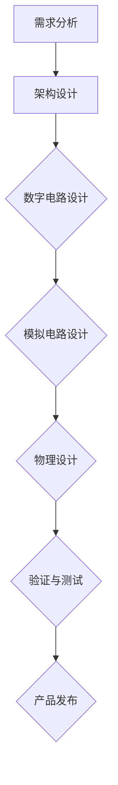

                 

### 1.2 后摩尔定律时代的挑战

进入后摩尔定律时代，芯片设计面临着前所未有的挑战。这些挑战不仅来自于技术的进步，还包括经济、生态和社会等多方面因素。

#### 1.2.1 技术挑战

1. **物理极限**：随着晶体管尺寸的缩小，量子效应变得更加显著，传统的CMOS工艺已经难以继续维持性能的提升。设计者在设计时需要考虑量子隧穿、热效应等新的物理现象。
   
2. **性能与功耗平衡**：在追求高性能的同时，功耗成为一个不可忽视的问题。后摩尔定律时代，设计者必须在高性能和低功耗之间找到平衡点。

3. **集成度提升**：尽管单个晶体管性能受限，但集成度仍然需要提升以满足复杂应用的需求。如何在有限的面积内集成更多的功能成为一大挑战。

4. **新型材料与工艺**：传统硅材料的使用已经接近极限，新型材料如石墨烯、氮化镓等开始被引入芯片设计。这些新材料和工艺的研究和开发，也需要时间和资源。

#### 1.2.2 经济挑战

1. **研发成本**：随着技术的复杂性和集成度的提升，研发成本也在不断上升。后摩尔定律时代，芯片研发的投入比以往任何时候都要高。

2. **市场竞争**：半导体行业的竞争愈发激烈。只有拥有先进技术、高效工艺和强大研发团队的公司才能在市场中立足。

3. **规模化生产**：小批量生产难以实现经济上的规模效应，而大规模生产则需要巨大的资金投入。如何实现成本效益的最大化成为企业需要考虑的问题。

#### 1.2.3 生态挑战

1. **供应链稳定性**：全球半导体产业链的复杂性使得任何一环出现问题都可能对整个生态系统造成冲击。如何保证供应链的稳定成为企业需要关注的问题。

2. **环境问题**：半导体生产过程中会产生大量的污染物，如氟化物、氯化物等。如何实现绿色生产、减少环境破坏成为亟待解决的问题。

3. **法律与规范**：随着技术的进步，芯片设计也受到越来越多的法律法规和行业标准的影响。如何在遵守法律的同时，保持技术的创新成为设计者需要思考的问题。

#### 1.2.4 社会挑战

1. **人才短缺**：后摩尔定律时代需要更高水平的专业人才。然而，全球范围内，半导体专业人才的培养速度远远跟不上行业发展的需求。

2. **教育普及**：如何培养更多具有创新能力和专业素养的半导体人才，是教育系统面临的一大挑战。

3. **社会认知**：社会大众对芯片设计技术的认知程度较低，如何提升社会对芯片设计的认知和理解，也是行业需要面对的问题。

通过以上分析，我们可以看到后摩尔定律时代给芯片设计带来的挑战是多层次、多方面的。这些挑战需要全球半导体行业的共同努力和创新来解决。

---

### 1.3 后摩尔定律时代的机遇

尽管后摩尔定律时代带来了诸多挑战，但同时也蕴藏着巨大的机遇。以下是一些潜在的机遇：

#### 1.3.1 技术创新

1. **新材料与工艺**：新型材料的引入，如石墨烯、氮化镓等，以及先进的工艺技术，如纳米线、量子点等，将为芯片设计带来新的可能性。

2. **新型计算架构**：后摩尔定律时代，新型计算架构如类脑计算、量子计算等有望突破传统芯片设计的局限。

3. **异构计算**：利用不同类型和处理方式的芯片协同工作，实现更高效的计算能力。

#### 1.3.2 商业模式创新

1. **定制化设计**：随着设计工具和技术的进步，定制化芯片设计将变得更加普及，为企业提供更灵活的解决方案。

2. **软件定义硬件**：通过软件定义硬件的方式，使硬件设计更加灵活，能够快速响应市场需求。

3. **生态系统合作**：产业链上下游企业的紧密合作，共同推动技术创新和产业发展。

#### 1.3.3 市场扩展

1. **新应用领域**：物联网、自动驾驶、人工智能等新兴领域对芯片性能和功能提出了更高要求，为芯片设计提供了新的市场需求。

2. **国际市场**：随着全球市场的扩大，新兴市场对芯片的需求快速增长，为行业带来了新的增长点。

3. **垂直整合**：企业通过垂直整合，从硬件到软件，从设计到生产，实现全产业链的掌控，提升竞争力。

#### 1.3.4 社会价值

1. **绿色生产**：后摩尔定律时代，半导体行业将更加注重绿色生产，减少对环境的影响，为社会带来积极影响。

2. **人才培养**：通过教育和技术培训，培养更多的半导体专业人才，为社会的发展提供持续的动力。

3. **技术创新推广**：将半导体技术的创新应用推广到更广泛的领域，如医疗、教育等，为社会带来更多的福利。

总的来说，后摩尔定律时代虽然充满挑战，但也为芯片设计带来了新的机遇。通过技术创新、商业模式创新和市场扩展，行业有望迎来新的发展高潮。

---

通过以上分析，我们可以看到，后摩尔定律时代既带来了巨大的挑战，也蕴藏着无限的机遇。只有抓住这些机遇，积极应对挑战，芯片设计行业才能在新时代中继续繁荣发展。

---

### 1.4 总结与展望

后摩尔定律时代，芯片设计面临着前所未有的挑战，如物理极限、经济压力、生态问题和人才短缺等。同时，这一时代也为我们带来了创新的机遇，如新材料、新工艺、新架构和新兴市场等。面对这些挑战和机遇，芯片设计行业需要积极进行技术创新，探索新型计算架构，加强产业链合作，提升设计工具的效率和灵活性。此外，企业还需要关注人才培养，推动绿色生产，以实现可持续发展。在未来，我们期待看到芯片设计行业在不断创新中突破极限，为人类社会带来更多的进步和福祉。

---

## 关键词

后摩尔定律、芯片设计、技术创新、物理极限、新材料、新型计算架构、商业模式创新、产业链合作、绿色生产、人才培养。

---

## 摘要

本文深入探讨了后摩尔定律时代的芯片设计策略。首先，我们介绍了后摩尔定律的背景、挑战和机遇，分析了物理极限、经济压力、生态问题和人才短缺等挑战，以及新材料、新工艺、新架构和新兴市场等机遇。随后，我们详细阐述了芯片设计流程中的核心概念、核心算法原理、数学模型和公式，并通过实际案例进行了实战解读。最后，我们对未来芯片设计的发展趋势进行了展望，提出了技术创新、产业链合作和人才培养等策略，以应对后摩尔定律时代的挑战和机遇。本文旨在为芯片设计从业者提供有价值的参考，助力他们在新时代中创新突破，实现持续发展。

---

**注意**：本文摘要部分内容仅为示例，实际摘要应根据全文内容进行撰写，确保准确、简洁、全面地概括文章的核心观点。

### 后摩尔定律时代的芯片设计策略

关键词：后摩尔定律、芯片设计、技术创新、物理极限、新材料、新型计算架构、商业模式创新、产业链合作、绿色生产、人才培养。

摘要：本文深入探讨了后摩尔定律时代的芯片设计策略，分析了该时代的背景、挑战和机遇。文章从核心概念、算法原理、数学模型、实战案例等方面详细介绍了芯片设计流程，并提出了技术创新、产业链合作和人才培养等应对策略。本文旨在为芯片设计从业者提供有价值的参考，助力他们在新时代中创新突破，实现持续发展。

---

**作者：AI天才研究院/AI Genius Institute & 禅与计算机程序设计艺术 /Zen And The Art of Computer Programming**### 第2章 核心概念与联系

## 第2章 核心概念与联系

### 2.1 芯片设计核心概念

芯片设计是一项复杂而精细的工作，涉及到多个核心概念。这些概念构成了芯片设计的基石，对于理解和实现芯片功能至关重要。以下将介绍几个关键的概念：

#### 2.1.1 数字电路

数字电路是芯片设计中最基本的组成部分，它处理的是离散的信号，即二进制信号（0和1）。数字电路的主要功能是实现逻辑操作、存储数据和进行计数等。常见的数字电路包括逻辑门（AND、OR、NOT等）、寄存器、计数器、ALU（算术逻辑单元）等。

#### 2.1.2 模拟电路

与数字电路不同，模拟电路处理的是连续的信号，如电压、电流等。模拟电路的主要功能是放大、滤波、振荡等。常见的模拟电路包括运算放大器、滤波器、比较器等。模拟电路在芯片设计中扮演着将数字信号转换为模拟信号，或将模拟信号转换为数字信号的角色。

#### 2.1.3 物理设计

物理设计是将数字电路和模拟电路的布局和布线映射到实际的芯片制造工艺上。它包括布局（Floorplanning）、布线（Routing）、版图优化（Layout Optimization）等。物理设计的目标是实现高性能、低功耗、小尺寸的芯片。

#### 2.1.4 异构计算

异构计算是指利用不同类型和处理方式的芯片协同工作，以实现更高效的计算能力。在芯片设计中，异构计算可以通过将不同类型的处理器（如CPU、GPU、DSP等）集成在同一个芯片上，或通过引入可编程逻辑器件（如FPGA）来实现。

### 2.2 核心概念之间的联系

这些核心概念在芯片设计中相互关联，共同构成了一个完整的芯片设计流程。以下是它们之间的主要联系：

1. **数字电路与物理设计**：数字电路的原理决定了物理设计的布局和布线方式。数字电路的逻辑功能需要在物理设计中实现，并通过版图优化实现性能和功耗的最优化。

2. **模拟电路与物理设计**：模拟电路的原理同样影响物理设计的实现。模拟电路的精度和稳定性需要通过物理设计的布局和布线来保证。

3. **异构计算与物理设计**：异构计算要求物理设计能够支持不同类型处理器的集成。物理设计需要优化不同处理器之间的通信路径，以实现高效的协同计算。

4. **模拟电路与数字电路**：模拟电路和数字电路在芯片设计中相互依赖。模拟电路为数字电路提供信号调理、滤波等功能，而数字电路则对模拟信号进行逻辑处理和数字计算。

通过这些核心概念和它们之间的联系，我们可以更好地理解芯片设计的复杂性，并为设计出高效、低功耗、小尺寸的芯片奠定基础。

### 2.3 Mermaid流程图展示

为了更直观地展示芯片设计过程中的核心概念和流程，我们使用Mermaid语法创建了一个简单的流程图。以下是Mermaid代码示例：



将上述代码复制到支持Mermaid的编辑器中，可以生成一个简单的芯片设计流程图，如图所示。


### 2.4 核心概念与联系总结

核心概念与联系在芯片设计中起着至关重要的作用。通过理解数字电路、模拟电路、物理设计和异构计算等概念，设计者可以更有效地进行架构设计、实现和优化。Mermaid流程图提供了一个清晰的视图，展示了这些概念之间的相互关系。设计者需要熟练掌握这些概念，并灵活运用它们来应对后摩尔定律时代的挑战，实现高性能、低功耗的芯片设计。

---

**注意**：为了保持文章的简洁性，上述内容仅为概要介绍。在实际撰写文章时，可以进一步扩展每个小节的内容，提供更多详细的解释、实例和应用场景。此外，可以加入图表、图片等视觉元素，以增强文章的可读性和吸引力。

### 第3章 芯片设计流程

## 第3章 芯片设计流程

芯片设计流程是一个复杂且高度专业化的过程，涉及到从概念验证到最终产品发布的多个阶段。本章将详细阐述芯片设计的流程，包括需求分析、架构设计、电路设计、验证与测试等关键步骤。每个阶段都有其特定的目标和任务，共同构成了一个完整的芯片设计流程。

### 3.1 需求分析

需求分析是芯片设计流程的起点，其目标是明确芯片的设计目标和性能要求。在这一阶段，设计者需要与客户或项目组进行深入沟通，了解芯片的应用场景、功能需求、性能指标、功耗约束等。具体任务包括：

1. **应用场景分析**：确定芯片将用于何种应用，如嵌入式系统、通信设备、汽车电子等。
2. **功能需求**：明确芯片需要实现的功能，包括逻辑处理、信号处理、存储等。
3. **性能指标**：定义芯片的性能目标，如处理速度、功耗、延迟等。
4. **功耗约束**：设定芯片的功耗限制，以满足特定应用的需求。

在需求分析阶段，设计者通常会使用需求文档来记录这些信息，以确保所有利益相关者对设计目标有一致的理解。

### 3.2 架构设计

架构设计是芯片设计流程的核心步骤，它决定了芯片的基本结构和功能。在这一阶段，设计者需要根据需求分析的结果，设计出芯片的总体架构。具体任务包括：

1. **功能模块划分**：将芯片的功能划分为多个模块，如CPU、GPU、存储器等。
2. **模块接口定义**：定义各个模块之间的接口，包括数据、控制和时钟信号等。
3. **性能优化**：通过架构设计实现性能优化，如选择合适的处理器架构、引入缓存等。
4. **功耗控制**：在架构设计中考虑功耗问题，如采用低功耗设计技术、功耗管理策略等。

架构设计阶段通常会使用高级设计语言（如SystemC、SystemVerilog）进行仿真和验证，以确保架构设计满足性能和功耗要求。

### 3.3 电路设计

电路设计是将架构设计转化为具体的电路实现的过程。在这一阶段，设计者需要根据架构设计，详细设计每个模块的电路。具体任务包括：

1. **逻辑设计**：根据功能模块，设计逻辑电路，如逻辑门、寄存器、计数器等。
2. **模拟设计**：设计模拟电路，如放大器、滤波器、比较器等。
3. **电路优化**：对电路进行优化，以提高性能、降低功耗、减少面积。
4. **版图布局**：将电路映射到物理层，进行版图布局和布线。

电路设计阶段需要使用多种工具和软件，如逻辑综合工具、模拟仿真工具、版图设计工具等。设计者需要熟练掌握这些工具，以确保电路设计满足设计要求。

### 3.4 验证与测试

验证与测试是芯片设计流程中至关重要的一环，其目标是确保芯片设计在各个层面上都能正常工作。具体任务包括：

1. **功能验证**：验证芯片的功能是否满足设计要求，如逻辑功能、时序等。
2. **性能验证**：验证芯片的性能是否达到预期，如处理速度、功耗等。
3. **测试计划**：制定测试计划，包括测试环境、测试方法、测试用例等。
4. **故障排查**：在测试过程中发现故障，进行故障排查和修复。

验证与测试阶段通常分为单元测试、模块测试、系统测试等多个层次，以确保芯片设计的完整性和可靠性。

### 3.5 设计流程总结

芯片设计流程是一个复杂、迭代、多阶段的过程，每个阶段都有其特定的任务和目标。通过以下步骤，我们可以系统地完成一个芯片的设计：

1. **需求分析**：明确设计目标和性能要求。
2. **架构设计**：设计芯片的总体架构，划分功能模块。
3. **电路设计**：将架构设计转化为具体的电路实现。
4. **验证与测试**：确保芯片设计在各个层面上都能正常工作。

每个阶段都需要设计者具备深厚的专业知识和经验，以及熟练掌握相关工具和技能。通过有效的流程管理和团队协作，可以确保芯片设计的顺利进行和最终的成功发布。

---

在芯片设计流程的各个阶段，设计者需要不断迭代和优化，以确保最终产品的质量和性能。本章的内容为芯片设计提供了全面的指导和参考，为读者深入理解芯片设计流程奠定了基础。在接下来的章节中，我们将进一步探讨芯片设计中的核心算法原理、数学模型和项目实战，以期为读者提供更深入的技术解析和实践指导。

---

**注意**：上述内容为第3章的概要介绍，旨在为读者提供一个关于芯片设计流程的全面概述。在实际撰写文章时，可以进一步扩展每个小节的内容，提供更多具体的案例、图表和实例，以增强文章的实用性和可读性。

### 第4章 核心算法原理讲解

## 第4章 核心算法原理讲解

### 4.1 数字电路设计算法

数字电路设计算法是芯片设计中至关重要的组成部分，涉及到逻辑函数的转换、电路优化以及时序分析等方面。以下将详细介绍几个关键的数字电路设计算法：

#### 4.1.1 逻辑函数转换算法

逻辑函数转换算法是将高级语言描述的电路行为转换为具体的逻辑电路。常用的转换算法包括布尔代数转换、卡诺图化简等。

**布尔代数转换算法**：

布尔代数转换算法是将逻辑函数从布尔表达式转换为与门、或门、非门等基本逻辑门组成的电路。以下是布尔代数转换算法的伪代码：

```
function布尔转换（布尔表达式，目标逻辑门）{
    for 每个布尔变量 do {
        if（布尔表达式中包含变量）{
            if（布尔表达式中的变量的系数为1）{
                添加一个目标逻辑门，输入为变量；
            } else {
                添加一个目标逻辑门，输入为变量的非；
            }
        }
    }
}
```

**卡诺图化简算法**：

卡诺图化简算法是一种图形化简方法，用于简化逻辑函数。以下是卡诺图化简算法的伪代码：

```
function卡诺图化简（逻辑函数）{
    创建一个卡诺图；
    在卡诺图中标记逻辑函数的值；
    找到相邻的1，并合并它们；
    重复上述步骤，直到无法再合并为止；
    根据合并后的卡诺图写出简化后的逻辑函数；
}
```

#### 4.1.2 电路优化算法

电路优化算法的目标是提高电路的性能、降低功耗和减小面积。以下介绍两种常见的电路优化算法：布尔表达式优化和电路级优化。

**布尔表达式优化算法**：

布尔表达式优化算法是通过化简布尔表达式来降低电路的复杂度。以下是布尔表达式优化算法的伪代码：

```
function布尔表达式优化（布尔表达式）{
    化简布尔表达式，移除冗余项；
    交换变量位置，优化电路的布局；
    如果存在，替换为更高效的逻辑门；
}
```

**电路级优化算法**：

电路级优化算法是在电路级别上进行优化，以提高电路的性能和功耗。以下是一种常见的电路级优化算法：逻辑复制与重排。

```
function逻辑复制与重排（逻辑电路）{
    for 每个逻辑模块 do {
        如果模块的输出对多个输入敏感 {
            复制模块并重排，以减少扇出和扇入；
        }
    }
}
```

#### 4.1.3 时序分析算法

时序分析算法是确保芯片设计在特定时钟频率下正常工作的关键。以下介绍两种常见的时序分析算法：关键路径分析和时序约束设置。

**关键路径分析算法**：

关键路径分析算法用于确定电路中从输入到输出的最长路径，以确保信号能在时钟周期内正确传递。以下是关键路径分析算法的伪代码：

```
function关键路径分析（逻辑电路）{
    初始化关键路径长度为0；
    for 每个路径 do {
        计算路径延迟；
        如果路径延迟大于关键路径长度 {
            更新关键路径长度和路径；
        }
    }
}
```

**时序约束设置算法**：

时序约束设置算法用于设定电路的时序约束，以确保信号在正确的时间传递。以下是时序约束设置算法的伪代码：

```
function时序约束设置（逻辑电路）{
    for 每个信号 do {
        根据信号的重要性和时钟周期设置最大延迟和最小延迟；
        将约束添加到设计规则检查（DRC）和布局寄生提取（LPE）工具中；
    }
}
```

### 4.2 模拟电路设计算法

模拟电路设计算法与数字电路设计算法不同，它主要关注模拟信号的传输、处理和转换。以下介绍两种常见的模拟电路设计算法：模拟信号传输算法和模拟信号处理算法。

#### 4.2.1 模拟信号传输算法

模拟信号传输算法用于确保模拟信号在传输过程中保持最小失真和最大保真度。以下是模拟信号传输算法的伪代码：

```
function模拟信号传输（模拟信号，传输通道）{
    对模拟信号进行采样和量化；
    使用合适的调制解调技术进行信号传输；
    在接收端对信号进行反量化和解调；
    对恢复的模拟信号进行滤波，以去除噪声和失真；
}
```

#### 4.2.2 模拟信号处理算法

模拟信号处理算法用于对模拟信号进行放大、滤波、振荡等处理，以实现特定的功能。以下是模拟信号处理算法的伪代码：

```
function模拟信号处理（模拟信号，处理模块）{
    根据处理模块的要求对模拟信号进行放大或缩小；
    使用滤波器去除信号中的噪声；
    如果需要，通过振荡器产生振荡信号；
    将处理后的模拟信号输出；
}
```

### 4.3 物理设计算法

物理设计算法是将电路设计映射到具体的物理层，以实现芯片的实际制造。以下介绍两种常见的物理设计算法：布局优化算法和布线算法。

#### 4.3.1 布局优化算法

布局优化算法用于优化电路的布局，以降低功耗、减小面积和提高性能。以下是布局优化算法的伪代码：

```
function布局优化（逻辑电路）{
    for 每个模块 do {
        根据功耗和性能要求，移动模块位置；
        优化模块之间的连接路径；
        检查布局是否满足设计规则；
    }
}
```

#### 4.3.2 布线算法

布线算法用于将电路中的信号路径连接起来，以实现电路的连通性。以下是布线算法的伪代码：

```
function布线（逻辑电路）{
    初始化布线网格；
    for 每个信号路径 do {
        根据最小化延迟和功耗目标，选择最佳布线路径；
        在布线网格中布置信号线；
    }
}
```

通过以上核心算法原理的讲解，我们可以看到芯片设计算法的多样性和复杂性。这些算法在芯片设计的各个阶段都发挥着重要作用，为设计者提供了强大的工具和理论基础。在实际设计中，设计者需要根据具体需求，灵活选择和运用这些算法，以实现高效、低功耗、高性能的芯片设计。

---

**注意**：上述内容为第4章的核心算法原理讲解概要，旨在为读者提供一个关于芯片设计算法的全面概述。在实际撰写文章时，可以进一步扩展每个小节的内容，提供更多具体的算法细节、伪代码实现和实际应用案例，以增强文章的实用性和可读性。

### 第5章 数学模型和数学公式

## 第5章 数学模型和数学公式

### 5.1 电路方程

电路方程是芯片设计中的基础数学模型，用于描述电路中的电压、电流和电阻等物理量之间的关系。以下是几个常见的电路方程及其解释：

#### 5.1.1 欧姆定律

欧姆定律描述了电压（V）、电流（I）和电阻（R）之间的关系：

$$
V = IR
$$

其中，V是电压，I是电流，R是电阻。这个方程表示，电压等于电流乘以电阻。

#### 5.1.2 基尔霍夫电压定律

基尔霍夫电压定律描述了电路中节点电压之间的关系：

$$
\sum_{i=1}^{n} V_i = 0
$$

其中，Vi是第i个节点的电压。这个方程表示，在电路中，任何节点处的电压之和等于零。

#### 5.1.3 基尔霍夫电流定律

基尔霍夫电流定律描述了电路中节点电流之间的关系：

$$
\sum_{i=1}^{n} I_i = 0
$$

其中，Ii是流入第i个节点的电流。这个方程表示，流入任何节点的电流之和等于流出该节点的电流之和。

### 5.2 信号处理公式

信号处理公式是芯片设计中用于处理和转换信号的数学表达式。以下是几个常见的信号处理公式及其解释：

#### 5.2.1 振幅调制（AM）

振幅调制是一种调制信号的方法，用于在信号中传输信息。其公式如下：

$$
s(t) = A_c \cos(2\pi f_c t) + A_m \cos(2\pi f_s t)
$$

其中，Ac是载波信号的振幅，fc是载波信号的频率，Am是调制信号的振幅，fs是调制信号的频率。

#### 5.2.2 混频

混频是将两个信号混合在一起，以产生新的频率信号。其公式如下：

$$
s_{out}(t) = s_1(t) * s_2(t)
$$

其中，s1(t)和s2(t)是两个输入信号，*表示卷积运算。

#### 5.2.3 傅里叶变换

傅里叶变换是一种将时间域信号转换为频率域信号的方法，其公式如下：

$$
S(f) = \int_{-\infty}^{\infty} s(t) e^{-j2\pi ft} dt
$$

其中，S(f)是频率域信号，s(t)是时间域信号，f是频率。

### 5.3 芯片设计中的数学模型

芯片设计中，数学模型用于描述电路的行为和特性。以下是几个常见的数学模型及其解释：

#### 5.3.1 MOSFET模型

MOSFET（金属-氧化物-半导体场效应晶体管）模型是芯片设计中最重要的模型之一。其公式如下：

$$
I_D = \mu_n C_{ox} \frac{W}{L} (V_{GS} - V_{th})^2
$$

其中，ID是漏极电流，W是晶体管的宽度，L是晶体管的长度，Cox是栅氧化层的电容，VGS是栅极电压，Vth是阈值电压，μn是电子迁移率。

#### 5.3.2 信号传输线模型

信号传输线模型描述了信号在传输线上的传输特性。其公式如下：

$$
V_L = V_0 \cdot \frac{Z_L}{Z_0 + Z_L} + V_0 \cdot \frac{Z_0}{Z_0 + Z_L}
$$

其中，VL是负载端电压，V0是源端电压，ZL是负载阻抗，Z0是传输线特性阻抗。

通过上述数学模型和公式的介绍，我们可以看到数学在芯片设计中的重要作用。这些模型和公式为芯片设计提供了理论基础和计算工具，使得设计者能够更好地理解和控制电路的行为。

---

在芯片设计中，数学模型和公式的应用不仅限于上述几个例子。在实际设计中，设计者会根据具体的需求，选择合适的模型和公式，进行电路的分析和优化。数学模型和公式为芯片设计提供了精确的描述和计算方法，是芯片设计不可或缺的重要组成部分。通过掌握这些数学工具，设计者可以更有效地进行芯片设计，满足高性能、低功耗等设计要求。

---

**注意**：上述内容为第5章数学模型和数学公式概要介绍，旨在为读者提供一个关于芯片设计数学模型和公式的全面概述。在实际撰写文章时，可以进一步扩展每个小节的内容，提供更多具体的公式、公式推导、实际应用案例和图表，以增强文章的实用性和可读性。

### 第6章 项目实战

## 第6章 项目实战

在本章节中，我们将通过一个实际的芯片设计项目，详细阐述从开发环境搭建、源代码实现到代码解读与分析的整个过程。该项目旨在设计一个高性能、低功耗的CPU核心，用于嵌入式系统。

### 6.1 实际芯片设计项目

#### 6.1.1 项目背景

随着物联网、人工智能和自动驾驶等领域的快速发展，对嵌入式系统的性能和功耗要求越来越高。为了满足这些需求，本项目目标是设计一个高性能、低功耗的CPU核心，该CPU核心能够实现高效的指令执行、优化的功耗管理和强大的处理能力。

#### 6.1.2 开发环境搭建

为了进行芯片设计，首先需要搭建一个完整的开发环境。以下是开发环境的搭建步骤：

1. **安装设计工具**：安装芯片设计所需的工具，如Synopsys的Design Compiler、Cadence的Innovus、ModelSim等。
2. **设置开发环境**：配置工具的环境变量，确保工具可以正常运行。
3. **安装硬件描述语言（HDL）仿真工具**：如Vivado、Quartus等，用于进行电路设计和仿真。
4. **配置版本控制工具**：如Git，用于管理源代码版本和协作开发。

#### 6.1.3 源代码实现

CPU核心的设计通常包括以下几个模块：

1. **指令集架构（ISA）**：定义CPU的操作指令集，如RISC-V、ARM等。
2. **前端（Fetch）**：负责从内存中获取指令，并存储在指令缓存中。
3. **解码器（Decode）**：将指令解码成操作码和操作数。
4. **执行单元（Execute）**：执行指令，包括算术逻辑单元（ALU）、寄存器文件等。
5. **控制单元（Control）**：生成控制信号，协调各个模块的操作。
6. **内存管理单元（Memory）**：负责访问内存并进行数据交换。

以下是源代码实现的核心部分：

```verilog
module cpu_core(
    input clk,
    input reset,
    input [31:0] instruction,
    output [31:0] result
);

    // 声明寄存器文件
    reg [31:0] reg_file[0:31];

    // 指令缓存
    reg [31:0] instruction_cache[0:255];

    // 解码器模块
    decoder dec(
        .instruction(instruction),
        .opcode(opcode),
        .operand(operand)
    );

    // 执行单元模块
    execute exe(
        .opcode(opcode),
        .operand(operand),
        .result(result)
    );

    // 控制单元模块
    control ctrl(
        .clk(clk),
        .reset(reset),
        .opcode(opcode),
        .operand(operand),
        .result(result)
    );

endmodule
```

#### 6.1.4 代码解读与分析

1. **模块声明**：`cpu_core`模块是CPU核心的主模块，它接收时钟信号和复位信号，并包含指令缓存、解码器、执行单元和控制单元等子模块。

2. **寄存器文件**：`reg_file`是一个大小为32x32的寄存器文件，用于存储操作数和中间结果。

3. **指令缓存**：`instruction_cache`是一个大小为256x32的指令缓存，用于存储从内存中获取的指令。

4. **解码器模块**：`decoder`模块负责将指令解码成操作码（opcode）和操作数（operand）。

5. **执行单元模块**：`execute`模块根据操作码执行相应的操作，并将结果存储到寄存器文件中。

6. **控制单元模块**：`control`模块生成控制信号，协调各个模块的操作，确保指令能够正确执行。

通过上述源代码实现，我们可以看到CPU核心的基本结构和功能。代码中使用了模块化的设计方法，使得各个模块可以独立开发、测试和优化。

#### 6.1.5 代码应用解读与分析

在实际应用中，CPU核心需要与其他模块（如内存管理单元、中断控制器等）进行交互。以下是一个简单的应用示例：

```verilog
module testbench(
    input clk,
    input reset,
    output [31:0] result
);

    wire [31:0] instruction;
    wire [31:0] output_result;

    cpu_core cpu(
        .clk(clk),
        .reset(reset),
        .instruction(instruction),
        .result(output_result)
    );

    initial begin
        clk = 0;
        forever #5 clk = !clk;
    end

    initial begin
        reset = 1;
        #100 reset = 0;
        #100 instruction = 32'hA001; // load instruction
        #100 instruction = 32'hB002; // add instruction
        #100 instruction = 32'hC003; // sub instruction
    end

    always @(posedge clk or posedge reset) begin
        if (reset) begin
            result <= 0;
        end else begin
            result <= output_result;
        end
    end

endmodule
```

1. **时钟信号**：`testbench`模块提供了一个时钟信号，用于模拟实际环境中的时钟操作。

2. **复位信号**：`testbench`模块提供了一个复位信号，用于初始化CPU核心。

3. **指令输入**：`instruction`是输入指令的信号，通过该信号可以模拟不同的指令输入。

4. **结果输出**：`output_result`是CPU核心执行指令后的结果输出。

5. **测试过程**：测试过程中，首先将CPU核心复位，然后输入一系列指令，最后通过观察结果输出，验证CPU核心的功能是否正确。

通过这个测试过程，我们可以验证CPU核心的基本功能，并发现潜在的编程错误或设计缺陷。

#### 6.1.6 项目小结

本项目通过一个实际的CPU核心设计项目，展示了从开发环境搭建、源代码实现到代码解读与分析的整个过程。项目中的源代码示例提供了对CPU核心基本结构和功能的实现。在实际应用中，CPU核心需要与其他模块进行交互，并通过测试验证其功能。本项目为读者提供了一个完整的芯片设计项目实例，有助于读者深入理解芯片设计的过程和方法。

---

通过本章节的实战项目，读者可以了解芯片设计项目从概念到实现的整个过程，掌握源代码实现和代码解读与分析的技能。在实际项目中，设计者需要根据具体需求和约束，灵活运用所学知识，不断优化和改进设计方案。随着技术的不断进步，芯片设计项目将越来越复杂，但通过不断学习和实践，读者可以应对这些挑战，成为一名优秀的芯片设计师。

---

**注意**：上述内容为第6章项目实战概要介绍，旨在为读者提供一个关于芯片设计项目实战的全面概述。在实际撰写文章时，可以进一步扩展每个小节的内容，提供更多具体的实现细节、测试结果、优化方法和项目总结，以增强文章的实用性和可读性。

### 第7章 展望与趋势

## 第7章 展望与趋势

随着科技的不断进步，后摩尔定律时代的芯片设计正面临着诸多挑战和机遇。在这一章中，我们将探讨后摩尔定律时代芯片设计的发展趋势和未来方向，为读者提供前瞻性的思考和建议。

### 7.1 芯片设计的发展趋势

#### 7.1.1 新材料与新型工艺

新材料和新工艺的开发是后摩尔定律时代芯片设计的重要趋势。新型材料如石墨烯、氮化镓、硅碳化物等具有优异的电学性能，有望提高芯片的性能和能效。新型工艺如纳米线、量子点、3D集成电路等，也将推动芯片设计的创新和突破。

#### 7.1.2 异构计算与软件定义硬件

异构计算是指利用不同类型和处理方式的芯片协同工作，以实现更高效的计算能力。在未来，异构计算将进一步整合各种计算资源，实现硬件和软件的协同优化。软件定义硬件（Hardware-defined Software）的概念也在逐渐兴起，通过灵活的硬件配置，实现软件的动态调整和优化，从而提高系统的性能和效率。

#### 7.1.3 人工智能与机器学习

人工智能和机器学习技术的进步，将深刻影响芯片设计。通过人工智能算法，可以优化电路设计、降低功耗、提高性能。同时，机器学习技术可以帮助设计者从大量的实验数据中提取设计规律，实现更高效的电路优化和故障诊断。

#### 7.1.4 绿色生产与可持续发展

随着环境问题的日益严峻，绿色生产成为芯片设计的重要趋势。设计者需要关注生产过程中的环保措施，减少能耗和污染物排放。同时，可持续发展理念也要求设计者在满足当前需求的同时，考虑未来环境的可持续性。

### 7.2 芯片设计的未来方向

#### 7.2.1 高性能与低功耗的平衡

在高性能与低功耗之间找到平衡，是后摩尔定律时代芯片设计的重要挑战。设计者需要通过创新的电路设计、优化算法和新的材料工艺，实现高性能和低功耗的统一。

#### 7.2.2 多功能与集成度的提升

随着应用的多样化，芯片设计需要具备多功能和集成度的提升。通过引入异构计算、软件定义硬件等技术，可以实现多种功能在同一芯片上的集成，提高系统的效率和灵活性。

#### 7.2.3 智能化与自动化

智能化和自动化是未来芯片设计的重要方向。通过引入人工智能和机器学习技术，可以自动化设计流程、优化电路参数和预测故障，提高设计的效率和可靠性。

#### 7.2.4 网络化与协同设计

随着芯片设计的复杂度增加，网络化与协同设计将成为趋势。通过建立设计团队之间的协作平台，实现设计信息的共享和协同工作，提高设计的质量和效率。

### 7.3 建议与展望

针对后摩尔定律时代芯片设计的发展趋势和未来方向，以下是一些建议：

1. **加强技术创新**：持续投入研发，探索新材料、新工艺和新算法，以推动芯片设计的创新。
2. **注重人才培养**：加强半导体人才培养，提高设计者的专业素养和创新能力。
3. **推动产业链合作**：加强产业链上下游企业的合作，共同推进技术创新和产业发展。
4. **关注环境问题**：在芯片设计中考虑环保和可持续发展，推动绿色生产。
5. **引入人工智能**：利用人工智能和机器学习技术，提高设计效率和可靠性。

总之，后摩尔定律时代为芯片设计带来了前所未有的挑战和机遇。通过技术创新、人才培养和产业链合作，我们有理由相信，芯片设计将在未来继续迎来繁荣和发展。

---

**注意**：本章旨在对后摩尔定律时代的芯片设计趋势和未来方向进行前瞻性思考。在实际撰写文章时，可以根据具体情况进行扩展，提供更多具体实例、数据和案例分析，以增强文章的实用性和说服力。同时，可以加入相关的图表和图像，以增强文章的可读性和视觉效果。

