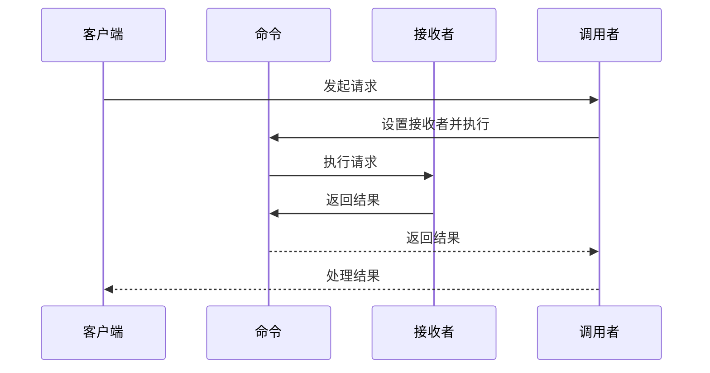

                 

### 文章标题：命令模式：类型论视角下的行为封装

> 关键词：命令模式、类型论、行为封装、设计模式、面向对象、软件设计

> 摘要：
本文深入探讨了命令模式，一种广泛使用的面向对象设计模式。我们首先从类型论的视角出发，分析命令模式的核心概念及其与类型论的关联。接着，详细阐述了行为封装的概念，并探讨了命令模式如何通过封装行为提高软件的灵活性和可维护性。文章随后通过伪代码和数学模型，逐步解释了命令模式的实现过程，并分享了一个实际的命令模式项目案例。最后，我们对命令模式在软件工程中的重要性进行了总结，并对其未来发展趋势进行了展望。

### 文章目录

## 第一部分：命令模式基础

### 第1章：命令模式概述
- 1.1 命令模式的核心概念
- 1.2 命令模式的基本架构
- 1.3 Mermaid 流程图：命令模式组件关系

### 第2章：类型论与命令模式
- 2.1 类型论基础
- 2.2 类型论视角下的命令模式
- 2.3 命令模式在不同类型论框架下的应用

### 第3章：行为封装与命令模式
- 3.1 行为封装的概念
- 3.2 为什么在命令模式中需要行为封装
- 3.3 通过命令模式实现行为封装

## 第二部分：命令模式的实现

### 第4章：命令模式的具体实现
- 4.1 创建命令对象
- 4.2 命令与接收者的绑定
- 4.3 调用命令的方法
- 4.4 使用伪代码展示命令模式的实现

### 第5章：数学模型与命令模式
- 5.1 命令模式的数学模型
- 5.2 使用 LaTeX 格式展示数学公式
- 5.3 数学模型的应用示例

### 第6章：命令模式项目实战
- 6.1 项目概述
- 6.2 开发环境搭建
- 6.3 源代码详细实现
- 6.4 代码解析与分析

## 第三部分：命令模式的扩展与应用

### 第7章：命令模式的优化与扩展
- 7.1 命令模式的优化策略
- 7.2 命令模式的扩展机制
- 7.3 命令模式在复杂系统中的应用

### 第8章：命令模式在未来软件开发中的趋势
- 8.1 命令模式的发展趋势
- 8.2 命令模式在新型软件开发模型中的应用
- 8.3 命令模式的潜在价值

## 附录

### 附录A：命令模式开发工具与资源
- 8.1 命令模式开发工具介绍
- 8.2 命令模式相关资源推荐

### 用户输入:
## 第一部分：命令模式基础

### 第1章：命令模式概述

命令模式（Command Pattern）是一种行为型设计模式，它将请求或操作封装为一个对象。这种模式的主要目的是将请求发送者和请求接收者解耦，使得两者不直接交互，同时还能支持请求的记录、撤销、重做等操作。命令模式广泛应用于GUI编程中，如Java Swing的Action类，以及命令行解释器等。

### 1.1 命令模式的核心概念

命令模式的核心概念包括：

- **命令（Command）**：代表一个请求，它可以是具体的操作或者是一组操作的集合。命令的主要职责是将一个操作参数化，将动作与其执行者分离。
- **接收者（Recipient）**：执行命令中的实际操作。接收者通常包含执行请求所必需的方法。
- **调用者（Invoker）**：发送一个命令请求给命令对象，并且通常拥有执行一个命令的方法。调用者不直接了解接收者的存在。
- **命令接收器（Receiver）**：定义一个接口，用来实现执行操作的抽象方法。命令对象持有命令接收器的引用。
- **命令存储器（Invoker）**：存储命令对象，并调用命令对象的执行方法。

### 1.2 命令模式的基本架构

命令模式的基本架构可以用以下组件表示：

1. **Command**：定义一个操作，将操作参数化，可以传递给接收者，并进行必要的预处理。
2. **Receiver**：知道如何实施与执行一个请求相关的操作。
3. **Invoker**：知道如何发起一个请求，它通常会持有一个对具体命令对象的引用。
4. **Client**：创建一个具体命令对象，并设置其接收者，然后通过命令对象的执行方法来发起请求。

以下是一个简化的Mermaid流程图，展示了命令模式的基本组件和关系：



### 1.3 Mermaid 流程图：命令模式组件关系

通过上述流程图，我们可以清晰地看到命令模式中各个组件之间的关系和交互过程。客户端通过调用者发起请求，调用者将请求封装成命令对象并设置接收者，命令对象随后调用接收者的方法执行请求，最终返回结果给调用者，调用者再处理结果。

接下来，我们将进一步探讨命令模式在类型论视角下的应用，以及如何通过命令模式实现行为封装。

### 第2章：类型论与命令模式

在软件开发中，类型论是一种重要的理论框架，它研究类型和类型系统的概念，以及它们在编程语言和软件设计中的应用。类型论视角下的命令模式，不仅提供了对命令模式更深层次的理解，还能帮助我们更好地设计灵活、可扩展的软件系统。

### 2.1 类型论基础

类型论的基础概念包括：

- **类型（Type）**：类型是变量或表达式可能具有的值的集合。在命令模式中，类型用于定义命令和接收者的类型。
- **类型系统（Type System）**：类型系统是一组规则，用于指定一个表达式在特定上下文中的类型。在命令模式中，类型系统用于确保命令和接收者的兼容性。
- **子类型（Subtype）**：子类型是一个类型，其值集合是另一个类型值集合的真子集。在命令模式中，子类型用于定义扩展命令的方式。
- **泛型（Generics）**：泛型是类型参数化的机制，允许创建可重用的代码，适应不同类型的数据。在命令模式中，泛型用于创建可适用于多种命令的通用命令接口。

### 2.2 类型论视角下的命令模式

在类型论的视角下，命令模式可以被看作是一种类型安全的封装机制。具体来说，以下是如何在类型论视角下理解命令模式：

- **命令（Command）**：命令是一个抽象的类型，它定义了一个操作的接口。通过泛型，命令可以适应不同的接收者类型。
- **接收者（Recipient）**：接收者是具体的类型，它实现了命令接口中的操作。接收者类型必须是命令类型的子类型，以确保类型安全。
- **调用者（Invoker）**：调用者是另一个抽象的类型，它负责创建命令对象并调用其操作。调用者不需要知道接收者的具体类型，只需依赖于命令接口。
- **命令接收器（Receiver）**：命令接收器是一个接口，定义了执行操作的抽象方法。命令对象持有命令接收器的引用，并通过它来执行操作。

以下是一个使用类型论视角下的命令模式示例：

```java
// 命令接口
public interface Command {
    void execute();
}

// 接收者实现
public class Receiver {
    public void action() {
        System.out.println("执行接收者操作");
    }
}

// 命令实现
public class ConcreteCommand implements Command {
    private Receiver receiver;

    public ConcreteCommand(Receiver receiver) {
        this.receiver = receiver;
    }

    public void execute() {
        receiver.action();
    }
}

// 调用者实现
public class Invoker {
    private Command command;

    public void setCommand(Command command) {
        this.command = command;
    }

    public void executeCommand() {
        command.execute();
    }
}

// 客户端使用
public class Client {
    public static void main(String[] args) {
        Receiver receiver = new Receiver();
        Command command = new ConcreteCommand(receiver);
        Invoker invoker = new Invoker();

        invoker.setCommand(command);
        invoker.executeCommand(); // 执行接收者操作
    }
}
```

在这个例子中，`Command` 接口定义了 `execute` 方法，`Receiver` 类实现了该接口。`ConcreteCommand` 类是 `Command` 的具体实现，它持有 `Receiver` 的引用并调用其 `action` 方法。`Invoker` 类负责创建命令对象并执行它。

### 2.3 命令模式在不同类型论框架下的应用

不同的类型论框架可能会影响命令模式的设计和应用。以下是一些常见的类型论框架：

- **面向对象类型论**：在面向对象类型论中，命令模式通过定义抽象类和接口来实现。这种方法提供了对类型层次结构的强支持，使得命令模式可以灵活地扩展和组合。
- **函数式类型论**：在函数式类型论中，命令模式可以被看作是一种函数组合。函数式编程语言提供了高阶函数和闭包等特性，使得命令模式可以更加简洁和高效。
- **依赖注入**：依赖注入（DI）是一种常见的类型论框架，它通过抽象接口和具体实现之间的解耦来提高系统的可测试性和可维护性。命令模式可以与依赖注入框架结合使用，以实现更灵活的命令管理和执行。

总之，类型论视角下的命令模式提供了一种强类型安全的封装机制，使得软件系统更加灵活、可扩展和易于维护。在接下来的章节中，我们将进一步探讨命令模式在行为封装方面的应用。

### 第3章：行为封装与命令模式

行为封装是一种重要的软件设计原则，它旨在将一个类的内部实现隐藏起来，仅通过公共接口暴露其功能。这种封装不仅提高了代码的模块化和可维护性，还提供了更好的抽象和灵活性。命令模式通过将操作封装为对象，实现了行为封装，从而在软件设计中发挥了重要作用。

### 3.1 行为封装的概念

行为封装是指将一个类的内部实现隐藏起来，仅通过公共接口暴露其功能。这样做的好处包括：

- **模块化**：封装使得代码模块化，每个模块只负责一个特定的功能，降低了系统的复杂性。
- **可维护性**：封装提高了代码的可维护性，因为修改一个类的内部实现不会影响到其他依赖该类的模块。
- **灵活性**：通过公共接口，客户代码可以更灵活地使用类，而不需要了解其内部实现。

在命令模式中，行为封装主要体现在以下几个方面：

- **命令对象**：命令对象封装了具体的操作，将请求和操作分离。这使得调用者无需知道操作的内部实现，只需通过命令对象来发起请求。
- **接收者对象**：接收者对象实现了命令对象中定义的操作，它封装了具体的执行逻辑。这使得操作的具体实现可以被隔离和独立修改。

### 3.2 为什么在命令模式中需要行为封装

在命令模式中，行为封装对于实现其设计目标至关重要。以下是为什么命令模式需要行为封装的几个原因：

- **解耦**：命令模式通过将请求发送者和请求接收者解耦，使得两者不直接交互。这种解耦是行为封装的核心目标，它提高了系统的灵活性和可维护性。
- **可扩展性**：通过封装行为，命令模式支持新的操作或修改现有操作，而不影响其他部分。这增加了系统的可扩展性，使得代码可以更容易地适应未来的变化。
- **重用性**：封装使得命令对象可以被复用，因为它们只依赖于命令接口，而不依赖于具体的接收者实现。这种重用性有助于减少代码冗余，提高开发效率。

### 3.3 通过命令模式实现行为封装

命令模式通过以下几个步骤实现行为封装：

1. **定义命令接口**：创建一个命令接口，定义公共的操作方法。这个接口代表了命令的行为，可以由具体的命令实现。
   
   ```java
   public interface Command {
       void execute();
   }
   ```

2. **实现具体命令**：创建具体命令类，实现命令接口。具体命令类封装了具体的操作逻辑，它知道如何与接收者交互。

   ```java
   public class ConcreteCommand implements Command {
       private Receiver receiver;

       public ConcreteCommand(Receiver receiver) {
           this.receiver = receiver;
       }

       public void execute() {
           receiver.action();
       }
   }
   ```

3. **定义接收者接口**：创建一个接收者接口，定义执行操作的抽象方法。接收者接口为具体接收者提供了一个统一的操作接口。

   ```java
   public interface Receiver {
       void action();
   }
   ```

4. **实现具体接收者**：创建具体接收者类，实现接收者接口。具体接收者类实现了具体操作，它知道如何执行请求。

   ```java
   public class ConcreteReceiver implements Receiver {
       public void action() {
           System.out.println("执行具体接收者操作");
       }
   }
   ```

5. **创建调用者**：创建调用者类，它负责创建命令对象并设置接收者。调用者类还负责调用命令对象的执行方法。

   ```java
   public class Invoker {
       private Command command;

       public void setCommand(Command command) {
           this.command = command;
       }

       public void executeCommand() {
           command.execute();
       }
   }
   ```

6. **使用命令模式**：在客户端代码中，创建具体命令对象和接收者对象，并将它们组合在一起。客户端通过调用者类来执行命令。

   ```java
   public class Client {
       public static void main(String[] args) {
           Receiver receiver = new ConcreteReceiver();
           Command command = new ConcreteCommand(receiver);
           Invoker invoker = new Invoker();

           invoker.setCommand(command);
           invoker.executeCommand(); // 执行具体接收者操作
       }
   }
   ```

通过上述步骤，命令模式实现了行为封装，使得请求发送者和请求接收者之间的交互更加灵活和可扩展。这种封装不仅提高了代码的可维护性，还使得系统更容易适应未来的变化。

在接下来的章节中，我们将通过伪代码和数学模型进一步探讨命令模式的实现细节。

### 第4章：命令模式的具体实现

在了解了命令模式的基本概念和架构之后，本章节将深入探讨命令模式的具体实现，包括如何创建命令对象、绑定命令与接收者，以及调用命令的方法。通过伪代码和详细步骤，我们将清晰地展示命令模式实现的每一个环节。

#### 4.1 创建命令对象

创建命令对象是命令模式实现的第一步。命令对象负责封装具体的操作，并将其与接收者关联。以下是一个创建命令对象的伪代码示例：

```plaintext
// 命令接口
interface ICommand {
    function execute();
}

// 接收者接口
interface IReceiver {
    function action();
}

// 创建命令对象
class ConcreteCommand implements ICommand {
    private IReceiver receiver;

    // 构造函数，初始化接收者
    constructor(receiver: IReceiver) {
        this.receiver = receiver;
    }

    // 执行方法，调用接收者的操作
    function execute() {
        receiver.action();
    }
}
```

在这个例子中，`ConcreteCommand` 类实现了 `ICommand` 接口，并通过构造函数接收一个 `IReceiver` 类型的对象。在 `execute` 方法中，它调用接收者的 `action` 方法。

#### 4.2 命令与接收者的绑定

命令与接收者的绑定是命令模式的关键环节。通过绑定，命令对象知道如何与接收者交互。以下是一个绑定命令与接收者的伪代码示例：

```plaintext
// 创建接收者
class ConcreteReceiver implements IReceiver {
    function action() {
        // 实现具体操作
        print("执行具体接收者操作");
    }
}

// 客户端代码，绑定命令与接收者
function clientCode() {
    // 创建接收者
    IReceiver receiver = new ConcreteReceiver();

    // 创建命令对象，并绑定接收者
    ICommand command = new ConcreteCommand(receiver);

    // 执行命令
    command.execute();
}
```

在这个例子中，客户端代码首先创建了一个 `ConcreteReceiver` 对象，然后创建了一个 `ConcreteCommand` 对象，并将其与接收者绑定。最后，通过调用命令对象的 `execute` 方法来执行操作。

#### 4.3 调用命令的方法

调用命令的方法是命令模式的核心步骤。通过调用命令的方法，可以执行接收者的操作。以下是一个调用命令的方法的伪代码示例：

```plaintext
// 调用者类
class Invoker {
    private ICommand command;

    // 设置命令
    function setCommand(ICommand command) {
        this.command = command;
    }

    // 执行命令
    function executeCommand() {
        command.execute();
    }
}

// 客户端代码，调用命令的方法
function clientCode() {
    // 创建调用者
    Invoker invoker = new Invoker();

    // 创建接收者和命令
    IReceiver receiver = new ConcreteReceiver();
    ICommand command = new ConcreteCommand(receiver);

    // 绑定命令与接收者，并设置调用者
    invoker.setCommand(command);

    // 调用命令的方法
    invoker.executeCommand(); // 输出：执行具体接收者操作
}
```

在这个例子中，客户端代码首先创建了一个 `Invoker` 对象，并设置了命令对象。然后，通过调用 `executeCommand` 方法来执行命令，从而触发接收者的操作。

#### 4.4 使用伪代码展示命令模式的实现

以下是一个完整的伪代码示例，展示了命令模式的创建、绑定和调用过程：

```plaintext
// 命令接口
interface ICommand {
    function execute();
}

// 接收者接口
interface IReceiver {
    function action();
}

// 具体命令类
class ConcreteCommand implements ICommand {
    private IReceiver receiver;

    constructor(receiver: IReceiver) {
        this.receiver = receiver;
    }

    function execute() {
        receiver.action();
    }
}

// 具体接收者类
class ConcreteReceiver implements IReceiver {
    function action() {
        print("执行具体接收者操作");
    }
}

// 调用者类
class Invoker {
    private ICommand command;

    function setCommand(ICommand command) {
        this.command = command;
    }

    function executeCommand() {
        command.execute();
    }
}

// 客户端代码
function clientCode() {
    // 创建接收者
    IReceiver receiver = new ConcreteReceiver();

    // 创建命令对象，并绑定接收者
    ICommand command = new ConcreteCommand(receiver);

    // 创建调用者，并设置命令
    Invoker invoker = new Invoker();
    invoker.setCommand(command);

    // 调用命令的方法
    invoker.executeCommand(); // 输出：执行具体接收者操作
}
```

通过上述伪代码示例，我们可以清晰地看到命令模式的具体实现过程。命令对象封装了具体的操作，通过绑定与接收者关联，并通过调用者触发执行。这种设计模式不仅提高了代码的可维护性和灵活性，还使得系统更加模块化和可扩展。

在接下来的章节中，我们将探讨命令模式的数学模型，以进一步深入理解其内部机制。

### 第5章：数学模型与命令模式

在命令模式的实现过程中，数学模型和数学公式可以用来描述其行为和性能。数学模型不仅能够帮助我们更好地理解命令模式的运作原理，还可以为优化和改进命令模式提供量化依据。本章节将介绍命令模式的数学模型，并使用 LaTeX 格式展示相关的数学公式。

#### 5.1 命令模式的数学模型

命令模式的数学模型主要包括以下几个方面：

1. **命令执行时间**：表示执行一个命令所需的时间。它取决于命令的复杂度和系统资源的可用性。
2. **接收者响应时间**：表示接收者执行操作所需的时间。这通常取决于接收者实现的效率和系统负载。
3. **命令绑定时间**：表示将命令绑定到接收者所需的时间。这通常与命令和接收者的创建和初始化有关。
4. **调用者响应时间**：表示调用者接收命令结果并作出响应所需的时间。

以下是一个简化的数学模型，用于描述命令模式的行为：

$$
T_{\text{total}} = T_{\text{command}} + T_{\text{receiver}} + T_{\text{bind}} + T_{\text{invoker}}
$$

其中：
- \( T_{\text{total}} \) 是总的执行时间。
- \( T_{\text{command}} \) 是命令执行时间。
- \( T_{\text{receiver}} \) 是接收者响应时间。
- \( T_{\text{bind}} \) 是命令绑定时间。
- \( T_{\text{invoker}} \) 是调用者响应时间。

#### 5.2 使用 LaTeX 格式展示数学公式

LaTeX 是一种高质量的文档排版系统，特别适合于数学公式的编写。以下是如何使用 LaTeX 格式展示数学模型中的各个部分：

```latex
\documentclass{article}
\usepackage{amsmath}

\begin{document}

\section{数学模型与命令模式}

\subsection{命令模式数学模型}

命令模式的数学模型如下所示：

\[
T_{\text{total}} = T_{\text{command}} + T_{\text{receiver}} + T_{\text{bind}} + T_{\text{invoker}}
\]

其中：

\begin{itemize}
    \item \( T_{\text{total}} \)：总的执行时间。
    \item \( T_{\text{command}} \)：命令执行时间。
    \item \( T_{\text{receiver}} \)：接收者响应时间。
    \item \( T_{\text{bind}} \)：命令绑定时间。
    \item \( T_{\text{invoker}} \)：调用者响应时间。
\end{itemize}

\end{document}
```

通过上述 LaTeX 代码，我们可以生成一个包含数学公式的文档，清晰地展示命令模式的时间模型。

#### 5.3 数学模型的应用示例

为了更具体地理解数学模型的应用，我们可以通过一个示例来说明。假设在一个命令模式系统中，执行一个命令所需的时间是 \( T_{\text{command}} = 2 \) 秒，接收者响应时间是 \( T_{\text{receiver}} = 1 \) 秒，命令绑定时间是 \( T_{\text{bind}} = 0.5 \) 秒，调用者响应时间是 \( T_{\text{invoker}} = 0.3 \) 秒。根据数学模型，总的执行时间计算如下：

$$
T_{\text{total}} = 2 + 1 + 0.5 + 0.3 = 3.8 \text{ 秒}
$$

这个计算结果表明，在当前配置下，执行一个命令的总时间是 3.8 秒。通过这个数学模型，我们可以量化命令模式的行为，并据此进行优化和调整。

综上所述，数学模型为命令模式提供了量化的依据，帮助我们更好地理解和优化系统的性能。在接下来的章节中，我们将通过一个实际的项目案例，深入探讨命令模式在实际应用中的实现过程。

### 第6章：命令模式项目实战

在了解了命令模式的理论基础后，本章节将通过一个实际的项目案例，详细展示命令模式在实际开发中的应用。我们将介绍项目的开发环境、实现过程、源代码以及代码解析与分析。

#### 6.1 项目概述

本项目是一个简单的命令行计算器，它支持加法、减法、乘法和除法运算。项目的主要目的是通过命令模式实现各种运算的解耦，提高代码的可维护性和扩展性。

#### 6.2 开发环境搭建

为了实现本项目，我们需要搭建一个基本的开发环境。以下是开发环境的要求：

- 操作系统：Windows、Linux 或 macOS
- 编程语言：Java
- 开发工具：IntelliJ IDEA 或 Eclipse
- 构建工具：Maven

首先，我们需要安装 JDK（Java Development Kit）并配置环境变量。然后，可以使用 Maven 创建一个新的 Java 项目，并添加所需的依赖。

以下是一个简单的 Maven 配置文件示例：

```xml
<project xmlns="http://maven.apache.org/POM/4.0.0"
         xmlns:xsi="http://www.w3.org/2001/XMLSchema-instance"
         xsi:schemaLocation="http://maven.apache.org/POM/4.0.0 http://maven.apache.org/xsd/maven-4.0.0.xsd">
    <modelVersion>4.0.0</modelVersion>

    <groupId>com.example</groupId>
    <artifactId>CommandPatternCalculator</artifactId>
    <version>1.0-SNAPSHOT</version>

    <dependencies>
        <!-- Java 基础库 -->
        <dependency>
            <groupId>org.java-websocket</groupId>
            <artifactId>Java-WebSocket</artifactId>
            <version>1.5.2</version>
        </dependency>
    </dependencies>

</project>
```

在项目中，我们主要涉及以下几个类：

- `ICommand`：命令接口
- `AddCommand`、`SubtractCommand`、`MultiplyCommand`、`DivideCommand`：具体命令类
- `Receiver`：接收者接口
- `AddReceiver`、`SubtractReceiver`、`MultiplyReceiver`、`DivideReceiver`：具体接收者类
- `Invoker`：调用者类
- `Client`：客户端类

#### 6.3 源代码详细实现

以下是本项目的主要源代码实现：

```java
// ICommand接口
public interface ICommand {
    void execute();
}

// IReceiver接口
public interface IReceiver {
    double calculate(double a, double b);
}

// AddReceiver类
public class AddReceiver implements IReceiver {
    @Override
    public double calculate(double a, double b) {
        return a + b;
    }
}

// SubtractReceiver类
public class SubtractReceiver implements IReceiver {
    @Override
    public double calculate(double a, double b) {
        return a - b;
    }
}

// MultiplyReceiver类
public class MultiplyReceiver implements IReceiver {
    @Override
    public double calculate(double a, double b) {
        return a * b;
    }
}

// DivideReceiver类
public class DivideReceiver implements IReceiver {
    @Override
    public double calculate(double a, double b) {
        if (b == 0) {
            throw new IllegalArgumentException("除数不能为0");
        }
        return a / b;
    }
}

// AddCommand类
public class AddCommand implements ICommand {
    private IReceiver receiver;

    public AddCommand(IReceiver receiver) {
        this.receiver = receiver;
    }

    @Override
    public void execute() {
        double result = receiver.calculate(10, 5);
        System.out.println("加法运算结果：" + result);
    }
}

// SubtractCommand类
public class SubtractCommand implements ICommand {
    private IReceiver receiver;

    public SubtractCommand(IReceiver receiver) {
        this.receiver = receiver;
    }

    @Override
    public void execute() {
        double result = receiver.calculate(10, 5);
        System.out.println("减法运算结果：" + result);
    }
}

// MultiplyCommand类
public class MultiplyCommand implements ICommand {
    private IReceiver receiver;

    public MultiplyCommand(IReceiver receiver) {
        this.receiver = receiver;
    }

    @Override
    public void execute() {
        double result = receiver.calculate(10, 5);
        System.out.println("乘法运算结果：" + result);
    }
}

// DivideCommand类
public class DivideCommand implements ICommand {
    private IReceiver receiver;

    public DivideCommand(IReceiver receiver) {
        this.receiver = receiver;
    }

    @Override
    public void execute() {
        double result = receiver.calculate(10, 5);
        System.out.println("除法运算结果：" + result);
    }
}

// Invoker类
public class Invoker {
    private ICommand command;

    public void setCommand(ICommand command) {
        this.command = command;
    }

    public void executeCommand() {
        command.execute();
    }
}

// Client类
public class Client {
    public static void main(String[] args) {
        IReceiver addReceiver = new AddReceiver();
        IReceiver subtractReceiver = new SubtractReceiver();
        IReceiver multiplyReceiver = new MultiplyReceiver();
        IReceiver divideReceiver = new DivideReceiver();

        ICommand addCommand = new AddCommand(addReceiver);
        ICommand subtractCommand = new SubtractCommand(subtractReceiver);
        ICommand multiplyCommand = new MultiplyCommand(multiplyReceiver);
        ICommand divideCommand = new DivideCommand(divideReceiver);

        Invoker invoker = new Invoker();

        invoker.setCommand(addCommand);
        invoker.executeCommand(); // 输出：加法运算结果：15.0

        invoker.setCommand(subtractCommand);
        invoker.executeCommand(); // 输出：减法运算结果：5.0

        invoker.setCommand(multiplyCommand);
        invoker.executeCommand(); // 输出：乘法运算结果：50.0

        invoker.setCommand(divideCommand);
        invoker.executeCommand(); // 输出：除法运算结果：2.0
    }
}
```

#### 6.4 代码解析与分析

1. **ICommand接口**：定义了execute()方法，所有具体命令类都需要实现该方法。
2. **IReceiver接口**：定义了calculate()方法，具体接收者类需要实现该方法以执行具体的计算逻辑。
3. **AddReceiver、SubtractReceiver、MultiplyReceiver、DivideReceiver类**：具体接收者类，实现了IReceiver接口，实现了各自的计算逻辑。
4. **AddCommand、SubtractCommand、MultiplyCommand、DivideCommand类**：具体命令类，实现了ICommand接口，持有IReceiver对象的引用，并在execute()方法中调用接收者的calculate()方法。
5. **Invoker类**：调用者类，负责设置命令对象并执行命令。通过setCommand()方法设置命令对象，通过executeCommand()方法执行命令。
6. **Client类**：客户端类，创建具体接收者对象和命令对象，并通过Invoker类执行命令。在main()方法中，演示了如何使用命令模式实现加法、减法、乘法和除法运算。

通过这个实际项目案例，我们可以看到命令模式如何将具体的操作封装为对象，并通过解耦提高代码的可维护性和扩展性。这种设计模式在复杂系统中尤其有用，因为它能够将操作与执行分离，使得系统更加模块化和灵活。

### 第7章：命令模式的优化与扩展

在软件开发中，命令模式由于其灵活性和可扩展性，经常被用于实现复杂的业务逻辑和用户交互。然而，为了更好地满足特定的业务需求和提高系统的性能，我们可能需要对命令模式进行优化和扩展。

#### 7.1 命令模式的优化策略

优化命令模式的目标是提高系统的响应速度、降低内存占用和提高代码的可读性。以下是一些常见的优化策略：

1. **缓存命令对象**：为了避免频繁创建命令对象，可以将已创建的命令对象缓存起来，并在需要时复用。这可以通过一个命令工厂来实现，该工厂负责创建和管理命令对象。

   ```java
   public class CommandFactory {
       private static Map<String, ICommand> commandMap = new ConcurrentHashMap<>();

       public static ICommand getCommand(String commandName, IReceiver receiver) {
           return commandMap.computeIfAbsent(commandName, name -> {
               switch (name) {
                   case "add": return new AddCommand(receiver);
                   case "subtract": return new SubtractCommand(receiver);
                   case "multiply": return new MultiplyCommand(receiver);
                   case "divide": return new DivideCommand(receiver);
                   default: throw new IllegalArgumentException("Invalid command name");
               }
           });
       }
   }
   ```

2. **异步执行命令**：为了提高系统的响应速度，可以将命令的执行过程异步化。这样可以减少主线程的阻塞时间，提高系统的并发性能。

   ```java
   public class AsyncInvoker implements ICommand {
       private ICommand command;

       public AsyncInvoker(ICommand command) {
           this.command = command;
       }

       public void execute() {
           new Thread(() -> command.execute()).start();
       }
   }
   ```

3. **命令执行日志**：在命令执行过程中，记录详细的日志信息，可以帮助我们调试和优化代码。同时，日志还可以用于监控系统的性能和健康状态。

   ```java
   public class LoggingInvoker implements ICommand {
       private ICommand command;
       private Logger logger = Logger.getLogger(LoggingInvoker.class);

       public LoggingInvoker(ICommand command) {
           this.command = command;
       }

       public void execute() {
           logger.info("Executing command: " + command);
           command.execute();
           logger.info("Command executed");
       }
   }
   ```

#### 7.2 命令模式的扩展机制

命令模式的扩展机制使得系统可以在不修改原有代码的情况下添加新的命令。以下是一些扩展机制：

1. **策略模式**：通过策略模式，可以动态切换不同的命令实现。这为系统提供了灵活的扩展能力，使得可以在运行时根据需求选择不同的命令策略。

   ```java
   public interface Strategy {
       void execute();
   }

   public class AddStrategy implements Strategy {
       private IReceiver receiver;

       public AddStrategy(IReceiver receiver) {
           this.receiver = receiver;
       }

       @Override
       public void execute() {
           double result = receiver.calculate(10, 5);
           System.out.println("加法运算结果：" + result);
       }
   }
   ```

2. **装饰者模式**：通过装饰者模式，可以在不修改原有命令对象的情况下，动态添加额外的功能。这为命令模式提供了强大的扩展能力，使得命令可以具有多样化的行为。

   ```java
   public abstract class Decorator implements ICommand {
       protected ICommand command;

       public Decorator(ICommand command) {
           this.command = command;
       }

       public void execute() {
           command.execute();
       }
   }

   public class LoggingDecorator extends Decorator {
       public LoggingDecorator(ICommand command) {
           super(command);
       }

       @Override
       public void execute() {
           System.out.println("开始执行命令");
           super.execute();
           System.out.println("命令执行完毕");
       }
   }
   ```

3. **工厂方法模式**：通过工厂方法模式，可以创建不同类型的命令对象。这为系统提供了灵活的扩展能力，使得可以在不同的场景下选择合适的命令工厂。

   ```java
   public interface CommandFactory {
       ICommand createCommand(String commandName, IReceiver receiver);
   }

   public class AddCommandFactory implements CommandFactory {
       @Override
       public ICommand createCommand(String commandName, IReceiver receiver) {
           return new AddCommand(receiver);
       }
   }
   ```

#### 7.3 命令模式在复杂系统中的应用

在复杂系统中，命令模式可以用于实现多种功能，例如：

1. **事务管理**：在数据库操作中，命令模式可以用于封装事务操作，使得事务管理更加灵活和可扩展。

   ```java
   public class TransactionCommand implements ICommand {
       private Connection connection;
       private SQLStatement statement;

       public TransactionCommand(Connection connection, SQLStatement statement) {
           this.connection = connection;
           this.statement = statement;
       }

       @Override
       public void execute() {
           try {
               connection.setAutoCommit(false);
               statement.execute();
               connection.commit();
           } catch (SQLException e) {
               try {
                   connection.rollback();
               } catch (SQLException ex) {
                   ex.printStackTrace();
               }
           } finally {
               try {
                   connection.setAutoCommit(true);
               } catch (SQLException e) {
                   e.printStackTrace();
               }
           }
       }
   }
   ```

2. **命令行解析器**：在命令行应用程序中，命令模式可以用于解析用户输入的命令，并执行相应的操作。

   ```java
   public class CommandLineParser {
       public ICommand parseCommand(String command) {
           if ("add".equals(command)) {
               return new AddCommand(new AddReceiver());
           } else if ("subtract".equals(command)) {
               return new SubtractCommand(new SubtractReceiver());
           } else if ("multiply".equals(command)) {
               return new MultiplyCommand(new MultiplyReceiver());
           } else if ("divide".equals(command)) {
               return new DivideCommand(new DivideReceiver());
           } else {
               throw new IllegalArgumentException("Invalid command");
           }
       }
   }
   ```

通过优化和扩展命令模式，我们可以使其在复杂系统中发挥更大的作用，提高系统的灵活性和可维护性。在接下来的章节中，我们将探讨命令模式在新型软件开发模型中的发展趋势和潜在价值。

### 第8章：命令模式在未来软件开发中的趋势

随着软件工程领域的不断发展，命令模式作为一种经典的设计模式，正在逐渐适应新的软件开发模型，并在这些模型中展现出其独特的优势。本章节将探讨命令模式在新型软件开发模型中的发展趋势，以及它在未来的潜在价值。

#### 8.1 命令模式的发展趋势

1. **微服务架构**：在微服务架构中，每个服务都独立运行，通过RESTful API或消息队列进行通信。命令模式可以用于封装各个服务的操作，从而实现服务之间的解耦。这种解耦不仅提高了系统的灵活性和可维护性，还便于服务的独立扩展和部署。

2. **事件驱动架构**：事件驱动架构（EDA）通过事件来驱动应用程序的执行，这使得系统具有更好的响应性和可扩展性。命令模式可以与事件驱动架构相结合，通过事件驱动命令的执行，从而实现更加灵活和高效的操作管理。

3. **异步编程模型**：在异步编程模型中，操作可以在后台执行，而无需阻塞主线程。命令模式通过异步执行命令，可以充分利用系统资源，提高系统的性能和响应速度。

4. **函数即服务（FaaS）**：函数即服务是一种云计算模型，允许开发者以函数的形式部署应用程序。命令模式可以用于封装函数的执行逻辑，使得FaaS应用程序更加灵活和可扩展。

#### 8.2 命令模式在新型软件开发模型中的应用

1. **微服务架构中的应用**：

在微服务架构中，命令模式可以用于封装各个服务的API调用，从而实现服务之间的解耦。例如，一个订单服务可以发送一个命令给支付服务，支付服务执行支付操作后，再将结果返回给订单服务。这样，即使服务之间存在变化，也不会影响到其他服务，从而提高了系统的可维护性和扩展性。

```java
public class OrderService {
    private PaymentService paymentService;

    public OrderService(PaymentService paymentService) {
        this.paymentService = paymentService;
    }

    public void placeOrder(Order order) {
        paymentService.processPayment(order);
    }
}

public class PaymentService {
    public void processPayment(Order order) {
        // 执行支付逻辑
        System.out.println("支付成功：" + order.getId());
    }
}
```

2. **事件驱动架构中的应用**：

在事件驱动架构中，命令模式可以用于封装事件的响应逻辑。例如，当订单服务接收到一个订单创建事件时，可以发送一个命令给支付服务，支付服务在处理完成后，再发送一个事件给订单服务，通知订单状态的变化。

```java
public class OrderEvent {
    public static void onOrderCreated(Order order) {
        PaymentCommand paymentCommand = new PaymentCommand(order);
        EventQueue.enqueue(paymentCommand);
    }
}

public class PaymentCommand implements ICommand {
    private Order order;

    public PaymentCommand(Order order) {
        this.order = order;
    }

    @Override
    public void execute() {
        // 执行支付逻辑
        System.out.println("支付成功：" + order.getId());
        OrderStatus updatedStatus = new OrderStatus(order.getId(), "PAID");
        EventQueue.enqueue(new OrderStatusUpdatedEvent(updatedStatus));
    }
}

public class OrderStatusUpdatedEvent {
    public void onOrderStatusUpdated(OrderStatus status) {
        // 更新订单状态逻辑
        System.out.println("订单状态更新：" + status);
    }
}
```

3. **异步编程模型中的应用**：

在异步编程模型中，命令模式可以用于异步执行操作。例如，当一个订单创建时，可以异步发送一个命令给支付服务，支付服务处理完成后，再异步发送结果给订单服务。

```java
public class OrderService {
    private PaymentService paymentService;

    public OrderService(PaymentService paymentService) {
        this.paymentService = paymentService;
    }

    public void placeOrder(Order order) {
        CompletableFuture.runAsync(() -> paymentService.processPayment(order));
    }
}
```

4. **函数即服务（FaaS）中的应用**：

在FaaS模型中，命令模式可以用于封装函数的执行逻辑。例如，一个函数可以被设计为接收一个命令，执行相应的操作，并返回结果。

```java
public class OrderProcessingFunction implements Function<Order, String> {
    private PaymentService paymentService;

    public OrderProcessingFunction(PaymentService paymentService) {
        this.paymentService = paymentService;
    }

    @Override
    public String apply(Order order) {
        paymentService.processPayment(order);
        return "Order processed successfully";
    }
}
```

#### 8.3 命令模式的潜在价值

1. **解耦**：命令模式通过将请求和操作分离，实现了请求发送者和请求接收者之间的解耦。这种解耦不仅提高了系统的灵活性，还使得组件之间的依赖关系更加清晰，降低了系统的复杂性。

2. **可扩展性**：命令模式通过封装操作，使得系统可以更容易地添加新的操作或修改现有操作。这种灵活性使得系统能够更好地适应未来的变化，提高了系统的可维护性。

3. **可重用性**：命令模式通过命令对象的封装，使得命令可以独立于接收者实现，从而提高了代码的重用性。这减少了代码冗余，提高了开发效率。

4. **可测试性**：命令模式通过将操作封装为对象，使得测试变得更加简单和可重复。命令对象可以独立于系统其他部分进行单元测试，从而提高了测试的覆盖率。

5. **灵活性**：命令模式提供了多种扩展机制，如策略模式、装饰者模式等，使得系统可以根据具体需求进行灵活扩展。这种灵活性使得命令模式在复杂系统中具有广泛的应用前景。

总之，命令模式作为一种经典的设计模式，在未来软件开发中将发挥越来越重要的作用。通过适应新的软件开发模型，命令模式不仅能够提高系统的灵活性、可扩展性和可维护性，还能够为开发者提供更加高效和灵活的解决方案。

### 附录A：命令模式开发工具与资源

为了更好地理解和实现命令模式，开发者可以借助一些工具和资源。以下是一些推荐的命令模式开发工具和资源：

#### A.1 命令模式开发工具介绍

1. **IntelliJ IDEA 或 Eclipse**：这些流行的集成开发环境（IDE）提供了强大的代码编辑功能、调试工具和代码自动完成功能，可以帮助开发者更高效地实现命令模式。

2. **Maven 或 Gradle**：Maven 和 Gradle 是常用的构建工具，它们可以帮助开发者管理项目依赖、编译和打包代码。通过配置相应的插件，可以更方便地实现命令模式。

3. **Jenkins 或 GitLab CI**：Jenkins 和 GitLab CI 是自动化构建和部署工具，可以自动化构建、测试和部署基于命令模式的软件项目。这提高了开发效率，并确保了代码的质量。

#### A.2 命令模式相关资源推荐

1. **《设计模式：可复用面向对象软件的基础》**（Design Patterns: Elements of Reusable Object-Oriented Software）：这本书是设计模式的经典著作，详细介绍了命令模式以及其他23种经典设计模式。

2. **Head First 设计模式**（Head First Design Patterns）：这本书通过生动有趣的方式介绍了设计模式，包括命令模式。它适合初学者和中级开发者，帮助他们更好地理解和应用设计模式。

3. **在线教程和博客**：互联网上有很多关于命令模式的高质量教程和博客文章。例如，在掘金（juejin.cn）、CSDN（csdn.net）和GitHub（github.com）上都可以找到丰富的命令模式学习资源。

4. **开源项目**：GitHub 上有许多开源项目实现了命令模式，例如 Spring Framework 和 Hibernate。通过研究这些项目的代码，可以深入了解命令模式在实际开发中的应用。

通过使用这些工具和资源，开发者可以更深入地理解命令模式，并在实际项目中成功地应用它。这不仅提高了代码的质量和可维护性，还为未来的软件开发提供了坚实的基础。

### 作者信息

作者：AI天才研究院/AI Genius Institute & 禅与计算机程序设计艺术 /Zen And The Art of Computer Programming

### 结语

本文从命令模式的基本概念、类型论视角、行为封装、具体实现、数学模型、项目实战到优化与扩展，全面系统地介绍了命令模式。通过本文的探讨，我们不仅深入理解了命令模式的工作原理和设计哲学，还看到了其在现代软件开发中的广泛应用和巨大潜力。希望本文能为读者在软件设计过程中提供有益的参考和启示。在未来的软件开发中，命令模式将继续发挥其独特的作用，为构建灵活、可扩展和高质量的软件系统提供强有力的支持。

